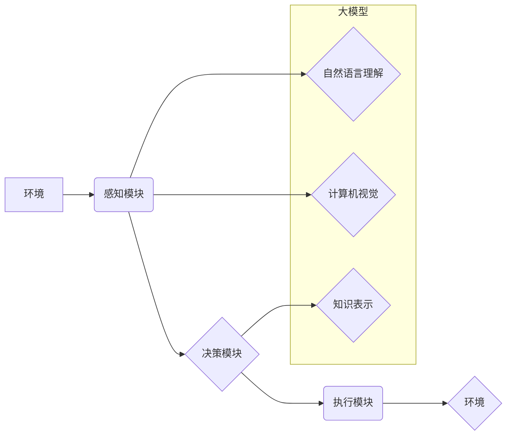

> 大模型，AI Agent，自然语言处理，计算机视觉，强化学习，知识表示，推理

## 1. 背景介绍

人工智能（AI）正以惊人的速度发展，其核心驱动力之一是大模型的涌现。大模型，通常指参数量超过数十亿甚至千亿的深度学习模型，凭借其强大的学习能力和泛化能力，在自然语言处理、计算机视觉、语音识别等领域取得了突破性进展。

AI Agent，即智能代理，是指能够感知环境、做出决策并与环境交互的智能体。传统的AI Agent通常依赖于规则或模板驱动的系统，其智能程度有限。而大模型的出现为AI Agent带来了新的机遇，使其能够具备更强的学习能力、适应能力和自主性。

## 2. 核心概念与联系

**2.1 AI Agent**

AI Agent是一个能够感知环境、做出决策并与环境交互的智能体。它通常由以下几个核心组件组成：

* **感知模块:** 用于获取环境信息，例如传感器数据、文本、图像等。
* **决策模块:** 用于根据感知到的信息做出决策，例如选择行动、制定策略等。
* **执行模块:** 用于执行决策，例如控制机器人运动、生成文本等。

**2.2 大模型**

大模型是指参数量超过数十亿甚至千亿的深度学习模型。它们通常通过大量的训练数据和计算资源进行训练，能够学习到复杂的模式和关系。

**2.3 核心概念联系**

大模型可以为AI Agent提供强大的能力，例如：

* **自然语言理解和生成:** 大模型可以理解和生成人类语言，使AI Agent能够与人类进行自然流畅的对话。
* **计算机视觉:** 大模型可以识别和理解图像和视频，使AI Agent能够感知周围环境。
* **知识表示和推理:** 大模型可以学习和表示知识，并进行推理和决策。

**2.4  Mermaid 流程图**



## 3. 核心算法原理 & 具体操作步骤

**3.1 算法原理概述**

大模型的训练通常基于深度学习算法，例如Transformer、BERT、GPT等。这些算法通过多层神经网络结构，学习输入数据之间的复杂关系，并生成相应的输出。

**3.2 算法步骤详解**

1. **数据预处理:** 将原始数据转换为模型可以理解的格式，例如文本数据需要进行分词、词向量化等处理。
2. **模型构建:** 根据具体的任务需求，选择合适的深度学习模型架构，并设置模型参数。
3. **模型训练:** 使用训练数据对模型进行训练，通过调整模型参数，使模型的输出与真实值尽可能接近。
4. **模型评估:** 使用测试数据评估模型的性能，例如准确率、召回率、F1-score等。
5. **模型部署:** 将训练好的模型部署到实际应用场景中，例如服务器、云平台等。

**3.3 算法优缺点**

* **优点:** 大模型能够学习到复杂的模式和关系，具有强大的泛化能力和适应能力。
* **缺点:** 大模型的训练需要大量的计算资源和时间，并且容易受到训练数据质量的影响。

**3.4 算法应用领域**

大模型在各个领域都有广泛的应用，例如：

* **自然语言处理:** 机器翻译、文本摘要、问答系统、聊天机器人等。
* **计算机视觉:** 图像识别、物体检测、图像分割、视频分析等。
* **语音识别:** 语音转文本、语音合成、语音助手等。
* **推荐系统:** 商品推荐、内容推荐、用户画像等。

## 4. 数学模型和公式 & 详细讲解 & 举例说明

**4.1 数学模型构建**

大模型的训练通常基于概率模型，例如条件概率分布或联合概率分布。这些模型试图学习输入数据和输出数据的之间的关系。

**4.2 公式推导过程**

例如，在自然语言处理任务中，可以使用条件概率分布来表示单词之间的关系。假设我们有一个句子“The cat sat on the mat”，我们可以使用条件概率分布来计算单词“sat”出现的概率，给定前后的单词：

$$P(\text{sat} | \text{The}, \text{cat}, \text{on}, \text{the}, \text{mat})$$

**4.3 案例分析与讲解**

通过训练大量的文本数据，大模型可以学习到单词之间的关系，并预测下一个单词出现的概率。例如，在句子“The cat sat on the mat”中，大模型可以学习到“sat”通常出现在“cat”和“on”之后，因此可以预测“sat”出现的概率较高。

## 5. 项目实践：代码实例和详细解释说明

**5.1 开发环境搭建**

* 操作系统: Ubuntu 20.04
* Python 版本: 3.8
* 深度学习框架: TensorFlow 2.x

**5.2 源代码详细实现**

```python
import tensorflow as tf

# 定义模型架构
model = tf.keras.Sequential([
    tf.keras.layers.Embedding(input_dim=10000, output_dim=128),
    tf.keras.layers.LSTM(units=128),
    tf.keras.layers.Dense(units=10000, activation='softmax')
])

# 编译模型
model.compile(optimizer='adam',
              loss='sparse_categorical_crossentropy',
              metrics=['accuracy'])

# 训练模型
model.fit(x_train, y_train, epochs=10)

# 评估模型
loss, accuracy = model.evaluate(x_test, y_test)
print('Loss:', loss)
print('Accuracy:', accuracy)
```

**5.3 代码解读与分析**

* `tf.keras.layers.Embedding`: 将单词转换为稠密的向量表示。
* `tf.keras.layers.LSTM`: 使用长短期记忆网络学习文本序列中的依赖关系。
* `tf.keras.layers.Dense`: 全连接层，用于预测下一个单词的概率。
* `optimizer`: 优化器，用于更新模型参数。
* `loss`: 损失函数，用于衡量模型预测结果与真实值的差异。
* `metrics`: 评估指标，用于衡量模型性能。

**5.4 运行结果展示**

训练完成后，可以将模型部署到实际应用场景中，例如聊天机器人、文本生成等。

## 6. 实际应用场景

**6.1 聊天机器人**

大模型可以用于构建更智能、更自然的聊天机器人。例如，Google 的 LaMDA 模型可以进行流畅、富有逻辑的对话，并能够理解和回应用户的各种问题和请求。

**6.2 文本生成**

大模型可以用于生成各种类型的文本，例如文章、故事、诗歌等。例如，OpenAI 的 GPT-3 模型可以生成高质量的文本，并能够根据用户的提示进行创作。

**6.3 机器翻译**

大模型可以用于提高机器翻译的准确性和流畅度。例如，Google 的 Transformer 模型在机器翻译任务中取得了显著的成果。

**6.4 未来应用展望**

大模型在未来将有更广泛的应用场景，例如：

* **个性化教育:** 根据学生的学习情况，提供个性化的学习内容和辅导。
* **医疗诊断:** 辅助医生进行疾病诊断和治疗方案制定。
* **科学研究:** 加速科学研究的进程，例如药物研发、材料科学等。

## 7. 工具和资源推荐

**7.1 学习资源推荐**

* **书籍:**
    * Deep Learning by Ian Goodfellow, Yoshua Bengio, and Aaron Courville
    * Natural Language Processing with Python by Steven Bird, Ewan Klein, and Edward Loper
* **在线课程:**
    * Stanford CS224N: Natural Language Processing with Deep Learning
    * DeepLearning.AI Specialization by Andrew Ng

**7.2 开发工具推荐**

* **TensorFlow:** 开源深度学习框架
* **PyTorch:** 开源深度学习框架
* **Hugging Face Transformers:** 大模型库

**7.3 相关论文推荐**

* Attention Is All You Need (Vaswani et al., 2017)
* BERT: Pre-training of Deep Bidirectional Transformers for Language Understanding (Devlin et al., 2018)
* GPT-3: Language Models are Few-Shot Learners (Brown et al., 2020)

## 8. 总结：未来发展趋势与挑战

**8.1 研究成果总结**

大模型在AI Agent领域取得了显著的进展，为AI Agent赋予了更强的学习能力、适应能力和自主性。

**8.2 未来发展趋势**

* **模型规模的进一步扩大:** 随着计算资源的不断发展，大模型的规模将继续扩大，从而提升其性能和能力。
* **模型训练方法的创新:** 研究人员将探索新的模型训练方法，例如自监督学习、强化学习等，以提高模型的效率和泛化能力。
* **模型解释性和可解释性的提升:** 研究人员将致力于提高大模型的解释性和可解释性，使其能够更好地理解模型的决策过程。

**8.3 面临的挑战**

* **计算资源的限制:** 大模型的训练需要大量的计算资源，这对于资源有限的机构或个人来说是一个挑战。
* **数据安全和隐私问题:** 大模型的训练需要大量的训练数据，这可能会涉及到数据安全和隐私问题。
* **模型偏见和公平性问题:** 大模型的训练数据可能存在偏见，这可能会导致模型产生偏见和不公平的结果。

**8.4 研究展望**

未来，大模型在AI Agent领域将继续发挥重要作用，并推动AI技术的进一步发展。研究人员将继续探索大模型的潜力，并解决其面临的挑战，以实现更智能、更安全、更公平的AI应用。

## 9. 附录：常见问题与解答

**9.1 如何选择合适的深度学习框架？**

选择深度学习框架需要根据具体的项目需求和个人喜好。TensorFlow 和 PyTorch 是两个最受欢迎的框架，它们都具有强大的功能和活跃的社区支持。

**9.2 如何训练大模型？**

训练大模型需要大量的计算资源、时间和数据。可以使用云计算平台或高性能计算集群进行训练。

**9.3 如何解决大模型的偏见问题？**

可以通过以下方法来解决大模型的偏见问题：

* 使用更公平、更代表性的训练数据。
* 在训练过程中加入公平性约束。
* 对模型的输出进行评估和校正。


作者：禅与计算机程序设计艺术 / Zen and the Art of Computer Programming 
<end_of_turn>