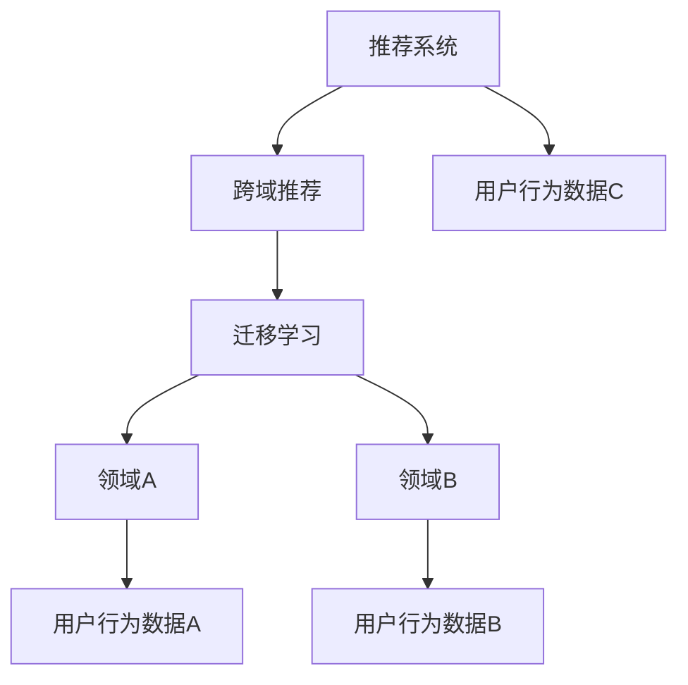

                 

# 基于迁移学习的跨域推荐算法

## 1. 背景介绍

在数字化时代，推荐系统已经成为影响用户决策的重要工具。无论是电商、新闻媒体、社交平台，还是音乐视频等，推荐系统都能通过精准的推荐，提升用户体验和转化率。然而，推荐系统面临的一个主要问题是，在某一特定领域内收集到的数据往往不足以覆盖用户的全部兴趣和行为模式。这种数据分布的不均衡，使得传统推荐算法在该领域内难以发挥其最大效果。

为了解决这一问题，基于迁移学习的跨域推荐算法应运而生。这种算法通过将一个领域的数据和知识迁移到另一个领域，利用知识共享和泛化能力，弥补单个领域数据的不足，从而提升推荐效果。本文将深入探讨基于迁移学习的跨域推荐算法，探讨其在推荐系统中的实际应用和未来发展方向。

## 2. 核心概念与联系

### 2.1 核心概念概述

为更好地理解基于迁移学习的跨域推荐算法，本节将介绍几个密切相关的核心概念：

- **迁移学习(Transfer Learning)**：指将一个领域学习到的知识，迁移到另一个不同但相关的领域进行学习的过程。在推荐系统中，可以利用用户在其他领域的兴趣和行为数据，来提高其在目标领域的推荐效果。
- **跨域推荐(Cross-domain Recommendation)**：指在不同领域间进行推荐，如将电商用户的兴趣数据，迁移到音乐领域的推荐系统。跨域推荐可以扩展数据覆盖范围，提升推荐系统的综合效果。
- **推荐系统(Recommendation System)**：通过分析用户的历史行为数据，推荐用户可能感兴趣的产品、内容、服务等。推荐系统是迁移学习和跨域推荐算法的应用领域。

这些核心概念之间的逻辑关系可以通过以下Mermaid流程图来展示：



这个流程图展示了几者之间的关系：

1. 推荐系统利用用户行为数据进行推荐。
2. 跨域推荐在不同领域间进行推荐，可以扩展数据来源。
3. 迁移学习利用已有领域的知识，提升目标领域的推荐效果。

这些概念共同构成了推荐系统中的跨域推荐算法框架，使得推荐系统能够更好地适应用户多样化的需求。

## 3. 核心算法原理 & 具体操作步骤

### 3.1 算法原理概述

基于迁移学习的跨域推荐算法，本质上是一种在目标领域利用已有领域知识进行推荐的技术。其核心思想是，通过领域A的数据和知识，预测用户对领域B的兴趣，从而在领域B内进行推荐。

形式化地，假设领域A和领域B的相似度矩阵为 $S_{AB}$，其中 $s_{ij}$ 表示领域A中用户 $i$ 对项目 $j$ 的兴趣与领域B中用户 $i$ 对项目 $j$ 的兴趣的相似度。利用相似度矩阵和领域A的数据，可以预测领域B中用户 $i$ 对项目 $j$ 的兴趣 $y_{ij}$。

基于此，推荐算法可以通过最大化用户对推荐项目的主观评分，即优化目标函数：

$$
\max_{y_{ij}} \sum_{i,j} \log f(y_{ij}) - \log p(y_{ij})
$$

其中 $f(y_{ij})$ 为领域A的兴趣预测函数，$p(y_{ij})$ 为领域B的兴趣预测函数。通过最大化上述目标函数，推荐算法可以学习到在领域B中对用户 $i$ 的推荐项目 $j$。

### 3.2 算法步骤详解

基于迁移学习的跨域推荐算法一般包括以下几个关键步骤：

**Step 1: 准备领域数据**

- 收集领域A和领域B的用户行为数据，并进行预处理，如去除噪声、标准化等。
- 将用户行为数据转化为可用于算法计算的数值型特征。

**Step 2: 构建相似度矩阵**

- 使用相似性度量方法（如余弦相似度、皮尔逊相关系数等），计算领域A和领域B的用户对项目的兴趣相似度。
- 将相似度矩阵 $S_{AB}$ 转化为推荐算法需要的格式，如转置、归一化等操作。

**Step 3: 训练预测模型**

- 根据领域A的数据和相似度矩阵 $S_{AB}$，训练领域A的兴趣预测函数 $f(y_{ij})$。
- 根据领域B的数据和相似度矩阵 $S_{AB}$，训练领域B的兴趣预测函数 $p(y_{ij})$。

**Step 4: 生成推荐列表**

- 在领域B中，利用训练好的兴趣预测函数 $p(y_{ij})$，对用户 $i$ 的推荐项目 $j$ 进行评分预测。
- 根据评分预测结果，排序生成推荐列表。

**Step 5: 测试与优化**

- 在领域B的测试数据集上，评估推荐列表的效果，如平均绝对误差(MAE)、均方误差(MSE)等指标。
- 根据评估结果，调整模型参数，如学习率、正则化强度等，优化推荐效果。

### 3.3 算法优缺点

基于迁移学习的跨域推荐算法具有以下优点：

- 数据利用率高。通过跨域迁移，可以在数据不足的目标领域中，利用已有领域的数据和知识，提升推荐效果。
- 推荐效果稳定。由于利用已有领域的数据和知识，可以减小目标领域数据噪声的影响，推荐结果更为稳定。
- 泛化能力强。迁移学习使得推荐算法在未见过的目标领域中，依然能够保持良好的表现。

同时，该算法也存在一定的局限性：

- 领域差异大。当领域A和领域B的差异过大时，迁移效果可能不佳，推荐算法需要更多的迭代优化。
- 数据获取难。获取领域A和领域B的数据可能较为困难，需要跨领域数据的获取渠道和能力。
- 计算复杂度高。构建相似度矩阵和训练预测模型需要较高的计算资源，特别是在大规模数据集上。

尽管存在这些局限性，但就目前而言，基于迁移学习的跨域推荐方法仍然是推荐系统中一个重要的研究方向。未来相关研究的重点在于如何进一步降低计算复杂度，提高算法在多领域之间的泛化能力，同时兼顾可解释性和鲁棒性等因素。

### 3.4 算法应用领域

基于迁移学习的跨域推荐算法已经在电商、音乐、视频等多个领域得到了应用，覆盖了从个性化推荐到内容推荐、商品推荐等多种业务场景。例如：

- 电商推荐系统：将用户的浏览、购买历史等行为数据，迁移到音乐领域，为用户推荐相关音乐和商品。
- 视频推荐系统：将用户对不同视频类别的兴趣数据，迁移到新闻领域，推荐用户可能感兴趣的新闻内容。
- 音乐推荐系统：将用户对音乐类型的兴趣数据，迁移到电影领域，为用户推荐电影和音乐。

除了上述这些经典任务外，跨域推荐算法还被创新性地应用到更多场景中，如个性化搜索、社交网络推荐、广告定向投放等，为推荐系统的多领域应用带来了新的可能。

## 4. 数学模型和公式 & 详细讲解 & 举例说明

### 4.1 数学模型构建

本节将使用数学语言对基于迁移学习的跨域推荐算法进行更加严格的刻画。

记领域A和领域B的用户行为数据分别为 $\mathbf{X}_A \in \mathbb{R}^{n_A \times d}$ 和 $\mathbf{X}_B \in \mathbb{R}^{n_B \times d}$，其中 $n_A$ 和 $n_B$ 分别为领域A和领域B的样本数，$d$ 为特征维度。设领域A和领域B的相似度矩阵为 $S_{AB} \in \mathbb{R}^{n_B \times n_A}$。

定义领域A的兴趣预测函数为 $f(y_{ij}) = \mathbf{w}_A^T \phi(\mathbf{x}_A^{(i)})$，其中 $\mathbf{w}_A$ 为领域A的兴趣权重向量，$\phi(\cdot)$ 为特征映射函数，$\mathbf{x}_A^{(i)}$ 表示领域A中用户 $i$ 的特征向量。

类似地，定义领域B的兴趣预测函数为 $p(y_{ij}) = \mathbf{w}_B^T \phi(\mathbf{x}_B^{(i)})$，其中 $\mathbf{w}_B$ 为领域B的兴趣权重向量，$\phi(\cdot)$ 为特征映射函数，$\mathbf{x}_B^{(i)}$ 表示领域B中用户 $i$ 的特征向量。

### 4.2 公式推导过程

接下来，我们将推导基于相似度矩阵的跨域推荐算法公式。

根据相似度矩阵 $S_{AB}$，可以得到以下线性回归模型：

$$
\mathbf{y}_B = \mathbf{S}_{AB} \mathbf{y}_A
$$

其中 $\mathbf{y}_A \in \mathbb{R}^{n_B \times 1}$ 和 $\mathbf{y}_B \in \mathbb{R}^{n_B \times 1}$ 分别为领域A和领域B的兴趣预测向量。将 $\mathbf{y}_B$ 代入领域B的兴趣预测函数 $p(y_{ij})$，得：

$$
p(y_{ij}) = \mathbf{w}_B^T \phi(\mathbf{x}_B^{(i)}) = \mathbf{w}_B^T \phi(\mathbf{S}_{AB} \mathbf{w}_A \phi(\mathbf{x}_A^{(i)}))
$$

为了方便计算，通常会将特征映射函数 $\phi(\cdot)$ 简化为线性映射，即 $\phi(\cdot) = \mathbf{u}^T \cdot$。则上式可以进一步化简为：

$$
p(y_{ij}) = \mathbf{w}_B^T (\mathbf{S}_{AB} \mathbf{w}_A) \mathbf{u}^T \mathbf{x}_A^{(i)}
$$

定义 $\mathbf{W} = \mathbf{S}_{AB} \mathbf{w}_A$ 为领域A和领域B之间的迁移矩阵，则有：

$$
p(y_{ij}) = \mathbf{w}_B^T \mathbf{W} \mathbf{u}^T \mathbf{x}_A^{(i)}
$$

将 $\mathbf{y}_A$ 表示为 $\mathbf{w}_A$ 的线性组合：

$$
\mathbf{y}_A = \mathbf{W}^T \mathbf{y}_B
$$

则推荐算法可以表示为：

$$
\max_{\mathbf{y}_B} \sum_{i,j} \log p(y_{ij}) - \log f(y_{ij})
$$

根据最大化目标函数，得到最终推荐结果为：

$$
\mathbf{y}_B = \mathbf{W}^T \mathbf{y}_A
$$

### 4.3 案例分析与讲解

假设我们有一个电商推荐系统，目标是为用户推荐商品。领域A为电商网站的用户行为数据，领域B为音乐网站的用户行为数据。我们将音乐网站的用户行为数据，迁移到电商网站，用于推荐相关商品。

具体而言，我们收集电商网站的用户浏览历史、购买历史等行为数据，构建用户对商品的兴趣预测模型 $f(y_{ij})$。然后，收集音乐网站的用户听歌历史、评价历史等行为数据，构建用户对音乐的兴趣预测模型 $p(y_{ij})$。

通过相似度矩阵计算，我们可以得到领域A和领域B之间的迁移矩阵 $\mathbf{W}$。将 $\mathbf{W}$ 代入电商网站的兴趣预测模型 $f(y_{ij})$，得到电商网站用户对商品的兴趣预测向量 $\mathbf{y}_A$。

最终，我们将 $\mathbf{y}_A$ 代入电商网站的推荐模型，生成推荐列表，为用户推荐可能感兴趣的商品。

## 5. 项目实践：代码实例和详细解释说明

### 5.1 开发环境搭建

在进行跨域推荐实践前，我们需要准备好开发环境。以下是使用Python进行PyTorch开发的环境配置流程：

1. 安装Anaconda：从官网下载并安装Anaconda，用于创建独立的Python环境。

2. 创建并激活虚拟环境：
```bash
conda create -n cross_domain_env python=3.8 
conda activate cross_domain_env
```

3. 安装PyTorch：根据CUDA版本，从官网获取对应的安装命令。例如：
```bash
conda install pytorch torchvision torchaudio cudatoolkit=11.1 -c pytorch -c conda-forge
```

4. 安装各类工具包：
```bash
pip install numpy pandas scikit-learn matplotlib tqdm jupyter notebook ipython
```

完成上述步骤后，即可在`cross_domain_env`环境中开始跨域推荐实践。

### 5.2 源代码详细实现

下面我们以电商推荐系统为例，给出使用PyTorch进行跨域推荐开发的PyTorch代码实现。

首先，定义领域A和领域B的数据处理函数：

```python
import torch
import numpy as np
from sklearn.metrics.pairwise import cosine_similarity

class DomainAData(Dataset):
    def __init__(self, X, Y):
        self.X = X
        self.Y = Y
        
    def __len__(self):
        return len(self.X)
    
    def __getitem__(self, item):
        return self.X[item], self.Y[item]

class DomainBData(Dataset):
    def __init__(self, X, Y):
        self.X = X
        self.Y = Y
        
    def __len__(self):
        return len(self.X)
    
    def __getitem__(self, item):
        return self.X[item], self.Y[item]
```

然后，定义相似度矩阵的计算函数：

```python
def calculate_similarity_matrix(X_A, X_B):
    similarity_matrix = cosine_similarity(X_A, X_B)
    return similarity_matrix
```

接着，定义预测模型的训练函数：

```python
from torch.optim import Adam

def train_model(X_A, Y_A, X_B, Y_B, epochs, learning_rate):
    X_A = torch.from_numpy(X_A).float()
    X_B = torch.from_numpy(X_B).float()
    Y_A = torch.from_numpy(Y_A).float()
    Y_B = torch.from_numpy(Y_B).float()
    
    similarity_matrix = calculate_similarity_matrix(X_A, X_B)
    W = torch.from_numpy(np.dot(similarity_matrix, Y_A))
    
    W.data.normal_(0, 0.01)
    W.requires_grad_()
    
    Y_A_hat = torch.matmul(W, Y_B)
    
    criterion = torch.nn.L1Loss()
    optimizer = Adam([W], lr=learning_rate)
    
    for epoch in range(epochs):
        optimizer.zero_grad()
        Y_A_hat = Y_A_hat.to('cpu')
        Y_A = Y_A.to('cpu')
        loss = criterion(Y_A_hat, Y_A)
        loss.backward()
        optimizer.step()
    
    return Y_A_hat, W
```

最后，进行测试和评估：

```python
from sklearn.metrics import mean_absolute_error, mean_squared_error

def test_model(X_A, Y_A, X_B, Y_B, Y_A_hat, W):
    X_A = torch.from_numpy(X_A).float()
    X_B = torch.from_numpy(X_B).float()
    Y_A = torch.from_numpy(Y_A).float()
    Y_B = torch.from_numpy(Y_B).float()
    
    Y_A_hat = torch.matmul(W, Y_B)
    
    mae = mean_absolute_error(Y_A, Y_A_hat)
    mse = mean_squared_error(Y_A, Y_A_hat)
    
    return mae, mse
```

在测试过程中，可以调用测试函数，计算推荐结果与真实结果的MAE和MSE，评估推荐效果。

### 5.3 代码解读与分析

让我们再详细解读一下关键代码的实现细节：

**DomainAData和DomainBData类**：
- `__init__`方法：初始化领域A和领域B的特征和标签。
- `__len__`方法：返回数据集的样本数量。
- `__getitem__`方法：对单个样本进行处理，返回特征和标签。

**calculate_similarity_matrix函数**：
- 利用sklearn的cosine_similarity方法计算领域A和领域B的相似度矩阵。

**train_model函数**：
- 将领域A和领域B的数据转化为PyTorch的Tensor类型，并计算相似度矩阵 $S_{AB}$。
- 根据 $S_{AB}$ 和领域A的标签 $\mathbf{y}_A$，计算迁移矩阵 $\mathbf{W}$。
- 使用L1损失函数，通过Adam优化器训练迁移矩阵 $\mathbf{W}$。
- 训练结束后，返回迁移矩阵 $\mathbf{W}$ 和用户对商品的兴趣预测向量 $\mathbf{y}_A$。

**test_model函数**：
- 将领域A和领域B的数据转化为PyTorch的Tensor类型，并计算用户对商品的兴趣预测向量 $\mathbf{y}_A$。
- 计算推荐结果与真实结果的MAE和MSE，评估推荐效果。

通过上述代码实现，可以看出PyTorch在跨域推荐任务中的应用相当便捷。用户只需要定义好领域A和领域B的数据，调用训练函数和测试函数，即可得到推荐结果。

## 6. 实际应用场景

### 6.1 智能广告推荐

智能广告推荐是推荐系统的重要应用之一。传统广告推荐通常依赖于用户历史行为数据，但在用户访问某个广告位前，可能无法收集到其行为数据。

通过基于迁移学习的跨域推荐算法，广告推荐系统可以利用用户在其他广告位上的行为数据，预测用户对当前广告位的兴趣。例如，假设我们有一个电商广告推荐系统，可以通过用户对其他广告位的点击数据，预测用户对当前广告位的兴趣，从而实现跨广告位的推荐。

### 6.2 跨媒体内容推荐

跨媒体内容推荐是指在不同媒体之间进行内容推荐，如将用户对视频内容的兴趣数据，迁移到音频内容领域，为用户推荐相关音频内容。

例如，在视频平台上，用户对不同视频类型的兴趣数据，可以迁移到音乐平台上，为用户推荐相关音乐。通过迁移学习，跨媒体推荐系统可以最大化不同媒体之间的数据共享，提升推荐效果。

### 6.3 跨平台推荐

跨平台推荐是指在不同的平台之间进行推荐，如将用户对电商平台的商品兴趣数据，迁移到社交平台的商品推荐。跨平台推荐可以提升用户在不同平台之间的连贯性，增强用户粘性。

例如，在社交平台上，用户对电商平台的商品评价数据，可以迁移到电商平台的商品推荐中，从而提升用户对商品的多样化探索。

### 6.4 未来应用展望

随着跨域推荐算法的不断优化和普及，其在推荐系统中的应用场景将更加广泛。未来，我们可以预见到以下应用方向：

1. **多模态推荐**：将用户在不同模态数据上的行为数据，如文本、图像、音频等，进行跨模态的迁移学习，提升推荐效果。多模态推荐可以覆盖用户更丰富的行为数据，提升推荐系统的综合性能。

2. **个性化搜索**：利用用户的搜索历史和兴趣数据，进行跨领域推荐，为用户推荐可能感兴趣的内容和商品。个性化搜索可以提升用户搜索体验，减少搜索时间。

3. **社交网络推荐**：利用用户在社交网络上的行为数据，进行跨网络推荐，提升用户在不同社交网络平台之间的粘性。社交网络推荐可以增强用户在不同平台之间的连贯性，提升社交网络的用户活跃度。

4. **广告定向投放**：利用用户在广告位上的行为数据，进行跨广告位推荐，提升广告的转化率和用户参与度。广告定向投放可以最大化广告投放的效果，实现精准营销。

5. **跨文化推荐**：利用不同文化背景下的用户行为数据，进行跨文化推荐，提升文化多样性下的用户推荐效果。跨文化推荐可以覆盖不同文化背景下的用户需求，提升推荐系统的覆盖范围。

总之，基于迁移学习的跨域推荐算法，将在推荐系统的各个应用场景中发挥重要作用，为用户带来更加精准和个性化的推荐体验。未来，跨域推荐算法的发展将更加深入，应用场景将更加多样，成为推荐系统的重要技术手段。

## 7. 工具和资源推荐

### 7.1 学习资源推荐

为了帮助开发者系统掌握跨域推荐算法的理论基础和实践技巧，这里推荐一些优质的学习资源：

1. 《推荐系统实战》系列博文：由大模型技术专家撰写，深入浅出地介绍了推荐系统的工作原理、经典算法和实际应用。

2. Coursera《推荐系统》课程：斯坦福大学开设的推荐系统经典课程，详细讲解了推荐系统的各个环节，包括数据获取、算法设计和应用部署。

3. 《推荐系统导论》书籍：陈学东著，全面介绍了推荐系统的基础知识和算法设计，是推荐系统入门必读书籍。

4. Kaggle推荐系统竞赛：参与Kaggle举办的推荐系统竞赛，实践经典推荐算法，锻炼实际应用能力。

5. GitHub推荐系统项目：浏览GitHub上的推荐系统开源项目，学习优秀的推荐算法实现，提升代码实现能力。

通过对这些资源的学习实践，相信你一定能够快速掌握跨域推荐算法的精髓，并用于解决实际的推荐问题。

### 7.2 开发工具推荐

高效的开发离不开优秀的工具支持。以下是几款用于跨域推荐开发的常用工具：

1. PyTorch：基于Python的开源深度学习框架，灵活动态的计算图，适合快速迭代研究。大部分推荐算法都有PyTorch版本的实现。

2. TensorFlow：由Google主导开发的开源深度学习框架，生产部署方便，适合大规模工程应用。同样有丰富的推荐算法资源。

3. Scikit-learn：Python中的机器学习库，提供了丰富的算法和工具，适合数据处理和模型评估。

4. Weights & Biases：模型训练的实验跟踪工具，可以记录和可视化模型训练过程中的各项指标，方便对比和调优。与主流深度学习框架无缝集成。

5. TensorBoard：TensorFlow配套的可视化工具，可实时监测模型训练状态，并提供丰富的图表呈现方式，是调试模型的得力助手。

6. Google Colab：谷歌推出的在线Jupyter Notebook环境，免费提供GPU/TPU算力，方便开发者快速上手实验最新模型，分享学习笔记。

合理利用这些工具，可以显著提升跨域推荐任务的开发效率，加快创新迭代的步伐。

### 7.3 相关论文推荐

跨域推荐技术的发展源于学界的持续研究。以下是几篇奠基性的相关论文，推荐阅读：

1. Domain Adaptation for Recommendation Systems：提出基于领域适应的推荐系统方法，利用领域知识提升推荐效果。

2. Cross-Domain Recommendation Based on Relevance Feedback: A Survey：全面综述了跨域推荐的最新进展，分析了不同算法的效果和适用场景。

3. Cross-Domain Recommendation System with Multi-Level Deep Matrix Factorization：提出基于多级深度矩阵分解的跨域推荐算法，提升推荐效果和泛化能力。

4. Multimodal Cross-Domain Recommendation with Domain-Specific Features：提出基于多模态特征的跨域推荐方法，最大化不同模态之间的数据共享。

5. MetaCross: A Multimodal Cross-Domain Recommendation Framework：提出基于元学习的跨域推荐框架，利用元知识进行推荐系统的迁移学习。

这些论文代表了大语言模型跨域推荐技术的发展脉络。通过学习这些前沿成果，可以帮助研究者把握学科前进方向，激发更多的创新灵感。

## 8. 总结：未来发展趋势与挑战

### 8.1 总结

本文对基于迁移学习的跨域推荐算法进行了全面系统的介绍。首先阐述了跨域推荐算法的背景和意义，明确了跨域推荐在推荐系统中的重要价值。其次，从原理到实践，详细讲解了跨域推荐算法的数学模型和实现步骤，给出了跨域推荐任务开发的完整代码实例。同时，本文还广泛探讨了跨域推荐算法在智能广告推荐、跨媒体内容推荐、跨平台推荐等实际应用场景中的应用前景，展示了跨域推荐算法的广泛应用潜力。

通过本文的系统梳理，可以看到，基于迁移学习的跨域推荐算法已经广泛应用在推荐系统中的各个领域，显著提升了推荐效果。未来，随着跨域推荐算法的研究不断深入，其在推荐系统中的应用将更加广泛，为用户带来更加精准和个性化的推荐体验。

### 8.2 未来发展趋势

展望未来，跨域推荐算法将呈现以下几个发展趋势：

1. **多模态跨域推荐**：将用户在不同模态数据上的行为数据，如文本、图像、音频等，进行跨模态的迁移学习，提升推荐效果。多模态跨域推荐可以覆盖用户更丰富的行为数据，提升推荐系统的综合性能。

2. **个性化搜索推荐**：利用用户的搜索历史和兴趣数据，进行跨领域推荐，为用户推荐可能感兴趣的内容和商品。个性化搜索推荐可以提升用户搜索体验，减少搜索时间。

3. **社交网络跨域推荐**：利用用户在社交网络上的行为数据，进行跨网络推荐，提升用户在不同社交网络平台之间的粘性。社交网络跨域推荐可以增强用户在不同平台之间的连贯性，提升社交网络的用户活跃度。

4. **广告定向投放推荐**：利用用户在广告位上的行为数据，进行跨广告位推荐，提升广告的转化率和用户参与度。广告定向投放推荐可以最大化广告投放的效果，实现精准营销。

5. **跨文化推荐**：利用不同文化背景下的用户行为数据，进行跨文化推荐，提升文化多样性下的用户推荐效果。跨文化推荐可以覆盖不同文化背景下的用户需求，提升推荐系统的覆盖范围。

以上趋势凸显了跨域推荐算法的广阔前景。这些方向的探索发展，必将进一步提升推荐系统的推荐效果和用户体验，成为推荐系统的重要技术手段。

### 8.3 面临的挑战

尽管跨域推荐算法已经取得了瞩目成就，但在迈向更加智能化、普适化应用的过程中，它仍面临诸多挑战：

1. **数据获取难度大**：获取跨域数据可能较为困难，需要跨领域数据的获取渠道和能力。如何获取和处理跨域数据，是跨域推荐算法面临的主要挑战之一。

2. **计算复杂度高**：构建相似度矩阵和训练预测模型需要较高的计算资源，特别是在大规模数据集上。如何在保持高精度的情况下，降低计算复杂度，是跨域推荐算法的技术难点。

3. **领域差异大**：当领域A和领域B的差异过大时，迁移效果可能不佳，推荐算法需要更多的迭代优化。如何优化跨域推荐算法，使其适应不同领域之间的差异，是一个重要研究方向。

4. **模型泛化能力不足**：虽然跨域推荐算法可以利用已有领域的数据和知识，但在目标领域内，可能仍存在泛化能力不足的问题。如何提升跨域推荐算法的泛化能力，使其在未见过的目标领域中，依然能够保持良好的表现，是一个亟待解决的问题。

5. **算法鲁棒性不足**：跨域推荐算法在面对数据噪声和偏差时，可能表现出较差的鲁棒性。如何提高跨域推荐算法的鲁棒性，使其在复杂多变的环境中，依然能够保持稳定可靠的表现，是一个重要的研究方向。

6. **可解释性不足**：跨域推荐算法通常缺乏可解释性，难以解释其内部工作机制和决策逻辑。如何增强跨域推荐算法的可解释性，使其能够为用户提供更加透明的推荐结果，是一个重要的研究方向。

这些挑战需要学界和产业界的共同努力，通过不断的技术创新和优化，才能够克服。相信随着跨域推荐算法的研究不断深入，其在推荐系统中的应用将更加广泛，为用户带来更加精准和个性化的推荐体验。

### 8.4 研究展望

未来，跨域推荐算法的研究可以从以下几个方面进行探索：

1. **无监督跨域推荐**：探索无监督跨域推荐方法，摆脱对大规模标注数据的依赖，利用自监督学习、主动学习等无监督范式，最大限度利用非结构化数据，实现更加灵活高效的跨域推荐。

2. **元学习跨域推荐**：结合元学习和迁移学习，通过学习元知识进行跨域推荐，提升推荐算法的泛化能力和适应性。

3. **跨域知识图谱推荐**：将知识图谱与跨域推荐算法结合，利用知识图谱中的实体和关系信息，提升推荐算法的准确性和可解释性。

4. **跨域自适应推荐**：通过自适应算法，动态调整推荐算法中的参数，适应不同领域之间的数据分布差异，提升推荐效果。

5. **跨域异常检测**：利用跨域数据，进行异常检测和风险预警，及时发现用户行为中的异常模式，提升推荐系统的安全性。

6. **跨域用户画像**：利用不同领域的用户行为数据，构建跨域用户画像，提升推荐算法的个性化推荐能力。

这些研究方向的探索，必将引领跨域推荐算法迈向更高的台阶，为推荐系统带来更广泛的创新应用，为用户带来更加精准和个性化的推荐体验。

## 9. 附录：常见问题与解答

**Q1：跨域推荐算法是否适用于所有推荐场景？**

A: 跨域推荐算法在大多数推荐场景中都能取得不错的效果，特别是在领域差异较大的推荐场景中表现更为突出。但对于一些特定领域的推荐场景，如小众领域的推荐，可能需要额外的定制化算法进行优化。

**Q2：如何选择合适的相似度度量方法？**

A: 选择合适的相似度度量方法对跨域推荐算法的性能影响较大。一般来说，余弦相似度和皮尔逊相关系数是常用的相似度度量方法，需要根据具体任务和数据特点进行选择。

**Q3：跨域推荐算法是否会引入新的数据噪声？**

A: 跨域推荐算法在迁移学习过程中，可能会引入一定的数据噪声。但通过正则化和权重调整等方法，可以有效降低噪声影响，提升推荐效果。

**Q4：如何提高跨域推荐算法的泛化能力？**

A: 提高跨域推荐算法的泛化能力，需要在大规模数据集上进行模型训练，并利用元学习和自适应算法，动态调整模型参数，适应不同领域之间的数据分布差异。

**Q5：跨域推荐算法是否会受到领域偏置的影响？**

A: 跨域推荐算法在迁移学习过程中，可能会受到领域偏置的影响。通过引入多领域数据和领域知识，可以有效减轻偏置影响，提升推荐结果的公平性和可靠性。

这些问题的解答，展示了跨域推荐算法在实际应用中的关键问题和解决方法，有助于开发者更好地理解和使用该技术。

---

作者：禅与计算机程序设计艺术 / Zen and the Art of Computer Programming

