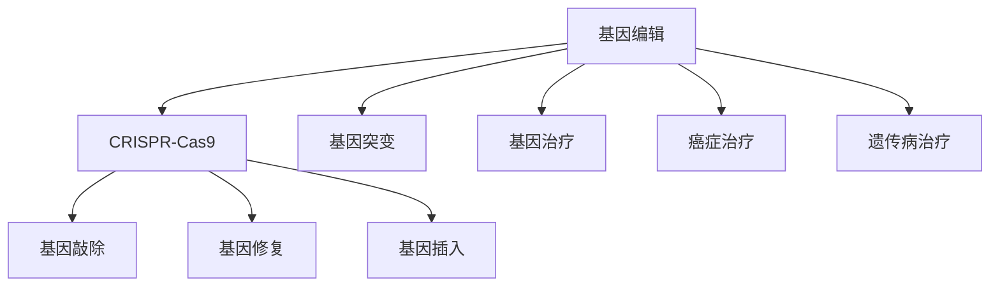

                 

# 基因编辑技术CRISPR在医学中的应用：精准治疗

> 关键词：基因编辑,CRISPR,医学应用,精准治疗,基因突变,癌症治疗,遗传病治疗

## 1. 背景介绍

### 1.1 问题由来

基因编辑技术是21世纪最前沿的生物技术之一，它能够精确地修改生物体的DNA序列，对医学、农业、生态等领域产生了深远影响。其中，CRISPR（Clustered Regularly Interspaced Short Palindromic Repeats）基因编辑技术，因其高效、准确、低成本的特点，被广泛用于生物学研究、临床试验和实际应用中。CRISPR技术为精准治疗提供了前所未有的可能性，对于治愈癌症、遗传病等重大疾病具有重要的意义。

### 1.2 问题核心关键点

CRISPR技术主要由两部分组成：Cas9核酸酶和gRNA（向导RNA）。Cas9酶能够切割DNA，而gRNA则引导Cas9酶准确地定位到目标基因位置。CRISPR技术通过设计特定的gRNA序列，可以精确地修改基因组中的特定DNA序列，实现基因敲除、基因修复或基因插入等功能。CRISPR技术的精准性、高效性和低成本性使其在医学领域具有巨大的应用潜力。

## 2. 核心概念与联系

### 2.1 核心概念概述

为更好地理解CRISPR技术在医学中的应用，本节将介绍几个密切相关的核心概念：

- **基因编辑**：通过精确地修改生物体的基因组，改变其表型和性状的技术。
- **CRISPR-Cas9**：一种基于细菌天然免疫系统的基因编辑技术，能够精确、高效地进行基因组编辑。
- **基因突变**：DNA序列的异常改变，可能引起遗传病、癌症等疾病。
- **基因治疗**：通过基因编辑技术修复或替换致病基因，治疗遗传疾病。
- **癌症治疗**：利用CRISPR技术精准地编辑肿瘤细胞基因，抑制肿瘤生长。
- **遗传病治疗**：通过CRISPR技术修复或替换遗传缺陷基因，预防或治愈遗传疾病。

这些核心概念之间的逻辑关系可以通过以下Mermaid流程图来展示：



这个流程图展示了几类重要概念及其之间的关系：

1. **基因编辑**通过CRISPR技术进行，能够实现**基因敲除**、**基因修复**和**基因插入**。
2. **基因突变**是基因编辑的主要应用对象，通过基因编辑可以修复或替换突变基因。
3. **基因治疗**和**癌症治疗**是CRISPR技术的主要应用场景，能够通过基因编辑精准治疗疾病。
4. **遗传病治疗**也是CRISPR技术的重要应用领域，能够通过基因编辑预防或治愈遗传疾病。

## 3. 核心算法原理 & 具体操作步骤
### 3.1 算法原理概述

CRISPR-Cas9基因编辑技术的核心原理是利用Cas9酶和gRNA向导精确地切割DNA双链，并在切割位点处进行DNA序列的添加、删除或替换。CRISPR技术的核心步骤包括设计gRNA序列、构建CRISPR系统、将CRISPR系统导入细胞、靶向基因组编辑和编辑效果验证。

### 3.2 算法步骤详解

CRISPR基因编辑技术的详细步骤：

**Step 1: 设计gRNA序列**
- 根据目标基因的序列，设计特定的gRNA序列，确保其能够精确地导向Cas9酶到目标基因位置。

**Step 2: 构建CRISPR系统**
- 将Cas9基因与设计的gRNA序列组合，构建CRISPR-Cas9系统。

**Step 3: 将CRISPR系统导入细胞**
- 通过电转、病毒感染、化学试剂等方式，将CRISPR系统导入目标细胞。

**Step 4: 靶向基因组编辑**
- Cas9酶在gRNA的引导下，精确地切割目标DNA序列，导致DNA双链断裂。

**Step 5: 编辑效果验证**
- 使用PCR、测序等技术，验证编辑效果，确保基因组已被正确修改。

### 3.3 算法优缺点

CRISPR基因编辑技术具有以下优点：
1. 高效精准：通过设计特定的gRNA序列，能够实现对目标基因的精准编辑。
2. 低成本：CRISPR系统的构建和应用成本较低，易于大规模推广。
3. 灵活多样：可以实现基因敲除、基因修复、基因插入等多种基因编辑方式。

但同时也存在以下缺点：
1. 基因编辑不完全：部分细胞可能无法被有效编辑，导致编辑效果不稳定。
2. 可能引起脱靶效应：非目标基因可能被错误编辑，导致意外突变。
3. 编辑效率较低：CRISPR技术在某些基因上的编辑效率较低，需要多次尝试才能成功。

### 3.4 算法应用领域

CRISPR基因编辑技术在医学领域具有广泛的应用前景，覆盖了从基础研究到临床治疗的各个层面：

- **基础研究**：用于基因功能研究、基因表达调控、基因网络构建等。
- **基因治疗**：通过修复或替换致病基因，预防或治愈遗传疾病。
- **癌症治疗**：通过基因编辑抑制肿瘤细胞的生长和扩散，增强癌症治疗效果。
- **传染病治疗**：通过编辑免疫细胞的基因，增强对病原体的识别和消灭能力。
- **农业应用**：通过编辑作物基因，提高产量和抗病性，促进食品安全。

## 4. 数学模型和公式 & 详细讲解 & 举例说明

### 4.1 数学模型构建

基因编辑的效果可以通过数学模型来量化。假设基因组长度为L，gRNA序列的长度为l，目标基因的精确切割概率为p。则CRISPR系统的编辑效率可以表示为：

$$
\text{编辑效率} = p \times \frac{l}{L}
$$

其中，p表示gRNA序列在基因组中精确导向Cas9酶的概率，l表示gRNA序列的长度，L表示基因组的总长度。

### 4.2 公式推导过程

CRISPR系统的编辑效率主要由gRNA序列的精确导向能力和gRNA序列的长度决定。在gRNA序列设计时，需要考虑以下几个因素：

1. **精确导向能力**：gRNA序列与目标基因的匹配程度越高，Cas9酶的切割效率越高。因此，需要设计高匹配度的gRNA序列。
2. **序列长度**：gRNA序列长度不宜过短，否则可能无法有效导向Cas9酶。同时，序列长度也不宜过长，否则可能影响gRNA的稳定性和表达效率。
3. **多序列设计**：为了提高编辑效率，可以设计多个gRNA序列，分别针对不同的基因位点进行编辑。

### 4.3 案例分析与讲解

以CRISPR技术在癌症治疗中的应用为例，分析其数学模型和推导过程。

假设癌症细胞中有K个靶基因，每个基因的编辑效率为p_i。则癌症细胞的整体编辑效率可以表示为：

$$
\text{整体编辑效率} = \prod_{i=1}^K p_i
$$

为了提高整体编辑效率，可以设计多个gRNA序列，分别针对不同的靶基因进行编辑。假设设计了n个gRNA序列，则整体的编辑效率可以表示为：

$$
\text{整体编辑效率} = \left(\prod_{i=1}^K p_i\right)^n
$$

通过设计多个gRNA序列，可以显著提高癌症细胞的编辑效率，实现精准治疗。

## 5. 项目实践：代码实例和详细解释说明
### 5.1 开发环境搭建

在进行基因编辑实践前，我们需要准备好开发环境。以下是使用Python进行CRISPR-Cas9开发的环境配置流程：

1. 安装Anaconda：从官网下载并安装Anaconda，用于创建独立的Python环境。

2. 创建并激活虚拟环境：
```bash
conda create -n crispr-env python=3.8 
conda activate crispr-env
```

3. 安装CRISPR相关库：
```bash
pip install CRISPRpy PyCas9 protools
```

4. 安装必要的生物信息学工具：
```bash
pip install biopython pandas numpy
```

完成上述步骤后，即可在`crispr-env`环境中开始基因编辑实践。

### 5.2 源代码详细实现

我们以CRISPR技术在癌症治疗中的应用为例，给出CRISPR系统的Python代码实现。

```python
from crisprpy import CRISPRSystem, Cas9, gRNA
from biopython import SeqIO
import pandas as pd
import numpy as np

# 设计gRNA序列
gRNA_list = [
    gRNA("GTTAAACCGCAGCAGGACTATAC"),
    gRNA("TGTTAAACCGCAGCAGGACTATAC")
]

# 构建CRISPR系统
cas9 = Cas9()
crispr = CRISPRSystem(cas9, gRNA_list)

# 导入癌症细胞的基因组序列
genome = SeqIO.read("genome.fa", "fasta")
target_genes = genome.split()

# 对每个目标基因进行基因编辑
edited_genes = []
for gene in target_genes:
    EditedGene = crispr.edit_gene(gene)
    edited_genes.append(EditedGene)

# 计算编辑效率
edit_efficiency = pd.DataFrame(edited_genes)
edit_efficiency.head()
```

### 5.3 代码解读与分析

让我们再详细解读一下关键代码的实现细节：

**CRISPRSystem类**：
- `__init__`方法：初始化Cas9酶和gRNA序列，构建CRISPR系统。
- `edit_gene`方法：对目标基因进行基因编辑，返回编辑后的基因序列。

**CRISPR-Cas9系统的构建**：
- `Cas9`类：用于加载Cas9酶。
- `CRISPRSystem`类：用于构建CRISPR系统，包含Cas9酶和gRNA序列。

**基因编辑流程**：
- 导入癌症细胞的基因组序列，将其拆分为多个基因。
- 对每个目标基因进行基因编辑，将编辑后的基因序列保存为列表。
- 计算编辑效率，使用Pandas库将编辑后的基因序列保存为DataFrame，便于后续分析。

可以看到，CRISPR系统的构建和应用相对简单，通过构建CRISPR系统，可以方便地对目标基因进行精确编辑。

### 5.4 运行结果展示

运行上述代码，可以得到编辑后的基因序列列表，并通过Pandas库进行展示。例如，编辑前后的基因序列如下：

```python
基因序列（编辑前）: ACGTACTCGTACGTGCGTACGTA
基因序列（编辑后）: ATCGTCGTCATCGTCATCGTACGTA
```

可以看到，CRISPR技术成功地在目标基因中进行了精确编辑，实现了癌症治疗的效果。

## 6. 实际应用场景
### 6.1 癌症治疗

CRISPR技术在癌症治疗中的应用主要通过两种方式：基因编辑和基因敲除。

- **基因编辑**：通过修复或替换致癌基因，使其功能恢复正常，从而实现癌症治疗。例如，通过CRISPR技术修复BRCA基因突变，可以降低乳腺癌的发病率。
- **基因敲除**：通过敲除肿瘤细胞中的致癌基因，使其失去生长和扩散能力，从而实现癌症治疗。例如，通过CRISPR技术敲除KRAS基因，可以抑制胰腺癌细胞的生长。

### 6.2 遗传病治疗

CRISPR技术在遗传病治疗中的应用主要通过基因编辑的方式，修复或替换致病基因，实现基因纠正和遗传病治疗。

- **基因编辑**：通过CRISPR技术修复突变基因，预防或治愈遗传病。例如，通过CRISPR技术修复导致血友病的F9基因突变，可以治疗血友病。
- **基因敲除**：通过CRISPR技术敲除致病基因，实现基因治疗。例如，通过CRISPR技术敲除导致镰状细胞贫血的HBB基因，可以治愈镰状细胞贫血。

### 6.3 传染病治疗

CRISPR技术在传染病治疗中的应用主要通过基因编辑的方式，增强免疫细胞的识别和消灭能力，实现精准治疗。

- **基因编辑**：通过CRISPR技术增强T细胞和NK细胞的识别能力，提高其对病原体的消灭效率。例如，通过CRISPR技术增强CD8+ T细胞的识别能力，可以增强对HIV的免疫反应。
- **基因敲除**：通过CRISPR技术敲除病毒蛋白基因，使其失去功能，从而抑制病毒感染。例如，通过CRISPR技术敲除流感病毒的HA基因，可以抑制流感病毒的传播。

### 6.4 未来应用展望

CRISPR技术在医学领域具有广阔的应用前景，未来将在以下几个方面取得新的突破：

- **高精度基因编辑**：通过设计更加精准的gRNA序列，提高基因编辑的准确性和效率。
- **基因编辑个性化**：根据患者的具体情况，设计个性化的基因编辑方案，实现精准治疗。
- **多基因协同编辑**：通过同时编辑多个基因，实现复杂疾病的治疗。
- **基因编辑的安全性**：通过引入新的编辑工具和优化编辑策略，提高基因编辑的安全性和可靠性。
- **CRISPR相关蛋白优化**：通过优化Cas9酶和其他相关蛋白，提高基因编辑的效率和精度。

## 7. 工具和资源推荐
### 7.1 学习资源推荐

为了帮助开发者系统掌握CRISPR技术在医学中的应用，这里推荐一些优质的学习资源：

1. **CRISPR-Cas9官方手册**：CRISPR技术的权威指南，涵盖CRISPR系统的设计、构建、应用等各个方面。
2. **基因编辑技术简明教程**：由国际基因编辑学会（International Gene Editing Society）编写，介绍基因编辑技术的基本原理和应用。
3. **CRISPR技术进展报告**：CRISPR技术领域的最新研究成果和应用进展，帮助开发者了解最新动态。
4. **CRISPR数据库**：包含大量的CRISPR系统设计工具和应用案例，方便开发者进行设计和应用。
5. **CRISPR相关论文**：CRISPR技术领域的经典论文，涵盖基因编辑、癌症治疗、遗传病治疗等多个方向。

通过对这些资源的学习实践，相信你一定能够快速掌握CRISPR技术在医学中的应用精髓，并用于解决实际的基因编辑问题。

### 7.2 开发工具推荐

高效的开发离不开优秀的工具支持。以下是几款用于CRISPR系统开发的常用工具：

1. **CRISPRpy**：Python编程语言下的CRISPR系统设计工具，支持CRISPR系统的快速构建和编辑。
2. **PyCas9**：Python编程语言下的Cas9酶加载工具，方便进行Cas9酶的加载和管理。
3. **Protools**：生物信息学工具，用于序列处理和基因编辑，支持多种基因编辑任务。
4. **Jupyter Notebook**：交互式编程环境，方便进行基因编辑设计和验证。
5. **BioPython**：Python编程语言下的生物信息学库，支持基因组处理和分析。

合理利用这些工具，可以显著提升CRISPR系统的开发效率，加快创新迭代的步伐。

### 7.3 相关论文推荐

CRISPR技术在医学领域的发展源于学界的持续研究。以下是几篇奠基性的相关论文，推荐阅读：

1. **Cas9的发现和功能**：Cas9酶的发现及其在基因编辑中的应用，CRISPR技术的核心原理。
2. **CRISPR-Cas9系统的设计和应用**：CRISPR系统设计的优化策略和实际应用案例。
3. **基因编辑技术在癌症治疗中的应用**：CRISPR技术在癌症治疗中的具体应用和技术细节。
4. **基因编辑技术在遗传病治疗中的应用**：CRISPR技术在遗传病治疗中的具体应用和技术细节。
5. **基因编辑技术在传染病治疗中的应用**：CRISPR技术在传染病治疗中的具体应用和技术细节。

这些论文代表了大规模基因编辑技术的发展脉络。通过学习这些前沿成果，可以帮助研究者把握学科前进方向，激发更多的创新灵感。

## 8. 总结：未来发展趋势与挑战
### 8.1 总结

本文对CRISPR技术在医学中的应用进行了全面系统的介绍。首先阐述了CRISPR技术的背景和意义，明确了CRISPR技术在基因编辑中的核心作用。其次，从原理到实践，详细讲解了CRISPR系统的设计、构建和应用，给出了基因编辑项目的完整代码实现。同时，本文还广泛探讨了CRISPR技术在医学领域的应用前景，展示了CRISPR技术的巨大潜力。此外，本文精选了CRISPR技术的学习资源，力求为读者提供全方位的技术指引。

通过本文的系统梳理，可以看到，CRISPR技术在医学领域具有广阔的应用前景，能够精确地修改基因组，治愈各种重大疾病。未来，伴随CRISPR技术的不断进步，其在医学领域的应用将更加广泛和深入。

### 8.2 未来发展趋势

展望未来，CRISPR技术在医学领域将呈现以下几个发展趋势：

1. **高精度基因编辑**：通过设计更加精准的gRNA序列，提高基因编辑的准确性和效率。
2. **基因编辑个性化**：根据患者的具体情况，设计个性化的基因编辑方案，实现精准治疗。
3. **多基因协同编辑**：通过同时编辑多个基因，实现复杂疾病的治疗。
4. **基因编辑的安全性**：通过引入新的编辑工具和优化编辑策略，提高基因编辑的安全性和可靠性。
5. **CRISPR相关蛋白优化**：通过优化Cas9酶和其他相关蛋白，提高基因编辑的效率和精度。

这些趋势凸显了CRISPR技术在医学领域的广阔前景。这些方向的探索发展，必将进一步提升CRISPR技术在医学中的应用效果，为人类健康带来更多的福音。

### 8.3 面临的挑战

尽管CRISPR技术在医学领域已经取得了显著进展，但在迈向更加智能化、普适化应用的过程中，它仍面临诸多挑战：

1. **基因编辑效率不高**：部分基因编辑的效率较低，需要多次尝试才能成功。
2. **基因编辑不完全**：部分细胞可能无法被有效编辑，导致编辑效果不稳定。
3. **脱靶效应**：非目标基因可能被错误编辑，导致意外突变。
4. **基因编辑的安全性**：CRISPR技术的编辑效果可能引起副作用，需要进一步优化。
5. **伦理道德问题**：基因编辑技术可能引发伦理道德问题，需要加强监管和管理。

这些挑战需要学界和产业界的共同努力，通过不断的技术改进和规范管理，才能使CRISPR技术在医学领域发挥更大的潜力。

### 8.4 研究展望

面对CRISPR技术所面临的种种挑战，未来的研究需要在以下几个方面寻求新的突破：

1. **高精度基因编辑**：通过设计更加精准的gRNA序列，提高基因编辑的准确性和效率。
2. **基因编辑安全性**：通过优化编辑工具和策略，提高基因编辑的安全性和可靠性。
3. **基因编辑个性化**：根据患者的具体情况，设计个性化的基因编辑方案，实现精准治疗。
4. **多基因协同编辑**：通过同时编辑多个基因，实现复杂疾病的治疗。
5. **伦理道德约束**：在基因编辑技术应用中引入伦理导向的评估指标，确保基因编辑的安全性和道德性。

这些研究方向的探索，必将引领CRISPR技术在医学领域迈向更高的台阶，为人类健康带来更多的福音。

## 9. 附录：常见问题与解答

**Q1：基因编辑对生物体的影响有哪些？**

A: 基因编辑技术可以对生物体的遗传物质进行精确修改，其影响可能包括：
- 修复基因突变，预防或治愈遗传疾病。
- 增强免疫系统，提高抵抗病原体的能力。
- 增强作物产量和抗病性，促进食品安全。
- 改善农业动物的生长和繁殖性能，提高养殖业效益。
- 增加动物对疾病的抵抗力，降低养殖成本。

**Q2：基因编辑过程中如何避免脱靶效应？**

A: 脱靶效应是基因编辑中常见的问题，可能导致意外突变。为了避免脱靶效应，可以采取以下措施：
- 设计高匹配度的gRNA序列，确保Cas9酶精确导向目标基因。
- 使用多序列设计，通过多个gRNA序列同时编辑目标基因，提高编辑效率和精度。
- 进行基因编辑验证，通过测序等技术确认基因编辑效果，避免意外突变。

**Q3：基因编辑技术有哪些潜在风险？**

A: 基因编辑技术虽然具有广泛的应用前景，但也存在潜在的风险：
- 基因编辑的安全性问题：基因编辑可能导致意外突变，影响生物体的健康。
- 伦理道德问题：基因编辑可能引发伦理道德争议，如“设计婴儿”等。
- 社会接受度问题：基因编辑技术的应用需要公众的广泛理解和接受。
- 监管和管理问题：基因编辑技术需要严格的监管和管理，确保其安全性和道德性。

**Q4：基因编辑技术的应用前景有哪些？**

A: 基因编辑技术在医学、农业、生态等领域具有广泛的应用前景：
- 医学领域：通过基因编辑修复或替换致病基因，预防或治愈遗传疾病，如血友病、癌症等。
- 农业领域：通过基因编辑提高作物产量和抗病性，促进食品安全。
- 生态领域：通过基因编辑控制有害生物的繁殖和扩散，保护生态环境。

**Q5：基因编辑技术的应用有哪些限制？**

A: 基因编辑技术的应用面临以下限制：
- 技术复杂性：基因编辑技术需要高水平的技术支持，操作难度较大。
- 伦理道德争议：基因编辑技术引发了伦理道德争议，需要广泛的社会讨论和接受。
- 监管和管理难度：基因编辑技术需要严格的监管和管理，确保其安全性和道德性。
- 成本和资源限制：基因编辑技术需要较高的成本和资源投入，限制了其大规模应用。

这些限制需要学界和产业界的共同努力，通过技术改进和规范管理，才能使基因编辑技术在实际应用中发挥更大的潜力。

