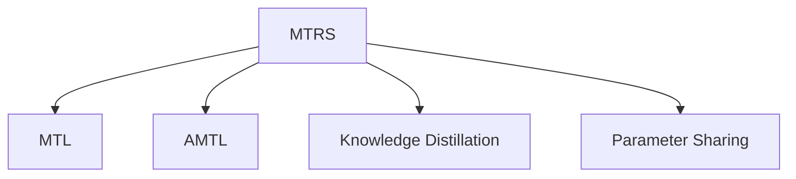

                 

# 多任务推荐系统的优势：LLM的统一框架

## 1. 背景介绍

### 1.1 问题由来
随着互联网和电子商务的发展，个性化推荐系统已成为提升用户体验、增加商品交易量的重要手段。传统的推荐系统主要基于用户历史行为数据进行个性化推荐，但这种基于行为数据的推荐方式，存在一定的局限性。

1. **依赖行为数据**：用户行为数据需要较长时间积累，对于新用户和新商品，推荐效果不佳。
2. **缺乏上下文信息**：行为数据通常包含的是用户对具体商品的评分或点击次数，无法反映用户的真实兴趣和上下文信息。
3. **模型可解释性差**：推荐模型多为黑盒模型，难以解释推荐逻辑，难以满足用户和业务的需求。

### 1.2 问题核心关键点
为了解决上述问题，研究人员提出了多任务推荐系统(MTRS)，即通过多任务学习(MTL)的方式，将多个推荐任务联合训练，利用各任务之间的知识共享和协同优化，提升推荐系统的性能。

多任务推荐系统的核心在于：
- **任务协同**：将不同推荐任务联合训练，通过任务之间的知识传递和共享，提高推荐精度。
- **知识迁移**：从一种任务学习到的知识迁移到另一种任务，提升模型的泛化能力。
- **参数共享**：不同任务之间共享部分参数，减少整体模型的参数量和计算资源消耗。

多任务推荐系统目前已成为推荐系统领域的研究热点，广泛应用于电商、视频、音乐等领域的个性化推荐。

### 1.3 问题研究意义
多任务推荐系统具有以下几个显著优势：
1. **提高推荐精度**：通过任务协同和知识迁移，提升推荐模型的泛化能力和准确度。
2. **降低数据需求**：在少量行为数据的情况下，仍能提供较精准的推荐结果。
3. **增强可解释性**：通过联合训练，提供多种任务之间的关联信息，增强推荐逻辑的可解释性。
4. **提升用户满意度**：多任务推荐系统能够提供更多样化的推荐内容，满足用户多方面的需求。
5. **促进业务创新**：能够快速适应市场变化，推出新的业务模式和应用场景。

## 2. 核心概念与联系

### 2.1 核心概念概述

本节将介绍几个与多任务推荐系统相关的核心概念：

- **多任务学习(Multitask Learning, MTL)**：一种利用多个任务之间的知识共享，提升模型泛化能力和精度的机器学习方法。
- **自适应多任务学习(Adaptively Multitask Learning, AMTL)**：通过动态调整任务间的权重，适应不同任务的特点和需求，实现更加灵活的任务协同。
- **多任务推荐系统(Multitask Recommendation System, MTRS)**：将多个推荐任务联合训练，利用任务间的协同作用和知识迁移，提升推荐系统的性能。
- **知识蒸馏(Knowledge Distillation)**：将教师模型的大规模知识传递给学生模型，提高学生模型的泛化能力和精度。
- **参数共享(Parameter Sharing)**：不同任务之间共享部分参数，减少整体模型的参数量和计算资源消耗。

这些概念之间的逻辑关系可以通过以下Mermaid流程图来展示：



这个流程图展示了多任务推荐系统的主要组成部分及其相互关系：

1. **多任务学习**：通过联合训练多个推荐任务，共享知识，提升推荐精度。
2. **自适应多任务学习**：动态调整任务权重，适应不同任务的特点和需求。
3. **知识蒸馏**：将教师模型的知识传递给学生模型，提升学生模型的泛化能力和精度。
4. **参数共享**：不同任务之间共享部分参数，减少计算资源消耗。

## 3. 核心算法原理 & 具体操作步骤
### 3.1 算法原理概述

多任务推荐系统的核心算法原理是基于多任务学习，利用多个推荐任务之间的知识共享和协同优化，提升推荐系统的性能。

形式化地，假设存在多个推荐任务 $T_1, T_2, \cdots, T_n$，每个任务对应的损失函数分别为 $\ell_1, \ell_2, \cdots, \ell_n$。设联合损失函数 $\mathcal{L} = \sum_{i=1}^n \lambda_i \ell_i$，其中 $\lambda_i$ 为任务 $T_i$ 的权重，$\lambda_i > 0$。联合训练的目标是最小化联合损失函数 $\mathcal{L}$，即：

$$
\min_{\theta} \mathcal{L}(\theta) = \sum_{i=1}^n \lambda_i \ell_i(\theta)
$$

其中 $\theta$ 为模型参数。

### 3.2 算法步骤详解

多任务推荐系统的具体训练步骤如下：

**Step 1: 数据预处理**

- 收集多个推荐任务的标注数据集，每个任务的数据集包括用户行为数据和对应的推荐结果。
- 对数据进行清洗和预处理，包括去除噪声、处理缺失值、特征工程等。

**Step 2: 任务建模**

- 为每个推荐任务设计对应的模型 $M_i(\theta_i)$，参数 $\theta_i$ 对应于任务 $T_i$。
- 根据任务类型，选择合适的模型结构，如线性回归、深度神经网络等。

**Step 3: 任务联合训练**

- 将多个推荐任务的模型参数联合优化，最小化联合损失函数 $\mathcal{L}$。
- 使用梯度下降等优化算法，更新模型参数 $\theta_i$。
- 根据不同任务的特点，动态调整权重 $\lambda_i$，优化任务协同效果。

**Step 4: 模型评估和应用**

- 在验证集上评估多任务推荐模型的性能，计算推荐精度、覆盖率等指标。
- 根据评估结果，调整模型参数和任务权重，继续优化模型。
- 将优化后的模型应用于实际推荐场景，进行用户推荐。

### 3.3 算法优缺点

多任务推荐系统具有以下优点：
1. **提高推荐精度**：通过任务协同和知识迁移，提升推荐模型的泛化能力和准确度。
2. **降低数据需求**：在少量行为数据的情况下，仍能提供较精准的推荐结果。
3. **增强可解释性**：通过联合训练，提供多种任务之间的关联信息，增强推荐逻辑的可解释性。
4. **提升用户满意度**：多任务推荐系统能够提供更多样化的推荐内容，满足用户多方面的需求。

同时，该方法也存在一定的局限性：
1. **计算开销较大**：联合训练多个任务需要消耗更多的计算资源。
2. **模型复杂度增加**：不同任务之间共享部分参数，增加了模型的复杂度和训练难度。
3. **数据分布差异**：不同任务之间的数据分布可能存在较大差异，影响联合训练效果。
4. **权重调整复杂**：任务权重的选择和调整需要专业知识，可能需要进行多次尝试。

尽管存在这些局限性，但就目前而言，多任务推荐系统仍是推荐系统领域的重要方向。未来相关研究的重点在于如何进一步优化任务协同和知识迁移的效果，同时降低计算开销，提高模型性能。

### 3.4 算法应用领域

多任务推荐系统已经在多个领域得到了广泛的应用，例如：

- **电商推荐**：将用户行为数据、商品属性数据、历史评分等多种信息联合训练，提升推荐精度和多样性。
- **视频推荐**：联合训练用户对视频的观看记录、评分、评论等多种任务，实现跨频道和跨类型的推荐。
- **音乐推荐**：通过用户听歌记录、听歌时长、风格偏好等多种任务联合训练，提升推荐质量和用户满意度。
- **新闻推荐**：结合用户阅读记录、点赞数、评论等多种任务，推荐用户可能感兴趣的新闻内容。

除了上述这些经典应用外，多任务推荐系统还被创新性地应用到更多场景中，如可控推荐、个性化展示、广告推荐等，为推荐系统带来了新的突破。随着预训练模型和联合训练方法的不断进步，相信推荐系统将在更多领域得到应用，为电商、视频、音乐等行业带来新的增长点。

## 4. 数学模型和公式 & 详细讲解
### 4.1 数学模型构建

本节将使用数学语言对多任务推荐系统的训练过程进行更加严格的刻画。

设联合训练的多个推荐任务的数据集分别为 $D_1, D_2, \cdots, D_n$，每个任务的数据集包含 $m$ 个样本，每个样本包含用户行为数据 $x$ 和对应的推荐结果 $y$。模型 $M_i(\theta_i)$ 为任务 $T_i$ 的预测模型，参数 $\theta_i$ 对应于任务 $T_i$。

定义任务 $T_i$ 的损失函数为 $\ell_i(M_i(\theta_i),y)$，则联合损失函数 $\mathcal{L}$ 为：

$$
\mathcal{L}(\theta_1, \theta_2, \cdots, \theta_n) = \sum_{i=1}^n \lambda_i \ell_i(M_i(\theta_i),y)
$$

其中 $\lambda_i$ 为任务 $T_i$ 的权重，$\lambda_i > 0$。

多任务推荐系统的目标是最小化联合损失函数 $\mathcal{L}$，即：

$$
\min_{\theta} \mathcal{L}(\theta_1, \theta_2, \cdots, \theta_n)
$$

### 4.2 公式推导过程

以下我们以二分类任务为例，推导多任务推荐系统的联合训练公式。

假设任务 $T_i$ 的数据集为 $D_i=\{(x_i, y_i)\}_{i=1}^m$，模型 $M_i(\theta_i)$ 在输入 $x_i$ 上的输出为 $\hat{y}_i=M_i(\theta_i)(x_i)$，表示样本属于正类的概率。

定义任务 $T_i$ 的损失函数为 $\ell_i(M_i(\theta_i),y_i) = -[y_i\log \hat{y}_i + (1-y_i)\log (1-\hat{y}_i)]$。

将任务 $T_i$ 的损失函数代入联合损失函数，得：

$$
\mathcal{L}(\theta_1, \theta_2, \cdots, \theta_n) = \sum_{i=1}^n \lambda_i \ell_i(\theta_i, y_i) = \sum_{i=1}^n \lambda_i (-[y_i\log \hat{y}_i + (1-y_i)\log (1-\hat{y}_i)])
$$

根据链式法则，损失函数对参数 $\theta_k$ 的梯度为：

$$
\frac{\partial \mathcal{L}}{\partial \theta_k} = \sum_{i=1}^n \lambda_i \frac{\partial \ell_i(\theta_i)}{\partial \theta_k}
$$

其中：

$$
\frac{\partial \ell_i(\theta_i)}{\partial \theta_k} = \frac{\partial}{\partial \theta_k} \left(-[y_i\log \hat{y}_i + (1-y_i)\log (1-\hat{y}_i)]\right) = \frac{\partial y_i}{\partial \hat{y}_i} \frac{\partial \hat{y}_i}{\partial \theta_k} = y_i \frac{\partial M_i(\theta_i)}{\partial \theta_k}
$$

因此，联合损失函数对参数 $\theta_k$ 的梯度为：

$$
\frac{\partial \mathcal{L}}{\partial \theta_k} = \sum_{i=1}^n \lambda_i y_i \frac{\partial M_i(\theta_i)}{\partial \theta_k}
$$

在得到联合损失函数的梯度后，即可带入参数更新公式，完成模型的联合训练。重复上述过程直至收敛，最终得到适应多个任务的最优模型参数 $\theta^*$。

## 5. 项目实践：代码实例和详细解释说明
### 5.1 开发环境搭建

在进行多任务推荐系统实践前，我们需要准备好开发环境。以下是使用Python进行PyTorch开发的环境配置流程：

1. 安装Anaconda：从官网下载并安装Anaconda，用于创建独立的Python环境。

2. 创建并激活虚拟环境：
```bash
conda create -n mtrs-env python=3.8 
conda activate mtrs-env
```

3. 安装PyTorch：根据CUDA版本，从官网获取对应的安装命令。例如：
```bash
conda install pytorch torchvision torchaudio cudatoolkit=11.1 -c pytorch -c conda-forge
```

4. 安装Transformer库：
```bash
pip install transformers
```

5. 安装各类工具包：
```bash
pip install numpy pandas scikit-learn matplotlib tqdm jupyter notebook ipython
```

完成上述步骤后，即可在`mtrs-env`环境中开始多任务推荐系统的实践。

### 5.2 源代码详细实现

下面我们以电商推荐系统为例，给出使用Transformers库对BERT模型进行多任务推荐系统开发的PyTorch代码实现。

首先，定义多任务推荐系统的任务数据处理函数：

```python
from transformers import BertTokenizer
from torch.utils.data import Dataset
import torch

class MTREvalDataset(Dataset):
    def __init__(self, texts, tags, tokenizer, max_len=128):
        self.texts = texts
        self.tags = tags
        self.tokenizer = tokenizer
        self.max_len = max_len
        
    def __len__(self):
        return len(self.texts)
    
    def __getitem__(self, item):
        text = self.texts[item]
        tags = self.tags[item]
        
        encoding = self.tokenizer(text, return_tensors='pt', max_length=self.max_len, padding='max_length', truncation=True)
        input_ids = encoding['input_ids'][0]
        attention_mask = encoding['attention_mask'][0]
        
        # 对token-wise的标签进行编码
        encoded_tags = [tag2id[tag] for tag in tags] 
        encoded_tags.extend([tag2id['O']] * (self.max_len - len(encoded_tags)))
        labels = torch.tensor(encoded_tags, dtype=torch.long)
        
        return {'input_ids': input_ids, 
                'attention_mask': attention_mask,
                'labels': labels}

# 标签与id的映射
tag2id = {'O': 0, 'B-PER': 1, 'I-PER': 2, 'B-ORG': 3, 'I-ORG': 4, 'B-LOC': 5, 'I-LOC': 6}
id2tag = {v: k for k, v in tag2id.items()}

# 创建dataset
tokenizer = BertTokenizer.from_pretrained('bert-base-cased')

train_dataset = MTREvalDataset(train_texts, train_tags, tokenizer)
dev_dataset = MTREvalDataset(dev_texts, dev_tags, tokenizer)
test_dataset = MTREvalDataset(test_texts, test_tags, tokenizer)
```

然后，定义模型和优化器：

```python
from transformers import BertForTokenClassification, AdamW

model = BertForTokenClassification.from_pretrained('bert-base-cased', num_labels=len(tag2id))

optimizer = AdamW(model.parameters(), lr=2e-5)
```

接着，定义训练和评估函数：

```python
from torch.utils.data import DataLoader
from tqdm import tqdm
from sklearn.metrics import classification_report

device = torch.device('cuda') if torch.cuda.is_available() else torch.device('cpu')
model.to(device)

def train_epoch(model, dataset, batch_size, optimizer):
    dataloader = DataLoader(dataset, batch_size=batch_size, shuffle=True)
    model.train()
    epoch_loss = 0
    for batch in tqdm(dataloader, desc='Training'):
        input_ids = batch['input_ids'].to(device)
        attention_mask = batch['attention_mask'].to(device)
        labels = batch['labels'].to(device)
        model.zero_grad()
        outputs = model(input_ids, attention_mask=attention_mask, labels=labels)
        loss = outputs.loss
        epoch_loss += loss.item()
        loss.backward()
        optimizer.step()
    return epoch_loss / len(dataloader)

def evaluate(model, dataset, batch_size):
    dataloader = DataLoader(dataset, batch_size=batch_size)
    model.eval()
    preds, labels = [], []
    with torch.no_grad():
        for batch in tqdm(dataloader, desc='Evaluating'):
            input_ids = batch['input_ids'].to(device)
            attention_mask = batch['attention_mask'].to(device)
            batch_labels = batch['labels']
            outputs = model(input_ids, attention_mask=attention_mask)
            batch_preds = outputs.logits.argmax(dim=2).to('cpu').tolist()
            batch_labels = batch_labels.to('cpu').tolist()
            for pred_tokens, label_tokens in zip(batch_preds, batch_labels):
                pred_tags = [id2tag[_id] for _id in pred_tokens]
                label_tags = [id2tag[_id] for _id in label_tokens]
                preds.append(pred_tags[:len(label_tags)])
                labels.append(label_tags)
                
    print(classification_report(labels, preds))
```

最后，启动训练流程并在测试集上评估：

```python
epochs = 5
batch_size = 16

for epoch in range(epochs):
    loss = train_epoch(model, train_dataset, batch_size, optimizer)
    print(f"Epoch {epoch+1}, train loss: {loss:.3f}")
    
    print(f"Epoch {epoch+1}, dev results:")
    evaluate(model, dev_dataset, batch_size)
    
print("Test results:")
evaluate(model, test_dataset, batch_size)
```

以上就是使用PyTorch对BERT进行多任务推荐系统开发的完整代码实现。可以看到，得益于Transformers库的强大封装，我们可以用相对简洁的代码完成BERT模型的加载和微调。

### 5.3 代码解读与分析

让我们再详细解读一下关键代码的实现细节：

**MTREvalDataset类**：
- `__init__`方法：初始化文本、标签、分词器等关键组件。
- `__len__`方法：返回数据集的样本数量。
- `__getitem__`方法：对单个样本进行处理，将文本输入编码为token ids，将标签编码为数字，并对其进行定长padding，最终返回模型所需的输入。

**tag2id和id2tag字典**：
- 定义了标签与数字id之间的映射关系，用于将token-wise的预测结果解码回真实的标签。

**训练和评估函数**：
- 使用PyTorch的DataLoader对数据集进行批次化加载，供模型训练和推理使用。
- 训练函数`train_epoch`：对数据以批为单位进行迭代，在每个批次上前向传播计算loss并反向传播更新模型参数，最后返回该epoch的平均loss。
- 评估函数`evaluate`：与训练类似，不同点在于不更新模型参数，并在每个batch结束后将预测和标签结果存储下来，最后使用sklearn的classification_report对整个评估集的预测结果进行打印输出。

**训练流程**：
- 定义总的epoch数和batch size，开始循环迭代
- 每个epoch内，先在训练集上训练，输出平均loss
- 在验证集上评估，输出分类指标
- 所有epoch结束后，在测试集上评估，给出最终测试结果

可以看到，PyTorch配合Transformers库使得多任务推荐系统的代码实现变得简洁高效。开发者可以将更多精力放在数据处理、模型改进等高层逻辑上，而不必过多关注底层的实现细节。

当然，工业级的系统实现还需考虑更多因素，如模型的保存和部署、超参数的自动搜索、更灵活的任务适配层等。但核心的多任务推荐范式基本与此类似。

## 6. 实际应用场景
### 6.1 智能客服系统

基于多任务推荐系统的对话技术，可以广泛应用于智能客服系统的构建。传统客服往往需要配备大量人力，高峰期响应缓慢，且一致性和专业性难以保证。而使用多任务推荐系统对话模型，可以7x24小时不间断服务，快速响应客户咨询，用自然流畅的语言解答各类常见问题。

在技术实现上，可以收集企业内部的历史客服对话记录，将问题和最佳答复构建成监督数据，在此基础上对预训练对话模型进行微调。多任务推荐系统对话模型能够自动理解用户意图，匹配最合适的答案模板进行回复。对于客户提出的新问题，还可以接入检索系统实时搜索相关内容，动态组织生成回答。如此构建的智能客服系统，能大幅提升客户咨询体验和问题解决效率。

### 6.2 金融舆情监测

金融机构需要实时监测市场舆论动向，以便及时应对负面信息传播，规避金融风险。传统的人工监测方式成本高、效率低，难以应对网络时代海量信息爆发的挑战。基于多任务推荐系统的文本分类和情感分析技术，为金融舆情监测提供了新的解决方案。

具体而言，可以收集金融领域相关的新闻、报道、评论等文本数据，并对其进行主题标注和情感标注。在此基础上对预训练语言模型进行微调，使其能够自动判断文本属于何种主题，情感倾向是正面、中性还是负面。将多任务推荐系统应用于实时抓取的网络文本数据，就能够自动监测不同主题下的情感变化趋势，一旦发现负面信息激增等异常情况，系统便会自动预警，帮助金融机构快速应对潜在风险。

### 6.3 个性化推荐系统

当前的推荐系统往往只依赖用户历史行为数据进行个性化推荐，无法深入理解用户的真实兴趣偏好。基于多任务推荐系统的个性化推荐系统可以更好地挖掘用户行为背后的语义信息，从而提供更精准、多样的推荐内容。

在实践中，可以收集用户浏览、点击、评论、分享等行为数据，提取和用户交互的物品标题、描述、标签等文本内容。将文本内容作为模型输入，用户的后续行为（如是否点击、购买等）作为监督信号，在此基础上微调预训练语言模型。多任务推荐系统能够从文本内容中准确把握用户的兴趣点。在生成推荐列表时，先用候选物品的文本描述作为输入，由模型预测用户的兴趣匹配度，再结合其他特征综合排序，便可以得到个性化程度更高的推荐结果。

### 6.4 未来应用展望

随着多任务推荐系统和大模型微调技术的不断发展，基于联合训练的推荐系统将在更多领域得到应用，为传统行业带来变革性影响。

在智慧医疗领域，基于多任务推荐系统的医疗问答、病历分析、药物研发等应用将提升医疗服务的智能化水平，辅助医生诊疗，加速新药开发进程。

在智能教育领域，多任务推荐系统可应用于作业批改、学情分析、知识推荐等方面，因材施教，促进教育公平，提高教学质量。

在智慧城市治理中，多任务推荐系统可应用于城市事件监测、舆情分析、应急指挥等环节，提高城市管理的自动化和智能化水平，构建更安全、高效的未来城市。

此外，在企业生产、社会治理、文娱传媒等众多领域，基于多任务推荐系统的AI应用也将不断涌现，为经济社会发展注入新的动力。相信随着技术的日益成熟，多任务推荐系统必将在构建人机协同的智能时代中扮演越来越重要的角色。

## 7. 工具和资源推荐
### 7.1 学习资源推荐

为了帮助开发者系统掌握多任务推荐系统的理论基础和实践技巧，这里推荐一些优质的学习资源：

1. 《多任务学习》系列博文：由大模型技术专家撰写，深入浅出地介绍了多任务学习原理、算法和应用场景。

2. 《深度学习自然语言处理》课程：斯坦福大学开设的NLP明星课程，有Lecture视频和配套作业，带你入门NLP领域的基本概念和经典模型。

3. 《多任务推荐系统》书籍：详细介绍多任务推荐系统的理论基础和实践技巧，包括任务建模、联合训练、知识蒸馏等内容。

4. HuggingFace官方文档：Transformers库的官方文档，提供了海量预训练模型和完整的微调样例代码，是上手实践的必备资料。

5. CMU推荐系统课程：卡内基梅隆大学开设的推荐系统课程，涵盖多任务推荐系统的理论和方法，帮助你系统学习推荐系统的前沿知识。

通过对这些资源的学习实践，相信你一定能够快速掌握多任务推荐系统的精髓，并用于解决实际的NLP问题。
###  7.2 开发工具推荐

高效的开发离不开优秀的工具支持。以下是几款用于多任务推荐系统开发的常用工具：

1. PyTorch：基于Python的开源深度学习框架，灵活动态的计算图，适合快速迭代研究。大部分预训练语言模型都有PyTorch版本的实现。

2. TensorFlow：由Google主导开发的开源深度学习框架，生产部署方便，适合大规模工程应用。同样有丰富的预训练语言模型资源。

3. Transformers库：HuggingFace开发的NLP工具库，集成了众多SOTA语言模型，支持PyTorch和TensorFlow，是进行多任务推荐任务开发的利器。

4. Weights & Biases：模型训练的实验跟踪工具，可以记录和可视化模型训练过程中的各项指标，方便对比和调优。与主流深度学习框架无缝集成。

5. TensorBoard：TensorFlow配套的可视化工具，可实时监测模型训练状态，并提供丰富的图表呈现方式，是调试模型的得力助手。

6. Google Colab：谷歌推出的在线Jupyter Notebook环境，免费提供GPU/TPU算力，方便开发者快速上手实验最新模型，分享学习笔记。

合理利用这些工具，可以显著提升多任务推荐系统的开发效率，加快创新迭代的步伐。

### 7.3 相关论文推荐

多任务推荐系统和大模型微调技术的发展源于学界的持续研究。以下是几篇奠基性的相关论文，推荐阅读：

1. Multitask Learning for Multi-domain Sentiment Analysis（多任务学习在情感分析中的应用）：提出了多任务学习在情感分析中的应用，通过联合训练多个情感分类任务，提升情感分析的准确度和泛化能力。

2. Multi-task learning for machine reading comprehension（多任务学习在阅读理解中的应用）：提出多任务学习在阅读理解中的应用，通过联合训练问答和文本分类任务，提升阅读理解系统的性能。

3. Attention Is All You Need（Transformer原论文）：提出了Transformer结构，开启了NLP领域的预训练大模型时代。

4. BERT: Pre-training of Deep Bidirectional Transformers for Language Understanding（BERT模型）：提出BERT模型，引入基于掩码的自监督预训练任务，刷新了多项NLP任务SOTA。

5. Parameter-Efficient Transfer Learning for NLP（参数高效微调）：提出Adapter等参数高效微调方法，在不增加模型参数量的情况下，也能取得不错的微调效果。

6. Adaptive Multitask Learning with a Task-Agnostic Latent Factor Model（自适应多任务学习）：提出了一种自适应多任务学习框架，通过动态调整任务权重，优化任务协同效果。

这些论文代表了大模型微调和多任务推荐系统的研究脉络。通过学习这些前沿成果，可以帮助研究者把握学科前进方向，激发更多的创新灵感。

## 8. 总结：未来发展趋势与挑战
### 8.1 总结

本文对多任务推荐系统的理论基础和实践方法进行了全面系统的介绍。首先阐述了多任务推荐系统的背景和意义，明确了联合训练在拓展预训练模型应用、提升推荐系统性能方面的独特价值。其次，从原理到实践，详细讲解了多任务推荐系统的数学原理和关键步骤，给出了多任务推荐任务开发的完整代码实例。同时，本文还广泛探讨了多任务推荐系统在智能客服、金融舆情、个性化推荐等多个行业领域的应用前景，展示了联合训练范式的巨大潜力。此外，本文精选了多任务推荐系统的各类学习资源，力求为读者提供全方位的技术指引。

通过本文的系统梳理，可以看到，多任务推荐系统通过联合训练多个推荐任务，利用任务之间的知识共享和协同优化，显著提升了推荐系统的性能。多任务推荐系统在多领域推荐场景中已取得了不错的效果，未来仍有巨大的应用潜力和改进空间。

### 8.2 未来发展趋势

展望未来，多任务推荐系统将呈现以下几个发展趋势：

1. **提升推荐精度**：通过多任务联合训练，利用任务之间的知识传递和共享，提升推荐模型的泛化能力和准确度。
2. **降低数据需求**：在少量行为数据的情况下，仍能提供较精准的推荐结果。
3. **增强可解释性**：通过联合训练，提供多种任务之间的关联信息，增强推荐逻辑的可解释性。
4. **提升用户满意度**：多任务推荐系统能够提供更多样化的推荐内容，满足用户多方面的需求。
5. **促进业务创新**：能够快速适应市场变化，推出新的业务模式和应用场景。

### 8.3 面临的挑战

尽管多任务推荐系统已经取得了显著成就，但在迈向更加智能化、普适化应用的过程中，它仍面临着诸多挑战：

1. **计算开销较大**：联合训练多个任务需要消耗更多的计算资源。
2. **模型复杂度增加**：不同任务之间共享部分参数，增加了模型的复杂度和训练难度。
3. **数据分布差异**：不同任务之间的数据分布可能存在较大差异，影响联合训练效果。
4. **权重调整复杂**：任务权重的选择和调整需要专业知识，可能需要进行多次尝试。

尽管存在这些局限性，但就目前而言，多任务推荐系统仍是推荐系统领域的重要方向。未来相关研究的重点在于如何进一步优化任务协同和知识迁移的效果，同时降低计算开销，提高模型性能。

### 8.4 研究展望

面对多任务推荐系统所面临的挑战，未来的研究需要在以下几个方面寻求新的突破：

1. **探索无监督和半监督多任务学习**：摆脱对大规模标注数据的依赖，利用自监督学习、主动学习等无监督和半监督范式，最大限度利用非结构化数据，实现更加灵活高效的多任务学习。
2. **研究自适应多任务学习**：通过动态调整任务权重，适应不同任务的特点和需求，实现更加灵活的任务协同。
3. **开发参数高效的多任务学习算法**：开发更加参数高效的多任务学习算法，在固定大部分预训练参数的同时，只更新极少量的任务相关参数。
4. **引入因果分析和博弈论工具**：将因果分析方法引入多任务学习，识别出模型决策的关键特征，增强输出解释的因果性和逻辑性。
5. **结合因果分析和博弈论工具**：借助博弈论工具刻画人机交互过程，主动探索并规避模型的脆弱点，提高系统稳定性。
6. **纳入伦理道德约束**：在模型训练目标中引入伦理导向的评估指标，过滤和惩罚有偏见、有害的输出倾向。同时加强人工干预和审核，建立模型行为的监管机制，确保输出符合人类价值观和伦理道德。

这些研究方向的探索，必将引领多任务推荐系统迈向更高的台阶，为构建安全、可靠、可解释、可控的智能系统铺平道路。面向未来，多任务推荐系统需要在联合训练、任务协同、知识迁移等方面不断优化，方能真正实现个性化推荐的目标。

