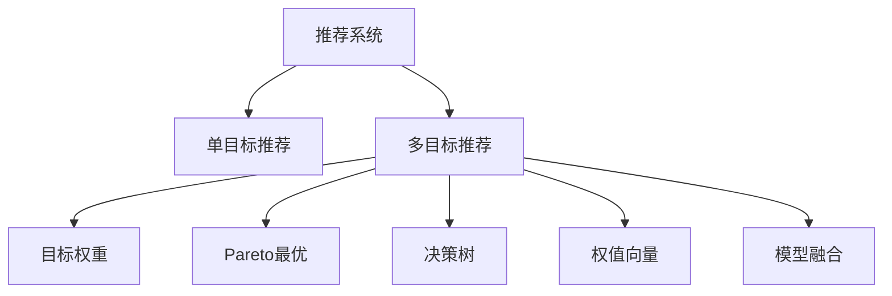

                 

# 多目标推荐系统的设计与实现

在现代互联网应用中，推荐系统已成为提供个性化服务、提升用户体验的重要手段。传统推荐系统往往只关注单一目标（如点击率），难以满足用户多方面的需求。多目标推荐系统（Multi-Objective Recommendation Systems, MOR）则在此基础上，通过优化多个性能指标，实现更全面、更个性化、更高效的推荐。本文将详细阐述多目标推荐系统的设计与实现，涵盖其核心概念、算法原理、应用实践等方面。

## 1. 背景介绍

### 1.1 问题由来
随着电子商务、视频流媒体、社交网络等数字服务的发展，推荐系统的重要性愈发凸显。传统的单目标推荐系统，如协同过滤（Collaborative Filtering）、基于内容的推荐（Content-Based Recommendation）等，虽然在某些场景下取得了良好效果，但往往只关注单一性能指标，难以综合考量用户的多个需求。例如，用户可能在浏览视频时希望推荐感兴趣的视频，同时希望避免推荐低质量的内容；在购物时希望推荐价格合理的产品，同时希望推荐与当前浏览产品相关的商品。

多目标推荐系统（MOR）正是为了解决这一问题而产生。MOR通过对多个推荐性能指标进行优化，从而能够更全面地满足用户的多样化需求。此外，MOR还可以用于处理更加复杂的推荐场景，如金融理财、健康医疗等领域，对多维度的用户行为和偏好进行建模和分析。

### 1.2 问题核心关键点
多目标推荐系统的设计，需要在多个目标之间进行权衡和折衷，以找到一个平衡点。主要包括以下几个方面：

- **多目标优化**：如何将多个目标整合到一个推荐模型中，优化性能。
- **目标权重确定**：如何确定各个目标的权重，以指导模型优化方向。
- **模型融合**：如何将多个单目标模型融合为一个MOR模型，提升推荐效果。
- **效率优化**：如何在保证效果的前提下，提高模型的训练和推理效率。
- **模型评估**：如何对MOR模型进行全面评估，确保其效果和稳定性。

## 2. 核心概念与联系

### 2.1 核心概念概述

为了更好地理解多目标推荐系统，本节将介绍几个核心概念：

- **推荐系统（Recommendation System, RS）**：根据用户的历史行为数据和兴趣偏好，推荐物品的系统。推荐系统是构建个性化服务的基础。

- **单目标推荐（Single-Objective Recommendation, SOR）**：只关注单一推荐性能指标（如点击率、转化率等）的推荐系统。

- **多目标推荐（Multi-Objective Recommendation, MOR）**：通过优化多个性能指标，全面满足用户多样化需求的推荐系统。

- **目标权重（Objective Weight）**：不同推荐目标对用户的重要性。通常需要通过用户反馈或专家评估来确定。

- **Pareto最优**：多目标优化中的一种策略，找到一个权衡点，使得至少一个目标在达到最优，同时不劣化其他目标。

- **决策树（Decision Tree）**：一种常见的多目标优化方法，通过构建树形结构，逐步决策不同目标。

- **权值向量（Weight Vector）**：通过线性组合不同目标，形成权重向量，指导模型优化。

- **模型融合（Model Fusion）**：将多个单目标模型集成，形成一个MOR模型，提升推荐效果。

这些概念之间的逻辑关系可以通过以下Mermaid流程图来展示：



这个流程图展示了推荐系统及其多个变种之间的关系：

1. 推荐系统是基础，通过数据驱动实现个性化推荐。
2. 单目标推荐聚焦单一性能指标，适用于部分场景。
3. 多目标推荐则综合多个指标，满足用户多样化需求。
4. 目标权重和Pareto最优用于指导多目标优化。
5. 决策树和权值向量是实现多目标优化的常用方法。
6. 模型融合技术将多个单目标模型集成，提升推荐效果。

## 3. 核心算法原理 & 具体操作步骤
### 3.1 算法原理概述

多目标推荐系统的核心在于如何将多个目标优化整合到一个推荐模型中。一般来说，可以采用以下几种策略：

- **权值向量法（Weight Vector Method）**：将多个目标转化为一个权重向量，指导模型优化。
- **决策树法（Decision Tree Method）**：构建树形结构，逐步决策不同目标。
- **Pareto最优法（Pareto Optimal Method）**：找到多个目标之间的折衷点，实现最优推荐。
- **模型融合法（Model Fusion Method）**：将多个单目标模型集成，提升推荐效果。

这些策略各有优劣，需要根据具体任务选择合适的方法。本文将重点介绍权值向量法和模型融合法的原理和实现步骤。

### 3.2 算法步骤详解

#### 3.2.1 权值向量法

权值向量法是一种常用的多目标优化方法。其基本思想是将多个目标转化为一个向量，通过线性组合形成权重向量，指导模型优化。具体步骤如下：

1. **目标选择**：选择多个推荐目标，如点击率（CTR）、转化率（CR）、用户满意度（User Satisfaction）等。
2. **权重确定**：通过用户反馈、专家评估等方式，确定各个目标的权重。
3. **目标函数构造**：将各个目标转化为损失函数，并按权重进行组合，形成总损失函数。
4. **模型训练**：使用梯度下降等优化算法，最小化总损失函数，优化模型参数。

下面以点击率和转化率为示例，展示权值向量法的具体实现步骤：

假设选择点击率（CTR）和转化率（CR）作为优化目标，权重分别为$\alpha$和$\beta$。设用户对物品$i$的评分向量为$x_i$，物品$i$的实际点击率为$y_{ci}$，实际转化率为$y_{di}$，则目标函数可表示为：

$$
F = \alpha \times L_{CTR} + \beta \times L_{CR}
$$

其中$L_{CTR}$和$L_{CR}$分别为点击率和转化率的损失函数，可分别表示为：

$$
L_{CTR} = -\frac{1}{n} \sum_{i=1}^n y_{ci} \times \log \hat{y}_{ci} + (1 - y_{ci}) \times \log(1 - \hat{y}_{ci})
$$

$$
L_{CR} = -\frac{1}{n} \sum_{i=1}^n y_{di} \times \log \hat{y}_{di} + (1 - y_{di}) \times \log(1 - \hat{y}_{di})
$$

其中$\hat{y}_{ci}$和$\hat{y}_{di}$分别为模型预测的点击率和转化率。通过优化上述目标函数，即可在点击率和转化率之间进行权衡，实现多目标优化。

#### 3.2.2 模型融合法

模型融合法是将多个单目标推荐模型集成，形成一个多目标推荐系统的方法。常用的模型融合策略包括：

- **平均法（Average Method）**：将多个模型的输出进行平均，形成最终推荐结果。
- **加权法（Weighted Method）**：根据模型的表现，赋予不同的权重，进行加权平均。
- **堆叠法（Stacking Method）**：将多个模型的输出作为输入，训练一个元模型进行融合。

以平均法和加权法为例，展示模型融合的具体步骤：

1. **模型训练**：分别训练多个单目标推荐模型，如协同过滤、基于内容的推荐等。
2. **输出计算**：对每个物品$i$，计算多个模型的输出。
3. **融合计算**：使用平均法或加权法，将多个模型的输出进行融合，形成最终推荐结果。

以平均法为例，假设模型A、B、C分别预测物品$i$的评分，则平均法融合结果为：

$$
\hat{y}_i = \frac{\hat{y}_i^A + \hat{y}_i^B + \hat{y}_i^C}{3}
$$

而加权法融合结果为：

$$
\hat{y}_i = \frac{\alpha \times \hat{y}_i^A + \beta \times \hat{y}_i^B + \gamma \times \hat{y}_i^C}{\alpha + \beta + \gamma}
$$

其中$\alpha$、$\beta$、$\gamma$为不同模型的权重，可根据其表现进行设定。

### 3.3 算法优缺点

多目标推荐系统在优化多个性能指标方面具有显著优势，但也存在一些局限性：

**优点**：

- **全面性**：能够全面满足用户多样化需求，提升推荐质量。
- **鲁棒性**：通过多个目标的协同优化，提高推荐系统的稳定性和可靠性。
- **灵活性**：可根据具体任务和需求，灵活选择优化目标和权重。

**缺点**：

- **计算复杂性**：多目标优化通常比单目标优化更加复杂，计算量较大。
- **权重确定困难**：确定各目标权重需要大量经验和数据，可能难以合理设置。
- **模型复杂性**：多目标优化涉及多个模型和目标，模型设计复杂。

## 4. 数学模型和公式 & 详细讲解  
### 4.1 数学模型构建

在多目标推荐系统中，一般采用线性规划（Linear Programming）和目标函数的方法来构建数学模型。假设目标数为$m$，有$n$个用户，$k$个物品，$x_{ui}$表示用户$u$对物品$i$的评分，则目标函数可表示为：

$$
\min \sum_{i=1}^k \sum_{u=1}^n w_i \times x_{ui}
$$

其中$w_i$为物品$i$的权重向量，$x_{ui}$为模型预测的用户$u$对物品$i$的评分。

**约束条件**：

1. 物品评分非负约束：$x_{ui} \geq 0$。
2. 用户评分非负约束：$x_{ui} \geq 0$。
3. 物品评分之和约束：$\sum_{i=1}^k x_{ui} = 1$。
4. 用户评分之和约束：$\sum_{i=1}^k x_{ui} = 1$。

### 4.2 公式推导过程

假设选择点击率（CTR）和转化率（CR）作为优化目标，权重分别为$\alpha$和$\beta$，则目标函数可表示为：

$$
F = \alpha \times L_{CTR} + \beta \times L_{CR}
$$

其中$L_{CTR}$和$L_{CR}$分别为点击率和转化率的损失函数，可分别表示为：

$$
L_{CTR} = -\frac{1}{n} \sum_{i=1}^n y_{ci} \times \log \hat{y}_{ci} + (1 - y_{ci}) \times \log(1 - \hat{y}_{ci})
$$

$$
L_{CR} = -\frac{1}{n} \sum_{i=1}^n y_{di} \times \log \hat{y}_{di} + (1 - y_{di}) \times \log(1 - \hat{y}_{di})
$$

其中$\hat{y}_{ci}$和$\hat{y}_{di}$分别为模型预测的点击率和转化率。

**推导过程**：

- **点击率（CTR）损失函数**：通过最小化负对数似然损失，最大化点击率。
- **转化率（CR）损失函数**：通过最小化负对数似然损失，最大化转化率。

将两个损失函数线性组合，得到多目标优化问题。使用梯度下降等优化算法，最小化目标函数，即可在点击率和转化率之间进行权衡，实现多目标优化。

### 4.3 案例分析与讲解

以电商推荐系统为例，展示多目标推荐系统的实际应用。假设电商推荐系统需要优化点击率（CTR）、转化率（CR）和用户满意度（User Satisfaction）三个目标。

1. **目标选择**：选择点击率（CTR）、转化率（CR）和用户满意度（User Satisfaction）作为优化目标。
2. **权重确定**：通过用户反馈和专家评估，确定各目标权重。
3. **目标函数构造**：将各个目标转化为损失函数，并按权重进行组合，形成总损失函数。
4. **模型训练**：使用梯度下降等优化算法，最小化总损失函数，优化模型参数。
5. **推荐输出**：使用优化后的模型，对新物品进行评分，形成推荐结果。

## 5. 项目实践：代码实例和详细解释说明
### 5.1 开发环境搭建

在进行多目标推荐系统开发前，我们需要准备好开发环境。以下是使用Python进行PyTorch开发的环境配置流程：

1. 安装Anaconda：从官网下载并安装Anaconda，用于创建独立的Python环境。

2. 创建并激活虚拟环境：
```bash
conda create -n pytorch-env python=3.8 
conda activate pytorch-env
```

3. 安装PyTorch：根据CUDA版本，从官网获取对应的安装命令。例如：
```bash
conda install pytorch torchvision torchaudio cudatoolkit=11.1 -c pytorch -c conda-forge
```

4. 安装TensorFlow：
```bash
pip install tensorflow
```

5. 安装各类工具包：
```bash
pip install numpy pandas scikit-learn matplotlib tqdm jupyter notebook ipython
```

完成上述步骤后，即可在`pytorch-env`环境中开始多目标推荐系统的开发。

### 5.2 源代码详细实现

下面以电商推荐系统为例，展示多目标推荐系统的实现步骤。

**目标选择**：选择点击率（CTR）、转化率（CR）和用户满意度（User Satisfaction）作为优化目标。

**权重确定**：通过用户反馈和专家评估，确定各目标权重为$\alpha$、$\beta$、$\gamma$。

**目标函数构造**：将各个目标转化为损失函数，并按权重进行组合，形成总损失函数。

```python
from torch import nn, optim
import torch.nn.functional as F

class MOR(nn.Module):
    def __init__(self, input_size, hidden_size, output_size):
        super(MOR, self).__init__()
        self.fc1 = nn.Linear(input_size, hidden_size)
        self.fc2 = nn.Linear(hidden_size, output_size)
        
    def forward(self, x):
        x = F.relu(self.fc1(x))
        x = self.fc2(x)
        return x

# 设置优化器、学习率、目标函数
model = MOR(input_size, hidden_size, output_size)
criterion = nn.BCELoss()
optimizer = optim.Adam(model.parameters(), lr=learning_rate)

# 目标权重
alpha = 0.5
beta = 0.3
gamma = 0.2

# 总损失函数
def multi_objective_loss(y_pred, y_true):
    loss = alpha * criterion(y_pred, y_true[0]) + beta * criterion(y_pred, y_true[1]) + gamma * criterion(y_pred, y_true[2])
    return loss

# 训练函数
def train(model, train_data, test_data, epochs=10):
    for epoch in range(epochs):
        for batch in train_data:
            optimizer.zero_grad()
            y_pred = model(batch[0])
            loss = multi_objective_loss(y_pred, batch[1])
            loss.backward()
            optimizer.step()
        
        # 验证集验证
        test_loss = multi_objective_loss(model(test_data[0]), test_data[1])
        print(f"Epoch {epoch+1}, loss: {test_loss:.4f}")
        
    return model
```

### 5.3 代码解读与分析

让我们再详细解读一下关键代码的实现细节：

**MOR类**：
- `__init__`方法：定义模型结构，包括输入、隐藏层和输出层。
- `forward`方法：定义前向传播过程，通过全连接层实现从输入到输出的映射。

**目标函数**：
- `criterion`函数：定义损失函数，使用二元交叉熵损失。
- `multi_objective_loss`函数：将三个目标损失函数按权重组合，形成总损失函数。

**训练函数**：
- `train`函数：循环迭代，对训练集进行前向传播、计算损失、反向传播、更新参数，并在验证集上输出损失。

**权重设置**：
- `alpha`、`beta`、`gamma`：通过用户反馈和专家评估，确定各目标权重。

**代码执行**：
- `model`：定义优化器、目标函数和训练函数。
- `optimizer`：设置Adam优化器。
- `multi_objective_loss`：计算总损失函数。
- `train`：调用训练函数，对模型进行训练。

## 6. 实际应用场景
### 6.1 智能推荐系统

智能推荐系统在电商、视频、新闻等多个领域都有广泛应用。通过多目标推荐系统，可以更全面地满足用户需求，提升用户体验。例如，在电商推荐中，可以同时优化点击率、转化率和用户满意度，推荐用户真正感兴趣的商品，提高购物体验。

在视频推荐中，可以同时优化观看时长、点赞数和评分，推荐用户喜欢的视频，提高观看体验。在新闻推荐中，可以同时优化阅读量、点击率和评论数，推荐用户感兴趣的新闻，提高阅读体验。

### 6.2 金融理财推荐

金融理财推荐系统需要对用户的资产配置、投资偏好、风险承受能力等多个方面进行综合评估，推荐合适的理财产品。通过多目标推荐系统，可以在收益、风险、流动性等方面进行优化，满足用户多样化的需求。

例如，可以同时优化理财产品收益率、风险评级和流动性评级，推荐用户适合的理财产品，提高理财效果。

### 6.3 健康医疗推荐

健康医疗推荐系统需要对用户的健康状况、生活习惯、疾病史等多个方面进行综合评估，推荐合适的医疗方案和健康建议。通过多目标推荐系统，可以在疗效、副作用、费用等方面进行优化，满足用户的多样化需求。

例如，可以同时优化治疗效果、副作用风险和费用，推荐用户适合的医疗方案，提高治疗效果。

### 6.4 未来应用展望

随着多目标推荐系统的不断发展和完善，其在更多领域的应用前景将更加广阔。以下是未来可能的应用场景：

1. **金融风险控制**：通过多目标推荐系统，可以在收益、风险、流动性等方面进行优化，降低金融风险，提高金融服务的可靠性。
2. **智能家居控制**：通过多目标推荐系统，可以在节能、舒适度、安全性等方面进行优化，提升智能家居的控制效果。
3. **工业制造优化**：通过多目标推荐系统，可以在生产效率、成本控制、产品质量等方面进行优化，提升工业制造的智能化水平。
4. **智能交通管理**：通过多目标推荐系统，可以在交通流量、安全、环保等方面进行优化，提升交通管理的效果。

总之，多目标推荐系统在多个领域具有广泛的应用前景，未来将助力各行各业的数字化转型升级。

## 7. 工具和资源推荐
### 7.1 学习资源推荐

为了帮助开发者系统掌握多目标推荐系统的理论基础和实践技巧，这里推荐一些优质的学习资源：

1. 《推荐系统》系列书籍：详细介绍了推荐系统的各种算法和模型，包括单目标推荐和多目标推荐。
2. 《多目标优化算法》：介绍了多目标优化算法的理论基础和实践技巧，适合深入研究。
3. 《深度学习与推荐系统》：介绍了深度学习在推荐系统中的应用，包括单目标推荐和多目标推荐。
4. 《TensorFlow推荐系统教程》：介绍了TensorFlow在推荐系统中的应用，包括多目标推荐系统的实现。

通过对这些资源的学习实践，相信你一定能够快速掌握多目标推荐系统的精髓，并用于解决实际的推荐问题。

### 7.2 开发工具推荐

高效的开发离不开优秀的工具支持。以下是几款用于多目标推荐系统开发的常用工具：

1. PyTorch：基于Python的开源深度学习框架，灵活动态的计算图，适合快速迭代研究。

2. TensorFlow：由Google主导开发的开源深度学习框架，生产部署方便，适合大规模工程应用。

3. HuggingFace Transformers库：提供了大量的预训练语言模型，支持多目标推荐系统的开发。

4. Weights & Biases：模型训练的实验跟踪工具，可以记录和可视化模型训练过程中的各项指标，方便对比和调优。

5. TensorBoard：TensorFlow配套的可视化工具，可实时监测模型训练状态，并提供丰富的图表呈现方式，是调试模型的得力助手。

6. Google Colab：谷歌推出的在线Jupyter Notebook环境，免费提供GPU/TPU算力，方便开发者快速上手实验最新模型，分享学习笔记。

合理利用这些工具，可以显著提升多目标推荐系统的开发效率，加快创新迭代的步伐。

### 7.3 相关论文推荐

多目标推荐系统的研究源于学界的持续研究。以下是几篇奠基性的相关论文，推荐阅读：

1. Multi-Objective Recommendation Using Genetic Algorithms（遗传算法的多目标推荐）：介绍了遗传算法在多目标推荐中的应用，适合基础入门。

2. Multi-Objective Optimisation by Analyzing Objective Priorities（通过分析目标优先级进行多目标优化）：介绍了多目标优化算法的理论基础和实践技巧，适合深入研究。

3. Multi-Objective Recommendation with an Extensive Core Algorithm for Ranking and Selection（多目标推荐中的排名和选择算法）：介绍了多目标推荐系统的基本算法和实现方法，适合实际应用。

4. Multi-Objective Ranking with Imprecise Preferences Using a Ranking and Preference Structure（使用排名和偏好结构进行多目标排序）：介绍了多目标排序算法和应用场景，适合深度学习进阶学习。

这些论文代表了大目标推荐系统的发展脉络。通过学习这些前沿成果，可以帮助研究者把握学科前进方向，激发更多的创新灵感。

## 8. 总结：未来发展趋势与挑战

### 8.1 总结

本文对多目标推荐系统的设计与实现进行了全面系统的介绍。首先阐述了多目标推荐系统的背景和意义，明确了其在新型推荐系统中的重要地位。其次，从原理到实践，详细讲解了多目标推荐系统的数学模型、算法原理、实际应用等方面，给出了多目标推荐系统的完整代码实例。同时，本文还广泛探讨了多目标推荐系统在电商、金融、医疗等多个领域的应用前景，展示了其广阔的发展空间。

通过本文的系统梳理，可以看到，多目标推荐系统在优化多个性能指标方面具有显著优势，未来必将在更多领域得到应用，为各行各业带来新的变革。

### 8.2 未来发展趋势

展望未来，多目标推荐系统的发展趋势如下：

1. **深度学习融合**：深度学习技术在推荐系统中的应用将越来越广泛，多目标推荐系统将与深度学习技术深度融合，提升推荐效果。
2. **跨领域应用**：多目标推荐系统将逐步扩展到更多领域，如金融、医疗、工业制造等，提供更加多样化的服务。
3. **个性化推荐**：通过多目标优化，实现更加个性化、精准的推荐，提升用户体验。
4. **实时推荐**：多目标推荐系统将逐步实现实时推荐，适应用户动态变化的需求。
5. **模型优化**：多目标推荐系统将不断优化模型结构和算法，提高训练和推理效率，提升推荐性能。
6. **数据融合**：多目标推荐系统将与外部数据源、知识图谱等进行融合，实现更加全面的推荐。

总之，多目标推荐系统正处于快速发展的阶段，未来必将在更多领域得到应用，带来全新的用户体验和服务模式。

### 8.3 面临的挑战

尽管多目标推荐系统在多个领域取得了显著成效，但在应用过程中仍面临诸多挑战：

1. **数据复杂性**：多目标推荐系统需要处理更加复杂的数据，包括用户行为数据、物品属性数据、用户属性数据等多个维度，数据处理难度较大。
2. **模型复杂性**：多目标推荐系统涉及多个目标和模型，模型设计和优化复杂，容易出现过拟合等问题。
3. **效果评估**：多目标推荐系统的评估指标难以确定，不同目标之间的权衡关系难以量化，难以全面评估推荐效果。
4. **公平性**：多目标推荐系统容易出现公平性问题，不同用户之间的需求差异较大，难以公平地分配推荐资源。

为应对这些挑战，需要进一步优化数据预处理、模型设计和评估方法，提升多目标推荐系统的稳定性和公平性。

### 8.4 研究展望

面对多目标推荐系统所面临的挑战，未来的研究需要在以下几个方面寻求新的突破：

1. **数据融合技术**：通过多源数据融合技术，整合用户行为数据、物品属性数据、用户属性数据等多个维度，提高推荐系统的全面性和准确性。
2. **模型优化技术**：通过优化模型结构和算法，减少计算复杂度和模型复杂度，提高推荐系统的训练和推理效率。
3. **评估方法优化**：通过引入更加全面和科学的评估方法，如公平性评估、多样性评估等，全面评估推荐效果。
4. **推荐公平性研究**：通过引入公平性约束和优化方法，确保不同用户之间的推荐资源公平分配，提升推荐系统的公平性。

这些研究方向的探索，必将引领多目标推荐系统技术迈向更高的台阶，为构建更加智能化、个性化、公平化的推荐系统提供新的思路。

## 9. 附录：常见问题与解答

**Q1：多目标推荐系统和单目标推荐系统有何区别？**

A: 多目标推荐系统和单目标推荐系统的区别主要在于优化目标的数量和方式。单目标推荐系统通常只关注单一性能指标（如点击率、转化率等），而多目标推荐系统则优化多个性能指标（如点击率、转化率、用户满意度等），通过在多个目标之间进行权衡，实现更全面、更个性化、更高效的推荐。

**Q2：多目标推荐系统的目标权重如何确定？**

A: 多目标推荐系统的目标权重通常需要通过用户反馈、专家评估等方式确定。具体步骤如下：
1. 收集用户反馈数据，统计不同目标的平均评分。
2. 将评分数据输入模型，训练目标权重向量。
3. 根据模型预测结果，确定各目标的权重。

**Q3：多目标推荐系统的计算复杂性较高，如何降低计算复杂度？**

A: 降低多目标推荐系统的计算复杂度可以从以下几个方面入手：
1. 使用低维模型：选择计算复杂度较低的模型，如线性模型、随机森林等。
2. 特征选择：对输入特征进行筛选，去除无关或冗余特征。
3. 特征压缩：使用特征压缩技术，如主成分分析（PCA）、因子分解（PCA）等，减少输入特征维度。
4. 并行计算：使用并行计算技术，如分布式计算、GPU加速等，提高计算效率。

**Q4：多目标推荐系统在实际应用中需要注意哪些问题？**

A: 多目标推荐系统在实际应用中需要注意以下几个问题：
1. 数据预处理：对输入数据进行清洗、归一化等预处理，提升数据质量。
2. 模型选择：根据具体任务和数据特点，选择合适的模型和算法。
3. 模型调参：通过超参数调优、模型融合等方法，优化模型性能。
4. 效果评估：引入全面、科学的评估指标，如准确率、召回率、F1值等，全面评估推荐效果。
5. 公平性设计：引入公平性约束和优化方法，确保不同用户之间的推荐资源公平分配。

通过合理应对这些问题，可以最大限度地发挥多目标推荐系统的优势，提升推荐效果。

**Q5：多目标推荐系统的推荐结果如何生成？**

A: 多目标推荐系统的推荐结果通常通过以下步骤生成：
1. 训练多目标优化模型，优化各目标权重。
2. 对新物品进行评分，计算多目标综合评分。
3. 根据综合评分，选择推荐物品列表。
4. 将推荐物品列表展示给用户。

通过多目标优化，生成更全面、更个性化、更精准的推荐结果，提升用户体验。

---

作者：禅与计算机程序设计艺术 / Zen and the Art of Computer Programming

