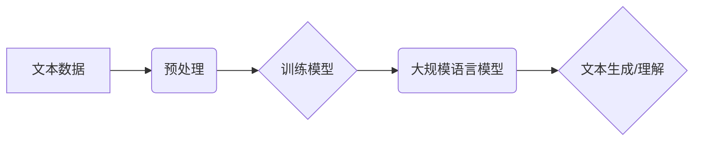

> 大规模语言模型，Transformer，自然语言处理，深度学习，文本生成，机器翻译

## 1. 背景介绍

近年来，人工智能领域取得了令人瞩目的进展，其中大规模语言模型（Large Language Models，LLMs）作为一种重要的突破，展现出强大的文本理解和生成能力。从早期基于循环神经网络（RNN）的语言模型，到如今基于Transformer架构的巨型模型，LLMs不断突破规模和性能的边界，在自然语言处理（NLP）领域掀起了一场革命。

LLMs的出现，标志着人工智能迈向更智能、更人性化的方向。它们能够理解复杂的语言结构，生成流畅自然的文本，并完成各种文本相关的任务，例如机器翻译、文本摘要、问答系统、代码生成等。

## 2. 核心概念与联系

**2.1  大规模语言模型 (LLMs)**

大规模语言模型是指拥有数亿甚至数十亿参数的深度学习模型，通过训练海量文本数据，学习语言的语法、语义和上下文关系。

**2.2  Transformer 架构**

Transformer是一种专门设计用于处理序列数据的深度学习架构，其核心是注意力机制（Attention）。注意力机制能够学习文本中不同词语之间的关系，从而更好地理解上下文信息。

**2.3  自然语言处理 (NLP)**

自然语言处理是指让计算机能够理解、处理和生成人类语言的任务。LLMs在NLP领域发挥着越来越重要的作用，例如：

* **机器翻译:** 将一种语言翻译成另一种语言。
* **文本摘要:** 将长篇文本压缩成简短的摘要。
* **问答系统:** 回答用户提出的问题。
* **代码生成:** 根据自然语言描述生成代码。

**2.4  深度学习**

深度学习是一种机器学习的子领域，它使用多层神经网络来学习数据特征。LLMs是深度学习的典型应用之一。

**2.5  流程图**



## 3. 核心算法原理 & 具体操作步骤

### 3.1  算法原理概述

LLMs的核心算法是基于Transformer架构的深度学习模型。Transformer模型通过多层编码器-解码器结构来处理文本序列。编码器负责将输入文本序列编码成语义表示，解码器则根据编码后的表示生成输出文本序列。

Transformer模型的核心创新点是注意力机制，它能够学习文本中不同词语之间的关系，从而更好地理解上下文信息。

### 3.2  算法步骤详解

1. **数据预处理:** 将原始文本数据进行清洗、分词、标记等预处理操作，使其能够被模型理解。
2. **模型训练:** 使用训练数据训练Transformer模型，通过反向传播算法不断调整模型参数，使其能够生成更准确的文本输出。
3. **模型评估:** 使用测试数据评估模型的性能，例如准确率、BLEU分数等。
4. **模型部署:** 将训练好的模型部署到实际应用场景中，例如机器翻译系统、聊天机器人等。

### 3.3  算法优缺点

**优点:**

* **强大的文本理解和生成能力:** LLMs能够理解复杂的语言结构，生成流畅自然的文本。
* **可迁移性强:** 训练好的LLMs可以应用于多种NLP任务。
* **不断进步:** 随着模型规模和训练数据的增加，LLMs的性能不断提升。

**缺点:**

* **训练成本高:** 训练大型语言模型需要大量的计算资源和时间。
* **数据依赖性强:** LLMs的性能取决于训练数据的质量和数量。
* **存在偏差和误差:** LLMs可能存在训练数据中的偏差和误差，导致输出结果不准确或不公平。

### 3.4  算法应用领域

LLMs在以下领域具有广泛的应用前景：

* **自然语言理解:** 文本分类、情感分析、问答系统等。
* **自然语言生成:** 机器翻译、文本摘要、对话系统等。
* **代码生成:** 根据自然语言描述生成代码。
* **创意写作:** 诗歌、小说、剧本等。

## 4. 数学模型和公式 & 详细讲解 & 举例说明

### 4.1  数学模型构建

LLMs通常使用基于Transformer架构的深度神经网络模型。模型的输入是一个文本序列，输出是一个预测下一个词的概率分布。

**4.1.1  词嵌入:** 将每个词映射到一个低维向量空间，以便模型能够理解词语的语义关系。

**4.1.2  注意力机制:** 学习文本中不同词语之间的关系，从而更好地理解上下文信息。

**4.1.3  多层编码器-解码器结构:** 将输入文本序列编码成语义表示，然后解码成输出文本序列。

### 4.2  公式推导过程

**4.2.1  词嵌入:**

$$
\mathbf{w}_i = \mathbf{E}(\mathbf{x}_i)
$$

其中，$\mathbf{w}_i$ 是词 $i$ 的词嵌入向量，$\mathbf{E}$ 是词嵌入矩阵，$\mathbf{x}_i$ 是词 $i$ 的索引。

**4.2.2  注意力机制:**

$$
\mathbf{a}_{ij} = \frac{\exp(\mathbf{Q}_i \cdot \mathbf{K}_j)}{\sum_{k} \exp(\mathbf{Q}_i \cdot \mathbf{K}_k)}
$$

其中，$\mathbf{a}_{ij}$ 是词 $i$ 对词 $j$ 的注意力权重，$\mathbf{Q}_i$ 和 $\mathbf{K}_j$ 分别是词 $i$ 和词 $j$ 的查询向量和键向量。

**4.2.3  解码器输出:**

$$
\mathbf{p}(y_t | y_{<t}) = \text{softmax}(\mathbf{W}_o \cdot \mathbf{h}_t + \mathbf{b}_o)
$$

其中，$\mathbf{p}(y_t | y_{<t})$ 是预测下一个词 $y_t$ 的概率分布，$\mathbf{W}_o$ 和 $\mathbf{b}_o$ 是解码器输出层的权重和偏置，$\mathbf{h}_t$ 是解码器在时间步 $t$ 的隐藏状态。

### 4.3  案例分析与讲解

**4.3.1  机器翻译:**

LLMs可以用于机器翻译，例如将英文翻译成中文。模型会首先将英文文本编码成语义表示，然后解码成中文文本。

**4.3.2  文本摘要:**

LLMs可以用于文本摘要，例如将一篇长篇文章压缩成简短的摘要。模型会首先理解文章的主题和关键信息，然后生成一个包含这些信息的摘要。

## 5. 项目实践：代码实例和详细解释说明

### 5.1  开发环境搭建

* **操作系统:** Linux/macOS
* **编程语言:** Python
* **深度学习框架:** TensorFlow/PyTorch
* **其他工具:** Git、Jupyter Notebook

### 5.2  源代码详细实现

```python
# 使用 TensorFlow 构建一个简单的 Transformer 模型

import tensorflow as tf

# 定义词嵌入层
embedding_layer = tf.keras.layers.Embedding(vocab_size, embedding_dim)

# 定义注意力层
attention_layer = tf.keras.layers.MultiHeadAttention(num_heads=8)

# 定义编码器层
encoder_layer = tf.keras.layers.Layer(
    [embedding_layer, attention_layer]
)

# 定义解码器层
decoder_layer = tf.keras.layers.Layer(
    [embedding_layer, attention_layer]
)

# 定义模型
model = tf.keras.Sequential([encoder_layer, decoder_layer])

# 编译模型
model.compile(optimizer='adam', loss='sparse_categorical_crossentropy', metrics=['accuracy'])

# 训练模型
model.fit(train_data, train_labels, epochs=10)

# 评估模型
loss, accuracy = model.evaluate(test_data, test_labels)
print('Loss:', loss)
print('Accuracy:', accuracy)
```

### 5.3  代码解读与分析

* **词嵌入层:** 将每个词映射到一个低维向量空间。
* **注意力层:** 学习文本中不同词语之间的关系。
* **编码器层:** 将输入文本序列编码成语义表示。
* **解码器层:** 根据编码后的表示生成输出文本序列。
* **模型编译:** 使用优化器、损失函数和指标来训练模型。
* **模型训练:** 使用训练数据训练模型。
* **模型评估:** 使用测试数据评估模型的性能。

### 5.4  运行结果展示

训练完成后，可以使用模型对新的文本进行预测。例如，可以输入一个英文句子，模型会输出相应的中文翻译。

## 6. 实际应用场景

### 6.1  机器翻译

LLMs可以实现高质量的机器翻译，例如Google Translate、DeepL等翻译工具。

### 6.2  文本摘要

LLMs可以自动生成文本摘要，例如新闻摘要、会议记录摘要等。

### 6.3  问答系统

LLMs可以构建智能问答系统，例如聊天机器人、搜索引擎等。

### 6.4  未来应用展望

LLMs在未来将应用于更广泛的领域，例如：

* **个性化教育:** 根据学生的学习情况提供个性化的学习内容和辅导。
* **医疗诊断:** 辅助医生进行疾病诊断和治疗方案制定。
* **法律服务:** 自动分析法律文件，提供法律建议。

## 7. 工具和资源推荐

### 7.1  学习资源推荐

* **书籍:**
    * 《深度学习》
    * 《自然语言处理》
* **在线课程:**
    * Coursera: 自然语言处理
    * edX: 深度学习
* **博客:**
    * The Gradient
    * Towards Data Science

### 7.2  开发工具推荐

* **深度学习框架:** TensorFlow, PyTorch
* **文本处理工具:** NLTK, SpaCy
* **代码托管平台:** GitHub

### 7.3  相关论文推荐

* **Attention Is All You Need:** https://arxiv.org/abs/1706.03762
* **BERT: Pre-training of Deep Bidirectional Transformers for Language Understanding:** https://arxiv.org/abs/1810.04805

## 8. 总结：未来发展趋势与挑战

### 8.1  研究成果总结

LLMs在过去几年取得了显著的进展，展现出强大的文本理解和生成能力。

### 8.2  未来发展趋势

* **模型规模进一步扩大:** 训练更大规模的LLMs，以提升模型性能。
* **多模态学习:** 将文本与其他模态数据（例如图像、音频）结合，构建更全面的理解模型。
* **可解释性增强:** 研究LLMs的决策过程，提高模型的可解释性和透明度。

### 8.3  面临的挑战

* **训练成本高:** 训练大型语言模型需要大量的计算资源和时间。
* **数据依赖性强:** LLMs的性能取决于训练数据的质量和数量。
* **存在偏差和误差:** LLMs可能存在训练数据中的偏差和误差，导致输出结果不准确或不公平。

### 8.4  研究展望

未来研究将集中在解决上述挑战，并探索LLMs在更多领域的新应用。


## 9. 附录：常见问题与解答

**9.1  什么是大规模语言模型？**

大规模语言模型是指拥有数亿甚至数十亿参数的深度学习模型，通过训练海量文本数据，学习语言的语法、语义和上下文关系。

**9.2  Transformer架构是什么？**

Transformer是一种专门设计用于处理序列数据的深度学习架构，其核心是注意力机制。

**9.3  LLMs有哪些应用场景？**

LLMs在自然语言理解、自然语言生成、代码生成等领域具有广泛的应用前景。

**9.4  如何训练一个LLM？**

