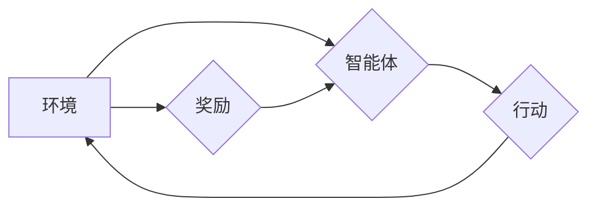

> 大规模语言模型，近端策略优化，强化学习，深度学习，自然语言处理

## 1. 背景介绍

近年来，大规模语言模型（LLM）在自然语言处理（NLP）领域取得了显著的进展，例如GPT-3、BERT、LaMDA等模型展现出强大的文本生成、理解和翻译能力。这些模型的训练通常依赖于海量文本数据和强大的计算资源，其核心是深度学习算法。然而，训练大型语言模型仍然面临着诸多挑战，例如训练效率低、参数量大、可解释性差等。

近端策略优化（Proximal Policy Optimization，PPO）算法作为一种基于强化学习的训练方法，在训练大规模语言模型方面展现出巨大的潜力。PPO算法能够有效地解决传统强化学习算法在训练大型模型时遇到的问题，例如梯度爆炸和训练不稳定等。

## 2. 核心概念与联系

### 2.1 强化学习

强化学习是一种机器学习方法，其核心是通过智能体与环境的交互来学习最优策略。智能体在环境中采取行动，环境会根据行动给予奖励或惩罚。智能体的目标是学习一个策略，使得在与环境交互的过程中获得最大的总奖励。

### 2.2 近端策略优化算法

PPO算法是一种基于策略梯度的强化学习算法，其目标是通过优化智能体的策略函数来最大化总奖励。PPO算法的核心思想是通过限制策略更新的幅度来保证训练的稳定性。

**Mermaid 流程图**



### 2.3 大规模语言模型

大规模语言模型是指参数量庞大、训练数据海量、计算资源消耗巨大的深度学习模型。这些模型通常具有强大的文本生成、理解和翻译能力，在NLP领域有着广泛的应用。

## 3. 核心算法原理 & 具体操作步骤

### 3.1 算法原理概述

PPO算法的核心思想是通过优化智能体的策略函数来最大化总奖励。策略函数是一个映射关系，将环境的状态映射到智能体采取的行动概率。PPO算法通过策略梯度来更新策略函数，同时通过一个称为“优势函数”的指标来衡量策略更新的有效性。

### 3.2 算法步骤详解

1. **初始化策略函数:** 随机初始化策略函数的参数。
2. **收集经验:** 智能体与环境交互，收集一系列状态、行动、奖励和下一个状态的经验数据。
3. **计算优势函数:** 根据收集的经验数据，计算每个状态下采取不同行动的优势函数值。优势函数表示采取特定行动相对于当前策略的期望奖励提升。
4. **更新策略函数:** 使用策略梯度和优势函数来更新策略函数的参数，使得策略函数能够最大化总奖励。
5. **重复步骤2-4:** 重复以上步骤，直到策略函数收敛或达到预设的训练次数。

### 3.3 算法优缺点

**优点:**

* 训练稳定性高，不易出现梯度爆炸等问题。
* 能够有效地利用经验数据，提高训练效率。
* 适用于各种类型的强化学习任务。

**缺点:**

* 训练过程相对复杂，需要一定的机器学习基础知识。
* 算法参数需要进行仔细调优，才能获得最佳的性能。

### 3.4 算法应用领域

PPO算法在强化学习领域有着广泛的应用，例如：

* **机器人控制:** 训练机器人完成各种复杂的任务，例如导航、抓取和操作。
* **游戏AI:** 训练游戏AI完成游戏中的各种任务，例如打败对手、完成关卡和收集资源。
* **推荐系统:** 训练推荐系统根据用户的历史行为推荐更符合用户偏好的内容。

## 4. 数学模型和公式 & 详细讲解 & 举例说明

### 4.1 数学模型构建

假设智能体在环境中采取行动，环境会根据行动给予奖励或惩罚。智能体的目标是学习一个策略函数π(s,a)，该函数将环境的状态s映射到智能体采取行动a的概率。

**状态空间:** S = {s1, s2, ..., sn}

**行动空间:** A = {a1, a2, ..., am}

**策略函数:** π(s, a)

**奖励函数:** R(s, a)

### 4.2 公式推导过程

PPO算法的目标是最大化总奖励，即：

$$
J(π) = E_{τ~π}[∑_{t=0}^{T} R(s_t, a_t)]
$$

其中，τ表示智能体与环境交互的轨迹，E表示期望值。

PPO算法使用策略梯度来更新策略函数，策略梯度的公式为：

$$
∇_{θ} J(π) = E_{τ~π}[∇_{θ} log π(s_t, a_t) * A(s_t, a_t)]
$$

其中，θ表示策略函数的参数，A(s_t, a_t)表示优势函数。

### 4.3 案例分析与讲解

假设一个智能体需要学习玩一个简单的游戏，例如贪吃蛇。

* **状态空间:** 游戏中的蛇的位置和食物的位置。
* **行动空间:** 向上、向下、向左、向右四个方向移动。
* **奖励函数:** 当蛇吃掉食物时获得奖励，否则不获得奖励。

PPO算法可以训练智能体学习一个策略函数，该函数能够根据游戏中的状态选择最优的行动，从而获得最大的总奖励。

## 5. 项目实践：代码实例和详细解释说明

### 5.1 开发环境搭建

* Python 3.7+
* TensorFlow 2.0+
* PyTorch 1.0+

### 5.2 源代码详细实现

```python
import tensorflow as tf

# 定义策略网络
class PolicyNetwork(tf.keras.Model):
    def __init__(self, state_dim, action_dim):
        super(PolicyNetwork, self).__init__()
        self.dense1 = tf.keras.layers.Dense(64, activation='relu')
        self.dense2 = tf.keras.layers.Dense(action_dim, activation='softmax')

    def call(self, state):
        x = self.dense1(state)
        return self.dense2(x)

# 定义优势函数网络
class ValueNetwork(tf.keras.Model):
    def __init__(self, state_dim):
        super(ValueNetwork, self).__init__()
        self.dense1 = tf.keras.layers.Dense(64, activation='relu')
        self.dense2 = tf.keras.layers.Dense(1)

    def call(self, state):
        x = self.dense1(state)
        return self.dense2(x)

# 定义PPO算法
class PPO:
    def __init__(self, state_dim, action_dim, learning_rate=0.001, gamma=0.99, clip_ratio=0.2):
        self.state_dim = state_dim
        self.action_dim = action_dim
        self.learning_rate = learning_rate
        self.gamma = gamma
        self.clip_ratio = clip_ratio
        self.policy_network = PolicyNetwork(state_dim, action_dim)
        self.value_network = ValueNetwork(state_dim)
        self.optimizer = tf.keras.optimizers.Adam(learning_rate=self.learning_rate)

    def train(self, states, actions, rewards, next_states, dones):
        # 计算优势函数
        values = self.value_network(states)
        next_values = self.value_network(next_states)
        advantages = rewards + self.gamma * next_values * (1 - dones) - values

        # 计算策略梯度
        log_probs = self.policy_network(states)
        log_probs = tf.math.log(log_probs[tf.range(len(states)), actions])
        ratios = tf.exp(log_probs - tf.reduce_max(log_probs, axis=1, keepdims=True))
        clipped_ratios = tf.clip_by_value(ratios, 1 - self.clip_ratio, 1 + self.clip_ratio)

        # 计算损失函数
        surr1 = ratios * advantages
        surr2 = clipped_ratios * advantages
        loss = -tf.reduce_mean(tf.minimum(surr1, surr2)) + 0.5 * tf.reduce_mean((values - rewards - self.gamma * next_values * (1 - dones))**2)

        # 更新网络参数
        self.optimizer.minimize(loss, var_list=[self.policy_network.trainable_variables, self.value_network.trainable_variables])

### 5.3 代码解读与分析

* **策略网络:** 使用多层感知机（MLP）结构，将状态映射到每个行动的概率分布。
* **优势函数网络:** 使用MLP结构，估计每个状态下采取特定行动的期望奖励提升。
* **PPO算法:** 使用策略梯度和优势函数来更新策略网络和优势函数网络的参数。

### 5.4 运行结果展示

通过训练PPO算法，可以得到一个能够有效地完成目标任务的策略函数。例如，在贪吃蛇游戏中，训练后的智能体能够学习到最优的移动策略，从而获得更高的分数。

## 6. 实际应用场景

### 6.1 自然语言生成

PPO算法可以用于训练大规模语言模型，例如GPT-3，用于文本生成、机器翻译、对话系统等任务。

### 6.2 机器人控制

PPO算法可以用于训练机器人完成各种复杂的任务，例如导航、抓取和操作。

### 6.3 游戏AI

PPO算法可以用于训练游戏AI，例如AlphaGo，用于打败人类对手。

### 6.4 未来应用展望

PPO算法在未来将有更广泛的应用，例如：

* **自动驾驶:** 训练自动驾驶汽车的决策系统。
* **医疗诊断:** 训练医疗诊断系统，辅助医生进行诊断。
* **金融预测:** 训练金融预测系统，预测股票价格、汇率等。

## 7. 工具和资源推荐

### 7.1 学习资源推荐

* **强化学习书籍:**
    * Reinforcement Learning: An Introduction by Sutton and Barto
    * Deep Reinforcement Learning Hands-On by Maxim Lapan
* **在线课程:**
    * Deep Reinforcement Learning Specialization by DeepLearning.AI
    * Reinforcement Learning by David Silver

### 7.2 开发工具推荐

* **TensorFlow:** https://www.tensorflow.org/
* **PyTorch:** https://pytorch.org/
* **OpenAI Gym:** https://gym.openai.com/

### 7.3 相关论文推荐

* Proximal Policy Optimization Algorithms by John Schulman et al.
* Trust Region Policy Optimization by John Schulman et al.

## 8. 总结：未来发展趋势与挑战

### 8.1 研究成果总结

PPO算法在强化学习领域取得了显著的进展，能够有效地训练大规模语言模型和解决各种复杂的任务。

### 8.2 未来发展趋势

* **模型规模和效率:** 探索训练更大规模、更高效的PPO模型。
* **算法鲁棒性和泛化能力:** 提高PPO算法的鲁棒性和泛化能力，使其能够适应更复杂的环境。
* **理论分析和理解:** 深入研究PPO算法的理论基础，提高对算法的理解和控制能力。

### 8.3 面临的挑战

* **训练数据和计算资源:** 训练大规模语言模型需要海量数据和强大的计算资源。
* **可解释性和安全性:** 大规模语言模型的决策过程难以解释，其安全性也需要进一步研究。
* **伦理问题:** 大规模语言模型的应用可能带来一些伦理问题，例如信息操纵和偏见放大。

### 8.4 研究展望