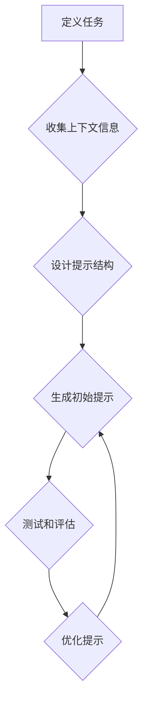

> 大语言模型，提示工程，自然语言处理，AI应用，文本生成，模型优化

## 1. 背景介绍

近年来，大语言模型（LLM）在自然语言处理（NLP）领域取得了令人瞩目的成就。从文本生成、翻译到问答和代码编写，LLM展现出强大的能力，为我们带来了全新的应用场景。然而，LLM的潜力并非一蹴而就，需要通过精心设计的“提示”（prompt）来引导模型，使其发挥最佳性能。

提示工程（Prompt Engineering）应运而生，它旨在通过设计和优化提示，以提高LLM的准确性、流畅性和创造性。 

随着LLM技术的不断发展，提示工程的重要性日益凸显。它不仅是LLM应用的关键环节，也是推动AI技术进步的重要方向。

## 2. 核心概念与联系

提示工程的核心在于理解LLM的工作机制，并根据其特点设计有效的提示。

**2.1 LLM的工作原理**

LLM本质上是一个复杂的统计模型，它通过学习海量文本数据，建立了语言的概率分布。当我们输入一个提示时，LLM会根据其训练数据，预测下一个最可能的词，并以此类推，最终生成一段完整的文本。

**2.2 提示的构成**

提示通常由以下几个部分组成：

* **任务描述:** 清晰地说明我们希望模型完成的任务，例如“翻译这段文本”、“写一首诗”或“生成一段代码”。
* **上下文信息:** 提供给模型的背景信息，帮助它更好地理解任务和生成更相关的输出。
* **示例:** 给出一些与任务相关的示例，引导模型学习正确的格式和风格。

**2.3 提示工程与LLM性能的关系**

提示的质量直接影响LLM的性能。一个精心设计的提示可以引导模型生成更准确、更流畅、更符合预期结果的文本。反之，一个模糊不清或错误的提示可能会导致模型产生错误或不相关的输出。

**2.4  提示工程流程**



## 3. 核心算法原理 & 具体操作步骤

### 3.1  算法原理概述

提示工程本身并非一个特定的算法，而是基于对LLM工作原理的理解，通过设计和优化提示来引导模型的生成过程。

### 3.2  算法步骤详解

1. **定义任务:** 首先，我们需要明确LLM需要完成的任务。例如，是翻译文本、生成代码、写诗还是回答问题？任务的清晰定义是提示工程成功的关键。
2. **收集上下文信息:** 根据任务需求，收集与任务相关的背景信息。例如，翻译文本时需要提供目标语言；生成代码时需要提供代码风格和功能要求。
3. **设计提示结构:** 根据任务和上下文信息，设计合适的提示结构。提示结构可以包括任务描述、上下文信息、示例等部分。
4. **生成初始提示:** 基于设计好的提示结构，生成初始提示。
5. **测试和评估:** 使用生成的提示与LLM进行测试，评估其性能。
6. **优化提示:** 根据测试结果，对提示进行优化。例如，调整提示的长度、添加更多上下文信息或修改示例。

### 3.3  算法优缺点

**优点:**

* **易于实施:** 提示工程不需要复杂的编程知识，可以通过简单的文本编辑来完成。
* **灵活度高:** 可以根据不同的任务和需求，设计不同的提示。
* **成本低:** 相比于训练新的LLM模型，提示工程的成本更低。

**缺点:**

* **效果有限:** 提示工程只能在一定程度上提高LLM的性能，无法完全解决所有问题。
* **需要经验:** 设计有效的提示需要一定的经验和技巧。
* **提示数量庞大:** 对于复杂的任务，可能需要设计大量的提示才能获得满意的结果。

### 3.4  算法应用领域

提示工程在各个领域都有广泛的应用，例如：

* **文本生成:** 写作、翻译、对话系统等。
* **代码生成:** 自动生成代码片段、完成代码补全等。
* **数据分析:** 从文本数据中提取信息、生成报告等。
* **教育:** 自动生成习题、提供个性化学习建议等。

## 4. 数学模型和公式 & 详细讲解 & 举例说明

### 4.1  数学模型构建

LLM的训练过程本质上是一个概率模型的训练过程。常用的数学模型包括：

* **Transformer:** Transformer是一种基于注意力机制的深度神经网络架构，在自然语言处理领域取得了突破性的进展。

* **BERT:** BERT（Bidirectional Encoder Representations from Transformers）是一种基于Transformer的预训练语言模型，在许多NLP任务上都表现出色。

### 4.2  公式推导过程

Transformer模型的核心是注意力机制，它允许模型关注输入序列中不同位置的词，并根据其重要性分配不同的权重。

注意力机制的计算公式如下：

$$
Attention(Q, K, V) = softmax(\frac{QK^T}{\sqrt{d_k}})V
$$

其中：

* $Q$：查询矩阵
* $K$：键矩阵
* $V$：值矩阵
* $d_k$：键向量的维度
* $softmax$：softmax函数

### 4.3  案例分析与讲解

假设我们有一个句子“我爱学习编程”，我们要使用注意力机制来计算每个词对其他词的注意力权重。

首先，我们将句子转换为词嵌入向量，然后将这些向量分别作为查询矩阵 $Q$、键矩阵 $K$ 和值矩阵 $V$。

然后，我们使用注意力机制的公式计算每个词对其他词的注意力权重。例如，计算“学习”对其他词的注意力权重，我们可以将“学习”作为查询向量，其他词作为键向量，然后计算注意力权重。

最终，我们将所有词的注意力权重加权平均，得到每个词的上下文向量。

## 5. 项目实践：代码实例和详细解释说明

### 5.1  开发环境搭建

* Python 3.7+
* PyTorch 或 TensorFlow
* 其他必要的库，例如transformers、numpy、pandas等

### 5.2  源代码详细实现

```python
from transformers import AutoModelForSeq2SeqLM, AutoTokenizer

# 加载预训练模型和词典
model_name = "t5-base"
tokenizer = AutoTokenizer.from_pretrained(model_name)
model = AutoModelForSeq2SeqLM.from_pretrained(model_name)

# 定义提示
prompt = "翻译以下文本到英文: 我爱学习编程。"

# 将提示转换为模型输入格式
inputs = tokenizer(prompt, return_tensors="pt")

# 使用模型生成输出
outputs = model.generate(**inputs)

# 将输出转换为文本
translated_text = tokenizer.decode(outputs[0], skip_special_tokens=True)

# 打印输出结果
print(translated_text)
```

### 5.3  代码解读与分析

* 我们首先加载预训练的T5模型和词典。
* 然后，我们定义一个提示，并将其转换为模型输入格式。
* 使用模型生成输出，并将其转换为文本。
* 最后，我们打印输出结果。

### 5.4  运行结果展示

```
I love learning programming.
```

## 6. 实际应用场景

### 6.1  文本生成

* **内容创作:** 使用LLM生成文章、故事、诗歌等创意内容。
* **营销文案:** 自动生成广告文案、产品描述等营销材料。
* **聊天机器人:** 开发更自然、更智能的聊天机器人。

### 6.2  代码生成

* **代码补全:** 根据代码上下文自动补全代码片段。
* **代码生成:** 根据自然语言描述自动生成代码。
* **代码翻译:** 将代码从一种编程语言翻译到另一种编程语言。

### 6.3  数据分析

* **文本摘要:** 从长文本中自动生成摘要。
* **情感分析:** 分析文本的情感倾向，例如正面、负面或中性。
* **主题提取:** 从文本中提取主题和关键词。

### 6.4  未来应用展望

* **个性化教育:** 根据学生的学习进度和需求，提供个性化的学习建议和练习。
* **医疗诊断:** 辅助医生进行疾病诊断，提高诊断准确率。
* **法律服务:** 自动生成法律文件，提高法律服务的效率。

## 7. 工具和资源推荐

### 7.1  学习资源推荐

* **OpenAI API:** https://openai.com/api/
* **Hugging Face:** https://huggingface.co/
* **Papers with Code:** https://paperswithcode.com/

### 7.2  开发工具推荐

* **PyTorch:** https://pytorch.org/
* **TensorFlow:** https://www.tensorflow.org/
* **Jupyter Notebook:** https://jupyter.org/

### 7.3  相关论文推荐

* **Attention Is All You Need:** https://arxiv.org/abs/1706.03762
* **BERT: Pre-training of Deep Bidirectional Transformers for Language Understanding:** https://arxiv.org/abs/1810.04805

## 8. 总结：未来发展趋势与挑战

### 8.1  研究成果总结

提示工程在LLM应用中取得了显著进展，有效提高了LLM的性能和应用范围。

### 8.2  未来发展趋势

* **自动化提示生成:** 研究自动生成有效提示的方法，降低提示工程的成本和难度。
* **个性化提示:** 根据用户的需求和偏好，生成个性化的提示。
* **多模态提示:** 将文本、图像、音频等多模态信息融合到提示中，提高LLM的理解和生成能力。

### 8.3  面临的挑战

* **提示的复杂性:** 对于复杂的任务，设计有效的提示仍然是一个挑战。
* **提示的通用性:** 现有的提示往往针对特定任务，缺乏通用性。
* **提示的安全性:** 恶意利用提示可能导致LLM生成有害内容。

### 8.4  研究展望

未来，提示工程将继续是LLM研究的重要方向，需要不断探索新的方法和技术，以提高LLM的性能和安全性，并将其应用于更广泛的领域。

## 9. 附录：常见问题与解答

**Q1: 如何设计一个好的提示？**

A1: 设计一个好的提示需要考虑以下几个方面：

* **清晰明确:** 提示应该清晰地描述任务，避免歧义。
* **具体详细:** 提供足够的上下文信息，帮助LLM理解任务。
* **示例引导:** 提供一些与任务相关的示例，引导LLM学习正确的格式和风格。

**Q2: 如何评估提示的质量？**

A2: 可以通过以下方法评估提示的质量：

* **准确率:** 提示生成的输出是否准确符合预期。
* **流畅度:** 提示生成的输出是否流畅自然。
* **相关性:** 提示生成的输出是否与任务相关。

**Q3: 提示工程与模型训练有什么关系？**

A3: 提示工程和模型训练是两个不同的环节。模型训练是通过大量数据训练模型参数，使其能够生成符合预期结果的文本。提示工程则是通过设计和优化提示，引导模型更好地完成特定任务。

**Q4: 提示工程的未来发展趋势是什么？**

A4: 未来，提示工程将朝着自动化、个性化和多模态的方向发展。


作者：禅与计算机程序设计艺术 / Zen and the Art of Computer Programming 
<end_of_turn>