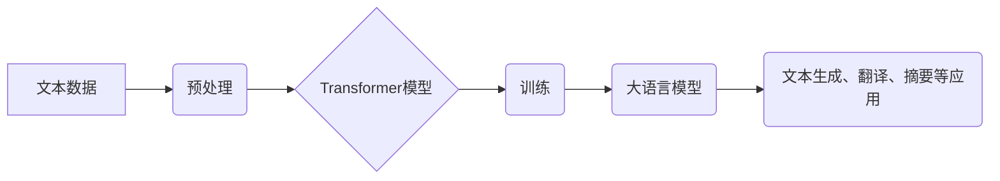

> 大语言模型、自然语言处理、深度学习、Transformer、文本生成、机器翻译、对话系统

## 1. 背景介绍

近年来，人工智能领域取得了令人瞩目的进展，其中大语言模型（Large Language Models，LLMs）作为一种新兴技术，展现出强大的潜力，在自然语言处理（Natural Language Processing，NLP）领域取得了突破性的成就。

大语言模型是指在海量文本数据上训练的深度学习模型，能够理解和生成人类语言。它们拥有强大的文本生成、翻译、摘要、问答等能力，并逐渐应用于各个领域，例如搜索引擎、聊天机器人、内容创作、代码生成等。

## 2. 核心概念与联系

大语言模型的核心概念包括：

* **Transformer:** Transformer是一种新型的深度学习架构，其自注意力机制（Self-Attention）能够捕捉文本序列中的长距离依赖关系，为大语言模型的训练和应用奠定了基础。

* **深度学习:** 深度学习是一种机器学习的子领域，利用多层神经网络学习复杂的模式和特征，是训练大语言模型的关键技术。

* **自然语言处理:** 自然语言处理是指使计算机能够理解、处理和生成人类语言的技术，大语言模型是NLP领域的重要应用之一。

**Mermaid 流程图:**



## 3. 核心算法原理 & 具体操作步骤

### 3.1  算法原理概述

大语言模型的核心算法是基于Transformer架构的深度学习模型。其主要原理是通过多层Transformer编码器和解码器结构，学习文本序列的语义表示和生成能力。

* **编码器:** 编码器负责将输入文本序列转换为语义表示，通过多层Transformer模块，逐层提取文本的特征和语义信息。

* **解码器:** 解码器负责根据编码器的输出生成目标文本序列，同样通过多层Transformer模块，逐层生成文本，并利用注意力机制选择与当前生成词语相关的上下文信息。

### 3.2  算法步骤详解

1. **数据预处理:** 将原始文本数据进行清洗、分词、标记等预处理操作，使其适合模型训练。

2. **模型训练:** 使用预处理后的文本数据训练Transformer模型，通过反向传播算法优化模型参数，使其能够准确地生成目标文本。

3. **模型评估:** 使用测试数据集评估模型的性能，例如准确率、困惑度等指标。

4. **模型部署:** 将训练好的模型部署到实际应用场景中，例如聊天机器人、文本生成工具等。

### 3.3  算法优缺点

**优点:**

* 强大的文本理解和生成能力。
* 可以处理长文本序列。
* 能够捕捉文本中的长距离依赖关系。

**缺点:**

* 训练成本高，需要大量的计算资源和数据。
* 容易受到训练数据偏差的影响。
* 缺乏对真实世界知识的理解。

### 3.4  算法应用领域

大语言模型在以下领域具有广泛的应用前景：

* **自然语言理解:** 文本分类、情感分析、问答系统等。
* **自然语言生成:** 文本摘要、机器翻译、对话系统等。
* **代码生成:** 自动生成代码、代码修复等。
* **内容创作:** 写作文章、生成创意内容等。

## 4. 数学模型和公式 & 详细讲解 & 举例说明

### 4.1  数学模型构建

大语言模型的数学模型主要基于Transformer架构，其核心是自注意力机制和多头注意力机制。

* **自注意力机制:** 自注意力机制能够计算每个词语与其他词语之间的相关性，并赋予每个词语不同的权重，从而捕捉文本序列中的长距离依赖关系。

* **多头注意力机制:** 多头注意力机制通过使用多个自注意力头，可以学习到不同层次的语义信息，提高模型的表达能力。

### 4.2  公式推导过程

自注意力机制的计算公式如下：

$$
Attention(Q, K, V) = softmax(\frac{QK^T}{\sqrt{d_k}})V
$$

其中：

* $Q$：查询矩阵
* $K$：键矩阵
* $V$：值矩阵
* $d_k$：键向量的维度
* $softmax$：softmax函数

### 4.3  案例分析与讲解

例如，在机器翻译任务中，输入句子为“The cat sat on the mat”，输出句子为“猫坐在垫子上”。

通过自注意力机制，模型可以学习到“cat”与“sat”之间的关系，以及“mat”与“on”之间的关系，从而准确地翻译句子。

## 5. 项目实践：代码实例和详细解释说明

### 5.1  开发环境搭建

* Python 3.7+
* PyTorch 1.7+
* CUDA 10.2+

### 5.2  源代码详细实现

```python
import torch
import torch.nn as nn

class Transformer(nn.Module):
    def __init__(self, vocab_size, embedding_dim, num_heads, num_layers):
        super(Transformer, self).__init__()
        self.embedding = nn.Embedding(vocab_size, embedding_dim)
        self.transformer_layers = nn.ModuleList([
            nn.TransformerEncoderLayer(embedding_dim, num_heads)
            for _ in range(num_layers)
        ])
        self.linear = nn.Linear(embedding_dim, vocab_size)

    def forward(self, x):
        x = self.embedding(x)
        for layer in self.transformer_layers:
            x = layer(x)
        x = self.linear(x)
        return x
```

### 5.3  代码解读与分析

* `__init__` 方法初始化模型参数，包括词嵌入层、Transformer编码器层和线性输出层。

* `forward` 方法定义模型的正向传播过程，将输入序列经过词嵌入层、Transformer编码器层和线性输出层，最终得到输出序列。

### 5.4  运行结果展示

训练好的模型可以用于文本生成、机器翻译等任务，并通过评估指标衡量模型性能。

## 6. 实际应用场景

### 6.1  搜索引擎

大语言模型可以用于理解用户搜索意图，并提供更精准的搜索结果。

### 6.2  聊天机器人

大语言模型可以用于构建更智能的聊天机器人，能够进行自然流畅的对话。

### 6.3  内容创作

大语言模型可以用于辅助内容创作，例如生成文章、故事、诗歌等。

### 6.4  未来应用展望

大语言模型在未来将应用于更多领域，例如教育、医疗、法律等，并推动人工智能技术的发展。

## 7. 工具和资源推荐

### 7.1  学习资源推荐

* **书籍:**
    * 《深度学习》
    * 《Transformer 详解》
* **在线课程:**
    * Coursera: 深度学习
    * fast.ai: 深度学习课程

### 7.2  开发工具推荐

* **PyTorch:** 深度学习框架
* **TensorFlow:** 深度学习框架
* **Hugging Face:** 大语言模型库

### 7.3  相关论文推荐

* 《Attention Is All You Need》
* 《BERT: Pre-training of Deep Bidirectional Transformers for Language Understanding》
* 《GPT-3: Language Models are Few-Shot Learners》

## 8. 总结：未来发展趋势与挑战

### 8.1  研究成果总结

大语言模型在自然语言处理领域取得了显著的进展，展现出强大的文本理解和生成能力。

### 8.2  未来发展趋势

* **模型规模更大:** 训练更大规模的模型，提升模型性能。
* **多模态学习:** 将文本与其他模态数据（图像、音频等）结合，实现更全面的理解和生成。
* **可解释性增强:** 研究大语言模型的决策机制，提高模型的可解释性。

### 8.3  面临的挑战

* **数据偏见:** 训练数据可能存在偏见，导致模型输出结果不准确或不公平。
* **计算资源:** 训练大语言模型需要大量的计算资源，成本较高。
* **伦理问题:** 大语言模型可能被用于生成虚假信息或进行恶意攻击，需要关注其伦理问题。

### 8.4  研究展望

未来，大语言模型的研究将继续深入，探索其更广泛的应用场景，并解决其面临的挑战，推动人工智能技术的发展。

## 9. 附录：常见问题与解答

* **Q: 如何训练大语言模型？**

* **A:** 训练大语言模型需要大量的文本数据、强大的计算资源和专业的机器学习知识。

* **Q: 大语言模型有哪些应用场景？**

* **A:** 大语言模型可以应用于文本生成、机器翻译、问答系统、聊天机器人等多个领域。

* **Q: 大语言模型的未来发展趋势是什么？**

* **A:** 未来，大语言模型将朝着更大规模、多模态学习、可解释性增强等方向发展。


作者：禅与计算机程序设计艺术 / Zen and the Art of Computer Programming 
<end_of_turn>