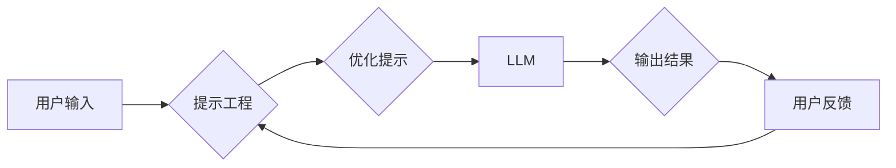

> 大语言模型，LLM，提示工程，文本生成，自然语言处理，AI应用

## 1. 背景介绍

近年来，大语言模型（LLM）在自然语言处理（NLP）领域取得了令人瞩目的成就。从文本生成、翻译到问答和代码编写，LLM展现出强大的能力，为我们带来了全新的应用场景。然而，LLM的潜力并非仅仅体现在其强大的参数规模和训练数据上，更重要的是如何有效地与模型进行交互，引导其生成我们期望的输出。这就是提示工程（Prompt Engineering）的重要性。

提示工程是指设计和优化输入提示，以引导大语言模型生成更准确、更相关、更符合预期结果的输出。它就像给LLM提供清晰的指令和上下文，帮助其理解我们的意图并生成高质量的响应。

## 2. 核心概念与联系

### 2.1  大语言模型

大语言模型（LLM）是一种基于Transformer架构的深度学习模型，其核心是通过学习大量的文本数据来理解和生成人类语言。LLM拥有庞大的参数数量和复杂的网络结构，能够捕捉语言的复杂语法和语义关系。

### 2.2  提示工程

提示工程是LLM应用的关键环节，它涉及到以下几个核心概念：

* **提示（Prompt）：** 指向LLM的输入指令或文本片段，引导其生成特定类型的输出。
* **提示格式：** 指示如何组织和结构化提示，以提高LLM的理解和响应能力。
* **提示优化：** 通过调整提示内容、格式和结构，不断改进LLM的输出质量。

### 2.3  LLM与提示工程的交互

LLM与提示工程之间存在着密切的联系。LLM的强大能力依赖于高质量的提示引导，而提示工程则需要充分理解LLM的特性和局限性。

**Mermaid 流程图**



## 3. 核心算法原理 & 具体操作步骤

### 3.1  算法原理概述

提示工程的核心算法原理是基于Transformer模型的注意力机制。Transformer模型能够捕捉文本序列中不同词语之间的关系，并根据上下文信息生成更准确的输出。提示工程通过设计特定的提示结构，引导Transformer模型关注关键信息，从而生成更符合预期结果的输出。

### 3.2  算法步骤详解

1. **定义目标：** 首先明确需要LLM完成的任务，例如文本生成、翻译、问答等。
2. **设计提示结构：** 根据目标任务，设计合适的提示结构，例如提供上下文信息、明确指令、设置输出格式等。
3. **选择LLM模型：** 根据任务需求选择合适的LLM模型，例如GPT-3、BERT、T5等。
4. **优化提示：** 通过调整提示内容、格式和结构，不断改进LLM的输出质量。可以使用A/B测试、人工评估等方法进行优化。
5. **评估结果：** 评估LLM生成的输出结果，并根据评估结果进行进一步的优化。

### 3.3  算法优缺点

**优点：**

* **灵活性高：** 提示工程能够灵活地调整LLM的输出，适应不同的任务需求。
* **易于实现：** 提示工程不需要复杂的模型训练，可以通过简单的文本编辑实现。
* **成本低：** 相比于模型训练，提示工程的成本相对较低。

**缺点：**

* **效果依赖于提示质量：** 提示工程的效果直接取决于提示的质量，设计高质量的提示需要经验和技巧。
* **缺乏通用性：** 不同的任务可能需要不同的提示结构，缺乏通用的提示设计方法。
* **黑盒问题：** LLMs的内部工作机制较为复杂，难以完全理解提示如何影响LLM的输出。

### 3.4  算法应用领域

提示工程在多个领域都有广泛的应用，例如：

* **文本生成：** 生成小说、诗歌、剧本等创意文本。
* **机器翻译：** 将文本从一种语言翻译成另一种语言。
* **问答系统：** 回答用户提出的问题，提供相关信息。
* **代码生成：** 根据自然语言描述生成代码。
* **聊天机器人：** 与用户进行自然语言对话，提供服务和帮助。

## 4. 数学模型和公式 & 详细讲解 & 举例说明

### 4.1  数学模型构建

LLM的训练过程本质上是一个优化问题，目标是找到模型参数，使得模型在训练数据上表现最佳。常用的数学模型包括交叉熵损失函数和梯度下降算法。

**交叉熵损失函数：**

$$
Loss = -\sum_{i=1}^{N} y_i \log(\hat{y}_i)
$$

其中：

* $N$ 是样本数量
* $y_i$ 是真实标签
* $\hat{y}_i$ 是模型预测的概率

**梯度下降算法：**

$$
\theta = \theta - \alpha \nabla Loss(\theta)
$$

其中：

* $\theta$ 是模型参数
* $\alpha$ 是学习率
* $\nabla Loss(\theta)$ 是损失函数对参数的梯度

### 4.2  公式推导过程

交叉熵损失函数的推导过程基于概率论和信息论的原理。其目标是衡量模型预测结果与真实标签之间的差异。梯度下降算法则通过迭代更新模型参数，不断降低损失函数的值，从而使模型的预测结果越来越接近真实标签。

### 4.3  案例分析与讲解

假设我们训练一个文本分类模型，目标是将文本分类为正类或负类。我们可以使用交叉熵损失函数和梯度下降算法来训练模型。

在训练过程中，模型会根据输入文本生成预测概率，并将该概率与真实标签进行比较，计算损失值。然后，模型会根据梯度下降算法更新参数，降低损失值。

## 5. 项目实践：代码实例和详细解释说明

### 5.1  开发环境搭建

为了进行LLM应用实践，我们需要搭建一个开发环境。常用的开发环境包括：

* **Python:** 作为主要的编程语言
* **PyTorch/TensorFlow:** 作为深度学习框架
* **HuggingFace Transformers:** 提供预训练LLM模型和工具

### 5.2  源代码详细实现

以下是一个使用HuggingFace Transformers库进行文本生成的简单代码示例：

```python
from transformers import pipeline

# 初始化文本生成器
generator = pipeline("text-generation", model="gpt2")

# 生成文本
text = generator("写一首关于春天的诗", max_length=100, num_return_sequences=3)

# 打印结果
for i in range(len(text)):
    print(f"输出{i+1}: {text[i]['generated_text']}")
```

### 5.3  代码解读与分析

* `pipeline("text-generation", model="gpt2")`: 使用HuggingFace Transformers库初始化一个文本生成器，模型选择GPT-2。
* `generator("写一首关于春天的诗", max_length=100, num_return_sequences=3)`: 使用文本生成器生成文本，输入提示为“写一首关于春天的诗”，最大长度为100个词，生成3个不同的结果。
* `print(f"输出{i+1}: {text[i]['generated_text']}")`: 打印生成的文本结果。

### 5.4  运行结果展示

运行该代码后，将输出3首关于春天的诗歌。

## 6. 实际应用场景

### 6.1  文本生成

* **小说、诗歌、剧本创作：** LLMs可以根据用户的提示生成创意文本，帮助作家克服创作瓶颈。
* **广告文案、营销内容创作：** LLMs可以根据产品特点和目标受众生成吸引人的广告文案和营销内容。
* **新闻报道、技术文档撰写：** LLMs可以根据数据和事件生成新闻报道和技术文档，提高效率。

### 6.2  机器翻译

* **跨语言沟通：** LLMs可以将文本从一种语言翻译成另一种语言，促进跨语言沟通。
* **国际贸易、旅游服务：** LLMs可以帮助企业和个人进行跨语言交流，拓展业务和服务范围。

### 6.3  问答系统

* **客户服务机器人：** LLMs可以回答用户的常见问题，提供快速和便捷的客户服务。
* **教育辅助系统：** LLMs可以回答学生的疑问，提供个性化的学习帮助。

### 6.4  未来应用展望

随着LLM技术的不断发展，其应用场景将更加广泛，例如：

* **个性化教育：** 根据学生的学习进度和需求，提供个性化的学习内容和辅导。
* **医疗诊断辅助：** 帮助医生分析患者症状，提供辅助诊断建议。
* **法律文本分析：** 分析法律文件，提取关键信息，辅助法律工作。

## 7. 工具和资源推荐

### 7.1  学习资源推荐

* **HuggingFace Transformers文档：** https://huggingface.co/docs/transformers/index
* **OpenAI API文档：** https://beta.openai.com/docs/api-reference/introduction
* **DeepLearning.AI课程：** https://www.deeplearning.ai/

### 7.2  开发工具推荐

* **Jupyter Notebook:** 用于代码编写和实验
* **VS Code:** 代码编辑器，支持多种语言和插件
* **Google Colab:** 云端开发环境，无需安装软件

### 7.3  相关论文推荐

* **Attention Is All You Need:** https://arxiv.org/abs/1706.03762
* **BERT: Pre-training of Deep Bidirectional Transformers for Language Understanding:** https://arxiv.org/abs/1810.04805
* **GPT-3: Language Models are Few-Shot Learners:** https://arxiv.org/abs/2005.14165

## 8. 总结：未来发展趋势与挑战

### 8.1  研究成果总结

近年来，LLM取得了显著的进展，在文本生成、机器翻译、问答系统等领域展现出强大的能力。提示工程作为LLM应用的关键环节，也取得了重要的进展，为LLM的应用提供了新的思路和方法。

### 8.2  未来发展趋势

* **模型规模和能力的提升：** LLMs的规模和能力将继续提升，能够处理更复杂的任务，生成更高质量的输出。
* **多模态LLMs的开发：** LLMs将融合图像、音频等多模态数据，实现更丰富的交互和应用场景。
* **可解释性和安全性研究：** 研究LLMs的内部工作机制，提高其可解释性和安全性，避免潜在的风险。

### 8.3  面临的挑战

* **数据获取和标注：** LLMs的训练需要大量的文本数据，数据获取和标注成本较高。
* **计算资源需求：** LLMs的训练和推理需要大量的计算资源，成本较高。
* **伦理和社会影响：** LLMs的应用可能带来伦理和社会问题，需要谨慎考虑和应对。

### 8.4  研究展望

未来，LLM研究将继续朝着更强大、更安全、更可解释的方向发展。提示工程也将成为LLM应用的重要研究方向，探索更有效的提示设计方法，提高LLM的应用效率和效果。

## 9. 附录：常见问题与解答

**Q1：如何设计高质量的提示？**

A1：设计高质量的提示需要考虑以下几个方面：

* **明确目标：** 首先明确LLM需要完成的任务。
* **提供上下文信息：** 为LLM提供足够的背景信息，帮助其理解任务需求。
* **使用清晰的指令：** 使用简洁明了、易于理解的指令，避免歧义。
* **设置输出格式：** 指示LLM以何种格式输出结果。
* **进行A/B测试：** 通过测试不同版本的提示，选择效果最好的版本。

**Q2：LLM的输出结果是否总是准确