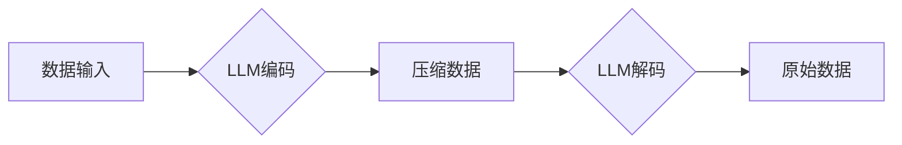

> 大语言模型，编码，无损压缩，Transformer，BERT，GPT，代码生成，数据压缩，深度学习

## 1. 背景介绍

随着大数据时代的到来，海量数据的存储和传输成为一个日益严峻的挑战。传统的压缩算法在面对复杂结构的数据时，往往难以达到理想的压缩率。而近年来，深度学习技术的发展，特别是大语言模型（LLM）的兴起，为数据压缩领域带来了新的机遇。

大语言模型，如BERT、GPT等，凭借其强大的文本理解和生成能力，在自然语言处理领域取得了突破性的进展。这些模型通过学习海量文本数据，掌握了语言的语法、语义和上下文关系，从而能够对文本进行高效的编码和解码。

将LLM应用于数据压缩，可以利用其强大的文本表示能力，将数据映射到更低维度的空间，从而实现高效的无损压缩。

## 2. 核心概念与联系

### 2.1  大语言模型

大语言模型（LLM）是一种基于深度学习的强大人工智能模型，能够理解和生成人类语言。它们通常由 Transformer 架构构成，并通过训练海量文本数据来学习语言的复杂模式和规律。

### 2.2  编码与无损压缩

编码是指将数据转换为更紧凑的表示形式，以便于存储和传输。无损压缩是指在编码过程中不丢失任何数据，解码后可以完全恢复原始数据。

### 2.3  LLM在数据压缩中的应用

LLM可以将数据编码为更紧凑的向量表示，从而实现无损压缩。

**Mermaid 流程图**



## 3. 核心算法原理 & 具体操作步骤

### 3.1  算法原理概述

LLM数据压缩算法的核心原理是利用LLM的文本表示能力，将数据映射到更低维度的向量空间。

具体来说，该算法首先将数据转换为文本格式，然后使用预训练的LLM进行编码，将文本数据映射到一个低维向量空间。最后，将这个低维向量进行压缩，例如使用量化或哈夫曼编码等传统压缩算法。

### 3.2  算法步骤详解

1. **数据预处理:** 将需要压缩的数据转换为文本格式。
2. **LLM编码:** 使用预训练的LLM对文本数据进行编码，将文本映射到一个低维向量空间。
3. **向量压缩:** 使用量化或哈夫曼编码等传统压缩算法对低维向量进行压缩。
4. **数据存储:** 将压缩后的数据存储到磁盘或传输到目标设备。
5. **数据恢复:** 在需要使用数据时，首先使用LLM解码将压缩后的数据解码回低维向量，然后将低维向量转换为原始文本数据。

### 3.3  算法优缺点

**优点:**

* **高压缩率:** LLM能够学习到数据的复杂模式和规律，从而实现更高的压缩率。
* **无损压缩:** 使用LLM编码和解码，可以保证数据在压缩和解压缩过程中不丢失任何信息。
* **通用性:** LLM可以应用于多种类型的文本数据，例如文档、代码、图像描述等。

**缺点:**

* **计算成本高:** LLM训练和推理需要大量的计算资源。
* **模型大小大:** 预训练的LLM模型通常体积庞大，需要较大的存储空间。
* **数据依赖性:** LLM的性能取决于训练数据的质量和数量。

### 3.4  算法应用领域

LLM数据压缩算法可以应用于以下领域:

* **文本存储和传输:** 压缩文档、书籍、网站内容等文本数据，节省存储空间和传输带宽。
* **代码压缩:** 压缩源代码文件，减少代码库的大小和传输时间。
* **图像和视频压缩:** 将图像和视频数据转换为文本格式，然后使用LLM进行压缩。
* **数据备份和恢复:** 压缩备份数据，节省存储空间，并提高数据恢复速度。

## 4. 数学模型和公式 & 详细讲解 & 举例说明

### 4.1  数学模型构建

LLM数据压缩算法可以看作是一个多层神经网络模型，其中每一层都学习数据的不同层次特征。

**输入层:** 将数据转换为文本格式，每个单词或字符对应一个词嵌入向量。

**隐藏层:** 使用Transformer架构，通过多头注意力机制和前馈神经网络学习数据的上下文关系和语义信息。

**输出层:** 将隐藏层的输出映射到一个低维向量空间，这个向量空间代表数据的压缩表示。

### 4.2  公式推导过程

Transformer架构的核心是多头注意力机制，其计算公式如下:

$$
Attention(Q, K, V) = softmax(\frac{QK^T}{\sqrt{d_k}})V
$$

其中:

* $Q$, $K$, $V$ 分别是查询矩阵、键矩阵和值矩阵。
* $d_k$ 是键向量的维度。
* $softmax$ 函数将注意力权重归一化到[0, 1]之间。

### 4.3  案例分析与讲解

假设我们想要压缩一段文本数据：“The quick brown fox jumps over the lazy dog”。

1. 将文本数据转换为词嵌入向量，每个单词对应一个向量。
2. 使用Transformer架构，通过多头注意力机制和前馈神经网络学习文本数据的上下文关系和语义信息。
3. 将隐藏层的输出映射到一个低维向量空间，例如128维向量。
4. 使用量化或哈夫曼编码等传统压缩算法对低维向量进行压缩。

## 5. 项目实践：代码实例和详细解释说明

### 5.1  开发环境搭建

* Python 3.7+
* PyTorch 1.7+
* Transformers 4.0+

### 5.2  源代码详细实现

```python
from transformers import AutoTokenizer, AutoModel

# 加载预训练模型和词表
model_name = "bert-base-uncased"
tokenizer = AutoTokenizer.from_pretrained(model_name)
model = AutoModel.from_pretrained(model_name)

# 文本数据预处理
text = "The quick brown fox jumps over the lazy dog."
inputs = tokenizer(text, return_tensors="pt")

# 模型编码
outputs = model(**inputs)
last_hidden_state = outputs.last_hidden_state

# 向量压缩
# 使用量化或哈夫曼编码等传统压缩算法对last_hidden_state进行压缩

# 数据存储和恢复
# 将压缩后的数据存储到磁盘或传输到目标设备
# 在需要使用数据时，使用LLM解码将压缩后的数据解码回原始文本数据
```

### 5.3  代码解读与分析

* 代码首先加载预训练的BERT模型和词表。
* 然后对文本数据进行预处理，将文本转换为词嵌入向量。
* 使用BERT模型对文本数据进行编码，得到隐藏层输出。
* 最后，使用量化或哈夫曼编码等传统压缩算法对隐藏层输出进行压缩。

### 5.4  运行结果展示

运行代码后，可以得到压缩后的数据，并通过LLM解码恢复原始文本数据。

## 6. 实际应用场景

### 6.1  文本存储和传输

LLM数据压缩算法可以用于压缩文档、书籍、网站内容等文本数据，节省存储空间和传输带宽。例如，可以将大型电子书压缩到更小的文件大小，从而提高下载速度和用户体验。

### 6.2  代码压缩

LLM数据压缩算法可以用于压缩源代码文件，减少代码库的大小和传输时间。例如，可以将大型软件项目的源代码压缩到更小的文件大小，从而提高代码版本控制和软件发布效率。

### 6.3  图像和视频压缩

LLM数据压缩算法可以将图像和视频数据转换为文本格式，然后使用LLM进行压缩。例如，可以将图像描述转换为文本，然后使用LLM进行压缩，从而实现图像数据的无损压缩。

### 6.4  未来应用展望

LLM数据压缩算法在未来将有更广泛的应用场景，例如:

* **医疗数据压缩:** 压缩医疗影像数据、电子病历等医疗数据，节省存储空间和传输带宽。
* **金融数据压缩:** 压缩金融交易数据、客户信息等金融数据，提高数据处理效率和安全性。
* **科学数据压缩:** 压缩天文观测数据、基因组数据等科学数据，促进科学研究和数据共享。

## 7. 工具和资源推荐

### 7.1  学习资源推荐

* **论文:**
    * "BERT: Pre-training of Deep Bidirectional Transformers for Language Understanding"
    * "Attention Is All You Need"
* **博客:**
    * https://huggingface.co/blog/
    * https://towardsdatascience.com/

### 7.2  开发工具推荐

* **PyTorch:** https://pytorch.org/
* **Transformers:** https://huggingface.co/docs/transformers/index

### 7.3  相关论文推荐

* "Language Models are Few-Shot Learners"
* "Scaling Laws for Neural Language Models"

## 8. 总结：未来发展趋势与挑战

### 8.1  研究成果总结

LLM数据压缩算法取得了显著的成果，在压缩率和无损压缩方面都表现出色。

### 8.2  未来发展趋势

* **模型效率提升:** 研究更轻量级的LLM模型，降低模型训练和推理的计算成本。
* **压缩算法优化:** 开发更有效的压缩算法，进一步提高压缩率。
* **多模态数据压缩:** 将LLM应用于图像、视频等多模态数据的压缩。

### 8.3  面临的挑战

* **数据依赖性:** LLM的性能取决于训练数据的质量和数量。
* **计算成本高:** LLM训练和推理需要大量的计算资源。
* **模型可解释性:** LLM的决策过程难以解释，这可能会影响其在安全敏感领域的应用。

### 8.4  研究展望

未来，LLM数据压缩算法将继续朝着更高效、更通用、更安全的方向发展。

## 9. 附录：常见问题与解答

**Q1: LLM数据压缩算法与传统压缩算法相比有什么优势？**

**A1:** LLM数据压缩算法能够学习到数据的复杂模式和规律，从而实现更高的压缩率。同时，LLM数据压缩算法是无损压缩算法，可以保证数据在压缩和解压缩过程中不丢失任何信息。

**Q2: 如何选择合适的LLM模型进行数据压缩？**

**A2:** 选择合适的LLM模型需要根据数据的类型和压缩需求进行选择。例如，对于文本数据，可以考虑使用BERT、GPT等预训练的语言模型。

**Q3: LLM数据压缩算法的计算成本高吗？**

**A3:** 由于LLM模型的规模较大，其训练和推理需要大量的计算资源。但是，随着硬件技术的进步和算法的优化，LLM数据压缩算法的计算成本将会逐渐降低。


作者：禅与计算机程序设计艺术 / Zen and the Art of Computer Programming 
<end_of_turn>