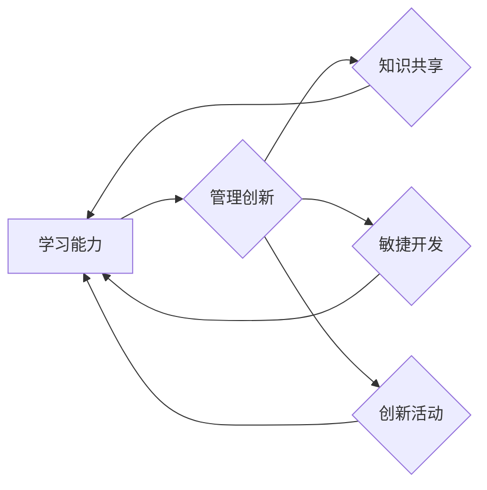

> 学习能力，管理创新，人工智能，机器学习，深度学习，知识图谱，数据驱动，敏捷开发

## 1. 背景介绍

在当今科技飞速发展的时代，学习能力和管理创新已成为企业和个人持续发展的关键驱动力。人工智能（AI）的兴起，特别是深度学习技术的突破，为学习能力的提升和管理创新的加速提供了强大的技术支撑。

学习能力是指个体或组织从经验中获取知识、技能和理解，并将其应用于解决新问题的能力。管理创新是指在组织内部建立和实施新的管理模式、流程和制度，以提高效率、效益和竞争力。

传统的管理模式往往依赖于经验和规则，难以适应快速变化的环境。而学习型组织则强调知识共享、持续学习和适应性，能够更有效地应对挑战和抓住机遇。

## 2. 核心概念与联系

学习能力和管理创新之间存在着密切的联系。学习能力是管理创新的基础，而管理创新则可以促进学习能力的提升。

**2.1 学习能力与管理创新的关系**

学习能力是管理创新的源泉。只有具备强大的学习能力，组织才能不断吸收新的知识和技术，并将其转化为创新成果。

**2.2 管理创新与学习能力的循环促进**

管理创新可以促进学习能力的提升，例如：

* 建立知识共享平台，促进知识传播和学习。
* 推行敏捷开发模式，鼓励团队成员快速学习和迭代。
* 鼓励员工参与创新活动，提升学习和实践能力。

学习能力的提升反过来又可以促进管理创新的发展，例如：

* 能够更快地识别和把握市场变化，提出新的创新点子。
* 能够更有效地评估和实施创新项目。
* 能够更好地管理和利用创新成果。

**2.3  核心概念原理和架构**



## 3. 核心算法原理 & 具体操作步骤

### 3.1  算法原理概述

学习能力的提升可以借助人工智能技术，特别是机器学习和深度学习算法。

* **机器学习**算法可以从数据中学习模式和规律，并根据这些模式进行预测和决策。
* **深度学习**算法则通过多层神经网络，能够学习更复杂的模式和特征，从而实现更精准的预测和更强大的学习能力。

### 3.2  算法步骤详解

1. **数据收集和预处理:** 收集相关数据，并进行清洗、转换和特征工程等预处理工作。
2. **模型选择:** 根据具体任务选择合适的机器学习或深度学习算法模型。
3. **模型训练:** 使用训练数据训练模型，调整模型参数，使其能够准确地学习数据中的模式。
4. **模型评估:** 使用测试数据评估模型的性能，并进行调优。
5. **模型部署:** 将训练好的模型部署到实际应用场景中，用于预测、决策或其他任务。

### 3.3  算法优缺点

**优点:**

* 自动化学习：无需人工编程，算法可以自动从数据中学习。
* 适应性强：可以适应不断变化的数据和环境。
* 性能优越：深度学习算法能够学习更复杂的模式，实现更精准的预测。

**缺点:**

* 数据依赖：算法性能依赖于数据质量和数量。
* 计算资源消耗大：训练深度学习模型需要大量的计算资源。
* 可解释性差：深度学习模型的决策过程难以解释。

### 3.4  算法应用领域

* **个性化推荐:** 根据用户的行为和偏好，推荐个性化的商品、服务或内容。
* **欺诈检测:** 识别和预防欺诈行为，例如信用卡欺诈和网络钓鱼。
* **医疗诊断:** 辅助医生进行疾病诊断，提高诊断准确率。
* **自然语言处理:** 理解和生成人类语言，例如机器翻译和聊天机器人。

## 4. 数学模型和公式 & 详细讲解 & 举例说明

### 4.1  数学模型构建

机器学习算法通常基于数学模型，例如线性回归、逻辑回归、支持向量机等。这些模型通过数学公式来描述数据之间的关系，并进行预测或分类。

### 4.2  公式推导过程

例如，线性回归模型的目标是找到一条直线，能够最佳地拟合数据点。模型的公式如下：

$$y = mx + c$$

其中：

* $y$ 是预测值
* $x$ 是输入特征
* $m$ 是斜率
* $c$ 是截距

通过最小化预测值与实际值的误差，可以求解出最佳的 $m$ 和 $c$ 值。

### 4.3  案例分析与讲解

假设我们有一组数据，记录了房屋面积和房屋价格的关系。我们可以使用线性回归模型来预测房屋价格。

通过训练模型，我们可以得到最佳的 $m$ 和 $c$ 值，例如：

* $m = 5000$
* $c = 100000$

因此，我们可以使用公式 $y = 5000x + 100000$ 来预测房屋价格。

## 5. 项目实践：代码实例和详细解释说明

### 5.1  开发环境搭建

可以使用 Python 语言和相关的机器学习库，例如 scikit-learn 或 TensorFlow，来实现机器学习项目。

### 5.2  源代码详细实现

```python
from sklearn.linear_model import LinearRegression
import pandas as pd

# 加载数据
data = pd.read_csv('house_data.csv')

# 划分训练集和测试集
X = data[['area']]
y = data['price']
from sklearn.model_selection import train_test_split
X_train, X_test, y_train, y_test = train_test_split(X, y, test_size=0.2)

# 创建线性回归模型
model = LinearRegression()

# 训练模型
model.fit(X_train, y_train)

# 预测测试集数据
y_pred = model.predict(X_test)

# 评估模型性能
from sklearn.metrics import mean_squared_error
mse = mean_squared_error(y_test, y_pred)
print(f'Mean Squared Error: {mse}')
```

### 5.3  代码解读与分析

* 首先，我们加载数据并划分训练集和测试集。
* 然后，我们创建线性回归模型并训练模型。
* 训练完成后，我们可以使用模型预测测试集数据。
* 最后，我们使用均方误差 (MSE) 来评估模型性能。

### 5.4  运行结果展示

运行代码后，会输出模型的均方误差值。

## 6. 实际应用场景

### 6.1  学习能力提升

* **个性化学习:** 根据学生的学习进度和能力，提供个性化的学习内容和学习路径。
* **智能辅导:** 利用 AI 算法，为学生提供智能辅导和答疑服务。
* **知识图谱构建:** 建立知识图谱，帮助用户更深入地理解知识和概念。

### 6.2  管理创新加速

* **数据驱动决策:** 利用数据分析和机器学习，为管理决策提供数据支持。
* **流程优化:** 通过流程分析和建模，优化管理流程，提高效率和效益。
* **创新项目管理:** 利用 AI 算法，辅助管理创新项目，提高项目成功率。

### 6.3  未来应用展望

随着人工智能技术的不断发展，学习能力和管理创新的结合将更加广泛地应用于各个领域，例如：

* **教育:** 个性化学习、智能辅导、知识图谱构建等。
* **医疗:** 疾病诊断、药物研发、个性化治疗等。
* **金融:** 风险管理、欺诈检测、投资决策等。
* **制造业:** 智能制造、质量控制、供应链管理等。

## 7. 工具和资源推荐

### 7.1  学习资源推荐

* **在线课程:** Coursera、edX、Udacity 等平台提供丰富的机器学习和深度学习课程。
* **书籍:** 《深度学习》、《机器学习实战》等书籍是学习机器学习和深度学习的经典教材。
* **开源项目:** TensorFlow、PyTorch 等开源项目提供了丰富的机器学习工具和资源。

### 7.2  开发工具推荐

* **Python:** 机器学习和深度学习的常用编程语言。
* **scikit-learn:** Python 机器学习库，提供各种机器学习算法和工具。
* **TensorFlow:** Google 开发的开源深度学习框架。
* **PyTorch:** Facebook 开发的开源深度学习框架。

### 7.3  相关论文推荐

* **《ImageNet Classification with Deep Convolutional Neural Networks》**
* **《Attention Is All You Need》**
* **《BERT: Pre-training of Deep Bidirectional Transformers for Language Understanding》**

## 8. 总结：未来发展趋势与挑战

### 8.1  研究成果总结

学习能力和管理创新的结合已取得了显著成果，例如：

* 个性化学习平台的出现，提高了学习效率和效果。
* 数据驱动决策的应用，帮助企业做出更明智的决策。
* AI 辅助创新项目管理，提高了项目成功率。

### 8.2  未来发展趋势

* **更强大的 AI 算法:** 深度学习算法将继续发展，实现更强大的学习能力和更精准的预测。
* **更广泛的应用场景:** 学习能力和管理创新的结合将应用于更多领域，例如医疗、金融、制造业等。
* **更智能的系统:** AI 系统将更加智能化，能够自主学习和适应环境变化。

### 8.3  面临的挑战

* **数据安全和隐私保护:** AI 算法依赖于大量数据，如何保障数据安全和隐私保护是一个重要挑战。
* **算法可解释性:** 深度学习算法的决策过程难以解释，如何提高算法的可解释性是一个重要的研究方向。
* **伦理问题:** AI 技术的应用可能带来一些伦理问题，例如算法偏见、工作岗位替代等，需要认真思考和解决。

### 8.4  研究展望

未来，我们将继续研究学习能力和管理创新的结合，探索更强大的 AI 算法、更广泛的应用场景和更智能的系统，为人类社会创造更多价值。

## 9. 附录：常见问题与解答

**Q1: 如何评估机器学习模型的性能？**

**A1:** 机器学习模型的性能可以通过各种指标来评估，例如准确率、召回率、F1-score、AUC 等。

**Q2: 如何处理机器学习模型中的数据偏差？**

**A2:** 数据偏差可以通过数据收集、数据清洗、特征工程等方法来处理。

**Q3: 如何解释深度学习模型的决策过程？**

**A3:** 深度学习模型的决策过程可以通过可视化技术、梯度分析等方法来解释。


作者：禅与计算机程序设计艺术 / Zen and the Art of Computer Programming 
<end_of_turn>