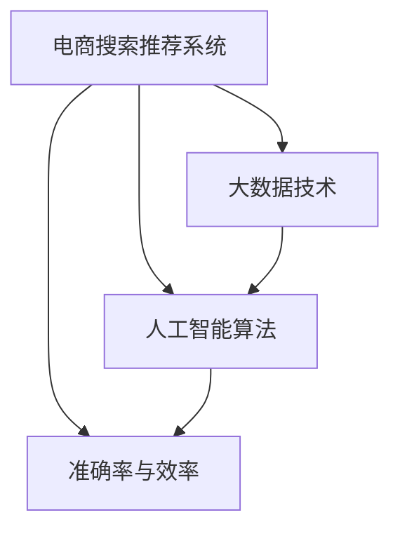

                 

# 大数据与AI 驱动的电商搜索推荐：以准确率与效率为核心的优化策略

> 关键词：电商搜索推荐、大数据、人工智能、算法优化、准确率、效率、推荐系统

## 1. 背景介绍

### 1.1 问题由来
随着电子商务的迅猛发展，在线购物已经成为了许多人日常购物的首选。电商企业需要构建强大的搜索推荐系统，以帮助用户快速找到满意的商品，提升购物体验，同时促进销售增长。传统的推荐系统主要基于规则或协同过滤等方法，存在诸多局限性，如对长尾商品覆盖不足、稀疏数据处理困难等问题。随着人工智能技术的崛起，基于深度学习模型的推荐系统逐渐成为新的热门选择。

特别是大数据与人工智能技术的发展，使得深度学习在电商搜索推荐中得到广泛应用。如TensorFlow、PyTorch等深度学习框架，使得构建复杂模型变得更加容易，数据挖掘和特征提取技术也为模型训练提供了坚实基础。电商推荐系统已经从简单的静态推荐转变为动态、个性化的推荐，为用户提供了更加精准和贴心的购物体验。

### 1.2 问题核心关键点
电商搜索推荐系统优化涉及多个关键问题：
1. **数据预处理**：如何高效地处理海量数据，提取有价值的用户和商品特征。
2. **模型构建**：如何设计有效的模型结构，捕捉用户和商品之间的复杂关系。
3. **算法优化**：如何在保证推荐结果准确率的同时，提高推荐速度，降低计算资源消耗。
4. **评估指标**：如何设定合理的评估指标，衡量推荐系统的效果。

本文将详细探讨电商搜索推荐系统中的算法优化策略，着重于准确率和效率的平衡。通过对这些问题的深入分析，提出一系列优化措施，助力电商企业构建高效、精准的推荐系统。

## 2. 核心概念与联系

### 2.1 核心概念概述

电商搜索推荐系统优化涉及多个核心概念：

- **电商搜索推荐系统**：通过算法推荐，帮助用户在电商平台上找到最符合需求的商品。
- **大数据技术**：通过收集、存储、处理海量数据，为推荐系统提供丰富的数据支撑。
- **人工智能算法**：基于机器学习、深度学习等算法，实现推荐系统的智能决策。
- **准确率与效率**：推荐系统需要同时兼顾推荐结果的准确性和推荐速度，以平衡用户体验和运营成本。

这些概念之间的逻辑关系可以通过以下Mermaid流程图来展示：



这个流程图展示了电商搜索推荐系统中的关键组件及其相互关系：

1. 电商搜索推荐系统通过大数据技术和人工智能算法，实现商品的智能推荐。
2. 推荐系统的设计需要同时关注准确率和效率，以保证良好的用户体验。
3. 大数据技术提供了数据支撑，人工智能算法提供了智能决策，而准确率和效率则是衡量推荐系统效果的重要指标。

## 3. 核心算法原理 & 具体操作步骤
### 3.1 算法原理概述

电商搜索推荐系统优化涉及多个算法，这些算法需要平衡准确率和效率，以提升用户体验和平台收益。主要的算法包括：

- **协同过滤算法**：通过用户行为数据推荐相似用户喜欢的商品，如基于用户的协同过滤、基于物品的协同过滤等。
- **基于深度学习的推荐算法**：如基于深度神经网络的多层感知机、卷积神经网络、循环神经网络等，通过学习用户和商品特征，实现推荐。
- **序列推荐算法**：如基于时间序列的推荐模型，通过捕捉时间依赖性，实现商品的动态推荐。
- **多模态推荐算法**：通过融合不同模态的数据（如用户画像、商品描述、用户评论等），提升推荐结果的丰富性和准确性。

这些算法的设计和优化都需要考虑准确率和效率，具体策略因算法而异。

### 3.2 算法步骤详解

以**基于深度学习的推荐算法**为例，介绍算法的主要步骤：

**Step 1: 数据预处理**
- **特征工程**：从电商数据中提取有意义的特征，如用户历史行为、商品评分、标签等。
- **数据清洗**：处理缺失值、异常值，保证数据质量。
- **数据归一化**：对特征进行归一化处理，防止不同特征的数值差异过大。

**Step 2: 模型构建**
- **模型设计**：选择适合的神经网络结构，如多层感知机、卷积神经网络、循环神经网络等。
- **损失函数**：定义损失函数，如交叉熵损失、均方误差损失等，用于衡量模型预测与真实标签之间的差异。
- **优化算法**：选择优化算法，如Adam、SGD等，用于更新模型参数。

**Step 3: 模型训练**
- **训练集划分**：将数据集划分为训练集、验证集和测试集。
- **训练过程**：在训练集上进行模型训练，调整超参数，最小化损失函数。
- **验证过程**：在验证集上评估模型性能，防止过拟合。

**Step 4: 模型评估**
- **评估指标**：选择合适的评估指标，如准确率、召回率、F1值等，评估推荐系统的效果。
- **指标分析**：分析评估指标，发现模型不足，优化模型设计。

**Step 5: 模型部署**
- **模型保存**：将训练好的模型保存为文件，方便后续调用。
- **服务部署**：将模型部署到线上服务，接收查询请求，返回推荐结果。

### 3.3 算法优缺点

基于深度学习的电商推荐算法具有以下优点：
1. **准确率高**：能够捕捉复杂的非线性关系，推荐结果更精准。
2. **可扩展性好**：支持大规模数据的处理和高效训练。
3. **适应性强**：能够适应各种商品和用户类型，提高推荐多样性。

但同时也存在以下缺点：
1. **计算资源消耗大**：深度学习模型参数量大，训练和推理成本高。
2. **模型复杂度高**：模型结构复杂，难以解释和调试。
3. **数据需求高**：需要大量标注数据进行训练，数据采集和标注成本高。

### 3.4 算法应用领域

基于深度学习的电商推荐算法已经在多个电商平台上得到广泛应用，如Amazon、淘宝、京东等。具体应用领域包括：

- **商品推荐**：根据用户历史行为，推荐相关商品。
- **个性化推荐**：根据用户画像，推荐个性化商品。
- **搜索优化**：根据用户搜索行为，优化搜索结果。
- **广告推荐**：根据用户浏览和点击行为，推荐相关广告。
- **跨商品推荐**：推荐与当前商品相关的商品。

除了以上应用，基于深度学习的推荐算法还应用于智能家居、社交媒体、在线视频等多个领域，为不同应用场景提供精准推荐。

## 4. 数学模型和公式 & 详细讲解 & 举例说明

### 4.1 数学模型构建

以**基于多层感知机(Multilayer Perceptron, MLP)**的电商推荐系统为例，构建推荐模型的数学模型。

假设输入为用户历史行为数据 $x$，输出为推荐商品列表 $y$，模型结构为多层感知机。定义模型的损失函数为交叉熵损失，优化算法为Adam。

$$
\mathcal{L} = -\frac{1}{N}\sum_{i=1}^N\sum_{j=1}^{M}(y_{ij}\log \hat{y}_{ij} + (1-y_{ij})\log(1-\hat{y}_{ij}))
$$

其中 $N$ 为样本数，$M$ 为推荐商品数，$y_{ij}$ 为商品 $j$ 是否被用户 $i$ 购买或点击的标签，$\hat{y}_{ij}$ 为模型预测的概率。

### 4.2 公式推导过程

假设多层感知机模型包含 $d$ 个隐藏层，每层包含 $h$ 个神经元。模型的前向传播过程如下：

$$
z_0 = W_0x + b_0
$$

$$
h_1 = \sigma(z_0)
$$

$$
z_1 = W_1h_1 + b_1
$$

$$
\cdots
$$

$$
h_d = \sigma(z_{d-1})
$$

$$
z_L = W_Lh_d + b_L
$$

其中 $z$ 表示神经元输入，$h$ 表示神经元输出，$W$ 表示权重矩阵，$b$ 表示偏置向量，$\sigma$ 表示激活函数。

### 4.3 案例分析与讲解

以**Amazon商品推荐系统**为例，介绍如何应用基于MLP的推荐模型。

Amazon推荐系统通过收集用户历史行为数据，构建多层感知机模型，训练生成推荐模型。在训练过程中，使用交叉熵损失函数进行优化，调整模型参数，使其最小化预测结果与真实标签的差异。

具体而言，Amazon将用户行为数据分为训练集、验证集和测试集，分别进行模型训练和评估。在训练过程中，使用Adam算法更新模型参数，最小化交叉熵损失函数。在验证过程中，评估模型在验证集上的准确率和召回率，调整模型超参数，防止过拟合。最终在测试集上评估模型性能，选择性能最佳的模型进行部署。

## 5. 项目实践：代码实例和详细解释说明
### 5.1 开发环境搭建

为了构建和优化电商搜索推荐系统，我们需要以下开发环境：

1. **Python**：Python 3.8及以上版本，用于数据处理和模型训练。
2. **TensorFlow**：TensorFlow 2.x及以上版本，用于深度学习模型的构建和训练。
3. **Keras**：Keras 2.5及以上版本，用于搭建深度学习模型，提供高层API。
4. **Pandas**：Pandas 1.2及以上版本，用于数据处理和分析。
5. **NumPy**：NumPy 1.19及以上版本，用于数值计算。
6. **Matplotlib**：Matplotlib 3.5及以上版本，用于数据可视化。
7. **Jupyter Notebook**：Jupyter Notebook 6.2及以上版本，用于交互式数据处理和模型训练。

### 5.2 源代码详细实现

以下是使用TensorFlow和Keras构建基于MLP的电商推荐系统的代码实现：

```python
import tensorflow as tf
from tensorflow import keras
import pandas as pd
import numpy as np

# 数据预处理
train_data = pd.read_csv('train.csv')
test_data = pd.read_csv('test.csv')
train_data = train_data.drop('label', axis=1)
test_data = test_data.drop('label', axis=1)
train_data = train_data.to_numpy()
test_data = test_data.to_numpy()

# 定义模型结构
model = keras.Sequential([
    keras.layers.Dense(64, activation='relu', input_shape=(train_data.shape[1],)),
    keras.layers.Dense(32, activation='relu'),
    keras.layers.Dense(1, activation='sigmoid')
])

# 定义损失函数和优化器
loss_fn = keras.losses.BinaryCrossentropy()
optimizer = keras.optimizers.Adam(learning_rate=0.001)

# 模型训练
train_dataset = tf.data.Dataset.from_tensor_slices((train_data, train_labels)).shuffle(1000).batch(32)
model.compile(optimizer=optimizer, loss=loss_fn, metrics=['accuracy'])
model.fit(train_dataset, epochs=10, validation_data=(test_data, test_labels))

# 模型评估
test_dataset = tf.data.Dataset.from_tensor_slices((test_data, test_labels)).batch(32)
test_loss, test_acc = model.evaluate(test_dataset)

# 模型部署
model.save('recommender_model.h5')
```

### 5.3 代码解读与分析

**数据预处理**：
- 使用Pandas库读取训练集和测试集数据。
- 去除标签列，保留特征数据。
- 将数据转换为NumPy数组格式，便于TensorFlow处理。

**模型结构设计**：
- 定义多层感知机模型，包含三个全连接层。
- 第一层和第二层使用ReLU激活函数，第三层使用Sigmoid激活函数，输出推荐概率。
- 通过Keras库构建模型，提供高层API，简化代码实现。

**损失函数和优化器**：
- 选择二元交叉熵损失函数，用于处理二分类问题。
- 选择Adam优化器，学习率设置为0.001。

**模型训练**：
- 使用TensorFlow的Dataset API，将数据集转换为TensorFlow数据集格式。
- 使用Keras模型的fit方法，指定训练轮数和验证集。

**模型评估**：
- 使用TensorFlow的Dataset API，将测试集转换为TensorFlow数据集格式。
- 使用Keras模型的evaluate方法，评估模型在测试集上的损失和准确率。

**模型部署**：
- 使用Keras模型的save方法，保存模型到本地文件。

以上代码展示了如何使用TensorFlow和Keras构建基于MLP的电商推荐系统。通过简洁的代码实现，可以清晰地理解电商推荐模型的构建和优化过程。

## 6. 实际应用场景
### 6.1 智能推荐广告

电商平台利用推荐系统对广告进行智能投放，显著提高了广告的点击率和转化率。通过深度学习模型，电商可以根据用户的历史行为数据，预测用户的兴趣，推荐相关广告。具体而言，可以在用户的浏览页面上实时推送广告，根据用户的点击和购买行为，不断调整广告内容，提升广告效果。

### 6.2 个性化推荐商品

个性化推荐是电商推荐系统的重要应用之一。通过深度学习模型，电商平台可以根据用户的画像信息，推荐符合用户兴趣的商品。具体而言，可以在用户的浏览记录和购买记录中提取特征，构建推荐模型，预测用户对商品的兴趣，推荐个性化商品。这种推荐方式可以提升用户的购物体验，增加平台的用户粘性。

### 6.3 实时推荐搜索结果

电商搜索推荐系统不仅可以推荐商品，还可以优化搜索结果。具体而言，在用户输入搜索关键词后，电商平台可以动态生成搜索结果，推荐最相关的商品。通过深度学习模型，电商平台可以捕捉用户查询意图，实时更新搜索结果，提高搜索体验。

### 6.4 未来应用展望

随着深度学习技术的不断进步，电商搜索推荐系统将呈现以下几个发展趋势：

1. **多模态数据融合**：电商推荐系统将融合多模态数据，如文本、图像、音频等，提升推荐结果的丰富性和准确性。
2. **强化学习**：电商推荐系统将引入强化学习算法，通过在线学习不断优化推荐策略，提升推荐效果。
3. **跨领域推荐**：电商推荐系统将跨领域推荐商品，如从服装推荐到图书推荐，提升用户的多样化购物体验。
4. **实时动态推荐**：电商推荐系统将实现实时动态推荐，根据用户行为和环境变化，动态调整推荐策略。
5. **个性化推荐算法**：电商推荐系统将进一步优化推荐算法，提升推荐结果的个性化程度，满足用户多样化的需求。

## 7. 工具和资源推荐
### 7.1 学习资源推荐

为了帮助开发者系统掌握电商推荐系统的理论和实践，这里推荐一些优质的学习资源：

1. **《Deep Learning for Recommendation Systems》书籍**：作者为Wang、Liu等，全面介绍了深度学习在推荐系统中的应用，包括算法原理、实现方法等。
2. **《Recommender Systems: The Textbook》书籍**：作者为Zheng、Chen等，涵盖了推荐系统的理论基础和实际应用，适合全面了解推荐系统。
3. **Coursera的《Recommender Systems》课程**：由南洋理工大学的Ian Shadbolt教授讲授，系统讲解了推荐系统的原理和实践。
4. **Udacity的《Machine Learning Engineer》课程**：涵盖机器学习、深度学习、推荐系统等多个主题，适合全面学习。
5. **Kaggle竞赛平台**：Kaggle举办了多个电商推荐系统竞赛，通过实践学习推荐算法和优化策略。

通过这些资源的学习实践，相信你一定能够快速掌握电商推荐系统的精髓，并用于解决实际的电商推荐问题。

### 7.2 开发工具推荐

高效的开发离不开优秀的工具支持。以下是几款用于电商推荐系统开发的常用工具：

1. **TensorFlow**：由Google主导开发的深度学习框架，支持分布式训练和高效的GPU计算。
2. **PyTorch**：由Facebook开发的深度学习框架，支持动态计算图和高效的张量操作。
3. **Keras**：高层次的深度学习框架，提供简单易用的API，方便模型构建和调试。
4. **Jupyter Notebook**：交互式的数据处理和模型训练平台，支持Python代码的编写和运行。
5. **Grafana**：可视化工具，用于监控和分析模型训练过程，提供丰富的图表展示。
6. **Prometheus**：监控系统，用于实时监控模型的运行状态，保证系统的稳定性和可靠性。

合理利用这些工具，可以显著提升电商推荐系统的开发效率，加快创新迭代的步伐。

### 7.3 相关论文推荐

电商推荐系统的优化研究涉及多个前沿领域，以下是几篇具有代表性的相关论文：

1. **"Deep Collaborative Filtering" 论文**：作者为Zhang、Chen等，介绍了基于深度学习的协同过滤方法，提升了推荐系统的准确率和多样性。
2. **"Recurrent Neural Network-Based Recommender System" 论文**：作者为Yang、Liu等，展示了基于循环神经网络的推荐系统，能够捕捉时间序列数据。
3. **"Multi-Task Learning for Recommender Systems" 论文**：作者为He、Li等，提出了多任务学习方法，通过共享模型参数，提升推荐系统的效果。
4. **"Fusion of Multi-Modal Data in Recommender System" 论文**：作者为Xiao、Hu等，介绍了多模态数据融合方法，提升了推荐结果的丰富性。
5. **"Deep Matrix Factorization for Recommender Systems" 论文**：作者为Wang、Wu等，展示了深度矩阵分解方法，提高了推荐系统的泛化能力。

这些论文代表了大数据与AI驱动的电商推荐系统的发展脉络。通过学习这些前沿成果，可以帮助研究者把握学科前进方向，激发更多的创新灵感。

## 8. 总结：未来发展趋势与挑战
### 8.1 总结

本文对电商搜索推荐系统中的算法优化策略进行了详细探讨，重点关注准确率和效率的平衡。通过深入分析算法原理和操作步骤，提出了一系列优化措施，助力电商企业构建高效、精准的推荐系统。文章还介绍了电商搜索推荐系统在智能推荐广告、个性化推荐商品、实时推荐搜索结果等场景中的应用，展示了电商推荐系统的广泛应用前景。

通过本文的系统梳理，可以看到，电商搜索推荐系统已经在大规模电商平台上得到广泛应用，显著提升了用户体验和平台收益。未来，伴随深度学习技术的不断进步，电商推荐系统将迎来更多优化和创新，为电商行业带来更大的商业价值。

### 8.2 未来发展趋势

展望未来，电商搜索推荐系统将呈现以下几个发展趋势：

1. **多模态融合**：电商推荐系统将融合多模态数据，如文本、图像、音频等，提升推荐结果的丰富性和准确性。
2. **实时动态推荐**：电商推荐系统将实现实时动态推荐，根据用户行为和环境变化，动态调整推荐策略。
3. **个性化推荐算法**：电商推荐系统将进一步优化推荐算法，提升推荐结果的个性化程度，满足用户多样化的需求。
4. **强化学习**：电商推荐系统将引入强化学习算法，通过在线学习不断优化推荐策略，提升推荐效果。
5. **跨领域推荐**：电商推荐系统将跨领域推荐商品，如从服装推荐到图书推荐，提升用户的多样化购物体验。

以上趋势凸显了大数据与AI驱动的电商推荐系统的发展潜力。这些方向的探索发展，将进一步提升电商推荐系统的性能和应用范围，为电商行业带来更大的商业价值。

### 8.3 面临的挑战

尽管电商搜索推荐系统已经取得了瞩目成就，但在迈向更加智能化、普适化应用的过程中，它仍面临诸多挑战：

1. **计算资源消耗大**：深度学习模型参数量大，训练和推理成本高，需要高效的计算资源。
2. **数据隐私问题**：电商推荐系统需要大量的用户行为数据，如何保护用户隐私，防止数据泄露，是重要的挑战。
3. **模型鲁棒性不足**：推荐模型面对域外数据时，泛化性能往往大打折扣，如何提高模型的鲁棒性，避免灾难性遗忘，还需要更多理论和实践的积累。
4. **模型可解释性不足**：当前推荐系统更像是"黑盒"系统，难以解释其内部工作机制和决策逻辑，这对于高风险应用（如医疗、金融等）尤为重要。
5. **实时性问题**：电商推荐系统需要实时更新推荐结果，如何保证系统的高并发和低延迟，是重要的技术挑战。

### 8.4 研究展望

面对电商推荐系统面临的这些挑战，未来的研究需要在以下几个方面寻求新的突破：

1. **高效计算技术**：探索高效计算技术，如量化加速、模型压缩等，提高推荐系统的计算效率。
2. **隐私保护技术**：引入隐私保护技术，如差分隐私、联邦学习等，保护用户数据隐私。
3. **鲁棒性增强**：通过迁移学习、对抗训练等方法，增强推荐模型的鲁棒性，提升其泛化能力。
4. **可解释性增强**：引入可解释性技术，如LIME、SHAP等，提高推荐模型的可解释性，增强用户信任。
5. **实时动态优化**：通过在线学习、强化学习等方法，实现实时动态优化，提升推荐系统的实时性和动态性。

这些研究方向的探索，将推动电商搜索推荐系统的技术进步，为电商行业带来更多的商业机会和创新动力。

## 9. 附录：常见问题与解答

**Q1: 电商搜索推荐系统有哪些常见的数据预处理技术？**

A: 电商搜索推荐系统常见的数据预处理技术包括：
1. 特征工程：从电商数据中提取有意义的特征，如用户历史行为、商品评分、标签等。
2. 数据清洗：处理缺失值、异常值，保证数据质量。
3. 数据归一化：对特征进行归一化处理，防止不同特征的数值差异过大。
4. 特征选择：选择有价值的特征，去除无关特征。
5. 特征降维：使用主成分分析、PCA等方法，降低特征维度，提高计算效率。

这些技术可以提升电商推荐系统的准确率和效率，保证推荐结果的可靠性和多样性。

**Q2: 电商推荐系统常用的优化算法有哪些？**

A: 电商推荐系统常用的优化算法包括：
1. 梯度下降法（Gradient Descent）：通过不断迭代更新模型参数，最小化损失函数。
2. 随机梯度下降法（Stochastic Gradient Descent）：在每个批次上更新模型参数，提高计算效率。
3. 批量梯度下降法（Batch Gradient Descent）：在所有批次上更新模型参数，提高收敛速度。
4. Adam算法：结合了动量法和自适应学习率，具有较好的收敛性能。
5. AdaGrad算法：根据每个特征的历史梯度，自适应地调整学习率，适合稀疏数据。
6. RMSprop算法：根据梯度的平方根，自适应地调整学习率，适合非平稳目标函数。

这些算法在电商推荐系统中得到了广泛应用，能够有效优化推荐模型的性能。

**Q3: 电商推荐系统中的特征工程有哪些？**

A: 电商推荐系统中的特征工程包括：
1. 用户特征：如用户ID、性别、年龄、浏览历史等。
2. 商品特征：如商品ID、价格、销量、评分等。
3. 行为特征：如点击次数、浏览时间、购买次数等。
4. 上下文特征：如时间、地理位置、购物车内容等。
5. 用户画像：如用户兴趣、偏好、行为等。
6. 商品画像：如商品属性、描述、类别等。

通过合理的特征工程，可以提取有意义的特征，提升电商推荐系统的准确率和多样性，优化用户购物体验。

**Q4: 电商推荐系统中的模型评估指标有哪些？**

A: 电商推荐系统中的模型评估指标包括：
1. 准确率（Accuracy）：预测正确的样本数占总样本数的比例。
2. 召回率（Recall）：预测正确的正样本数占实际正样本数的比例。
3. F1值（F1 Score）：准确率和召回率的调和平均数，综合考虑了预测结果的准确性和覆盖度。
4. AUC值（Area Under Curve）：ROC曲线下的面积，衡量分类模型的性能。
5. PR曲线（Precision-Recall Curve）：以精确率和召回率为坐标，绘制出模型在不同阈值下的性能表现。
6. NDCG值（Normalized Discounted Cumulative Gain）：衡量推荐系统排序质量的指标。

这些指标可以帮助评估电商推荐系统的性能，发现模型的不足，指导模型的优化和改进。

**Q5: 电商推荐系统中的多模态融合技术有哪些？**

A: 电商推荐系统中的多模态融合技术包括：
1. 文本+图像融合：将商品图像特征和商品描述特征结合，提升推荐结果的丰富性。
2. 文本+音频融合：将商品音频特征和商品描述特征结合，提升推荐结果的多样性。
3. 文本+视频融合：将商品视频特征和商品描述特征结合，提升推荐结果的准确性。
4. 多传感器融合：结合用户的位置信息、行为信息等多种传感器数据，提升推荐系统的鲁棒性和准确性。

通过多模态融合技术，可以提升电商推荐系统的推荐效果，满足用户多样化的需求，提升购物体验。

---

作者：禅与计算机程序设计艺术 / Zen and the Art of Computer Programming

