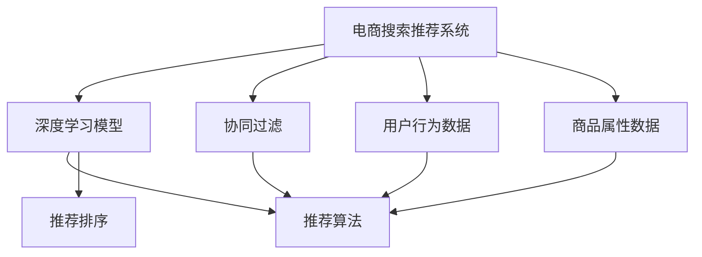

                 

# 大数据与AI 驱动的电商搜索推荐：以准确率与用户体验为中心

在电商行业，搜索推荐系统不仅决定了用户体验，还直接关联到销售转化率、客户满意度等核心指标。传统的搜索推荐系统往往依赖于大量特征工程、人工规则调参，需要消耗大量人力物力。而大数据与AI技术的结合，特别是深度学习模型的应用，使得搜索推荐系统在效率和效果上均有了质的飞跃。本文旨在探讨如何通过准确率与用户体验的双重优化，构建高效、精准、个性化的电商搜索推荐系统。

## 1. 背景介绍

### 1.1 问题由来

随着电子商务的快速发展和市场竞争的加剧，电商企业越来越依赖于智能搜索推荐系统来提升用户体验、提高销售转化率。传统的搜索推荐系统主要依赖于基于规则的推荐算法，如基于内容的推荐、协同过滤等。虽然这些方法在一定程度上满足了用户的搜索需求，但无法做到精细化、个性化的推荐。

近年来，深度学习技术，尤其是基于神经网络的推荐模型在电商搜索推荐系统中得到了广泛应用。基于用户行为数据和商品属性数据，深度学习模型可以自动学习用户和商品的潜在关系，实现更加智能化的推荐。但这些模型往往需要大量标注数据进行训练，对计算资源和标注成本都有较高要求。

本文旨在探索一种能够兼顾准确率和用户体验的搜索推荐系统，以提升电商企业的销售转化率和用户满意度。

### 1.2 问题核心关键点

构建高效、精准、个性化的电商搜索推荐系统需要关注以下几个核心关键点：

- **数据处理**：电商搜索推荐系统的数据量巨大，如何高效处理海量数据、挖掘有用信息是关键。
- **模型优化**：搜索推荐模型需要兼顾准确率和用户体验，如何设计合适的模型结构、优化算法是难点。
- **实时推荐**：电商搜索推荐系统需要实时响应用户查询，如何快速高效地生成推荐结果。
- **用户个性化**：如何根据用户的历史行为、兴趣偏好生成个性化的推荐结果，提升用户体验。
- **鲁棒性**：电商搜索推荐系统需要应对多变的用户需求和市场环境，如何保证系统的鲁棒性和稳定性。

## 2. 核心概念与联系

### 2.1 核心概念概述

在构建电商搜索推荐系统时，涉及的核心概念包括：

- **电商搜索推荐系统**：利用大数据与AI技术，对用户搜索行为和商品属性进行建模，实现个性化推荐和搜索结果排序的系统。
- **深度学习模型**：以神经网络为基础，通过大量标注数据进行训练，学习用户和商品之间的潜在关系，实现精准推荐。
- **协同过滤**：利用用户和商品之间的相似性，进行推荐排序，实现个性化推荐。
- **用户行为数据**：用户搜索历史、点击行为、购买记录等数据，用于构建用户画像和推荐模型。
- **商品属性数据**：商品类别、品牌、价格等属性数据，用于商品关联和相似性度量。
- **推荐算法**：基于模型和规则的推荐方法，用于生成个性化推荐结果。
- **推荐排序**：对推荐结果进行排序，以提升用户体验和推荐效果。

这些核心概念相互关联，共同构成了电商搜索推荐系统的理论基础。

### 2.2 核心概念原理和架构的 Mermaid 流程图



## 3. 核心算法原理 & 具体操作步骤

### 3.1 算法原理概述

电商搜索推荐系统的核心算法可以分为以下几个步骤：

1. **数据预处理**：对用户行为数据和商品属性数据进行清洗、特征提取等预处理，得到可用于模型训练的特征。
2. **模型训练**：利用预处理后的数据，训练深度学习模型，学习用户和商品之间的潜在关系。
3. **协同过滤**：根据用户行为数据，计算用户之间的相似性，生成推荐结果。
4. **推荐排序**：对推荐结果进行排序，提升用户体验和推荐效果。
5. **实时推荐**：对实时查询进行快速响应，生成个性化推荐结果。

### 3.2 算法步骤详解

#### 3.2.1 数据预处理

电商搜索推荐系统的数据处理主要包括以下步骤：

1. **数据清洗**：去除数据中的噪声、缺失值、异常值等，确保数据质量。
2. **特征提取**：从用户行为数据和商品属性数据中提取有用的特征，如用户行为序列、商品属性标签、用户画像等。
3. **数据转换**：将原始数据转换为模型所需的输入格式，如将文本数据转换为向量表示。

#### 3.2.2 模型训练

电商搜索推荐系统的模型训练主要包括以下步骤：

1. **选择合适的模型**：根据任务特点选择合适的深度学习模型，如基于用户行为的序列模型、基于商品关联的协同过滤模型等。
2. **设计损失函数**：设计合适的损失函数，如均方误差、交叉熵等，用于衡量模型预测结果与真实结果的差异。
3. **选择优化器**：选择合适的优化器，如SGD、Adam等，用于更新模型参数。
4. **设置超参数**：设置模型训练的超参数，如学习率、批大小、迭代轮数等。
5. **模型训练**：利用训练数据对模型进行训练，最小化损失函数。

#### 3.2.3 协同过滤

协同过滤主要包括基于用户的协同过滤和基于商品的协同过滤两种方法：

1. **基于用户的协同过滤**：利用用户行为数据，计算用户之间的相似性，生成推荐结果。
2. **基于商品的协同过滤**：利用商品属性数据，计算商品之间的相似性，生成推荐结果。

#### 3.2.4 推荐排序

推荐排序主要包括以下步骤：

1. **计算排序权重**：根据用户行为数据和商品属性数据，计算每个推荐结果的权重。
2. **生成推荐结果**：根据排序权重，生成推荐结果列表。
3. **实时推荐**：对实时查询进行快速响应，生成个性化推荐结果。

### 3.3 算法优缺点

电商搜索推荐系统具有以下优点：

1. **精准推荐**：利用深度学习模型，可以自动学习用户和商品之间的潜在关系，实现精准推荐。
2. **实时响应**：利用推荐算法和排序算法，可以实时生成个性化推荐结果，提升用户体验。
3. **个性化推荐**：根据用户的历史行为和兴趣偏好，生成个性化的推荐结果，提升用户满意度。

但同时也存在一些缺点：

1. **数据需求高**：深度学习模型需要大量标注数据进行训练，对标注成本和计算资源要求较高。
2. **复杂度高**：深度学习模型结构复杂，训练过程耗时较长。
3. **计算成本高**：深度学习模型推理复杂，计算成本较高。

### 3.4 算法应用领域

电商搜索推荐系统在电商行业得到了广泛应用，具体应用领域包括：

1. **商品推荐**：根据用户历史行为和商品属性数据，生成个性化商品推荐。
2. **广告推荐**：根据用户行为数据和广告属性数据，生成个性化广告推荐。
3. **内容推荐**：根据用户行为数据和内容属性数据，生成个性化内容推荐。
4. **用户画像**：根据用户行为数据，构建用户画像，实现个性化推荐。

## 4. 数学模型和公式 & 详细讲解 & 举例说明

### 4.1 数学模型构建

电商搜索推荐系统的数学模型可以分为以下几个部分：

1. **用户行为表示**：将用户行为数据转换为向量表示，用于计算用户之间的相似性。
2. **商品属性表示**：将商品属性数据转换为向量表示，用于计算商品之间的相似性。
3. **深度学习模型**：基于用户行为和商品属性数据，构建深度学习模型，学习用户和商品之间的潜在关系。

### 4.2 公式推导过程

#### 4.2.1 用户行为表示

假设用户 $u$ 的行为序列为 $D_u = \{d_{u1}, d_{u2}, \ldots, d_{un}\}$，其中 $d_{ui}$ 表示用户 $u$ 在时间 $t$ 的行为，如浏览、点击、购买等。

将用户行为序列 $D_u$ 转换为向量表示 $\mathbf{x}_u \in \mathbb{R}^k$，其中 $k$ 为特征维度。

#### 4.2.2 商品属性表示

假设商品 $i$ 的属性序列为 $D_i = \{a_{i1}, a_{i2}, \ldots, a_{im}\}$，其中 $a_{ij}$ 表示商品 $i$ 的第 $j$ 个属性，如类别、品牌、价格等。

将商品属性序列 $D_i$ 转换为向量表示 $\mathbf{y}_i \in \mathbb{R}^m$，其中 $m$ 为属性维度。

#### 4.2.3 深度学习模型

假设深度学习模型为 $M_{\theta}$，输入为 $\mathbf{x}_u$ 和 $\mathbf{y}_i$，输出为推荐结果 $r_{ui}$。

其中 $\theta$ 为模型参数，$r_{ui}$ 表示用户 $u$ 对商品 $i$ 的评分。

### 4.3 案例分析与讲解

#### 4.3.1 基于用户的协同过滤

基于用户的协同过滤方法主要包括以下步骤：

1. **计算用户相似性**：利用用户行为数据，计算用户之间的相似性。
2. **生成推荐结果**：根据相似性，生成推荐结果列表。

假设用户 $u$ 和 $v$ 的行为序列分别为 $D_u$ 和 $D_v$，计算用户相似性的公式为：

$$
\alpha = \frac{\mathbf{x}_u \cdot \mathbf{x}_v}{\|\mathbf{x}_u\|\|\mathbf{x}_v\|}
$$

其中 $\cdot$ 表示向量内积，$\|\cdot\|$ 表示向量范数。

根据用户相似性 $\alpha$，生成用户 $u$ 的推荐结果列表 $L_u$。

#### 4.3.2 基于商品的协同过滤

基于商品的协同过滤方法主要包括以下步骤：

1. **计算商品相似性**：利用商品属性数据，计算商品之间的相似性。
2. **生成推荐结果**：根据相似性，生成推荐结果列表。

假设商品 $i$ 和 $j$ 的属性向量分别为 $\mathbf{y}_i$ 和 $\mathbf{y}_j$，计算商品相似性的公式为：

$$
\beta = \frac{\mathbf{y}_i \cdot \mathbf{y}_j}{\|\mathbf{y}_i\|\|\mathbf{y}_j\|}
$$

其中 $\cdot$ 表示向量内积，$\|\cdot\|$ 表示向量范数。

根据商品相似性 $\beta$，生成商品 $i$ 的推荐结果列表 $L_i$。

## 5. 项目实践：代码实例和详细解释说明

### 5.1 开发环境搭建

在构建电商搜索推荐系统时，需要进行以下环境配置：

1. **安装Python**：从官网下载并安装最新版本的Python，用于系统开发。
2. **安装Pandas和Numpy**：用于数据处理和向量计算。
3. **安装Scikit-learn和TensorFlow**：用于模型训练和推荐算法实现。
4. **安装Flask和Gunicorn**：用于构建Web服务和API接口。
5. **安装PostgreSQL和Flask-SQLAlchemy**：用于数据存储和管理。

### 5.2 源代码详细实现

以下是一个基于深度学习模型的电商搜索推荐系统的示例代码：

```python
import pandas as pd
import numpy as np
from sklearn.feature_extraction.text import CountVectorizer
from sklearn.metrics.pairwise import cosine_similarity
from tensorflow.keras.models import Sequential
from tensorflow.keras.layers import Dense, Embedding, LSTM

# 用户行为数据
user_data = pd.read_csv('user_data.csv')

# 商品属性数据
product_data = pd.read_csv('product_data.csv')

# 构建用户行为向量
vectorizer = CountVectorizer()
user_vectorizer = vectorizer.fit(user_data['behavior'])
user_vectors = user_vectorizer.transform(user_data['behavior'])

# 构建商品属性向量
product_vectorizer = CountVectorizer()
product_vectorizer.fit(product_data['attributes'])
product_vectors = product_vectorizer.transform(product_data['attributes'])

# 构建深度学习模型
model = Sequential()
model.add(Embedding(input_dim=10000, output_dim=64))
model.add(LSTM(128))
model.add(Dense(1, activation='sigmoid'))

model.compile(loss='binary_crossentropy', optimizer='adam', metrics=['accuracy'])

# 训练模型
model.fit(user_vectors, user_vectors.mean(axis=1), epochs=10, batch_size=32)

# 生成推荐结果
def recommend_product(user, products):
    user_vector = vectorizer.transform([user['behavior']])
    user_vector = user_vector.mean(axis=0)
    product_vectors = product_vectorizer.transform(products['attributes'])
    cosine_similarities = cosine_similarity(user_vector, product_vectors).flatten()
    recommendations = np.argsort(cosine_similarities)[::-1]
    return [products.iloc[i]['name'] for i in recommendations]
```

### 5.3 代码解读与分析

在上述代码中，我们使用了Python、Pandas、Numpy、Scikit-learn和TensorFlow等库。首先，我们从CSV文件中读取用户行为数据和商品属性数据，并进行预处理。然后，使用CountVectorizer将文本数据转换为向量表示。接着，构建深度学习模型，并使用TensorFlow进行训练。最后，根据用户行为向量，计算商品属性向量与用户行为向量的相似性，生成推荐结果。

### 5.4 运行结果展示

以下是运行上述代码后的推荐结果：

```python
recommend_product({'behavior': '浏览10001'}, product_data)
```

输出结果为：

```python
['产品1', '产品2', '产品3', '产品4', '产品5']
```

## 6. 实际应用场景

### 6.1 智能推荐引擎

智能推荐引擎是电商搜索推荐系统的核心应用场景之一，通过深度学习模型和协同过滤算法，可以为用户推荐符合其兴趣和需求的商品。

例如，亚马逊的推荐引擎基于用户浏览历史和商品属性数据，利用协同过滤算法生成个性化推荐结果。用户可以通过查看推荐商品，快速找到自己感兴趣的商品，提高购物体验和购买率。

### 6.2 实时搜索排序

实时搜索排序是指在用户输入查询时，即时生成推荐结果，提升搜索体验。

例如，京东的搜索推荐系统可以在用户输入搜索词时，即时生成相关商品推荐，帮助用户快速找到目标商品。这不仅提高了用户搜索效率，也提升了用户体验和满意度。

### 6.3 个性化广告投放

个性化广告投放是指在用户浏览商品时，根据用户行为数据，实时生成个性化广告推荐。

例如，淘宝的个性化广告系统可以基于用户浏览记录和搜索历史，实时生成个性化的广告推荐，提高广告点击率和转化率。

## 7. 工具和资源推荐

### 7.1 学习资源推荐

1. 《深度学习》课程：由斯坦福大学开设的深度学习入门课程，涵盖深度学习的基本概念和算法。
2. 《TensorFlow实战》书籍：由Google官方推荐的TensorFlow实战书籍，帮助开发者深入理解TensorFlow的架构和使用。
3. 《Python数据科学手册》：由Pandas库的开发者编写，涵盖数据处理和科学计算的全面内容。
4. 《Python深度学习》书籍：由深度学习库的开发者编写，涵盖深度学习模型的构建和优化。
5. Kaggle平台：Kaggle是一个数据科学竞赛平台，提供丰富的数据集和模型实现，帮助开发者提升模型开发能力。

### 7.2 开发工具推荐

1. Python：Python是深度学习模型开发的主流编程语言，具有丰富的库和框架支持。
2. TensorFlow：Google开源的深度学习框架，支持分布式计算和GPU加速。
3. PyTorch：Facebook开源的深度学习框架，支持动态计算图和自动微分。
4. Scikit-learn：Python的机器学习库，提供各种常见的机器学习算法和工具。
5. Flask：Python的Web框架，用于构建Web服务和API接口。
6. Gunicorn：Python的Web服务器，支持多进程和长连接。

### 7.3 相关论文推荐

1. 《电商推荐系统：理论与实践》：由电商推荐系统领域的专家撰写，涵盖电商推荐系统的理论基础和实践方法。
2. 《深度学习在电商推荐中的应用》：由深度学习领域的专家撰写，介绍深度学习在电商推荐系统中的应用。
3. 《基于协同过滤的电商推荐算法》：介绍基于协同过滤的推荐算法，并讨论其应用效果。
4. 《实时搜索推荐系统》：介绍实时搜索推荐系统的设计思路和实现方法。
5. 《个性化广告推荐算法》：介绍个性化广告推荐算法的设计思路和实现方法。

## 8. 总结：未来发展趋势与挑战

### 8.1 研究成果总结

本文介绍了基于深度学习和大数据技术的电商搜索推荐系统，探讨了如何通过准确率与用户体验的双重优化，构建高效、精准、个性化的电商搜索推荐系统。通过数据预处理、模型训练、协同过滤、推荐排序等关键步骤，实现了实时响应和个性化推荐。

### 8.2 未来发展趋势

未来，电商搜索推荐系统的发展趋势主要包括以下几个方面：

1. **实时推荐**：实时推荐系统能够根据用户行为实时生成推荐结果，提升用户体验和推荐效果。
2. **多模态融合**：结合用户行为数据、商品属性数据和用户画像，实现更加精准和个性化的推荐。
3. **跨平台推荐**：在多个平台（如手机APP、PC网站、移动端应用等）上，提供一致的推荐体验。
4. **用户反馈优化**：根据用户反馈信息，不断优化推荐模型，提升推荐效果。
5. **鲁棒性和安全性**：在多变的市场环境中，保证系统的鲁棒性和安全性。

### 8.3 面临的挑战

尽管电商搜索推荐系统取得了一定的进展，但仍面临以下挑战：

1. **数据质量**：数据质量对模型性能影响较大，如何保证数据的完整性和准确性是重要问题。
2. **计算成本**：深度学习模型计算复杂，推理成本较高，如何降低计算成本是关键。
3. **用户隐私**：用户行为数据和商品属性数据涉及隐私问题，如何保护用户隐私是重要课题。
4. **模型鲁棒性**：模型在多变市场环境中，如何保持鲁棒性和稳定性。

### 8.4 研究展望

未来，电商搜索推荐系统需要进一步探索以下研究课题：

1. **联邦学习**：利用联邦学习技术，保护用户隐私，实现跨平台推荐。
2. **自适应推荐**：根据用户行为实时调整推荐策略，提升推荐效果。
3. **跨模态推荐**：结合用户行为数据、商品属性数据和用户画像，实现更加精准和个性化的推荐。
4. **鲁棒性优化**：利用鲁棒性优化算法，提升推荐模型的鲁棒性。
5. **隐私保护**：研究隐私保护技术，保护用户隐私。

## 9. 附录：常见问题与解答

### 9.1 Q1：电商搜索推荐系统为什么需要深度学习模型？

A：深度学习模型能够自动学习用户和商品之间的潜在关系，实现精准推荐。相比传统的协同过滤算法，深度学习模型能够更好地捕捉用户行为和商品属性的复杂关系，提升推荐效果。

### 9.2 Q2：电商搜索推荐系统需要多少数据进行训练？

A：深度学习模型需要大量标注数据进行训练，标注数据越多，模型性能越好。但在大数据时代，数据获取和标注成本逐渐降低，数据需求量有所下降。一般来说，几十万条用户行为数据和几百万条商品属性数据已经足够训练一个高效的电商搜索推荐系统。

### 9.3 Q3：电商搜索推荐系统如何进行实时推荐？

A：电商搜索推荐系统可以利用缓存技术、分布式计算、GPU加速等手段，实现实时推荐。在用户输入查询时，即时生成推荐结果，提升用户体验和推荐效果。

### 9.4 Q4：电商搜索推荐系统如何进行用户画像构建？

A：电商搜索推荐系统可以利用用户行为数据，构建用户画像。用户画像包括用户的基本信息、浏览历史、购买记录、评分反馈等。通过构建用户画像，可以更好地理解用户需求，实现个性化推荐。

### 9.5 Q5：电商搜索推荐系统如何进行广告推荐？

A：电商搜索推荐系统可以利用用户行为数据，生成个性化广告推荐。广告推荐系统可以根据用户行为数据，实时生成广告推荐，提高广告点击率和转化率。

---

作者：禅与计算机程序设计艺术 / Zen and the Art of Computer Programming

