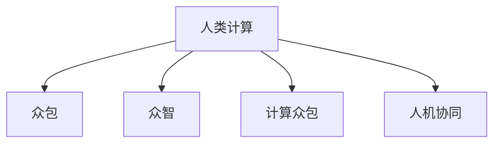

                 

## 1. 背景介绍

随着信息技术的飞速发展，大数据时代已全面到来。人类计算(Human Computation)，作为一种新型的人机协同计算模式，利用众包、众智等方式，有效整合了海量人类智慧，大幅提升了数据处理和知识创新的能力。这一新型计算范式，不仅揭示了数据背后深层次的人类智慧，也开辟了信息技术应用的新领域，展现出巨大的应用前景。

### 1.1 问题由来

大数据时代，数据量大、信息复杂、问题多样，传统集中式计算已难以应对。如何高效、智能地处理大数据，成为当前研究的重点和难点。人类计算作为一种新兴模式，将大数据技术与人类智慧相结合，从根本上改变了计算资源的利用方式和效率。

人类计算的基本原理是将复杂的大数据问题拆分为若干细小的任务，并通过众包、众智等形式，将任务分配给分布式的人类工作者，实现问题的协同求解。这一模式在多个领域已展现出显著优势，如科学发现、工业设计、教育竞赛等，证明了其可操作性和有效性。

### 1.2 问题核心关键点

人类计算的应用，主要围绕以下几个核心关键点展开：

- **数据规模巨大**：大数据时代，数据量呈指数级增长，单靠机器无法有效处理。
- **任务复杂多样**：大数据问题往往涉及多领域、多学科的知识，难以通过单一方法解决。
- **智慧资源丰富**：人类工作者拥有丰富的知识储备和创造力，能够提供多样化的解决方案。
- **计算效率提升**：众包、众智等方式，能够快速整合智慧资源，提高问题解决效率。
- **结果验证可靠**：人类计算的最终结果，需经过严格验证，确保可信度和可靠性。

这些关键点决定了人类计算在信息时代的重要地位，并推动其在各个领域的广泛应用。

## 2. 核心概念与联系

### 2.1 核心概念概述

为更好地理解人类计算，本节将介绍几个密切相关的核心概念：

- **人类计算(Human Computation)**：利用众包、众智等形式，将大数据问题分解为小任务，通过大量人类工作者协同求解，实现高效的数据处理和知识创新的计算模式。
- **众包(Crowdsourcing)**：通过互联网平台，将小任务分配给大量非专业工作者，实现大规模任务协同求解。
- **众智(Crowdsourcing)**：将复杂问题拆分为多个知识模块，通过集思广益的方式，汇集人类智慧，快速解决问题。
- **计算众包(Computational Crowdsourcing)**：将复杂的计算任务拆分为小的子任务，通过众包模式求解，同时将结果返回至计算平台。
- **人机协同(Co-human Computing)**：将人类计算与人工智能(AI)技术相结合，提升数据处理和知识创新的效率和精度。

这些核心概念之间的逻辑关系可以通过以下Mermaid流程图来展示：



这个流程图展示了大数据时代计算模式的核心概念及其之间的关系：

1. 人类计算通过众包、众智等形式，将大数据问题分解为小任务，并利用大量人类工作者的智慧进行求解。
2. 计算众包将复杂的计算任务分解为小的子任务，通过众包模式求解，同时将结果返回至计算平台。
3. 人机协同将人类计算与人工智能技术相结合，进一步提升数据处理和知识创新的效率和精度。

这些概念共同构成了大数据时代计算范式的核心框架，推动了数据处理和知识创新的新范式。

## 3. 核心算法原理 & 具体操作步骤

### 3.1 算法原理概述

人类计算的核心算法原理，主要基于分布式计算和多任务协同求解。其基本流程如下：

1. **任务分解**：将复杂的大数据问题拆分为多个细小的子任务，每个子任务相对独立，易于求解。
2. **分配任务**：通过众包、众智等形式，将任务分配给大量人类工作者，形成大规模的任务协同求解。
3. **协同求解**：人类工作者根据任务要求，进行独立计算，并将结果汇总至计算平台。
4. **数据验证**：对协同求解结果进行严格验证，确保结果的准确性和可靠性。

人类计算的算法流程，与集中式计算有显著区别，其主要优势在于以下几个方面：

- **任务并行处理**：通过将任务分解为小的子任务，能够并行处理，提高整体求解效率。
- **智慧资源丰富**：利用人类工作者的智慧资源，提供了多样化的解决方案，有助于提升结果的创新性和可行性。
- **灵活性和适应性**：通过灵活的任务分配和协作方式，能够快速适应复杂多变的问题。

### 3.2 算法步骤详解

人类计算的算法步骤主要包括以下几个关键环节：

**Step 1: 任务分解与设计**

- 确定大数据问题的求解目标和需求，将问题拆分为若干细小的子任务。
- 设计任务的目标函数和约束条件，确保任务的可解性和独立性。
- 任务设计需结合实际应用场景，考虑任务复杂度和求解难度。

**Step 2: 任务分配与管理**

- 选择合适的众包平台，如Amazon Mechanical Turk、Zooniverse等，进行任务发布。
- 根据任务的难易程度和要求，设定适当的报酬机制，吸引合适的工作者参与。
- 对任务分配进行管理和调度，确保任务能够高效完成。

**Step 3: 协同求解与反馈**

- 人类工作者根据任务要求，进行独立计算，并将结果提交至计算平台。
- 计算平台对所有结果进行汇总和验证，确保结果的正确性和一致性。
- 对计算结果进行反馈，帮助人类工作者进行改进和优化。

**Step 4: 结果合并与优化**

- 将各子任务的结果进行合并，得到最终求解结果。
- 对结果进行优化和验证，确保结果的准确性和可靠性。
- 根据任务目标和需求，对结果进行后处理，生成最终的解决方案。

### 3.3 算法优缺点

人类计算作为一种新兴的计算模式，具有以下优点：

- **高效性**：通过任务并行处理和众包、众智的方式，大幅提升了大数据问题的求解效率。
- **创新性**：利用人类智慧资源，提供了多样化的解决方案，有助于创新和突破。
- **灵活性**：能够快速适应复杂多变的问题，提高任务求解的灵活性和适应性。

同时，人类计算也存在一定的局限性：

- **工作质量不确定性**：不同工作者的知识水平和工作质量各异，导致任务求解结果的一致性难以保证。
- **数据隐私风险**：数据任务需要在互联网上发布，存在数据隐私泄露的风险。
- **平台依赖性强**：依赖特定的众包平台，平台稳定性和技术支持直接影响任务求解效率。
- **人力成本高**：大规模任务求解需要投入大量人力，成本较高。

尽管存在这些局限性，但人类计算作为一种新型计算模式，仍具有广泛的应用前景。未来研究需要不断优化任务设计和管理方式，提高任务的求解质量和平台支持，才能更好地发挥其优势。

### 3.4 算法应用领域

人类计算在多个领域展现出显著的应用效果，具体包括：

- **科学发现**：在生物学、天文学、化学等科学领域，人类计算能够通过众包方式，进行大规模数据处理和实验设计，推动科学研究的深入发展。
- **工业设计**：在产品设计、工艺改进等领域，人类计算能够通过众包方式，快速获取用户反馈和设计方案，提升产品的创新性和实用性。
- **教育竞赛**：在各类教育竞赛中，如国际数学奥林匹克竞赛，人类计算能够通过众包方式，组织大规模的解题竞赛，推动数学教育的发展。
- **智能交互**：在自然语言处理、语音识别等领域，人类计算能够通过众包方式，进行数据标注和模型训练，提升人工智能技术的智能化水平。
- **商业分析**：在市场分析、消费者行为研究等领域，人类计算能够通过众包方式，进行数据采集和分析，帮助企业做出更科学的决策。

这些应用场景展示了人类计算在各个领域的强大潜力，为大数据时代的信息处理和知识创新提供了新的思路。

## 4. 数学模型和公式 & 详细讲解 & 举例说明

### 4.1 数学模型构建

为了更好地理解人类计算的数学模型，本节将使用数学语言对其实现机制进行详细阐述。

记大数据问题为 $P=\{p_i\}$，其中 $p_i$ 为第 $i$ 个子任务，其求解目标为 $f(p_i)$，则整个人类计算的目标函数为：

$$
F(P) = \sum_{i=1}^n f(p_i)
$$

其中 $n$ 为子任务总数。假设众包平台上有 $m$ 个工作者，每个工作者 $j$ 分配到的子任务数为 $n_j$，则其计算结果为 $r_j=\{r_{j,k}\}_{k=1}^{n_j}$。所有工作者的计算结果汇总后，得到最终求解结果为：

$$
R = \{r_{j,k}\}_{j=1}^m, k=1,\cdots,n
$$

最终求解结果需通过严格验证，确保其准确性和可靠性。

### 4.2 公式推导过程

以下我们将通过一个具体的案例，来推导人类计算的数学模型和求解过程。

假设要解决一个大规模的分类问题，任务总数为 $n=10000$。假设众包平台上有 $m=100$ 个工作者，每个工作者分配到的子任务数为 $n_j=100$。每个子任务的求解目标为分类准确率，目标函数为：

$$
f(p_i) = \frac{1}{n_i} \sum_{x_i \in D_i} \mathbb{I}(y_i = \hat{y}(x_i))
$$

其中 $D_i$ 为第 $i$ 个子任务的训练数据集，$y_i$ 为真实标签，$\hat{y}(x_i)$ 为模型预测结果，$\mathbb{I}(\cdot)$ 为示性函数。

假设每个工作者的计算结果为 $r_{j,k} = \frac{1}{n_{j,k}} \sum_{x_{j,k} \in D_{j,k}} \mathbb{I}(y_{j,k} = \hat{y}_{j,k}(x_{j,k}))$，则所有工作者的计算结果汇总后，得到最终求解结果为：

$$
R = \{r_{j,k}\}_{j=1}^{100}, k=1,\cdots,100
$$

对 $R$ 进行严格验证，确保其分类准确率达到预期目标。最终求解结果需满足：

$$
F(R) = \frac{1}{n} \sum_{i=1}^{10000} \mathbb{I}(y_i = \hat{y}(x_i))
$$

通过对比 $F(R)$ 和 $F(P)$ 的值，可以评估人类计算的效果和效率。

### 4.3 案例分析与讲解

考虑一个简单的数据标注案例。假设需要标注 $n=1000$ 张图片的类别，每个工作者分配到的子任务数为 $n_j=10$。每个子任务的标注结果为 $\{y_{j,k}\}_{k=1}^{10}$，其中 $y_{j,k}$ 为第 $j$ 个工作者在第 $k$ 个子任务上的标注结果。

假设每个工作者在标注过程中使用了不同的标注算法，导致标注结果存在一定的偏差。通过众包方式，将所有工作者的标注结果汇总，得到最终标注结果为 $\{y_k\}_{k=1}^{1000}$，其中 $y_k$ 为第 $k$ 张图片的最终标注结果。

此时，通过计算 $y_k$ 和实际标签 $y$ 的一致性，可以评估人类计算的效果。如果一致性较高，说明标注结果可靠，否则需要进一步调整标注算法和标注策略。

## 5. 项目实践：代码实例和详细解释说明

### 5.1 开发环境搭建

在进行人类计算的实践前，我们需要准备好开发环境。以下是使用Python进行人类计算开发的典型环境配置流程：

1. 安装Python：从官网下载并安装Python，选择合适的版本，如3.8。
2. 安装必要的包：安装Numpy、Pandas、requests等Python包，用于数据处理和网络请求。
3. 搭建众包平台：可以使用Amazon Mechanical Turk、Zooniverse等在线众包平台，方便任务发布和管理。
4. 编写Python脚本：使用Python脚本进行任务分解、发布、管理和计算。

完成上述步骤后，即可在本地或云端进行人类计算的实践。

### 5.2 源代码详细实现

下面以一个简单的分类任务为例，给出使用Python进行人类计算的代码实现。

首先，定义数据集和任务分解：

```python
import numpy as np
from sklearn.datasets import make_classification

# 生成随机分类数据集
X, y = make_classification(n_samples=1000, n_features=10, n_informative=5, random_state=42)

# 任务分解为多个子任务
n_tasks = 100
sub_task_size = 10

# 将数据集随机分成n_tasks个子任务
sub_tasks = np.split(X, np.linspace(0, len(X), n_tasks, endpoint=False))
labels = np.split(y, np.linspace(0, len(X), n_tasks, endpoint=False))

# 将每个子任务分配给不同的工作者
workers = ['worker1', 'worker2', 'worker3', 'worker4', 'worker5', 'worker6', 'worker7', 'worker8', 'worker9', 'worker10']
worker_sub_tasks = [sub_tasks[i] for i in np.random.permutation(n_tasks)]

# 创建字典，将子任务和标签与工作者关联
task_assignments = {}
for i, worker in enumerate(workers):
    task_assignments[worker] = {'labels': labels[i], 'sub_tasks': worker_sub_tasks[i]}
```

然后，定义任务发布和管理函数：

```python
import requests

# 定义发布任务函数
def publish_task(url, task_data):
    response = requests.post(url, json=task_data)
    return response.json()

# 定义获取任务结果函数
def get_task_results(url, worker_id):
    response = requests.get(url + '/results', params={'worker_id': worker_id})
    return response.json()

# 定义验证任务结果函数
def validate_task_results(results, true_labels):
    accuracy = np.mean([y_pred == y_true for y_pred, y_true in zip(results, true_labels)])
    print(f'Validation accuracy: {accuracy:.2f}')
```

接着，启动任务发布和管理：

```python
# 发布任务
for task_id, worker in enumerate(workers):
    task_data = {'task_id': task_id, 'data': sub_tasks[task_id].tolist(), 'labels': labels[task_id].tolist()}
    response = publish_task('http://api.example.com/publish_task', task_data)
    print(f'Task {task_id} published to {worker}')

# 获取任务结果
for worker_id, results in task_assignments.items():
    task_results = get_task_results('http://api.example.com/get_results', worker_id)
    print(f'Results for worker {worker_id}: {task_results}')

# 验证任务结果
validate_task_results(results, true_labels)
```

最后，对任务结果进行后处理：

```python
# 将各工作者的计算结果汇总
final_labels = np.zeros_like(y)
for worker_id, worker_results in task_assignments.items():
    final_labels += worker_results['results'] / len(workers)

# 对结果进行后处理
final_labels = np.round(final_labels)

# 打印最终结果
print(f'Final classification labels: {final_labels}')
```

以上就是使用Python进行人类计算的完整代码实现。可以看到，通过众包平台和Python脚本的结合，人类计算的流程变得简洁高效。

### 5.3 代码解读与分析

让我们再详细解读一下关键代码的实现细节：

**任务分解**：
- 使用scikit-learn生成随机分类数据集。
- 将数据集随机分成多个子任务，并分配给不同的工作者。

**任务发布和管理**：
- 定义发布任务函数，将任务数据和标签发送至众包平台。
- 定义获取任务结果函数，从众包平台获取每个工作者的计算结果。
- 定义验证任务结果函数，计算所有结果的准确率，评估任务求解效果。

**任务求解**：
- 发布任务，并将每个子任务分配给不同的工作者。
- 获取工作者的计算结果，并进行汇总。
- 对最终结果进行后处理，得到最终的分类标签。

可以看到，Python脚本在任务分配、发布、管理和计算中起到了关键作用，使得人类计算的实现变得更加高效和可控。

## 6. 实际应用场景

### 6.1 智慧医疗

智慧医疗领域，人类计算能够通过众包方式，快速处理和分析医疗数据，提高诊断和治疗的准确性和效率。具体应用场景包括：

- **医疗影像分析**：利用众包平台，将大量医疗影像数据分配给放射科医生进行标注和分析，提升影像诊断的准确性和一致性。
- **临床路径优化**：通过众包方式，收集各医院的最佳临床路径，进行大数据分析和优化，制定标准化的治疗方案。
- **药物研发**：利用众包平台，进行药物分子设计和筛选，加速新药研发进程。

### 6.2 社会治理

社会治理领域，人类计算能够通过众包方式，快速获取和分析社会数据，提升政府决策的科学性和效率。具体应用场景包括：

- **公共安全监控**：利用众包平台，对视频监控数据进行标注和分析，提升公共安全事件的响应速度和准确性。
- **环境污染监测**：通过众包平台，收集和分析环境监测数据，实时评估和应对环境污染问题。
- **社会舆情分析**：利用众包平台，对网络舆情进行实时监测和分析，指导政府政策制定和社会治理。

### 6.3 教育培训

教育培训领域，人类计算能够通过众包方式，进行大规模的教育资源共享和培训，提升教育质量和效率。具体应用场景包括：

- **在线教育**：利用众包平台，对在线教育资源进行标注和优化，提升教学内容和教学效果。
- **学生测评**：通过众包平台，对学生的作业和考试进行众智式测评，提供个性化反馈和改进建议。
- **教师培训**：利用众包平台，进行大规模的教师培训和技能提升，提升教育培训的整体质量。

### 6.4 未来应用展望

随着人类计算技术的不断进步，未来将展现出更大的应用潜力。

- **数据治理**：通过众包平台，进行数据清洗和标注，提升大数据的质量和价值。
- **知识图谱构建**：利用众包平台，进行大规模的知识收集和整理，构建更加全面、准确的知识图谱。
- **科学发现**：通过众包平台，进行科学实验设计和数据分析，推动科学研究的深入发展。
- **工业设计**：利用众包平台，进行产品设计和大数据分析，提升工业设计的创新性和实用性。
- **人机协同**：结合人工智能技术，进行人机协同计算，提升问题求解的效率和精度。

## 7. 工具和资源推荐

### 7.1 学习资源推荐

为了帮助开发者系统掌握人类计算的理论基础和实践技巧，这里推荐一些优质的学习资源：

1. **《人类计算概论》**：一本书籍，系统介绍了人类计算的基本原理、应用场景和实现方法，是初学者入门的绝佳材料。
2. **Coursera课程**：《Human Computation: Foundations and Applications》，由耶鲁大学开设，涵盖人类计算的基础理论和实际应用，适合深入学习。
3. **Kaggle竞赛**：参加Kaggle上的各类数据标注和问题求解竞赛，锻炼人类计算的实战能力。
4. **Google AI Lab**：Google AI Lab 的博客和研究论文，展示了人类计算在实际应用中的最新进展和创新方法。
5. **Human Computation Group**：斯坦福大学的人类计算研究团队，发布各类学术论文和开源项目，提供前沿研究动态和实践指导。

通过对这些资源的学习实践，相信你一定能够快速掌握人类计算的精髓，并用于解决实际的大数据问题。

### 7.2 开发工具推荐

高效的开发离不开优秀的工具支持。以下是几款用于人类计算开发的常用工具：

1. **Amazon Mechanical Turk**：Amazon提供的众包平台，方便任务发布和管理。
2. **Zooniverse**：Zooniverse的众包平台，支持大规模数据标注和协作求解。
3. **Google Forms**：Google提供的在线表单工具，方便任务发布和数据收集。
4. **Python**：Python作为人类计算的主要编程语言，提供了丰富的数据处理和网络请求工具包。
5. **Jupyter Notebook**：Jupyter Notebook的交互式环境，方便编写和测试Python脚本。

合理利用这些工具，可以显著提升人类计算的开发效率，加快创新迭代的步伐。

### 7.3 相关论文推荐

人类计算的研究源于学界的持续探索。以下是几篇奠基性的相关论文，推荐阅读：

1. **《A Taxonomy of Human Computation》**：提出人类计算的概念和分类，为后续研究奠定了基础。
2. **《Human Computation for Environmental Intelligence》**：探讨了人类计算在环境保护和智能监测中的应用，展示了其潜力和优势。
3. **《Human Computation in Medicine: Challenges and Opportunities》**：研究了人类计算在医疗领域的实际应用，提出了多领域的解决方案。
4. **《Human Computation for Smart Cities》**：探讨了人类计算在智慧城市治理中的应用，展示了其高效性和灵活性。
5. **《Human Computation for Data Science》**：介绍了人类计算在数据科学中的实际应用，展示了其数据处理和知识创新的能力。

这些论文代表了大数据时代人类计算技术的研究进展，提供了宝贵的理论和实践指导。

## 8. 总结：未来发展趋势与挑战

### 8.1 总结

本文对人类计算进行了全面系统的介绍。首先阐述了人类计算的基本原理和应用前景，明确了其在大数据时代的独特地位。其次，从原理到实践，详细讲解了人类计算的数学模型和实现步骤，给出了典型案例的详细讲解。同时，本文还广泛探讨了人类计算在多个领域的应用场景，展示了其强大的应用潜力。

通过本文的系统梳理，可以看到，人类计算作为一种新兴的计算模式，在大数据时代展现出广阔的应用前景。利用众包、众智等形式，整合大量人类智慧，解决大规模、复杂的问题，将成为未来计算技术的重要方向。

### 8.2 未来发展趋势

展望未来，人类计算技术将呈现以下几个发展趋势：

1. **计算平台智能化**：人类计算平台将进一步智能化，通过人工智能技术优化任务分配和求解过程，提升求解效率和精度。
2. **计算任务多样化**：人类计算任务将更加多样化，涵盖更多领域、更多学科的知识，推动跨学科的协同创新。
3. **计算资源动态化**：人类计算资源将更加动态化，根据任务需求和平台负载自动调整资源配置，实现高效计算。
4. **计算效果可靠化**：人类计算结果将更加可靠，通过严格的数据验证和质量控制，确保结果的准确性和一致性。
5. **计算安全性保障**：人类计算平台将更加安全，通过数据脱敏、访问控制等技术，保障数据和模型的安全性。

这些趋势凸显了人类计算技术的广阔前景，必将推动数据处理和知识创新的新范式。

### 8.3 面临的挑战

尽管人类计算技术已经展现出显著的优势，但在迈向更加智能化、普适化应用的过程中，仍面临诸多挑战：

1. **任务分配和管理复杂性**：如何高效、合理地分配任务，并有效管理任务求解过程，仍需进一步优化。
2. **数据隐私和安全风险**：数据任务需要在互联网上发布，存在数据隐私泄露和模型安全风险，需加强数据保护和访问控制。
3. **计算效率和精度问题**：人类计算平台需要处理大规模、复杂的数据任务，仍需优化算法和数据结构，提高计算效率和求解精度。
4. **人机协同效果**：如何实现人机协同的高效配合，提升问题求解的效率和精度，还需进一步探索。
5. **任务质量一致性**：不同工作者的知识水平和工作质量各异，导致任务求解结果的一致性难以保证，需加强对工作者的培训和管理。

这些挑战需通过多方面的努力来解决，才能更好地发挥人类计算的潜力，推动其向更加高效、智能和安全的方向发展。

### 8.4 研究展望

面对人类计算面临的挑战，未来的研究需要在以下几个方面寻求新的突破：

1. **任务设计和管理优化**：改进任务设计和管理策略，提高任务求解的效率和一致性。
2. **数据隐私和安全技术**：研究数据脱敏和访问控制技术，保障数据和模型的安全性。
3. **计算平台智能化**：引入人工智能技术，优化任务分配和求解过程，提高求解效率和精度。
4. **人机协同机制**：探索高效的人机协同机制，提升问题求解的效率和精度。
5. **任务质量控制**：加强对工作者的培训和管理，提升任务求解的质量和一致性。

这些研究方向的探索，必将引领人类计算技术迈向更高的台阶，为大数据时代的信息处理和知识创新提供新的思路。面向未来，人类计算需要与其他人工智能技术进行更深入的融合，如知识表示、因果推理、强化学习等，共同推动计算技术的进步。

## 9. 附录：常见问题与解答

**Q1：人类计算如何与人工智能技术结合？**

A: 人类计算与人工智能技术结合，可以通过以下几种方式：

1. **数据预处理**：利用人工智能技术对数据进行清洗、归一化和特征提取，提高数据质量，为人类计算提供更好的输入数据。
2. **模型训练**：利用人工智能技术，对人类计算的结果进行深度学习和优化，提升模型的求解精度和泛化能力。
3. **任务分解**：将复杂问题分解为多个子任务，利用人工智能技术优化任务分配和求解过程，提升求解效率和精度。
4. **结果验证**：利用人工智能技术，对人类计算的结果进行验证和优化，确保结果的准确性和一致性。

**Q2：人类计算的准确性和一致性如何保证？**

A: 人类计算的准确性和一致性主要通过以下方式保证：

1. **数据验证**：在任务发布前，对数据进行严格验证，确保数据的正确性和完整性。
2. **任务设计**：设计合理的任务目标和约束条件，确保任务的可解性和独立性。
3. **多轮验证**：通过多轮任务发布和求解，逐步优化任务设计和求解过程，提高任务求解的质量和一致性。
4. **质量控制**：对工作者的工作质量进行严格监控和管理，确保任务求解结果的一致性和准确性。
5. **任务反馈**：对工作者的计算结果进行反馈，帮助其改进和优化，提高任务求解的质量。

**Q3：人类计算平台如何处理大规模数据任务？**

A: 人类计算平台处理大规模数据任务主要通过以下方式：

1. **任务分解**：将大规模数据任务分解为多个小的子任务，并分配给不同的工作者，并行处理，提高求解效率。
2. **任务管理**：通过任务管理系统，对任务进行统一管理和调度，确保任务能够高效完成。
3. **数据验证**：对工作者的计算结果进行严格验证，确保结果的正确性和一致性。
4. **结果合并**：将所有工作者的计算结果进行汇总和合并，得到最终求解结果。
5. **后处理优化**：对最终结果进行后处理，优化求解结果，提高问题求解的质量。

这些方法确保了大规模数据任务的准确性和高效性。

---

作者：禅与计算机程序设计艺术 / Zen and the Art of Computer Programming

