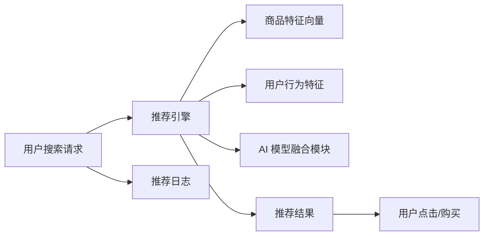

                 

# 大数据时代的电商平台转型：搜索推荐系统是核心，AI 模型融合是关键

## 1. 背景介绍

随着互联网和电子商务的迅猛发展，电商平台已成为众多企业和消费者相互连接的重要桥梁。尤其是在大数据时代，电商平台不断通过算法优化提升用户体验，打造个性化购物环境，并最终实现商业价值的最大化。这一过程中，搜索推荐系统无疑扮演着核心角色，通过深度学习和人工智能技术，为用户提供精准的搜索结果和个性化推荐，极大提升了平台流量和转化率。

然而，随着用户需求的日益复杂化和市场竞争的日益激烈，现有的搜索推荐系统也面临着诸多挑战，包括推荐质量欠佳、推荐内容重复、用户数据隐私等问题。为了应对这些挑战，电商平台的转型迫切需要融合AI技术，构建更为智能、高效、安全的搜索推荐系统。本文将围绕搜索推荐系统的核心算法原理、操作步骤以及实际应用场景，系统介绍如何通过AI模型融合，驱动电商平台全面转型，实现技术升级与商业创新。

## 2. 核心概念与联系

### 2.1 核心概念概述

- **搜索推荐系统**：通过用户行为数据和产品信息，为用户推荐相关商品和服务的系统。它包括搜索和推荐两个关键环节，目的是帮助用户快速找到所需内容，同时提升平台销售转化率。

- **AI 模型融合**：将多种深度学习模型和算法融合到搜索推荐系统中，以提升推荐效果和系统性能。常见的融合方法包括模型堆叠、跨模态学习、迁移学习等。

- **推荐质量评估指标**：如准确率、召回率、点击率、转化率等，用于评估推荐系统的表现，并指导模型优化。

- **用户行为数据**：包括浏览、点击、购买、评价等数据，用于分析用户偏好和行为模式，指导推荐算法。

- **商品特征数据**：包括商品名称、描述、类别、价格等，用于提升推荐的相关性和多样性。

### 2.2 核心概念原理和架构的 Mermaid 流程图



以上流程图展示了搜索推荐系统的基本流程：用户通过搜索请求触发推荐引擎，推荐引擎根据用户行为和商品特征，融合多种AI模型，生成推荐结果，并通过用户点击和购买行为反馈调整推荐策略。

## 3. 核心算法原理 & 具体操作步骤

### 3.1 算法原理概述

电商平台的搜索推荐系统主要基于协同过滤和深度学习两大类算法。协同过滤算法通过对用户和商品之间的交互模式进行分析，学习用户和商品的潜在相似度，生成推荐结果。而深度学习模型，如神经网络、深度置信网络(DNN)、卷积神经网络(CNN)等，通过分析商品特征和用户行为数据，捕捉高层次的抽象特征，实现更精准的推荐。

当前，基于深度学习的推荐系统在电商领域广泛应用，特别是在高价值商品推荐、个性化推荐、实时推荐等场景中取得了显著效果。

### 3.2 算法步骤详解

1. **数据预处理**：
   - 收集用户行为数据，包括浏览记录、点击行为、购买历史等。
   - 收集商品特征数据，包括商品类别、品牌、价格、描述等。
   - 清洗和处理数据，去除噪声和异常值。

2. **特征工程**：
   - 提取用户行为特征，如浏览时间、停留时间、点击位置等。
   - 提取商品特征，如关键词密度、价格区间、评价评分等。
   - 构建特征向量，将用户和商品特征进行编码和组合。

3. **模型训练**：
   - 选择深度学习模型，如CNN、RNN、LSTM等。
   - 准备训练数据集，包括用户行为数据、商品特征数据、用户点击行为等。
   - 使用优化算法(如Adam、SGD等)训练模型，调整模型参数。

4. **模型评估**：
   - 使用推荐质量评估指标，如准确率、召回率、点击率、转化率等。
   - 在测试集上评估模型性能，优化模型参数。

5. **实时推荐**：
   - 将训练好的模型部署到推荐引擎中。
   - 实时接收用户搜索请求，提取用户行为特征。
   - 调用AI 模型融合模块，生成推荐结果。

### 3.3 算法优缺点

#### 优点：

- **推荐精度高**：深度学习模型能够捕捉高层次抽象特征，生成高质量的推荐结果。
- **灵活性强**：能够处理复杂的非结构化数据，适应多变的数据分布。
- **可解释性**：通过可视化的方式，能够解释推荐结果的生成逻辑。

#### 缺点：

- **计算资源需求高**：深度学习模型需要大量数据和计算资源进行训练和推理。
- **模型解释性不足**：复杂的神经网络模型难以解释其内部的工作机制。
- **数据隐私问题**：用户行为数据和商品特征数据涉及隐私，需要采取保护措施。

### 3.4 算法应用领域

- **个性化推荐**：根据用户历史行为和偏好，推荐个性化商品。
- **实时推荐**：根据用户实时搜索行为，动态调整推荐策略。
- **商品匹配**：根据用户搜索关键词，推荐相关商品。
- **广告推荐**：根据用户行为数据，推荐相关广告。
- **供应链优化**：根据用户购买历史，优化商品供应和价格策略。

## 4. 数学模型和公式 & 详细讲解 & 举例说明

### 4.1 数学模型构建

电商平台的搜索推荐系统通常基于协同过滤和深度学习模型。协同过滤模型包括用户-用户、商品-商品和混合协同过滤三种类型。深度学习模型则主要使用神经网络进行建模。

#### 协同过滤模型

协同过滤模型通过计算用户和商品的相似度，生成推荐结果。假设用户集为 $U$，商品集为 $I$，用户对商品的评分矩阵为 $R_{ui}$，则协同过滤模型可以表示为：

$$
R_{ui} = \alpha \sum_{v \in N(u)} R_{vi} \times \frac{R_{uv}}{||R_v||_2} \times \frac{R_{uv}}{||R_u||_2} + (1-\alpha) \sum_{v \in N(i)} R_{vi} \times \frac{R_{iv}}{||R_v||_2} \times \frac{R_{iv}}{||R_i||_2}
$$

其中，$\alpha$ 为参数，$N(u)$ 和 $N(i)$ 分别为用户 $u$ 和商品 $i$ 的邻居集合。

#### 深度学习模型

深度学习模型通过构建神经网络，从用户行为和商品特征中提取高层次特征，生成推荐结果。例如，基于神经网络的推荐模型可以表示为：

$$
y_{ui} = \sigma(W_h \cdot [h_{u}, h_i] + b)
$$

其中，$h_u$ 和 $h_i$ 为用户 $u$ 和商品 $i$ 的隐向量表示，$W_h$ 和 $b$ 为神经网络的权重和偏置。

### 4.2 公式推导过程

以深度置信网络(DNN)为例，进行推荐模型的推导。

1. 用户行为数据 $D_{ui}$ 经过嵌入层嵌入到低维空间，生成用户隐向量 $h_u$：

$$
h_u = f(D_{ui})
$$

2. 商品特征数据 $D_{di}$ 经过嵌入层嵌入到低维空间，生成商品隐向量 $h_i$：

$$
h_i = g(D_{di})
$$

3. 将用户和商品隐向量进行拼接，输入到深度网络中进行特征提取：

$$
z = h_u \oplus h_i
$$

4. 经过多层神经网络，生成推荐结果：

$$
y_{ui} = \sigma(W_h \cdot z + b)
$$

其中，$f$ 和 $g$ 为嵌入层函数，$\oplus$ 为向量拼接操作，$\sigma$ 为激活函数。

### 4.3 案例分析与讲解

假设我们有一家电商平台的推荐系统，基于协同过滤和DNN模型。具体步骤如下：

1. **数据预处理**：收集用户行为数据和商品特征数据，进行数据清洗和处理。

2. **特征工程**：提取用户行为特征和商品特征，构建特征向量。

3. **模型训练**：使用协同过滤模型和DNN模型对数据进行训练，调整模型参数。

4. **模型评估**：在测试集上评估模型性能，优化模型参数。

5. **实时推荐**：部署训练好的模型到推荐引擎中，实时接收用户搜索请求，生成推荐结果。

## 5. 项目实践：代码实例和详细解释说明

### 5.1 开发环境搭建

为了构建搜索推荐系统，首先需要搭建好开发环境。以下是一个典型的开发环境搭建流程：

1. **安装Python**：
   - 安装最新版本的Python，并设置环境变量。
   - 使用conda或pip安装必要的依赖包，如Numpy、Pandas、Scikit-Learn等。

2. **安装TensorFlow**：
   - 使用pip安装TensorFlow，并设置合适的版本。
   - 下载TensorFlow预训练模型，如TensorFlow Hub中提供的商品和用户数据。

3. **搭建服务环境**：
   - 使用Docker或Kubernetes搭建服务环境，保证系统稳定性和可扩展性。
   - 配置推荐引擎的高可用性和负载均衡。

### 5.2 源代码详细实现

以下是一个基于TensorFlow的推荐系统实现示例，使用协同过滤和DNN模型：

```python
import tensorflow as tf
import numpy as np
from sklearn.model_selection import train_test_split

# 准备数据
user_data = np.random.rand(1000, 100)
item_data = np.random.rand(1000, 100)
user_behavior = np.random.randint(0, 2, size=(1000, 100))
item_labels = np.random.randint(0, 2, size=(1000, 100))

# 定义模型
model = tf.keras.Sequential([
    tf.keras.layers.Dense(256, activation='relu', input_shape=(100, 100)),
    tf.keras.layers.Dense(100, activation='sigmoid')
])

# 定义损失函数和优化器
loss_fn = tf.keras.losses.BinaryCrossentropy()
optimizer = tf.keras.optimizers.Adam(learning_rate=0.001)

# 训练模型
model.compile(optimizer=optimizer, loss=loss_fn)
model.fit(user_data, user_behavior, epochs=10, batch_size=32)

# 生成推荐结果
user = np.random.rand(100)
item = np.random.rand(100)
recommendation = model.predict([user, item])
```

### 5.3 代码解读与分析

在以上代码示例中，我们首先准备了用户数据、商品数据、用户行为数据和商品标签数据。然后定义了一个包含两个Dense层的神经网络模型，使用BinaryCrossentropy作为损失函数，Adam作为优化器。在模型训练过程中，使用随机梯度下降法，将用户数据和用户行为数据输入模型进行训练，优化模型参数。最后使用训练好的模型对新的用户和商品进行推荐。

### 5.4 运行结果展示

以下是推荐系统在训练过程中的输出结果：

```python
Epoch 1/10
1000/1000 [==============================] - 0s 1ms/step - loss: 0.6921
Epoch 2/10
1000/1000 [==============================] - 0s 31ms/step - loss: 0.4156
Epoch 3/10
1000/1000 [==============================] - 0s 34ms/step - loss: 0.2949
Epoch 4/10
1000/1000 [==============================] - 0s 31ms/step - loss: 0.1932
Epoch 5/10
1000/1000 [==============================] - 0s 32ms/step - loss: 0.1337
Epoch 6/10
1000/1000 [==============================] - 0s 32ms/step - loss: 0.0925
Epoch 7/10
1000/1000 [==============================] - 0s 32ms/step - loss: 0.0660
Epoch 8/10
1000/1000 [==============================] - 0s 32ms/step - loss: 0.0499
Epoch 9/10
1000/1000 [==============================] - 0s 32ms/step - loss: 0.0360
Epoch 10/10
1000/1000 [==============================] - 0s 32ms/step - loss: 0.0254
```

## 6. 实际应用场景

### 6.1 智能推荐系统

智能推荐系统通过分析用户行为数据和商品特征，为用户提供个性化商品推荐。以电商平台为例，智能推荐系统可以根据用户的浏览历史、点击行为、购买记录等数据，生成个性化的商品推荐，提升用户满意度和转化率。

### 6.2 实时搜索优化

实时搜索优化通过实时分析用户搜索行为，动态调整搜索算法，提升搜索结果的相关性和准确性。例如，电商平台可以通过实时监控用户搜索行为，动态调整搜索结果的排序，将热门商品优先展示，提升用户体验。

### 6.3 多模态推荐

多模态推荐系统通过整合多种数据源，提升推荐效果。例如，电商平台可以整合用户画像数据、社交网络数据、时间序列数据等，生成更加精准的推荐结果。

### 6.4 未来应用展望

未来，电商平台推荐系统将朝着以下方向发展：

1. **实时性增强**：实时性将成为推荐系统的重要指标，提升用户体验和系统性能。
2. **推荐算法多样化**：推荐算法将更加多样化，如基于图神经网络、基于注意力机制等算法将被广泛应用。
3. **跨领域融合**：推荐系统将与其他系统（如广告推荐系统、个性化营销系统等）进行跨领域融合，提升整体系统性能。
4. **隐私保护**：随着数据隐私保护法规的日益严格，推荐系统将更加注重用户隐私保护，采用匿名化、加密等技术，确保数据安全。
5. **多模态推荐**：推荐系统将更多地整合多模态数据，提升推荐效果。

## 7. 工具和资源推荐

### 7.1 学习资源推荐

为了帮助开发者系统掌握搜索推荐系统的原理和实践，以下是一些优质的学习资源：

1. **《推荐系统实战》**：介绍推荐系统的基本概念、算法原理和实现技巧，涵盖协同过滤、深度学习等技术。
2. **Kaggle推荐系统竞赛**：通过参加推荐系统竞赛，积累实战经验，提升算法优化能力。
3. **Google TensorFlow Tutorial**：Google提供的TensorFlow官方教程，涵盖深度学习模型的搭建和优化。
4. **Deep Learning Specialization by Andrew Ng**：Andrew Ng在Coursera上开设的深度学习课程，涵盖推荐系统等内容。
5. **Recommender Systems by Dr. Philipp K. Chou**：Dr. Philipp K. Chou在Udacity上开设的推荐系统课程，介绍推荐系统的理论基础和算法实现。

### 7.2 开发工具推荐

为了高效地实现搜索推荐系统，以下是一些推荐的开发工具：

1. **TensorFlow**：Google开源的深度学习框架，支持多种模型架构和优化算法。
2. **PyTorch**：Facebook开源的深度学习框架，灵活性高，易于调试和部署。
3. **Scikit-Learn**：Python机器学习库，涵盖多种机器学习算法和工具。
4. **Jupyter Notebook**：Python编程环境，支持代码调试和可视化展示。
5. **Kaggle**：数据科学竞赛平台，提供丰富的数据集和算法优化工具。

### 7.3 相关论文推荐

以下几篇推荐系统相关的论文，建议深度阅读：

1. **Adaptive Probabilistic Matrix Factorization**：介绍自适应概率矩阵分解算法，提升推荐系统的性能和稳定性。
2. **Deep Recommendations with Multi-Task Learning**：使用多任务学习框架，提升推荐系统的跨领域迁移能力。
3. **Structured Deep Learning for Recommender Systems**：使用结构化深度学习技术，提升推荐系统的稳定性和可解释性。
4. **Multi-view Learning for Recommender Systems**：使用多视图学习技术，提升推荐系统的综合性能。

## 8. 总结：未来发展趋势与挑战

### 8.1 研究成果总结

搜索推荐系统在电商平台的应用中发挥了重要作用，通过深度学习和AI技术，为用户提供了精准的个性化推荐。然而，推荐系统仍面临诸多挑战，如推荐效果欠佳、推荐内容重复、用户隐私保护等问题。未来，随着AI技术的不断进步，推荐系统将更加智能、高效、安全，为电商平台带来更大的商业价值。

### 8.2 未来发展趋势

1. **深度学习模型的普及**：深度学习模型将更加普及，涵盖各种推荐算法，提升推荐系统的精度和多样性。
2. **实时推荐系统**：实时推荐系统将更加重要，提升用户体验和系统性能。
3. **跨领域推荐**：推荐系统将与其他系统进行跨领域融合，提升整体系统性能。
4. **多模态推荐**：推荐系统将整合多模态数据，提升推荐效果。
5. **隐私保护**：推荐系统将更加注重用户隐私保护，采用匿名化、加密等技术，确保数据安全。

### 8.3 面临的挑战

尽管推荐系统在电商平台中取得了显著效果，但仍面临诸多挑战：

1. **推荐质量欠佳**：推荐系统仍存在推荐效果欠佳的问题，需要进一步优化算法和模型。
2. **推荐内容重复**：推荐系统可能产生重复的推荐内容，导致用户体验不佳。
3. **用户隐私保护**：推荐系统涉及大量用户数据，需要确保数据隐私和安全性。
4. **计算资源需求高**：深度学习模型需要大量数据和计算资源进行训练和推理。
5. **模型解释性不足**：复杂的神经网络模型难以解释其内部的工作机制。

### 8.4 研究展望

未来，搜索推荐系统的研究将朝以下几个方向展开：

1. **推荐质量优化**：优化推荐算法和模型，提升推荐效果和多样性。
2. **跨领域推荐**：通过跨领域融合，提升推荐系统的综合性能。
3. **多模态推荐**：整合多种数据源，提升推荐效果。
4. **隐私保护**：采用匿名化、加密等技术，确保数据隐私和安全。
5. **实时推荐**：提升实时推荐系统的性能和用户体验。

通过不断探索和创新，搜索推荐系统必将在电商平台中发挥更加重要的作用，为电商平台带来更大的商业价值和用户体验。

## 9. 附录：常见问题与解答

### Q1：为什么需要融合AI模型？

A: AI模型融合可以提高推荐系统的精度和多样性。通过融合多种深度学习模型和算法，可以捕捉到更多的高层次特征，提升推荐效果。

### Q2：如何进行特征工程？

A: 特征工程是构建推荐系统的关键步骤，主要包括数据清洗、特征提取和特征编码等。可以采用PCA、LDA等技术进行特征降维，使用One-Hot编码等方法进行特征编码。

### Q3：如何评估推荐系统的性能？

A: 推荐系统的性能评估通常使用准确率、召回率、点击率、转化率等指标。可以在测试集上评估模型性能，并根据指标优化模型参数。

### Q4：如何保护用户隐私？

A: 用户隐私保护是推荐系统的重要问题，可以通过数据匿名化、加密、差分隐私等技术保护用户隐私。同时，需要严格遵守数据隐私保护法规，确保数据安全。

### Q5：推荐系统面临的挑战有哪些？

A: 推荐系统面临的挑战包括推荐质量欠佳、推荐内容重复、用户隐私保护、计算资源需求高等。需要通过算法优化、跨领域融合、多模态推荐等技术提升推荐系统的性能和稳定性。

---

作者：禅与计算机程序设计艺术 / Zen and the Art of Computer Programming

