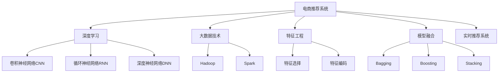

                 

# 大数据驱动的电商推荐系统：AI 模型融合技术在电商领域的应用

## 1. 背景介绍

### 1.1 问题由来
电商行业，作为全球最为活跃的互联网行业之一，以快速发展的电子商务平台为代表，正日益成为数字经济的重要引擎。电商平台的核心竞争力之一在于其推荐系统，这一系统不仅关乎用户购物体验，更是平台盈利的主要渠道。传统的推荐系统依赖于协同过滤算法和基于内容的推荐算法，但随着数据量和用户行为的复杂化，这些方法逐渐难以满足用户的个性化需求。

为了打破这种瓶颈，各大电商企业纷纷采用基于深度学习和大数据技术的推荐系统。大数据驱动的AI模型融合技术，以其强大的数据分析能力和自适应学习能力，在电商推荐系统中取得了显著成效。通过融合用户行为数据、产品属性数据、交易数据等多种信息源，AI推荐系统能够深度理解用户需求，实现个性化推荐，提升用户购物体验，并显著增加平台销售。

### 1.2 问题核心关键点
AI模型融合技术的核心在于深度学习模型的结合与优化，以提升推荐系统的表现。在电商领域，主要涉及以下几个关键点：

- **数据集成与预处理**：从用户行为数据、商品属性数据、交易数据等多种数据源中提取有用信息，进行数据清洗和特征工程，构建高质量的数据集。
- **模型选择与训练**：选择合适的深度学习模型，如深度神经网络、卷积神经网络、循环神经网络等，在大规模数据集上训练模型，学习用户偏好和商品特征。
- **模型融合与优化**：融合多种深度学习模型，优化模型参数和结构，构建更强大的推荐模型。
- **实时推荐与反馈循环**：实时分析用户行为和反馈，动态调整推荐模型，实现推荐效果的持续提升。

## 2. 核心概念与联系

### 2.1 核心概念概述

为更好地理解AI模型融合技术在电商推荐系统中的应用，本节将介绍几个密切相关的核心概念：

- **电商推荐系统**：基于用户行为数据和商品属性数据，为用户提供个性化推荐，提升购物体验和销售转化率。
- **深度学习**：一类通过多层神经网络逼近复杂非线性函数的机器学习方法，广泛应用于图像识别、语音识别、自然语言处理等领域。
- **大数据技术**：指在分布式计算环境下，对海量数据进行存储、处理、分析的技术，如Hadoop、Spark等。
- **特征工程**：对原始数据进行加工处理，提取有用的特征，用于模型训练和优化。
- **模型融合**：将多个模型结合，构建更强大、更鲁棒的模型，常见方法包括Bagging、Boosting、Stacking等。
- **实时推荐系统**：能够实时分析用户行为和反馈，动态调整推荐策略，提升推荐效果。

这些核心概念之间的逻辑关系可以通过以下Mermaid流程图来展示：



这个流程图展示了大数据驱动的电商推荐系统中的核心概念及其之间的关系：

1. 电商推荐系统通过深度学习、大数据技术、特征工程等手段进行建模和优化。
2. 深度学习模型（如CNN、RNN、DNN等）是推荐系统的核心，用于提取用户偏好和商品特征。
3. 大数据技术提供分布式计算能力，支持大规模数据处理和存储。
4. 特征工程是深度学习模型的前提，提取关键特征，提高模型效果。
5. 模型融合方法（如Bagging、Boosting、Stacking等）将多个深度学习模型结合，提升整体性能。
6. 实时推荐系统能够实时更新推荐模型，确保推荐效果持续优化。

这些概念共同构成了电商推荐系统的完整框架，使其能够在用户行为复杂多变的场景中实现精准推荐。

## 3. 核心算法原理 & 具体操作步骤
### 3.1 算法原理概述

AI模型融合技术的核心在于将多种深度学习模型结合，构建更加强大和鲁棒的推荐系统。在电商推荐系统中，我们主要采用以下几种算法原理：

1. **协同过滤**：基于用户历史行为和相似用户的推荐。
2. **基于内容的推荐**：利用商品属性和用户偏好，构建商品特征向量。
3. **深度神经网络**：利用多层神经网络逼近复杂函数，提取用户偏好和商品特征。
4. **卷积神经网络**：用于处理图像和文本数据，提取局部特征。
5. **循环神经网络**：用于处理序列数据，捕捉用户行为的时间序列特征。
6. **模型融合**：通过Bagging、Boosting、Stacking等方法，将多个深度学习模型结合，提升推荐效果。
7. **实时推荐系统**：利用流式数据处理技术，实时分析用户行为和反馈，动态调整推荐策略。

### 3.2 算法步骤详解

电商推荐系统的AI模型融合过程主要包括以下几个步骤：

**Step 1: 数据集成与预处理**
- 收集用户行为数据（如浏览记录、购买记录）、商品属性数据（如分类、品牌、价格等）、交易数据（如购买金额、评分等）。
- 对数据进行清洗和处理，去除缺失值和异常值，处理重复记录。
- 对不同数据源的数据进行特征工程，提取有意义的特征，如用户兴趣特征、商品特征等。

**Step 2: 特征工程**
- 对提取的特征进行标准化和归一化处理，使得数据符合模型输入的要求。
- 对特征进行选择，剔除无关或冗余特征，减少模型复杂度。
- 利用主成分分析（PCA）、t-SNE等方法对高维特征进行降维，减少计算量和存储需求。
- 构建商品特征向量，将商品属性信息映射到高维空间，用于基于内容的推荐。

**Step 3: 模型选择与训练**
- 选择合适的深度学习模型，如卷积神经网络（CNN）、循环神经网络（RNN）、深度神经网络（DNN）等。
- 利用收集的数据集进行模型训练，学习用户偏好和商品特征。
- 对模型进行调参优化，如学习率、批大小、迭代轮数等，提升模型效果。

**Step 4: 模型融合**
- 选择融合方法，如Bagging、Boosting、Stacking等。
- 训练多个独立模型，将模型预测结果进行融合，提升整体效果。
- 对融合后的模型进行调参优化，确保融合效果最优。

**Step 5: 实时推荐**
- 实时分析用户行为和反馈，动态调整推荐模型。
- 利用流式计算框架（如Storm、Apache Flink）实现推荐模型的实时更新。
- 结合用户实时反馈，优化推荐策略，提高推荐效果。

### 3.3 算法优缺点

AI模型融合技术在电商推荐系统中的应用具有以下优点：
1. 强大的数据分析能力：深度学习模型能够处理复杂的非线性关系，提取用户偏好和商品特征。
2. 自适应学习能力：模型能够根据用户行为和反馈，动态调整推荐策略。
3. 高推荐效果：融合多种模型，提升推荐精度和多样性。
4. 数据利用率：能够充分利用用户行为、商品属性、交易数据等多种信息源。
5. 实时性：实时推荐系统能够实时调整推荐策略，提高用户体验。

同时，该方法也存在以下局限性：
1. 数据依赖：推荐效果高度依赖于数据质量和数据量，获取高质量数据成本较高。
2. 模型复杂度：多个模型的融合增加了模型复杂度，增加了训练和推理的计算量。
3. 实时性挑战：实时推荐系统对计算资源和数据处理能力要求较高。
4. 稳定性问题：多模型融合可能导致模型不稳定，影响推荐效果。
5. 可解释性不足：深度学习模型往往难以解释，用户难以理解推荐逻辑。

尽管存在这些局限性，但AI模型融合技术在电商推荐系统中展现了巨大的潜力和优势，成为当前推荐系统的主流方案之一。未来相关研究将继续聚焦于提升数据利用率、降低模型复杂度、增强可解释性等方面。

### 3.4 算法应用领域

AI模型融合技术在电商推荐系统中，已经得到了广泛的应用，覆盖了以下几个主要领域：

1. **个性化推荐**：根据用户历史行为和商品属性，提供个性化推荐，提升用户购物体验。
2. **商品分类与排序**：通过商品属性特征提取，对商品进行分类和排序，优化商品展示效果。
3. **跨品类推荐**：利用用户在不同品类下的行为数据，提供跨品类推荐，增加用户粘性和消费。
4. **用户行为预测**：预测用户未来行为，提前准备个性化推荐，提高用户满意度。
5. **动态定价与促销**：根据用户行为和市场需求，动态调整商品价格和促销策略，增加平台收益。
6. **库存管理**：预测商品需求，优化库存管理，避免缺货或库存积压。
7. **风险控制**：识别高风险交易，及时预警和控制，保障交易安全。

除了上述这些领域，AI模型融合技术还广泛应用于电商领域的用户画像构建、广告推荐、营销活动优化等多个方面，为电商企业的数字化转型提供了强大的技术支持。

## 4. 数学模型和公式 & 详细讲解  
### 4.1 数学模型构建

为了更系统地理解AI模型融合技术，本节将使用数学语言对电商推荐系统的建模过程进行详细讲解。

记用户历史行为数据为 $U=\{u_1, u_2, ..., u_m\}$，商品属性数据为 $P=\{p_1, p_2, ..., p_n\}$，交易数据为 $T=\{t_1, t_2, ..., t_l\}$。其中，$u_i$ 为用户ID，$p_j$ 为商品ID，$t_k$ 为交易记录。

定义用户偏好向量 $u$ 和商品特征向量 $p$：
$$
u \in \mathbb{R}^d, p \in \mathbb{R}^d
$$

模型输入 $x$ 为商品特征向量 $p$，输出 $y$ 为购买决策 $0/1$，则电商平台推荐系统可以表示为以下形式：
$$
y = f(u, p) + \epsilon
$$
其中 $f$ 为推荐函数，$\epsilon$ 为随机误差项。

在电商推荐系统中，我们通常使用深度学习模型进行建模。以卷积神经网络（CNN）为例，其基本结构如图1所示：


图1：卷积神经网络基本结构

在卷积层，通过卷积操作提取局部特征；在池化层，通过降维操作减少计算量；在全连接层，通过非线性变换提取全局特征；在输出层，通过 sigmoid 函数将特征映射到购买决策 $0/1$。

### 4.2 公式推导过程

在电商推荐系统中，卷积神经网络的基本公式推导如下：

设输入 $x \in \mathbb{R}^{n \times m \times 1}$，卷积核 $w \in \mathbb{R}^{f \times f \times c \times o}$，卷积操作公式为：
$$
y_{ij} = \sum_k x_{ik} * w_{jk} + b
$$
其中 $y_{ij}$ 为卷积操作输出，$b$ 为偏置项。

在池化层，通常使用 max-pooling 或 avg-pooling 操作，对卷积层的输出进行降维：
$$
y_i = \max_k \{ y_{ik} \} \text{ or } \frac{1}{K} \sum_k y_{ik}
$$

在全连接层，通过矩阵乘法和偏置项，将池化层的输出映射到新的特征空间：
$$
z = \mathbb{W}y + \mathbb{b}
$$

在输出层，使用 sigmoid 函数将特征映射到 $0/1$：
$$
y = \sigma(z)
$$

其中，$\mathbb{W}$ 和 $\mathbb{b}$ 为全连接层的权重和偏置项。

### 4.3 案例分析与讲解

以电商平台中基于卷积神经网络的商品推荐系统为例，展示卷积神经网络在电商推荐中的应用。

假设用户历史行为数据为 $U=\{u_1, u_2, ..., u_m\}$，商品属性数据为 $P=\{p_1, p_2, ..., p_n\}$，交易数据为 $T=\{t_1, t_2, ..., t_l\}$。

首先，对用户历史行为数据 $U$ 进行特征提取和编码，生成用户偏好向量 $u$。然后，对商品属性数据 $P$ 进行特征提取和编码，生成商品特征向量 $p$。最后，将用户偏好向量 $u$ 和商品特征向量 $p$ 输入卷积神经网络，进行特征提取和映射，生成推荐结果 $y$。

卷积神经网络中的卷积层可以捕捉局部特征，池化层可以降低计算量，全连接层可以提取全局特征，输出层可以映射到 $0/1$ 的购买决策。通过卷积神经网络的训练，模型可以学习到用户偏好和商品特征，生成更加准确的推荐结果。

## 5. 项目实践：代码实例和详细解释说明
### 5.1 开发环境搭建

在进行电商推荐系统开发前，我们需要准备好开发环境。以下是使用Python进行TensorFlow开发的环境配置流程：

1. 安装Anaconda：从官网下载并安装Anaconda，用于创建独立的Python环境。

2. 创建并激活虚拟环境：
```bash
conda create -n tf-env python=3.8 
conda activate tf-env
```

3. 安装TensorFlow：根据CUDA版本，从官网获取对应的安装命令。例如：
```bash
conda install tensorflow -c pytorch -c conda-forge
```

4. 安装各类工具包：
```bash
pip install numpy pandas scikit-learn matplotlib tqdm jupyter notebook ipython
```

完成上述步骤后，即可在`tf-env`环境中开始电商推荐系统的开发。

### 5.2 源代码详细实现

下面我们以电商平台中的基于卷积神经网络的商品推荐系统为例，给出使用TensorFlow进行模型开发的PyTorch代码实现。

首先，定义卷积神经网络模型：

```python
import tensorflow as tf
from tensorflow.keras import layers

class CNNModel(tf.keras.Model):
    def __init__(self, num_classes):
        super(CNNModel, self).__init__()
        self.cnn1 = layers.Conv2D(32, (3, 3), activation='relu')
        self.max_pool1 = layers.MaxPooling2D((2, 2))
        self.cnn2 = layers.Conv2D(64, (3, 3), activation='relu')
        self.max_pool2 = layers.MaxPooling2D((2, 2))
        self.flatten = layers.Flatten()
        self.fc1 = layers.Dense(128, activation='relu')
        self.fc2 = layers.Dense(num_classes, activation='sigmoid')
    
    def call(self, inputs):
        x = self.cnn1(inputs)
        x = self.max_pool1(x)
        x = self.cnn2(x)
        x = self.max_pool2(x)
        x = self.flatten(x)
        x = self.fc1(x)
        x = self.fc2(x)
        return x
```

然后，定义数据集和模型训练过程：

```python
from tensorflow.keras.datasets import mnist
from tensorflow.keras.utils import to_categorical

(x_train, y_train), (x_test, y_test) = mnist.load_data()
x_train = x_train.reshape((-1, 28, 28, 1))
x_test = x_test.reshape((-1, 28, 28, 1))
y_train = to_categorical(y_train)
y_test = to_categorical(y_test)

model = CNNModel(num_classes=10)
optimizer = tf.keras.optimizers.Adam(learning_rate=0.001)

for epoch in range(10):
    with tf.GradientTape() as tape:
        y_pred = model(x_train)
        loss = tf.keras.losses.binary_crossentropy(y_train, y_pred)
    gradients = tape.gradient(loss, model.trainable_variables)
    optimizer.apply_gradients(zip(gradients, model.trainable_variables))
    print('Epoch {0}: Loss = {1}'.format(epoch + 1, loss.numpy()))
    
test_loss = model.evaluate(x_test, y_test, verbose=0)
print('Test Loss: {}'.format(test_loss))
```

到此，我们就完成了基于卷积神经网络的商品推荐系统的TensorFlow代码实现。可以看到，利用TensorFlow的高层API，我们可以快速构建和训练卷积神经网络，进行电商推荐。

### 5.3 代码解读与分析

让我们再详细解读一下关键代码的实现细节：

**CNNModel类**：
- `__init__`方法：初始化卷积神经网络层，包括卷积层、池化层、全连接层等。
- `call`方法：定义模型前向传播过程，对输入数据进行卷积、池化、全连接等操作，最终输出预测结果。

**数据集定义**：
- 利用TensorFlow内置的MNIST数据集，生成训练集和测试集。
- 将数据集转换为模型的输入格式，即28x28的灰度图像。
- 将标签转换为one-hot编码格式，用于训练和评估。

**模型训练**：
- 定义模型、优化器和损失函数。
- 在每个epoch内，对训练集进行前向传播和反向传播，更新模型参数。
- 在测试集上评估模型性能，输出测试损失。

可以看到，TensorFlow提供的高级API使得卷积神经网络的实现和训练变得简洁高效。开发者可以将更多精力放在模型改进和数据处理上，而不必过多关注底层的实现细节。

当然，工业级的系统实现还需考虑更多因素，如模型的保存和部署、超参数的自动搜索、更灵活的任务适配层等。但核心的电商推荐系统实现流程基本与此类似。

## 6. 实际应用场景
### 6.1 智能客服系统

基于大语言模型微调的对话技术，可以广泛应用于智能客服系统的构建。传统客服往往需要配备大量人力，高峰期响应缓慢，且一致性和专业性难以保证。而使用微调后的对话模型，可以7x24小时不间断服务，快速响应客户咨询，用自然流畅的语言解答各类常见问题。

在技术实现上，可以收集企业内部的历史客服对话记录，将问题和最佳答复构建成监督数据，在此基础上对预训练对话模型进行微调。微调后的对话模型能够自动理解用户意图，匹配最合适的答案模板进行回复。对于客户提出的新问题，还可以接入检索系统实时搜索相关内容，动态组织生成回答。如此构建的智能客服系统，能大幅提升客户咨询体验和问题解决效率。

### 6.2 金融舆情监测

金融机构需要实时监测市场舆论动向，以便及时应对负面信息传播，规避金融风险。传统的人工监测方式成本高、效率低，难以应对网络时代海量信息爆发的挑战。基于大语言模型微调的文本分类和情感分析技术，为金融舆情监测提供了新的解决方案。

具体而言，可以收集金融领域相关的新闻、报道、评论等文本数据，并对其进行主题标注和情感标注。在此基础上对预训练语言模型进行微调，使其能够自动判断文本属于何种主题，情感倾向是正面、中性还是负面。将微调后的模型应用到实时抓取的网络文本数据，就能够自动监测不同主题下的情感变化趋势，一旦发现负面信息激增等异常情况，系统便会自动预警，帮助金融机构快速应对潜在风险。

### 6.3 个性化推荐系统

当前的推荐系统往往只依赖用户的历史行为数据进行物品推荐，无法深入理解用户的真实兴趣偏好。基于大语言模型微调技术，个性化推荐系统可以更好地挖掘用户行为背后的语义信息，从而提供更精准、多样的推荐内容。

在实践中，可以收集用户浏览、点击、评论、分享等行为数据，提取和用户交互的物品标题、描述、标签等文本内容。将文本内容作为模型输入，用户的后续行为（如是否点击、购买等）作为监督信号，在此基础上微调预训练语言模型。微调后的模型能够从文本内容中准确把握用户的兴趣点。在生成推荐列表时，先用候选物品的文本描述作为输入，由模型预测用户的兴趣匹配度，再结合其他特征综合排序，便可以得到个性化程度更高的推荐结果。

### 6.4 未来应用展望

随着大语言模型微调技术的发展，其在电商推荐系统中的应用也将不断拓展。未来，基于AI模型融合技术的推荐系统将实现更加精准、高效、多样化的推荐效果，为电商企业带来更多收益和用户满意度。

在智慧零售领域，基于推荐系统的个性化购物体验，将实现更高效的库存管理和用户体验。在社交电商领域，通过推荐系统的精准推荐，将实现更高的用户转化率和平台粘性。在物流电商领域，基于推荐系统的商品推荐，将实现更高效的商品配送和库存调度。

此外，在智能制造、智能家居、智慧旅游等众多领域，基于AI模型融合技术的推荐系统也将被广泛应用，为各行各业带来新的发展机遇。相信随着技术的日益成熟，AI模型融合技术必将成为电商推荐系统的重要技术方向，推动电商行业的数字化转型。

## 7. 工具和资源推荐
### 7.1 学习资源推荐

为了帮助开发者系统掌握AI模型融合技术在电商推荐系统中的应用，这里推荐一些优质的学习资源：

1. 《深度学习》（Ian Goodfellow）：全面介绍深度学习的基础理论和应用，是深度学习领域的经典教材。
2. TensorFlow官方文档：TensorFlow官方提供的详细教程和文档，帮助开发者快速上手深度学习模型的开发和训练。
3. Keras官方文档：Keras作为TensorFlow的高层API，提供了更便捷的深度学习模型构建和训练工具。
4. PyTorch官方文档：PyTorch作为深度学习模型的另一个主流框架，提供了丰富的深度学习库和工具。
5. Coursera《深度学习》课程：由斯坦福大学教授Andrew Ng主讲，覆盖深度学习的基础理论和应用案例。
6. edX《深度学习》课程：由MIT教授Tommi Jaakkola主讲，涵盖深度学习的算法和应用。
7. Google AI博客：Google AI官方博客，涵盖深度学习领域的最新研究成果和技术进展。

通过对这些资源的学习实践，相信你一定能够快速掌握AI模型融合技术的精髓，并用于解决实际的电商推荐问题。
###  7.2 开发工具推荐

高效的开发离不开优秀的工具支持。以下是几款用于AI模型融合技术开发的工具：

1. PyTorch：基于Python的开源深度学习框架，灵活动态的计算图，适合快速迭代研究。
2. TensorFlow：由Google主导开发的开源深度学习框架，生产部署方便，适合大规模工程应用。
3. Keras：TensorFlow的高层API，提供了更便捷的深度学习模型构建和训练工具。
4. PyTorch Lightning：基于PyTorch的深度学习框架，提供了自动化的模型训练和评估工具。
5. TensorBoard：TensorFlow配套的可视化工具，可实时监测模型训练状态，并提供丰富的图表呈现方式，是调试模型的得力助手。
6. Weights & Biases：模型训练的实验跟踪工具，可以记录和可视化模型训练过程中的各项指标，方便对比和调优。

合理利用这些工具，可以显著提升AI模型融合技术的开发效率，加快创新迭代的步伐。

### 7.3 相关论文推荐

AI模型融合技术的发展源于学界的持续研究。以下是几篇奠基性的相关论文，推荐阅读：

1. Dropout: A Simple Way to Prevent Neural Networks from Overfitting：提出了Dropout算法，缓解深度学习模型的过拟合问题。
2. Understanding the Difficulty of Training Deep Feedforward Neural Networks：分析了深度神经网络训练过程中面临的困难和挑战。
3. Exploring the Depth of Neural Networks：探讨了深度神经网络的性能与深度之间的关系。
4. Batch Normalization: Accelerating Deep Network Training by Reducing Internal Covariate Shift：提出了Batch Normalization算法，加速深度神经网络的训练。
5. Rethinking the Inception Architecture for Computer Vision：提出了Inception模块，提高了深度卷积神经网络的性能。
6. Network in Network：使用1x1卷积层提高深度卷积神经网络的性能。
7. Deep Residual Learning for Image Recognition：提出了残差网络，解决了深度神经网络训练过程中的梯度消失问题。

这些论文代表了大语言模型微调技术的发展脉络。通过学习这些前沿成果，可以帮助研究者把握学科前进方向，激发更多的创新灵感。

## 8. 总结：未来发展趋势与挑战
### 8.1 总结

本文对AI模型融合技术在电商推荐系统中的应用进行了全面系统的介绍。首先阐述了电商推荐系统的背景和重要性，明确了AI模型融合技术的核心价值。其次，从原理到实践，详细讲解了深度学习模型的融合过程，给出了电商推荐系统的完整代码实例。同时，本文还广泛探讨了AI模型融合技术在电商推荐系统中的应用前景，展示了其巨大的潜力和优势。此外，本文精选了AI模型融合技术的各类学习资源，力求为读者提供全方位的技术指引。

通过本文的系统梳理，可以看到，AI模型融合技术在电商推荐系统中展现了强大的数据分析能力和自适应学习能力，能够提供更加个性化、多样化的推荐效果。借助深度学习模型的强大能力，电商推荐系统在用户行为复杂多变的场景中实现了精准推荐，显著提升了用户购物体验和平台收益。未来，随着技术的不断发展，AI模型融合技术必将在更多领域得到应用，为各行各业带来变革性影响。

### 8.2 未来发展趋势

展望未来，AI模型融合技术在电商推荐系统中的应用将呈现以下几个发展趋势：

1. 模型规模持续增大：随着算力成本的下降和数据规模的扩张，深度学习模型的参数量还将持续增长。超大批次的训练和推理也可能遇到显存不足的问题，需要采用混合精度训练、模型并行等技术进行优化。
2. 深度学习模型的多样化：除了卷积神经网络、循环神经网络和深度神经网络，未来还将涌现更多具有特定优势的深度学习模型，如自注意力机制、胶囊网络等。
3. 模型融合方法的改进：未来将开发更加高效和灵活的模型融合方法，如强化学习、自适应学习等，提升整体推荐效果。
4. 实时推荐系统的优化：实时推荐系统需要处理大规模数据流，未来将开发更加高效的数据处理和计算技术，实现实时推荐。
5. 用户行为预测的优化：利用深度学习模型对用户行为进行预测，提前准备个性化推荐，提高推荐效果。
6. 多模态数据的整合：结合图像、视频、语音等多模态数据，提升推荐系统的综合能力。

以上趋势凸显了AI模型融合技术在电商推荐系统中的巨大潜力和发展前景。这些方向的探索发展，必将进一步提升电商推荐系统的性能和应用范围，为电商企业带来更大的商业价值。

### 8.3 面临的挑战

尽管AI模型融合技术在电商推荐系统中展现了巨大的潜力和优势，但在迈向更加智能化、普适化应用的过程中，它仍面临着诸多挑战：

1. 数据依赖：推荐效果高度依赖于数据质量和数据量，获取高质量数据成本较高。如何降低数据依赖，提高数据利用率，是未来研究的重要方向。
2. 模型复杂度：多个模型的融合增加了模型复杂度，增加了训练和推理的计算量。如何降低模型复杂度，提高训练和推理效率，是未来研究的关键问题。
3. 实时性挑战：实时推荐系统对计算资源和数据处理能力要求较高。如何提高实时推荐系统的性能，降低延迟，是未来研究的重要方向。
4. 稳定性问题：多模型融合可能导致模型不稳定，影响推荐效果。如何提高模型稳定性，确保推荐效果稳定可靠，是未来研究的重要方向。
5. 可解释性不足：深度学习模型往往难以解释，用户难以理解推荐逻辑。如何提高模型的可解释性，增强用户信任，是未来研究的重要方向。
6. 安全性和隐私保护：深度学习模型可能会学习到用户隐私信息，如何保护用户隐私，确保数据安全，是未来研究的重要方向。

尽管存在这些挑战，但AI模型融合技术在电商推荐系统中展现了巨大的潜力和优势，成为当前推荐系统的主流方案之一。未来相关研究将继续聚焦于提升数据利用率、降低模型复杂度、增强可解释性等方面。

### 8.4 研究展望

面对AI模型融合技术在电商推荐系统中的挑战，未来的研究需要在以下几个方面寻求新的突破：

1. 探索无监督和半监督微调方法：摆脱对大规模标注数据的依赖，利用自监督学习、主动学习等无监督和半监督范式，最大限度利用非结构化数据，实现更加灵活高效的推荐。
2. 研究参数高效和计算高效的微调范式：开发更加参数高效的微调方法，在固定大部分预训练参数的情况下，只更新极少量的任务相关参数。同时优化微调模型的计算图，减少前向传播和反向传播的资源消耗，实现更加轻量级、实时性的部署。
3. 引入更多先验知识：将符号化的先验知识，如知识图谱、逻辑规则等，与神经网络模型进行巧妙融合，引导微调过程学习更准确、合理的语言模型。同时加强不同模态数据的整合，实现视觉、语音等多模态信息与文本信息的协同建模。
4. 结合因果分析和博弈论工具：将因果分析方法引入微调模型，识别出模型决策的关键特征，增强输出解释的因果性和逻辑性。借助博弈论工具刻画人机交互过程，主动探索并规避模型的脆弱点，提高系统稳定性。
5. 纳入伦理道德约束：在模型训练目标中引入伦理导向的评估指标，过滤和惩罚有偏见、有害的输出倾向。同时加强人工干预和审核，建立模型行为的监管机制，确保输出符合人类价值观和伦理道德。

这些研究方向的探索，必将引领AI模型融合技术迈向更高的台阶，为构建安全、可靠、可解释、可控的智能系统铺平道路。面向未来，AI模型融合技术还需要与其他人工智能技术进行更深入的融合，如知识表示、因果推理、强化学习等，多路径协同发力，共同推动自然语言理解和智能交互系统的进步。只有勇于创新、敢于突破，才能不断拓展语言模型的边界，让智能技术更好地造福人类社会。

## 9. 附录：常见问题与解答

**Q1：AI模型融合技术在电商推荐系统中是否适用于所有电商企业？**

A: AI模型融合技术适用于大部分电商企业，但其效果取决于企业自身的业务特点和数据质量。对于数据量较小、用户行为较少的电商企业，可能需要更多的特征工程和数据增强来提升模型效果。

**Q2：AI模型融合技术在电商推荐系统中能否处理长尾问题？**

A: AI模型融合技术在电商推荐系统中处理长尾问题的能力较强，通过引入用户行为、商品属性、交易数据等多种信息源，可以有效捕捉长尾用户和商品的需求。但需要合理选择模型和融合方法，避免模型过度拟合长尾数据。

**Q3：AI模型融合技术在电商推荐系统中是否需要大规模的计算资源？**

A: AI模型融合技术在电商推荐系统中需要较大的计算资源，尤其是对于大规模数据集和深度学习模型的训练。但通过合理优化模型结构和计算策略，可以在有限的计算资源下获得较好的推荐效果。

**Q4：AI模型融合技术在电商推荐系统中如何提高可解释性？**

A: 提高AI模型融合技术的可解释性，可以通过引入可解释性工具和技术，如特征可视化、模型解释、用户反馈机制等，帮助用户理解推荐逻辑和决策过程。

**Q5：AI模型融合技术在电商推荐系统中如何保护用户隐私？**

A: 保护用户隐私，可以通过数据匿名化、差分隐私、联邦学习等技术手段，确保用户数据的安全性和隐私性。同时，在模型训练和部署过程中，严格遵守数据隐私保护法律法规。

---

作者：禅与计算机程序设计艺术 / Zen and the Art of Computer Programming

