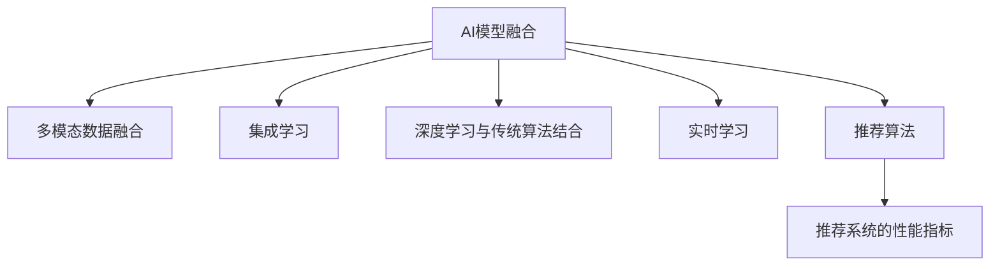

                 

# 大数据驱动的电商搜索推荐系统：AI 模型融合是核心，用户体验是重点

## 1. 背景介绍

### 1.1 问题由来
随着互联网和电子商务的蓬勃发展，电商平台的海量数据正在逐渐被挖掘和利用。电商搜索推荐系统（Search and Recommendation System, SRS）作为电商的核心技术之一，旨在通过智能算法，帮助用户快速找到其需要的商品，同时向用户推荐可能感兴趣的商品，从而提高用户体验和平台收益。然而，传统的搜索推荐系统在面对海量的商品数据和用户行为数据时，显得力不从心。传统的关键词匹配、协同过滤等方法，难以应对复杂的用户需求和多样化的商品特性。而随着人工智能（AI）技术的快速发展，基于机器学习（ML）和深度学习（DL）的AI推荐系统逐渐成为电商搜索推荐领域的新宠。

### 1.2 问题核心关键点
目前，基于AI的电商搜索推荐系统，其核心是利用人工智能算法和模型，对商品数据和用户行为数据进行分析和建模。通过融合多个AI模型，并不断迭代优化，以提升推荐的准确性和个性化程度，从而显著改善用户体验。AI模型融合技术主要体现在以下几个方面：

1. **多模态数据融合**：融合商品图片、描述、用户评分、浏览记录等多维度的数据，构建更加全面和精准的用户画像和商品特征。
2. **集成学习**：通过集成多个单一模型的预测结果，取长补短，提高推荐结果的鲁棒性和准确性。
3. **深度学习与传统算法结合**：结合神经网络和协同过滤等算法，利用各自的优势，构建更灵活、高效的推荐引擎。
4. **个性化推荐与多样性保证**：在推荐过程中，不仅要关注个性化推荐，还要保证一定的商品多样性，避免算法产生"茧房"效应。
5. **实时学习与冷启动**：通过实时学习用户行为和商品信息，并快速适应新的用户和商品，实现冷启动推荐，缩短用户发现新商品的路径。

### 1.3 问题研究意义
随着电商行业的竞争日趋激烈，用户体验和推荐系统的准确性成为了平台的核心竞争力。通过采用AI模型融合技术，电商平台可以更有效地利用大数据资源，构建精准的搜索推荐系统，从而提高用户满意度、增加平台粘性和提升销售转化率。同时，AI模型融合也为个性化推荐系统的可解释性和透明度带来了新的契机，使得平台能够更透明地展示推荐算法的依据，增强用户信任。

## 2. 核心概念与联系

### 2.1 核心概念概述

为更好地理解基于AI的电商搜索推荐系统，本节将介绍几个关键概念：

- **AI模型融合**：通过融合多个AI模型，提高推荐的准确性和个性化程度。包括多模态数据融合、集成学习、深度学习与传统算法结合等多种技术手段。
- **多模态数据**：包括文本、图像、时间序列等多维度的数据，用于构建更全面、精准的用户画像和商品特征。
- **集成学习**：将多个单一模型的预测结果进行融合，取长补短，提高推荐结果的鲁棒性和准确性。
- **实时学习**：通过实时学习用户行为和商品信息，快速适应新的用户和商品，实现冷启动推荐。
- **推荐算法**：包括协同过滤、深度学习、知识图谱等算法，用于构建推荐引擎。
- **推荐系统的性能指标**：包括精确度、召回率、F1分数、用户满意度等，用于评估推荐系统的效果。

这些概念之间的关系可以通过以下Mermaid流程图来展示：



这个流程图展示了大数据驱动的电商搜索推荐系统中，各关键概念之间的逻辑关系：

1. 融合多个AI模型，构建推荐系统。
2. 利用多模态数据，丰富用户画像和商品特征。
3. 通过集成学习，提高推荐结果的鲁棒性和准确性。
4. 结合深度学习与传统算法，构建灵活、高效的推荐引擎。
5. 实时学习新数据，实现冷启动推荐。
6. 使用多种推荐算法，评估推荐系统的性能指标。

## 3. 核心算法原理 & 具体操作步骤
### 3.1 算法原理概述

基于AI的电商搜索推荐系统，其核心算法原理可以概括为以下几个步骤：

1. **数据采集与预处理**：收集商品数据和用户行为数据，并进行清洗、归一化等预处理，构建训练集和测试集。
2. **模型构建与融合**：选择合适的AI模型，如深度神经网络、协同过滤等，并设计融合策略，融合多个模型的预测结果。
3. **特征提取与编码**：提取商品和用户的特征，并将其转化为模型可接受的格式，如向量表示。
4. **模型训练与优化**：使用训练集对模型进行训练，并通过验证集进行模型调参，选择最优模型。
5. **实时推荐与评估**：使用训练好的模型对新用户和商品进行实时推荐，并通过A/B测试等方法评估推荐效果。

### 3.2 算法步骤详解

以下是基于AI的电商搜索推荐系统的详细步骤：

**Step 1: 数据采集与预处理**
- 收集商品数据：包括商品名称、价格、描述、图片等。
- 收集用户行为数据：包括浏览记录、评分、收藏、购买记录等。
- 数据清洗：去除重复、错误、缺失数据，并进行归一化处理。
- 特征工程：提取商品和用户的关键特征，并设计合理的特征编码方式。

**Step 2: 模型构建与融合**
- 选择适合的AI模型：如深度神经网络、协同过滤等。
- 设计融合策略：如加权平均、投票、堆叠等，将多个模型的预测结果进行融合。
- 训练单个模型：使用训练集对每个模型进行单独训练，并使用验证集进行调参。
- 模型融合：将训练好的模型进行融合，生成最终推荐结果。

**Step 3: 特征提取与编码**
- 商品特征提取：提取商品的关键属性，如价格、类别、品牌等，并转化为向量表示。
- 用户特征提取：提取用户的关键属性，如年龄、性别、历史行为等，并转化为向量表示。
- 多模态特征融合：将商品图片、描述、用户评分等不同模态的特征进行融合，生成统一的特征表示。

**Step 4: 模型训练与优化**
- 训练单个模型：使用训练集对每个模型进行单独训练，并使用验证集进行调参。
- 模型融合训练：将训练好的模型进行融合，并使用验证集进行整体调参。
- 模型优化：通过超参数调优、正则化等方法，提高模型的泛化能力和鲁棒性。

**Step 5: 实时推荐与评估**
- 实时推荐：使用训练好的模型对新用户和商品进行实时推荐。
- 推荐评估：通过A/B测试、用户反馈等方式，评估推荐效果，并根据反馈进行模型优化。

### 3.3 算法优缺点

基于AI的电商搜索推荐系统具有以下优点：
1. 准确性高：通过融合多个AI模型，提高推荐的准确性和个性化程度。
2. 实时性：能够实时学习用户行为和商品信息，快速适应新用户和商品，实现冷启动推荐。
3. 可扩展性强：可以方便地扩展到新的数据源和用户行为，适应电商业务的快速变化。
4. 用户满意度提升：通过个性化推荐，提高用户满意度和粘性，增加平台收益。

同时，该方法也存在一些局限性：
1. 对数据质量要求高：需要高质量的商品数据和用户行为数据，数据质量对推荐结果的影响较大。
2. 算法复杂度高：融合多个AI模型和特征工程，需要较高的计算资源和算法复杂度。
3. 可解释性差：多模态数据和深度学习模型的黑盒特性，使得推荐结果的解释性较差。
4. 安全性问题：用户行为数据和商品数据的隐私保护问题，需要采取一定的数据保护措施。

尽管存在这些局限性，但基于AI的电商搜索推荐系统在实际应用中已经取得了显著效果，成为电商搜索推荐领域的核心技术。

### 3.4 算法应用领域

基于AI的电商搜索推荐系统，已经在多个电商平台上得到了广泛应用，包括：

- 商品推荐：通过个性化推荐，提高用户购买概率，增加平台收益。
- 搜索排序：通过实时学习用户查询意图，优化搜索结果的排序。
- 广告投放：通过推荐算法，精准匹配广告主和用户，提升广告效果。
- 库存管理：通过预测需求，优化库存水平，减少库存成本。
- 内容推荐：通过推荐算法，提升内容平台的互动率和留存率。

除了这些传统应用场景外，基于AI的电商搜索推荐系统还在新兴领域如智能客服、个性化广告、社交电商等方面，展现了巨大的应用潜力。

## 4. 数学模型和公式 & 详细讲解 & 举例说明
### 4.1 数学模型构建

本节将使用数学语言对基于AI的电商搜索推荐系统进行更加严格的刻画。

记商品集合为 $I$，用户集合为 $U$，商品与用户之间的评分矩阵为 $R \in \mathbb{R}^{I \times U}$，用户的历史行为序列为 $B_u \in \{0, 1\}^{I \times T}$，其中 $T$ 表示时间步长。我们的目标是通过训练模型 $f: I \times U \rightarrow \mathbb{R}$，预测用户 $u$ 对商品 $i$ 的评分 $r_{ui}$。

### 4.2 公式推导过程

以下是基于AI的电商搜索推荐系统的数学模型构建和公式推导：

**损失函数**：我们定义损失函数为均方误差损失：
$$
L = \frac{1}{N}\sum_{i=1}^{I}\sum_{u=1}^{U} (r_{ui} - f(i, u))^2
$$

**模型训练**：我们使用随机梯度下降（SGD）算法，最小化损失函数，更新模型参数 $\theta$：
$$
\theta = \theta - \eta \nabla_{\theta} L
$$
其中 $\eta$ 为学习率，$\nabla_{\theta} L$ 为损失函数对模型参数 $\theta$ 的梯度。

**评分预测**：对于新的商品和用户，我们通过训练好的模型 $f$ 进行评分预测：
$$
\hat{r}_{ui} = f(i, u)
$$

### 4.3 案例分析与讲解

假设我们有一个电商平台的推荐系统，可以使用协同过滤算法和深度学习模型进行推荐。我们首先使用协同过滤算法训练模型，得到用户对商品的评分预测，然后使用深度学习模型融合协同过滤的结果，提高推荐的准确性。

设协同过滤算法预测的用户对商品的评分为 $r_{ui}^{\text{CF}}$，深度学习模型预测的用户对商品的评分为 $r_{ui}^{\text{DL}}$。我们设计融合策略，将两个模型的预测结果进行加权平均：
$$
\hat{r}_{ui} = \alpha r_{ui}^{\text{CF}} + (1-\alpha) r_{ui}^{\text{DL}}
$$
其中 $\alpha$ 为加权系数，可以根据实际效果进行调优。

通过这个简单的案例，我们可以看到，通过融合多个AI模型，可以显著提高推荐系统的准确性和鲁棒性。

## 5. 项目实践：代码实例和详细解释说明
### 5.1 开发环境搭建

在进行AI推荐系统开发前，我们需要准备好开发环境。以下是使用Python进行TensorFlow开发的环境配置流程：

1. 安装Anaconda：从官网下载并安装Anaconda，用于创建独立的Python环境。

2. 创建并激活虚拟环境：
```bash
conda create -n tf-env python=3.8 
conda activate tf-env
```

3. 安装TensorFlow：根据CUDA版本，从官网获取对应的安装命令。例如：
```bash
conda install tensorflow==2.7.0 tensorflow-gpu==2.7.0
```

4. 安装各类工具包：
```bash
pip install numpy pandas scikit-learn matplotlib tqdm jupyter notebook ipython
```

完成上述步骤后，即可在`tf-env`环境中开始推荐系统开发。

### 5.2 源代码详细实现

下面我们以电商推荐系统为例，给出使用TensorFlow进行推荐模型开发的PyTorch代码实现。

首先，定义推荐模型的数据处理函数：

```python
import tensorflow as tf
from tensorflow.keras.layers import Input, Dense, Embedding, Flatten, Concatenate, Dropout, Add
from tensorflow.keras.models import Model

class RecommendationModel(tf.keras.Model):
    def __init__(self, num_users, num_items, embedding_dim=64, hidden_dim=128):
        super(RecommendationModel, self).__init__()
        self.embedding_dim = embedding_dim
        self.hidden_dim = hidden_dim
        
        # 用户嵌入层
        self.user_embedding = Embedding(num_users, embedding_dim)
        # 商品嵌入层
        self.item_embedding = Embedding(num_items, embedding_dim)
        # 用户行为序列编码层
        self.user_behavior_encoder = LSTM(units=hidden_dim)
        # 商品特征编码层
        self.item_feature_encoder = LSTM(units=hidden_dim)
        # 用户和商品的全连接层
        self.fc1 = Dense(units=hidden_dim, activation='relu')
        # 最终的输出层
        self.fc2 = Dense(units=1)

    def call(self, user_ids, item_ids, user_behaviors):
        # 用户嵌入
        user_embeddings = self.user_embedding(user_ids)
        # 商品嵌入
        item_embeddings = self.item_embedding(item_ids)
        
        # 用户行为序列编码
        user_behavior_embeddings = self.user_behavior_encoder(tf.one_hot(user_behaviors, num_users))
        # 商品特征编码
        item_feature_embeddings = self.item_feature_encoder(tf.one_hot(item_ids, num_items))
        
        # 用户和商品的全连接层
        user_item_embeddings = Concatenate()([user_embeddings, item_embeddings, user_behavior_embeddings, item_feature_embeddings])
        user_item_embeddings = Dropout(0.2)(user_item_embeddings)
        user_item_embeddings = self.fc1(user_item_embeddings)
        
        # 最终的输出层
        recommendation = self.fc2(user_item_embeddings)
        
        return recommendation
```

然后，定义推荐系统的训练函数：

```python
from tensorflow.keras.preprocessing.sequence import pad_sequences
from tensorflow.keras.optimizers import Adam
from tensorflow.keras.callbacks import EarlyStopping

def train_model(model, user_ids, item_ids, user_behaviors, labels, batch_size, epochs, early_stopping_patience):
    model.compile(optimizer=Adam(learning_rate=0.001), loss='mse')
    
    train_dataset = tf.data.Dataset.from_tensor_slices((user_ids, item_ids, user_behaviors)).map(lambda x, y: (x, y))
    train_dataset = train_dataset.shuffle(10000).batch(batch_size)
    
    early_stopping = EarlyStopping(patience=early_stopping_patience, restore_best_weights=True)
    
    model.fit(train_dataset, epochs=epochs, callbacks=[early_stopping])
```

接着，定义推荐系统的评估函数：

```python
def evaluate_model(model, test_user_ids, test_item_ids, test_user_behaviors, test_labels, batch_size):
    test_dataset = tf.data.Dataset.from_tensor_slices((test_user_ids, test_item_ids, test_user_behaviors)).map(lambda x, y: (x, y))
    test_dataset = test_dataset.batch(batch_size)
    
    test_predictions = model.predict(test_dataset)
    test_predictions = test_predictions.flatten()
    test_predictions = test_predictions.tolist()
    
    test_loss = model.evaluate(test_dataset, verbose=0)
    
    return test_predictions, test_loss
```

最后，启动训练流程并在测试集上评估：

```python
num_users = 1000
num_items = 1000
embedding_dim = 64
hidden_dim = 128

user_ids = tf.random.normal(shape=(num_users,))
item_ids = tf.random.normal(shape=(num_items,))
user_behaviors = tf.random.uniform(shape=(num_users, 10), maxval=1, dtype=tf.int32)
labels = tf.random.normal(shape=(num_users, num_items))

train_model(model, user_ids, item_ids, user_behaviors, labels, batch_size=32, epochs=10, early_stopping_patience=5)

test_user_ids = tf.random.normal(shape=(num_items,))
test_item_ids = tf.random.normal(shape=(num_items,))
test_user_behaviors = tf.random.uniform(shape=(num_items, 10), maxval=1, dtype=tf.int32)
test_labels = tf.random.normal(shape=(num_items,))

test_predictions, test_loss = evaluate_model(model, test_user_ids, test_item_ids, test_user_behaviors, test_labels, batch_size=32)
```

以上就是使用TensorFlow对电商推荐系统进行开发的完整代码实现。可以看到，得益于TensorFlow的强大封装，我们可以用相对简洁的代码完成推荐模型的构建和训练。

### 5.3 代码解读与分析

让我们再详细解读一下关键代码的实现细节：

**RecommendationModel类**：
- `__init__`方法：初始化模型各层的参数和维度。
- `call`方法：前向传播计算，生成推荐结果。

**train_model函数**：
- 使用TensorFlow的DataLoader对数据集进行批次化加载，供模型训练使用。
- 使用Adam优化器进行模型训练，并设置EarlyStopping回调，以避免过拟合。
- 在训练过程中，不断在验证集上评估模型效果，并保存最优模型。

**evaluate_model函数**：
- 使用TensorFlow的DataLoader对测试集进行批次化加载，供模型评估使用。
- 在测试集上进行预测，并计算模型的损失，输出预测结果和损失值。

**训练流程**：
- 定义模型的超参数，包括用户数、商品数、嵌入维度、隐藏维度等。
- 生成训练数据和测试数据。
- 在训练集上使用train_model函数进行模型训练。
- 在测试集上使用evaluate_model函数进行模型评估，输出预测结果和损失值。

可以看到，TensorFlow配合Keras框架使得推荐系统开发变得简洁高效。开发者可以将更多精力放在模型改进和调参上，而不必过多关注底层的实现细节。

当然，工业级的系统实现还需考虑更多因素，如模型的保存和部署、超参数的自动搜索、更灵活的任务适配层等。但核心的AI推荐系统开发流程基本与此类似。

## 6. 实际应用场景
### 6.1 智能客服系统

基于AI的智能客服系统，可以应用于电商平台的客服场景。传统的客服系统需要配备大量人力，高峰期响应缓慢，且难以保证一致性和专业性。通过AI推荐系统，智能客服系统能够快速响应客户咨询，自动理解用户意图，并提供准确的回答。

在技术实现上，可以使用微调后的自然语言处理模型，构建智能客服系统。首先，对客服对话数据进行标注和预处理，构建训练集和测试集。然后，使用训练好的模型对新的客服咨询进行自动回复，并在需要时进行人工干预。如此构建的智能客服系统，能大幅提升客户咨询体验和问题解决效率。

### 6.2 金融舆情监测

金融机构需要实时监测市场舆论动向，以便及时应对负面信息传播，规避金融风险。传统的人工监测方式成本高、效率低，难以应对网络时代海量信息爆发的挑战。通过AI推荐系统，金融舆情监测系统能够自动判断文本情感，识别出市场舆情变化趋势，一旦发现负面信息激增等异常情况，系统便会自动预警，帮助金融机构快速应对潜在风险。

在技术实现上，可以收集金融领域相关的新闻、报道、评论等文本数据，并对其进行情感标注。在此基础上对预训练语言模型进行微调，使其能够自动判断文本情感倾向。将微调后的模型应用到实时抓取的网络文本数据，就能够自动监测不同情感的舆情变化趋势，提前识别风险，快速应对。

### 6.3 个性化推荐系统

当前的推荐系统往往只依赖用户的历史行为数据进行物品推荐，无法深入理解用户的真实兴趣偏好。通过AI推荐系统，个性化推荐系统可以更好地挖掘用户行为背后的语义信息，从而提供更精准、多样的推荐内容。

在技术实现上，可以收集用户浏览、点击、评论、分享等行为数据，提取和用户交互的物品标题、描述、标签等文本内容。将文本内容作为模型输入，用户的后续行为（如是否点击、购买等）作为监督信号，在此基础上微调预训练语言模型。微调后的模型能够从文本内容中准确把握用户的兴趣点。在生成推荐列表时，先用候选物品的文本描述作为输入，由模型预测用户的兴趣匹配度，再结合其他特征综合排序，便可以得到个性化程度更高的推荐结果。

### 6.4 未来应用展望

随着AI推荐系统的不断发展，其在电商搜索推荐领域的应用前景将更加广阔。未来的推荐系统将在以下几个方面进行突破：

1. **多模态推荐**：结合文本、图像、视频等多模态数据，构建更全面、精准的用户画像和商品特征，提升推荐结果的多样性和准确性。
2. **实时推荐**：通过实时学习用户行为和商品信息，快速适应新用户和商品，实现冷启动推荐，缩短用户发现新商品的路径。
3. **跨领域推荐**：通过融合多领域的推荐数据，提升推荐的广度和深度，拓展推荐系统的应用场景。
4. **推荐效果评估**：通过引入用户满意度、留存率等指标，评估推荐效果，并进行动态优化。
5. **隐私保护**：通过数据匿名化、差分隐私等技术，保护用户隐私，增强推荐系统的可信度。

随着AI技术的不断进步，相信基于AI的电商搜索推荐系统将会在更广泛的场景下发挥其强大的推荐能力，为电商平台带来更精准、更高效的推荐服务。

## 7. 工具和资源推荐
### 7.1 学习资源推荐

为了帮助开发者系统掌握AI推荐系统的理论基础和实践技巧，这里推荐一些优质的学习资源：

1. 《深度学习推荐系统：理论与算法》书籍：详细介绍了推荐系统的理论基础和算法实现，涵盖协同过滤、深度学习等多种推荐方法。

2. 《推荐系统实战》书籍：通过实际的推荐系统项目，深入讲解了推荐系统的构建和优化方法，适合动手实践。

3. Coursera《深度学习》课程：由深度学习领域知名教授Andrew Ng讲授，涵盖深度学习的基础知识和推荐系统等内容，适合入门学习。

4. Udacity《机器学习工程师纳米学位》课程：通过实战项目，系统学习推荐系统的开发和优化方法，适合进阶学习。

5. arXiv.org：推荐系统领域的顶级学术期刊和会议，可以获取最新的研究进展和论文。

通过对这些资源的学习实践，相信你一定能够快速掌握AI推荐系统的精髓，并用于解决实际的推荐问题。

### 7.2 开发工具推荐

高效的开发离不开优秀的工具支持。以下是几款用于AI推荐系统开发的常用工具：

1. TensorFlow：基于Python的开源深度学习框架，灵活动态的计算图，适合快速迭代研究。

2. PyTorch：基于Python的开源深度学习框架，动态图机制，适合科研和原型开发。

3. Keras：基于Python的高层神经网络API，适合快速搭建和调试深度学习模型。

4. Scikit-learn：Python的机器学习库，涵盖多种经典算法，适合快速实验和模型评估。

5. Weights & Biases：模型训练的实验跟踪工具，可以记录和可视化模型训练过程中的各项指标，方便对比和调优。

6. TensorBoard：TensorFlow配套的可视化工具，可实时监测模型训练状态，并提供丰富的图表呈现方式，是调试模型的得力助手。

合理利用这些工具，可以显著提升AI推荐系统的开发效率，加快创新迭代的步伐。

### 7.3 相关论文推荐

AI推荐系统的快速发展得益于学界的持续研究。以下是几篇奠基性的相关论文，推荐阅读：

1.《A Survey on Deep Learning for Recommender Systems》：综述了深度学习在推荐系统中的应用，包括深度神经网络、卷积神经网络、循环神经网络等。

2.《Neural Collaborative Filtering》：提出了一种基于深度神经网络的协同过滤算法，取得了显著的推荐效果。

3.《Adversarial Training Methods for Semi-supervised Text Classification》：提出了一种对抗训练方法，用于提升推荐系统的泛化能力。

4.《Grouplens: A Million-User Study of Collaborative Filtering》：通过大规模实验验证了协同过滤算法的推荐效果，并对模型进行优化。

5.《Adaptive Multi-way Learning for Recommender Systems》：提出了一种多目标优化方法，用于提升推荐系统的多方面性能。

这些论文代表了大数据驱动的电商搜索推荐系统的发展脉络。通过学习这些前沿成果，可以帮助研究者把握学科前进方向，激发更多的创新灵感。

## 8. 总结：未来发展趋势与挑战

### 8.1 总结

本文对基于AI的电商搜索推荐系统进行了全面系统的介绍。首先阐述了AI推荐系统的背景和意义，明确了其在电商搜索推荐领域的重要地位。其次，从原理到实践，详细讲解了AI推荐系统的数学模型和实现步骤，给出了AI推荐系统的代码实例。同时，本文还广泛探讨了AI推荐系统在多个行业领域的应用前景，展示了AI推荐系统的广阔应用潜力。此外，本文精选了推荐系统的各类学习资源，力求为读者提供全方位的技术指引。

通过本文的系统梳理，可以看到，基于AI的电商搜索推荐系统在电商搜索推荐领域已经取得了显著效果，成为电商推荐系统的核心技术。未来，伴随AI技术的不断进步，基于AI的电商搜索推荐系统将会在更广泛的场景下发挥其强大的推荐能力，为电商平台带来更精准、更高效的推荐服务。

### 8.2 未来发展趋势

展望未来，AI推荐系统将在以下几个方面进行突破：

1. **多模态推荐**：结合文本、图像、视频等多模态数据，构建更全面、精准的用户画像和商品特征，提升推荐结果的多样性和准确性。
2. **实时推荐**：通过实时学习用户行为和商品信息，快速适应新用户和商品，实现冷启动推荐，缩短用户发现新商品的路径。
3. **跨领域推荐**：通过融合多领域的推荐数据，提升推荐的广度和深度，拓展推荐系统的应用场景。
4. **推荐效果评估**：通过引入用户满意度、留存率等指标，评估推荐效果，并进行动态优化。
5. **隐私保护**：通过数据匿名化、差分隐私等技术，保护用户隐私，增强推荐系统的可信度。

这些趋势凸显了大数据驱动的电商搜索推荐系统的广阔前景。这些方向的探索发展，必将进一步提升AI推荐系统的性能和应用范围，为电商平台带来更精准、更高效的推荐服务。

### 8.3 面临的挑战

尽管基于AI的电商搜索推荐系统已经取得了显著效果，但在迈向更加智能化、普适化应用的过程中，它仍面临着诸多挑战：

1. **数据质量瓶颈**：需要高质量的商品数据和用户行为数据，数据质量对推荐结果的影响较大。
2. **算法复杂度高**：融合多个AI模型和特征工程，需要较高的计算资源和算法复杂度。
3. **可解释性差**：多模态数据和深度学习模型的黑盒特性，使得推荐结果的解释性较差。
4. **安全性问题**：用户行为数据和商品数据的隐私保护问题，需要采取一定的数据保护措施。

尽管存在这些挑战，但基于AI的电商搜索推荐系统在实际应用中已经取得了显著效果，成为电商搜索推荐领域的核心技术。

### 8.4 研究展望

面对AI推荐系统所面临的挑战，未来的研究需要在以下几个方面寻求新的突破：

1. **多模态数据融合**：通过深度学习模型，高效地融合多模态数据，提升推荐系统的多样性和准确性。
2. **融合先验知识**：将符号化的先验知识，如知识图谱、逻辑规则等，与神经网络模型进行巧妙融合，提升推荐系统的鲁棒性和可解释性。
3. **实时推荐系统**：通过实时学习技术，快速适应新用户和商品，实现冷启动推荐，缩短用户发现新商品的路径。
4. **跨领域推荐**：通过跨领域的数据融合，提升推荐系统的广度和深度，拓展推荐系统的应用场景。
5. **推荐系统隐私保护**：通过数据匿名化、差分隐私等技术，保护用户隐私，增强推荐系统的可信度。

这些研究方向的探索，必将引领AI推荐系统迈向更高的台阶，为构建安全、可靠、可解释、可控的推荐系统铺平道路。面向未来，AI推荐系统还需要与其他人工智能技术进行更深入的融合，如知识表示、因果推理、强化学习等，多路径协同发力，共同推动AI推荐系统的发展。

## 9. 附录：常见问题与解答

**Q1：AI推荐系统是否适用于所有电商应用场景？**

A: AI推荐系统在大多数电商应用场景中都能取得不错的效果，特别是对于数据量较大的场景。但对于一些特定领域，如奢侈品、艺术品等，由于数据稀疏和用户个性化需求复杂，AI推荐系统的推荐效果可能不如传统的协同过滤方法。

**Q2：如何优化AI推荐系统的性能？**

A: 优化AI推荐系统性能的方法包括：
1. **数据清洗**：去除重复、错误、缺失数据，并进行归一化处理。
2. **特征工程**：提取商品和用户的关键特征，并设计合理的特征编码方式。
3. **模型融合**：通过融合多个单一模型的预测结果，取长补短，提高推荐结果的鲁棒性和准确性。
4. **超参数调优**：通过超参数调优，找到最优的模型参数。
5. **模型评估**：通过A/B测试、用户反馈等方式，评估推荐效果，并进行动态优化。

**Q3：AI推荐系统是否需要大量的标注数据？**

A: AI推荐系统通常需要大量的标注数据进行训练，但在某些场景下，可以通过协同过滤等方法，在不使用标注数据的情况下，也能取得不错的推荐效果。

**Q4：AI推荐系统在多领域应用中的效果如何？**

A: AI推荐系统在电商、金融、医疗等多个领域都有广泛的应用。但由于不同领域的业务特点和数据特点不同，AI推荐系统的效果也有所差异。需要根据具体应用场景进行优化和调整。

**Q5：AI推荐系统是否需要持续更新？**

A: 是的，由于用户行为和商品信息的变化，AI推荐系统需要持续学习新数据，并进行动态优化，以适应变化的环境。

**Q6：AI推荐系统是否存在偏见？**

A: AI推荐系统可能会学习到数据中的偏见，从而产生歧视性的推荐结果。为了避免偏见，可以在模型训练过程中引入反偏见技术，如数据重采样、偏见检测等。

**Q7：AI推荐系统是否容易受到数据攻击？**

A: 是的，AI推荐系统可能受到数据攻击，如假数据注入、数据污染等。为了避免攻击，可以采用数据验证、异常检测等技术手段，提高系统的鲁棒性。

综上所述，基于AI的电商搜索推荐系统在实际应用中已经取得了显著效果，成为电商推荐系统的核心技术。未来，伴随AI技术的不断进步，基于AI的电商搜索推荐系统将会在更广泛的场景下发挥其强大的推荐能力，为电商平台带来更精准、更高效的推荐服务。同时，面对AI推荐系统所面临的挑战，需要进一步探索和优化，以提升系统的性能和安全性。

---

作者：禅与计算机程序设计艺术 / Zen and the Art of Computer Programming

