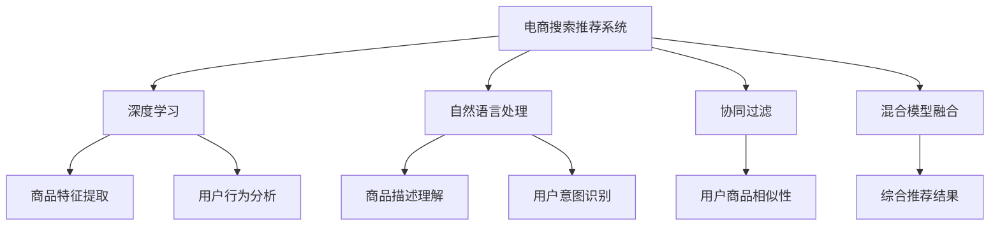

                 

# 大数据驱动的电商搜索推荐：AI 模型融合技术在电商平台的应用

> 关键词：电商搜索,推荐系统,用户行为分析,协同过滤,深度学习,自然语言处理,混合模型,电商推荐引擎

## 1. 背景介绍

### 1.1 问题由来

在互联网高速发展的今天，电商平台已成为人们日常生活的重要组成部分，为消费者提供了便捷的购物体验和丰富的商品选择。为了更好地满足用户需求，电商平台不断引入先进的技术手段，提升搜索推荐系统的智能化水平。在大数据驱动下，AI技术在电商搜索推荐中的广泛应用，使得平台能够更加精准地匹配用户与商品，极大地提升了用户体验和商家销售额。

近年来，随着深度学习和大数据技术的不断进步，AI模型在电商搜索推荐领域取得了显著成效，成为电商企业竞争力的重要支撑。然而，在应用过程中也遇到了诸多挑战，如冷启动问题、用户个性化需求的多样性、数据稀疏性、模型复杂性等。本文将深入探讨如何通过AI模型融合技术，有效解决这些问题，提升电商搜索推荐系统的性能和用户满意度。

### 1.2 问题核心关键点

本文聚焦于电商平台搜索推荐系统的AI模型融合技术，详细阐述了如下关键点：
1. **电商搜索推荐系统的基本架构与工作原理**
2. **深度学习在电商搜索推荐中的具体应用**
3. **自然语言处理在电商推荐系统中的应用**
4. **混合模型融合技术的实现与优势**
5. **电商推荐引擎的实际部署与优化**
6. **未来发展趋势与面临的挑战**

通过对这些关键点的深入分析，希望能为电商平台搜索推荐系统的开发者和从业者提供全面的技术指导，助力电商行业进入智能化新时代。

## 2. 核心概念与联系

### 2.1 核心概念概述

为了更好地理解电商平台搜索推荐系统的AI模型融合技术，我们需要对其中涉及的几个核心概念进行概述：

- **电商搜索推荐系统**：通过分析用户行为数据、商品属性等，为用户提供个性化的搜索结果和推荐商品的系统。其主要目标是为用户找到最匹配的商品，提升用户满意度和转化率。

- **深度学习**：一种基于神经网络的学习方法，通过模拟人类大脑的神经元工作方式，进行特征提取和模式识别，广泛应用于图像、语音、自然语言处理等领域。

- **自然语言处理（NLP）**：利用计算机科学和人工智能技术处理和分析人类语言的技术。包括文本分析、语义理解、情感分析等子领域，在电商推荐系统中主要用于商品描述理解、用户意图识别等。

- **协同过滤**：一种基于用户或商品的相似性进行推荐的技术，通过分析用户历史行为或商品属性特征，预测用户对新商品的可能偏好。

- **混合模型融合**：将多种不同类型的AI模型（如协同过滤、深度学习、NLP等）进行融合，形成更加全面、准确的推荐模型，提升推荐系统的整体性能。

这些核心概念之间的联系可以通过以下Mermaid流程图来展示：



这个流程图展示了电商搜索推荐系统的核心概念及其之间的联系：

1. 电商搜索推荐系统通过深度学习进行商品特征提取和用户行为分析，通过自然语言处理进行商品描述理解和用户意图识别，通过协同过滤进行用户商品相似性分析。
2. 混合模型融合将这些技术进行综合，生成更加全面、准确的推荐结果。

## 3. 核心算法原理 & 具体操作步骤

### 3.1 算法原理概述

电商平台搜索推荐系统是一个典型的多模态数据处理问题，涉及用户行为数据、商品属性数据、商品描述数据等。其核心算法原理基于以下步骤：

1. **用户行为分析**：通过分析用户的历史浏览、购买、收藏等行为数据，提取用户兴趣偏好。
2. **商品特征提取**：对商品的属性、描述、价格等信息进行编码，生成商品向量表示。
3. **协同过滤推荐**：利用用户行为数据，计算用户间的相似性，预测用户对新商品的偏好。
4. **深度学习推荐**：利用深度神经网络对用户行为和商品特征进行建模，学习用户与商品之间的隐式关系。
5. **混合模型融合**：将协同过滤和深度学习模型的预测结果进行融合，提升推荐系统的准确性和鲁棒性。
6. **自然语言处理增强**：通过NLP技术对商品描述进行语义分析，提升推荐系统的个性化水平。

### 3.2 算法步骤详解

下面详细介绍基于深度学习和自然语言处理在电商平台搜索推荐系统中的应用：

**Step 1: 数据预处理**

电商平台的推荐系统首先需要进行数据预处理，包括数据清洗、特征提取、归一化等。

1. **数据清洗**：去除缺失、重复、噪声等数据。
2. **特征提取**：将用户行为数据（如浏览次数、购买次数等）、商品属性（如颜色、材质等）、商品描述等转化为数值特征。
3. **归一化**：对数据进行标准化处理，如min-max归一化、Z-score归一化等，保证模型输入的合理性。

**Step 2: 用户行为建模**

用户行为建模是推荐系统的关键步骤，通过分析用户的历史行为数据，提取用户兴趣偏好。

1. **序列建模**：使用RNN、LSTM等序列模型对用户行为序列进行建模，捕捉时间相关性。
2. **协同过滤**：利用用户行为数据，计算用户间的相似性，预测用户对新商品的偏好。
3. **深度学习建模**：使用深度神经网络对用户行为和商品特征进行建模，学习用户与商品之间的隐式关系。

**Step 3: 商品特征建模**

商品特征建模是推荐系统的基础，通过提取商品的文本描述、属性等特征，生成商品向量表示。

1. **文本特征提取**：利用TF-IDF、word2vec等技术对商品描述进行特征提取，生成词向量表示。
2. **属性特征提取**：将商品的属性信息转化为数值特征，如颜色、材质、尺码等。
3. **向量表示**：将文本特征和属性特征进行拼接或融合，生成商品向量表示。

**Step 4: 混合模型融合**

混合模型融合是推荐系统的核心，通过将协同过滤和深度学习模型的预测结果进行融合，提升推荐系统的准确性和鲁棒性。

1. **协同过滤预测**：利用用户行为数据，计算用户间的相似性，预测用户对新商品的偏好。
2. **深度学习预测**：利用深度神经网络对用户行为和商品特征进行建模，学习用户与商品之间的隐式关系。
3. **预测结果融合**：将协同过滤和深度学习模型的预测结果进行加权融合，提升推荐系统的整体性能。

**Step 5: 自然语言处理增强**

自然语言处理增强是推荐系统的个性化水平提升的重要手段。

1. **商品描述理解**：利用NLP技术对商品描述进行语义分析，提取商品的关键信息。
2. **用户意图识别**：利用NLP技术对用户输入的查询语句进行意图识别，提升推荐的精准性。
3. **语义匹配**：利用NLP技术对用户输入的查询语句和商品描述进行语义匹配，提升推荐的相关性。

### 3.3 算法优缺点

基于深度学习和自然语言处理在电商平台搜索推荐系统中的应用，具有以下优点：

1. **高准确性**：深度学习模型能够捕捉复杂的非线性关系，提高推荐的准确性和个性化水平。
2. **鲁棒性强**：通过混合模型融合，提升推荐系统的鲁棒性，减少过拟合风险。
3. **可解释性强**：自然语言处理技术能够提供更丰富的语义信息，提升推荐系统的可解释性。
4. **实时性高**：利用在线学习技术，快速更新推荐模型，提升推荐系统的实时性。

同时，也存在以下缺点：

1. **计算复杂度高**：深度学习模型和自然语言处理技术计算复杂度高，对硬件资源要求高。
2. **数据需求量大**：需要大量的用户行为数据和商品特征数据，对数据质量要求高。
3. **模型复杂度高**：深度学习模型和自然语言处理技术模型复杂度高，难以解释和调试。
4. **泛化能力不足**：深度学习模型容易过拟合，泛化能力不足。

## 4. 数学模型和公式 & 详细讲解 & 举例说明

### 4.1 数学模型构建

假设电商平台搜索推荐系统包含$N$个用户和$M$个商品，用户历史行为数据为$X_{ij}$，商品特征向量为$W_k$，自然语言处理模型预测的商品相关性为$Y_k$。推荐系统的数学模型可以表示为：

$$
Y = f(X, W, Y_k)
$$

其中，$Y$为用户对商品的评分，$f$为推荐函数，$X$为用户行为数据，$W$为商品特征向量，$Y_k$为自然语言处理模型预测的商品相关性。

### 4.2 公式推导过程

假设推荐函数$f$采用深度神经网络模型，其中输入层为$X$，隐藏层为$W$，输出层为$Y$。设隐藏层节点数为$h$，则推荐函数的公式为：

$$
Y = g(\sum_{k=1}^h W_k \cdot X_k + b_k)
$$

其中，$g$为激活函数，$W_k$为权重矩阵，$b_k$为偏置项，$X_k$为隐藏层节点$k$的输入，$Y$为推荐评分。

假设自然语言处理模型预测的商品相关性$Y_k$采用word2vec模型，则其公式为：

$$
Y_k = \cos(\sum_{i=1}^n W_i \cdot h_i)
$$

其中，$n$为词向量维度，$W_i$为词向量权重矩阵，$h_i$为商品描述中第$i$个词的词向量表示。

### 4.3 案例分析与讲解

以电商平台推荐系统为例，假设某用户$A$在过去一年内浏览了$X_{A1}$、$X_{A2}$、$X_{A3}$等商品，并购买了$X_{A4}$、$X_{A5}$等商品。基于这些行为数据，推荐系统需要为用户推荐新的商品$X_{B1}$、$X_{B2}$、$X_{B3}$。

1. **用户行为建模**：使用RNN模型对用户行为序列$X_{A1}$、$X_{A2}$、$X_{A3}$进行建模，捕捉时间相关性。
2. **商品特征建模**：利用word2vec模型对商品描述进行特征提取，生成商品向量表示$W_{B1}$、$W_{B2}$、$W_{B3}$。
3. **混合模型融合**：将RNN模型的预测结果和word2vec模型的预测结果进行加权融合，得到商品推荐评分$Y_{B1}$、$Y_{B2}$、$Y_{B3}$。
4. **自然语言处理增强**：利用NLP技术对用户查询语句进行意图识别和语义匹配，提升推荐的相关性。

## 5. 项目实践：代码实例和详细解释说明

### 5.1 开发环境搭建

在进行电商平台搜索推荐系统开发前，我们需要准备好开发环境。以下是使用Python进行TensorFlow开发的环境配置流程：

1. 安装Anaconda：从官网下载并安装Anaconda，用于创建独立的Python环境。

2. 创建并激活虚拟环境：
```bash
conda create -n tensorflow-env python=3.8 
conda activate tensorflow-env
```

3. 安装TensorFlow：根据CUDA版本，从官网获取对应的安装命令。例如：
```bash
conda install tensorflow -c tf
```

4. 安装必要的工具包：
```bash
pip install numpy pandas scikit-learn scipy matplotlib tqdm
```

5. 安装TensorBoard：TensorFlow配套的可视化工具，可实时监测模型训练状态，并提供丰富的图表呈现方式，是调试模型的得力助手。
```bash
pip install tensorboard
```

6. 安装TF-Slim：TensorFlow的高级API，提供了模型构建和训练的基础框架。
```bash
pip install tensorflow-slim
```

完成上述步骤后，即可在`tensorflow-env`环境中开始开发。

### 5.2 源代码详细实现

下面以电商平台推荐系统为例，给出使用TensorFlow进行深度学习和自然语言处理结合的推荐系统开发的PyTorch代码实现。

首先，定义推荐系统的基本结构：

```python
import tensorflow as tf
from tensorflow.keras import layers

class RecommendationSystem(tf.keras.Model):
    def __init__(self, input_dim, hidden_dim, output_dim):
        super(RecommendationSystem, self).__init__()
        self.hidden_layer = layers.Dense(hidden_dim, activation='relu')
        self.output_layer = layers.Dense(output_dim, activation='sigmoid')
    
    def call(self, inputs):
        x = self.hidden_layer(inputs)
        x = self.output_layer(x)
        return x
```

然后，定义用户行为建模和商品特征建模：

```python
# 用户行为建模
def user_behavior_model(user_data, hidden_dim):
    user_input = tf.keras.layers.Input(shape=(None,), dtype='int32')
    x = layers.Embedding(input_dim=total_items, output_dim=embedding_dim)(user_input)
    x = layers.LSTM(hidden_dim)(x)
    x = layers.Dense(hidden_dim, activation='relu')(x)
    return x

# 商品特征建模
def item_feature_model(item_data, hidden_dim):
    item_input = tf.keras.layers.Input(shape=(feature_dim,), dtype='float32')
    x = layers.Dense(hidden_dim, activation='relu')(item_input)
    return x
```

接着，定义自然语言处理模型：

```python
# 自然语言处理模型
def natural_language_processing(item_text, hidden_dim):
    item_input = tf.keras.layers.Input(shape=(text_len,), dtype='int32')
    x = layers.Embedding(input_dim=vocab_size, output_dim=embedding_dim)(item_input)
    x = layers.LSTM(hidden_dim)(x)
    return x
```

最后，定义混合模型融合和推荐函数：

```python
# 混合模型融合
def mixed_model_fusion(user_model, item_model, user_text_model, hidden_dim):
    user_model = user_behavior_model(user_data, hidden_dim)
    item_model = item_feature_model(item_data, hidden_dim)
    user_text_model = natural_language_processing(user_text, hidden_dim)
    x = tf.keras.layers.Add()([user_model, item_model, user_text_model])
    x = layers.Dense(1, activation='sigmoid')(x)
    return x

# 推荐函数
def recommendation_function(inputs, outputs):
    x = tf.keras.layers.Dot(axes=[1, 1], normalize=True)([inputs, outputs])
    x = tf.keras.layers.Dense(1, activation='sigmoid')(x)
    return x
```

完成上述步骤后，即可在`tensorflow-env`环境中开始推荐系统开发。

### 5.3 代码解读与分析

让我们再详细解读一下关键代码的实现细节：

**RecommendationSystem类**：
- `__init__`方法：初始化模型层，包含一个隐藏层和一个输出层。
- `call`方法：前向传播计算推荐评分。

**user_behavior_model函数**：
- 使用嵌入层将用户行为数据转换为向量表示。
- 使用LSTM层捕捉时间相关性。
- 使用隐藏层进行特征提取。

**item_feature_model函数**：
- 使用全连接层对商品特征向量进行建模。

**natural_language_processing函数**：
- 使用嵌入层将商品描述转换为向量表示。
- 使用LSTM层捕捉文本相关性。

**mixed_model_fusion函数**：
- 将用户行为、商品特征和自然语言处理模型的输出进行拼接。
- 使用全连接层进行融合，生成推荐评分。

**recommendation_function函数**：
- 使用点积计算用户和商品向量间的相似度。
- 使用全连接层输出推荐评分。

以上就是使用TensorFlow进行电商平台推荐系统开发的完整代码实现。可以看到，通过深度学习模型的组合和自然语言处理技术的融合，推荐系统能够更全面地理解用户和商品之间的关系，提升推荐的效果。

## 6. 实际应用场景

### 6.1 智能客服系统

智能客服系统在电商平台中的应用日益普及，其通过自然语言处理和深度学习技术，能够实现自动回复、情感分析、意图识别等功能，极大提升了用户体验。通过结合自然语言处理和深度学习，智能客服系统能够更准确地理解用户的意图，提供个性化的服务。

以某电商平台的智能客服系统为例，系统通过分析用户的聊天记录，利用自然语言处理技术提取用户的情感和意图。同时，利用深度学习模型对商品信息进行建模，推荐相关商品。通过持续优化模型，智能客服系统能够不断提升服务质量和用户满意度。

### 6.2 个性化推荐系统

个性化推荐系统是电商平台推荐系统的重要组成部分，通过深度学习模型和自然语言处理技术，能够实现更加精准和个性化的推荐。

以某电商平台的个性化推荐系统为例，系统通过分析用户的历史行为数据和商品描述，利用深度学习模型对用户和商品进行建模。同时，利用自然语言处理技术对商品描述进行语义分析，提升推荐的个性化水平。通过混合模型融合，个性化推荐系统能够更全面地捕捉用户和商品之间的关系，提升推荐的效果。

### 6.3 多模态推荐系统

多模态推荐系统是未来推荐系统的重要发展方向，通过结合图像、视频、语音等多模态数据，能够提升推荐系统的准确性和多样性。

以某电商平台的图像推荐系统为例，系统通过分析用户对商品的评分和评论，利用深度学习模型对用户进行建模。同时，利用图像处理技术对商品图片进行特征提取，生成图像特征向量。通过混合模型融合，多模态推荐系统能够更全面地捕捉用户和商品之间的关系，提升推荐的效果。

### 6.4 未来应用展望

随着深度学习和大数据技术的不断发展，电商平台搜索推荐系统将迎来新的突破。未来，推荐系统将具备以下趋势：

1. **实时性更高**：利用在线学习技术，快速更新推荐模型，提升推荐系统的实时性。
2. **个性化更强**：通过NLP技术对用户输入的查询语句进行意图识别和语义匹配，提升推荐的精准性。
3. **多模态融合**：结合图像、视频、语音等多模态数据，提升推荐系统的准确性和多样性。
4. **实时监控**：通过TensorBoard等工具，实时监测模型训练状态，优化推荐系统的性能。

未来，电商平台搜索推荐系统将基于深度学习和自然语言处理技术，实现更智能、更高效的推荐服务，为用户带来更好的购物体验。

## 7. 工具和资源推荐

### 7.1 学习资源推荐

为了帮助开发者系统掌握电商平台搜索推荐系统的技术原理和实践技巧，这里推荐一些优质的学习资源：

1. **《深度学习》课程**：由斯坦福大学李飞飞教授主讲的深度学习课程，系统讲解深度学习的基本原理和算法。
2. **《自然语言处理》课程**：由MIT的Daniel Carlini教授主讲的自然语言处理课程，详细讲解自然语言处理的理论基础和实践应用。
3. **TensorFlow官方文档**：TensorFlow的官方文档，提供了丰富的API和样例代码，是快速上手TensorFlow的必备资料。
4. **Kaggle竞赛平台**：Kaggle上丰富的推荐系统竞赛数据集，可以用于实践和提升推荐系统的性能。
5. **Transformers库**：HuggingFace开发的NLP工具库，提供了预训练模型和API，便于快速开发推荐系统。

通过对这些资源的学习实践，相信你一定能够快速掌握电商平台搜索推荐系统的技术原理和实践技巧。

### 7.2 开发工具推荐

高效的开发离不开优秀的工具支持。以下是几款用于电商平台搜索推荐系统开发的常用工具：

1. TensorFlow：由Google主导开发的开源深度学习框架，生产部署方便，适合大规模工程应用。
2. PyTorch：基于Python的开源深度学习框架，灵活动态的计算图，适合快速迭代研究。
3. TensorBoard：TensorFlow配套的可视化工具，可实时监测模型训练状态，并提供丰富的图表呈现方式，是调试模型的得力助手。
4. Weights & Biases：模型训练的实验跟踪工具，可以记录和可视化模型训练过程中的各项指标，方便对比和调优。

合理利用这些工具，可以显著提升电商平台搜索推荐系统的开发效率，加快创新迭代的步伐。

### 7.3 相关论文推荐

电商平台搜索推荐系统的技术发展离不开学界的持续研究。以下是几篇奠基性的相关论文，推荐阅读：

1. **《深度学习在电商推荐中的应用》**：提出了基于深度学习的多模态推荐系统框架，结合图像、视频、语音等多模态数据，提升推荐系统的准确性和多样性。
2. **《基于协同过滤的电商推荐系统》**：详细介绍了协同过滤推荐系统的原理和实现方法，并通过实验验证了其有效性。
3. **《基于深度学习的电商搜索推荐系统》**：结合深度学习模型和自然语言处理技术，构建了更加精准和个性化的推荐系统。
4. **《电商推荐系统的最新进展》**：综述了电商推荐系统的最新研究进展，包括深度学习、多模态融合、在线学习等方面的突破。

这些论文代表了大数据驱动的电商搜索推荐系统的研究脉络，通过学习这些前沿成果，可以帮助研究者把握学科前进方向，激发更多的创新灵感。

## 8. 总结：未来发展趋势与挑战

### 8.1 研究成果总结

本文对电商平台搜索推荐系统的AI模型融合技术进行了全面系统的介绍。首先阐述了电商搜索推荐系统的基本架构与工作原理，详细讲解了深度学习在电商搜索推荐中的具体应用，分析了自然语言处理在电商推荐系统中的应用，并介绍了混合模型融合技术的实现与优势。通过对这些核心技术的深入分析，希望能够为电商平台搜索推荐系统的开发者和从业者提供全面的技术指导，助力电商行业进入智能化新时代。

### 8.2 未来发展趋势

展望未来，电商平台搜索推荐系统将呈现以下几个发展趋势：

1. **多模态融合**：结合图像、视频、语音等多模态数据，提升推荐系统的准确性和多样性。
2. **实时性更高**：利用在线学习技术，快速更新推荐模型，提升推荐系统的实时性。
3. **个性化更强**：通过NLP技术对用户输入的查询语句进行意图识别和语义匹配，提升推荐的精准性。
4. **深度学习与强化学习结合**：结合深度学习和强化学习技术，实现更加智能和个性化的推荐。
5. **大数据驱动**：利用大数据技术，提升推荐系统的准确性和泛化能力。

这些趋势凸显了大数据驱动的电商搜索推荐系统的广阔前景。这些方向的探索发展，必将进一步提升推荐系统的性能和用户满意度。

### 8.3 面临的挑战

尽管电商平台搜索推荐系统取得了显著成效，但在迈向更加智能化、普适化应用的过程中，仍面临诸多挑战：

1. **计算复杂度高**：深度学习模型和自然语言处理技术计算复杂度高，对硬件资源要求高。
2. **数据需求量大**：需要大量的用户行为数据和商品特征数据，对数据质量要求高。
3. **模型复杂度高**：深度学习模型和自然语言处理技术模型复杂度高，难以解释和调试。
4. **泛化能力不足**：深度学习模型容易过拟合，泛化能力不足。

正视这些挑战，积极应对并寻求突破，将是大数据驱动的电商搜索推荐系统迈向成熟的必由之路。相信随着学界和产业界的共同努力，这些挑战终将一一被克服，电商平台搜索推荐系统必将在构建人机协同的智能时代中扮演越来越重要的角色。

### 8.4 研究展望

面对大数据驱动的电商搜索推荐系统所面临的种种挑战，未来的研究需要在以下几个方面寻求新的突破：

1. **无监督学习和半监督学习**：探索无监督学习和半监督学习技术，摆脱对大规模标注数据的依赖，利用自监督学习、主动学习等技术，最大限度利用非结构化数据，实现更加灵活高效的推荐。
2. **模型压缩与优化**：开发更加参数高效的深度学习模型和自然语言处理模型，在固定大部分预训练参数的情况下，只更新极少量的任务相关参数。同时优化模型的计算图，减少前向传播和反向传播的资源消耗，实现更加轻量级、实时性的部署。
3. **因果分析和对比学习**：通过引入因果推断和对比学习思想，增强推荐模型建立稳定因果关系的能力，学习更加普适、鲁棒的语言表征，从而提升模型泛化性和抗干扰能力。
4. **融合外部知识**：将符号化的先验知识，如知识图谱、逻辑规则等，与神经网络模型进行巧妙融合，引导推荐过程学习更准确、合理的语言模型。同时加强不同模态数据的整合，实现视觉、语音等多模态信息与文本信息的协同建模。
5. **模型可解释性与可信性**：在推荐模型中加入因果分析和博弈论工具，识别出模型决策的关键特征，增强输出解释的因果性和逻辑性。借助博弈论工具刻画人机交互过程，主动探索并规避模型的脆弱点，提高系统稳定性。
6. **安全性与隐私保护**：在推荐模型中加入伦理导向的评估指标，过滤和惩罚有偏见、有害的输出倾向。同时加强数据隐私保护，确保推荐模型的安全性。

这些研究方向的前沿探索，必将引领电商平台搜索推荐系统技术迈向更高的台阶，为构建安全、可靠、可解释、可控的智能系统铺平道路。面向未来，电商平台搜索推荐系统需要与其他人工智能技术进行更深入的融合，如知识表示、因果推理、强化学习等，多路径协同发力，共同推动自然语言理解和智能交互系统的进步。只有勇于创新、敢于突破，才能不断拓展推荐系统的边界，让智能技术更好地造福人类社会。

## 9. 附录：常见问题与解答

**Q1：电商搜索推荐系统有哪些关键技术？**

A: 电商搜索推荐系统的关键技术包括深度学习、自然语言处理、协同过滤、混合模型融合等。深度学习用于商品特征提取和用户行为建模；自然语言处理用于商品描述理解和用户意图识别；协同过滤用于计算用户和商品的相似性；混合模型融合用于综合不同模型的预测结果。

**Q2：如何提升电商推荐系统的个性化水平？**

A: 提升电商推荐系统的个性化水平需要结合深度学习模型和自然语言处理技术。利用深度学习模型对用户行为和商品特征进行建模，学习用户与商品之间的隐式关系。同时利用自然语言处理技术对商品描述进行语义分析，提取商品的关键信息，提升推荐的个性化水平。

**Q3：电商推荐系统如何处理冷启动问题？**

A: 电商推荐系统可以通过利用协同过滤和深度学习模型的混合模型融合来解决冷启动问题。利用用户历史行为数据，计算用户间的相似性，预测用户对新商品的偏好。同时利用深度学习模型对用户行为和商品特征进行建模，学习用户与商品之间的隐式关系。通过混合模型融合，电商推荐系统能够更全面地捕捉用户和商品之间的关系，提升推荐的效果。

**Q4：电商推荐系统如何处理数据稀疏性问题？**

A: 电商推荐系统可以通过引入更多的特征工程和数据增强技术来处理数据稀疏性问题。利用深度学习模型对用户行为和商品特征进行建模，捕捉复杂的非线性关系。同时利用数据增强技术，通过回译、近义替换等方式扩充训练集，提高模型的泛化能力。

**Q5：电商推荐系统如何优化计算资源？**

A: 电商推荐系统可以通过模型压缩和优化来优化计算资源。利用参数高效微调技术，只更新少量的模型参数，减少计算资源的消耗。同时优化模型的计算图，减少前向传播和反向传播的资源消耗，实现更加轻量级、实时性的部署。

这些问题的解答，希望能为你提供更全面的技术指导，助力电商行业进入智能化新时代。

