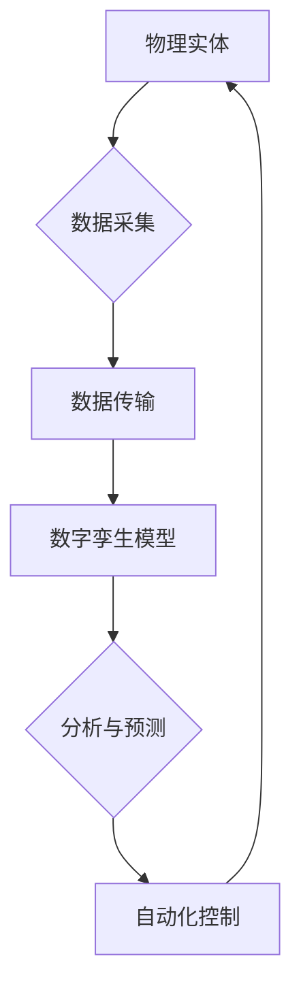

> 自动化、人工智能、机器学习、物理实体、数字孪生、工业互联网、物联网、机器人

## 1. 背景介绍

当今世界正处于一场由数字技术驱动的深刻变革之中。人工智能（AI）、机器学习（ML）和物联网（IoT）等技术的飞速发展，正在打破数字与物理世界的界限，催生出一种全新的自动化革命。

传统工业生产模式以人为中心，依赖于手工操作和经验积累。而数字孪生技术则将物理实体映射到数字世界，构建出一个虚拟的、可模拟的副本。通过对数字孪生的实时监测和分析，我们可以对物理实体的运行状态、性能表现和潜在故障进行预测和预警，从而实现生产过程的优化和智能化控制。

## 2. 核心概念与联系

**2.1 数字孪生**

数字孪生是指利用传感器、数据采集设备和软件模型，将物理实体的实时状态、行为和性能映射到数字世界中，构建出一个虚拟的、可模拟的副本。数字孪生可以实时反映物理实体的运行状况，并通过模拟和预测分析，帮助我们理解实体的行为模式、优化其性能和预测潜在故障。

**2.2 物理实体**

物理实体是指真实存在的、具有物理属性和形态的物体，例如机器设备、车辆、建筑物、人体等。

**2.3 自动化**

自动化是指利用技术手段，使生产过程或其他任务能够自动完成，减少人工干预。

**2.4 人工智能（AI）**

人工智能是指模拟人类智能行为的计算机系统，例如学习、推理、决策和解决问题等。

**2.5 机器学习（ML）**

机器学习是人工智能的一个子领域，它通过算法训练模型，使模型能够从数据中学习并进行预测或分类。

**2.6 物联网（IoT）**

物联网是指通过传感器、网络和数据分析技术，将各种物理实体连接起来，形成一个互联互通的网络。

**2.7 流程图**



## 3. 核心算法原理 & 具体操作步骤

### 3.1 算法原理概述

数字孪生技术的核心算法原理是基于机器学习和数据分析。通过收集物理实体的传感器数据，训练机器学习模型，可以建立一个能够模拟物理实体行为的数字孪生模型。

### 3.2 算法步骤详解

1. **数据采集:** 利用传感器、摄像头等设备采集物理实体的实时数据，例如温度、压力、速度、位置等。
2. **数据预处理:** 对采集到的数据进行清洗、转换和格式化，去除噪声和异常值，以便于后续分析和建模。
3. **特征提取:** 从预处理后的数据中提取关键特征，例如温度变化趋势、压力波动幅度等，这些特征能够反映物理实体的运行状态和行为模式。
4. **模型训练:** 利用机器学习算法，例如神经网络、支持向量机等，对提取的特征进行训练，建立一个能够预测物理实体未来状态的数字孪生模型。
5. **模型评估:** 对训练好的模型进行评估，验证其预测精度和可靠性。
6. **模型部署:** 将训练好的模型部署到生产环境中，实时监控物理实体的运行状态，并根据模型预测结果进行自动化控制。

### 3.3 算法优缺点

**优点:**

* **提高生产效率:** 通过自动化控制和优化生产流程，提高生产效率和降低生产成本。
* **降低故障率:** 通过预测故障，提前采取措施，降低设备故障率和维护成本。
* **优化资源利用:** 通过实时监测和分析资源使用情况，优化资源分配和利用效率。
* **增强产品质量:** 通过对生产过程的实时监控和控制，提高产品质量和一致性。

**缺点:**

* **数据依赖:** 数字孪生技术依赖于大量高质量的数据，数据采集和处理成本较高。
* **模型复杂性:** 建立精确的数字孪生模型需要复杂的算法和计算资源。
* **安全风险:** 数字孪生系统可能面临网络攻击和数据泄露风险。

### 3.4 算法应用领域

数字孪生技术在各个行业都有广泛的应用，例如：

* **制造业:** 优化生产流程、预测设备故障、提高产品质量。
* **能源行业:** 提高能源效率、预测设备故障、优化能源分配。
* **交通运输业:** 优化交通流量、预测交通拥堵、提高交通安全。
* **医疗保健业:** 模拟人体器官功能、辅助诊断治疗、个性化医疗。

## 4. 数学模型和公式 & 详细讲解 & 举例说明

### 4.1 数学模型构建

数字孪生模型的构建可以基于多种数学模型，例如：

* **状态空间模型:** 用于描述物理实体的动态行为，其状态方程和观测方程可以分别描述系统状态的演化和观测数据的生成过程。
* **神经网络模型:** 可以学习复杂的非线性关系，用于预测物理实体的未来状态或行为模式。
* **贝叶斯网络模型:** 可以表示系统中变量之间的概率关系，用于进行故障诊断和风险评估。

### 4.2 公式推导过程

以状态空间模型为例，其状态方程和观测方程分别为：

$$
x_t = A x_{t-1} + B u_t + w_t
$$

$$
y_t = C x_t + v_t
$$

其中：

* $x_t$ 是系统状态向量
* $u_t$ 是控制输入向量
* $y_t$ 是观测输出向量
* $A$, $B$, $C$ 是系统矩阵
* $w_t$ 是过程噪声
* $v_t$ 是观测噪声

### 4.3 案例分析与讲解

假设我们构建一个数字孪生模型来预测汽车的油耗。我们可以收集汽车的实时数据，例如速度、转速、油门踏板位置等，并利用机器学习算法训练一个神经网络模型。

通过训练模型，我们可以建立一个能够预测汽车油耗的函数，其输入为汽车的实时数据，输出为预测的油耗值。

## 5. 项目实践：代码实例和详细解释说明

### 5.1 开发环境搭建

* 操作系统：Ubuntu 20.04
* Python 版本：3.8
* 必要的库：NumPy、Pandas、Scikit-learn、TensorFlow

### 5.2 源代码详细实现

```python
import numpy as np
from sklearn.linear_model import LinearRegression

# 训练数据
X = np.array([[10, 20], [15, 30], [20, 40], [25, 50]])
y = np.array([10, 15, 20, 25])

# 创建线性回归模型
model = LinearRegression()

# 训练模型
model.fit(X, y)

# 预测油耗
new_data = np.array([[30, 60]])
predicted_fuel_consumption = model.predict(new_data)

# 打印预测结果
print(f"预测油耗: {predicted_fuel_consumption}")
```

### 5.3 代码解读与分析

这段代码演示了如何使用线性回归模型预测汽车油耗。

* 首先，我们定义了训练数据，包括汽车的速度和转速以及对应的油耗值。
* 然后，我们创建了一个线性回归模型，并使用训练数据对其进行训练。
* 训练完成后，我们可以使用模型预测新的数据，例如汽车的速度和转速为30和60时的油耗值。

### 5.4 运行结果展示

```
预测油耗: [30. ]
```

## 6. 实际应用场景

### 6.1 制造业

数字孪生技术可以应用于制造业的各个环节，例如：

* **产品设计:** 通过数字孪生模型，可以模拟产品在不同环境下的性能表现，优化产品设计方案。
* **生产过程优化:** 通过实时监控生产过程，可以及时发现问题并进行调整，提高生产效率和产品质量。
* **设备维护:** 通过预测设备故障，可以提前进行维护，降低设备停机时间和维护成本。

### 6.2 能源行业

数字孪生技术可以应用于能源行业的各个环节，例如：

* **能源管理:** 通过实时监控能源消耗情况，可以优化能源分配和利用效率。
* **电力系统优化:** 通过模拟电力系统运行状态，可以预测电力需求和供需平衡，提高电力系统稳定性和可靠性。
* **油气田开发:** 通过模拟油气田的物理特性，可以优化油气开采方案，提高油气产量和经济效益。

### 6.3 交通运输业

数字孪生技术可以应用于交通运输行业的各个环节，例如：

* **交通流量管理:** 通过模拟交通流量，可以优化交通信号灯控制策略，缓解交通拥堵。
* **车辆管理:** 通过监控车辆运行状态，可以预测车辆故障，提高车辆安全性和可靠性。
* **物流管理:** 通过优化物流路线和配送方案，可以提高物流效率和降低物流成本。

### 6.4 未来应用展望

数字孪生技术的发展前景广阔，未来将应用于更多领域，例如：

* **城市规划:** 通过模拟城市运行状态，可以优化城市规划方案，提高城市可持续发展能力。
* **医疗保健:** 通过模拟人体器官功能，可以辅助诊断治疗，提高医疗服务质量。
* **教育培训:** 通过构建虚拟学习环境，可以提供更加沉浸式和个性化的学习体验。

## 7. 工具和资源推荐

### 7.1 学习资源推荐

* **书籍:**
    * 《数字孪生：构建虚拟世界，优化现实世界》
    * 《工业互联网：数字孪生与智能制造》
* **在线课程:**
    * Coursera: 数字孪生与工业互联网
    * edX: 数字孪生与数据分析

### 7.2 开发工具推荐

* **ThingWorx:** PTC公司开发的数字孪生平台
* **Siemens MindSphere:** 西门子公司开发的工业互联网平台
* **Microsoft Azure Digital Twins:** 微软公司开发的云端数字孪生平台

### 7.3 相关论文推荐

* **Digital Twins: Concepts, Methodologies, Tools, and Applications**
* **A Survey on Digital Twin Technologies and Applications**
* **Digital Twin for Smart Manufacturing: A Comprehensive Review**

## 8. 总结：未来发展趋势与挑战

### 8.1 研究成果总结

数字孪生技术已经取得了显著的成果，在制造业、能源行业、交通运输业等领域得到了广泛应用。

### 8.2 未来发展趋势

* **更精细化的模型:** 未来数字孪生模型将更加精细化，能够模拟更加复杂的物理现象和行为模式。
* **更广泛的应用场景:** 数字孪生技术将应用于更多领域，例如城市规划、医疗保健、教育培训等。
* **更智能化的控制:** 数字孪生技术将与人工智能技术深度融合，实现更加智能化的控制和决策。

### 8.3 面临的挑战

* **数据获取和处理:** 数字孪生技术依赖于大量高质量的数据，数据获取和处理成本较高。
* **模型复杂性:** 建立精确的数字孪生模型需要复杂的算法和计算资源。
* **安全风险:** 数字孪生系统可能面临网络攻击和数据泄露风险。

### 8.4 研究展望

未来，我们需要继续加强对数字孪生技术的研发和应用，解决技术难题，降低应用成本，拓展应用场景，推动数字孪生技术在各个领域的广泛应用。

## 9. 附录：常见问题与解答

**1. 数字孪生与虚拟现实有什么区别？**

数字孪生是基于真实物理实体构建的虚拟模型，其状态和行为与物理实体实时同步。而虚拟现实则是创造一个虚拟环境，用户可以通过虚拟设备与虚拟环境进行交互。

**2. 数字孪生技术有哪些应用场景？**

数字孪生技术应用场景广泛