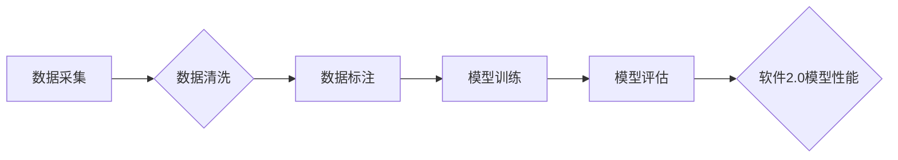

> 数据质量、软件2.0、模型性能、机器学习、深度学习、数据清洗、数据标注、算法优化

## 1. 背景介绍

近年来，人工智能（AI）技术蓬勃发展，软件行业也迎来了“软件2.0”时代。软件2.0以数据为核心，利用机器学习（ML）和深度学习（DL）等算法，赋予软件智能化、自动化和个性化的能力。然而，随着软件2.0的快速发展，一个不容忽视的问题逐渐浮出水面：数据质量下降，导致软件2.0模型性能打折。

数据是软件2.0的基石，模型的性能直接取决于数据的质量。当数据质量下降时，模型训练效果会受到严重影响，最终导致软件2.0的性能下降，甚至无法正常运行。

## 2. 核心概念与联系

**2.1 数据质量**

数据质量是指数据在准确性、完整性、一致性、时效性、可用性等方面满足特定应用需求的程度。

**2.2 软件2.0**

软件2.0是指以数据为核心，利用人工智能技术，赋予软件智能化、自动化和个性化的能力的新一代软件。

**2.3 模型性能**

模型性能是指模型在预测、分类、识别等任务上的准确率、召回率、F1-score等指标。

**2.4 数据质量与软件2.0模型性能的关系**

数据质量直接影响软件2.0模型的性能。数据质量下降会导致模型训练效果差，进而导致模型性能下降。

**2.5 数据质量下降的原因**

数据质量下降的原因有很多，包括：

* 数据采集不规范
* 数据处理不当
* 数据存储不安全
* 数据更新不及时
* 人为错误

**2.6 数据质量与软件2.0模型性能的联系流程图**



## 3. 核心算法原理 & 具体操作步骤

**3.1 算法原理概述**

为了解决数据质量下降导致的软件2.0模型性能打折问题，需要采用一些算法和技术来提高数据质量，例如：

* 数据清洗：去除数据中的噪声、缺失值和重复值。
* 数据标注：为数据添加标签，以便模型进行训练。
* 算法优化：调整模型参数，提高模型性能。

**3.2 算法步骤详解**

**3.2.1 数据清洗**

1. 识别数据中的异常值：可以使用统计方法或机器学习算法识别数据中的异常值。
2. 处理缺失值：可以使用平均值、中位数或其他方法填充缺失值。
3. 去除重复值：可以使用哈希表或其他方法去除重复值。

**3.2.2 数据标注**

1. 选择合适的标注方式：可以使用监督学习、无监督学习或半监督学习等方式进行数据标注。
2. 构建标注数据集：根据应用场景，构建包含标注数据的训练集、验证集和测试集。
3. 评估标注质量：可以使用精度、召回率、F1-score等指标评估标注质量。

**3.2.3 算法优化**

1. 选择合适的优化算法：可以使用梯度下降、随机梯度下降、Adam等优化算法。
2. 调整模型参数：可以使用交叉验证等方法调整模型参数，提高模型性能。
3. 使用迁移学习：可以使用预训练模型进行迁移学习，提高模型训练效率。

**3.3 算法优缺点**

**3.3.1 数据清洗**

* 优点：可以提高数据质量，减少模型训练误差。
* 缺点：需要耗费时间和人力，可能导致数据丢失。

**3.3.2 数据标注**

* 优点：可以为模型提供训练数据，提高模型性能。
* 缺点：需要耗费时间和人力，标注质量会影响模型性能。

**3.3.3 算法优化**

* 优点：可以提高模型性能，减少训练时间。
* 缺点：需要专业知识，可能需要多次尝试才能找到最佳参数。

**3.4 算法应用领域**

* 数据清洗：金融、医疗、电商等领域的数据预处理。
* 数据标注：图像识别、自然语言处理、语音识别等领域的数据标注。
* 算法优化：机器学习、深度学习等领域模型训练和优化。

## 4. 数学模型和公式 & 详细讲解 & 举例说明

**4.1 数学模型构建**

数据质量评估可以使用多种数学模型，例如：

* **信息熵**: 用于衡量数据的混乱程度，数据熵越高，数据质量越低。
* **互信息**: 用于衡量两个变量之间的相关性，互信息越大，数据之间的相关性越强，数据质量越高。
* **覆盖率**: 用于衡量数据覆盖范围，覆盖率越高，数据质量越高。

**4.2 公式推导过程**

**4.2.1 信息熵公式**

$$H(X) = -\sum_{i=1}^{n} p(x_i) \log_2 p(x_i)$$

其中：

* $H(X)$ 是随机变量 $X$ 的信息熵。
* $p(x_i)$ 是随机变量 $X$ 取值为 $x_i$ 的概率。

**4.2.2 互信息公式**

$$I(X;Y) = \sum_{x \in X} \sum_{y \in Y} p(x,y) \log_2 \frac{p(x,y)}{p(x)p(y)}$$

其中：

* $I(X;Y)$ 是随机变量 $X$ 和 $Y$ 之间的互信息。
* $p(x,y)$ 是随机变量 $X$ 取值为 $x$，随机变量 $Y$ 取值为 $y$ 的联合概率。
* $p(x)$ 是随机变量 $X$ 取值为 $x$ 的概率。
* $p(y)$ 是随机变量 $Y$ 取值为 $y$ 的概率。

**4.3 案例分析与讲解**

假设我们有一个包含客户信息的数据库，其中包含客户姓名、年龄、性别、收入等信息。

* **信息熵**: 可以使用信息熵来衡量客户信息的混乱程度。如果客户信息的熵值较高，则说明客户信息较为混乱，数据质量较低。
* **互信息**: 可以使用互信息来衡量客户姓名、年龄、性别、收入等信息之间的相关性。如果客户信息之间的互信息值较高，则说明客户信息之间相关性强，数据质量较高。

## 5. 项目实践：代码实例和详细解释说明

**5.1 开发环境搭建**

* 操作系统：Windows/Linux/macOS
* Python 版本：3.6+
* 必要的库：pandas, numpy, scikit-learn

**5.2 源代码详细实现**

```python
import pandas as pd
from sklearn.impute import SimpleImputer
from sklearn.preprocessing import StandardScaler

# 数据加载
data = pd.read_csv('customer_data.csv')

# 数据清洗
# 处理缺失值
imputer = SimpleImputer(strategy='mean')
data[['age', 'income']] = imputer.fit_transform(data[['age', 'income']])

# 数据标准化
scaler = StandardScaler()
data[['age', 'income']] = scaler.fit_transform(data[['age', 'income']])

# 数据保存
data.to_csv('cleaned_data.csv', index=False)
```

**5.3 代码解读与分析**

* 数据加载：使用 pandas 库读取 CSV 文件中的数据。
* 数据清洗：
    * 处理缺失值：使用 SimpleImputer 类填充缺失值，采用均值填充策略。
    * 数据标准化：使用 StandardScaler 类对数据进行标准化处理，将数据分布调整到均值为 0，标准差为 1。
* 数据保存：使用 pandas 库将清洗后的数据保存到新的 CSV 文件中。

**5.4 运行结果展示**

运行上述代码后，将生成一个名为 `cleaned_data.csv` 的文件，其中包含清洗后的客户数据。

## 6. 实际应用场景

数据质量下降问题在各个行业都存在，例如：

* **金融行业**: 贷款风险评估、欺诈检测等需要依赖高质量的数据。
* **医疗行业**: 疾病诊断、药物研发等需要依赖高质量的医疗数据。
* **电商行业**: 商品推荐、用户画像等需要依赖高质量的电商数据。

## 7. 工具和资源推荐

**7.1 学习资源推荐**

* 书籍：
    * 《数据质量管理》
    * 《数据清洗与预处理》
* 在线课程：
    * Coursera 上的《数据质量管理》课程
    * edX 上的《数据清洗与预处理》课程

**7.2 开发工具推荐**

* pandas：Python 数据分析和处理库
* scikit-learn：Python 机器学习库
* Apache Spark：分布式数据处理框架

**7.3 相关论文推荐**

* 《数据质量评估方法综述》
* 《数据清洗技术研究》

## 8. 总结：未来发展趋势与挑战

**8.1 研究成果总结**

近年来，数据质量评估和数据清洗技术取得了显著进展，涌现出许多新的算法和方法。

**8.2 未来发展趋势**

* 数据质量评估将更加智能化和自动化。
* 数据清洗技术将更加高效和精准。
* 数据质量管理将更加注重数据治理和数据安全。

**8.3 面临的挑战**

* 数据质量评估和数据清洗技术仍然面临着许多挑战，例如如何处理复杂的数据结构、如何评估数据质量的整体性等。
* 数据质量管理需要跨部门协作，需要建立完善的数据治理体系。

**8.4 研究展望**

未来，数据质量评估和数据清洗技术将继续发展，为软件2.0的健康发展提供保障。

## 9. 附录：常见问题与解答

**9.1 如何评估数据质量？**

数据质量可以从多个方面进行评估，例如准确性、完整性、一致性、时效性、可用性等。可以使用多种数学模型和指标来评估数据质量。

**9.2 如何处理数据中的缺失值？**

处理数据中的缺失值可以使用多种方法，例如平均值填充、中位数填充、线性插值等。

**9.3 如何去除数据中的重复值？**

去除数据中的重复值可以使用哈希表或其他方法。

**9.4 如何提高数据质量？**

提高数据质量需要从数据采集、数据处理、数据存储等各个环节进行控制，并建立完善的数据质量管理体系。


作者：禅与计算机程序设计艺术 / Zen and the Art of Computer Programming 
<end_of_turn>