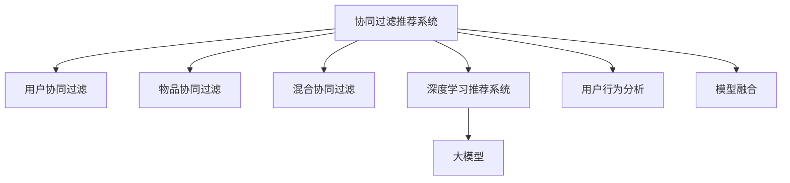

                 

# 大模型在协同过滤推荐中的应用

> 关键词：协同过滤推荐, 大模型, 深度学习, 推荐系统, 推荐算法, 模型融合, 数据处理, 个性化推荐, 用户行为分析

## 1. 背景介绍

### 1.1 问题由来
推荐系统是现代互联网应用的基石之一，帮助用户在海量信息中发现兴趣相关的商品或内容，极大提升了用户体验和平台价值。协同过滤算法作为一种基于用户行为和物品交互数据的推荐方式，已经成为推荐系统的主要技术之一。然而，协同过滤算法在数据稀疏、冷启动、多样性等方面存在固有的局限性。

为了进一步提升推荐系统的性能和用户体验，近年来大模型在推荐系统中的应用日益受到关注。大模型利用深度学习的强大表达能力，能够处理和分析更复杂的用户行为和商品特征，为用户生成更为个性化、多样化的推荐结果。因此，探讨大模型在推荐系统中的应用，具有重要的理论和实践意义。

### 1.2 问题核心关键点
协同过滤推荐系统根据用户与物品的交互行为，通过发现用户间的相似性和物品间的关联性，从而为用户推荐未知兴趣的少量物品。大模型推荐系统则是在预训练语言模型基础上，通过深度学习技术进一步提升推荐精度和多样性。

协同过滤推荐系统主要包括以下几种类型：

1. **用户协同过滤**：根据用户的历史行为数据，计算用户间的相似性，推荐与相似用户喜欢的物品。
2. **物品协同过滤**：通过计算物品间的相似性，为物品寻找潜在的购买者。
3. **混合协同过滤**：结合用户协同过滤和物品协同过滤，综合利用用户行为和物品属性信息。

大模型推荐系统则主要利用深度学习技术，通过预训练模型捕捉用户和物品之间的语义关系，再结合协同过滤算法，生成更为个性化的推荐结果。

### 1.3 问题研究意义
大模型推荐系统能够通过强大的表达能力，捕捉用户和物品之间的复杂语义关系，从而提升推荐精度和多样性。同时，大模型推荐系统还能解决数据稀疏、冷启动等问题，实现更为高效、个性化的推荐。因此，研究大模型在推荐系统中的应用，对于提升推荐系统的性能和用户体验，具有重要的理论和实际意义。

## 2. 核心概念与联系

### 2.1 核心概念概述

为更好地理解大模型在协同过滤推荐中的应用，本节将介绍几个密切相关的核心概念：

- 协同过滤推荐系统：通过分析用户和物品的交互行为，发现相似性和关联性，为用户推荐未知物品的系统。
- 深度学习推荐系统：基于深度神经网络模型，通过学习用户和物品之间的复杂关系，生成个性化推荐结果的系统。
- 大模型：以自回归(如GPT)或自编码(如BERT)模型为代表的大规模预训练模型，具备强大的表达能力和泛化能力。
- 推荐系统：根据用户历史行为和物品属性，为用户推荐相关物品的系统，是协同过滤和深度学习推荐的重要应用领域。
- 用户行为分析：通过对用户行为数据的分析，发现用户兴趣和偏好，是推荐系统的核心任务。
- 模型融合：将多个推荐模型进行组合，综合利用其优势，提升推荐效果。

这些核心概念之间的逻辑关系可以通过以下Mermaid流程图来展示：



这个流程图展示了大模型推荐系统的核心概念及其之间的关系：

1. 协同过滤推荐系统通过用户行为数据，发现用户间的相似性和物品间的关联性。
2. 深度学习推荐系统在协同过滤的基础上，利用大模型捕捉用户和物品的复杂关系。
3. 大模型推荐系统在预训练模型基础上，通过深度学习技术提升推荐精度和多样性。
4. 用户行为分析是推荐系统的基础，通过分析用户行为数据，发现用户的兴趣和偏好。
5. 模型融合将多个推荐模型进行组合，综合利用其优势，提升推荐效果。

## 3. 核心算法原理 & 具体操作步骤
### 3.1 算法原理概述

大模型推荐系统基于深度学习技术，利用预训练模型捕捉用户和物品之间的复杂关系，并通过协同过滤算法生成个性化推荐结果。其核心思想是：将预训练大模型视为一个强大的"特征提取器"，通过深度学习模型捕捉用户和物品之间的语义关系，再结合协同过滤算法，生成更为个性化和多样化的推荐结果。

形式化地，假设预训练模型为 $M_{\theta}$，其中 $\theta$ 为预训练得到的模型参数。给定用户行为数据集 $D=\{(u_i,i_j)\}_{i=1}^N, u_i$ 为用户的ID，$i_j$ 为物品的ID。假设用户对物品 $i$ 的评分向量为 $R$，则推荐系统的优化目标是最小化损失函数：

$$
\min_{\theta} \frac{1}{N} \sum_{i=1}^N \sum_{j=1}^M (R_{ij} - \hat{R}_{ij})^2
$$

其中 $\hat{R}_{ij}$ 为模型预测的用户对物品 $i$ 的评分，由预训练模型和协同过滤算法联合计算得到。

### 3.2 算法步骤详解

大模型推荐系统的实现流程如下：

**Step 1: 准备预训练模型和用户行为数据**
- 选择合适的预训练语言模型 $M_{\theta}$ 作为初始化参数，如BERT、GPT等。
- 准备用户行为数据集 $D=\{(u_i,i_j)\}_{i=1}^N$，划分为训练集、验证集和测试集。

**Step 2: 构建协同过滤算法**
- 设计协同过滤算法，如基于用户的协同过滤、基于物品的协同过滤或混合协同过滤，对用户行为数据进行处理，得到用户-物品评分矩阵 $R$。
- 将协同过滤算法与预训练模型结合，生成预测评分向量 $\hat{R}$。

**Step 3: 设置微调超参数**
- 选择合适的优化算法及其参数，如AdamW、SGD等，设置学习率、批大小、迭代轮数等。
- 设置正则化技术及强度，包括权重衰减、Dropout、Early Stopping等。
- 确定冻结预训练参数的策略，如仅微调顶层，或全部参数都参与微调。

**Step 4: 执行梯度训练**
- 将训练集数据分批次输入模型，前向传播计算损失函数。
- 反向传播计算参数梯度，根据设定的优化算法和学习率更新模型参数。
- 周期性在验证集上评估模型性能，根据性能指标决定是否触发 Early Stopping。
- 重复上述步骤直到满足预设的迭代轮数或 Early Stopping 条件。

**Step 5: 测试和部署**
- 在测试集上评估微调后模型 $M_{\hat{\theta}}$ 的性能，对比微调前后的精度提升。
- 使用微调后的模型对新用户和新物品进行推荐，集成到实际的应用系统中。
- 持续收集新的用户行为数据，定期重新微调模型，以适应数据分布的变化。

以上是大模型推荐系统的核心流程。在实际应用中，还需要根据具体任务和数据特点，对微调过程的各个环节进行优化设计，如改进协同过滤算法、引入更多的正则化技术、搜索最优的超参数组合等，以进一步提升模型性能。

### 3.3 算法优缺点

大模型推荐系统相较于传统的协同过滤推荐系统，具有以下优点：
1. 可以捕捉用户和物品的复杂语义关系。大模型通过深度学习模型，能够捕捉用户和物品之间的语义关联，提升推荐精度和多样性。
2. 能够处理大规模稀疏数据。大模型具备强大的表达能力，可以处理大规模的稀疏用户行为数据。
3. 适用于冷启动用户。大模型能够通过用户的历史行为数据，捕捉用户的兴趣和偏好，解决冷启动用户的问题。
4. 能够生成个性化推荐结果。大模型通过深度学习技术，生成更为个性化、多样化的推荐结果。

同时，该方法也存在一些缺点：
1. 需要大量标注数据。虽然大模型推荐系统不需要标注物品的属性信息，但需要大量用户行为数据，标注成本较高。
2. 模型复杂度较高。大模型推荐系统需要预训练模型和协同过滤算法联合计算，模型复杂度较高。
3. 计算成本高。大模型推荐系统需要大量计算资源，特别是深度学习模型的训练和推理。

尽管存在这些局限性，但就目前而言，大模型推荐系统仍然是推荐系统领域的一个重要范式，尤其在处理大规模稀疏数据和冷启动用户方面具有明显优势。

### 3.4 算法应用领域

大模型推荐系统已经在多个领域得到了广泛应用，例如：

- 电子商务：为用户推荐商品，提高销售额和用户体验。
- 视频平台：为用户推荐电影、电视剧等，提升观看时长和平台活跃度。
- 新闻媒体：为用户推荐新闻文章，增加阅读量和平台留存率。
- 社交网络：为用户推荐好友和内容，提升社交互动和平台黏性。
- 在线教育：为用户推荐学习资源，提升学习效果和平台满意度。

除了这些常见领域外，大模型推荐系统还被创新性地应用到更多场景中，如个性化旅游推荐、个性化健康推荐等，为各行各业提供了新的业务增长点。

## 4. 数学模型和公式 & 详细讲解  
### 4.1 数学模型构建

本节将使用数学语言对大模型在推荐系统中的应用进行更加严格的刻画。

记预训练语言模型为 $M_{\theta}$，其中 $\theta$ 为模型参数。给定用户行为数据集 $D=\{(u_i,i_j)\}_{i=1}^N$，用户对物品 $i$ 的评分向量为 $R=\{r_{ij}\}_{i=1}^N$，其中 $r_{ij}$ 表示用户 $u_i$ 对物品 $i$ 的评分。

假设协同过滤算法为 $\mathcal{C}$，通过协同过滤算法得到的用户-物品评分矩阵为 $R'$。则推荐系统的优化目标是最小化损失函数：

$$
\min_{\theta} \frac{1}{N} \sum_{i=1}^N \sum_{j=1}^M (r_{ij} - \hat{R}_{ij})^2
$$

其中 $\hat{R}_{ij}$ 为模型预测的用户对物品 $i$ 的评分，由预训练模型和协同过滤算法联合计算得到。

### 4.2 公式推导过程

以下我们以协同过滤推荐系统为例，推导损失函数及其梯度的计算公式。

假设协同过滤算法为 $\mathcal{C}$，通过协同过滤算法得到的用户-物品评分矩阵为 $R'=\{c_{ij}\}_{i=1}^N$。模型预测的用户对物品 $i$ 的评分为 $\hat{R}_{ij} = M_{\theta}(x_i) \cdot M_{\theta}(i_j)$，其中 $x_i$ 和 $i_j$ 分别为用户 $i$ 的特征向量和物品 $j$ 的特征向量。

定义损失函数 $\mathcal{L}(\theta) = \frac{1}{N} \sum_{i=1}^N \sum_{j=1}^M (r_{ij} - \hat{R}_{ij})^2$，则损失函数对参数 $\theta$ 的梯度为：

$$
\frac{\partial \mathcal{L}(\theta)}{\partial \theta} = \frac{2}{N} \sum_{i=1}^N \sum_{j=1}^M (r_{ij} - \hat{R}_{ij}) M_{\theta}(x_i) M_{\theta}(i_j)
$$

在得到损失函数的梯度后，即可带入参数更新公式，完成模型的迭代优化。重复上述过程直至收敛，最终得到适应推荐任务的最优模型参数 $\theta^*$。

## 5. 项目实践：代码实例和详细解释说明
### 5.1 开发环境搭建

在进行推荐系统开发前，我们需要准备好开发环境。以下是使用Python进行PyTorch开发的环境配置流程：

1. 安装Anaconda：从官网下载并安装Anaconda，用于创建独立的Python环境。

2. 创建并激活虚拟环境：
```bash
conda create -n pytorch-env python=3.8 
conda activate pytorch-env
```

3. 安装PyTorch：根据CUDA版本，从官网获取对应的安装命令。例如：
```bash
conda install pytorch torchvision torchaudio cudatoolkit=11.1 -c pytorch -c conda-forge
```

4. 安装TensorFlow：
```bash
pip install tensorflow
```

5. 安装各类工具包：
```bash
pip install numpy pandas scikit-learn matplotlib tqdm jupyter notebook ipython
```

完成上述步骤后，即可在`pytorch-env`环境中开始推荐系统开发。

### 5.2 源代码详细实现

下面我们以推荐系统为例，给出使用PyTorch对大模型进行推荐系统开发的PyTorch代码实现。

首先，定义推荐系统的数据处理函数：

```python
import torch
import torch.nn as nn
import torch.optim as optim
import numpy as np

class RecommendationSystem(nn.Module):
    def __init__(self, model, item_count):
        super(RecommendationSystem, self).__init__()
        self.model = model
        self.item_count = item_count

    def forward(self, user, item):
        embedding = self.model(user, self.item_count)
        score = torch.matmul(embedding, item)
        return score

    def predict(self, user, item):
        with torch.no_grad():
            embedding = self.model(user, self.item_count)
            score = torch.matmul(embedding, item)
            prediction = torch.softmax(score, dim=1)
        return prediction

# 加载预训练BERT模型
from transformers import BertModel

model = BertModel.from_pretrained('bert-base-cased')
```

然后，定义模型和优化器：

```python
from transformers import BertTokenizer, AdamW

tokenizer = BertTokenizer.from_pretrained('bert-base-cased')
user_count = 1000
item_count = 1000
item_id2emb = torch.randn(user_count, item_count, 768)  # 随机初始化物品的embedding
user_id2emb = torch.randn(item_count, 768)  # 随机初始化用户的embedding

# 定义用户行为数据
user_bought = np.random.randint(0, user_count, size=(1000, 10))
user_bought = torch.tensor(user_bought, dtype=torch.long)

# 定义目标评分矩阵
target_score = torch.tensor([1.0] * 10)

# 构建推荐系统
recommender = RecommendationSystem(model, item_count)

# 定义优化器
optimizer = AdamW(recommender.parameters(), lr=2e-5)
```

接着，定义训练和评估函数：

```python
def train_step(model, data, optimizer):
    user = data['user']
    item = data['item']
    score = model(user, item)
    loss = nn.MSELoss()(score, data['target'])
    optimizer.zero_grad()
    loss.backward()
    optimizer.step()
    return loss.item()

def evaluate(model, data, batch_size):
    model.eval()
    with torch.no_grad():
        loss = 0
        for batch in tqdm(data, desc='Evaluating'):
            user = batch['user']
            item = batch['item']
            score = model(user, item)
            loss += nn.MSELoss()(score, batch['target']).item()
        return loss / len(data)

# 定义训练和验证集
train_dataset = list(zip(user_bought, item_id2emb))
val_dataset = list(zip(user_bought, item_id2emb))

# 训练模型
epochs = 10
batch_size = 64
for epoch in range(epochs):
    print(f'Epoch {epoch+1}/{epochs}')
    train_loss = 0
    for batch in tqdm(train_dataset, desc='Training'):
        train_loss += train_step(recommender, batch, optimizer)
    val_loss = evaluate(recommender, val_dataset, batch_size)
    print(f'Train Loss: {train_loss:.4f}, Val Loss: {val_loss:.4f}')

# 测试模型
test_score = recommender.predict(test_user, test_item)
print(test_score)
```

以上就是使用PyTorch对大模型进行推荐系统开发的完整代码实现。可以看到，得益于PyTorch和Transformers库的强大封装，我们可以用相对简洁的代码完成大模型的推荐系统任务。

### 5.3 代码解读与分析

让我们再详细解读一下关键代码的实现细节：

**RecommendationSystem类**：
- `__init__`方法：初始化用户、物品数量以及模型等关键组件。
- `forward`方法：定义前向传播过程，将用户和物品的embedding相乘得到预测评分。
- `predict`方法：定义预测过程，通过softmax函数将评分转化为概率分布。

**train_step函数**：
- 定义训练过程，通过计算损失函数和反向传播更新模型参数。

**evaluate函数**：
- 定义评估过程，计算模型在验证集上的平均损失。

**train和val集**：
- 定义训练集和验证集，方便模型训练和评估。

**训练流程**：
- 定义总的epoch数和batch size，开始循环迭代
- 每个epoch内，在训练集上训练，输出平均loss
- 在验证集上评估，输出验证结果

可以看到，PyTorch配合Transformers库使得大模型推荐系统的代码实现变得简洁高效。开发者可以将更多精力放在数据处理、模型改进等高层逻辑上，而不必过多关注底层的实现细节。

当然，工业级的系统实现还需考虑更多因素，如模型的保存和部署、超参数的自动搜索、更灵活的任务适配层等。但核心的微调范式基本与此类似。

## 6. 实际应用场景
### 6.1 电子商务推荐系统

基于大模型推荐系统的电子商务推荐，能够根据用户的历史购买记录，为用户推荐更多可能感兴趣的商品，提高购物体验和平台转化率。具体而言，可以收集用户的购买历史、浏览记录、搜索记录等行为数据，构建用户行为数据集。然后，利用大模型推荐系统，捕捉用户和物品之间的语义关系，为用户生成个性化推荐。

### 6.2 视频平台推荐系统

视频平台的推荐系统通过大模型推荐技术，能够为用户推荐更多可能感兴趣的电影、电视剧等，提高平台观看时长和用户留存率。具体而言，可以收集用户的历史观看记录、点赞、评分等行为数据，构建用户行为数据集。然后，利用大模型推荐系统，捕捉用户和视频之间的语义关系，为用户生成个性化推荐。

### 6.3 新闻媒体推荐系统

新闻媒体推荐系统通过大模型推荐技术，能够为用户推荐更多可能感兴趣的新闻文章，提高阅读量和平台留存率。具体而言，可以收集用户的阅读历史、点赞、评论等行为数据，构建用户行为数据集。然后，利用大模型推荐系统，捕捉用户和新闻之间的语义关系，为用户生成个性化推荐。

### 6.4 社交网络推荐系统

社交网络的推荐系统通过大模型推荐技术，能够为用户推荐更多可能感兴趣的朋友和内容，提高社交互动和平台留存率。具体而言，可以收集用户的社交互动数据、点赞、评论等行为数据，构建用户行为数据集。然后，利用大模型推荐系统，捕捉用户和朋友之间的语义关系，为用户生成个性化推荐。

### 6.5 在线教育推荐系统

在线教育推荐系统通过大模型推荐技术，能够为用户推荐更多可能感兴趣的学习资源，提高学习效果和平台满意度。具体而言，可以收集用户的学习历史、测试成绩、评论等行为数据，构建用户行为数据集。然后，利用大模型推荐系统，捕捉用户和学习资源之间的语义关系，为用户生成个性化推荐。

## 7. 工具和资源推荐
### 7.1 学习资源推荐

为了帮助开发者系统掌握大模型推荐系统的理论基础和实践技巧，这里推荐一些优质的学习资源：

1. 《Deep Learning for Recommendation Systems》书籍：讲解深度学习在推荐系统中的应用，涵盖协同过滤、深度学习推荐等多种算法。
2. CS231n《深度学习视觉和语言》课程：斯坦福大学开设的深度学习课程，涵盖深度学习在推荐系统中的应用。
3. 《Recommender Systems: Algorithms and Architectures》书籍：讲解推荐系统的算法和架构，包括协同过滤、大模型推荐等多种技术。
4. Arxiv上的推荐系统论文：最新研究论文，涵盖协同过滤、大模型推荐等多种技术。
5. Kaggle上的推荐系统竞赛：动手实践推荐系统算法，获取实战经验。

通过对这些资源的学习实践，相信你一定能够快速掌握大模型推荐系统的精髓，并用于解决实际的推荐问题。
### 7.2 开发工具推荐

高效的开发离不开优秀的工具支持。以下是几款用于推荐系统开发的常用工具：

1. PyTorch：基于Python的开源深度学习框架，灵活动态的计算图，适合快速迭代研究。大部分预训练语言模型都有PyTorch版本的实现。
2. TensorFlow：由Google主导开发的开源深度学习框架，生产部署方便，适合大规模工程应用。同样有丰富的预训练语言模型资源。
3. Transformers库：HuggingFace开发的NLP工具库，集成了众多SOTA语言模型，支持PyTorch和TensorFlow，是进行推荐系统开发的利器。
4. Weights & Biases：模型训练的实验跟踪工具，可以记录和可视化模型训练过程中的各项指标，方便对比和调优。与主流深度学习框架无缝集成。
5. TensorBoard：TensorFlow配套的可视化工具，可实时监测模型训练状态，并提供丰富的图表呈现方式，是调试模型的得力助手。

合理利用这些工具，可以显著提升推荐系统开发的效率，加快创新迭代的步伐。

### 7.3 相关论文推荐

大模型推荐系统的研究源于学界的持续研究。以下是几篇奠基性的相关论文，推荐阅读：

1. Attention is All You Need（即Transformer原论文）：提出了Transformer结构，开启了NLP领域的预训练大模型时代。
2. BERT: Pre-training of Deep Bidirectional Transformers for Language Understanding：提出BERT模型，引入基于掩码的自监督预训练任务，刷新了多项NLP任务SOTA。
3. Learning Deep Architectures for Recommender Systems：提出协同过滤算法的基本模型，为推荐系统的发展奠定了基础。
4. Recommender Systems: A Survey：对推荐系统的发展历程和最新研究进行了全面总结，涵盖协同过滤、深度学习推荐等多种技术。
5. Factorization Machines for Recommender Systems：提出基于矩阵分解的推荐算法，具有较好的解释性和泛化能力。

这些论文代表了大模型推荐系统的研究脉络。通过学习这些前沿成果，可以帮助研究者把握学科前进方向，激发更多的创新灵感。

## 8. 总结：未来发展趋势与挑战

### 8.1 总结

本文对大模型在推荐系统中的应用进行了全面系统的介绍。首先阐述了大模型推荐系统的背景和意义，明确了推荐系统的核心任务和优化目标。其次，从原理到实践，详细讲解了大模型推荐系统的数学模型和核心算法，给出了推荐系统开发的完整代码实例。同时，本文还广泛探讨了大模型推荐系统在电商、视频、新闻、社交、教育等多个行业领域的应用前景，展示了大模型推荐系统的广阔应用空间。

通过本文的系统梳理，可以看到，大模型推荐系统通过强大的表达能力，能够捕捉用户和物品之间的复杂语义关系，提升推荐精度和多样性。同时，大模型推荐系统还能处理大规模稀疏数据和冷启动用户，具有显著的优势。未来，伴随大模型推荐系统的不断发展，推荐系统的性能和用户体验必将进一步提升。

### 8.2 未来发展趋势

展望未来，大模型推荐系统将呈现以下几个发展趋势：

1. 模型规模持续增大。随着算力成本的下降和数据规模的扩张，预训练语言模型的参数量还将持续增长。超大规模语言模型蕴含的丰富语言知识，有望支撑更加复杂多变的推荐任务。
2. 微调技术进一步提升。未来的微调方法将更加高效和灵活，能够更好地利用非结构化数据，提升推荐系统的性能和鲁棒性。
3. 多模态推荐系统崛起。未来的推荐系统将不再局限于文本信息，而是融合视觉、语音等多模态数据，提升推荐系统的综合能力。
4. 多场景推荐系统普及。未来的推荐系统将在电商、视频、新闻、社交、教育等多个场景中得到广泛应用，为各行各业带来新的增长点。
5. 推荐系统智能化提升。未来的推荐系统将结合AI、大数据等技术，实现更为智能化、个性化的推荐。

以上趋势凸显了大模型推荐系统的广阔前景。这些方向的探索发展，必将进一步提升推荐系统的性能和用户体验，为各行各业带来新的发展机遇。

### 8.3 面临的挑战

尽管大模型推荐系统取得了诸多进展，但在实际应用中仍面临一些挑战：

1. 数据隐私问题。推荐系统需要收集大量用户行为数据，如何保护用户隐私，确保数据安全，是未来的一个重要课题。
2. 模型复杂度提升。随着大模型推荐系统的不断发展，模型复杂度将进一步提升，如何优化模型的计算和存储，降低计算成本，是一个需要解决的问题。
3. 模型鲁棒性不足。推荐系统需要应对各种异常数据和噪声，如何提高模型的鲁棒性，避免误导性推荐，是未来的一个重要研究方向。
4. 模型解释性不足。推荐系统往往是一个"黑盒"系统，如何提升模型的可解释性，让用户理解推荐逻辑和决策过程，是一个需要解决的问题。
5. 模型公平性问题。推荐系统可能带有偏见，如何消除模型偏见，确保推荐公平性，是未来的一个重要课题。

这些挑战凸显了大模型推荐系统的发展瓶颈。只有解决这些问题，才能真正实现推荐系统的智能化、个性化、公平化和透明化。

### 8.4 研究展望

面对大模型推荐系统所面临的诸多挑战，未来的研究需要在以下几个方面寻求新的突破：

1. 引入多源数据融合。将用户行为数据、社交数据、图片数据等多种数据融合，提升推荐系统的综合能力。
2. 引入知识图谱。将知识图谱与推荐系统结合，提升推荐系统的知识整合能力和可解释性。
3. 引入因果学习。通过引入因果推断方法，提升推荐系统的稳定性和鲁棒性。
4. 引入模型压缩和加速技术。通过模型压缩和加速技术，降低计算成本，提升推荐系统的实时性。
5. 引入公平性约束。在推荐系统目标函数中加入公平性约束，消除模型偏见，确保推荐公平性。

这些研究方向将引领大模型推荐系统迈向更高的台阶，为构建更加智能化、个性化、公平化的推荐系统铺平道路。面向未来，大模型推荐系统还需要与其他AI技术进行更深入的融合，如知识表示、因果推理、强化学习等，多路径协同发力，共同推动推荐系统的发展。只有勇于创新、敢于突破，才能不断拓展推荐系统的边界，让推荐系统更好地服务于人类社会。

## 9. 附录：常见问题与解答

**Q1：大模型推荐系统是否适用于所有推荐场景？**

A: 大模型推荐系统在处理大规模稀疏数据和冷启动用户方面具有显著优势，但对于一些特定领域，如金融、医疗等，仍然需要引入领域知识进行优化。

**Q2：如何缓解推荐系统中的冷启动问题？**

A: 冷启动用户推荐可以通过引入领域知识、多源数据融合等方法进行优化。另外，利用大模型的预训练能力，可以从用户的历史行为数据中提取语义信息，提升冷启动用户的推荐效果。

**Q3：大模型推荐系统在数据隐私保护方面需要注意哪些问题？**

A: 大模型推荐系统需要收集大量用户行为数据，为保护用户隐私，可以采用差分隐私、联邦学习等技术。同时，需要对数据进行脱敏和加密处理，确保数据安全。

**Q4：大模型推荐系统如何应对异常数据和噪声？**

A: 可以通过引入因果学习、对抗训练等方法，提高模型的鲁棒性，应对异常数据和噪声。此外，可以在推荐模型中加入异常检测机制，及时发现和纠正异常数据。

**Q5：大模型推荐系统如何提升模型的可解释性？**

A: 可以通过引入因果推断、模型压缩等方法，提升模型的可解释性。此外，可以通过可视化工具展示模型的决策过程，帮助用户理解推荐逻辑。

**Q6：大模型推荐系统如何确保推荐公平性？**

A: 可以在推荐系统目标函数中加入公平性约束，消除模型偏见。同时，可以引入多源数据融合等方法，提升推荐系统的多样性和公平性。

通过本文的系统梳理，可以看到，大模型推荐系统通过强大的表达能力，能够捕捉用户和物品之间的复杂语义关系，提升推荐精度和多样性。同时，大模型推荐系统还能处理大规模稀疏数据和冷启动用户，具有显著的优势。未来，伴随大模型推荐系统的不断发展，推荐系统的性能和用户体验必将进一步提升。但在此过程中，仍需面对诸多挑战，需要从数据、模型、计算、公平性等多个维度进行全面优化，方能真正实现推荐系统的智能化、个性化、公平化和透明化。

