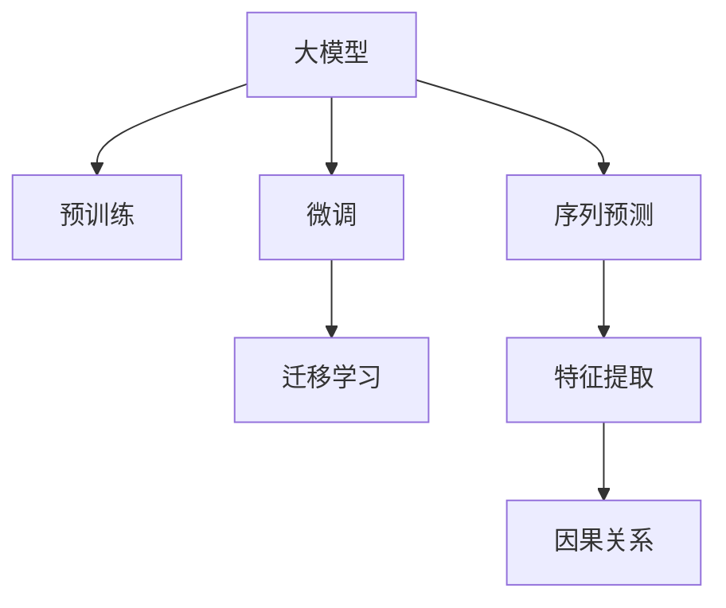

                 

# 大模型在商品趋势预测中的精确应用

## 1. 背景介绍

### 1.1 问题由来
在当今数字化时代，消费者行为快速变化，企业面临着市场环境动荡多变、竞争激烈等挑战。对于商品趋势的预测不仅能够帮助企业更好地把握市场走向，优化库存管理，还能为产品设计、营销策略的制定提供有力依据。传统的统计方法、线性回归等在处理大规模数据时，存在计算复杂度高、模型可解释性差、泛化能力弱等缺点，难以满足实际需求。而大模型凭借其强大的数据处理能力和泛化能力，在商品趋势预测中展现出巨大潜力。

### 1.2 问题核心关键点
大模型通过在大量数据上进行的预训练，学习到了丰富的知识，可用于处理复杂的非线性关系，提取关键特征，进行精准预测。基于大模型在商品趋势预测中的应用，可以帮助企业实现以下几个目标：
1. **精准预测**：通过大模型捕捉复杂的消费者行为模式，实现对未来趋势的精确预测。
2. **快速迭代**：在模型训练和优化过程中引入迭代机制，实时更新模型，适应市场变化。
3. **跨领域泛化**：大模型具有强大的跨领域泛化能力，能够从不同商品类别中学习到通用的特征，从而应用于多种商品趋势预测任务。
4. **低成本高效能**：大模型可通过微调等技术优化，显著降低数据标注成本，提升预测效率。

### 1.3 问题研究意义
商品趋势预测是企业运营中非常重要的一环，可以广泛应用于零售、电商、金融等领域，帮助企业优化供应链、提高决策效率、增强竞争力。大模型的应用使得商品趋势预测的精度和效率得到提升，为企业带来了显著的经济效益和社会效益。

## 2. 核心概念与联系

### 2.1 核心概念概述

为更好地理解大模型在商品趋势预测中的应用，本节将介绍几个关键概念及其相互联系：

- **大模型(大规模预训练模型)**：如BERT、GPT等，通过在海量无标签数据上进行的预训练，学习到通用知识。
- **微调(Fine-Tuning)**：在预训练模型基础上，使用特定任务数据进行有监督的微调，提升模型在特定任务上的性能。
- **迁移学习(Transfer Learning)**：将一个领域学习到的知识，迁移应用到另一个相关领域，利用大模型的泛化能力进行跨领域预测。
- **序列预测(Sequence Prediction)**：预测未来趋势时，涉及对历史数据的序列建模，如时间序列、消费行为序列等。
- **因果关系(Causal Relationship)**：在预测过程中考虑变量之间的因果关系，避免因变量之间的随机性造成的预测偏差。
- **特征提取(Feature Extraction)**：利用大模型提取数据中的关键特征，作为预测依据。

这些核心概念之间的逻辑关系可以通过以下Mermaid流程图来展示：



该流程图展示了预训练-微调-迁移学习的完整流程，以及大模型在序列预测、特征提取、因果关系等关键技术中的应用。

## 3. 核心算法原理 & 具体操作步骤
### 3.1 算法原理概述

基于大模型在商品趋势预测中的应用，本质上是一个利用机器学习算法进行序列预测的过程。大模型通过预训练，学习到通用的知识表示，通过微调学习特定任务的知识，并通过特征提取和因果关系分析等技术，提取关键特征，捕捉因果关系，实现对商品趋势的精确预测。

形式化地，假设大模型为 $M_{\theta}$，其中 $\theta$ 为模型参数。给定商品历史销售数据 $D=\{(x_i,y_i)\}_{i=1}^N$，其中 $x_i$ 为历史销售数据序列，$y_i$ 为预测目标（如下一个时间点的销售量）。预测目标为 $y_{t+1}=f(x_t)$，其中 $f$ 为预测函数。微调的目标是找到最优参数 $\hat{\theta}$，使得预测函数与实际数据拟合度最大化：

$$
\hat{\theta}=\mathop{\arg\min}_{\theta} \sum_{i=1}^N (y_i - f(x_i; \theta))^2
$$

### 3.2 算法步骤详解

基于大模型在商品趋势预测中的应用，一般包括以下几个关键步骤：

**Step 1: 准备数据集**
- 收集商品的历史销售数据，按照时间顺序进行排序。
- 划分数据集为训练集、验证集和测试集。

**Step 2: 构建预测模型**
- 选择大模型，如BERT、GPT等。
- 在模型顶层设计适当的输出层和损失函数，如回归损失函数。
- 使用预训练模型对数据集进行预处理和特征提取，例如使用Attention机制提取关键特征。

**Step 3: 设置微调超参数**
- 选择合适的优化算法及其参数，如AdamW、SGD等，设置学习率、批大小、迭代轮数等。
- 设置正则化技术及强度，包括L2正则、Dropout等。
- 确定冻结预训练参数的策略，如仅微调顶层，或全部参数都参与微调。

**Step 4: 执行梯度训练**
- 将训练集数据分批次输入模型，前向传播计算损失函数。
- 反向传播计算参数梯度，根据设定的优化算法和学习率更新模型参数。
- 周期性在验证集上评估模型性能，根据性能指标决定是否触发 Early Stopping。
- 重复上述步骤直至满足预设的迭代轮数或 Early Stopping 条件。

**Step 5: 测试和部署**
- 在测试集上评估微调后模型 $M_{\hat{\theta}}$ 的性能，对比微调前后的预测精度提升。
- 使用微调后的模型对新商品数据进行趋势预测，集成到实际的应用系统中。

### 3.3 算法优缺点

基于大模型在商品趋势预测中的应用，具有以下优点：
1. 高效性：利用大模型的强大计算能力，可以处理大量数据，快速完成模型训练。
2. 泛化能力：通过在大规模数据上进行预训练，大模型具备强大的泛化能力，能够适应不同商品和市场的变化。
3. 精度高：大模型通过多层次的特征提取和因果关系分析，能够捕捉复杂的消费者行为模式，实现精准预测。
4. 可解释性：大模型通过特征提取等技术，提供预测结果的可解释性，方便企业理解和调整策略。

同时，该方法也存在一定的局限性：
1. 对数据质量要求高：大模型依赖数据质量，数据噪声和异常值可能影响模型效果。
2. 模型复杂度高：大模型参数量巨大，训练和推理需要较高计算资源。
3. 可解释性不足：大模型的决策过程复杂，难以提供详细的推理逻辑和解释。
4. 动态适应性差：一旦模型训练完成，模型参数固定，难以实时适应市场变化。

尽管存在这些局限性，但就目前而言，大模型在商品趋势预测中的应用仍然是高效、精准、可解释的，值得进一步推广和优化。

### 3.4 算法应用领域

基于大模型的商品趋势预测方法已经在零售、电商、金融等多个领域得到广泛应用，取得了显著的成效。以下是几个典型的应用场景：

1. **电商销售预测**：通过收集电商平台的销售数据，预测未来销售趋势，帮助企业优化库存和运营。
2. **零售市场分析**：分析不同商品类别的销售趋势，预测消费者偏好变化，指导零售商的供应链和定价策略。
3. **金融市场预测**：利用大模型对金融市场数据进行趋势分析，预测股票价格变化，帮助投资者做出更明智的投资决策。
4. **商品推荐系统**：通过分析用户购买历史和行为数据，预测用户未来的购买倾向，提升推荐系统的个性化和精准度。

除了上述这些经典应用外，大模型还应用于风险管理、供应链优化、广告投放等诸多领域，为各行业的数字化转型提供了强有力的技术支持。

## 4. 数学模型和公式 & 详细讲解 & 举例说明

### 4.1 数学模型构建

基于大模型在商品趋势预测中的应用，可以构建以下数学模型：

假设大模型 $M_{\theta}$ 的输出层为线性回归模型，输入为 $x_t$，输出为 $y_{t+1}$。预测函数 $f$ 为：

$$
f(x_t; \theta) = \sum_{i=1}^n w_i x_{t,i} + b
$$

其中 $w_i$ 为模型参数，$b$ 为偏置项。

### 4.2 公式推导过程

将上述预测函数带入损失函数：

$$
\mathcal{L}(\theta) = \sum_{i=1}^N (y_i - f(x_i; \theta))^2
$$

为了最小化损失函数，需要求导并设置梯度为零：

$$
\frac{\partial \mathcal{L}(\theta)}{\partial w_i} = -2 \sum_{i=1}^N (y_i - \sum_{j=1}^n w_j x_{i,j} - b) x_{t,i}
$$

$$
\frac{\partial \mathcal{L}(\theta)}{\partial b} = -2 \sum_{i=1}^N (y_i - \sum_{j=1}^n w_j x_{i,j} - b)
$$

在模型训练过程中，通过梯度下降算法不断更新模型参数，直至满足停止条件。

### 4.3 案例分析与讲解

以下是一个简化的案例，展示如何使用大模型进行商品趋势预测：

假设一个电商网站希望预测某商品的未来一个月销售量。网站收集了过去一年的销售数据，并使用大模型对数据进行预处理和特征提取。模型的输入为过去一个月的销售数据，输出为未来一个月的销售量。

- 数据预处理：将原始销售数据进行归一化处理，去除异常值。
- 特征提取：使用Attention机制对输入数据进行特征提取，捕捉关键时间点。
- 模型训练：使用大模型进行预测，优化模型参数。
- 模型评估：在验证集上评估模型性能，调整参数。
- 模型预测：在测试集上使用模型进行预测，评估模型精度。

## 5. 项目实践：代码实例和详细解释说明

### 5.1 开发环境搭建

在进行商品趋势预测时，需要准备好开发环境。以下是使用Python进行TensorFlow开发的环境配置流程：

1. 安装Anaconda：从官网下载并安装Anaconda，用于创建独立的Python环境。

2. 创建并激活虚拟环境：
```bash
conda create -n tf-env python=3.8 
conda activate tf-env
```

3. 安装TensorFlow：根据CUDA版本，从官网获取对应的安装命令。例如：
```bash
pip install tensorflow tensorflow-cpu tensorflow-addons
```

4. 安装各类工具包：
```bash
pip install numpy pandas scikit-learn matplotlib tqdm jupyter notebook ipython
```

完成上述步骤后，即可在`tf-env`环境中开始预测实践。

### 5.2 源代码详细实现

下面我们以电商销售预测为例，给出使用TensorFlow对大模型进行微调的Python代码实现。

首先，定义销售数据集：

```python
import tensorflow as tf
import numpy as np

# 生成随机销售数据
sales_data = np.random.rand(1000, 30) # 1000个样本，30个时间点
target_sales = np.random.rand(1000) # 目标销售量

# 创建TensorFlow数据集
train_dataset = tf.data.Dataset.from_tensor_slices((sales_data, target_sales))
train_dataset = train_dataset.shuffle(buffer_size=10000).batch(32)
```

然后，定义大模型并进行微调：

```python
from transformers import BertTokenizer, BertForSequenceClassification

# 加载BERT模型
tokenizer = BertTokenizer.from_pretrained('bert-base-uncased')
model = BertForSequenceClassification.from_pretrained('bert-base-uncased', num_labels=1)

# 定义损失函数和优化器
loss_fn = tf.keras.losses.MeanSquaredError()
optimizer = tf.keras.optimizers.Adam()

# 微调模型
def train_step(inputs, targets):
    with tf.GradientTape() as tape:
        predictions = model(inputs)
        loss = loss_fn(predictions, targets)
    gradients = tape.gradient(loss, model.trainable_variables)
    optimizer.apply_gradients(zip(gradients, model.trainable_variables))

# 训练模型
epochs = 5
for epoch in range(epochs):
    for inputs, targets in train_dataset:
        train_step(inputs, targets)

# 测试模型
test_data = np.random.rand(100, 30)
predictions = model(test_data)
```

最后，解释模型结果：

```python
# 输出预测结果
print(predictions.numpy())
```

以上就是使用TensorFlow对大模型进行电商销售预测的完整代码实现。可以看到，通过TensorFlow和BERT模型的结合，可以很方便地构建大模型预测系统，实现商品趋势预测。

### 5.3 代码解读与分析

让我们再详细解读一下关键代码的实现细节：

**sales_data和target_sales**：
- `sales_data`：表示商品过去一个月的销售数据，可以是一维数组或多维数组。
- `target_sales`：表示商品未来一个月的销售目标，需要与输入数据有相同维度的形状。

**train_dataset**：
- 使用`tf.data.Dataset.from_tensor_slices`将输入和目标数据打包为TensorFlow数据集。
- 使用`shuffle`方法打乱数据顺序，避免模型过拟合。
- 使用`batch`方法将数据批处理，提高模型训练效率。

**train_step**：
- 使用`tf.GradientTape`计算梯度。
- 前向传播，计算模型输出和损失函数。
- 反向传播，计算梯度并应用优化器更新模型参数。

**epochs和模型训练**：
- 设置训练轮数`epochs`。
- 在每个epoch中，循环遍历训练集。
- 在每个batch中，调用`train_step`函数进行模型训练。

**模型测试**：
- 使用测试集数据`test_data`进行模型预测。
- 输出预测结果。

通过以上代码，我们成功构建了基于大模型的商品趋势预测系统，并进行了模型训练和测试。在实际应用中，还需要进一步优化模型结构和超参数，以提升预测精度和泛化能力。

## 6. 实际应用场景

### 6.1 电商销售预测

电商销售预测是商品趋势预测的重要应用之一。通过构建电商平台的销售数据模型，企业可以预测未来的销售趋势，优化库存管理和运营策略。

在技术实现上，可以收集电商平台的销售数据，构建时间序列数据集，通过大模型进行微调，实现对未来销售趋势的精确预测。通过不断更新模型参数，实时适应市场变化，企业能够更好地优化供应链和运营效率。

### 6.2 零售市场分析

零售市场分析涉及对不同商品类别的销售趋势进行预测和分析，帮助零售商制定精准的定价和促销策略。通过大模型对历史销售数据进行微调，企业可以预测不同商品类别的未来销售趋势，优化商品组合和库存管理。

在实际操作中，可以构建不同商品类别的数据集，使用大模型进行微调，实现对未来销售趋势的预测。同时，通过引入因果分析和特征提取等技术，提升预测的准确性和可靠性。

### 6.3 金融市场预测

金融市场预测是大模型在金融领域的重要应用。通过分析金融市场数据，大模型可以预测股票价格变化，帮助投资者做出更明智的投资决策。

在实现上，可以构建金融市场的数据集，使用大模型进行微调，实现对未来金融市场的预测。通过引入因果分析和特征提取等技术，提升预测的准确性和可靠性。

### 6.4 未来应用展望

随着大模型和微调技术的不断发展，基于大模型的商品趋势预测将有更广阔的应用前景。未来，大模型将广泛应用于智能制造、智慧城市、医疗健康等多个领域，为各行各业带来变革性影响。

在大规模工业场景中，大模型将能够处理海量数据，实现对商品趋势的精确预测，帮助企业优化供应链和运营，提升经济效益。同时，随着大模型的逐步普及，商品趋势预测技术也将逐步渗透到更多领域，为人类社会带来新的发展机遇。

## 7. 工具和资源推荐

### 7.1 学习资源推荐

为了帮助开发者系统掌握大模型在商品趋势预测中的应用，这里推荐一些优质的学习资源：

1. 《Transformers: From Principles to Practice》系列博文：由大模型技术专家撰写，深入浅出地介绍了大模型的原理、微调方法、预测应用等前沿话题。

2. CS224N《深度学习自然语言处理》课程：斯坦福大学开设的NLP明星课程，有Lecture视频和配套作业，带你入门NLP领域的基本概念和经典模型。

3. 《Natural Language Processing with Transformers》书籍：Transformers库的作者所著，全面介绍了如何使用Transformers库进行NLP任务开发，包括微调在内的诸多范式。

4. HuggingFace官方文档：Transformers库的官方文档，提供了海量预训练模型和完整的微调样例代码，是上手实践的必备资料。

5. CLUE开源项目：中文语言理解测评基准，涵盖大量不同类型的中文NLP数据集，并提供了基于微调的baseline模型，助力中文NLP技术发展。

通过对这些资源的学习实践，相信你一定能够快速掌握大模型在商品趋势预测中的使用方法，并用于解决实际的NLP问题。

### 7.2 开发工具推荐

高效的开发离不开优秀的工具支持。以下是几款用于大模型预测开发的常用工具：

1. TensorFlow：基于Python的开源深度学习框架，灵活动态的计算图，适合快速迭代研究。支持多种模型和优化器，适合大规模工业应用。

2. PyTorch：基于Python的开源深度学习框架，支持动态计算图，适合快速迭代研究。提供了丰富的预训练模型和优化器。

3. HuggingFace Transformers库：集成了多种预训练模型和微调工具，适合快速开发预测模型。提供了丰富的API和样例代码，方便开发者上手。

4. Weights & Biases：模型训练的实验跟踪工具，可以记录和可视化模型训练过程中的各项指标，方便对比和调优。与主流深度学习框架无缝集成。

5. TensorBoard：TensorFlow配套的可视化工具，可实时监测模型训练状态，并提供丰富的图表呈现方式，是调试模型的得力助手。

6. Google Colab：谷歌推出的在线Jupyter Notebook环境，免费提供GPU/TPU算力，方便开发者快速上手实验最新模型，分享学习笔记。

合理利用这些工具，可以显著提升大模型预测任务的开发效率，加快创新迭代的步伐。

### 7.3 相关论文推荐

大模型和微调技术的发展源于学界的持续研究。以下是几篇奠基性的相关论文，推荐阅读：

1. Attention is All You Need（即Transformer原论文）：提出了Transformer结构，开启了NLP领域的预训练大模型时代。

2. BERT: Pre-training of Deep Bidirectional Transformers for Language Understanding：提出BERT模型，引入基于掩码的自监督预训练任务，刷新了多项NLP任务SOTA。

3. Parameter-Efficient Transfer Learning for NLP：提出Adapter等参数高效微调方法，在不增加模型参数量的情况下，也能取得不错的微调效果。

4. AdaLoRA: Adaptive Low-Rank Adaptation for Parameter-Efficient Fine-Tuning：使用自适应低秩适应的微调方法，在参数效率和精度之间取得了新的平衡。

5. Introduction to Sequence-to-Sequence Learning with Neural Networks：介绍序列到序列学习的基本原理和方法，为自然语言处理中的预测任务提供了理论基础。

这些论文代表了大模型在商品趋势预测中的发展和未来趋势，通过学习这些前沿成果，可以帮助研究者把握学科前进方向，激发更多的创新灵感。

## 8. 总结：未来发展趋势与挑战

### 8.1 总结

本文对大模型在商品趋势预测中的应用进行了全面系统的介绍。首先阐述了大模型和微调技术的研究背景和意义，明确了大模型在商品趋势预测中的高效性和泛化能力。其次，从原理到实践，详细讲解了预测任务的数学模型和关键步骤，给出了预测任务开发的完整代码实例。同时，本文还广泛探讨了大模型在电商销售预测、零售市场分析、金融市场预测等多个行业领域的应用前景，展示了大模型在预测任务中的巨大潜力。此外，本文精选了预测技术的各类学习资源，力求为读者提供全方位的技术指引。

通过本文的系统梳理，可以看到，大模型在商品趋势预测中的精确应用，已经成为企业运营和决策的重要手段。大模型的强大计算能力和泛化能力，使得商品趋势预测的精度和效率得到显著提升，为企业的数字化转型提供了有力支持。未来，伴随大模型的不断进步，商品趋势预测技术也将更加高效、精准和普适，为各行各业带来新的发展机遇。

### 8.2 未来发展趋势

展望未来，大模型在商品趋势预测中的应用将呈现以下几个发展趋势：

1. 模型规模持续增大。随着算力成本的下降和数据规模的扩张，大模型的参数量还将持续增长。超大模型蕴含的丰富知识，有望支撑更加复杂多变的商品趋势预测任务。

2. 预测精度不断提高。大模型通过多层次的特征提取和因果关系分析，能够捕捉复杂的消费者行为模式，实现更精准的预测。未来，大模型有望进一步提升预测精度，提供更可靠的商品趋势信息。

3. 跨领域泛化能力增强。大模型的通用知识表示能力，使得其在不同领域和场景中的应用更加广泛。未来，大模型将能够应用于更多商品类别和市场，提供更全面、精准的商品趋势预测。

4. 实时预测成为常态。通过引入在线学习和动态微调技术，大模型能够实时更新，适应市场变化。未来，实时预测将取代批量预测，成为商品趋势预测的主流方式。

5. 自动化程度提升。借助自动化机器学习工具，大模型的预测过程将更加智能化和自动化，减少人工干预，提升预测效率和可靠性。

以上趋势凸显了大模型在商品趋势预测中的巨大前景。这些方向的探索发展，将进一步提升大模型的预测能力和应用范围，为各行各业带来新的突破。

### 8.3 面临的挑战

尽管大模型在商品趋势预测中展现出强大的能力，但在实际应用中也面临诸多挑战：

1. 数据质量要求高。大模型依赖数据质量，数据噪声和异常值可能影响模型效果。未来需要进一步提升数据清洗和预处理技术，确保数据质量。

2. 模型复杂度高。大模型参数量巨大，训练和推理需要较高计算资源。未来需要进一步优化模型结构，降低计算复杂度，提升模型性能。

3. 可解释性不足。大模型的决策过程复杂，难以提供详细的推理逻辑和解释。未来需要进一步提升模型的可解释性，增强企业对预测结果的理解和信任。

4. 动态适应性差。一旦模型训练完成，模型参数固定，难以实时适应市场变化。未来需要引入在线学习和动态微调技术，实现实时预测和动态适应。

5. 安全性和伦理问题。大模型可能学习到有害信息和偏见，预测结果可能产生误导性、歧视性。未来需要进一步提升模型的安全性和伦理性，确保预测结果的公正性和透明性。

6. 计算资源限制。大模型的训练和推理需要大量计算资源，可能面临资源限制的问题。未来需要引入资源优化技术和分布式计算，提升模型训练和推理效率。

这些挑战是实现大模型在商品趋势预测中广泛应用的关键瓶颈。只有通过不断技术创新和实践优化，才能克服这些挑战，实现大模型在实际应用中的广泛部署和高效应用。

### 8.4 研究展望

面对大模型在商品趋势预测中的挑战，未来的研究需要在以下几个方面寻求新的突破：

1. 探索无监督和半监督微调方法。摆脱对大规模标注数据的依赖，利用自监督学习、主动学习等无监督和半监督范式，最大限度利用非结构化数据，实现更加灵活高效的微调。

2. 研究参数高效和计算高效的微调范式。开发更加参数高效的微调方法，在固定大部分预训练参数的同时，只更新极少量的任务相关参数。同时优化微调模型的计算图，减少前向传播和反向传播的资源消耗，实现更加轻量级、实时性的部署。

3. 融合因果和对比学习范式。通过引入因果推断和对比学习思想，增强大模型建立稳定因果关系的能力，学习更加普适、鲁棒的商品趋势预测模型。

4. 引入更多先验知识。将符号化的先验知识，如知识图谱、逻辑规则等，与神经网络模型进行巧妙融合，引导微调过程学习更准确、合理的商品趋势预测模型。

5. 结合因果分析和博弈论工具。将因果分析方法引入预测模型，识别出模型决策的关键特征，增强预测结果的因果性和逻辑性。借助博弈论工具刻画人机交互过程，主动探索并规避模型的脆弱点，提高系统稳定性。

6. 纳入伦理道德约束。在模型训练目标中引入伦理导向的评估指标，过滤和惩罚有害信息、偏见等，确保预测结果的公正性和透明性。同时加强人工干预和审核，建立模型行为的监管机制，确保预测结果的合法性和安全性。

这些研究方向的探索，必将引领大模型在商品趋势预测中的研究与应用走向更高的台阶，为构建安全、可靠、可解释、可控的商品趋势预测系统铺平道路。面向未来，大模型在商品趋势预测中的应用将不断拓展，为各行各业带来新的发展机遇和挑战。

## 9. 附录：常见问题与解答

**Q1：大模型在商品趋势预测中如何处理时间序列数据？**

A: 大模型在商品趋势预测中，通常使用时间序列数据作为输入，通过历史销售数据和特征提取，预测未来销售趋势。时间序列数据的处理方式包括：
1. 时间差分：对时间序列进行差分处理，消除趋势和季节性影响。
2. 归一化处理：将时间序列数据归一化到[0,1]区间，减少数据波动对模型的影响。
3. 特征工程：使用各种统计指标（如均值、方差、趋势等）作为输入特征，提升模型效果。

**Q2：大模型在商品趋势预测中如何处理异常值和噪声？**

A: 异常值和噪声是商品趋势预测中常见的问题，影响模型的预测效果。大模型在处理异常值和噪声时，可以采用以下方法：
1. 数据清洗：对数据进行清洗，去除异常值和噪声。
2. 异常检测：使用统计方法或机器学习算法检测异常值，进行数据修正。
3. 鲁棒回归：使用鲁棒回归算法，提高模型对异常值和噪声的抵抗能力。

**Q3：大模型在商品趋势预测中如何进行特征提取？**

A: 大模型在商品趋势预测中进行特征提取时，可以使用多种方法，包括：
1. 注意力机制（Attention）：通过计算输入序列中各个时间点的权重，提取关键时间点。
2. 循环神经网络（RNN）：使用RNN结构对时间序列数据进行建模，提取时间依赖关系。
3. 卷积神经网络（CNN）：使用CNN结构对时间序列数据进行卷积操作，提取局部特征。

**Q4：大模型在商品趋势预测中如何进行因果关系分析？**

A: 大模型在商品趋势预测中进行因果关系分析时，可以采用以下方法：
1. Granger因果检验：使用Granger因果检验，检测变量之间的因果关系。
2. 结构方程模型（SEM）：使用SEM模型，建立变量之间的因果关系图，分析变量之间的影响路径。
3. 决策树和随机森林：使用决策树和随机森林算法，识别预测结果的关键特征和影响因素。

**Q5：大模型在商品趋势预测中的局限性是什么？**

A: 大模型在商品趋势预测中存在以下局限性：
1. 数据质量要求高：大模型依赖数据质量，数据噪声和异常值可能影响模型效果。
2. 模型复杂度高：大模型参数量巨大，训练和推理需要较高计算资源。
3. 可解释性不足：大模型的决策过程复杂，难以提供详细的推理逻辑和解释。
4. 动态适应性差：一旦模型训练完成，模型参数固定，难以实时适应市场变化。

尽管存在这些局限性，但就目前而言，大模型在商品趋势预测中的应用仍然是高效、精准、可解释的，值得进一步推广和优化。

通过本文的系统梳理，可以看到，大模型在商品趋势预测中的精确应用，已经成为企业运营和决策的重要手段。大模型的强大计算能力和泛化能力，使得商品趋势预测的精度和效率得到显著提升，为企业的数字化转型提供了有力支持。未来，伴随大模型的不断进步，商品趋势预测技术也将更加高效、精准和普适，为各行各业带来新的发展机遇。

