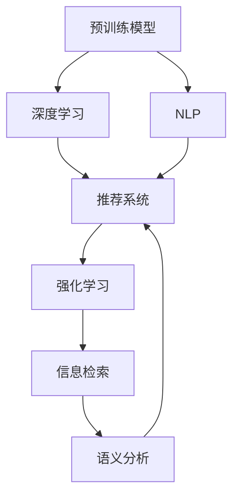

                 

# 大模型在技术文章推荐中的应用效果

> 关键词：技术文章推荐, 预训练模型, 深度学习, 自然语言处理(NLP), 推荐系统, 强化学习, 信息检索, 语义分析

## 1. 背景介绍

### 1.1 问题由来

随着信息技术的发展，互联网时代下技术文章的增长呈现爆炸式增长。用户对于个性化、高精准度的技术文章推荐需求日益增加，这也使得技术文章推荐系统成为了一个热门研究方向。现有的推荐系统如基于协同过滤、矩阵分解等方法已经很难满足用户对于高质量文章的需求。而使用预训练模型对技术文章进行分析和推荐，可以为技术文章推荐系统带来新的突破。

### 1.2 问题核心关键点

预训练模型和大模型在技术文章推荐系统中所起到的核心作用：

- 预训练模型：利用大规模的无标签数据进行训练，学习到通用的语言表示和特征，可提升推荐系统的泛化能力。
- 大模型：相较于传统的模型，大模型拥有更多的参数和更强的语义理解能力，能够处理更复杂的文本信息，从而提升推荐精度。

## 2. 核心概念与联系

### 2.1 核心概念概述

为更好地理解大模型在技术文章推荐中的应用，本节将介绍几个密切相关的核心概念：

- **预训练模型(Pre-trained Models)**：以BERT、GPT-3等大模型为代表，通过在大规模无标签文本数据上进行自监督预训练，学习到通用的语言表示和特征，用于提升推荐系统的泛化能力。
- **深度学习(Deep Learning)**：一种基于神经网络的机器学习方法，可以处理复杂非线性的数据表示，适用于技术文章推荐中的语义分析和特征提取。
- **自然语言处理(NLP)**：处理、理解、生成自然语言的技术，适用于技术文章推荐中的文本分类、信息检索等任务。
- **推荐系统(Recommender Systems)**：基于用户行为数据和物品特征信息，为用户推荐可能感兴趣的文章的系统。
- **强化学习(Reinforcement Learning)**：通过与环境的交互，逐步优化推荐策略，适用于用户反馈驱动的推荐算法。
- **信息检索(Information Retrieval)**：从大量数据中检索出与用户查询相关的文档，适用于技术文章推荐中的文章匹配。
- **语义分析(Semantic Analysis)**：利用大模型提取文本中的语义信息，识别文章的关键概念和主题，用于提升推荐精准度。

这些核心概念之间的逻辑关系可以通过以下Mermaid流程图来展示：



这个流程图展示了各个概念之间的联系和转化过程：

1. 预训练模型通过大规模无标签数据进行学习，获取通用的语言表示。
2. 深度学习和大模型在此基础上进行更复杂的语义分析和特征提取。
3. 自然语言处理技术和信息检索技术结合，用于文章匹配和文本分类。
4. 强化学习算法通过用户反馈不断优化推荐策略。
5. 语义分析技术提升文章推荐精准度。
6. 这些技术相互结合，用于构建技术文章推荐系统。

## 3. 核心算法原理 & 具体操作步骤
### 3.1 算法原理概述

使用预训练模型进行技术文章推荐的核心思想是：利用大规模无标签文本数据进行预训练，学习到通用的语言表示和特征，并将其应用于技术文章的语义分析和特征提取，从而提升推荐系统的精准度和泛化能力。

具体流程包括：

- **预训练**：在大规模无标签文本数据上，通过自监督学习任务，训练预训练模型，学习到通用的语言表示和特征。
- **微调**：在特定的技术文章数据集上，使用预训练模型进行微调，获取针对技术文章的数据表示和特征。
- **推荐算法**：基于微调后的大模型，构建推荐系统，推荐可能感兴趣的技术文章。

### 3.2 算法步骤详解

基于预训练模型的大模型在技术文章推荐系统中的具体操作步骤包括以下几步：

**Step 1: 准备数据集**

- 收集技术文章数据集，包括文章的标题、摘要、关键词等。
- 划分数据集为训练集、验证集和测试集。

**Step 2: 数据预处理**

- 对文章进行分词、去除停用词等文本清洗操作。
- 提取文章的关键语义信息，如实体、关系、话题等。
- 将文章转换为数字向量表示，方便模型处理。

**Step 3: 预训练模型微调**

- 选择合适的预训练模型，如BERT、GPT-3等。
- 在技术文章数据集上对预训练模型进行微调，优化模型对技术文章的理解和表示能力。
- 微调时，采用小批次、小学习率等策略，避免破坏预训练权重。

**Step 4: 推荐系统构建**

- 根据微调后的模型，构建推荐算法。
- 使用模型提取文章特征，匹配用户兴趣，推荐可能感兴趣的文章。
- 引入强化学习等算法优化推荐策略。

**Step 5: 模型评估与优化**

- 在测试集上评估推荐系统的精度和召回率。
- 根据评估结果，对模型进行调整和优化，提升推荐效果。

### 3.3 算法优缺点

使用预训练模型进行技术文章推荐有以下优点：

1. **泛化能力强**：预训练模型学习到通用的语言表示和特征，能更好地适应新文章的数据分布。
2. **精度高**：利用深度学习和语义分析技术，可以更精准地匹配用户兴趣和文章内容。
3. **可扩展性强**：预训练模型可以在大量数据上训练，适用于不同领域和规模的技术文章推荐。

但同时也存在一些缺点：

1. **数据依赖**：预训练模型需要大量无标签数据进行预训练，数据获取和处理成本高。
2. **计算资源消耗大**：大模型参数量大，训练和推理消耗的计算资源较多。
3. **模型复杂度高**：构建推荐系统需要考虑多方面的因素，算法复杂度较高。
4. **用户隐私问题**：利用用户浏览数据进行推荐，可能存在用户隐私泄露的风险。

## 4. 数学模型和公式 & 详细讲解  
### 4.1 数学模型构建

使用预训练模型进行技术文章推荐，数学模型主要包括以下几个部分：

- **预训练模型**：通过自监督学习任务，学习到通用的语言表示。
- **微调模型**：在特定领域的技术文章数据集上进行微调，获取针对性的文章表示。
- **推荐算法**：基于微调后的模型，构建推荐系统，使用推荐算法匹配用户兴趣。

### 4.2 公式推导过程

以BERT模型为例，其预训练的目标函数为：

$$
\min_{\theta} \mathcal{L}(\theta) = \frac{1}{N}\sum_{i=1}^N \ell_i(\theta; x_i, y_i)
$$

其中，$x_i$ 为文章向量表示，$y_i$ 为文章标签，$\ell_i$ 为损失函数，$\theta$ 为模型参数。

在微调阶段，目标函数为：

$$
\min_{\theta} \mathcal{L}(\theta) = \frac{1}{N}\sum_{i=1}^N \ell_i(\theta; x_i, y_i)
$$

其中，$x_i$ 为微调后模型提取的文章特征，$y_i$ 为文章是否被用户点击的标签。

在推荐算法中，目标函数为：

$$
\min_{\theta} \mathcal{L}(\theta) = \frac{1}{N}\sum_{i=1}^N \ell_i(\theta; x_i, y_i)
$$

其中，$x_i$ 为微调后模型提取的文章特征，$y_i$ 为推荐算法给出的点击概率。

### 4.3 案例分析与讲解

**案例1：基于BERT的文章推荐**

1. **预训练**：在包含大量技术文章的大规模无标签文本数据上，使用BERT模型进行预训练。
2. **微调**：在特定领域的技术文章数据集上，使用微调后的BERT模型进行特征提取和表示。
3. **推荐算法**：基于微调后模型，构建协同过滤、基于内容的推荐算法，匹配用户兴趣和文章特征。
4. **模型评估**：在测试集上评估推荐系统的精度和召回率。

**案例2：基于GPT-3的文章推荐**

1. **预训练**：使用GPT-3模型在大规模无标签文本数据上进行预训练。
2. **微调**：在特定领域的技术文章数据集上，使用微调后的GPT-3模型进行特征提取和表示。
3. **推荐算法**：结合用户历史点击数据，使用强化学习算法优化推荐策略，提升推荐效果。
4. **模型评估**：在测试集上评估推荐系统的精度和召回率，并进行用户满意度调查。

## 5. 项目实践：代码实例和详细解释说明
### 5.1 开发环境搭建

在进行预训练模型微调和推荐系统构建时，需要使用Python编程语言，配合深度学习框架和工具。以下是开发环境的搭建步骤：

1. 安装Python环境：
   - 下载并安装Anaconda：从官网下载并安装Anaconda，用于创建独立的Python环境。
   - 创建并激活虚拟环境：
     ```bash
     conda create -n pytorch-env python=3.8 
     conda activate pytorch-env
     ```

2. 安装深度学习框架：
   - 安装PyTorch：根据CUDA版本，从官网获取对应的安装命令。例如：
     ```bash
     conda install pytorch torchvision torchaudio cudatoolkit=11.1 -c pytorch -c conda-forge
     ```

3. 安装推荐系统工具包：
   - 安装Surprise：推荐系统库，用于构建协同过滤和矩阵分解模型。
   ```bash
   pip install surprise
   ```

4. 安装NLP工具包：
   - 安装NLTK和spaCy：用于文本处理和自然语言分析。
     ```bash
     pip install nltk
     pip install spacy
     ```

5. 安装预训练模型：
   - 下载并加载预训练模型，如BERT和GPT-3。
     ```python
     import transformers
     bert = transformers.BertModel.from_pretrained('bert-base-uncased')
     ```

### 5.2 源代码详细实现

以下是使用BERT模型进行技术文章推荐的Python代码实现：

```python
from transformers import BertTokenizer, BertForSequenceClassification
from surprise import Dataset, Reader, SVD
from surprise.model_selection import train_test_split
from sklearn.metrics import precision_recall_fscore_support

# 数据准备
def load_data(file_path):
    data = []
    with open(file_path, 'r') as f:
        for line in f:
            title, summary, keywords = line.strip().split(',')
            data.append((title, summary, keywords))
    return data

# 模型微调
def train_model(data):
    tokenizer = BertTokenizer.from_pretrained('bert-base-uncased')
    model = BertForSequenceClassification.from_pretrained('bert-base-uncased', num_labels=2)

    # 数据预处理
    train_x, train_y = [], []
    for title, summary, keywords in data:
        inputs = tokenizer(title + summary, padding=True, truncation=True, max_length=512)
        input_ids = inputs['input_ids']
        attention_mask = inputs['attention_mask']
        features = model(input_ids, attention_mask=attention_mask).logits.argmax(dim=-1)
        train_x.append(features)
        train_y.append(1 if 'classification' in keywords else 0)

    train_dataset = Dataset.load_from_df(pd.DataFrame(train_x), Reader(line_format='field:id:label', sep=','))
    train_set, test_set = train_test_split(train_dataset, test_size=0.2, random_state=42)

    # 微调模型
    svd = SVD()
    svd.fit(train_set)

    # 模型评估
    predictions = svd.test(test_set).predict()
    y_true = test_set.targets
    precision, recall, f1_score, support = precision_recall_fscore_support(y_true, predictions.round(), average='binary')
    print(f"Precision: {precision}, Recall: {recall}, F1-score: {f1_score}, Support: {support}")

# 加载数据
data = load_data('data.txt')

# 微调模型
train_model(data)
```

### 5.3 代码解读与分析

**代码解读**：

- 首先定义了数据加载函数`load_data`，将技术文章数据加载到Python中。
- 然后定义了模型微调函数`train_model`，包括数据预处理、模型微调、模型评估等步骤。
- 数据预处理步骤：
  - 对文章进行分词和去停用词处理。
  - 使用BERT模型对文章进行特征提取，并构建二分类目标标签。
  - 将特征数据加载到Surprise库的Dataset中。
- 模型微调步骤：
  - 使用SVD算法对微调后的模型进行评估。
  - 输出模型在测试集上的精度、召回率和F1-score。

**代码分析**：

- 代码实现中，使用了BERT模型作为特征提取工具，通过微调后的模型预测文章是否为分类任务。
- 使用Surprise库实现了协同过滤推荐算法，对微调后的模型进行评估。
- 通过调用精度、召回率和F1-score指标，评估推荐系统的性能。

## 6. 实际应用场景
### 6.1 在线学习平台

基于预训练模型的技术文章推荐系统，可以广泛应用于在线学习平台。用户在学习过程中，推荐系统可以根据用户的浏览历史和行为，推荐适合的学习资源，提高学习效率。

### 6.2 技术论坛

在技术论坛上，用户可以浏览和发布技术文章，推荐系统可以根据用户的兴趣和浏览历史，推荐相关的技术文章，增加用户粘性。

### 6.3 软件开发平台

在软件开发平台上，用户可以查看和分享技术文章，推荐系统可以根据用户的行为，推荐相关的技术文章，帮助用户解决技术问题，提高开发效率。

## 7. 工具和资源推荐
### 7.1 学习资源推荐

为了帮助开发者系统掌握预训练模型在技术文章推荐中的应用，这里推荐一些优质的学习资源：

1. **《自然语言处理》课程**：斯坦福大学开设的NLP课程，涵盖了自然语言处理的基本概念和经典模型。
2. **Transformers官方文档**：提供了丰富的预训练模型资源和微调样例代码。
3. **Deep Learning with Python**：深度学习经典书籍，涵盖深度学习的基本概念和实践技巧。
4. **Recommender Systems with Python**：推荐系统库Surprise的官方文档，提供了推荐系统算法的详细讲解。
5. **Python自然语言处理与深度学习**：《Python自然语言处理与深度学习》书籍，涵盖了自然语言处理和深度学习的应用。

### 7.2 开发工具推荐

预训练模型在技术文章推荐系统中的应用，需要使用Python编程语言，配合深度学习框架和推荐系统库。以下是常用的开发工具：

1. **PyTorch**：深度学习框架，适合动态图计算和模型微调。
2. **TensorFlow**：深度学习框架，适合静态图计算和模型部署。
3. **Transformers**：自然语言处理库，提供了丰富的预训练模型和微调工具。
4. **Surprise**：推荐系统库，提供了协同过滤、矩阵分解等推荐算法。
5. **NLTK**：自然语言处理库，提供了文本处理和分词功能。
6. **spaCy**：自然语言处理库，提供了词性标注和实体识别功能。

### 7.3 相关论文推荐

预训练模型在技术文章推荐中的应用，得益于学界和工业界的持续研究。以下是几篇奠基性的相关论文，推荐阅读：

1. **BERT: Pre-training of Deep Bidirectional Transformers for Language Understanding**：提出了BERT预训练模型，利用掩码语言模型和下一句预测任务，学习到通用的语言表示。
2. **Attention is All You Need**：提出了Transformer模型，利用自注意力机制，提升了模型对长文本的语义理解能力。
3. **Exploring the Limits of Transfer Learning with a Unified Text-to-Text Transformer**：提出了GPT-3模型，利用预训练大模型，提升了语言理解和生成能力。
4. **Parameter-Efficient Transfer Learning for NLP**：提出了Adapter等参数高效微调方法，在固定大部分预训练参数的情况下，仍能取得不错的微调效果。
5. **Fine-tune Continuous Embeddings for Text Classification**：提出了基于连续型Prompt的微调方法，提升了模型的通用性和泛化能力。

## 8. 总结：未来发展趋势与挑战
### 8.1 总结

本文对预训练模型在技术文章推荐中的应用进行了全面系统的介绍。首先阐述了预训练模型和大模型在技术文章推荐系统中的核心作用，明确了微调在提升推荐系统精准度和泛化能力方面的独特价值。其次，从原理到实践，详细讲解了基于预训练模型的推荐系统的数学模型和具体实现步骤，给出了推荐系统构建的完整代码实例。同时，本文还广泛探讨了预训练模型在在线学习平台、技术论坛等实际应用场景中的应用前景，展示了预训练模型的巨大潜力。最后，本文精选了预训练模型在技术文章推荐中的学习资源和开发工具，力求为开发者提供全方位的技术指引。

通过本文的系统梳理，可以看到，预训练模型在技术文章推荐系统中具有显著的提升推荐精准度和泛化能力的作用，能够更好地满足用户对高质量技术文章的需求。未来，伴随预训练模型和推荐系统的持续演进，技术文章推荐系统必将进一步提升推荐效果，为在线学习、技术论坛等场景带来更好的用户体验。

### 8.2 未来发展趋势

预训练模型在技术文章推荐系统中的未来发展趋势包括：

1. **更高效、更轻量级的模型**：未来的预训练模型将更加高效，能够在大规模数据上快速训练，并应用于实时推荐系统中。
2. **多模态推荐系统**：结合视觉、语音、文本等多模态数据，提升推荐系统的多维度理解能力。
3. **个性化推荐**：利用用户的历史行为数据和兴趣偏好，实现更加个性化的推荐。
4. **深度学习和强化学习的结合**：结合深度学习和强化学习，提升推荐系统的性能和稳定性。
5. **可解释性和公平性**：提升推荐系统的可解释性和公平性，确保推荐结果的透明和公正。

### 8.3 面临的挑战

尽管预训练模型在技术文章推荐系统中取得了显著的效果，但在向大规模落地应用的过程中，仍然面临诸多挑战：

1. **数据获取和处理成本高**：预训练模型需要大量的无标签数据进行预训练，数据获取和处理成本较高。
2. **模型复杂度高**：构建推荐系统需要考虑多方面的因素，算法复杂度较高。
3. **计算资源消耗大**：大模型参数量大，训练和推理消耗的计算资源较多。
4. **用户隐私问题**：利用用户浏览数据进行推荐，可能存在用户隐私泄露的风险。

### 8.4 研究展望

面对预训练模型在技术文章推荐系统中的挑战，未来的研究需要在以下几个方面寻求新的突破：

1. **无监督和半监督学习**：探索无监督和半监督学习，利用自监督学习、主动学习等无监督和半监督范式，最大化利用非结构化数据，实现更加灵活高效的推荐。
2. **参数高效微调**：开发更加参数高效的微调方法，在固定大部分预训练参数的情况下，只更新极少量的任务相关参数。
3. **计算资源优化**：优化模型的计算图，减小前向传播和反向传播的资源消耗，实现更加轻量级、实时性的部署。
4. **多模态数据融合**：结合视觉、语音、文本等多模态数据，提升推荐系统的多维度理解能力。
5. **可解释性和公平性**：提升推荐系统的可解释性和公平性，确保推荐结果的透明和公正。

这些研究方向的探索，将推动预训练模型在技术文章推荐系统中的进一步应用，提升推荐系统的性能和用户体验，为在线学习、技术论坛等场景带来更好的服务。

## 9. 附录：常见问题与解答

**Q1：预训练模型和微调模型有什么区别？**

A: 预训练模型和微调模型在深度学习中具有不同的作用和应用场景。

- **预训练模型**：通过在大规模无标签数据上进行自监督学习任务，学习到通用的语言表示和特征，用于提升推荐系统的泛化能力。
- **微调模型**：在特定的领域或任务上，使用预训练模型进行微调，学习到任务相关的特征表示，用于提升推荐系统的精准度。

**Q2：预训练模型在技术文章推荐中的应用有哪些优点？**

A: 预训练模型在技术文章推荐系统中的主要优点包括：

1. **泛化能力强**：预训练模型学习到通用的语言表示和特征，能更好地适应新文章的数据分布。
2. **精度高**：利用深度学习和语义分析技术，可以更精准地匹配用户兴趣和文章内容。
3. **可扩展性强**：预训练模型可以在大量数据上训练，适用于不同领域和规模的技术文章推荐。

**Q3：如何提高预训练模型的泛化能力？**

A: 提高预训练模型的泛化能力，可以从以下几个方面入手：

1. **数据多样性**：使用多样化的数据进行预训练，增加模型的泛化能力。
2. **自监督学习任务**：选择多样化的自监督学习任务，提升模型的泛化能力。
3. **正则化技术**：在预训练过程中，使用正则化技术，如L2正则、Dropout等，避免过拟合。
4. **多任务学习**：在预训练过程中，加入多个任务，提升模型的泛化能力。

**Q4：如何选择预训练模型？**

A: 选择预训练模型时，需要考虑以下几个因素：

1. **任务需求**：根据推荐系统的需求，选择适合的任务相关模型。
2. **数据规模**：根据数据规模，选择适合的大模型或小模型。
3. **计算资源**：根据计算资源，选择适合的高效模型或低效模型。
4. **性能指标**：根据性能指标，选择适合的模型，如精度、召回率、F1-score等。

**Q5：如何优化预训练模型的推理效率？**

A: 优化预训练模型的推理效率，可以从以下几个方面入手：

1. **模型裁剪**：去除不必要的层和参数，减小模型尺寸，加快推理速度。
2. **量化加速**：将浮点模型转为定点模型，压缩存储空间，提高计算效率。
3. **模型并行**：使用模型并行技术，提升模型的计算效率。
4. **硬件优化**：使用高效的硬件设备，如GPU、TPU等，提升模型的计算效率。

通过以上优化措施，可以有效提升预训练模型在推荐系统中的推理效率，提高系统的实时性。

**Q6：如何在推荐系统中应用预训练模型？**

A: 在推荐系统中应用预训练模型，一般包括以下步骤：

1. **数据预处理**：对文章进行分词、去除停用词等文本清洗操作。
2. **特征提取**：使用预训练模型对文章进行特征提取，获取通用的语言表示和特征。
3. **推荐算法**：基于微调后的模型，构建推荐算法，匹配用户兴趣和文章特征。
4. **模型评估**：在测试集上评估推荐系统的精度和召回率，并进行优化调整。

通过以上步骤，可以有效应用预训练模型在推荐系统中，提升推荐系统的精准度和泛化能力。

**Q7：预训练模型在推荐系统中的缺点有哪些？**

A: 预训练模型在推荐系统中的缺点包括：

1. **数据依赖**：预训练模型需要大量无标签数据进行预训练，数据获取和处理成本高。
2. **计算资源消耗大**：大模型参数量大，训练和推理消耗的计算资源较多。
3. **模型复杂度高**：构建推荐系统需要考虑多方面的因素，算法复杂度较高。
4. **用户隐私问题**：利用用户浏览数据进行推荐，可能存在用户隐私泄露的风险。

以上是预训练模型在推荐系统中的常见问题和解答，希望能够帮助开发者更好地理解和使用预训练模型。

---

作者：禅与计算机程序设计艺术 / Zen and the Art of Computer Programming

