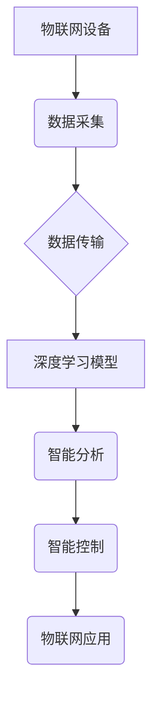

> 深度学习，物联网，数据分析，预测模型，智能感知，边缘计算，安全保障

## 1. 背景介绍

物联网（Internet of Things，IoT）正以惊人的速度发展，连接着越来越多的设备、传感器和数据源。这些连接设备产生的海量数据蕴藏着丰富的价值，但传统的处理方式难以有效地挖掘和利用这些数据。深度学习作为一种强大的机器学习方法，凭借其强大的数据处理能力和模式识别能力，为物联网的发展带来了新的机遇。

深度学习算法能够从海量数据中自动学习特征，并构建复杂的模型，从而实现对物联网数据的智能分析、预测和控制。例如，深度学习可以用于识别物联网设备中的异常行为，预测设备故障，优化能源消耗，以及增强物联网系统的安全性。

## 2. 核心概念与联系

**2.1 物联网 (IoT)**

物联网是指通过网络连接各种物理设备、传感器、软件和数据，形成一个互联互通的智能网络。物联网设备可以收集、处理和传输数据，并与其他设备和系统进行交互。

**2.2 深度学习 (Deep Learning)**

深度学习是一种机器学习的子领域，它利用多层神经网络来模拟人类大脑的学习过程。深度学习算法能够从海量数据中自动学习特征，并构建复杂的模型，从而实现对数据的智能分析、预测和控制。

**2.3 核心概念联系**

深度学习为物联网提供了强大的数据分析和智能处理能力。物联网设备产生的海量数据可以被深度学习算法用于训练模型，从而实现对物联网数据的智能分析、预测和控制。



## 3. 核心算法原理 & 具体操作步骤

**3.1 算法原理概述**

深度学习算法的核心是多层神经网络。神经网络由多个层组成，每层包含多个神经元。每个神经元接收来自上一层的输入信号，并对其进行处理，然后将处理后的信号传递给下一层的输入。通过多层神经网络的叠加，深度学习算法能够学习到数据的复杂特征。

**3.2 算法步骤详解**

1. **数据预处理:** 将原始数据进行清洗、转换和格式化，使其适合深度学习算法的训练。
2. **模型构建:** 根据具体的应用场景，选择合适的深度学习模型架构，例如卷积神经网络（CNN）、循环神经网络（RNN）或深度信念网络（DBN）。
3. **模型训练:** 使用训练数据对深度学习模型进行训练，调整模型参数，使其能够准确地预测或分类数据。
4. **模型评估:** 使用测试数据对训练好的模型进行评估，评估模型的准确率、召回率、F1-score等指标。
5. **模型部署:** 将训练好的模型部署到实际应用场景中，用于对实时数据进行预测或分类。

**3.3 算法优缺点**

**优点:**

* 能够学习到数据的复杂特征，实现高精度预测和分类。
* 对数据类型适应性强，能够处理文本、图像、音频等多种数据类型。
* 具有强大的泛化能力，能够应用于不同的应用场景。

**缺点:**

* 训练数据量要求高，需要大量的 labeled 数据进行训练。
* 计算资源消耗大，训练时间长。
* 模型解释性差，难以理解模型的决策过程。

**3.4 算法应用领域**

* **智能家居:** 智能家居设备的控制和管理，例如智能照明、智能空调、智能安防等。
* **智慧城市:** 城市环境监测、交通管理、公共安全等方面的应用。
* **工业自动化:** 工厂设备的故障预测、生产过程优化等。
* **医疗保健:** 疾病诊断、药物研发、患者监测等。

## 4. 数学模型和公式 & 详细讲解 & 举例说明

**4.1 数学模型构建**

深度学习模型通常由多个层组成，每层包含多个神经元。每个神经元接收来自上一层的输入信号，并对其进行处理，然后将处理后的信号传递给下一层的输入。

**4.2 公式推导过程**

深度学习模型的训练过程是通过优化模型参数来实现的。常用的优化算法包括梯度下降法、动量法和Adam算法等。这些算法通过计算模型参数的梯度，并根据梯度方向调整模型参数，从而使模型的预测结果越来越准确。

**4.3 案例分析与讲解**

例如，在图像分类任务中，深度学习模型可以学习到图像中不同物体特征的表示。通过训练模型，可以使模型能够识别出不同类型的物体，并将其分类到相应的类别中。

**举例说明:**

假设我们有一个深度学习模型用于识别猫和狗的图像。模型的输入是一个图像，输出是一个概率向量，其中每个元素代表识别出猫或狗的概率。

模型的训练过程是通过使用大量的猫和狗图像进行训练。在训练过程中，模型会不断调整其参数，使其能够将猫和狗图像区分开来。

**公式:**

$$
y = f(W x + b)
$$

其中：

* $y$ 是模型的输出
* $x$ 是模型的输入
* $W$ 是模型的参数矩阵
* $b$ 是模型的偏置向量
* $f$ 是激活函数

**4.4 数学公式推导过程**

深度学习模型的训练过程可以看作是一个优化问题。目标是找到最优的参数，使得模型的预测结果与真实值之间的误差最小。

常用的优化算法包括梯度下降法、动量法和Adam算法等。这些算法通过计算模型参数的梯度，并根据梯度方向调整模型参数，从而使模型的预测结果越来越准确。

**梯度下降法:**

$$
\theta = \theta - \alpha \nabla J(\theta)
$$

其中：

* $\theta$ 是模型的参数
* $\alpha$ 是学习率
* $\nabla J(\theta)$ 是损失函数 $J(\theta)$ 的梯度

**动量法:**

$$
v = \beta v + \alpha \nabla J(\theta)
$$

$$
\theta = \theta - v
$$

其中：

* $v$ 是动量向量
* $\beta$ 是动量衰减系数

**Adam算法:**

Adam算法结合了动量法和自适应学习率的优点，可以更有效地训练深度学习模型。

## 5. 项目实践：代码实例和详细解释说明

**5.1 开发环境搭建**

* 操作系统：Ubuntu 20.04
* Python 版本：3.8
* 深度学习框架：TensorFlow 2.0

**5.2 源代码详细实现**

```python
import tensorflow as tf

# 定义模型结构
model = tf.keras.models.Sequential([
    tf.keras.layers.Conv2D(32, (3, 3), activation='relu', input_shape=(28, 28, 1)),
    tf.keras.layers.MaxPooling2D((2, 2)),
    tf.keras.layers.Conv2D(64, (3, 3), activation='relu'),
    tf.keras.layers.MaxPooling2D((2, 2)),
    tf.keras.layers.Flatten(),
    tf.keras.layers.Dense(10, activation='softmax')
])

# 编译模型
model.compile(optimizer='adam',
              loss='sparse_categorical_crossentropy',
              metrics=['accuracy'])

# 加载 MNIST 数据集
(x_train, y_train), (x_test, y_test) = tf.keras.datasets.mnist.load_data()

# 数据预处理
x_train = x_train.astype('float32') / 255.0
x_test = x_test.astype('float32') / 255.0
x_train = x_train.reshape((x_train.shape[0], 28, 28, 1))
x_test = x_test.reshape((x_test.shape[0], 28, 28, 1))

# 训练模型
model.fit(x_train, y_train, epochs=5)

# 评估模型
loss, accuracy = model.evaluate(x_test, y_test)
print('Test loss:', loss)
print('Test accuracy:', accuracy)
```

**5.3 代码解读与分析**

这段代码实现了使用 TensorFlow 框架训练一个简单的卷积神经网络（CNN）来识别 MNIST 手写数字数据集中的数字。

* 首先，定义了模型结构，包括卷积层、池化层和全连接层。
* 然后，编译了模型，指定了优化器、损失函数和评估指标。
* 接着，加载了 MNIST 数据集并进行了数据预处理，将图像数据转换为适合模型输入的格式。
* 接下来，训练了模型，使用训练数据进行训练，并记录训练过程中的损失值和准确率。
* 最后，评估了模型，使用测试数据评估模型的性能，并打印测试损失和准确率。

**5.4 运行结果展示**

运行这段代码后，会输出模型的训练过程和测试结果。训练完成后，模型能够识别 MNIST 手写数字数据集中的数字，并达到一定的准确率。

## 6. 实际应用场景

**6.1 智能家居**

深度学习可以用于智能家居设备的控制和管理，例如：

* **智能照明:** 根据用户的习惯和环境光线，自动调节灯光亮度和颜色。
* **智能空调:** 根据用户的温度偏好和环境温度，自动调节空调温度和风速。
* **智能安防:** 通过图像识别和行为分析，识别入侵者并报警。

**6.2 智慧城市**

深度学习可以用于智慧城市建设，例如：

* **城市环境监测:** 利用传感器数据，监测空气质量、噪音水平、水质等环境指标。
* **交通管理:** 利用摄像头和传感器数据，分析交通流量，优化交通信号灯控制，缓解交通拥堵。
* **公共安全:** 利用图像识别和行为分析，识别犯罪嫌疑人，提高公共安全水平。

**6.3 工业自动化**

深度学习可以用于工业自动化，例如：

* **设备故障预测:** 利用传感器数据，预测设备故障，避免设备停机。
* **生产过程优化:** 利用图像识别和数据分析，优化生产过程，提高生产效率。
* **质量控制:** 利用图像识别，识别产品缺陷，提高产品质量。

**6.4 医疗保健**

深度学习可以用于医疗保健，例如：

* **疾病诊断:** 利用图像识别和数据分析，辅助医生诊断疾病。
* **药物研发:** 利用数据分析，加速药物研发过程。
* **患者监测:** 利用传感器数据，监测患者健康状况，及时发现异常。

**6.5 未来应用展望**

随着深度学习技术的不断发展，其在物联网领域的应用将更加广泛和深入。未来，深度学习将被应用于更多新的领域，例如：

* **个性化服务:** 根据用户的行为和偏好，提供个性化的服务。
* **智能决策:** 利用数据分析，辅助决策，提高决策效率。
* **自动驾驶:** 利用图像识别和数据分析，实现自动驾驶。

## 7. 工具和资源推荐

**7.1 学习资源推荐**

* **书籍:**
    * 深度学习 (Deep Learning) - Ian Goodfellow, Yoshua Bengio, Aaron Courville
    * 深度学习实战 (Deep Learning with Python) - Francois Chollet
* **在线课程:**
    * 深度学习 Specialization - Andrew Ng (Coursera)
    * fast.ai - Practical Deep Learning for Coders
* **博客和网站:**
    * TensorFlow Blog
    * PyTorch Blog
    * Towards Data Science

**7.2 开发工具推荐**

* **深度学习框架:** TensorFlow, PyTorch, Keras
* **编程语言:** Python
* **数据处理工具:** Pandas, NumPy
* **可视化工具:** Matplotlib, Seaborn

**7.3 相关论文推荐**

* AlexNet: ImageNet