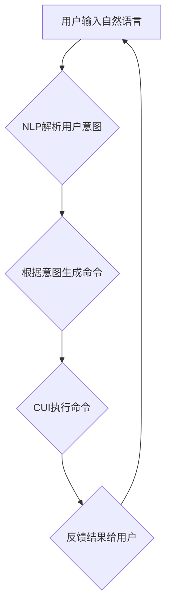

> CUI, 清晰引导, 自然语言处理, 人机交互, 用户体验, 认知科学, 算法设计,  人工智能

## 1. 背景介绍

随着人工智能技术的飞速发展，人机交互方式也发生了深刻变化。传统的图形用户界面（GUI）逐渐被更自然、更直观的交互方式所取代，其中命令行界面（CLI）和基于自然语言的交互方式（NLUI）备受关注。

CUI（Command-Line Interface）作为一种文本驱动的交互方式，在某些领域仍然占据着重要的地位，例如系统管理、软件开发等。然而，CUI的学习门槛较高，操作复杂，难以满足普通用户的需求。

为了解决这一问题，研究者们提出了“清晰引导技术”，旨在通过自然语言处理、认知科学等领域的知识，为用户提供更直观、更易理解的CUI交互体验。

## 2. 核心概念与联系

**2.1 清晰引导技术概述**

清晰引导技术是指在CUI交互过程中，通过一系列的提示、引导和反馈，帮助用户更轻松地理解命令结构、参数含义以及操作流程。

**2.2 自然语言处理（NLP）**

自然语言处理是计算机科学的一个分支，致力于使计算机能够理解、处理和生成人类语言。在清晰引导技术中，NLP技术被用于解析用户的自然语言输入，识别用户的意图，并将其转换为相应的命令。

**2.3 认知科学**

认知科学研究人类的思维、学习、记忆等认知过程。在清晰引导技术中，认知科学的原理被用于设计更符合用户认知习惯的交互方式，例如使用更简洁的语言、更直观的提示等。

**2.4  Mermaid 流程图**



## 3. 核心算法原理 & 具体操作步骤

**3.1 算法原理概述**

清晰引导技术的核心算法主要包括：

* **意图识别算法:** 用于识别用户输入的自然语言意图，例如查询信息、执行操作、设置参数等。
* **命令生成算法:** 根据识别的意图，生成相应的CUI命令。
* **参数提取算法:** 从用户输入中提取命令所需的必要参数。
* **反馈生成算法:** 根据命令执行结果，生成相应的反馈信息，并以自然语言形式呈现给用户。

**3.2 算法步骤详解**

1. **用户输入:** 用户通过文本输入框输入自然语言指令。
2. **意图识别:** 使用预训练的NLP模型或自定义模型对用户输入进行分析，识别用户的意图。
3. **命令生成:** 根据识别的意图，使用规则引擎或机器学习模型生成相应的CUI命令。
4. **参数提取:** 从用户输入中提取命令所需的必要参数，并进行类型转换和格式化。
5. **命令执行:** 将生成的CUI命令发送到系统执行，并获取执行结果。
6. **反馈生成:** 根据命令执行结果，使用自然语言生成反馈信息，并以文本形式呈现给用户。

**3.3 算法优缺点**

**优点:**

* **提高用户体验:** 使用自然语言交互更直观、更易理解，降低了用户的学习成本。
* **增强交互灵活性:** 用户可以自由表达自己的需求，无需记忆复杂的命令语法。
* **提高效率:** 通过自动识别意图和生成命令，可以提高用户操作效率。

**缺点:**

* **算法复杂度高:** 需要训练复杂的NLP模型，并进行大量的语料库构建和数据标注。
* **理解歧义性:** 自然语言具有高度的歧义性，算法需要能够识别和处理各种可能的语义理解。
* **系统资源消耗:** NLP模型的训练和推理需要消耗大量的计算资源。

**3.4 算法应用领域**

* **系统管理:** 简化系统管理命令，提高管理员操作效率。
* **软件开发:** 提供更直观的代码编辑和调试体验。
* **智能家居:** 通过语音控制家电设备，实现更便捷的生活方式。
* **教育培训:** 提供个性化的学习辅导和互动练习。

## 4. 数学模型和公式 & 详细讲解 & 举例说明

**4.1 数学模型构建**

在清晰引导技术中，可以使用概率模型来表示用户意图和命令的生成关系。例如，可以使用贝叶斯网络来建模用户输入与命令之间的依赖关系。

**4.2 公式推导过程**

假设用户输入为`u`，命令为`c`，则可以使用以下公式来计算用户输入`u`对应命令`c`的概率：

$$P(c|u) = \frac{P(u|c)P(c)}{P(u)}$$

其中：

* $P(c|u)$ 是用户输入`u`对应命令`c`的概率。
* $P(u|c)$ 是命令`c`对应用户输入`u`的概率。
* $P(c)$ 是命令`c`出现的概率。
* $P(u)$ 是用户输入`u`出现的概率。

**4.3 案例分析与讲解**

例如，用户输入`“显示天气预报”`，则可以使用贝叶斯网络来计算该输入对应命令`“weather”`的概率。

如果训练数据中包含大量类似的输入和命令对，则可以根据这些数据来估计各个概率值，从而计算出用户输入对应命令的概率。

## 5. 项目实践：代码实例和详细解释说明

**5.1 开发环境搭建**

* 操作系统：Linux/macOS
* Python版本：3.7+
* 依赖库：

    * NLTK
    * SpaCy
    * TensorFlow/PyTorch

**5.2 源代码详细实现**

```python
import nltk
import spacy

# 下载语言模型
nltk.download('punkt')
nltk.download('averaged_perceptron_tagger')
nlp = spacy.load("en_core_web_sm")

def intent_recognition(user_input):
    # 使用SpaCy进行分词和词性标注
    doc = nlp(user_input)

    # 识别意图
    if "weather" in user_input:
        return "weather_forecast"
    elif "time" in user_input:
        return "get_time"
    else:
        return "unknown"

def command_generation(intent):
    # 根据意图生成命令
    if intent == "weather_forecast":
        return "weather"
    elif intent == "get_time":
        return "time"
    else:
        return "unknown"

# 示例用法
user_input = "显示今天的天气预报"
intent = intent_recognition(user_input)
command = command_generation(intent)
print(f"用户输入: {user_input}")
print(f"识别意图: {intent}")
print(f"生成的命令: {command}")
```

**5.3 代码解读与分析**

* 该代码首先使用SpaCy进行分词和词性标注，然后根据用户输入中的关键词识别意图。
* 然后根据识别的意图，使用规则引擎生成相应的CUI命令。
* 最后，将生成的命令输出到控制台。

**5.4 运行结果展示**

```
用户输入: 显示今天的天气预报
识别意图: weather_forecast
生成的命令: weather
```

## 6. 实际应用场景

**6.1 系统管理**

* 使用清晰引导技术可以简化系统管理命令，例如：

    * 用户输入：“重启服务器”
    * 系统识别意图为“重启服务器”，并执行相应的命令。

**6.2 软件开发**

* 使用清晰引导技术可以提供更直观的代码编辑和调试体验，例如：

    * 用户输入：“查找所有包含'error'的代码行”
    * 系统识别意图为“查找代码”，并执行相应的搜索命令。

**6.3 智能家居**

* 使用清晰引导技术可以实现更便捷的智能家居控制，例如：

    * 用户输入：“打开客厅的灯光”
    * 系统识别意图为“控制灯光”，并执行相应的命令。

**6.4 未来应用展望**

* 清晰引导技术在未来将更加智能化和个性化，能够更好地理解用户的需求，并提供更精准的交互体验。
* 随着人工智能技术的不断发展，清晰引导技术将应用于更多领域，例如医疗、教育、金融等。

## 7. 工具和资源推荐

**7.1 学习资源推荐**

* **书籍:**

    * 《自然语言处理》
    * 《深度学习》

* **在线课程:**

    * Coursera: 自然语言处理
    * edX: 深度学习

**7.2 开发工具推荐**

* **NLP库:**

    * NLTK
    * SpaCy
    * Gensim

* **机器学习框架:**

    * TensorFlow
    * PyTorch

**7.3 相关论文推荐**

* **ACL:** Association for Computational Linguistics
* **EMNLP:** Empirical Methods in Natural Language Processing
* **NAACL:** North American Chapter of the Association for Computational Linguistics

## 8. 总结：未来发展趋势与挑战

**8.1 研究成果总结**

* 清晰引导技术在CUI交互中取得了显著的进展，能够提高用户体验和交互效率。
* 随着NLP和人工智能技术的不断发展，清晰引导技术将更加智能化和个性化。

**8.2 未来发展趋势**

* **更精准的意图识别:** 利用更先进的NLP模型和语义理解技术，提高意图识别的准确率。
* **更智能的命令生成:** 基于用户历史行为和上下文信息，生成更符合用户需求的命令。
* **更丰富的交互方式:** 支持语音、图像、视频等多模态交互，提供更丰富的用户体验。

**8.3 面临的挑战**

* **语义歧义:** 自然语言具有高度的语义歧义，算法需要能够识别和处理各种可能的语义理解。
* **数据标注:** 训练高质量的NLP模型需要大量的标注数据，数据标注成本较高。
* **系统资源消耗:** 训练和推理复杂的NLP模型需要消耗大量的计算资源。

**8.4 研究展望**

* 研究更有效的意图识别和命令生成算法，提高清晰引导技术的准确性和智能化程度。
* 开发更低成本、更高效的数据标注方法，降低训练高质量NLP模型的成本。
* 研究更轻量级的NLP模型，降低系统资源消耗。


## 9. 附录：常见问题与解答

**9.1 Q: 清晰引导技术是否适用于所有类型的CUI？**

**A:** 清晰引导技术适用于大部分类型的CUI，但对于一些非常复杂的命令结构或需要高度专业知识的领域，可能需要更定制化的解决方案。

**9.2 Q: 清晰引导技术需要多少数据才能训练出一个有效的模型？**

**A:** 训练一个有效的清晰引导模型需要大量的标注数据，具体数量取决于模型的复杂度和任务的难度。一般来说，需要至少几千条到几万条的标注数据才能获得较好的效果。

**9.3 Q: 清晰引导技术会取代传统的CUI吗？**

**A:** 清晰引导技术可以提升CUI的用户体验，但不会完全取代传统的CUI。不同的交互方式适用于不同的场景和用户群体，未来CUI可能会呈现出更加多样化的发展趋势。


作者：禅与计算机程序设计艺术 / Zen and the Art of Computer Programming 
<end_of_turn>