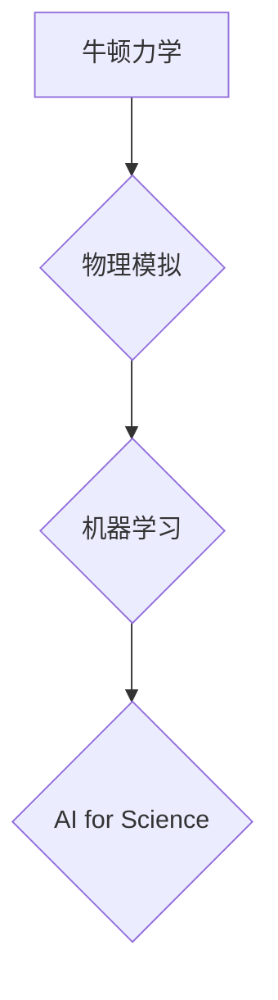

> AI for Science, 牛顿力学, 物理模拟, 机器学习, 深度学习, 优化算法

## 1. 背景介绍

人工智能（AI）正在迅速改变科学研究的格局，特别是“AI for Science”领域，它利用人工智能技术加速科学发现和创新。在众多AI技术中，机器学习和深度学习在模拟物理现象、预测物质性质、设计新材料等方面展现出巨大潜力。然而，这些AI模型的训练和优化往往依赖于大量的实验数据，而获取这些数据往往成本高昂且耗时长。

牛顿力学作为经典物理学的基础，描述了物体运动和相互作用的规律，其核心概念和定律在物理模拟中扮演着至关重要的角色。近年来，将牛顿力学原理融入AI for Science的框架中，成为了一个新的研究方向。这种融合能够有效地利用牛顿力学的先验知识，减少对实验数据的依赖，从而加速科学发现和创新。

## 2. 核心概念与联系

**2.1 牛顿力学原理**

牛顿力学主要包含三个基本定律：

* **牛顿第一定律（惯性定律）：** 任何物体都保持静止或匀速直线运动状态，除非受到外力的作用。
* **牛顿第二定律（运动定律）：** 物体的加速度与作用在它身上的力成正比，与物体的质量成反比。
* **牛顿第三定律（作用力与反作用力定律）：** 对于每一个作用力，都存在一个大小相等、方向相反的反作用力。

这些定律为描述物体运动提供了基础框架，并为物理模拟提供了数学模型。

**2.2 AI for Science**

AI for Science利用人工智能技术加速科学研究，主要包括以下几个方面：

* **数据分析和挖掘：** 利用机器学习算法从海量实验数据中发现隐藏的规律和模式。
* **物理模拟和预测：** 利用深度学习模型模拟物理现象，预测物质性质和系统行为。
* **药物设计和发现：** 利用AI算法筛选潜在的药物候选物，加速药物研发过程。
* **材料科学：** 利用AI算法设计新型材料，提高材料性能。

**2.3 融合牛顿力学与AI for Science**

将牛顿力学原理融入AI for Science的框架中，可以有效地利用牛顿力学的先验知识，减少对实验数据的依赖，从而加速科学发现和创新。

**2.4  Mermaid 流程图**



## 3. 核心算法原理 & 具体操作步骤

**3.1 算法原理概述**

将牛顿力学原理融入AI for Science的算法设计，主要有以下几种方法：

* **物理约束优化：** 在机器学习模型的训练过程中，加入牛顿力学定律作为约束条件，确保模型生成的物理模拟结果符合物理规律。
* **物理启发式搜索：** 利用牛顿力学原理设计启发式搜索算法，在搜索空间中更快地找到满足特定条件的解。
* **物理模拟增强学习：** 在强化学习算法中，利用物理模拟环境进行训练，让智能体学习如何与物理世界交互。

**3.2 算法步骤详解**

以物理约束优化为例，其具体操作步骤如下：

1. **构建物理模型：** 根据牛顿力学定律，构建描述物理系统的数学模型。
2. **定义目标函数：** 根据科学问题，定义需要优化的目标函数。
3. **加入物理约束：** 将牛顿力学定律作为约束条件，添加到目标函数中。
4. **优化算法：** 使用优化算法，例如梯度下降法，在满足物理约束条件的前提下，优化目标函数。
5. **评估结果：** 对优化后的模型进行评估，验证其物理可行性和科学意义。

**3.3 算法优缺点**

**优点：**

* 利用牛顿力学的先验知识，减少对实验数据的依赖。
* 生成的物理模拟结果更符合物理规律，提高模型的可靠性。
* 可以加速科学发现和创新。

**缺点：**

* 需要对物理系统有深入的理解，才能准确构建物理模型。
* 优化算法的复杂度较高，计算量较大。

**3.4 算法应用领域**

* **分子动力学模拟：** 模拟分子运动和相互作用，预测物质性质。
* **流体力学模拟：** 模拟流体流动，预测气流和水流的特性。
* **结构力学模拟：** 模拟结构的变形和应力，预测结构的稳定性和安全性。
* **天体物理学模拟：** 模拟天体运动和相互作用，预测星系演化和宇宙结构。

## 4. 数学模型和公式 & 详细讲解 & 举例说明

**4.1 数学模型构建**

牛顿力学的基本方程是描述物体运动的数学模型。

* **牛顿第二定律：** $F = ma$

其中：

* $F$ 是作用在物体上的合力
* $m$ 是物体的质量
* $a$ 是物体的加速度

**4.2 公式推导过程**

牛顿第二定律可以推导出物体运动的各种公式，例如：

* **匀加速直线运动公式：** $v = u + at$，$s = ut + \frac{1}{2}at^2$

其中：

* $v$ 是物体最终速度
* $u$ 是物体初始速度
* $t$ 是时间
* $s$ 是物体位移

**4.3 案例分析与讲解**

例如，一个质量为10 kg的物体受到一个5 N的力作用，从静止开始运动，求物体在5秒内的位移。

根据牛顿第二定律，物体加速度为：$a = \frac{F}{m} = \frac{5 N}{10 kg} = 0.5 m/s^2$

根据匀加速直线运动公式，物体在5秒内的位移为：$s = ut + \frac{1}{2}at^2 = 0 + \frac{1}{2} \times 0.5 m/s^2 \times (5 s)^2 = 6.25 m$

## 5. 项目实践：代码实例和详细解释说明

**5.1 开发环境搭建**

* 操作系统：Ubuntu 20.04
* Python 版本：3.8
* 库依赖：NumPy, SciPy, Matplotlib

**5.2 源代码详细实现**

```python
import numpy as np
from scipy.integrate import odeint

# 定义牛顿第二定律方程
def model(y, t, F):
    m = 10  # 物体质量
    a = F / m  # 加速度
    v = y[0]  # 速度
    return [a]

# 初始条件
y0 = [0]  # 初始速度为0

# 力
F = 5  # 作用力

# 时间范围
t = np.linspace(0, 5, 100)

# 使用odeint求解微分方程
sol = odeint(model, y0, t, args=(F,))

# 绘制速度随时间的变化曲线
import matplotlib.pyplot as plt
plt.plot(t, sol[:, 0])
plt.xlabel('时间 (s)')
plt.ylabel('速度 (m/s)')
plt.title('物体速度随时间变化曲线')
plt.show()
```

**5.3 代码解读与分析**

* `model` 函数定义了牛顿第二定律方程，根据给定的力计算物体的加速度。
* `odeint` 函数用于求解微分方程，根据牛顿第二定律方程和初始条件，计算物体的速度随时间的变化。
* `matplotlib.pyplot` 库用于绘制速度随时间的变化曲线。

**5.4 运行结果展示**

运行代码后，会生成一个物体速度随时间的变化曲线，曲线显示物体的速度随着时间的推移而线性增加。

## 6. 实际应用场景

**6.1 分子动力学模拟**

牛顿力学原理可以用于模拟分子的运动和相互作用，预测物质的性质，例如热力学性质、结构和动力学行为。

**6.2 流体力学模拟**

牛顿力学原理可以用于模拟流体的流动，预测气流和水流的特性，例如流速、压力和涡流。

**6.3 结构力学模拟**

牛顿力学原理可以用于模拟结构的变形和应力，预测结构的稳定性和安全性，例如桥梁、建筑物和飞机。

**6.4 天体物理学模拟**

牛顿力学原理可以用于模拟天体的运动和相互作用，预测星系演化和宇宙结构。

**6.5 未来应用展望**

随着人工智能技术的不断发展，将牛顿力学原理融入AI for Science的框架将会有更广泛的应用，例如：

* **药物设计和发现：** 利用物理模拟和机器学习，加速药物研发过程。
* **材料科学：** 利用物理模拟和深度学习，设计新型材料，提高材料性能。
* **气候模型：** 利用物理模拟和机器学习，构建更精确的气候模型，预测气候变化趋势。

## 7. 工具和资源推荐

**7.1 学习资源推荐**

* **书籍：**
    * 《经典力学》 - 费曼
    * 《机器学习》 - 周志华
    * 《深度学习》 - Ian Goodfellow
* **在线课程：**
    * Coursera: Machine Learning
    * edX: Deep Learning
    * MIT OpenCourseWare: Classical Mechanics

**7.2 开发工具推荐**

* **Python:** 广泛应用于科学计算和机器学习
* **NumPy:** 用于数值计算
* **SciPy:** 用于科学计算和工程应用
* **Matplotlib:** 用于数据可视化
* **TensorFlow:** 用于深度学习

**7.3 相关论文推荐**

* **Physics-Informed Neural Networks for Solving Partial Differential Equations**
* **Deep Learning for Molecular Dynamics Simulations**
* **Physics-Based Reinforcement Learning for Robotics**

## 8. 总结：未来发展趋势与挑战

**8.1 研究成果总结**

将牛顿力学原理融入AI for Science的框架中，取得了显著的成果，例如：

* 提高了物理模拟的准确性和效率
* 加速了科学发现和创新
* 推动了新材料和新技术的研发

**8.2 未来发展趋势**

* **更复杂的物理模型：** 将更复杂的物理模型融入AI for Science的框架中，模拟更复杂的物理现象。
* **更强大的机器学习算法：** 开发更强大的机器学习算法，提高物理模拟的精度和效率。
* **多学科融合：** 将牛顿力学与其他学科，例如化学、生物学和材料科学，进行融合，推动跨学科研究。

**8.3 面临的挑战**

* **模型复杂度：** 构建复杂的物理模型和训练复杂的机器学习模型，需要大量的计算资源和时间。
* **数据获取：** 获取高质量的物理数据用于训练机器学习模型仍然是一个挑战。
* **模型解释性：** 提高物理模拟模型的解释性，帮助科学家理解模型的预测结果。

**8.4 研究展望**

未来，将牛顿力学原理融入AI for Science的研究将继续深入，推动科学发现和技术创新。


## 9. 附录：常见问题与解答

**9.1 如何选择合适的物理模型？**

选择合适的物理模型取决于具体的科学问题和研究目标。需要根据问题的性质，选择能够准确描述问题的物理模型。

**9.2 如何处理物理数据？**

物理数据通常是高维和复杂的数据，需要进行预处理，例如数据清洗、特征提取和数据归一化。

**9.3 如何评估物理模拟模型的性能？**

可以使用多种方法评估物理模拟模型的性能，例如与实验数据进行比较、计算模型的误差和评估模型的