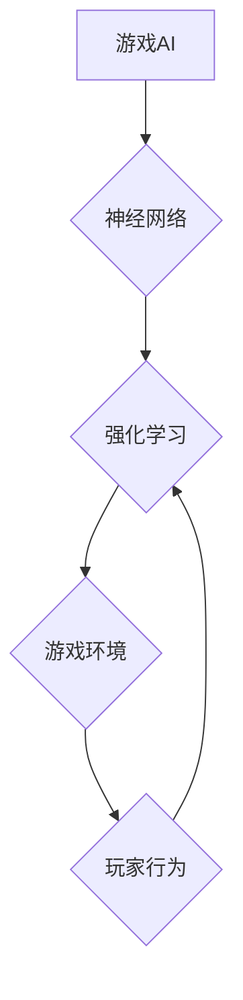

> 游戏AI, 神经网络, 深度学习, 强化学习, 决策树, 策略优化, 自然语言处理, 虚拟助手

## 1. 背景介绍

游戏行业近年来蓬勃发展，玩家对游戏体验的要求也越来越高。其中，游戏AI作为游戏体验的重要组成部分，其发展也日益受到关注。传统的基于规则的游戏AI存在局限性，难以应对复杂的游戏环境和玩家行为。而神经网络作为一种强大的机器学习算法，为游戏AI的发展带来了新的机遇。

神经网络能够学习和模拟人类大脑的运作方式，通过大量的训练数据，学习到复杂的模式和关系。这使得神经网络能够在游戏场景中实现更智能、更逼真的AI行为，例如：

* **更具策略性的决策:** 神经网络可以学习到游戏的策略和战术，并根据游戏状态做出更合理的决策。
* **更逼真的角色行为:** 神经网络可以学习到角色的性格和行为模式，使角色的行为更加自然和真实。
* **更丰富的游戏体验:** 神经网络可以为游戏添加新的玩法和挑战，例如，生成随机事件、创建新的游戏关卡等。

## 2. 核心概念与联系

### 2.1 神经网络

神经网络是一种模仿人脑神经网络结构的算法模型。它由多个相互连接的神经元组成，每个神经元接收来自其他神经元的输入信号，并根据这些信号进行处理，最终输出信号。神经网络通过调整神经元之间的连接权重来学习，从而实现对数据的学习和预测。

### 2.2 游戏AI

游戏AI是指在游戏中模拟智能行为的系统。传统的基于规则的游戏AI依赖于人工设计的规则和逻辑，而神经网络驱动的游戏AI则能够通过学习和训练，自动学习游戏的规则和策略。

### 2.3 强化学习

强化学习是一种机器学习方法，它通过奖励和惩罚机制来训练智能体，使其在特定环境中学习最优策略。在游戏AI中，强化学习可以用来训练AI代理，使其能够在游戏中取得更高的分数或完成特定的任务。

**核心概念与联系流程图:**



## 3. 核心算法原理 & 具体操作步骤

### 3.1 算法原理概述

神经网络在游戏AI中的应用主要基于深度学习和强化学习算法。深度学习算法可以用于学习游戏状态的特征表示，而强化学习算法可以用于训练AI代理，使其能够在游戏中做出最优决策。

### 3.2 算法步骤详解

1. **数据收集:** 收集大量的游戏数据，包括游戏状态、玩家行为和游戏结果。
2. **数据预处理:** 对收集到的数据进行预处理，例如，归一化、特征提取等。
3. **模型构建:** 选择合适的深度学习模型，例如卷积神经网络（CNN）或循环神经网络（RNN），并根据游戏特点进行调整。
4. **模型训练:** 使用强化学习算法，例如Q学习或深度Q网络（DQN），训练模型，使其能够学习到游戏的策略和战术。
5. **模型评估:** 在测试集上评估模型的性能，并根据评估结果进行模型调优。
6. **模型部署:** 将训练好的模型部署到游戏中，使AI代理能够在游戏中做出智能决策。

### 3.3 算法优缺点

**优点:**

* **学习能力强:** 神经网络能够学习到复杂的模式和关系，从而实现更智能的AI行为。
* **适应性强:** 神经网络能够适应不同的游戏环境和玩家行为。
* **可扩展性强:** 神经网络可以很容易地扩展到更大的游戏世界和更复杂的AI行为。

**缺点:**

* **训练成本高:** 神经网络的训练需要大量的计算资源和时间。
* **数据依赖性强:** 神经网络的性能取决于训练数据的质量和数量。
* **可解释性差:** 神经网络的决策过程难以理解和解释。

### 3.4 算法应用领域

神经网络在游戏AI领域的应用非常广泛，例如：

* **角色行为控制:** 控制游戏角色的行动、对话和表情等。
* **游戏策略决策:** 帮助AI代理制定游戏策略，例如，在策略游戏（如围棋、象棋）中制定最佳策略。
* **游戏关卡生成:** 生成新的游戏关卡和挑战。
* **游戏剧情设计:** 帮助设计更具沉浸性和互动性的游戏剧情。

## 4. 数学模型和公式 & 详细讲解 & 举例说明

### 4.1 数学模型构建

在神经网络中，常用的数学模型是多层感知机（MLP）。MLP由多个神经元层组成，每个神经元接收来自上一层神经元的输入信号，并通过激活函数进行处理，输出到下一层神经元。

**MLP模型结构:**

```
输入层 -> 隐藏层1 -> 隐藏层2 -> ... -> 隐藏层n -> 输出层
```

### 4.2 公式推导过程

**激活函数:**

激活函数的作用是将神经元的输入信号转换为输出信号。常用的激活函数包括 sigmoid 函数、ReLU 函数等。

**sigmoid 函数:**

$$
f(x) = \frac{1}{1 + e^{-x}}
$$

**ReLU 函数:**

$$
f(x) = max(0, x)
$$

**损失函数:**

损失函数用于衡量模型预测结果与真实结果之间的误差。常用的损失函数包括均方误差（MSE）和交叉熵损失函数。

**MSE:**

$$
L = \frac{1}{N} \sum_{i=1}^{N} (y_i - \hat{y}_i)^2
$$

**交叉熵损失函数:**

$$
L = -\sum_{i=1}^{N} y_i \log(\hat{y}_i) + (1-y_i) \log(1-\hat{y}_i)
$$

**梯度下降算法:**

梯度下降算法用于更新模型参数，使其能够最小化损失函数。

### 4.3 案例分析与讲解

**举例说明:**

假设我们训练一个神经网络模型，用于预测游戏玩家的下一步行动。我们可以使用游戏历史数据作为训练数据，并使用交叉熵损失函数和梯度下降算法进行模型训练。

## 5. 项目实践：代码实例和详细解释说明

### 5.1 开发环境搭建

* **操作系统:** Ubuntu 18.04
* **编程语言:** Python 3.6
* **深度学习框架:** TensorFlow 2.0

### 5.2 源代码详细实现

```python
import tensorflow as tf

# 定义模型结构
model = tf.keras.models.Sequential([
    tf.keras.layers.Dense(64, activation='relu', input_shape=(input_dim,)),
    tf.keras.layers.Dense(32, activation='relu'),
    tf.keras.layers.Dense(num_actions, activation='softmax')
])

# 编译模型
model.compile(optimizer='adam',
              loss='categorical_crossentropy',
              metrics=['accuracy'])

# 训练模型
model.fit(x_train, y_train, epochs=10, batch_size=32)

# 评估模型
loss, accuracy = model.evaluate(x_test, y_test)
print('Loss:', loss)
print('Accuracy:', accuracy)
```

### 5.3 代码解读与分析

* **模型结构:** 模型结构由三个全连接层组成，第一层输入维度为 `input_dim`，最后一层输出维度为 `num_actions`，表示游戏中的动作数量。
* **激活函数:** 使用ReLU函数作为隐藏层的激活函数，softmax函数作为输出层的激活函数，用于将输出转换为概率分布。
* **损失函数:** 使用交叉熵损失函数，用于衡量模型预测结果与真实结果之间的误差。
* **优化器:** 使用Adam优化器，用于更新模型参数。

### 5.4 运行结果展示

训练完成后，可以将模型部署到游戏中，并观察AI代理在游戏中表现。

## 6. 实际应用场景

### 6.1 游戏角色行为控制

神经网络可以用于控制游戏角色的行为，例如：

* **路径规划:** 训练神经网络学习角色在游戏世界中移动的最佳路径。
* **动作决策:** 训练神经网络学习角色在不同游戏场景下做出最优动作。
* **表情和对话:** 训练神经网络学习角色的表情和对话，使其更加自然和逼真。

### 6.2 游戏策略决策

神经网络可以用于训练AI代理制定游戏策略，例如：

* **策略游戏:** 训练神经网络学习围棋、象棋等策略游戏的最佳策略。
* **实时策略游戏:** 训练神经网络学习星际争霸、魔兽争霸等实时策略游戏的最佳战术。

### 6.3 游戏关卡生成

神经网络可以用于生成新的游戏关卡和挑战，例如：

* **随机关卡生成:** 训练神经网络学习生成随机的关卡布局和敌人配置。
* **个性化关卡生成:** 训练神经网络根据玩家的喜好和游戏进度生成个性化的关卡。

### 6.4 未来应用展望

神经网络在游戏AI领域的应用前景广阔，未来可能出现以下应用场景：

* **更逼真的NPC:** 神经网络可以使游戏中的NPC更加智能和逼真，能够与玩家进行更自然的互动。
* **更丰富的游戏体验:** 神经网络可以为游戏添加新的玩法和挑战，例如，生成随机事件、创建新的游戏关卡等。
* **个性化游戏体验:** 神经网络可以根据玩家的喜好和游戏习惯，定制个性化的游戏体验。

## 7. 工具和资源推荐

### 7.1 学习资源推荐

* **书籍:**
    * Deep Learning by Ian Goodfellow, Yoshua Bengio, and Aaron Courville
    * Hands-On Machine Learning with Scikit-Learn, Keras & TensorFlow by Aurélien Géron
* **在线课程:**
    * TensorFlow Tutorials: https://www.tensorflow.org/tutorials
    * Deep Learning Specialization by Andrew Ng: https://www.deeplearning.ai/

### 7.2 开发工具推荐

* **深度学习框架:** TensorFlow, PyTorch, Keras
* **游戏引擎:** Unity, Unreal Engine

### 7.3 相关论文推荐

* **Deep Reinforcement Learning with Double Q-learning**
* **Playing Atari with Deep Reinforcement Learning**
* **AlphaGo: Mastering the Game of Go with Deep Neural Networks and Tree Search**

## 8. 总结：未来发展趋势与挑战

### 8.1 研究成果总结

神经网络在游戏AI领域取得了显著的成果，例如，AlphaGo在围棋游戏中战胜了世界冠军，OpenAI Five在Dota 2游戏中战胜了职业玩家。这些成果证明了神经网络在游戏AI领域的巨大潜力。

### 8.2 未来发展趋势

* **更强大的模型:** 研究人员将继续开发更强大的神经网络模型，例如，Transformer模型、生成对抗网络（GAN）等，以实现更智能和逼真的游戏AI。
* **更有效的训练方法:** 研究人员将继续探索更有效的训练方法，例如，强化学习算法的改进、迁移学习等，以降低模型训练成本和时间。
* **更广泛的应用场景:** 神经网络将在更多类型的游戏中得到应用，例如，角色扮演游戏、策略游戏、体育游戏等。

### 8.3 面临的挑战

* **数据获取和标注:** 训练神经网络模型需要大量的游戏数据，而获取和标注这些数据非常耗时和费力。
* **模型解释性:** 神经网络的决策过程难以理解和解释，这可能会导致模型的不可信性和可解释性问题。
* **伦理问题:** 游戏AI的应用可能会引发一些伦理问题，例如，AI代理是否应该具有自主性，AI代理是否应该被视为人？

### 8.4 研究展望

未来，游戏AI研究将继续朝着更智能、更逼真、更安全的方向发展。研究人员将继续探索新的算法、模型和训练方法，以解决当前面临的挑战，并为玩家带来更丰富的游戏体验。

## 9. 附录：常见问题与解答

**Q1: 神经网络在游戏AI中的应用有哪些优势？**

**A1:** 神经网络