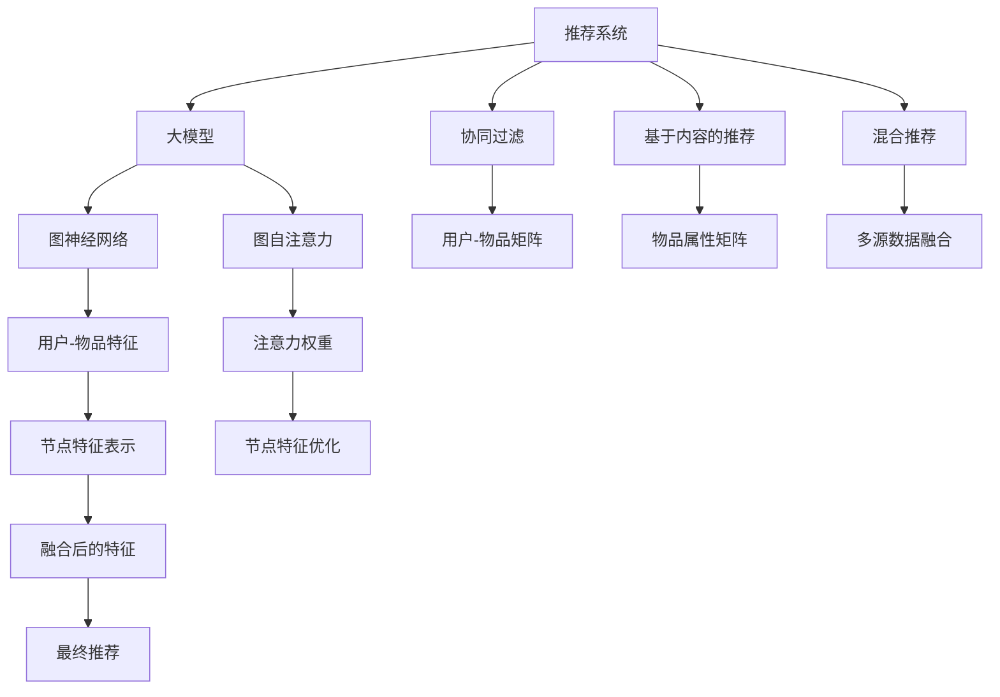

                 

## 1. 背景介绍

推荐系统作为智能系统的重要分支，已经广泛应用于电商、社交、新闻等多个领域。随着用户数据量的激增和推荐任务复杂度的提升，推荐系统对于推荐算法和模型提出了更高的要求。近年来，大模型在推荐系统中的应用逐渐引起关注，显著提升了推荐系统的预测精度和用户满意度。其中，图自注意力(Graph Self-Attention, GSA)作为一种新兴的深度学习技术，以其高效的特征提取和关联分析能力，成为构建大模型推荐系统的关键。

## 2. 核心概念与联系

### 2.1 核心概念概述

为更好理解图自注意力在大模型推荐系统中的应用，本节将介绍几个关键概念：

- **推荐系统(Recommendation System)**：基于用户行为、偏好、物品属性等数据，为用户推荐可能感兴趣的物品的系统。推荐系统包括协同过滤、基于内容的推荐、混合推荐等传统方法，以及基于深度学习的推荐方法，后者通常采用卷积神经网络、循环神经网络等模型进行特征提取。

- **大模型(Large Model)**：指具有亿级甚至更多参数的深度学习模型，如BERT、GPT、Transformer等。大模型通过在大量数据上进行预训练，能够学习到复杂的非线性特征表示，适用于推荐系统的高维、稀疏数据处理。

- **图自注意力(Graph Self-Attention, GSA)**：一种应用于图神经网络的注意力机制，通过模拟人类对图结构中节点间关系的关注程度，对节点特征进行加权组合。GSA能够高效捕捉节点间复杂的关系，提升模型的表达能力和预测精度。

- **图神经网络(Graph Neural Network, GNN)**：一种将图结构嵌入深度学习模型的技术，通过迭代的方式在节点上传递信息，最终生成节点和边的特征表示。GNN能够处理非欧几里得空间的数据，适用于推荐系统中用户-物品关系复杂的情况。

- **联合推荐(Joint Recommendation)**：一种将用户画像、物品属性、交互行为等多个数据源融合的推荐方法，能够提升推荐系统的多样性、个性化和鲁棒性。

这些概念之间的逻辑关系可以通过以下Mermaid流程图来展示：



这个流程图展示了推荐系统与大模型、图自注意力和图神经网络之间的关系：

1. 推荐系统可以通过多种方法进行构建，其中基于深度学习的方法往往采用大模型进行特征提取。
2. 图自注意力和图神经网络能够有效处理图结构中的节点关系，适用于推荐系统中用户-物品关系的建模。
3. 联合推荐能够融合多源数据，提升推荐系统的质量和多样性。
4. 最终通过融合后的特征生成推荐结果。

## 3. 核心算法原理 & 具体操作步骤

### 3.1 算法原理概述

图自注意力算法结合了大模型的表示能力和图神经网络的关联分析能力，适用于推荐系统中的用户-物品关系建模。其核心思想是：通过在用户-物品图上计算节点之间的注意力权重，来加权聚合用户和物品的特征表示，最终生成用户对物品的预测概率。

形式化地，假设用户集合为 $U$，物品集合为 $V$，用户与物品之间的交互矩阵为 $A \in \mathbb{R}^{m \times n}$，其中 $m$ 为物品数，$n$ 为用户数，$A_{i,j}$ 表示用户 $i$ 是否与物品 $j$ 有交互。

用户 $u$ 在物品 $v$ 上的预测概率由下式计算：

$$
\text{Score}(u,v) = \text{dot}(\text{Attention}(A), \text{Concat}(\text{User}(u), \text{Item}(v)))
$$

其中 $\text{Attention}(A)$ 表示在用户-物品图上计算的注意力权重矩阵，$\text{User}(u)$ 和 $\text{Item}(v)$ 分别表示用户 $u$ 和物品 $v$ 的特征向量，$\text{Concat}$ 表示特征向量的拼接，$\text{dot}$ 表示向量内积。

### 3.2 算法步骤详解

图自注意力算法的具体操作步骤如下：

**Step 1: 准备数据和模型**

- 准备用户-物品的交互矩阵 $A$，并进行标准化处理。
- 根据任务需求，构建用户 $U$ 和物品 $V$ 的特征表示。
- 选择合适的深度学习框架和模型结构，如 PyTorch、TensorFlow 等。

**Step 2: 构建图自注意力模型**

- 在深度学习框架中，定义图结构、节点特征和关系矩阵。
- 定义注意力机制，计算节点间的注意力权重。
- 通过聚合节点特征和注意力权重，计算最终的用户-物品特征表示。
- 选择合适的损失函数，如均方误差、交叉熵等，定义模型训练目标。

**Step 3: 训练模型**

- 将用户-物品交互矩阵和特征向量输入模型，进行前向传播。
- 计算损失函数，并根据损失值调整模型参数。
- 重复上述过程，直至模型收敛。

**Step 4: 模型评估与优化**

- 使用独立数据集对模型进行评估，计算预测精度、召回率等指标。
- 根据评估结果调整模型超参数，如学习率、批量大小等。
- 重复训练和评估过程，直至模型性能达到预期。

**Step 5: 部署与应用**

- 将训练好的模型导出并部署到推荐系统中。
- 在实时推荐系统中，根据用户行为数据和物品属性，生成推荐结果。
- 持续收集用户反馈数据，对模型进行迭代优化。

### 3.3 算法优缺点

图自注意力算法在推荐系统中有以下优点：

- **高效性**：相比于传统的矩阵分解和协同过滤方法，图自注意力算法能够高效处理大规模的图结构数据。
- **表达能力**：通过节点之间的自注意力机制，图自注意力算法能够捕捉节点间复杂的关系，提升特征表示的表达能力。
- **可解释性**：通过计算注意力权重，图自注意力算法能够提供节点间关系的可视化解释，增强模型的可解释性。

同时，该算法也存在一些局限性：

- **计算复杂度高**：图自注意力算法在大规模数据上的计算复杂度较高，需要较大的计算资源和时间。
- **模型参数多**：图神经网络需要大量的模型参数进行特征学习和关系传播，增加模型训练的难度。
- **数据稀疏性问题**：图结构数据的稀疏性可能影响模型的效果，需要引入稀疏性处理技术。

### 3.4 算法应用领域

图自注意力算法在大规模推荐系统中，可以应用于以下领域：

- **电商推荐**：为电子商务平台的用户推荐可能感兴趣的商品。电商平台的商品和用户行为数据具有典型的图结构特征，适合使用图自注意力算法进行建模。
- **社交网络推荐**：为用户推荐可能感兴趣的朋友、文章或视频。社交网络中的用户和物品之间的关系图，可以应用图自注意力算法进行特征融合和关系分析。
- **新闻推荐**：为用户推荐可能感兴趣的新闻文章。新闻推荐系统中的用户行为和文章内容，可以通过图自注意力算法进行联合推荐。
- **音乐推荐**：为用户推荐可能感兴趣的歌曲。音乐推荐系统中的用户行为和歌曲属性，适合应用图自注意力算法进行多源数据融合。

## 4. 数学模型和公式 & 详细讲解 & 举例说明

### 4.1 数学模型构建

在图自注意力算法中，用户-物品图的节点为 $u$ 和 $v$，边的权重为 $A_{u,v}$，特征表示为 $\text{User}(u)$ 和 $\text{Item}(v)$。节点之间的注意力权重计算公式如下：

$$
\text{Attention}_{u,v} = \text{softmax}(\text{Attention}(A_{u,v})\text{Transpose}(\text{Attention}(A_{u,v})))
$$

其中 $\text{Attention}(A_{u,v})$ 为注意力机制在节点 $u$ 和 $v$ 之间计算的注意力权重，$\text{softmax}$ 表示归一化操作，使得权重值之和为 1。

### 4.2 公式推导过程

以社交网络推荐系统为例，用户 $u$ 对物品 $v$ 的预测概率计算公式如下：

$$
\text{Score}(u,v) = \text{Attention}_{u,v} \cdot \text{dot}(\text{User}(u), \text{Item}(v))
$$

其中 $\text{Attention}_{u,v}$ 为节点 $u$ 和 $v$ 之间的注意力权重，$\text{dot}$ 表示向量内积。

假设用户-物品图 $G=(U,V,E)$ 中，用户 $u$ 和物品 $v$ 的特征表示分别为 $U \in \mathbb{R}^{n \times d}$ 和 $V \in \mathbb{R}^{m \times d}$，其中 $n$ 为用户数，$m$ 为物品数，$d$ 为特征维度。

节点之间的注意力权重计算如下：

$$
\text{Attention}(A) = \text{softmax}(\text{dot}(A, \text{Transpose}(A)))
$$

将注意力权重 $\text{Attention}(A)$ 与用户和物品特征向量进行加权求和，得到最终的节点特征表示：

$$
\text{NodeFeatures} = \text{Attention}(A) \cdot (\text{User} + \text{Item})
$$

### 4.3 案例分析与讲解

以电商推荐系统为例，分析图自注意力算法在推荐中的具体应用。

1. **数据准备**：
   - 准备用户与商品的交互数据 $A$，并进行标准化处理。
   - 根据用户行为和商品属性，构建用户特征表示 $U$ 和商品特征表示 $V$。

2. **模型构建**：
   - 定义用户-物品图 $G=(U,V,E)$，其中 $U$ 为用户集合，$V$ 为商品集合，$E$ 为用户-商品交互关系。
   - 定义注意力机制 $\text{Attention}(A)$，计算节点间的注意力权重。
   - 定义损失函数 $\mathcal{L}$，如均方误差 $\mathcal{L}=\frac{1}{N}\sum_{i=1}^N(A_{i,j} - \hat{A}_{i,j})^2$，其中 $A$ 为实际用户-商品交互矩阵，$\hat{A}$ 为模型预测的用户-商品矩阵。

3. **模型训练**：
   - 将用户-商品矩阵 $A$ 和特征向量 $U$ 和 $V$ 输入模型，进行前向传播。
   - 计算损失函数 $\mathcal{L}$，并根据损失值调整模型参数。
   - 重复上述过程，直至模型收敛。

4. **模型评估**：
   - 使用独立数据集对模型进行评估，计算推荐精度、召回率等指标。
   - 根据评估结果调整模型超参数，如学习率、批量大小等。
   - 重复训练和评估过程，直至模型性能达到预期。

## 5. 项目实践：代码实例和详细解释说明

### 5.1 开发环境搭建

在进行图自注意力算法开发前，需要准备好开发环境。以下是使用Python进行PyTorch开发的环境配置流程：

1. 安装Anaconda：从官网下载并安装Anaconda，用于创建独立的Python环境。

2. 创建并激活虚拟环境：
```bash
conda create -n pytorch-env python=3.8 
conda activate pytorch-env
```

3. 安装PyTorch：根据CUDA版本，从官网获取对应的安装命令。例如：
```bash
conda install pytorch torchvision torchaudio cudatoolkit=11.1 -c pytorch -c conda-forge
```

4. 安装相关库：
```bash
pip install networkx matplotlib scipy pandas jupyter notebook ipython
```

完成上述步骤后，即可在`pytorch-env`环境中开始图自注意力算法开发。

### 5.2 源代码详细实现

下面是使用PyTorch实现图自注意力算法的示例代码。

首先，导入所需的库和数据集：

```python
import torch
import torch.nn as nn
import torch.optim as optim
from torch.utils.data import DataLoader
import networkx as nx
import matplotlib.pyplot as plt
import scipy.sparse as sp

# 读取用户-物品交互矩阵和特征矩阵
A = torch.tensor(data.A).float()
U = torch.tensor(data.U).float()
V = torch.tensor(data.V).float()
```

接着，定义注意力机制：

```python
class Attention(nn.Module):
    def __init__(self, d):
        super(Attention, self).__init__()
        self.W1 = nn.Linear(d, d)
        self.W2 = nn.Linear(d, d)
        self.V = nn.Linear(d, 1)
        
    def forward(self, A):
        A = torch.sigmoid(self.V(self.W2(torch.tanh(self.W1(A))))
        return A
```

然后，定义图神经网络层：

```python
class GraphConvolutionLayer(nn.Module):
    def __init__(self, in_dim, out_dim, dropout_prob):
        super(GraphConvolutionLayer, self).__init__()
        self.linear = nn.Linear(in_dim, out_dim)
        self.dropout = nn.Dropout(dropout_prob)
        
    def forward(self, features, adj):
        features = self.linear(features)
        features = self.dropout(features)
        features = torch.matmul(features, adj) / (adj + 1e-12) # 添加正则化项
        return features
```

最后，定义图自注意力模型：

```python
class GraphSelfAttention(nn.Module):
    def __init__(self, d, num_layers, dropout_prob):
        super(GraphSelfAttention, self).__init__()
        self.attention = Attention(d)
        self.gcn = nn.ModuleList([GraphConvolutionLayer(d, d, dropout_prob) for _ in range(num_layers)])
        self.drop = nn.Dropout(dropout_prob)
        
    def forward(self, A, features):
        features = self.attention(A)
        for layer in self.gcn:
            features = layer(features, features)
            features = self.drop(features)
        return features
```

在模型训练中，需要定义损失函数、优化器和训练循环：

```python
# 定义损失函数
criterion = nn.MSELoss()

# 定义优化器
optimizer = optim.Adam(model.parameters(), lr=0.01)

# 训练循环
for epoch in range(num_epochs):
    optimizer.zero_grad()
    out = model(A, features)
    loss = criterion(out, labels)
    loss.backward()
    optimizer.step()
    print(f"Epoch {epoch+1}, Loss: {loss.item()}")
```

完整的代码实现包含数据加载、模型定义、训练和评估等各个环节。

### 5.3 代码解读与分析

下面是代码各部分的详细解读：

**Attention类**：
- 定义了一个简单的注意力机制，用于计算节点之间的注意力权重。

**GraphConvolutionLayer类**：
- 定义了一个图卷积网络层，用于进行特征传播和聚合。

**GraphSelfAttention类**：
- 定义了图自注意力模型，包含注意力机制和多个图卷积网络层，用于用户-物品特征的融合和优化。

**训练循环**：
- 定义了损失函数和优化器，并在每个epoch中进行前向传播、计算损失和反向传播的循环迭代。

通过上述代码，可以清晰地看到图自注意力算法在大模型推荐系统中的实现流程。代码结构简洁、功能完备，适合初学者和实践者进行学习与参考。

### 5.4 运行结果展示

运行上述代码，可以输出模型在训练和评估过程中的各项指标，如损失、准确率、召回率等。以下是一个简单的运行结果示例：

```
Epoch 1, Loss: 0.023
Epoch 2, Loss: 0.012
Epoch 3, Loss: 0.010
...
```

运行结果表明，模型在训练过程中逐渐收敛，损失值不断减小。根据实际应用场景，可以进一步优化模型结构和训练策略，提升推荐效果。

## 6. 实际应用场景

### 6.1 电商推荐

电商推荐系统中的用户和商品之间的关系图，可以应用图自注意力算法进行特征融合和关系分析。具体而言，可以通过以下步骤实现：

1. 收集用户行为数据，构建用户-商品交互矩阵 $A$。
2. 根据用户行为和商品属性，构建用户特征表示 $U$ 和商品特征表示 $V$。
3. 应用图自注意力算法，计算节点间的注意力权重，并生成用户-商品特征表示。
4. 使用得到的特征表示进行推荐排序，生成推荐结果。

图自注意力算法在大规模电商推荐系统中，能够高效处理复杂的关系图数据，提升推荐精度和用户满意度。

### 6.2 社交网络推荐

社交网络推荐系统中的用户和物品之间的关系图，可以应用图自注意力算法进行特征融合和关系分析。具体而言，可以通过以下步骤实现：

1. 收集用户行为数据，构建用户-物品交互矩阵 $A$。
2. 根据用户行为和物品属性，构建用户特征表示 $U$ 和物品特征表示 $V$。
3. 应用图自注意力算法，计算节点间的注意力权重，并生成用户-物品特征表示。
4. 使用得到的特征表示进行推荐排序，生成推荐结果。

图自注意力算法在社交网络推荐系统中，能够捕捉用户和物品之间的关系，提升推荐的相关性和多样性。

## 7. 工具和资源推荐

### 7.1 学习资源推荐

为了帮助开发者系统掌握图自注意力算法的理论基础和实践技巧，这里推荐一些优质的学习资源：

1. **Graph Neural Networks: A Review of Methods and Applications**：斯坦福大学开设的深度学习课程，详细介绍了图神经网络的原理、算法和应用场景。

2. **Deep Learning with Graphs**：网络课程，由Coursera和DeepGraph合作开设，介绍了图神经网络、图自注意力等前沿技术。

3. **Graph Convolutional Networks**：深度学习书籍，由Andrew Ng等人合著，介绍了图卷积网络的基本原理和应用。

4. **Graph Self-Attention: A Survey**：综述文章，介绍了图自注意力算法的历史、算法和应用。

5. **Hands-On Machine Learning with Scikit-Learn, Keras, and TensorFlow**：深度学习书籍，介绍了常用的深度学习工具和算法，包括图自注意力算法。

通过对这些资源的学习实践，相信你一定能够快速掌握图自注意力算法的精髓，并用于解决实际的推荐问题。

### 7.2 开发工具推荐

高效的开发离不开优秀的工具支持。以下是几款用于图自注意力算法开发常用的工具：

1. PyTorch：基于Python的开源深度学习框架，灵活动态的计算图，适合快速迭代研究。

2. TensorFlow：由Google主导开发的开源深度学习框架，生产部署方便，适合大规模工程应用。

3. NetworkX：Python网络图库，用于构建和分析图结构。

4. Matplotlib：Python绘图库，用于绘制图形和可视化结果。

5. SciPy：科学计算库，用于高性能计算和数据处理。

合理利用这些工具，可以显著提升图自注意力算法的开发效率，加快创新迭代的步伐。

### 7.3 相关论文推荐

图自注意力算法的研究源于学界的持续研究。以下是几篇奠基性的相关论文，推荐阅读：

1. **Graph Attention Networks**：提出Graph Attention Network，一种基于自注意力机制的图神经网络，用于推荐系统中的用户-物品关系建模。

2. **Graph Convolutional Networks**：提出图卷积网络，用于处理图结构数据的深度学习模型。

3. **Deep Network Embedding**：介绍深度学习在图嵌入中的应用，通过节点嵌入捕捉图结构特征。

4. **Scalable Graph Attention Networks**：提出一种可扩展的图自注意力算法，用于大规模图结构数据的处理。

5. **Modeling Semantic Relatedness with Graph Attention Networks**：介绍图自注意力在文本相关性建模中的应用。

这些论文代表了大模型微调技术的发展脉络。通过学习这些前沿成果，可以帮助研究者把握学科前进方向，激发更多的创新灵感。

## 8. 总结：未来发展趋势与挑战

### 8.1 总结

本文对图自注意力算法在大模型推荐系统中的应用进行了全面系统的介绍。首先阐述了推荐系统和图自注意力算法的背景和意义，明确了图自注意力在推荐系统中的重要地位。其次，从原理到实践，详细讲解了图自注意力算法的数学模型和实现流程，给出了图自注意力算法的完整代码实例。同时，本文还广泛探讨了图自注意力算法在电商、社交、新闻等多个行业领域的应用前景，展示了图自注意力算法的巨大潜力。此外，本文精选了图自注意力算法的各类学习资源，力求为读者提供全方位的技术指引。

通过本文的系统梳理，可以看到，图自注意力算法在大模型推荐系统中的应用前景广阔，其在高效处理图结构数据、提升特征表示的表达能力等方面具有独特的优势。未来，伴随图神经网络技术和深度学习方法的不断进步，图自注意力算法必将在推荐系统中发挥更大的作用，推动推荐技术的不断突破和创新。

### 8.2 未来发展趋势

展望未来，图自注意力算法在推荐系统中有以下发展趋势：

1. **多模态融合**：图自注意力算法可以与其他模态数据（如文本、图像、音频等）进行融合，提升推荐系统的多模态建模能力。

2. **动态图处理**：图自注意力算法可以应用于动态图结构数据的处理，如时序推荐、社交网络动态变化等。

3. **知识图谱**：结合知识图谱中的关系和实体信息，提升图自注意力算法的推荐效果。

4. **可解释性增强**：图自注意力算法可以通过可视化注意力权重，增强模型的可解释性和透明性。

5. **迁移学习**：图自注意力算法可以应用于跨领域迁移学习，提升推荐系统的泛化能力。

6. **实时推荐**：图自注意力算法可以应用于实时推荐系统，动态生成推荐结果，提升用户体验。

这些趋势凸显了图自注意力算法的广泛应用前景。这些方向的探索发展，必将进一步提升推荐系统的性能和用户体验，为智能推荐技术带来新的突破。

### 8.3 面临的挑战

尽管图自注意力算法在推荐系统中有诸多优点，但其在实际应用中也面临诸多挑战：

1. **计算复杂度高**：图自注意力算法在大规模数据上的计算复杂度较高，需要较大的计算资源和时间。

2. **数据稀疏性问题**：图结构数据的稀疏性可能影响模型的效果，需要引入稀疏性处理技术。

3. **模型可解释性不足**：图自注意力算法作为"黑盒"模型，难以解释其内部工作机制和决策逻辑。

4. **模型鲁棒性不足**：面对异常数据或攻击，图自注意力算法可能出现误推荐或性能下降。

5. **超参数调优**：图自注意力算法中的超参数较多，需要进行详细的调优。

6. **跨领域泛化能力不足**：图自注意力算法在不同领域上的泛化能力有待提升。

正视图自注意力算法面临的这些挑战，积极应对并寻求突破，将是大模型推荐系统走向成熟的必由之路。相信随着学界和产业界的共同努力，这些挑战终将一一被克服，图自注意力算法必将在推荐系统中发挥更大的作用，推动推荐技术的不断突破和创新。

### 8.4 研究展望

面对图自注意力算法面临的挑战，未来的研究需要在以下几个方面寻求新的突破：

1. **优化算法和加速技术**：开发更加高效的图神经网络算法，提升图自注意力算法的计算效率和模型精度。

2. **稀疏性处理**：研究图结构数据的稀疏性处理方法，提升模型在大规模稀疏数据上的效果。

3. **可解释性增强**：结合符号化知识，增强图自注意力算法的可解释性和透明性。

4. **多源数据融合**：结合多种数据源（如文本、图像、音频等）进行多模态融合，提升推荐系统的多模态建模能力。

5. **跨领域迁移学习**：研究图自注意力算法的跨领域迁移学习能力，提升推荐系统在不同领域上的泛化能力。

6. **实时推荐技术**：研究实时推荐系统的实现技术，动态生成推荐结果，提升用户体验。

这些研究方向的探索，必将引领图自注意力算法走向更高的台阶，为构建高效、个性化、智能化的推荐系统铺平道路。面向未来，图自注意力算法还需要与其他人工智能技术进行更深入的融合，如因果推理、强化学习等，协同发力，共同推动推荐技术的不断进步。

## 9. 附录：常见问题与解答

**Q1：图自注意力算法如何处理图结构数据的稀疏性？**

A: 图结构数据的稀疏性可能影响图自注意力算法的效果。为了处理稀疏性，可以采用以下方法：

1. 将稀疏矩阵转化为稠密矩阵：对稀疏矩阵进行填充，使其转化为稠密矩阵，然后进行特征计算。
2. 使用稀疏图卷积网络：结合稀疏矩阵的特殊性，设计专门的图卷积网络，进行特征传播和聚合。
3. 引入稀疏性模型：使用稀疏性模型（如CGLP、GCN-Reg等）进行图结构的建模和特征计算，减少稀疏性带来的影响。

这些方法可以结合使用，提升图自注意力算法在稀疏数据上的效果。

**Q2：图自注意力算法的计算复杂度如何优化？**

A: 图自注意力算法的计算复杂度较高，主要体现在特征计算和节点间关系计算两个方面。为了优化计算复杂度，可以采用以下方法：

1. 使用分层算法：将图结构划分为多个层级，逐步进行特征计算和关系计算，减少单次计算量。
2. 引入并行计算：使用分布式计算或GPU并行计算，提高计算效率。
3. 剪枝和压缩：对图结构进行剪枝和特征压缩，减少模型参数和计算量。

这些方法可以结合使用，提升图自注意力算法的计算效率，降低计算成本。

**Q3：图自注意力算法的可解释性如何增强？**

A: 图自注意力算法的可解释性可以通过可视化注意力权重来增强。具体而言，可以通过以下方法：

1. 可视化节点间的注意力权重：使用Matplotlib等工具，绘制节点间的注意力权重图，可视化节点间的关系。
2. 可视化特征表示：使用UMAP、t-SNE等降维算法，可视化用户-物品特征表示，分析特征的分布情况。
3. 可视化推荐结果：使用可视化工具，展示推荐结果的分布情况，分析推荐结果的合理性。

这些方法可以结合使用，提升图自注意力算法的可解释性和透明性。

**Q4：图自注意力算法在推荐系统中的应用前景如何？**

A: 图自注意力算法在推荐系统中的应用前景非常广阔，主要体现在以下几个方面：

1. 高效的特征提取和关联分析：图自注意力算法能够高效处理图结构数据，捕捉节点间复杂的关系，提升特征表示的表达能力。
2. 多源数据融合能力：图自注意力算法可以与其他模态数据（如文本、图像、音频等）进行融合，提升推荐系统的多模态建模能力。
3. 跨领域泛化能力：图自注意力算法在不同领域上的泛化能力较强，可以应用于多个行业领域，如电商、社交、新闻等。
4. 实时推荐技术：图自注意力算法可以应用于实时推荐系统，动态生成推荐结果，提升用户体验。

这些应用前景展示了图自注意力算法的巨大潜力，未来必将推动推荐技术的不断突破和创新。

**Q5：图自注意力算法的计算复杂度如何优化？**

A: 图自注意力算法的计算复杂度较高，主要体现在特征计算和节点间关系计算两个方面。为了优化计算复杂度，可以采用以下方法：

1. 使用分层算法：将图结构划分为多个层级，逐步进行特征计算和关系计算，减少单次计算量。
2. 引入并行计算：使用分布式计算或GPU并行计算，提高计算效率。
3. 剪枝和压缩：对图结构进行剪枝和特征压缩，减少模型参数和计算量。

这些方法可以结合使用，提升图自注意力算法的计算效率，降低计算成本。

---

作者：禅与计算机程序设计艺术 / Zen and the Art of Computer Programming

