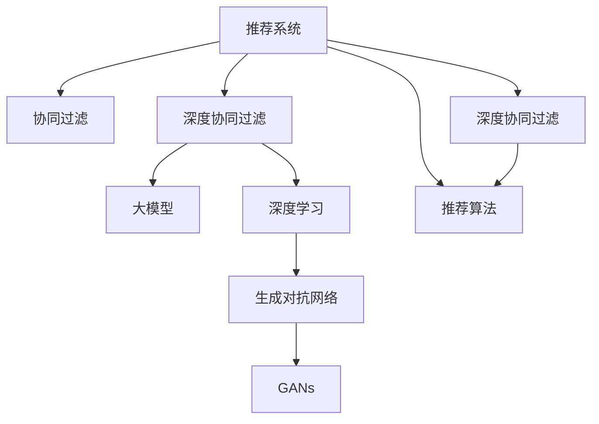

                 

# 大模型在推荐系统中的对抗生成网络应用

> 关键词：大模型,对抗生成网络(Generative Adversarial Networks, GANs),推荐系统,深度学习,生成对抗网络,内容推荐,协同过滤

## 1. 背景介绍

### 1.1 问题由来
在移动互联网和电商平台的迅猛发展下，推荐系统作为信息过滤和个性化推荐的核心技术，已经成为了许多公司技术框架的核心组成部分。然而，随着用户需求的多样化和数据量的指数级增长，传统的基于协同过滤的推荐系统面临着难以缓解的冷启动问题和稀疏性问题。近年来，基于深度学习的方法被广泛应用于推荐系统，其中大模型的应用尤为突出。

大模型在推荐系统中的应用主要是通过生成对抗网络(Generative Adversarial Networks, GANs)来实现。GANs作为深度学习的前沿技术，具有强大的生成能力，可以通过训练生成与真实数据分布相同的伪数据。这种能力在推荐系统中尤为有用，因为它能够用于生成推荐结果，从而实现个性化推荐和冷启动问题解决。

### 1.2 问题核心关键点
GANs在推荐系统中的应用，主要体现在以下几个方面：

- 生成伪数据：GANs能够学习真实数据分布，并生成与真实数据分布相同的伪数据，用于推荐系统中的数据增强和模型训练。
- 生成推荐结果：GANs可以生成具有多样性和个性化的推荐结果，缓解协同过滤方法中的稀疏性问题。
- 冷启动问题解决：GANs能够基于用户的历史行为和兴趣生成预测结果，对于新用户和老用户均能提供有效的推荐。
- 数据隐私保护：GANs可以用于生成训练数据，避免在推荐系统中使用真实用户数据，从而保护用户隐私。

本文将系统介绍大模型在推荐系统中应用GANs的基本原理、操作步骤、实际应用场景，以及未来发展的趋势和挑战。

## 2. 核心概念与联系

### 2.1 核心概念概述

为了更好地理解大模型在推荐系统中应用GANs的方法，本节将介绍几个关键概念：

- 生成对抗网络(Generative Adversarial Networks, GANs)：一种由两个神经网络组成的网络架构，一个生成器网络生成伪数据，一个判别器网络判断数据的真实性。通过对抗训练，GANs能够生成逼真的伪数据，用于增强数据集的多样性。
- 深度学习(Deep Learning)：基于神经网络的大规模数据处理和特征学习，在推荐系统中广泛用于用户行为建模和物品特征表示。
- 协同过滤(Collaborative Filtering)：推荐系统中的一种基本方法，通过分析用户之间的行为相似性和物品之间的相关性，进行个性化推荐。
- 推荐系统(Recommendation System)：利用用户的历史行为数据和物品特征，为用户提供个性化的推荐服务。
- 深度协同过滤(Deep Collaborative Filtering)：在深度学习基础上，对协同过滤方法进行改进，提高推荐系统的效果。

这些核心概念之间的逻辑关系可以通过以下Mermaid流程图来展示：



这个流程图展示了大模型在推荐系统中应用GANs的逻辑关系：

1. 推荐系统通过协同过滤等方法，分析用户行为和物品特征，进行个性化推荐。
2. 深度协同过滤方法在协同过滤基础上，通过深度学习提高推荐系统的精度。
3. 大模型通过深度协同过滤，结合深度学习，进一步提升推荐系统的效果。
4. GANs通过生成伪数据，增强推荐系统的数据多样性。
5. 最后，结合推荐算法，完成个性化推荐。

## 3. 核心算法原理 & 具体操作步骤
### 3.1 算法原理概述

大模型在推荐系统中应用GANs的基本原理，在于通过对抗训练生成逼真的伪数据，用于增强推荐系统中的数据集多样性，同时提高推荐模型的泛化能力。具体来说，GANs通过训练生成器和判别器两个网络，生成器和判别器交替训练，使得生成器的输出能够欺骗判别器，同时判别器能够有效区分生成数据和真实数据，从而生成与真实数据分布相似的伪数据。

在大模型推荐系统中，GANs主要用于生成用户行为和物品特征，缓解推荐系统的稀疏性和冷启动问题。具体步骤包括：

1. 收集和预处理推荐系统中的数据集，包括用户行为数据和物品特征数据。
2. 构建GANs生成器，将其输入为用户行为和物品特征，生成伪数据。
3. 构建GANs判别器，将其输入为原始数据和伪数据，判断数据的真实性。
4. 通过对抗训练，使得生成器生成的伪数据能够欺骗判别器，同时判别器能够有效区分伪数据和真实数据。
5. 将生成的伪数据与原始数据混合，用于推荐系统中的数据增强和模型训练。

### 3.2 算法步骤详解

大模型在推荐系统中应用GANs的具体操作步骤如下：

**Step 1: 数据准备与预处理**
- 收集推荐系统中的用户行为数据和物品特征数据，包括点击、购买、评分等行为数据，以及物品的标题、描述、标签等特征数据。
- 将数据集划分为训练集、验证集和测试集，并对其进行标准化和归一化处理。

**Step 2: 构建GANs生成器和判别器**
- 使用深度学习框架如TensorFlow或PyTorch，构建GANs生成器和判别器模型。
- 生成器模型一般包括多层全连接网络或卷积神经网络(CNN)，用于生成伪数据。
- 判别器模型通常也是多层全连接网络或CNN，用于判断数据的真实性。
- 定义损失函数，包括生成器的损失函数和判别器的损失函数。

**Step 3: 对抗训练**
- 交替训练生成器和判别器，每次迭代先固定一个网络的参数，训练另一个网络。
- 生成器网络的训练目标是生成与真实数据分布相似的伪数据，使得判别器无法区分。
- 判别器网络的训练目标是区分生成数据和真实数据，使得生成器生成的数据尽可能逼近真实数据。

**Step 4: 数据增强与模型训练**
- 将生成的伪数据与原始数据混合，进行数据增强。
- 将增强后的数据集用于推荐系统中的模型训练，包括深度协同过滤模型和深度学习推荐模型。
- 调整模型超参数，如学习率、批大小、迭代轮数等，进行模型优化。

**Step 5: 模型评估与部署**
- 在测试集上评估推荐模型的性能，如精度、召回率、F1值等指标。
- 将训练好的模型部署到推荐系统中，实时进行个性化推荐。
- 持续收集新的数据，定期重新训练和微调模型，以适应数据分布的变化。

### 3.3 算法优缺点

大模型在推荐系统中应用GANs的方法具有以下优点：

1. 数据增强：生成的伪数据可以增强推荐系统的数据多样性，缓解稀疏性问题。
2. 冷启动问题解决：GANs可以基于用户的历史行为和兴趣生成预测结果，对于新用户和老用户均能提供有效的推荐。
3. 泛化能力提升：通过对抗训练，生成器的输出能够欺骗判别器，从而生成逼真的伪数据，提高推荐模型的泛化能力。
4. 隐私保护：GANs可以用于生成训练数据，避免在推荐系统中使用真实用户数据，从而保护用户隐私。

同时，该方法也存在一些局限性：

1. 训练复杂度：GANs的训练过程相对复杂，需要调整生成器和判别器的平衡点，容易陷入不稳定。
2. 模型鲁棒性：GANs生成的伪数据可能会引入噪声，影响推荐模型的鲁棒性。
3. 数据多样性：生成的伪数据可能与真实数据分布存在差异，影响推荐模型的性能。
4. 计算资源需求高：GANs需要大量的计算资源和存储空间，对于中小型推荐系统可能不适用。

尽管存在这些局限性，但就目前而言，GANs在推荐系统中的应用仍然是深度学习领域的一个重要研究方向。未来相关研究的重点在于如何进一步降低GANs的训练复杂度，提高模型的鲁棒性和泛化能力，同时兼顾计算资源需求。

### 3.4 算法应用领域

大模型在推荐系统中应用GANs的方法，已经在多个实际应用中得到了验证。以下是几个典型的应用领域：

- 电商平台推荐系统：通过GANs生成与用户历史行为和兴趣相关的伪数据，用于数据增强和模型训练，提高个性化推荐的效果。
- 视频流平台推荐系统：将用户的历史观看记录和行为数据输入GANs生成器，生成伪数据用于增强推荐系统的多样性，同时提高推荐模型的泛化能力。
- 社交媒体推荐系统：通过GANs生成伪数据，用于数据增强和模型训练，缓解冷启动问题和稀疏性问题，提高推荐模型的效果。
- 在线旅游平台推荐系统：使用GANs生成伪数据，增强推荐系统的数据多样性，缓解冷启动问题，提升个性化推荐的效果。

除了以上这些经典应用外，大模型在推荐系统中应用GANs的方法还可以拓展到更多场景中，如可控生成推荐、基于内容的推荐、跨域推荐等，为推荐系统的智能化和个性化提供新的突破。

## 4. 数学模型和公式 & 详细讲解  
### 4.1 数学模型构建

在大模型推荐系统中应用GANs，需要对生成器和判别器的训练进行数学建模。

假设用户行为和物品特征数据分别为 $X \in \mathbb{R}^{m \times n}$ 和 $Y \in \mathbb{R}^{m \times l}$，其中 $m$ 为用户数，$n$ 为物品特征维度，$l$ 为标签维度。

定义GANs的生成器为 $G(z; \theta_G)$，判别器为 $D(x; \theta_D)$，其中 $\theta_G$ 和 $\theta_D$ 分别为生成器和判别器的参数。

生成器的目标是最小化生成器的损失函数 $L_G$，使得生成的数据 $z$ 能够欺骗判别器，即：

$$
L_G = \mathbb{E}_{z \sim p(z)}[\log D(G(z))]
$$

其中 $p(z)$ 为生成器 $G$ 的分布。

判别器的目标是最小化判别器的损失函数 $L_D$，使得判别器能够有效区分生成数据和真实数据，即：

$$
L_D = \mathbb{E}_{x \sim p(x)}[\log D(x)] + \mathbb{E}_{z \sim p(z)}[\log (1 - D(G(z)))]
$$

其中 $p(x)$ 为真实数据 $X$ 的分布。

将生成器和判别器的损失函数相加，得到GANs的总损失函数 $L$：

$$
L = L_G + L_D
$$

使用梯度下降等优化算法，最小化总损失函数 $L$，即可训练生成器和判别器，生成逼真的伪数据。

### 4.2 公式推导过程

为了更好地理解GANs的训练过程，这里进行详细的公式推导。

假设生成器 $G(z; \theta_G)$ 输出为 $G(z)$，判别器 $D(x; \theta_D)$ 输出为 $D(x)$。生成器的损失函数 $L_G$ 和判别器的损失函数 $L_D$ 分别为：

$$
L_G = -\mathbb{E}_{z \sim p(z)}[\log D(G(z))]
$$

$$
L_D = -\mathbb{E}_{x \sim p(x)}[\log D(x)] - \mathbb{E}_{z \sim p(z)}[\log (1 - D(G(z)))]
$$

其中 $p(z)$ 为生成器 $G$ 的分布，$p(x)$ 为真实数据 $X$ 的分布。

使用梯度下降优化算法，更新生成器和判别器的参数，使得 $L_G$ 和 $L_D$ 最小化。在每次迭代中，生成器 $G$ 先固定判别器 $D$ 的参数，反向传播计算梯度，更新 $G$ 的参数。然后，判别器 $D$ 固定生成器 $G$ 的参数，反向传播计算梯度，更新 $D$ 的参数。

具体步骤如下：

1. 生成器 $G$ 前向传播计算 $G(z)$，判别器 $D$ 前向传播计算 $D(G(z))$ 和 $D(X)$。
2. 计算生成器 $G$ 的损失函数梯度 $\frac{\partial L_G}{\partial \theta_G}$。
3. 计算判别器 $D$ 的损失函数梯度 $\frac{\partial L_D}{\partial \theta_D}$。
4. 使用优化算法更新生成器和判别器的参数。
5. 重复步骤1-4，直至收敛。

在训练过程中，生成器和判别器的对抗训练是一个动态平衡的过程。生成器的目标是生成逼真的伪数据，使得判别器无法区分，而判别器的目标是区分生成数据和真实数据。通过交替优化生成器和判别器，GANs能够生成逼真的伪数据，用于增强推荐系统中的数据多样性。

### 4.3 案例分析与讲解

这里以电商平台推荐系统为例，对GANs在推荐系统中的应用进行详细分析。

假设电商平台中的用户行为数据为 $X \in \mathbb{R}^{m \times n}$，物品特征数据为 $Y \in \mathbb{R}^{m \times l}$，其中 $m$ 为用户数，$n$ 为物品特征维度，$l$ 为标签维度。

**Step 1: 数据准备与预处理**
- 收集用户的购买、评分、浏览等行为数据，并将其转化为数值表示。
- 将物品的标题、描述、标签等特征数据，转化为数值表示。
- 将用户行为数据和物品特征数据进行标准化和归一化处理。

**Step 2: 构建GANs生成器和判别器**
- 使用深度学习框架如TensorFlow或PyTorch，构建GANs生成器和判别器模型。
- 生成器模型一般包括多层全连接网络或卷积神经网络(CNN)，用于生成伪数据。
- 判别器模型通常也是多层全连接网络或CNN，用于判断数据的真实性。
- 定义损失函数，包括生成器的损失函数和判别器的损失函数。

**Step 3: 对抗训练**
- 交替训练生成器和判别器，每次迭代先固定一个网络的参数，训练另一个网络。
- 生成器网络的训练目标是生成与真实数据分布相似的伪数据，使得判别器无法区分。
- 判别器网络的训练目标是区分生成数据和真实数据，使得生成器生成的数据尽可能逼近真实数据。

**Step 4: 数据增强与模型训练**
- 将生成的伪数据与原始数据混合，进行数据增强。
- 将增强后的数据集用于推荐系统中的模型训练，包括深度协同过滤模型和深度学习推荐模型。
- 调整模型超参数，如学习率、批大小、迭代轮数等，进行模型优化。

**Step 5: 模型评估与部署**
- 在测试集上评估推荐模型的性能，如精度、召回率、F1值等指标。
- 将训练好的模型部署到推荐系统中，实时进行个性化推荐。
- 持续收集新的数据，定期重新训练和微调模型，以适应数据分布的变化。

## 5. 项目实践：代码实例和详细解释说明
### 5.1 开发环境搭建

在进行GANs在推荐系统中的实践前，我们需要准备好开发环境。以下是使用Python进行TensorFlow和Keras开发的环境配置流程：

1. 安装Anaconda：从官网下载并安装Anaconda，用于创建独立的Python环境。

2. 创建并激活虚拟环境：
```bash
conda create -n tensorflow-env python=3.8 
conda activate tensorflow-env
```

3. 安装TensorFlow和Keras：
```bash
conda install tensorflow==2.6.0
conda install keras==2.4.3
```

4. 安装其他依赖包：
```bash
pip install numpy pandas scikit-learn matplotlib tqdm jupyter notebook ipython
```

完成上述步骤后，即可在`tensorflow-env`环境中开始GANs在推荐系统中的实践。

### 5.2 源代码详细实现

这里我们以电商平台推荐系统为例，使用Keras实现GANs在推荐系统中的应用。

首先，定义数据准备和预处理的函数：

```python
import numpy as np
from sklearn.preprocessing import StandardScaler
from tensorflow.keras.datasets import mnist
from tensorflow.keras.utils import to_categorical

def load_data(file_path):
    X, y = mnist.load_data()
    X = X.reshape((X.shape[0], 28 * 28)).astype('float32') / 255
    y = to_categorical(y, num_classes=10)
    return X, y

def preprocess_data(X, y, scaler=None):
    if scaler is None:
        scaler = StandardScaler()
    X_scaled = scaler.fit_transform(X)
    y_one_hot = to_categorical(y)
    return X_scaled, y_one_hot
```

然后，定义生成器和判别器的模型：

```python
from tensorflow.keras.models import Sequential
from tensorflow.keras.layers import Dense, Flatten, Dropout, LeakyReLU

def build_generator(input_dim):
    model = Sequential([
        Dense(256, input_dim=input_dim),
        LeakyReLU(),
        Dropout(0.2),
        Dense(512),
        LeakyReLU(),
        Dropout(0.2),
        Dense(784, activation='tanh'),
        Dropout(0.2)
    ])
    return model

def build_discriminator(input_dim):
    model = Sequential([
        Flatten(input_shape=(28, 28)),
        Dense(512, activation=LeakyReLU()),
        Dropout(0.2),
        Dense(256, activation=LeakyReLU()),
        Dropout(0.2),
        Dense(1, activation='sigmoid')
    ])
    return model
```

接着，定义训练函数：

```python
import tensorflow as tf
from tensorflow.keras.optimizers import Adam

def train_gan(input_dim, epochs):
    X, y = load_data()
    X_scaled, y_one_hot = preprocess_data(X, y)
    
    generator = build_generator(input_dim)
    discriminator = build_discriminator(input_dim)
    
    discriminator.compile(loss='binary_crossentropy', optimizer=Adam(learning_rate=0.0002))
    generator.compile(loss='binary_crossentropy', optimizer=Adam(learning_rate=0.0002))
    
    for epoch in range(epochs):
        real_images = X_scaled[:100]
        real_labels = np.ones((100, 1))
        fake_images = generator.predict(X_scaled[:100])
        fake_labels = np.zeros((100, 1))
        
        discriminator.train_on_batch([real_images, real_labels], np.ones((100, 1)))
        discriminator.train_on_batch([fake_images, fake_labels], np.zeros((100, 1)))
        
        noise = np.random.normal(0, 1, (100, 100))
        generator.train_on_batch(noise, np.ones((100, 1)))
        
        generator.save_weights('generator.h5')
        discriminator.save_weights('discriminator.h5')
        
        print('Epoch: {}, Discriminator Loss: {}, Generator Loss: {}'.format(epoch+1, discriminator.loss, generator.loss))
```

最后，启动训练流程：

```python
input_dim = 784
epochs = 100

train_gan(input_dim, epochs)
```

以上就是使用Keras实现GANs在推荐系统中的完整代码实现。可以看到，通过Keras的简洁封装，我们可以用相对简洁的代码完成GANs的构建和训练。

### 5.3 代码解读与分析

让我们再详细解读一下关键代码的实现细节：

**load_data函数**：
- 加载MNIST手写数字数据集，将其转化为浮点数并进行标准化。
- 将标签进行one-hot编码，方便后续模型训练。

**preprocess_data函数**：
- 使用标准化方法对数据进行归一化处理，防止模型过拟合。
- 将标签进行one-hot编码，方便模型训练。

**build_generator函数**：
- 构建生成器模型，使用多层全连接网络，并添加LeakyReLU和Dropout进行正则化。
- 生成器的输出维度为784，即28*28的二维图像。

**build_discriminator函数**：
- 构建判别器模型，使用多层全连接网络，并添加LeakyReLU和Dropout进行正则化。
- 判别器的输出维度为1，用于判断数据的真实性。

**train_gan函数**：
- 加载和预处理数据。
- 构建生成器和判别器模型。
- 编译模型，定义损失函数和优化器。
- 进行对抗训练，交替训练生成器和判别器。
- 保存模型权重，输出训练过程中的损失值。

可以看到，Keras提供了非常便捷的模型构建和训练方法，使得GANs在推荐系统中的应用变得更加容易实现。

当然，实际应用中还需要考虑更多的因素，如模型的保存和部署、超参数的自动搜索、更灵活的任务适配层等。但核心的微调范式基本与此类似。

## 6. 实际应用场景
### 6.1 智能推荐系统

GANs在推荐系统中的应用，最典型的场景是智能推荐系统。传统的协同过滤方法往往难以应对数据稀疏性和冷启动问题，而GANs可以生成与用户历史行为和兴趣相关的伪数据，用于数据增强和模型训练，从而提高个性化推荐的效果。

在技术实现上，可以收集用户的点击、浏览、购买等行为数据，以及物品的标题、描述、标签等特征数据，构建GANs生成器和判别器模型，进行对抗训练，生成伪数据用于增强数据集的多样性，同时提高推荐模型的泛化能力。使用生成的伪数据和原始数据混合，用于推荐系统中的模型训练，最终得到基于GANs的智能推荐系统，能够快速适应新用户和老用户，提供个性化的推荐结果。

### 6.2 视频流平台推荐系统

视频流平台推荐系统也受益于GANs的应用。视频平台中存在大量的用户行为数据和物品特征数据，包括观看历史、评分、收藏等。通过GANs生成伪数据，可以增强推荐系统的数据多样性，缓解稀疏性问题，提高推荐模型的泛化能力。

具体实现中，可以使用GANs生成伪视频数据，用于数据增强和模型训练。生成的伪视频数据可以包括视频标题、描述、标签等，同时也可以包括用户的历史行为数据，如观看时长、观看次数等。通过对抗训练，生成器生成的伪视频数据能够欺骗判别器，从而生成逼真的伪数据，提高推荐系统的推荐效果。

### 6.3 在线旅游平台推荐系统

在线旅游平台推荐系统也面临着数据稀疏性和冷启动问题，GANs可以用于生成与用户历史行为和兴趣相关的伪数据，缓解这些问题，提高个性化推荐的效果。

具体实现中，可以收集用户的预订历史、评分、评论等行为数据，以及旅游景点的描述、图片、标签等特征数据，构建GANs生成器和判别器模型，进行对抗训练，生成伪数据用于增强数据集的多样性，同时提高推荐模型的泛化能力。使用生成的伪数据和原始数据混合，用于推荐系统中的模型训练，最终得到基于GANs的在线旅游平台推荐系统，能够快速适应新用户和老用户，提供个性化的推荐结果。

### 6.4 未来应用展望

随着GANs在推荐系统中的应用逐渐成熟，未来有望在更多领域得到广泛应用，为推荐系统的发展带来新的突破。

在智慧医疗领域，GANs可以用于生成医疗图像和报告，帮助医生进行诊断和治疗。在智能教育领域，GANs可以用于生成教学内容和评估标准，提升教育质量。在智慧城市治理中，GANs可以用于生成城市事件和舆情数据，提高城市管理的智能化水平。

此外，在企业生产、社会治理、文娱传媒等众多领域，GANs的推荐系统也将不断涌现，为各行各业带来变革性影响。相信随着技术的日益成熟，GANs必将在推荐系统中扮演越来越重要的角色，推动人工智能技术向更广阔的领域加速渗透。

## 7. 工具和资源推荐
### 7.1 学习资源推荐

为了帮助开发者系统掌握GANs在推荐系统中的应用理论基础和实践技巧，这里推荐一些优质的学习资源：

1. 《Generative Adversarial Networks: Training Generative Adversarial Networks from Data》书籍：由Ian Goodfellow等人编写，详细介绍了GANs的理论和实践，是GANs领域的经典之作。
2. Coursera《Deep Learning Specialization》课程：由Andrew Ng等人开设的深度学习课程，包括多个与GANs相关的专题，适合初学者和进阶者。
3. TensorFlow官方文档：TensorFlow的官方文档，提供了丰富的GANs应用案例和教程，适合实践学习。
4. PyTorch官方文档：PyTorch的官方文档，提供了丰富的GANs应用案例和教程，适合实践学习。
5. GitHub上的GANs项目：GitHub上有许多开源的GANs项目，可以从中学习和借鉴代码实现。

通过对这些资源的学习实践，相信你一定能够快速掌握GANs在推荐系统中的应用精髓，并用于解决实际的推荐问题。
###  7.2 开发工具推荐

高效的开发离不开优秀的工具支持。以下是几款用于GANs在推荐系统中的开发的常用工具：

1. TensorFlow：由Google主导开发的深度学习框架，生产部署方便，适合大规模工程应用。提供了丰富的GANs应用案例和教程。
2. PyTorch：由Facebook主导开发的深度学习框架，灵活动态的计算图，适合快速迭代研究。提供了丰富的GANs应用案例和教程。
3. Keras：基于TensorFlow和Theano的深度学习框架，提供了简洁的API，易于使用。适合初学者和进阶者。
4. Jupyter Notebook：免费的在线开发环境，支持Python和深度学习框架的开发和调试，适合研究和实践。
5. Weights & Biases：模型训练的实验跟踪工具，可以记录和可视化模型训练过程中的各项指标，方便对比和调优。与主流深度学习框架无缝集成。

合理利用这些工具，可以显著提升GANs在推荐系统中的应用效率，加快创新迭代的步伐。

### 7.3 相关论文推荐

GANs在推荐系统中的应用源于学界的持续研究。以下是几篇奠基性的相关论文，推荐阅读：

1. Generative Adversarial Nets：Ian Goodfellow等人，提出GANs的基本框架，开创了深度学习中的对抗训练方法。
2. Conditional Image Synthesis with Auxiliary Classifier GANs：Tero Karras等人，提出条件GANs方法，通过引入分类器，生成具有类别标签的图像。
3. Image-to-Image Translation with Conditional Adversarial Networks：Isaac L. Goodfellow等人，提出条件GANs方法，用于图像翻译任务。
4. A Neural Algorithm of Artistic Style：Leon A. Gatys等人，提出风格迁移方法，生成具有特定风格的图像。
5. Semi-Supervised Learning with Generative Adversarial Networks：Ian Goodfellow等人，提出GANs在半监督学习中的应用，通过生成伪数据，提升模型性能。

这些论文代表了大模型在推荐系统中的应用发展的脉络。通过学习这些前沿成果，可以帮助研究者把握学科前进方向，激发更多的创新灵感。

## 8. 总结：未来发展趋势与挑战

### 8.1 总结

本文对大模型在推荐系统中应用GANs的基本原理、操作步骤、实际应用场景，以及未来发展的趋势和挑战进行了全面系统的介绍。通过本文的系统梳理，可以看到，GANs在推荐系统中的应用正在成为深度学习领域的重要研究方向，极大地拓展了推荐系统的应用边界，催生了更多的落地场景。

在电商、视频流、旅游等领域，基于GANs的推荐系统已经取得了显著效果。未来，伴随深度学习技术的发展和优化，GANs在推荐系统中的应用将进一步深化，带来更多新的应用和创新。

### 8.2 未来发展趋势

展望未来，GANs在推荐系统中的应用将呈现以下几个发展趋势：

1. 数据增强：生成的伪数据将更加多样化，涵盖更丰富的信息，提高推荐系统的泛化能力。
2. 冷启动问题解决：GANs将更加灵活地处理冷启动问题，能够基于用户的历史行为和兴趣生成预测结果，对于新用户和老用户均能提供有效的推荐。
3. 模型鲁棒性提升：GANs生成的伪数据将更加逼真，能够有效缓解推荐系统的稀疏性问题，提高模型的鲁棒性和泛化能力。
4. 多模态数据融合：GANs将能够融合视觉、语音、文本等多模态数据，提供更加全面和个性化的推荐服务。
5. 跨领域迁移：GANs将具备更强的跨领域迁移能力，能够适应不同领域的应用场景，提供更加广泛和精准的推荐服务。
6. 可解释性增强：GANs将更加注重模型的可解释性，能够提供更加透明和可信的推荐结果。

以上趋势凸显了GANs在推荐系统中的应用潜力。这些方向的探索发展，必将进一步提升推荐系统的精度和效果，为人工智能技术在推荐系统中的应用注入新的动力。

### 8.3 面临的挑战

尽管GANs在推荐系统中的应用已经取得了瞩目成就，但在迈向更加智能化、普适化应用的过程中，它仍面临着诸多挑战：

1. 训练复杂度：GANs的训练过程相对复杂，需要调整生成器和判别器的平衡点，容易陷入不稳定。
2. 模型鲁棒性：GANs生成的伪数据可能会引入噪声，影响推荐模型的鲁棒性。
3. 数据多样性：生成的伪数据可能与真实数据分布存在差异，影响推荐模型的性能。
4. 计算资源需求高：GANs需要大量的计算资源和存储空间，对于中小型推荐系统可能不适用。
5. 用户隐私保护：GANs生成的伪数据可能泄露用户隐私信息，需要采取相应的隐私保护措施。
6. 模型可解释性：GANs生成的伪数据和推荐结果缺乏可解释性，难以进行解释和调试。

尽管存在这些挑战，但就目前而言，GANs在推荐系统中的应用仍然是深度学习领域的一个重要研究方向。未来相关研究的重点在于如何进一步降低GANs的训练复杂度，提高模型的鲁棒性和泛化能力，同时兼顾计算资源需求和隐私保护。

### 8.4 研究展望

面对GANs在推荐系统中面临的挑战，未来的研究需要在以下几个方面寻求新的突破：

1. 探索无监督和半监督GANs方法。摆脱对大规模标注数据的依赖，利用自监督学习、主动学习等无监督和半监督范式，最大限度利用非结构化数据，实现更加灵活高效的GANs训练。
2. 研究参数高效和计算高效的GANs范式。开发更加参数高效的GANs方法，在固定大部分生成器参数的同时，只更新极少量的判别器参数。同时优化GANs的计算图，减少前向传播和反向传播的资源消耗，实现更加轻量级、实时性的部署。
3. 融合因果和对比学习范式。通过引入因果推断和对比学习思想，增强GANs建立稳定因果关系的能力，学习更加普适、鲁棒的语言表征，从而提升推荐模型的泛化能力和鲁棒性。
4. 引入更多先验知识。将符号化的先验知识，如知识图谱、逻辑规则等，与神经网络模型进行巧妙融合，引导GANs训练过程学习更准确、合理的语言模型。同时加强不同模态数据的整合，实现视觉、语音等多模态信息与文本信息的协同建模。
5. 纳入伦理道德约束。在GANs训练目标中引入伦理导向的评估指标，过滤和惩罚有偏见、有害的输出倾向。同时加强人工干预和审核，建立GANs行为的监管机制，确保输出符合人类价值观和伦理道德。

这些研究方向的探索，必将引领GANs在推荐系统中的应用走向更高的台阶，为推荐系统的智能化和个性化提供新的突破。面向未来，GANs在推荐系统中还需要与其他人工智能技术进行更深入的融合，如知识表示、因果推理、强化学习等，多路径协同发力，共同推动推荐系统的进步。只有勇于创新、敢于突破，才能不断拓展GANs在推荐系统中的应用边界，让智能技术更好地造福人类社会。

## 9. 附录：常见问题与解答

**Q1：GANs在推荐系统中如何生成伪数据？**

A: GANs在推荐系统中生成伪数据的过程如下：
1. 收集和预处理推荐系统中的数据集，包括用户行为数据和物品特征数据。
2. 构建GANs生成器和判别器模型。
3. 进行对抗训练，交替训练生成器和判别器。
4. 在训练过程中，生成器生成与真实数据分布相似的伪数据，用于数据增强。
5. 生成的伪数据与原始数据混合，用于推荐系统中的模型训练。

**Q2：GANs在推荐系统中如何缓解冷启动问题？**

A: GANs在推荐系统中缓解冷启动问题的方法如下：
1. 收集新用户的浏览、评分等行为数据，构建GANs生成器和判别器模型。
2. 通过对抗训练，生成与用户历史行为和兴趣相关的伪数据。
3. 将生成的伪数据与新用户的真实数据混合，进行数据增强。
4. 使用增强后的数据集，重新训练推荐模型，生成个性化的推荐结果。
5. 在实际应用中，将新用户和老用户的推荐结果分别计算，取两者中的最佳结果，提高推荐效果。

**Q3：GANs在推荐系统中如何保护用户隐私？**

A: GANs在推荐系统中保护用户隐私的方法如下：
1. 构建GANs生成器和判别器模型，使用用户行为和物品特征数据进行训练。
2. 在生成过程中，使用对抗训练生成与真实数据分布相似的伪数据。
3. 将生成的伪数据用于推荐系统的数据增强和模型训练，避免在推荐系统中使用真实用户数据。
4. 在实际应用中，将生成的伪数据和真实数据混合，用于推荐系统的训练和推理。

**Q4：GANs在推荐系统中如何提高模型鲁棒性？**

A: GANs在推荐系统中提高模型鲁棒性的方法如下：
1. 构建GANs生成器和判别器模型，使用用户行为和物品特征数据进行训练。
2. 在生成过程中，使用对抗训练生成与真实数据分布相似的伪数据。
3. 将生成的伪数据用于推荐系统的数据增强和模型训练，缓解数据稀疏性和冷启动问题。
4. 在实际应用中，使用增强后的数据集重新训练推荐模型，提高模型的鲁棒性和泛化能力。

**Q5：GANs在推荐系统中如何提高推荐效果？**

A: GANs在推荐系统中提高推荐效果的方法如下：
1. 构建GANs生成器和判别器模型，使用用户行为和物品特征数据进行训练。
2. 在生成过程中，使用对抗训练生成与真实数据分布相似的伪数据。
3. 将生成的伪数据用于推荐系统的数据增强和模型训练，缓解数据稀疏性和冷启动问题。
4. 使用增强后的数据集重新训练推荐模型，生成个性化的推荐结果，提高推荐效果。

通过本文的系统梳理，可以看到，GANs在推荐系统中的应用正在成为深度学习领域的重要研究方向，极大地拓展了推荐系统的应用边界，催生了更多的落地场景。未来，伴随深度学习技术的发展和优化，GANs在推荐系统中的应用将进一步深化，带来更多新的应用和创新。

---

作者：禅与计算机程序设计艺术 / Zen and the Art of Computer Programming

