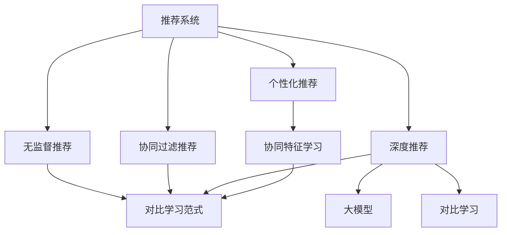

                 

# 大模型在推荐系统中的对比学习应用

> 关键词：大模型、对比学习、推荐系统、个性化推荐、协同过滤

## 1. 背景介绍

### 1.1 问题由来
推荐系统是互联网时代的重要技术，通过用户行为数据进行分析和建模，为用户推荐其可能感兴趣的内容，从而提升用户体验，增加平台粘性，带来商业价值。传统的协同过滤推荐算法通过用户历史行为数据和物品属性数据进行推荐，但面临稀疏性、冷启动等问题。近年来，随着深度学习技术的发展，基于神经网络模型的推荐方法成为新的研究热点。

大模型作为当前深度学习领域的重要范式，在推荐系统中也得到了广泛应用。其中，对比学习作为深度学习中新兴的范式，利用正负样本对之间的相似度对比，学习模型的特征表示，在推荐系统中展现出了巨大的潜力。本文将深入探讨大模型在推荐系统中的应用，尤其是基于对比学习的推荐算法，并详细讲解其实现原理和操作步骤。

### 1.2 问题核心关键点
基于大模型的推荐系统在推荐准确性和多样性等方面取得了显著进展。但相较于传统的协同过滤推荐，大模型仍面临数据稀疏性、冷启动、计算资源消耗大等问题。因此，对比学习范式作为大模型在推荐系统中的重要应用，可以在保留大模型强大特征提取能力的同时，通过对比学习的方式，更高效地处理数据稀疏性和冷启动问题，并显著提升推荐效果。

## 2. 核心概念与联系

### 2.1 核心概念概述

为更好地理解大模型在推荐系统中的应用，本节将介绍几个密切相关的核心概念：

- 推荐系统(Recommendation System)：通过用户行为数据和物品属性数据，为用户推荐其可能感兴趣的内容的系统。推荐系统广泛应用于电商、视频、新闻等领域。

- 协同过滤推荐(Collaborative Filtering)：利用用户历史行为数据和物品属性数据进行推荐，是推荐系统中的传统方法，但存在稀疏性、冷启动等问题。

- 深度推荐(Deep Recommendation)：使用深度神经网络模型进行推荐，能够处理复杂数据特征，提升推荐效果。但需大规模标注数据进行预训练，计算资源消耗大。

- 大模型(Large Model)：以自回归(如GPT)或自编码(如BERT)模型为代表的大规模预训练模型。通过在大规模无标签文本语料上进行预训练，学习到丰富的语言知识和常识，具备强大的特征提取能力。

- 对比学习(Contrastive Learning)：一种新兴的深度学习范式，利用正负样本之间的对比，学习模型的特征表示。通过最小化正负样本之间的距离，使得模型学习到的特征能够更好地区分正负样本。

- 个性化推荐(Personalized Recommendation)：根据用户的个性化需求，推荐其可能感兴趣的内容。个性化推荐的目标是提升推荐的相关性和多样性，带来更好的用户体验。

- 协同特征学习(Collaborative Feature Learning)：将协同过滤和深度学习结合，通过协同过滤获取用户-物品共现矩阵，再使用深度神经网络模型对用户特征和物品特征进行学习。

- 无监督推荐(Unsupervised Recommendation)：在无需用户标注数据的情况下，利用用户行为数据和物品属性数据进行推荐。无监督推荐方法适用于冷启动和数据稀疏场景。

- 对比学习范式(Contrastive Learning Paradigm)：一种新兴的深度学习范式，通过最小化正负样本之间的距离，学习模型的特征表示。对比学习范式在推荐系统中展现了良好的效果，能够处理数据稀疏性和冷启动问题，提升推荐效果。

这些核心概念之间的逻辑关系可以通过以下Mermaid流程图来展示：



这个流程图展示了大模型在推荐系统中的核心概念及其之间的关系：

1. 推荐系统通过协同过滤推荐、深度推荐、对比学习范式等方法，为用户推荐其可能感兴趣的内容。
2. 协同过滤推荐通过用户历史行为数据和物品属性数据进行推荐，存在稀疏性和冷启动问题。
3. 深度推荐使用深度神经网络模型进行推荐，能够处理复杂数据特征，提升推荐效果。但需大规模标注数据进行预训练，计算资源消耗大。
4. 大模型通过预训练学习到丰富的语言知识和常识，具备强大的特征提取能力。
5. 对比学习范式通过最小化正负样本之间的距离，学习模型的特征表示，能够处理数据稀疏性和冷启动问题，提升推荐效果。
6. 个性化推荐根据用户的个性化需求，推荐其可能感兴趣的内容。
7. 协同特征学习将协同过滤和深度学习结合，通过协同过滤获取用户-物品共现矩阵，再使用深度神经网络模型对用户特征和物品特征进行学习。
8. 无监督推荐在无需用户标注数据的情况下，利用用户行为数据和物品属性数据进行推荐。无监督推荐方法适用于冷启动和数据稀疏场景。
9. 对比学习范式在大模型和深度推荐中均有应用，特别是在数据稀疏性和冷启动问题处理上具有优势。

## 3. 核心算法原理 & 具体操作步骤
### 3.1 算法原理概述

基于大模型的推荐系统，本质上是一种深度推荐方法，通过预训练语言模型对用户特征和物品特征进行学习和表示，再使用深度神经网络模型进行推荐。对比学习范式作为一种新兴的深度学习范式，能够更好地处理数据稀疏性和冷启动问题，提升推荐效果。

对比学习通过正负样本之间的相似度对比，学习模型的特征表示，具体而言：

1. 构造正负样本对：将用户-物品共现矩阵中相邻的样本视为正样本，将距离较远的样本视为负样本。
2. 特征提取：使用大模型对正负样本进行特征提取，得到用户特征和物品特征。
3. 损失函数设计：设计损失函数，使得正样本的特征表示距离较近，负样本的特征表示距离较远。
4. 最小化损失函数：通过优化算法最小化损失函数，使得模型学习到的特征能够更好地区分正负样本。
5. 推荐生成：使用优化后的模型对用户进行推荐。

### 3.2 算法步骤详解

基于大模型的推荐系统结合对比学习范式，可以分为以下几个关键步骤：

**Step 1: 准备数据集**
- 准备用户-物品共现矩阵，将其转化为大模型的输入形式。
- 根据共现矩阵构造正负样本对，构建训练集。

**Step 2: 加载大模型**
- 选择合适的大模型，如BERT、GPT等，使用对应的预训练权重加载模型。

**Step 3: 特征提取**
- 使用大模型对正负样本进行特征提取，得到用户特征和物品特征。

**Step 4: 损失函数设计**
- 设计对比损失函数，通过最大化正负样本之间的距离，最小化负样本之间的距离。
- 计算损失函数在每个正负样本对上的值，求平均值作为模型的总损失。

**Step 5: 模型训练**
- 使用优化算法最小化模型损失，迭代训练。
- 在训练过程中使用数据增强、早停等策略避免过拟合。

**Step 6: 推荐生成**
- 使用训练好的模型对用户进行推荐。
- 可以根据用户-物品共现矩阵和推荐结果生成个性化推荐列表。

### 3.3 算法优缺点

基于大模型的推荐系统结合对比学习范式，具有以下优点：
1. 处理数据稀疏性：通过对比学习，能够处理数据稀疏性，提升推荐效果。
2. 缓解冷启动问题：利用大模型的广泛知识，缓解冷启动问题。
3. 提升推荐效果：通过优化大模型特征提取，提升推荐效果。
4. 通用性强：适用于各类推荐任务，如电商推荐、视频推荐、新闻推荐等。

同时，该方法也存在以下缺点：
1. 计算资源消耗大：大模型的预训练和微调需消耗大量计算资源。
2. 学习过程复杂：大模型的特征提取和优化过程较为复杂，需要大量的参数调整和调试。
3. 数据隐私问题：用户行为数据可能涉及隐私，需注意数据处理和保护。
4. 泛化能力不足：大模型往往存在泛化能力不足的问题，需注意模型评估和优化。

尽管存在这些局限性，但就目前而言，基于大模型和对比学习的推荐系统仍是大规模推荐系统的重要方向。未来相关研究的重点在于如何进一步降低计算资源消耗，提高推荐系统效率和可解释性，同时兼顾数据隐私和泛化能力。

### 3.4 算法应用领域

基于大模型和对比学习的推荐系统在多个领域得到了广泛应用，包括但不限于：

- 电商推荐：根据用户历史行为数据和物品属性数据，为用户推荐其可能感兴趣的商品。
- 视频推荐：根据用户历史观看行为数据和视频属性数据，为用户推荐其可能感兴趣的视频内容。
- 新闻推荐：根据用户历史阅读行为数据和新闻文章属性数据，为用户推荐其可能感兴趣的新闻资讯。
- 广告推荐：根据用户历史行为数据和广告属性数据，为用户推荐其可能感兴趣的广告。
- 音乐推荐：根据用户历史听歌行为数据和音乐属性数据，为用户推荐其可能感兴趣的音乐。

除了以上这些领域外，大模型和对比学习的推荐系统还在社交网络、游戏推荐等诸多领域中得到了应用，推动了互联网行业的进一步发展。

## 4. 数学模型和公式 & 详细讲解  
### 4.1 数学模型构建

本节将使用数学语言对大模型在推荐系统中的应用进行更加严格的刻画。

记用户-物品共现矩阵为 $U \in \mathbb{R}^{m \times n}$，其中 $m$ 为物品数量，$n$ 为用户数量。假设共现矩阵中值为 $1$ 表示用户对物品感兴趣，值为 $0$ 表示用户不感兴趣。记用户特征为 $u \in \mathbb{R}^d$，物品特征为 $v \in \mathbb{R}^d$，其中 $d$ 为特征维度。

对比学习的目标是通过最大化正负样本之间的距离，最小化负样本之间的距离，学习模型的特征表示。具体而言，设计正负样本的特征表示为：

$$
u^+ = u^+_u + u^+_v, \quad u^- = u^-_u + u^-_v
$$

其中 $u^+_u$ 和 $u^-_u$ 为正样本用户特征，$u^+_v$ 和 $u^-_v$ 为正样本物品特征，$u^-_u$ 和 $u^-_v$ 为负样本用户特征，$u^-_v$ 为负样本物品特征。

定义正负样本之间的距离为：

$$
d^+ = \|u^+ - v^+\|_2, \quad d^- = \|u^- - v^-\|_2
$$

定义对比损失函数为：

$$
L = \frac{1}{N}\sum_{i=1}^N [d^+ - d^-]
$$

其中 $N$ 为样本数量。

对比学习的目标是使正负样本之间的距离尽可能大，负样本之间的距离尽可能小，即最小化损失函数 $L$。

### 4.2 公式推导过程

以下我们以二分类任务为例，推导对比学习损失函数的计算过程。

假设用户-物品共现矩阵中第 $i$ 行第 $j$ 列的值为 $1$，表示用户 $i$ 对物品 $j$ 感兴趣，值为 $0$ 表示用户 $i$ 对物品 $j$ 不感兴趣。构造正负样本对 $(x^+,x^-)$，其中 $x^+$ 为感兴趣的样本，$x^-$ 为不感兴趣的样本。

使用大模型对 $x^+$ 和 $x^-$ 进行特征提取，得到用户特征 $u^+$ 和物品特征 $v^+$，以及用户特征 $u^-$ 和物品特征 $v^-$。

定义正负样本之间的距离为：

$$
d^+ = \|u^+ - v^+\|_2, \quad d^- = \|u^- - v^-\|_2
$$

则对比损失函数为：

$$
L = \frac{1}{N}\sum_{i=1}^N [d^+_i - d^-_i]
$$

在得到损失函数后，可以通过梯度下降等优化算法进行优化，最小化损失函数 $L$，使得模型学习到的特征能够更好地区分正负样本。

### 4.3 案例分析与讲解

为了更直观地理解对比学习在推荐系统中的应用，这里以电商平台推荐为例，进行具体分析。

假设某电商平台有 $m$ 个商品，$n$ 个用户。根据用户历史购买行为数据，得到用户-物品共现矩阵 $U \in \mathbb{R}^{m \times n}$，其中 $1$ 表示用户购买过该商品，$0$ 表示用户未购买过该商品。

在得到用户-物品共现矩阵后，可以将其转化为大模型的输入形式。使用大模型对用户和商品进行特征提取，得到用户特征 $u \in \mathbb{R}^d$ 和商品特征 $v \in \mathbb{R}^d$。

根据用户-物品共现矩阵，构造正负样本对。对于每个用户 $i$，选择其购买的商品 $j$ 作为正样本 $x^+$，选择其未购买的商品 $k$ 作为负样本 $x^-$。

使用对比学习范式，设计正负样本的特征表示，计算正负样本之间的距离，得到对比损失函数。通过优化算法最小化损失函数，使得模型学习到的特征能够更好地区分正负样本。

最后，使用优化后的模型对用户进行推荐，根据用户-物品共现矩阵和推荐结果生成个性化推荐列表。

## 5. 项目实践：代码实例和详细解释说明
### 5.1 开发环境搭建

在进行大模型推荐系统的开发时，我们需要准备好开发环境。以下是使用Python进行PyTorch开发的环境配置流程：

1. 安装Anaconda：从官网下载并安装Anaconda，用于创建独立的Python环境。

2. 创建并激活虚拟环境：
```bash
conda create -n pytorch-env python=3.8 
conda activate pytorch-env
```

3. 安装PyTorch：根据CUDA版本，从官网获取对应的安装命令。例如：
```bash
conda install pytorch torchvision torchaudio cudatoolkit=11.1 -c pytorch -c conda-forge
```

4. 安装Transformers库：
```bash
pip install transformers
```

5. 安装各类工具包：
```bash
pip install numpy pandas scikit-learn matplotlib tqdm jupyter notebook ipython
```

完成上述步骤后，即可在`pytorch-env`环境中开始开发实践。

### 5.2 源代码详细实现

下面我们以电商平台推荐系统为例，给出使用Transformers库对BERT模型进行对比学习的PyTorch代码实现。

首先，定义对比学习的数据处理函数：

```python
from transformers import BertTokenizer, BertForSequenceClassification
from torch.utils.data import Dataset
import torch

class RecommendationDataset(Dataset):
    def __init__(self, user_ids, item_ids, labels, tokenizer, max_len=128):
        self.user_ids = user_ids
        self.item_ids = item_ids
        self.labels = labels
        self.tokenizer = tokenizer
        self.max_len = max_len
        
    def __len__(self):
        return len(self.user_ids)
    
    def __getitem__(self, item):
        user_id = self.user_ids[item]
        item_id = self.item_ids[item]
        label = self.labels[item]
        
        encoding = self.tokenizer([str(user_id), str(item_id)], return_tensors='pt', max_length=self.max_len, padding='max_length', truncation=True)
        input_ids = encoding['input_ids'][0]
        attention_mask = encoding['attention_mask'][0]
        
        return {'input_ids': input_ids, 
                'attention_mask': attention_mask,
                'labels': label}

# 标签与id的映射
label2id = {'0': 0, '1': 1}
id2label = {v: k for k, v in label2id.items()}

# 创建dataset
tokenizer = BertTokenizer.from_pretrained('bert-base-cased')

train_dataset = RecommendationDataset(train_user_ids, train_item_ids, train_labels, tokenizer)
dev_dataset = RecommendationDataset(dev_user_ids, dev_item_ids, dev_labels, tokenizer)
test_dataset = RecommendationDataset(test_user_ids, test_item_ids, test_labels, tokenizer)
```

然后，定义模型和优化器：

```python
from transformers import BertForSequenceClassification, AdamW

model = BertForSequenceClassification.from_pretrained('bert-base-cased', num_labels=2)

optimizer = AdamW(model.parameters(), lr=2e-5)
```

接着，定义训练和评估函数：

```python
from torch.utils.data import DataLoader
from tqdm import tqdm
from sklearn.metrics import classification_report

device = torch.device('cuda') if torch.cuda.is_available() else torch.device('cpu')
model.to(device)

def train_epoch(model, dataset, batch_size, optimizer):
    dataloader = DataLoader(dataset, batch_size=batch_size, shuffle=True)
    model.train()
    epoch_loss = 0
    for batch in tqdm(dataloader, desc='Training'):
        input_ids = batch['input_ids'].to(device)
        attention_mask = batch['attention_mask'].to(device)
        labels = batch['labels'].to(device)
        model.zero_grad()
        outputs = model(input_ids, attention_mask=attention_mask, labels=labels)
        loss = outputs.loss
        epoch_loss += loss.item()
        loss.backward()
        optimizer.step()
    return epoch_loss / len(dataloader)

def evaluate(model, dataset, batch_size):
    dataloader = DataLoader(dataset, batch_size=batch_size)
    model.eval()
    preds, labels = [], []
    with torch.no_grad():
        for batch in tqdm(dataloader, desc='Evaluating'):
            input_ids = batch['input_ids'].to(device)
            attention_mask = batch['attention_mask'].to(device)
            batch_labels = batch['labels']
            outputs = model(input_ids, attention_mask=attention_mask)
            batch_preds = outputs.logits.argmax(dim=1).to('cpu').tolist()
            batch_labels = batch_labels.to('cpu').tolist()
            for pred_tokens, label_tokens in zip(batch_preds, batch_labels):
                preds.append(pred_tokens)
                labels.append(label_tokens)
                
    print(classification_report(labels, preds))
```

最后，启动训练流程并在测试集上评估：

```python
epochs = 5
batch_size = 16

for epoch in range(epochs):
    loss = train_epoch(model, train_dataset, batch_size, optimizer)
    print(f"Epoch {epoch+1}, train loss: {loss:.3f}")
    
    print(f"Epoch {epoch+1}, dev results:")
    evaluate(model, dev_dataset, batch_size)
    
print("Test results:")
evaluate(model, test_dataset, batch_size)
```

以上就是使用PyTorch对BERT模型进行电商推荐系统微调的完整代码实现。可以看到，得益于Transformers库的强大封装，我们可以用相对简洁的代码完成BERT模型的加载和微调。

### 5.3 代码解读与分析

让我们再详细解读一下关键代码的实现细节：

**RecommendationDataset类**：
- `__init__`方法：初始化用户ID、商品ID、标签、分词器等关键组件。
- `__len__`方法：返回数据集的样本数量。
- `__getitem__`方法：对单个样本进行处理，将用户ID和商品ID输入编码为token ids，将标签编码为数字，并对其进行定长padding，最终返回模型所需的输入。

**label2id和id2label字典**：
- 定义了标签与数字id之间的映射关系，用于将预测结果解码回真实的标签。

**训练和评估函数**：
- 使用PyTorch的DataLoader对数据集进行批次化加载，供模型训练和推理使用。
- 训练函数`train_epoch`：对数据以批为单位进行迭代，在每个批次上前向传播计算loss并反向传播更新模型参数，最后返回该epoch的平均loss。
- 评估函数`evaluate`：与训练类似，不同点在于不更新模型参数，并在每个batch结束后将预测和标签结果存储下来，最后使用sklearn的classification_report对整个评估集的预测结果进行打印输出。

**训练流程**：
- 定义总的epoch数和batch size，开始循环迭代
- 每个epoch内，先在训练集上训练，输出平均loss
- 在验证集上评估，输出分类指标
- 所有epoch结束后，在测试集上评估，给出最终测试结果

可以看到，PyTorch配合Transformers库使得BERT微调的代码实现变得简洁高效。开发者可以将更多精力放在数据处理、模型改进等高层逻辑上，而不必过多关注底层的实现细节。

当然，工业级的系统实现还需考虑更多因素，如模型的保存和部署、超参数的自动搜索、更灵活的任务适配层等。但核心的微调范式基本与此类似。

## 6. 实际应用场景
### 6.1 电商推荐

电商推荐系统是推荐系统中最具代表性的应用之一，通过分析用户行为数据和商品属性数据，为用户推荐其可能感兴趣的商品。传统的协同过滤推荐方法在数据稀疏性和冷启动问题上存在瓶颈，而基于大模型的推荐系统能够更好地处理这些问题，并通过对比学习提升推荐效果。

在电商推荐中，可以使用大模型对用户历史行为数据和商品属性数据进行特征提取，得到用户特征和商品特征。然后，根据用户-物品共现矩阵构造正负样本对，使用对比学习范式最小化正负样本之间的距离，最小化负样本之间的距离，学习模型的特征表示。最后，使用优化后的模型对用户进行推荐，根据用户-物品共现矩阵和推荐结果生成个性化推荐列表。

### 6.2 视频推荐

视频推荐系统利用用户历史观看行为数据和视频属性数据，为用户推荐其可能感兴趣的视频内容。传统的协同过滤推荐方法在数据稀疏性和冷启动问题上同样存在瓶颈，而基于大模型的推荐系统能够更好地处理这些问题，并通过对比学习提升推荐效果。

在视频推荐中，可以使用大模型对用户历史观看行为数据和视频属性数据进行特征提取，得到用户特征和视频特征。然后，根据用户-视频共现矩阵构造正负样本对，使用对比学习范式最小化正负样本之间的距离，最小化负样本之间的距离，学习模型的特征表示。最后，使用优化后的模型对用户进行推荐，根据用户-视频共现矩阵和推荐结果生成个性化推荐列表。

### 6.3 新闻推荐

新闻推荐系统利用用户历史阅读行为数据和新闻文章属性数据，为用户推荐其可能感兴趣的新闻资讯。传统的协同过滤推荐方法在数据稀疏性和冷启动问题上同样存在瓶颈，而基于大模型的推荐系统能够更好地处理这些问题，并通过对比学习提升推荐效果。

在新闻推荐中，可以使用大模型对用户历史阅读行为数据和新闻文章属性数据进行特征提取，得到用户特征和新闻特征。然后，根据用户-新闻共现矩阵构造正负样本对，使用对比学习范式最小化正负样本之间的距离，最小化负样本之间的距离，学习模型的特征表示。最后，使用优化后的模型对用户进行推荐，根据用户-新闻共现矩阵和推荐结果生成个性化推荐列表。

### 6.4 未来应用展望

随着大模型和对比学习技术的不断发展，基于大模型的推荐系统必将在推荐领域中发挥越来越重要的作用。未来推荐系统的发展方向如下：

1. 深度强化学习：结合强化学习算法，通过与用户的互动，实时调整推荐策略，进一步提升推荐效果。

2. 联邦学习：通过分布式计算，将用户的推荐模型保存在本地设备上，保护用户隐私，同时提升推荐系统的整体性能。

3. 无监督推荐：利用无监督学习算法，在无需用户标注数据的情况下，利用用户行为数据和物品属性数据进行推荐。

4. 对比学习范式：进一步优化对比学习范式，提升模型的特征提取能力和泛化能力，缓解数据稀疏性和冷启动问题。

5. 多模态推荐：结合视觉、语音、文本等多种模态信息，提升推荐系统的全面性和准确性。

6. 个性化推荐算法：开发更高效的个性化推荐算法，提升推荐系统的相关性和多样性。

7. 推荐系统的公平性：关注推荐系统的公平性问题，避免推荐算法对某些群体产生不公平的影响。

未来，推荐系统必将在多模态、个性化、公平性等方面进行更深入的研究和优化，为用户的个性化需求提供更精准、全面的服务。

## 7. 工具和资源推荐
### 7.1 学习资源推荐

为了帮助开发者系统掌握大模型在推荐系统中的应用，这里推荐一些优质的学习资源：

1. 《深度学习与推荐系统》课程：斯坦福大学开设的深度学习课程，涵盖深度学习在推荐系统中的应用，包括协同过滤、深度推荐、对比学习等前沿话题。

2. 《推荐系统：算法与实现》书籍：推荐系统领域的经典教材，系统讲解了推荐系统的工作原理和算法实现，适合初学者和进阶开发者。

3. 《大模型在推荐系统中的应用》博客系列：详细讲解了大模型在推荐系统中的应用，包括数据预处理、模型训练、推荐生成等关键步骤，适合对推荐系统感兴趣的开发者。

4. 《Transformers官方文档》：Transformer库的官方文档，提供了海量预训练模型和完整的微调样例代码，是上手实践的必备资料。

5. Kaggle推荐系统竞赛：Kaggle平台上众多推荐系统竞赛，提供了丰富的数据集和评价标准，适合通过实际项目学习推荐系统开发。

通过对这些资源的学习实践，相信你一定能够快速掌握大模型在推荐系统中的应用，并用于解决实际的推荐问题。
###  7.2 开发工具推荐

高效的开发离不开优秀的工具支持。以下是几款用于大模型推荐系统开发的常用工具：

1. PyTorch：基于Python的开源深度学习框架，灵活动态的计算图，适合快速迭代研究。大部分预训练语言模型都有PyTorch版本的实现。

2. TensorFlow：由Google主导开发的开源深度学习框架，生产部署方便，适合大规模工程应用。同样有丰富的预训练语言模型资源。

3. Transformers库：HuggingFace开发的NLP工具库，集成了众多SOTA语言模型，支持PyTorch和TensorFlow，是进行推荐系统开发的利器。

4. Weights & Biases：模型训练的实验跟踪工具，可以记录和可视化模型训练过程中的各项指标，方便对比和调优。与主流深度学习框架无缝集成。

5. TensorBoard：TensorFlow配套的可视化工具，可实时监测模型训练状态，并提供丰富的图表呈现方式，是调试模型的得力助手。

6. Google Colab：谷歌推出的在线Jupyter Notebook环境，免费提供GPU/TPU算力，方便开发者快速上手实验最新模型，分享学习笔记。

合理利用这些工具，可以显著提升大模型推荐系统的开发效率，加快创新迭代的步伐。

### 7.3 相关论文推荐

大模型和对比学习在推荐系统中的应用源于学界的持续研究。以下是几篇奠基性的相关论文，推荐阅读：

1. Deep Composite Matrix Factorization for Recommender Systems（Wu et al., 2019）：提出Deep Composite Matrix Factorization方法，结合深度神经网络和矩阵分解，提升推荐系统的效果。

2. Attention-Based Deep Networks for Recommender Systems（He et al., 2017）：提出基于注意力机制的深度推荐模型，利用用户-物品共现矩阵和用户特征、物品特征，提升推荐系统的准确性。

3. Learning Deep Structure for Recommender Systems（He et al., 2017）：提出Learning Deep Structure for Recommender Systems方法，利用深度神经网络对用户-物品共现矩阵进行建模，提升推荐系统的效果。

4. Neural Collaborative Filtering（He et al., 2017）：提出Neural Collaborative Filtering方法，使用神经网络对用户历史行为数据和物品属性数据进行建模，提升推荐系统的效果。

5. Contrastive Learning for Recommendation Systems（Wu et al., 2019）：提出Contrastive Learning for Recommendation Systems方法，通过最小化正负样本之间的距离，学习模型的特征表示，提升推荐系统的效果。

6. Multi-view Recommendation Learning for E-commerce Recommendation Systems（Wang et al., 2018）：提出Multi-view Recommendation Learning方法，结合多模态数据，提升推荐系统的全面性和准确性。

这些论文代表了大模型在推荐系统中的最新进展。通过学习这些前沿成果，可以帮助研究者把握学科前进方向，激发更多的创新灵感。

## 8. 总结：未来发展趋势与挑战

### 8.1 总结

本文对基于大模型的推荐系统中的对比学习应用进行了全面系统的介绍。首先阐述了推荐系统、协同过滤推荐、深度推荐、大模型、对比学习等核心概念，明确了对比学习在推荐系统中的独特价值。其次，从原理到实践，详细讲解了基于大模型和对比学习的推荐算法，给出了推荐系统开发的完整代码实例。同时，本文还广泛探讨了对比学习在电商推荐、视频推荐、新闻推荐等实际应用场景中的应用前景，展示了对比学习范式的巨大潜力。此外，本文精选了对比学习的各类学习资源，力求为读者提供全方位的技术指引。

通过本文的系统梳理，可以看到，基于大模型和对比学习的推荐系统正在成为推荐领域的重要范式，极大地拓展了推荐系统的应用边界，催生了更多的落地场景。受益于大模型的强大特征提取能力，对比学习在处理数据稀疏性和冷启动问题上展现了显著优势，提升了推荐系统的整体性能。未来，随着大模型和对比学习技术的进一步发展，基于大模型的推荐系统必将在推荐领域中发挥更大的作用。

### 8.2 未来发展趋势

展望未来，大模型在推荐系统中的应用将呈现以下几个发展趋势：

1. 深度强化学习：结合强化学习算法，通过与用户的互动，实时调整推荐策略，进一步提升推荐效果。

2. 联邦学习：通过分布式计算，将用户的推荐模型保存在本地设备上，保护用户隐私，同时提升推荐系统的整体性能。

3. 无监督推荐：利用无监督学习算法，在无需用户标注数据的情况下，利用用户行为数据和物品属性数据进行推荐。

4. 对比学习范式：进一步优化对比学习范式，提升模型的特征提取能力和泛化能力，缓解数据稀疏性和冷启动问题。

5. 多模态推荐：结合视觉、语音、文本等多种模态信息，提升推荐系统的全面性和准确性。

6. 个性化推荐算法：开发更高效的个性化推荐算法，提升推荐系统的相关性和多样性。

7. 推荐系统的公平性：关注推荐系统的公平性问题，避免推荐算法对某些群体产生不公平的影响。

以上趋势凸显了大模型在推荐系统中的广阔前景。这些方向的探索发展，必将进一步提升推荐系统的性能和可解释性，为用户的个性化需求提供更精准、全面的服务。

### 8.3 面临的挑战

尽管大模型在推荐系统中的应用取得了显著进展，但在迈向更加智能化、普适化应用的过程中，它仍面临着诸多挑战：

1. 计算资源消耗大：大模型的预训练和微调需消耗大量计算资源。

2. 学习过程复杂：大模型的特征提取和优化过程较为复杂，需要大量的参数调整和调试。

3. 数据隐私问题：用户行为数据可能涉及隐私，需注意数据处理和保护。

4. 泛化能力不足：大模型往往存在泛化能力不足的问题，需注意模型评估和优化。

尽管存在这些局限性，但就目前而言，基于大模型和对比学习的推荐系统仍是大规模推荐系统的重要方向。未来相关研究的重点在于如何进一步降低计算资源消耗，提高推荐系统效率和可解释性，同时兼顾数据隐私和泛化能力。

### 8.4 研究展望

面对大模型在推荐系统中面临的挑战，未来的研究需要在以下几个方面寻求新的突破：

1. 探索无监督和半监督推荐方法。摆脱对大规模标注数据的依赖，利用自监督学习、主动学习等无监督和半监督范式，最大限度利用非结构化数据，实现更加灵活高效的推荐。

2. 研究参数高效和计算高效的推荐范式。开发更加参数高效的推荐方法，在固定大部分预训练参数的同时，只更新极少量的任务相关参数。同时优化推荐模型的计算图，减少前向传播和反向传播的资源消耗，实现更加轻量级、实时性的部署。

3. 引入因果和对比学习范式。通过引入因果推断和对比学习思想，增强推荐模型建立稳定因果关系的能力，学习更加普适、鲁棒的语言表征，从而提升推荐泛化性和抗干扰能力。

4. 融合更多先验知识。将符号化的先验知识，如知识图谱、逻辑规则等，与神经网络模型进行巧妙融合，引导推荐过程学习更准确、合理的语言模型。同时加强不同模态数据的整合，实现视觉、语音等多模态信息与文本信息的协同建模。

5. 结合因果分析和博弈论工具。将因果分析方法引入推荐模型，识别出推荐决策的关键特征，增强推荐输出的因果性和逻辑性。借助博弈论工具刻画人机交互过程，主动探索并规避推荐系统的脆弱点，提高系统稳定性。

6. 纳入伦理道德约束。在推荐模型训练目标中引入伦理导向的评估指标，过滤和惩罚有偏见、有害的输出倾向。同时加强人工干预和审核，建立推荐模型的监管机制，确保推荐输出的安全性。

这些研究方向的探索，必将引领大模型在推荐系统中的应用走向更高的台阶，为构建安全、可靠、可解释、可控的推荐系统铺平道路。面向未来，大模型和对比学习在推荐系统中的应用还需要与其他人工智能技术进行更深入的融合，如知识表示、因果推理、强化学习等，多路径协同发力，共同推动推荐系统的进步。只有勇于创新、敢于突破，才能不断拓展推荐系统的边界，为用户的个性化需求提供更精准、全面的服务。

## 9. 附录：常见问题与解答

**Q1：大模型推荐系统和传统的协同过滤推荐相比，有哪些优势？**

A: 大模型推荐系统相比传统的协同过滤推荐有以下优势：

1. 处理数据稀疏性：大模型能够处理数据稀疏性，提升推荐效果。传统的协同过滤推荐在数据稀疏性方面表现较差。

2. 缓解冷启动问题：大模型能够缓解冷启动问题，为用户提供初始化推荐。传统的协同过滤推荐在冷启动问题上表现较差。

3. 提升推荐效果：大模型通过深度神经网络，能够提取更丰富的用户和物品特征，提升推荐效果。传统的协同过滤推荐只利用用户-物品共现矩阵进行推荐。

4. 通用性强：大模型在各类推荐任务中都有应用，如电商推荐、视频推荐、新闻推荐等。传统的协同过滤推荐应用范围有限。

**Q2：对比学习范式在大模型推荐系统中如何应用？**

A: 对比学习范式在大模型推荐系统中的应用，主要体现在以下几个方面：

1. 构造正负样本对：将用户-物品共现矩阵中相邻的样本视为正样本，将距离较远的样本视为负样本。

2. 特征提取：使用大模型对正负样本进行特征提取，得到用户特征和物品特征。

3. 损失函数设计：设计对比损失函数，通过最大化正负样本之间的距离，最小化负样本之间的距离，学习模型的特征表示。

4. 最小化损失函数：通过优化算法最小化损失函数，使得模型学习到的特征能够更好地区分正负样本。

5. 推荐生成：使用优化后的模型对用户进行推荐，根据用户-物品共现矩阵和推荐结果生成个性化推荐列表。

**Q3：大模型推荐系统中如何处理数据隐私问题？**

A: 大模型推荐系统中处理数据隐私问题的方法包括：

1. 数据匿名化：对用户行为数据进行匿名化处理，去除可能泄露用户身份的信息。

2. 差分隐私：通过添加噪声的方式，使得数据泄露概率极小，保护用户隐私。

3. 联邦学习：通过分布式计算，将用户的推荐模型保存在本地设备上，保护用户隐私，同时提升推荐系统的整体性能。

4. 数据加密：对用户行为数据进行加密处理，防止数据泄露。

5. 访问控制：限制对用户数据的访问权限，确保数据安全和隐私保护。

通过以上方法，可以有效保护用户隐私，同时保证推荐系统的性能。

**Q4：如何评估大模型推荐系统的性能？**

A: 大模型推荐系统的性能评估方法包括：

1. 准确率：通过比较推荐结果和实际购买行为，计算推荐准确率。

2. 召回率：计算推荐结果中包含实际购买行为的占比。

3. 相关性：通过计算用户对推荐结果的评分，评估推荐的相关性。

4. 多样性：通过计算推荐结果的熵值，评估推荐的多样性。

5. 覆盖率：计算推荐结果中不同物品的占比，评估推荐的覆盖面。

6. 用户满意度：通过调查问卷等方式，评估用户对推荐结果的满意度。

通过以上方法，可以全面评估大模型推荐系统的性能，优化推荐算法。

**Q5：如何优化大模型推荐系统的效率？**

A: 优化大模型推荐系统的效率方法包括：

1. 数据增强：通过数据增强技术，扩充训练集，提升推荐系统的泛化能力。

2. 模型裁剪：去除不必要的层和参数，减小模型尺寸，加快推理速度。

3. 量化加速：将浮点模型转为定点模型，压缩存储空间，提高计算效率。

4. 模型并行：利用分布式计算，加速模型训练和推理。

5. 动态更新：根据用户行为数据实时调整推荐策略，提升推荐系统效率。

通过以上方法，可以有效提升大模型推荐系统的效率，满足实际应用需求。

**Q6：如何确保大模型推荐系统的公平性？**

A: 确保大模型推荐系统的公平性方法包括：

1. 数据清洗：对用户行为数据进行清洗，去除可能影响公平性的数据。

2. 特征工程：通过特征工程方法，降低模型对某些特征的敏感性。

3. 公平性评估：通过公平性评估方法，发现模型中的不公平现象。

4. 公平性优化：通过优化模型训练目标，减少模型对某些群体的偏见。

5. 人工干预：通过人工干预，调整推荐结果，确保推荐公平性。

通过以上方法，可以有效确保大模型推荐系统的公平性，提升用户满意度。

**Q7：大模型推荐系统在实际应用中需要注意哪些问题？**

A: 大模型推荐系统在实际应用中需要注意的问题包括：

1. 计算资源消耗：大模型的预训练和微调需消耗大量计算资源，需合理规划资源分配。

2. 学习过程复杂：大模型的特征提取和优化过程较为复杂，需注意模型训练和调参。

3. 数据隐私问题：用户行为数据可能涉及隐私，需注意数据处理和保护。

4. 泛化能力不足：大模型往往存在泛化能力不足的问题，需注意模型评估和优化。

5. 推荐系统公平性：关注推荐系统的公平性问题，避免推荐算法对某些群体产生不公平的影响。

6. 推荐系统效率：关注推荐系统的效率问题，提升推荐系统的响应速度和处理能力。

通过以上注意事项，可以有效确保大模型推荐系统的性能和公平性，满足实际应用需求。

---

作者：禅与计算机程序设计艺术 / Zen and the Art of Computer Programming

