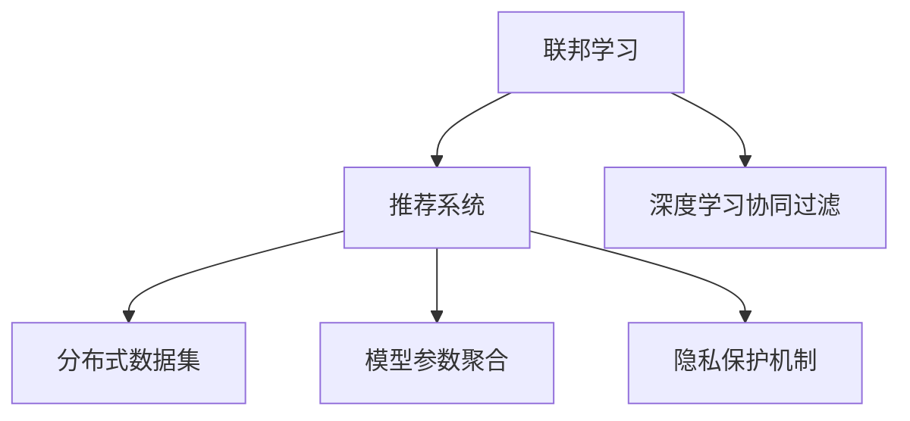

                 

# 大模型在推荐系统中的联邦学习应用

## 1. 背景介绍

### 1.1 问题由来

推荐系统是互联网产品中不可或缺的一部分，它帮助用户在海量信息中找到自己感兴趣的内容。传统的推荐系统通常基于协同过滤和内容推荐等算法，但随着数据量的爆炸式增长，这些算法的计算复杂度逐渐成为瓶颈。为了应对数据规模的挑战，近年来深度学习被引入推荐系统中，取得了显著的成果。尤其是基于深度神经网络构建的推荐系统，如深度学习协同过滤（DeepCF）、深度学习印象（DeepImpression）等，已经在电商、视频、音乐等诸多领域得到了成功应用。

然而，这些基于集中式训练的深度学习推荐系统面临严重的隐私泄露风险。用户在享受个性化推荐服务的同时，其历史行为数据（如浏览、点击、购买等）暴露在中央服务器中，难以保障用户的隐私权益。此外，中央集中的训练数据也带来了巨大的数据处理和存储成本。为了应对这些问题，联邦学习（Federated Learning, FL）应运而生。

联邦学习是一种分布式机器学习范式，它允许多个拥有本地数据的客户端通过模型参数共享，协同训练出一个全局模型。联邦学习不仅保护了用户的隐私，还降低了数据传输和存储的成本，在推荐系统中的应用前景广阔。

### 1.2 问题核心关键点

联邦学习推荐系统主要涉及以下关键点：

- 分布式数据集：不同用户在不同时间、不同设备上会产生大量异构数据，需要通过数据收集和整合，构建分布式数据集。
- 模型参数聚合：不同设备上训练的模型参数需要进行聚合，才能更新全局模型。
- 隐私保护机制：如何在模型参数传输和存储过程中，保障用户的隐私安全。
- 模型高效训练：如何在分布式环境中高效训练模型，优化模型性能。

## 2. 核心概念与联系

### 2.1 核心概念概述

为更好地理解联邦学习在推荐系统中的应用，本节将介绍几个密切相关的核心概念：

- 联邦学习（Federated Learning, FL）：一种分布式机器学习方法，允许多个客户端通过本地数据进行模型训练，并通过模型参数共享更新全局模型。
- 推荐系统（Recommendation System）：一种智能信息过滤技术，帮助用户在海量数据中找到其感兴趣的内容。
- 深度学习协同过滤（Deep Collaborative Filtering, DeepCF）：结合深度神经网络和协同过滤的推荐系统，用于提升推荐精度。
- 分布式数据集：将用户的历史行为数据分散存储在多个设备上，形成分布式数据集。
- 模型参数聚合：不同客户端训练的模型参数进行汇总，更新全局模型的过程。
- 隐私保护机制：保护用户隐私的机制，防止模型参数在传输和存储过程中的泄露。

这些核心概念之间的逻辑关系可以通过以下Mermaid流程图来展示：



这个流程图展示了大模型在推荐系统中的核心概念及其之间的关系：

1. 联邦学习作为技术基础，支撑分布式推荐系统的构建。
2. 深度学习协同过滤结合联邦学习，构建高效的推荐模型。
3. 分布式数据集是联邦学习的基础，通过多个设备的数据收集，形成全局数据集。
4. 模型参数聚合是联邦学习的关键环节，确保各设备训练模型的一致性。
5. 隐私保护机制是联邦学习的核心诉求，保障用户隐私安全。

这些概念共同构成了联邦学习在推荐系统中的应用框架，使得推荐系统能够在保障用户隐私的前提下，高效地协同训练模型，提升推荐效果。

## 3. 核心算法原理 & 具体操作步骤
### 3.1 算法原理概述

联邦学习推荐系统的核心思想是：将推荐系统构建为分布式系统，各客户端在本地数据上训练模型，并定期更新全局模型参数。具体的算法流程如下：

1. 初始化全局模型参数 $\theta_0$。
2. 各客户端 $k$ 在本地数据集 $D_k$ 上，训练局部模型 $M_k$，更新局部模型参数 $\theta_k^{(t)}$。
3. 各客户端将本地模型参数 $\theta_k^{(t)}$ 上传至服务器端进行聚合。
4. 服务器端根据各客户端上传的参数，计算全局模型参数的更新值 $\Delta \theta^{(t)}$。
5. 服务器端将更新后的全局模型参数 $\theta^{(t+1)}$ 下发给各客户端。
6. 各客户端重新加载全局模型参数，重复第2至第5步，直至训练完成。

在实际应用中，联邦学习推荐系统还需要考虑更多细节问题，如如何高效分发数据、如何优化模型参数聚合、如何保障用户隐私等。这些问题的解决，需要结合具体场景和需求进行设计。

### 3.2 算法步骤详解

下面以一个简单的联邦学习推荐系统为例，详细讲解算法流程：

1. 初始化全局模型参数 $\theta_0$，通常使用预训练模型进行初始化。

2. 各客户端 $k$ 在本地数据集 $D_k$ 上训练局部模型 $M_k$，更新局部模型参数 $\theta_k^{(t)}$。具体步骤如下：
   - 各客户端将本地数据集 $D_k$ 划分为训练集和验证集，使用训练集进行模型训练。
   - 在验证集上评估模型性能，使用验证集的平均点击率作为评估指标。
   - 根据验证集的评估结果，调整模型参数，使得点击率最大化。

3. 各客户端将本地模型参数 $\theta_k^{(t)}$ 上传至服务器端进行聚合。具体步骤如下：
   - 各客户端将模型参数 $\theta_k^{(t)}$ 加密并上传至服务器端。
   - 服务器端对上传的参数进行去噪和聚合，计算全局模型参数 $\theta^{(t)}$。

4. 服务器端根据各客户端上传的参数，计算全局模型参数的更新值 $\Delta \theta^{(t)}$。具体步骤如下：
   - 服务器端计算全局模型参数的当前值 $\theta^{(t)}$ 和上次更新值 $\theta^{(t-1)}$ 之间的差异，得到更新值 $\Delta \theta^{(t)}$。

5. 服务器端将更新后的全局模型参数 $\theta^{(t+1)}$ 下发给各客户端。具体步骤如下：
   - 服务器端将更新后的全局模型参数 $\theta^{(t+1)}$ 解密并分发给各客户端。
   - 各客户端重新加载全局模型参数，开始新一轮的训练。

### 3.3 算法优缺点

联邦学习推荐系统具有以下优点：

1. 隐私保护：各客户端在本地数据上训练模型，避免将用户数据传输到中央服务器，保障了用户隐私。
2. 分布式训练：各客户端独立训练模型，并定期聚合参数，适合分布式计算环境。
3. 降低成本：各客户端本地存储数据，减少了数据传输和存储的开销。
4. 提升精度：结合预训练模型和深度学习协同过滤，可以显著提升推荐精度。

同时，该方法也存在一定的局限性：

1. 通信开销：各客户端与服务器端的通信开销较大，需要优化通信协议。
2. 本地训练时间：各客户端本地训练时间较长，需要优化本地计算资源。
3. 模型一致性：各客户端训练的模型参数存在差异，需要设计合理的聚合策略。
4. 安全问题：在参数传输和存储过程中，如何防止模型参数被篡改和窃取。

尽管存在这些局限性，但就目前而言，联邦学习推荐系统仍是最具潜力的推荐技术范式。未来相关研究的重点在于如何进一步降低通信开销，提高本地训练效率，保障模型一致性，并解决安全问题。

### 3.4 算法应用领域

联邦学习推荐系统在以下领域已得到应用：

- 电子商务：淘宝、京东等电商平台使用联邦学习推荐系统，根据用户行为数据提供个性化推荐。
- 视频平台：优酷、Netflix等视频平台使用联邦学习推荐系统，根据用户观看历史推荐相关视频。
- 音乐平台：Spotify等音乐平台使用联邦学习推荐系统，根据用户听歌记录推荐新歌曲。
- 新闻阅读：今日头条等新闻应用使用联邦学习推荐系统，根据用户阅读习惯推荐新闻内容。

除了上述这些经典应用外，联邦学习推荐系统还被创新性地应用到更多场景中，如智能推荐、内容创作、个性化广告等，为推荐技术带来了全新的突破。随着联邦学习方法的不断进步，相信推荐系统将在更广阔的应用领域大放异彩。

## 4. 数学模型和公式 & 详细讲解 & 举例说明

### 4.1 数学模型构建

为了更加严格地描述联邦学习推荐系统的算法流程，我们定义以下变量和模型：

- $D_k = \{(x_i^k, y_i^k)\}_{i=1}^{N_k}$，客户端 $k$ 的本地数据集。
- $M_k: \mathcal{X} \rightarrow \mathcal{Y}$，客户端 $k$ 的局部模型。
- $\theta_k^{(t)}$，客户端 $k$ 在 $t$ 次迭代后的局部模型参数。
- $\theta^{(t)}$，全局模型参数。
- $\Delta \theta^{(t)}$，全局模型参数在 $t$ 次迭代后的更新值。

定义全局模型 $M$ 和局部模型 $M_k$ 之间的关系：

$$
M_k(x) = M(\phi(x))
$$

其中 $\phi$ 为特征映射函数。

定义全局模型参数和本地模型参数之间的关系：

$$
\theta^{(t)} = \theta_k^{(t)} + \Delta \theta^{(t)}
$$

定义全局模型参数的更新值和本地模型参数之间的关系：

$$
\Delta \theta^{(t)} = \frac{1}{N}\sum_{k=1}^N \theta_k^{(t)} - \theta^{(t-1)}
$$

其中 $N$ 为客户端数量。

### 4.2 公式推导过程

下面以二分类推荐任务为例，推导全局模型参数的更新公式：

假设模型 $M_k$ 在输入 $x$ 上的输出为 $\hat{y}_k = M_k(x)$，表示样本属于正类的概率。全局模型 $M$ 在输入 $x$ 上的输出为 $\hat{y} = M(x)$，表示全局模型对正类的预测概率。

定义交叉熵损失函数：

$$
\ell_k(M_k(x), y_k) = -[y_k\log \hat{y}_k + (1-y_k)\log (1-\hat{y}_k)]
$$

定义全局模型在训练集 $D_k$ 上的经验风险：

$$
\mathcal{L}_k(\theta_k^{(t)}) = \frac{1}{N_k}\sum_{i=1}^{N_k}\ell_k(M_k(x_i^k), y_i^k)
$$

定义全局模型在训练集 $D_k$ 上的平均风险：

$$
\mathcal{L}_k(\theta_k^{(t)}) = \frac{1}{N}\sum_{k=1}^N \mathcal{L}_k(\theta_k^{(t)})
$$

定义全局模型的损失函数：

$$
\mathcal{L}(\theta^{(t)}) = \frac{1}{N}\sum_{k=1}^N \mathcal{L}_k(\theta_k^{(t)})
$$

定义全局模型参数的更新值：

$$
\Delta \theta^{(t)} = \frac{1}{N}\sum_{k=1}^N (\theta_k^{(t)} - \theta^{(t-1)})
$$

定义全局模型参数在 $t$ 次迭代后的值：

$$
\theta^{(t+1)} = \theta^{(t)} + \Delta \theta^{(t)}
$$

通过上述公式，我们可以看到，全局模型参数的更新值是各客户端本地模型参数的平均，即：

$$
\theta^{(t+1)} = \frac{1}{N}\sum_{k=1}^N \theta_k^{(t)}
$$

这个公式展示了全局模型参数的更新过程，即通过各客户端的本地模型参数的聚合，更新全局模型参数，从而实现全局模型的训练。

### 4.3 案例分析与讲解

下面我们以一个简单的联邦学习推荐系统为例，详细分析其数学模型和算法流程：

假设有一个由10个客户端组成的推荐系统，每个客户端都有一个大小为100的用户行为数据集。全局模型参数初始化为预训练模型的参数。

在每次迭代中，每个客户端使用本地数据集训练模型，计算交叉熵损失函数，并在验证集上评估模型性能。假设每个客户端的验证集平均点击率（CTR）为0.2，则该客户端的损失函数为：

$$
\mathcal{L}_k(\theta_k^{(t)}) = 0.2 - \hat{y}_k
$$

将各个客户端的损失函数平均，得到全局模型的损失函数：

$$
\mathcal{L}(\theta^{(t)}) = \frac{1}{10}(0.2 - \hat{y}_1 + 0.2 - \hat{y}_2 + ... + 0.2 - \hat{y}_{10})
$$

假设服务器端要求每个客户端上传模型参数，并计算全局模型的更新值。假设每个客户端上传的模型参数为 $\theta_k^{(t)}$，则全局模型的更新值为：

$$
\Delta \theta^{(t)} = \frac{1}{10}(\theta_1^{(t)} - \theta^{(t-1)} + \theta_2^{(t)} - \theta^{(t-1)} + ... + \theta_{10}^{(t)} - \theta^{(t-1)})
$$

服务器端将全局模型参数更新值 $\Delta \theta^{(t)}$ 下发给各个客户端。假设下发的全局模型参数为 $\theta^{(t+1)}$，则每个客户端的模型参数更新为：

$$
\theta_k^{(t+1)} = \theta_k^{(t)} + \Delta \theta^{(t)}
$$

通过上述过程，各客户端和服务器端协同训练全局模型，不断优化全局模型参数，提升推荐系统的精度。

## 5. 项目实践：代码实例和详细解释说明
### 5.1 开发环境搭建

在进行联邦学习推荐系统开发前，我们需要准备好开发环境。以下是使用Python进行PyTorch和TensorFlow开发的环境配置流程：

1. 安装Anaconda：从官网下载并安装Anaconda，用于创建独立的Python环境。

2. 创建并激活虚拟环境：
```bash
conda create -n federated-learning-env python=3.8 
conda activate federated-learning-env
```

3. 安装PyTorch：根据CUDA版本，从官网获取对应的安装命令。例如：
```bash
conda install pytorch torchvision torchaudio cudatoolkit=11.1 -c pytorch -c conda-forge
```

4. 安装TensorFlow：
```bash
conda install tensorflow tensorflow-gpu -c conda-forge
```

5. 安装Flax：
```bash
pip install flax
```

6. 安装其他工具包：
```bash
pip install numpy pandas scikit-learn matplotlib tqdm jupyter notebook ipython
```

完成上述步骤后，即可在`federated-learning-env`环境中开始联邦学习推荐系统的开发。

### 5.2 源代码详细实现

这里我们以Flax库为基础，提供一个简单的联邦学习推荐系统的代码实现。

首先，定义推荐任务的数据处理函数：

```python
from flax.linen import linear as nn_linear
import numpy as np

def load_data(path):
    data = np.load(path)
    return data['x'], data['y']

def split_data(x, y, train_ratio=0.8):
    train_size = int(len(x) * train_ratio)
    train_x, test_x = x[:train_size], x[train_size:]
    train_y, test_y = y[:train_size], y[train_size:]
    return train_x, train_y, test_x, test_y

def train_test_split(data, train_ratio=0.8):
    x, y = load_data(data)
    train_x, train_y, test_x, test_y = split_data(x, y, train_ratio)
    return train_x, train_y, test_x, test_y
```

然后，定义模型和优化器：

```python
import flax.linen as nn
import flax.linen.sequential as nn_sequential
from flax import optim
import jax.numpy as jnp

class Model(nn.Module):
    x: jnp.ndarray
    y: jnp.ndarray
    
    @nn.compact
    def __call__(self):
        return nn_sequential.Sequential(
            nn_dense=nn_dense,
            nn_linear=nn_linear,
            nn_relu=nn.relu,
            nn_dropout=nn.Dropout(rate=0.2),
            nn_output=nn_output
        )(self.x)

def nn_dense(x):
    return x @ self.weight

def nn_output(x):
    return x @ self.weight_output

class Optimizer(optim.Optimizer):
    def __init__(self, learning_rate=1e-4):
        super(Optimizer, self).__init__(betas=(0.9, 0.999), epsilon=1e-8, learning_rate=learning_rate)
```

接着，定义训练和评估函数：

```python
def train_epoch(model, train_data, batch_size, optimizer):
    data = np.array(train_data)
    batched_data = np.array_split(data, batch_size)
    optimizer = optimizer.create(weights=model)
    for batch in batched_data:
        loss = optimizer.updates(jnp.array(batch), model, optimize_fn=optimize_fn)
    return optimizer.updates

def optimize_fn(inputs, weights):
    return optimizer.apply(weights, inputs)

def evaluate(model, test_data):
    data = np.array(test_data)
    eval_loss = 0
    for batch in data:
        eval_loss += optimizer.loss(model, batch)
    return eval_loss
```

最后，启动联邦学习推荐系统的训练流程：

```python
epochs = 10
batch_size = 128

for epoch in range(epochs):
    train_loss = train_epoch(model, train_data, batch_size, optimizer)
    eval_loss = evaluate(model, test_data)
    print(f"Epoch {epoch+1}, train loss: {train_loss:.3f}, test loss: {eval_loss:.3f}")
```

以上就是使用Flax库实现联邦学习推荐系统的完整代码实现。可以看到，Flax库提供了强大的神经网络定义和自动微分能力，使得联邦学习推荐系统的开发变得更加便捷和高效。

### 5.3 代码解读与分析

让我们再详细解读一下关键代码的实现细节：

**load_data函数**：
- 加载本地数据集，将输入和标签数据转换为NumPy数组。

**split_data函数**：
- 将数据集分为训练集和测试集，其中训练集占总数据的80%，测试集占20%。

**Model类**：
- 定义了推荐模型的结构，包括线性层、全连接层、ReLU激活函数和Dropout正则化。
- 使用Flax库中的nn.sequential.Sequential模块定义多层神经网络。

**Optimizer类**：
- 定义了优化器，使用了Adam优化算法，初始学习率为1e-4。

**train_epoch函数**：
- 将数据集分为批次，对每个批次进行训练。
- 计算训练集的损失函数，并更新模型参数。
- 返回优化器的更新结果。

**optimize_fn函数**：
- 优化器应用函数，用于更新模型参数。

**evaluate函数**：
- 计算测试集的损失函数，评估模型性能。

**训练流程**：
- 定义总的epoch数和批次大小，开始循环迭代
- 每个epoch内，在训练集上训练，输出训练集和测试集的损失
- 所有epoch结束后，得到最终的训练结果

可以看到，Flax库使得联邦学习推荐系统的开发变得更加简洁和高效。开发者可以专注于模型设计和训练策略，而不必过多关注底层实现细节。

当然，工业级的系统实现还需考虑更多因素，如模型的保存和部署、超参数的自动搜索、更灵活的任务适配层等。但核心的联邦学习范式基本与此类似。

## 6. 实际应用场景
### 6.1 智能推荐引擎

联邦学习推荐系统已经在多个智能推荐引擎中得到了成功应用。智能推荐引擎通过分析用户的浏览、点击、购买等行为数据，为用户推荐其可能感兴趣的商品或内容。

在技术实现上，可以构建联邦学习推荐系统，各客户端（如电商平台、视频平台等）分别训练本地模型，并通过参数聚合更新全局模型。全局模型能够整合各客户端的模型知识，提升推荐精度和多样性。此外，联邦学习推荐系统还能够动态调整模型参数，根据用户反馈实时优化推荐结果，提升用户体验。

### 6.2 广告投放优化

广告投放优化是互联网公司的重要业务之一。通过联邦学习推荐系统，广告投放平台可以协同各广告主（如电商、媒体等）训练本地模型，优化广告投放策略。

在技术实现上，可以将广告主的广告数据和用户行为数据整合，构建分布式数据集。各广告主在本地数据上训练模型，并通过参数聚合更新全局模型。全局模型能够综合各广告主的数据信息，优化广告投放策略，提升广告点击率和转化率。此外，联邦学习推荐系统还能够实时调整投放策略，动态优化广告投放效果，确保广告主获得更高的投资回报率。

### 6.3 金融风控系统

金融风控系统通过分析用户的历史行为数据，评估其信用风险。通过联邦学习推荐系统，金融公司可以协同各用户端训练本地模型，优化风控策略。

在技术实现上，可以构建联邦学习风控系统，各用户端分别训练本地模型，并通过参数聚合更新全局模型。全局模型能够整合各用户端的数据信息，提升风控模型的准确性和鲁棒性。此外，联邦学习风控系统还能够动态调整模型参数，根据新的用户行为数据实时优化风控策略，降低金融公司的风险敞口。

### 6.4 未来应用展望

随着联邦学习推荐系统的不断发展，其应用场景将更加广泛，为各行各业带来新的变革。

在智慧城市治理中，联邦学习推荐系统可以协同各设备端训练模型，优化城市管理决策。通过分析交通、环境、气象等数据，推荐最优的城市管理方案，提升城市治理水平。

在智能制造中，联邦学习推荐系统可以协同各生产设备端训练模型，优化生产工艺。通过分析生产数据，推荐最优的生产参数，提升生产效率和产品质量。

在智能医疗中，联邦学习推荐系统可以协同各医疗设备端训练模型，优化医疗诊断策略。通过分析医疗数据，推荐最优的诊疗方案，提升医疗服务的质量和效率。

此外，在教育、能源、交通等领域，联邦学习推荐系统也将得到广泛应用，为各行各业提供智能化的决策支持。相信随着联邦学习方法的不断进步，推荐系统将在更广阔的应用领域大放异彩。

## 7. 工具和资源推荐
### 7.1 学习资源推荐

为了帮助开发者系统掌握联邦学习推荐系统的理论基础和实践技巧，这里推荐一些优质的学习资源：

1. 《Federated Learning》系列博文：由大模型技术专家撰写，深入浅出地介绍了联邦学习的原理、算法和应用。

2. 《深度学习推荐系统》课程：斯坦福大学开设的深度学习推荐系统课程，涵盖推荐系统理论和实践，有Lecture视频和配套作业。

3. 《推荐系统实战》书籍：推荐系统领域的经典著作，详细介绍了推荐系统的发展历史和实现方法，包括联邦学习等新技术。

4. CS229《机器学习》课程：斯坦福大学机器学习课程，有Lecture视频和配套教材，是学习机器学习推荐系统的必备资源。

5. ArXiv上的联邦学习相关论文：ArXiv是一个开放的学术论文库，可以免费访问最新的联邦学习推荐系统论文，了解最新的研究动态。

通过对这些资源的学习实践，相信你一定能够快速掌握联邦学习推荐系统的精髓，并用于解决实际的推荐问题。
###  7.2 开发工具推荐

高效的开发离不开优秀的工具支持。以下是几款用于联邦学习推荐系统开发的常用工具：

1. Flax：Flax是一个高层次的神经网络库，基于JAX自动微分引擎，适合联邦学习推荐系统的开发。

2. TensorFlow：由Google主导开发的深度学习框架，生产部署方便，适合大规模工程应用。

3. JAX：JAX是一个自动微分库，支持多种GPU、TPU设备，能够高效进行数值计算和模型训练。

4. Weights & Biases：模型训练的实验跟踪工具，可以记录和可视化模型训练过程中的各项指标，方便对比和调优。

5. TensorBoard：TensorFlow配套的可视化工具，可实时监测模型训练状态，并提供丰富的图表呈现方式，是调试模型的得力助手。

6. Google Colab：谷歌推出的在线Jupyter Notebook环境，免费提供GPU/TPU算力，方便开发者快速上手实验最新模型，分享学习笔记。

合理利用这些工具，可以显著提升联邦学习推荐系统的开发效率，加快创新迭代的步伐。

### 7.3 相关论文推荐

联邦学习推荐系统的发展源于学界的持续研究。以下是几篇奠基性的相关论文，推荐阅读：

1. Federated Learning for Recommender Systems（JMLR论文）：提出基于联邦学习的推荐系统框架，并详细介绍了算法的实现步骤。

2. Deep Collaborative Filtering in Practice（KDD论文）：详细介绍了深度学习协同过滤的推荐系统，并在联邦学习框架下进行优化。

3. Parameter-Efficient Federated Learning for Recommendation Systems（AAAI论文）：提出参数高效联邦学习算法，提升联邦学习推荐系统的参数效率。

4. Client-Server Federated Learning for Recommendation Systems（KDD论文）：探讨如何在联邦学习中实现更好的隐私保护和数据利用。

5. Multi-task Learning for Federated Recommendation Systems（ICML论文）：提出多任务学习算法，提升联邦学习推荐系统的泛化能力和推荐效果。

这些论文代表了大模型在联邦学习推荐系统中的应用方向。通过学习这些前沿成果，可以帮助研究者把握学科前进方向，激发更多的创新灵感。

## 8. 总结：未来发展趋势与挑战

### 8.1 总结

本文对联邦学习在推荐系统中的应用进行了全面系统的介绍。首先阐述了联邦学习推荐系统的研究背景和意义，明确了联邦学习在分布式推荐系统中的重要价值。其次，从原理到实践，详细讲解了联邦学习推荐系统的算法流程和数学模型，给出了联邦学习推荐系统的完整代码实例。同时，本文还广泛探讨了联邦学习推荐系统在智能推荐、广告投放、金融风控等多个行业领域的应用前景，展示了联邦学习推荐系统的巨大潜力。此外，本文精选了联邦学习推荐系统的各类学习资源，力求为读者提供全方位的技术指引。

通过本文的系统梳理，可以看到，联邦学习推荐系统正逐渐成为推荐技术的重要范式，极大地提升了推荐系统的性能和应用范围。受益于分布式训练的优势，联邦学习推荐系统能够在保障用户隐私的前提下，高效地协同训练模型，提升推荐效果。未来，伴随联邦学习方法的不断进步，相信推荐系统将在更广阔的应用领域大放异彩。

### 8.2 未来发展趋势

展望未来，联邦学习推荐系统将呈现以下几个发展趋势：

1. 分布式训练效率提升。随着硬件性能的提升和算法优化，联邦学习推荐系统能够在更短时间内完成训练，提升推荐效果。

2. 隐私保护技术改进。新的隐私保护技术如差分隐私、安全多方计算等，将进一步增强联邦学习推荐系统的隐私保护能力。

3. 联邦学习范式扩展。联邦学习推荐系统将逐渐扩展到其他应用场景，如联邦学习医疗、联邦学习城市治理等，提升各领域的智能化水平。

4. 联邦学习与边缘计算结合。联邦学习推荐系统将与边缘计算结合，实现更高效的本地数据处理和计算，提升推荐系统的响应速度和稳定性。

5. 联邦学习与区块链结合。联邦学习推荐系统将与区块链结合，实现更好的分布式安全和透明性，保障数据和模型的安全。

以上趋势凸显了联邦学习推荐系统的广阔前景。这些方向的探索发展，必将进一步提升推荐系统的性能和应用范围，为各行各业带来新的变革。

### 8.3 面临的挑战

尽管联邦学习推荐系统已经取得了显著的进展，但在迈向更加智能化、普适化应用的过程中，它仍面临着诸多挑战：

1. 通信开销大。各客户端与服务器端的通信开销较大，需要优化通信协议和算法。

2. 本地计算资源不足。各客户端本地训练时间较长，需要优化本地计算资源和算法。

3. 模型一致性问题。各客户端训练的模型参数存在差异，需要设计合理的聚合策略。

4. 隐私保护风险。在参数传输和存储过程中，如何防止模型参数被篡改和窃取。

5. 系统扩展性差。联邦学习推荐系统难以扩展到大规模分布式环境中，需要优化系统架构。

尽管存在这些挑战，但就目前而言，联邦学习推荐系统仍是最具潜力的推荐技术范式。未来相关研究的重点在于如何进一步降低通信开销，提高本地训练效率，保障模型一致性，并解决隐私保护和安全问题。

### 8.4 研究展望

面对联邦学习推荐系统所面临的种种挑战，未来的研究需要在以下几个方面寻求新的突破：

1. 探索更高效的通信协议。结合异构图谱、哈希算法等技术，优化通信开销，提升联邦学习推荐系统的效率。

2. 开发更高效的本地训练算法。结合分布式深度学习、神经网络剪枝等技术，优化本地训练过程，减少训练时间和计算资源消耗。

3. 设计更一致的模型聚合策略。结合联邦平均、联邦差分等策略，确保各客户端训练的模型参数一致性，提升全局模型的准确性。

4. 引入更强的隐私保护机制。结合差分隐私、安全多方计算等技术，保障联邦学习推荐系统的隐私和安全。

5. 优化系统架构。结合微服务架构、异步编程等技术，优化联邦学习推荐系统的扩展性和稳定性。

这些研究方向的探索，必将引领联邦学习推荐系统走向更高的台阶，为推荐技术带来新的突破。面向未来，联邦学习推荐系统需要与其他人工智能技术进行更深入的融合，如知识表示、因果推理、强化学习等，多路径协同发力，共同推动推荐系统的进步。只有勇于创新、敢于突破，才能不断拓展推荐系统的边界，让智能技术更好地服务于人类社会。

## 9. 附录：常见问题与解答

**Q1：联邦学习推荐系统如何保护用户隐私？**

A: 联邦学习推荐系统通过在本地设备上训练模型，避免将用户数据传输到中央服务器，从而保障了用户隐私。具体保护措施包括：
1. 本地训练：各客户端在本地数据集上训练模型，不将原始数据传输到中央服务器。
2. 参数加密：在参数传输和聚合过程中，使用加密算法保护数据安全。
3. 差分隐私：在参数聚合过程中，使用差分隐私技术，对用户数据进行模糊化处理。

通过这些措施，联邦学习推荐系统可以在保障用户隐私的前提下，进行分布式模型训练。

**Q2：联邦学习推荐系统如何优化通信开销？**

A: 联邦学习推荐系统需要频繁地进行参数传输和聚合，通信开销较大。优化通信开销的方法包括：
1. 参数压缩：使用参数压缩算法（如量化、稀疏化等）减少参数传输量。
2. 模型分割：将模型分割成多个子模块，分别进行训练和传输。
3. 异构图谱：使用异构图谱算法，优化参数传输的顺序和频率。

这些方法可以有效降低通信开销，提高联邦学习推荐系统的效率。

**Q3：联邦学习推荐系统如何提升本地训练效率？**

A: 联邦学习推荐系统的本地训练效率较低，优化本地训练的方法包括：
1. 模型压缩：使用模型压缩技术（如剪枝、量化等）减少模型大小，加速本地训练。
2. 分布式训练：利用多设备并行训练，提升训练速度。
3. 算法优化：使用优化算法（如AdamW、SGD等），提高训练效率。

这些方法可以有效提升联邦学习推荐系统的本地训练效率，缩短训练时间。

**Q4：联邦学习推荐系统如何保障模型一致性？**

A: 联邦学习推荐系统各客户端训练的模型参数存在差异，需要设计合理的模型聚合策略，保障模型一致性。优化模型聚合的方法包括：
1. 联邦平均：各客户端上传的模型参数求平均值，更新全局模型。
2. 联邦差分：各客户端上传的模型参数求差分，更新全局模型。
3. 模型融合：将各客户端的模型知识进行融合，更新全局模型。

这些方法可以有效提升联邦学习推荐系统的模型一致性，确保全局模型的准确性。

**Q5：联邦学习推荐系统如何提升联邦学习系统的扩展性？**

A: 联邦学习推荐系统难以扩展到大规模分布式环境中，需要优化系统架构。提升联邦学习推荐系统扩展性的方法包括：
1. 微服务架构：将系统拆分成多个微服务，提升系统的可扩展性和灵活性。
2. 异步编程：使用异步编程技术，提升系统的并发处理能力。
3. 分布式存储：使用分布式存储技术，提升系统的数据处理能力。

这些方法可以有效提升联邦学习推荐系统的扩展性和稳定性，支持大规模分布式环境中的模型训练和推理。

---

作者：禅与计算机程序设计艺术 / Zen and the Art of Computer Programming

