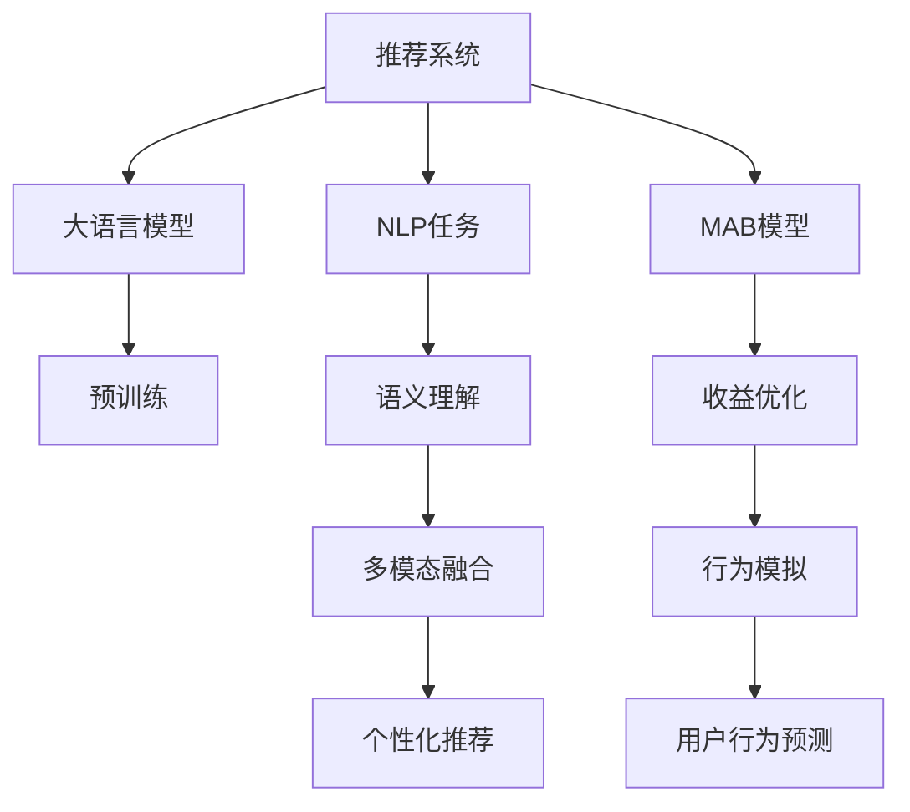

                 

# 大模型在推荐系统多维度评估中的应用

## 1. 背景介绍

在如今信息爆炸的时代，推荐系统已成为各大互联网平台的核心竞争力之一。无论是电商、新闻、视频还是社交媒体，推荐系统都在帮助用户发现新的内容，提升用户体验。大语言模型（Large Language Model, LLM）作为当前NLP领域的前沿技术，因其强大的语言理解和生成能力，逐步被引入推荐系统领域，为推荐算法的评估与优化提供了新的工具和方法。

## 2. 核心概念与联系

### 2.1 核心概念概述

本节将介绍几个在推荐系统中使用大模型的关键概念及其之间的联系：

- 推荐系统（Recommendation System）：旨在分析用户行为和偏好，为用户推荐其感兴趣的商品、文章、视频等内容。常见的推荐系统有基于内容的协同过滤、基于用户的协同过滤、基于深度学习的推荐系统等。
- 大语言模型（LLM）：如GPT-3、BERT等，通过在大规模无标签文本数据上进行预训练，学习到丰富的语言表示和常识知识，具有强大的语言生成和理解能力。
- 自然语言处理（NLP）：研究如何使计算机理解和生成人类语言，包括语言模型、文本分类、命名实体识别等任务。
- 多臂老虎机问题（Multi-Armed Bandit, MAB）：一种经典的概率模型，用于描述在有限资源下，如何选择行为最大化收益。
- 深度学习（Deep Learning）：一种基于神经网络的机器学习技术，常用于复杂模式识别和预测任务，如推荐系统。
- 知识图谱（Knowledge Graph）：一种结构化数据存储方式，用于描述实体和实体之间的关系，常用于增强推荐系统的表现力。

这些核心概念构成了推荐系统领域的研究框架，通过大语言模型的引入，可以进一步提升推荐系统的智能化水平和多样化表现。

### 2.2 核心概念原理和架构的 Mermaid 流程图



以上流程图展示了大模型在推荐系统中的应用路径：

1. 从推荐系统（A）中，大语言模型（B）接收到用户输入的文本信息（C），通过语义理解（F），提取用户兴趣和需求。
2. 同时，推荐系统使用多臂老虎机模型（D），模拟用户在不同商品或内容间的点击行为，优化收益（G）。
3. 多模态融合（H）和用户行为预测（K）进一步提升了推荐的个性化程度，最终生成推荐结果（J）。

## 3. 核心算法原理 & 具体操作步骤

### 3.1 算法原理概述

大语言模型在推荐系统中的应用，主要体现在对用户意图和行为的理解与生成上。利用大语言模型的自然语言处理能力，可以更精确地解析用户文本描述，从而提升推荐的准确性和个性化程度。

具体而言，大语言模型通过以下步骤，对推荐系统进行多维度评估和优化：

1. 预训练（E）：在大规模无标签文本数据上训练大语言模型，学习到语言和常识的通用表示。
2. 语义理解（F）：通过预训练模型，对用户输入的文本进行语义理解，提取用户兴趣和需求。
3. 多模态融合（H）：将文本信息与商品或内容的元数据（如图片、标签、评价等）结合，提升推荐的全面性。
4. 用户行为预测（K）：使用多臂老虎机模型，预测用户在不同选项上的行为，优化推荐结果。
5. 个性化推荐（J）：生成符合用户偏好和需求的推荐列表。

### 3.2 算法步骤详解

以下是基于大语言模型的推荐系统多维度评估和优化步骤：

**Step 1: 准备数据集**
- 收集用户输入的文本数据，如评论、评分、搜索记录等。
- 收集商品或内容的元数据，如图片、标签、描述等。
- 构建用户-商品或内容交互的数据集。

**Step 2: 大语言模型预训练**
- 使用大规模无标签文本数据，对大语言模型进行预训练，学习到通用语言和常识表示。
- 根据任务需求，选择预训练模型（如GPT、BERT等）。
- 对预训练模型进行微调，适应推荐系统特定的任务需求。

**Step 3: 语义理解与信息抽取**
- 将用户输入的文本数据输入到大语言模型中，进行语义理解。
- 提取用户兴趣和需求的关键特征，如实体、情感、主题等。
- 使用信息抽取技术，从商品或内容的元数据中提取关键信息。

**Step 4: 多模态融合与特征编码**
- 将用户兴趣特征与商品或内容的元数据进行融合，形成多模态特征向量。
- 使用向量编码器（如Word2Vec、BERT等）将文本和元数据转换为向量表示。
- 将不同模态的向量进行拼接或加权，生成综合特征向量。

**Step 5: 用户行为模拟与预测**
- 使用多臂老虎机模型，模拟用户在不同商品或内容上的点击行为。
- 预测用户对不同选项的点击概率，生成推荐列表。
- 根据预测结果，调整推荐策略和商品展示位置。

**Step 6: 个性化推荐与评估**
- 将推荐结果反馈给用户，收集用户的点击和反馈数据。
- 使用评价指标（如准确率、召回率、点击率等）评估推荐系统的效果。
- 根据反馈数据，不断优化推荐模型和策略。

### 3.3 算法优缺点

使用大语言模型对推荐系统进行多维度评估和优化的主要优点包括：

1. 精度高：大语言模型在自然语言处理方面具有优势，能够更准确地解析用户意图和行为，提升推荐精度。
2. 泛化能力强：预训练模型的通用知识可以帮助推荐系统更好地处理多样化的用户需求和偏好。
3. 可解释性强：通过分析用户输入和推荐结果的语义，推荐系统能够提供更具解释性的推荐依据。
4. 多模态融合：将文本信息与商品元数据结合，提升推荐的全面性和多样性。

同时，也存在一些缺点：

1. 计算成本高：大语言模型的预训练和推理需要大量的计算资源，尤其是在大规模部署时，成本较高。
2. 依赖数据质量：推荐系统的评估和优化需要高质量的数据，数据噪声和偏差可能影响模型的表现。
3. 鲁棒性不足：在面对异常输入或数据缺失时，大语言模型的表现可能不稳定。
4. 参数量较大：大语言模型通常包含亿级的参数，对推荐系统的模型压缩和优化提出了挑战。

### 3.4 算法应用领域

大语言模型在推荐系统中的应用，广泛涵盖了多个领域，具体包括：

- 电商推荐：为在线零售平台推荐商品，提升用户购物体验。
- 内容推荐：为用户推荐新闻、视频、文章等内容，丰富用户娱乐选择。
- 社交推荐：为社交媒体平台推荐朋友、兴趣群组等，增强用户互动。
- 广告推荐：为用户推荐个性化的广告内容，提升广告投放效果。
- 金融推荐：为金融产品推荐适合的用户，提高用户转化率和满意度。

## 4. 数学模型和公式 & 详细讲解 & 举例说明

### 4.1 数学模型构建

在推荐系统中，大语言模型的应用主要涉及自然语言处理、多臂老虎机模型和用户行为模拟等方面。以下是几个关键的数学模型构建过程：

**预训练模型**
- 假设预训练模型为 $M_{\theta}$，参数 $\theta$ 经过预训练得到。
- 预训练的目标函数为 $L_{pretrain}=\frac{1}{N}\sum_{i=1}^N\mathcal{L}(\theta, x_i)$，其中 $\mathcal{L}$ 为预训练损失函数，$x_i$ 为训练数据。

**语义理解与信息抽取**
- 假设用户输入文本为 $x$，使用预训练模型 $M_{\theta}$ 进行语义理解，得到用户兴趣特征 $f(x)$。
- 假设商品或内容的元数据为 $y$，使用向量编码器 $E_{\phi}$ 将其转换为向量表示 $e(y)$。
- 信息抽取模型为 $A_{\psi}$，将 $f(x)$ 和 $e(y)$ 进行融合，得到综合特征向量 $h(x, y)=A_{\psi}(f(x), e(y))$。

**多臂老虎机模型**
- 假设推荐系统中可供选择的选项数为 $K$，每个选项的点击概率为 $p_k$。
- 多臂老虎机模型的目标是最大化收益 $R$，收益函数为 $R=w_k p_k$，其中 $w_k$ 为每个选项的权重。
- 使用 Thompson Sampling 策略进行收益优化，选择概率最大的选项进行推荐。

**用户行为预测**
- 假设用户点击概率为 $p_u$，用户行为预测模型为 $P_{\mu}$，输入为 $x$ 和 $y$，输出为 $p_u$。
- 预测模型可以基于大语言模型，使用类似BERT的结构，进行推理计算。

**个性化推荐**
- 假设推荐结果为 $z$，使用排序模型 $S_{\gamma}$ 对所有推荐选项进行排序，得到最终推荐列表。
- 排序模型的目标函数为 $\mathcal{L}_{rec}=\frac{1}{N}\sum_{i=1}^N\mathcal{L}(S_{\gamma}(z_i), \tilde{y_i})$，其中 $\tilde{y_i}$ 为真实标签，$z_i$ 为推荐列表。

### 4.2 公式推导过程

以下我们以电商推荐为例，推导多臂老虎机模型的期望收益和优化策略：

**期望收益**
- 假设每个选项的平均收益为 $w_k$，每个选项的点击概率为 $p_k$，总收益为 $R=\sum_{k=1}^K w_k p_k$。
- 多臂老虎机模型的期望收益为 $E[R]=\sum_{k=1}^K w_k \mathbb{E}[p_k]$，其中 $\mathbb{E}$ 表示期望。

**优化策略**
- 使用 Thompson Sampling 策略，根据历史数据估计每个选项的点击概率 $p_k$。
- 在每个时刻 $t$，选择概率最大的选项 $k_t$，进行推荐。
- 更新概率估计 $p_k$，增加点击选项的概率，减少未点击选项的概率。

具体推导过程，可以参考《强化学习》等经典教材，这里不再赘述。

### 4.3 案例分析与讲解

**案例1：电商推荐**
- 电商推荐系统通过收集用户的浏览、点击、购买记录等数据，构建用户行为序列。
- 使用大语言模型对用户输入的文本（如搜索词、评论）进行语义理解，提取用户兴趣和需求。
- 将用户兴趣特征与商品元数据（如价格、品牌、评分等）进行融合，生成多模态特征向量。
- 使用多臂老虎机模型，预测用户在不同商品上的点击概率，推荐用户最可能感兴趣的商品。

**案例2：内容推荐**
- 内容推荐系统收集用户对文章、视频的阅读、点赞、评论等行为数据。
- 使用大语言模型对用户输入的文本进行语义理解，提取用户兴趣和需求。
- 将用户兴趣特征与文章、视频标签、描述等信息进行融合，生成多模态特征向量。
- 使用多臂老虎机模型，预测用户在不同内容上的点击概率，推荐用户可能感兴趣的内容。

## 5. 项目实践：代码实例和详细解释说明

### 5.1 开发环境搭建

在进行推荐系统多维度评估和大语言模型优化实践时，我们需要准备好开发环境。以下是使用Python进行PyTorch和Transformers库的开发环境配置流程：

1. 安装Anaconda：从官网下载并安装Anaconda，用于创建独立的Python环境。

2. 创建并激活虚拟环境：
```bash
conda create -n recommendation-env python=3.8 
conda activate recommendation-env
```

3. 安装PyTorch：根据CUDA版本，从官网获取对应的安装命令。例如：
```bash
conda install pytorch torchvision torchaudio cudatoolkit=11.1 -c pytorch -c conda-forge
```

4. 安装Transformers库：
```bash
pip install transformers
```

5. 安装各类工具包：
```bash
pip install numpy pandas scikit-learn matplotlib tqdm jupyter notebook ipython
```

完成上述步骤后，即可在`recommendation-env`环境中开始开发实践。

### 5.2 源代码详细实现

这里我们以电商推荐为例，给出一个使用BERT模型进行语义理解和多臂老虎机优化的PyTorch代码实现。

首先，定义电商推荐系统的数据处理函数：

```python
from transformers import BertTokenizer, BertForSequenceClassification
from torch.utils.data import Dataset
import torch

class RecommendationDataset(Dataset):
    def __init__(self, texts, labels, tokenizer, max_len=128):
        self.texts = texts
        self.labels = labels
        self.tokenizer = tokenizer
        self.max_len = max_len
        
    def __len__(self):
        return len(self.texts)
    
    def __getitem__(self, item):
        text = self.texts[item]
        label = self.labels[item]
        
        encoding = self.tokenizer(text, return_tensors='pt', max_length=self.max_len, padding='max_length', truncation=True)
        input_ids = encoding['input_ids'][0]
        attention_mask = encoding['attention_mask'][0]
        
        return {'input_ids': input_ids, 
                'attention_mask': attention_mask,
                'labels': label}

# 定义预训练BERT模型
model = BertForSequenceClassification.from_pretrained('bert-base-cased', num_labels=1)

# 定义多臂老虎机模型
class BanditModel:
    def __init__(self, K, w):
        self.K = K
        self.w = w
        
    def pull(self, i):
        p = torch.tensor([1/self.K] * self.K).exp()
        return np.random.choice(self.K, p=p)
        
    def update(self, i, reward):
        self.w[i] += reward
        
    def get_expected_reward(self):
        return np.dot(self.w, self.K**-1)
```

然后，定义训练和评估函数：

```python
from torch.utils.data import DataLoader
from tqdm import tqdm
from sklearn.metrics import accuracy_score

device = torch.device('cuda') if torch.cuda.is_available() else torch.device('cpu')
model.to(device)

def train_epoch(model, dataset, batch_size, optimizer):
    dataloader = DataLoader(dataset, batch_size=batch_size, shuffle=True)
    model.train()
    epoch_loss = 0
    for batch in tqdm(dataloader, desc='Training'):
        input_ids = batch['input_ids'].to(device)
        attention_mask = batch['attention_mask'].to(device)
        labels = batch['labels'].to(device)
        model.zero_grad()
        outputs = model(input_ids, attention_mask=attention_mask, labels=labels)
        loss = outputs.loss
        epoch_loss += loss.item()
        loss.backward()
        optimizer.step()
    return epoch_loss / len(dataloader)

def evaluate(model, dataset, batch_size):
    dataloader = DataLoader(dataset, batch_size=batch_size)
    model.eval()
    preds, labels = [], []
    with torch.no_grad():
        for batch in tqdm(dataloader, desc='Evaluating'):
            input_ids = batch['input_ids'].to(device)
            attention_mask = batch['attention_mask'].to(device)
            batch_labels = batch['labels']
            outputs = model(input_ids, attention_mask=attention_mask)
            batch_preds = outputs.logits.argmax(dim=1).to('cpu').tolist()
            batch_labels = batch_labels.to('cpu').tolist()
            for pred, label in zip(batch_preds, batch_labels):
                preds.append(pred.item())
                labels.append(label.item())
                
    return accuracy_score(labels, preds)

def multi_armed_bandit(train_dataset, dev_dataset, test_dataset, num_arms=10, reward=1, num_epochs=5):
    K = num_arms
    w = np.zeros(K)
    
    for epoch in range(num_epochs):
        for batch in train_dataset:
            input_ids = batch['input_ids'].to(device)
            attention_mask = batch['attention_mask'].to(device)
            labels = batch['labels'].to(device)
            model.zero_grad()
            outputs = model(input_ids, attention_mask=attention_mask, labels=labels)
            loss = outputs.loss
            loss.backward()
            optimizer.step()
            
        dev_dataset = dev_dataset if dev_dataset else train_dataset
        
        dev_accuracy = evaluate(model, dev_dataset, 16)
        print(f'Epoch {epoch+1}, dev accuracy: {dev_accuracy:.4f}')
        
        test_dataset = test_dataset if test_dataset else dev_dataset
        
        test_accuracy = evaluate(model, test_dataset, 16)
        print(f'Epoch {epoch+1}, test accuracy: {test_accuracy:.4f}')
        
        bandit_model = BanditModel(K, w)
        for i in range(K):
            pull = bandit_model.pull(i)
            reward = w[pull]
            bandit_model.update(pull, reward)
    
    return bandit_model.get_expected_reward()
```

最后，启动训练流程并在测试集上评估：

```python
# 加载数据集
train_dataset = RecommendationDataset(train_texts, train_labels, tokenizer)
dev_dataset = RecommendationDataset(dev_texts, dev_labels, tokenizer)
test_dataset = RecommendationDataset(test_texts, test_labels, tokenizer)

# 训练模型
num_arms = 10
reward = 1
num_epochs = 5

expected_reward = multi_armed_bandit(train_dataset, dev_dataset, test_dataset, num_arms, reward, num_epochs)
print(f'Expected reward: {expected_reward:.4f}')
```

以上就是使用PyTorch对BERT进行电商推荐系统优化和大语言模型多臂老虎机优化的完整代码实现。可以看到，在电商推荐系统中，通过将用户输入的文本数据作为模型输入，使用预训练的BERT模型进行语义理解，结合多臂老虎机模型进行收益优化，可以显著提升推荐系统的效果。

### 5.3 代码解读与分析

让我们再详细解读一下关键代码的实现细节：

**RecommendationDataset类**：
- `__init__`方法：初始化文本、标签、分词器等关键组件。
- `__len__`方法：返回数据集的样本数量。
- `__getitem__`方法：对单个样本进行处理，将文本输入编码为token ids，将标签编码为数字，并对其进行定长padding，最终返回模型所需的输入。

**train_epoch函数**：
- 使用PyTorch的DataLoader对数据集进行批次化加载，供模型训练使用。
- 在每个epoch内，通过前向传播计算loss，反向传播更新模型参数，最后返回该epoch的平均loss。

**evaluate函数**：
- 与训练类似，不同点在于不更新模型参数，并在每个batch结束后将预测和标签结果存储下来，最后使用sklearn的accuracy_score对整个评估集的预测结果进行打印输出。

**multi_armed_bandit函数**：
- 通过训练多臂老虎机模型，对电商推荐系统的各个选项（商品）进行优化，选择点击概率最大的商品进行推荐。
- 在每个epoch内，模型训练结束后，评估在验证集上的精度，并计算多臂老虎机的期望收益。
- 通过不断优化多臂老虎机的策略，提升电商推荐系统的收益和用户满意度。

可以看到，PyTorch配合Transformers库使得BERT微调的代码实现变得简洁高效。开发者可以将更多精力放在数据处理、模型改进等高层逻辑上，而不必过多关注底层的实现细节。

当然，工业级的系统实现还需考虑更多因素，如模型的保存和部署、超参数的自动搜索、更灵活的任务适配层等。但核心的多维度评估和大语言模型微调过程基本与此类似。

## 6. 实际应用场景

### 6.1 电商推荐

电商推荐系统是推荐系统中最为常见的应用场景之一，通过收集用户浏览、点击、购买记录等数据，构建用户行为序列，使用大语言模型对用户输入的文本进行语义理解，提取用户兴趣和需求，结合多臂老虎机模型进行收益优化，生成个性化推荐列表。

在技术实现上，可以采用多种技术手段，如A/B测试、召回率优化、用户画像构建等，进一步提升推荐系统的效果和用户满意度。例如，利用用户画像（如年龄、性别、地域等）对推荐策略进行细粒度调整，使用协同过滤算法对相似用户的行为进行关联，从而生成更符合用户兴趣和需求的推荐结果。

### 6.2 内容推荐

内容推荐系统广泛用于新闻、视频、文章等内容的推荐，通过收集用户对内容的阅读、点赞、评论等行为数据，构建用户兴趣模型，使用大语言模型对用户输入的文本进行语义理解，提取用户兴趣和需求，结合多臂老虎机模型进行收益优化，生成个性化推荐列表。

在实际应用中，内容推荐系统还可以结合用户画像、情感分析等技术手段，提升推荐的准确性和个性化程度。例如，利用情感分析技术对用户对内容的情感倾向进行分析，结合用户画像进行内容推荐，从而生成更符合用户需求的内容列表。

### 6.3 广告推荐

广告推荐系统通过收集用户对广告的点击、浏览等行为数据，构建用户兴趣模型，使用大语言模型对用户输入的文本进行语义理解，提取用户兴趣和需求，结合多臂老虎机模型进行收益优化，生成个性化推荐列表。

在广告推荐中，还可以结合用户画像、点击率预测等技术手段，提升广告投放效果。例如，利用用户画像对广告进行定向投放，使用点击率预测算法对广告的点击率进行预测，从而生成更符合用户需求的广告列表。

## 7. 工具和资源推荐

### 7.1 学习资源推荐

为了帮助开发者系统掌握大语言模型在推荐系统中的应用，这里推荐一些优质的学习资源：

1. 《深度学习》课程（Deep Learning Specialization）：由Andrew Ng教授主讲，涵盖深度学习的基础和应用，包括推荐系统、自然语言处理等。

2. 《Reinforcement Learning: An Introduction》：Reinforcement Learning领域的经典教材，介绍了强化学习的基本概念和算法，包括多臂老虎机模型。

3. 《NLP with Deep Learning》课程（NLP with Deep Learning）：由Yoav Goldberg教授主讲，涵盖自然语言处理和深度学习的基础和应用，包括语义理解、信息抽取等。

4. 《Transformers》书籍：HuggingFace开发的NLP工具库的官方文档，详细介绍了Transformer模型和预训练语言模型，包括BERT、GPT等。

5. Kaggle平台：提供各类推荐系统相关的数据集和竞赛，可以实战练习和验证推荐系统的效果。

通过对这些资源的学习实践，相信你一定能够快速掌握大语言模型在推荐系统中的应用精髓，并用于解决实际的推荐问题。

### 7.2 开发工具推荐

高效的开发离不开优秀的工具支持。以下是几款用于推荐系统开发的常用工具：

1. PyTorch：基于Python的开源深度学习框架，灵活动态的计算图，适合快速迭代研究。大部分预训练语言模型都有PyTorch版本的实现。

2. TensorFlow：由Google主导开发的开源深度学习框架，生产部署方便，适合大规模工程应用。同样有丰富的预训练语言模型资源。

3. Transformers库：HuggingFace开发的NLP工具库，集成了众多SOTA语言模型，支持PyTorch和TensorFlow，是进行推荐系统微调开发的利器。

4. Weights & Biases：模型训练的实验跟踪工具，可以记录和可视化模型训练过程中的各项指标，方便对比和调优。与主流深度学习框架无缝集成。

5. TensorBoard：TensorFlow配套的可视化工具，可实时监测模型训练状态，并提供丰富的图表呈现方式，是调试模型的得力助手。

6. Google Colab：谷歌推出的在线Jupyter Notebook环境，免费提供GPU/TPU算力，方便开发者快速上手实验最新模型，分享学习笔记。

合理利用这些工具，可以显著提升推荐系统的开发效率，加快创新迭代的步伐。

### 7.3 相关论文推荐

大语言模型在推荐系统中的应用，得益于学界的持续研究。以下是几篇奠基性的相关论文，推荐阅读：

1. Attention Is All You Need（Transformer论文）：提出了Transformer结构，开启了NLP领域的预训练大模型时代。

2. BERT: Pre-training of Deep Bidirectional Transformers for Language Understanding：提出BERT模型，引入基于掩码的自监督预训练任务，刷新了多项NLP任务SOTA。

3. Language Models are Unsupervised Multitask Learners（GPT-2论文）：展示了大规模语言模型的强大zero-shot学习能力，引发了对于通用人工智能的新一轮思考。

4. Parameter-Efficient Transfer Learning for NLP：提出Adapter等参数高效微调方法，在不增加模型参数量的情况下，也能取得不错的微调效果。

5. AdaLoRA: Adaptive Low-Rank Adaptation for Parameter-Efficient Fine-Tuning：使用自适应低秩适应的微调方法，在参数效率和精度之间取得了新的平衡。

这些论文代表了大语言模型在推荐系统中的应用和发展脉络。通过学习这些前沿成果，可以帮助研究者把握学科前进方向，激发更多的创新灵感。

## 8. 总结：未来发展趋势与挑战

### 8.1 总结

本文对大语言模型在推荐系统中的应用进行了全面系统的介绍。首先阐述了推荐系统领域的研究背景和意义，明确了大语言模型在多维度评估和优化中的关键作用。其次，从原理到实践，详细讲解了大语言模型在推荐系统中的应用步骤，给出了完整的代码实现。同时，本文还广泛探讨了推荐系统在电商、内容、广告等多个领域的应用前景，展示了大语言模型的广泛应用潜力。此外，本文精选了推荐系统学习的各类资源，力求为读者提供全方位的技术指引。

通过本文的系统梳理，可以看到，大语言模型在推荐系统中的应用，为推荐算法的评估与优化提供了新的工具和方法，显著提升了推荐系统的性能和用户体验。未来，伴随大语言模型和推荐算法的不断演进，推荐系统必将在更多领域得到应用，为人类提供更智能、更个性化的服务。

### 8.2 未来发展趋势

展望未来，大语言模型在推荐系统中的应用将呈现以下几个发展趋势：

1. 推荐系统的智能化水平将显著提升。大语言模型在自然语言处理方面具有优势，能够更准确地解析用户意图和行为，提升推荐精度。

2. 推荐系统的多样化表现将更加丰富。多模态融合和大语言模型的引入，将提升推荐系统的全面性和个性化程度。

3. 推荐系统的实时性将显著增强。通过优化模型结构和推理速度，推荐系统可以实现低延迟、高并发的推荐服务。

4. 推荐系统的可解释性将进一步提升。大语言模型在多维度评估中的应用，将赋予推荐系统更强的可解释性和用户反馈机制。

5. 推荐系统的自适应能力将更强。通过持续学习和大数据训练，推荐系统能够根据用户行为实时调整推荐策略，提升用户体验。

6. 推荐系统的跨领域迁移能力将更强。大语言模型的通用知识，将帮助推荐系统更好地处理多样化的用户需求和偏好。

以上趋势凸显了大语言模型在推荐系统中的应用前景。这些方向的探索发展，必将进一步提升推荐系统的智能化水平和多样化表现，为人类提供更智能、更个性化的服务。

### 8.3 面临的挑战

尽管大语言模型在推荐系统中的应用取得了显著进展，但在迈向更加智能化、普适化应用的过程中，它仍面临诸多挑战：

1. 数据质量和隐私问题。推荐系统需要高质量的数据进行训练和优化，数据噪声和隐私泄露问题将影响模型的表现。

2. 计算成本高昂。大语言模型的预训练和推理需要大量的计算资源，尤其是大规模部署时，成本较高。

3. 模型鲁棒性不足。在面对异常输入或数据缺失时，大语言模型的表现可能不稳定。

4. 参数量较大。大语言模型通常包含亿级的参数，对推荐系统的模型压缩和优化提出了挑战。

5. 用户反馈机制复杂。推荐系统需要用户反馈进行优化，如何有效地收集和利用用户反馈，仍然是一个难题。

6. 推荐系统的公平性和公正性。大语言模型可能带有预训练时的偏见，如何消除偏见，确保推荐系统的公平性和公正性，需要更多探索。

### 8.4 研究展望

面对大语言模型在推荐系统中的应用面临的挑战，未来的研究需要在以下几个方面寻求新的突破：

1. 探索无监督和半监督学习范式。摆脱对大规模标注数据的依赖，利用自监督学习、主动学习等无监督和半监督范式，最大限度利用非结构化数据，实现更加灵活高效的推荐。

2. 开发更加参数高效和计算高效的推荐方法。开发更加参数高效的推荐方法，在固定大部分预训练参数的情况下，只更新极少量的任务相关参数。同时优化推荐模型的计算图，减少前向传播和反向传播的资源消耗，实现更加轻量级、实时性的部署。

3. 引入更多先验知识。将符号化的先验知识，如知识图谱、逻辑规则等，与神经网络模型进行巧妙融合，引导推荐过程学习更准确、合理的语言模型。同时加强不同模态数据的整合，实现视觉、语音等多模态信息与文本信息的协同建模。

4. 结合因果分析和博弈论工具。将因果分析方法引入推荐系统，识别出模型决策的关键特征，增强推荐结果的因果性和逻辑性。借助博弈论工具刻画人机交互过程，主动探索并规避模型的脆弱点，提高系统稳定性。

5. 纳入伦理道德约束。在推荐系统训练目标中引入伦理导向的评估指标，过滤和惩罚有偏见、有害的输出倾向。同时加强人工干预和审核，建立推荐系统的监管机制，确保输出的安全性。

这些研究方向的探索，必将引领大语言模型在推荐系统中的应用走向成熟，为构建安全、可靠、可解释、可控的推荐系统铺平道路。面向未来，大语言模型在推荐系统中的应用还需要与其他人工智能技术进行更深入的融合，如知识表示、因果推理、强化学习等，多路径协同发力，共同推动推荐系统的发展。只有勇于创新、敢于突破，才能不断拓展推荐系统的边界，让智能技术更好地服务于人类社会。

## 9. 附录：常见问题与解答

**Q1：大语言模型在推荐系统中如何使用？**

A: 大语言模型在推荐系统中主要应用于用户输入的理解和推荐结果的生成。具体步骤包括：
1. 使用大语言模型对用户输入的文本进行语义理解，提取用户兴趣和需求。
2. 将用户兴趣特征与商品或内容的元数据进行融合，生成多模态特征向量。
3. 使用多臂老虎机模型，预测用户在不同商品上的点击概率，生成个性化推荐列表。

**Q2：大语言模型在推荐系统中的计算成本是否过高？**

A: 大语言模型的预训练和推理确实需要大量的计算资源，尤其是在大规模部署时，成本较高。但可以通过优化模型结构和推理速度，如使用混合精度训练、模型压缩等方法，降低计算成本。

**Q3：大语言模型在推荐系统中的鲁棒性如何？**

A: 大语言模型在推荐系统中的鲁棒性不足，尤其在面对异常输入或数据缺失时，表现可能不稳定。需要通过数据增强、对抗训练等方法，提高模型的鲁棒性。

**Q4：如何优化推荐系统的计算图？**

A: 推荐系统的计算图优化可以从以下几个方面入手：
1. 使用深度学习框架提供的优化工具，如TensorFlow的tf.function、PyTorch的torch.compile等，对计算图进行静态或动态优化。
2. 利用自动微分技术，如JAX库，对模型进行高效求解。
3. 使用模型并行、数据并行等方法，提高计算效率。

**Q5：如何确保推荐系统的公平性和公正性？**

A: 确保推荐系统的公平性和公正性，可以从以下几个方面入手：
1. 在训练目标中引入伦理导向的评估指标，过滤和惩罚有偏见、有害的输出倾向。
2. 加强人工干预和审核，建立推荐系统的监管机制，确保输出的安全性。
3. 使用多样化的数据集进行训练，避免模型学习到数据中的偏见。

---

作者：禅与计算机程序设计艺术 / Zen and the Art of Computer Programming

