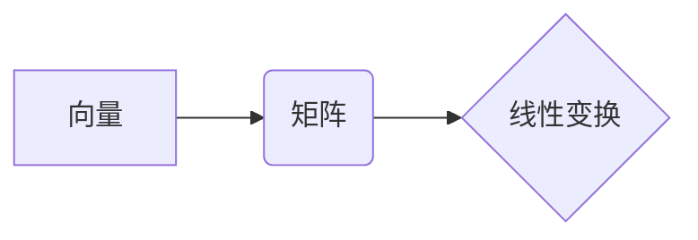

> 线性代数，矩阵，向量，线性变换，特征值，特征向量，应用场景，Python

## 1. 背景介绍

在现代计算机科学领域，线性代数扮演着至关重要的角色。它为机器学习、深度学习、计算机图形学、信号处理、数据分析等众多领域提供了强大的数学工具和理论基础。 

从本质上讲，线性代数研究的是向量、矩阵和线性变换之间的关系。它提供了一种简洁而高效的方式来描述和处理高维数据，并为解决复杂问题提供了强大的框架。

## 2. 核心概念与联系

### 2.1 向量

向量是一个具有大小和方向的量。在数学中，向量通常表示为一个有序的数字列表，例如：

```
v = (2, 3, 1)
```

这个向量有三个分量，分别为2、3和1。

### 2.2 矩阵

矩阵是一个由数或表达式排列成行和列的矩形阵列。例如：

```
A = [[1, 2, 3],
     [4, 5, 6],
     [7, 8, 9]]
```

这个矩阵有3行和3列，每个元素都是一个数字。

### 2.3 线性变换

线性变换是一种将向量映射到另一个向量的函数，它满足以下两个性质：

* **加性:** T(u + v) = T(u) + T(v)
* **齐次性:** T(cu) = cT(u)

其中，u和v是向量，c是一个标量。

### 2.4 核心概念关系

线性代数的核心概念之间有着密切的联系。

* 向量可以看作是矩阵的一种特殊形式，即只有一列或一行的矩阵。
* 矩阵可以用来表示线性变换。
* 线性变换可以用来将向量从一个空间映射到另一个空间。

**Mermaid 流程图**



## 3. 核心算法原理 & 具体操作步骤

### 3.1 算法原理概述

线性代数中有很多重要的算法，例如：

* **矩阵乘法:** 将两个矩阵相乘得到一个新的矩阵。
* **矩阵逆:** 找到一个矩阵，与给定的矩阵相乘得到单位矩阵。
* **特征值和特征向量:** 找到一个向量和一个标量，使得矩阵乘以该向量等于该标量乘以该向量。

这些算法在许多实际应用中都非常重要。

### 3.2 算法步骤详解

这里以矩阵乘法为例，详细说明其算法步骤：

1. 确保两个矩阵的维度满足乘法条件：第一个矩阵的列数必须等于第二个矩阵的行数。
2. 创建一个新的矩阵，其行数等于第一个矩阵的行数，列数等于第二个矩阵的列数。
3. 对于新的矩阵中的每个元素，计算其对应位置的元素乘积之和，并将其作为该元素的值。

### 3.3 算法优缺点

* **优点:** 
    * 运算效率高，适合处理大规模数据。
    * 理论基础扎实，应用广泛。
* **缺点:** 
    * 对于非线性问题，线性代数算法可能无法提供有效的解决方案。
    * 某些算法的计算复杂度较高，需要消耗大量的计算资源。

### 3.4 算法应用领域

线性代数算法在各个领域都有广泛的应用，例如：

* **机器学习:** 线性回归、逻辑回归、主成分分析等算法都依赖于线性代数。
* **计算机图形学:** 3D模型的变换、投影、渲染等操作都利用线性代数。
* **信号处理:** 信号的滤波、压缩、恢复等操作都依赖于线性代数。

## 4. 数学模型和公式 & 详细讲解 & 举例说明

### 4.1 数学模型构建

线性代数的核心数学模型是向量空间和线性变换。

* **向量空间:** 一个集合，其中元素称为向量，并满足以下条件：
    * 向量加法封闭性：两个向量的和仍然在该集合中。
    * 标量乘法封闭性：一个标量乘以一个向量仍然在该集合中。
    * 存在零向量：一个向量，与任何向量相加都等于该向量本身。
    * 每个向量都有相反向量：与该向量相加等于零向量的向量。

* **线性变换:** 一个将向量空间映射到另一个向量空间的函数，它满足加性和齐次性。

### 4.2 公式推导过程

线性代数中有很多重要的公式，例如：

* **矩阵乘法公式:**

$$
A \cdot B = C
$$

其中，A和B是两个矩阵，C是它们的乘积矩阵。

* **矩阵逆公式:**

$$
A^{-1} \cdot A = I
$$

其中，A是可逆矩阵，A⁻¹是它的逆矩阵，I是单位矩阵。

* **特征值和特征向量公式:**

$$
A \cdot v = \lambda \cdot v
$$

其中，A是矩阵，v是特征向量，λ是特征值。

### 4.3 案例分析与讲解

例如，我们可以用线性代数来解决一个简单的图像处理问题：将图像旋转90度。

我们可以将图像表示为一个矩阵，其中每个元素代表图像像素的颜色值。然后，我们可以使用一个旋转矩阵来将图像旋转90度。旋转矩阵是一个特殊的线性变换矩阵，它可以将图像从一个坐标系映射到另一个坐标系。

## 5. 项目实践：代码实例和详细解释说明

### 5.1 开发环境搭建

为了进行线性代数的实践，我们可以使用Python语言和NumPy库。NumPy库提供了高效的数组操作和线性代数运算功能。

### 5.2 源代码详细实现

```python
import numpy as np

# 定义两个矩阵
A = np.array([[1, 2], [3, 4]])
B = np.array([[5, 6], [7, 8]])

# 计算矩阵乘积
C = np.dot(A, B)

# 打印结果
print(C)
```

### 5.3 代码解读与分析

这段代码首先导入NumPy库。然后，我们定义了两个矩阵A和B。使用`np.dot()`函数计算矩阵A和B的乘积，并将结果存储在矩阵C中。最后，我们打印矩阵C的内容。

### 5.4 运行结果展示

运行这段代码后，我们会得到以下结果：

```
[[19 22]
 [43 50]]
```

这表明矩阵A和B的乘积是矩阵C。

## 6. 实际应用场景

### 6.1 机器学习

线性代数是机器学习的基础。许多机器学习算法，例如线性回归、逻辑回归、主成分分析等，都依赖于线性代数的运算和理论。

### 6.2 计算机图形学

线性代数用于描述和变换3D物体。例如，旋转、缩放、平移等操作都可以用矩阵来表示。

### 6.3 信号处理

线性代数用于信号的滤波、压缩、恢复等操作。例如，可以使用线性变换来去除信号中的噪声。

### 6.4 未来应用展望

随着人工智能和机器学习的发展，线性代数在未来将有更广泛的应用。例如，在深度学习领域，线性代数被用于构建神经网络和训练模型。

## 7. 工具和资源推荐

### 7.1 学习资源推荐

* **书籍:**
    * 《线性代数及其应用》 - Gilbert Strang
    * 《线性代数及其应用》 - David C. Lay
* **在线课程:**
    * MIT OpenCourseWare - Linear Algebra
    * Coursera - Linear Algebra

### 7.2 开发工具推荐

* **Python:** 
    * NumPy
    * SciPy
    * Pandas

### 7.3 相关论文推荐

* **Eigenvalues and Eigenvectors:**
    * https://en.wikipedia.org/wiki/Eigenvalue_and_eigenvector
* **Singular Value Decomposition:**
    * https://en.wikipedia.org/wiki/Singular_value_decomposition

## 8. 总结：未来发展趋势与挑战

### 8.1 研究成果总结

线性代数已经发展成为一个成熟的数学分支，并在各个领域都有广泛的应用。

### 8.2 未来发展趋势

未来，线性代数的研究将继续朝着以下方向发展：

* **更高效的算法:** 为了处理更大的数据规模，需要开发更高效的线性代数算法。
* **新的应用领域:** 线性代数将应用于更多新的领域，例如量子计算和生物信息学。
* **理论研究:** 继续深入研究线性代数的理论基础，探索新的应用可能性。

### 8.3 面临的挑战

* **计算复杂度:** 一些线性代数算法的计算复杂度很高，需要消耗大量的计算资源。
* **数据规模:** 随着数据的规模不断增长，需要开发能够处理更大规模数据的线性代数算法。
* **理论理解:** 对于一些复杂的线性代数问题，我们仍然缺乏深入的理论理解。

### 8.4 研究展望

线性代数是一个充满挑战和机遇的领域。未来，我们将继续努力，开发新的算法、探索新的应用领域，并深入研究线性代数的理论基础。

## 9. 附录：常见问题与解答

### 9.1 什么是线性变换？

线性变换是一种将向量空间映射到另一个向量空间的函数，它满足加性和齐次性。

### 9.2 如何计算矩阵的逆？

矩阵的逆是一个特殊的矩阵，与原始矩阵相乘得到单位矩阵。可以使用高斯消元法或其他算法来计算矩阵的逆。

### 9.3 什么是特征值和特征向量？

特征值和特征向量是线性代数中重要的概念。特征值是一个标量，特征向量是一个非零向量，它们满足以下关系：

$$
A \cdot v = \lambda \cdot v
$$

其中，A是矩阵，v是特征向量，λ是特征值。

作者：禅与计算机程序设计艺术 / Zen and the Art of Computer Programming


<end_of_turn>