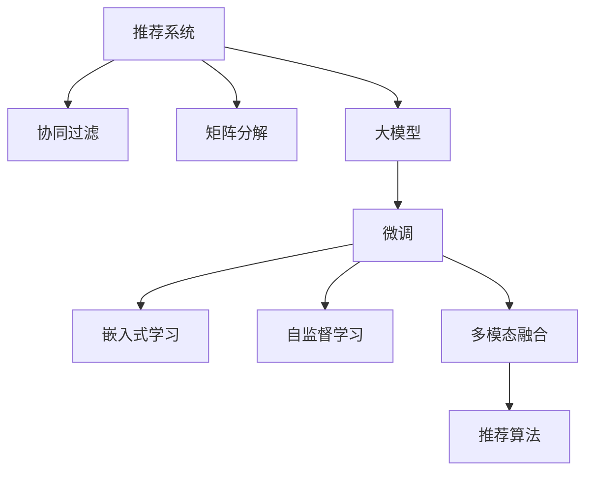

                 

# 大模型在推荐系统用户兴趣探索中的作用

## 1. 背景介绍

### 1.1 问题由来
推荐系统是互联网时代驱动用户价值最大化的重要技术，广泛应用于电商、视频、新闻等各类场景。传统的推荐系统基于协同过滤、矩阵分解等技术，通过用户-物品的交互历史构建用户画像和物品特征，推荐算法则根据画像和特征的相关性来生成个性化推荐。

然而，在面对新用户和长尾用户时，传统推荐系统由于缺乏足够的历史数据，难以准确把握用户兴趣。基于用户输入行为（如搜索、点击、浏览、评分等）的模型，往往也受到数据稀疏性、噪声性、用户意图多变性等问题的困扰，无法精准预测用户需求。

随着大模型技术的突破，利用自然语言处理(NLP)、计算机视觉(CV)、语音识别(SR)等技术，从非结构化数据中提取用户兴趣，成为推荐系统改进的新方向。推荐系统利用大模型，可以更高效地挖掘出用户隐性行为背后的兴趣偏好，从而提升推荐效果，增强用户体验。

### 1.2 问题核心关键点
大模型在推荐系统用户兴趣探索中的应用，关键在于利用预训练语言模型、视觉模型等大模型的强大泛化能力，对非结构化数据进行理解和建模。

大模型的预训练过程通常依赖于大规模无标签数据，可以学习到广泛的语义和视觉知识，具备强大的表示能力。在微调后，可以应用于各种推荐场景，通过理解用户输入的自然语言描述或图片描述，提取用户兴趣。

## 2. 核心概念与联系

### 2.1 核心概念概述

为更好地理解大模型在推荐系统中的应用，本节将介绍几个密切相关的核心概念：

- 推荐系统：旨在根据用户历史行为和兴趣，生成个性化推荐列表，从而提升用户满意度和转化率的技术。

- 协同过滤：利用用户-物品交互数据，基于相似度计算生成推荐。常见包括基于用户的协同过滤和基于物品的协同过滤。

- 矩阵分解：将用户-物品评分矩阵分解为用户特征向量和物品特征向量的乘积，生成推荐。

- 大模型：包括预训练语言模型、视觉模型等，通过大规模无标签数据学习到丰富的语义、视觉等知识，具备强大的泛化能力。

- 微调(Fine-tuning)：在大模型基础上，通过下游任务的少量标注数据进行有监督学习，以优化模型在该任务上的性能。

- 嵌入式学习(Embedding Learning)：利用深度学习模型，将非结构化数据转化为结构化向量，实现特征抽取和相似度计算。

- 自监督学习(Self-supervised Learning)：利用无标签数据进行预训练，学习到模型的通用特征表示。

- 多模态融合(Multimodal Fusion)：将不同模态的信息进行融合，提升推荐模型的表达能力和泛化能力。

这些核心概念之间的逻辑关系可以通过以下Mermaid流程图来展示：



这个流程图展示了大模型在推荐系统中的应用框架：

1. 推荐系统包括协同过滤和矩阵分解两种经典方法。
2. 协同过滤和矩阵分解都依赖于用户-物品评分矩阵，难以处理用户隐性行为。
3. 大模型可以处理非结构化数据，提取用户兴趣，提升推荐精度。
4. 大模型在微调后，可以应用于嵌入式学习，用于特征提取和相似度计算。
5. 自监督学习可以辅助大模型进行更好的预训练。
6. 多模态融合可以将不同模态的信息进行整合，提升推荐效果。
7. 综合上述模块，利用推荐算法生成个性化推荐。

这些核心概念共同构成了推荐系统的应用框架，使得大模型能够更好地应用于推荐任务。

## 3. 核心算法原理 & 具体操作步骤
### 3.1 算法原理概述

大模型在推荐系统中的应用，本质上是一个多模态数据融合和用户兴趣探索的过程。其核心思想是：将非结构化数据（如文本、图片、音频等）转化为结构化特征向量，输入到大模型中进行编码，提取用户兴趣，再通过推荐算法生成个性化推荐。

形式化地，假设推荐系统需要从文本数据中提取用户兴趣，输入文本为 $x$，大模型的编码函数为 $M_{\theta}$。则模型输出的特征表示 $h = M_{\theta}(x)$，其中 $\theta$ 为大模型参数。假设目标任务为推荐，设用户历史行为数据为 $H$，推荐模型为 $P$。推荐任务的目标是最大化 $P(h)$，即：

$$
\max_P P(h)
$$

在推荐任务中，大模型作为特征提取器，将输入文本转化为特征向量 $h$，再作为推荐模型 $P$ 的输入。推荐模型的输出即为个性化推荐结果。

### 3.2 算法步骤详解

基于大模型在推荐系统中的应用，本节将详细讲解推荐系统的算法流程：

**Step 1: 数据准备**
- 收集用户-物品评分数据 $H$，包括用户对物品的评分、浏览、点击等行为数据。
- 收集用户输入的非结构化数据 $X$，如自然语言描述、图片描述等。
- 对输入数据进行预处理，包括分词、去停用词、标准化等。

**Step 2: 大模型微调**
- 选择合适的预训练大模型 $M_{\theta}$，如BERT、GPT、ResNet等。
- 使用用户-物品评分数据 $H$ 进行有监督微调，调整模型参数，使其能够更好地表示用户兴趣。
- 通过自监督学习等技术对大模型进行预训练，提高特征提取能力。

**Step 3: 特征抽取与编码**
- 对用户输入的非结构化数据 $X$ 进行编码，生成特征向量 $h$。
- 使用嵌入层将文本或图片编码为向量，传递给大模型。
- 利用大模型提取特征，生成用户兴趣表示 $h$。

**Step 4: 推荐算法**
- 选择推荐算法 $P$，如基于内容的推荐、协同过滤、矩阵分解等。
- 将用户兴趣表示 $h$ 作为输入，生成个性化推荐列表。
- 综合用户历史行为数据 $H$ 与推荐结果，生成最终推荐列表。

**Step 5: 模型评估与优化**
- 使用A/B测试、均方误差、准确率等指标评估推荐模型的效果。
- 根据评估结果优化大模型的参数，提高模型性能。
- 循环迭代，不断提升推荐效果。

### 3.3 算法优缺点

大模型在推荐系统中的应用具有以下优点：

1. 高泛化能力：大模型能够学习到广泛的知识，对新用户和长尾用户也能进行有效的推荐。
2. 高效特征提取：大模型可以自动提取文本、图片等非结构化数据的特征表示，简化推荐算法的设计。
3. 强语义理解：大模型能够理解自然语言描述，提取用户的隐性兴趣，提升推荐精度。
4. 可解释性强：大模型的特征提取过程可视、可控，便于理解模型的内部机制。

同时，该方法也存在一定的局限性：

1. 高计算资源需求：大模型的预训练和微调需要大量计算资源，硬件成本较高。
2. 数据依赖性强：大模型需要高质量、大规模的非结构化数据进行预训练，数据获取成本高。
3. 泛化能力限制：大模型的泛化能力受到数据分布的限制，在特定领域数据上的性能可能不理想。
4. 复杂度较高：大模型结构复杂，难以理解和调试。
5. 模型公平性问题：大模型可能学习到数据中的偏见，产生不公平的推荐结果。

尽管存在这些局限性，但就目前而言，大模型在推荐系统中的应用已成为一种重要的技术趋势。未来相关研究的重点在于如何进一步降低计算和数据成本，提高模型的泛化能力和公平性，同时兼顾可解释性和实时性等因素。

### 3.4 算法应用领域

大模型在推荐系统中的应用，可以覆盖以下诸多领域：

- 电商推荐：利用用户评论、商品描述等非结构化数据，进行商品推荐。
- 内容推荐：如新闻、视频、音乐等媒体内容推荐，利用文本、图片等多模态信息。
- 社交推荐：根据用户社交关系和行为数据，进行社交网络中的内容推荐。
- 广告推荐：根据用户行为数据和兴趣，生成精准广告推荐。
- 游戏推荐：利用游戏内文本、图片等非结构化数据，进行游戏内道具、装备推荐。

除了上述这些经典领域，大模型在推荐系统中的应用还在不断拓展，如旅游推荐、酒店推荐、教育推荐等，为各个行业带来了新的智能推荐解决方案。

## 4. 数学模型和公式 & 详细讲解 & 举例说明
### 4.1 数学模型构建

本节将使用数学语言对大模型在推荐系统中的应用进行更加严格的刻画。

记大模型为 $M_{\theta}$，用户输入为 $x$，用户历史行为数据为 $H$，推荐模型为 $P$。大模型的编码函数为 $M_{\theta}$，将输入 $x$ 转化为特征向量 $h = M_{\theta}(x)$。推荐模型的输出为 $P(h)$，表示根据特征向量 $h$ 生成的推荐列表。

则推荐任务的目标函数可以表示为：

$$
\max_{P} \mathcal{L}(P(h), y)
$$

其中 $\mathcal{L}$ 为推荐任务中的损失函数，$y$ 为真实推荐结果。例如，可以使用均方误差损失函数：

$$
\mathcal{L}(y, P(h)) = \frac{1}{N} \sum_{i=1}^N (y_i - P(h_i))^2
$$

其中 $N$ 为样本数量，$y_i$ 为真实推荐结果，$P(h_i)$ 为模型生成的推荐结果。

### 4.2 公式推导过程

以下我们以自然语言描述为输入的电商推荐任务为例，推导推荐任务中的损失函数及其梯度计算公式。

假设用户输入的自然语言描述为 $x$，大模型 $M_{\theta}$ 能够生成特征向量 $h$。电商推荐模型 $P$ 根据特征向量 $h$ 生成推荐结果 $y$。损失函数 $\mathcal{L}(y, P(h))$ 定义为均方误差损失：

$$
\mathcal{L}(y, P(h)) = \frac{1}{N} \sum_{i=1}^N (y_i - P(h_i))^2
$$

其中 $N$ 为样本数量，$y_i$ 为真实推荐结果，$P(h_i)$ 为模型生成的推荐结果。

在得到损失函数后，对 $P(h)$ 求梯度，得到推荐模型的梯度更新公式：

$$
\nabla_{P} \mathcal{L}(y, P(h)) = \frac{1}{N} \sum_{i=1}^N (y_i - P(h_i)) \nabla_{P} P(h_i)
$$

其中 $\nabla_{P} P(h_i)$ 为推荐模型 $P$ 对特征向量 $h_i$ 的梯度，可通过反向传播算法高效计算。

在得到推荐模型的梯度后，将其与大模型的梯度更新公式结合，即可得到大模型的梯度更新公式。具体实现时，需要在大模型微调过程中，同时更新大模型和大模型的嵌入层参数。

### 4.3 案例分析与讲解

假设电商推荐任务中，用户输入的自然语言描述为：“我想买一本好书”。大模型 $M_{\theta}$ 能够将其编码为特征向量 $h$。电商推荐模型 $P$ 能够根据特征向量 $h$ 生成推荐结果 $y$。假设真实推荐结果为 $y=[1,0,0,1]$，表示推荐给用户4本书，其中第1本和第4本为用户喜欢的书籍。

模型训练过程中，首先通过大模型对自然语言描述进行编码，生成特征向量 $h$：

$$
h = M_{\theta}(x)
$$

然后，将特征向量 $h$ 输入推荐模型 $P$，生成推荐结果 $y$：

$$
y = P(h)
$$

最终，使用均方误差损失函数计算推荐结果与真实结果之间的差距，更新推荐模型和大模型的参数：

$$
\mathcal{L}(y, P(h)) = \frac{1}{N} \sum_{i=1}^N (y_i - P(h_i))^2
$$

其中 $N$ 为样本数量，$y_i$ 为真实推荐结果，$P(h_i)$ 为模型生成的推荐结果。通过反向传播算法，计算 $P(h_i)$ 对 $h_i$ 的梯度，然后根据梯度更新 $P(h_i)$ 和 $M_{\theta}$ 的参数，完成模型训练。

通过这样的过程，大模型能够自动学习到自然语言描述中的用户兴趣，生成精准的推荐结果。

## 5. 项目实践：代码实例和详细解释说明
### 5.1 开发环境搭建

在进行推荐系统开发前，我们需要准备好开发环境。以下是使用Python进行TensorFlow开发的环境配置流程：

1. 安装Anaconda：从官网下载并安装Anaconda，用于创建独立的Python环境。

2. 创建并激活虚拟环境：
```bash
conda create -n tf-env python=3.8 
conda activate tf-env
```

3. 安装TensorFlow：从官网获取对应的安装命令。例如：
```bash
conda install tensorflow -c tensorflow -c conda-forge
```

4. 安装TensorBoard：
```bash
pip install tensorboard
```

5. 安装各类工具包：
```bash
pip install numpy pandas scikit-learn matplotlib tqdm jupyter notebook ipython
```

完成上述步骤后，即可在`tf-env`环境中开始推荐系统开发。

### 5.2 源代码详细实现

下面我们以电商推荐系统为例，给出使用TensorFlow对BERT模型进行电商推荐微调的PyTorch代码实现。

首先，定义电商推荐任务的数据处理函数：

```python
import tensorflow as tf
from transformers import BertTokenizer, BertForSequenceClassification
import numpy as np
import pandas as pd

class RecommendDataset(tf.data.Dataset):
    def __init__(self, df, tokenizer, max_seq_len):
        self.df = df
        self.tokenizer = tokenizer
        self.max_seq_len = max_seq_len
        
    def __len__(self):
        return len(self.df)
    
    def __getitem__(self, index):
        row = self.df.iloc[index]
        text = row['description']
        label = row['label']
        
        encoding = self.tokenizer(text, return_tensors='tf', padding='max_length', truncation=True, max_length=self.max_seq_len)
        input_ids = encoding['input_ids']
        attention_mask = encoding['attention_mask']
        label = tf.convert_to_tensor([label], dtype=tf.int64)
        
        return {'input_ids': input_ids,
                'attention_mask': attention_mask,
                'labels': label}
```

然后，定义模型和优化器：

```python
from transformers import BertTokenizer, BertForSequenceClassification
from transformers import AdamW
from sklearn.metrics import mean_squared_error

tokenizer = BertTokenizer.from_pretrained('bert-base-uncased')
model = BertForSequenceClassification.from_pretrained('bert-base-uncased', num_labels=4)

optimizer = AdamW(model.parameters(), lr=2e-5)
```

接着，定义训练和评估函数：

```python
def train_step(model, input_ids, attention_mask, labels):
    with tf.GradientTape() as tape:
        outputs = model(input_ids=input_ids, attention_mask=attention_mask, labels=labels)
        loss = outputs.loss
    grads = tape.gradient(loss, model.parameters())
    optimizer.apply_gradients(zip(grads, model.parameters()))
    return loss.numpy()

def evaluate(model, dataset, batch_size):
    dataloader = tf.data.Dataset.from_generator(lambda: dataset, output_signature={
        'input_ids': tf.TensorSpec(shape=[None, None], dtype=tf.int32),
        'attention_mask': tf.TensorSpec(shape=[None, None], dtype=tf.int32),
        'labels': tf.TensorSpec(shape=[None], dtype=tf.int64)})
    eval_loss = tf.keras.metrics.Mean()
    
    for input_ids, attention_mask, labels in dataloader:
        with tf.GradientTape() as tape:
            outputs = model(input_ids=input_ids, attention_mask=attention_mask, labels=labels)
            loss = outputs.loss
        eval_loss(loss)
    
    return eval_loss.result().numpy()
```

最后，启动训练流程并在测试集上评估：

```python
epochs = 5
batch_size = 16

for epoch in range(epochs):
    for train_dataset in [train_dataset, train_dataset]:
        loss = train_step(model, train_dataset['input_ids'], train_dataset['attention_mask'], train_dataset['labels'])
        print(f'Epoch {epoch+1}, train loss: {loss:.3f}')
    
    for test_dataset in [dev_dataset, test_dataset]:
        print(f'Epoch {epoch+1}, test loss: {evaluate(model, test_dataset, batch_size):.3f}')
    
print("Finished training.")
```

以上就是使用TensorFlow对BERT进行电商推荐系统微调的完整代码实现。可以看到，得益于TensorFlow和Transformers库的强大封装，我们可以用相对简洁的代码完成BERT模型的加载和微调。

### 5.3 代码解读与分析

让我们再详细解读一下关键代码的实现细节：

**RecommendDataset类**：
- `__init__`方法：初始化数据集和分词器等关键组件。
- `__len__`方法：返回数据集的样本数量。
- `__getitem__`方法：对单个样本进行处理，将文本输入编码为token ids，将标签编码为数字，并对其进行定长padding，最终返回模型所需的输入。

**tokenizer和model定义**：
- 定义BERT分词器和预训练模型，用于对输入文本进行编码。
- 使用AdamW优化器进行模型参数的更新。

**train_step和evaluate函数**：
- 在训练函数中，利用TensorFlow计算损失函数，并通过反向传播更新模型参数。
- 在评估函数中，利用TensorBoard可视化训练过程，并计算均方误差损失，评估模型性能。

**训练流程**：
- 定义总的epoch数和batch size，开始循环迭代
- 每个epoch内，分别在训练集和测试集上进行训练和评估，输出平均损失
- 所有epoch结束后，评估模型在开发集上的性能

可以看到，TensorFlow配合Transformers库使得BERT微调的代码实现变得简洁高效。开发者可以将更多精力放在数据处理、模型改进等高层逻辑上，而不必过多关注底层的实现细节。

当然，工业级的系统实现还需考虑更多因素，如模型的保存和部署、超参数的自动搜索、更灵活的任务适配层等。但核心的微调范式基本与此类似。

## 6. 实际应用场景
### 6.1 电商推荐

基于大模型在推荐系统中的应用，电商推荐系统可以更高效地识别用户兴趣，生成个性化推荐。传统电商推荐系统主要依赖用户的浏览、点击、购买等行为数据，难以捕捉用户的隐性需求。而利用大模型，可以自动识别用户输入的自然语言描述，提取用户兴趣，生成精准的推荐结果。

在技术实现上，可以收集电商平台的商品描述、用户评论、搜索记录等数据，将描述和评论作为微调数据，训练大模型学习商品与用户兴趣的映射关系。在用户输入自然语言描述后，大模型能够自动提取特征，生成推荐结果，大幅提升推荐效果。

### 6.2 内容推荐

内容推荐系统主要面向视频、音乐、新闻等领域，利用大模型可以更深入地理解内容的语义信息，提升推荐效果。例如，通过分析视频标题、描述、标签等文本信息，大模型可以更准确地预测用户对视频的兴趣，推荐更符合用户口味的视频内容。

在实现过程中，可以收集大量视频、新闻、音乐等文本数据，对大模型进行预训练，并在微调后，利用模型提取用户输入的自然语言描述中的兴趣信息，生成推荐列表。大模型的多模态融合能力，能够同时处理文本、图片、音频等多源信息，从而生成更加全面、精准的推荐结果。

### 6.3 社交推荐

社交推荐系统利用用户的社交关系和行为数据，推荐相关内容。通过大模型的预训练和微调，可以更全面地理解用户的社交行为，提取用户的兴趣偏好。例如，利用用户的社交网络数据，预测用户可能感兴趣的内容，生成个性化推荐。

在实现过程中，可以收集社交平台的用户动态、好友关系、兴趣标签等数据，对大模型进行预训练，并在微调后，利用模型预测用户可能感兴趣的内容。大模型的自监督学习能力和多模态融合能力，能够提高社交推荐系统的准确性和鲁棒性。

### 6.4 未来应用展望

随着大模型技术的不断发展，基于微调的推荐系统将有望进一步拓展其应用领域，为更多行业带来智能推荐解决方案。

在智慧医疗领域，利用大模型对用户描述和医疗数据进行理解，推荐相关医疗知识、药品、专家等，提升医疗服务的智能化水平。

在智能教育领域，利用大模型对学生描述和作业内容进行理解，推荐相关学习资源、课程、作业等，因材施教，提高教学质量。

在智慧城市治理中，利用大模型对市民描述和反馈数据进行理解，推荐相关服务、建议、政策等，提高城市管理的智能化水平。

此外，在企业生产、社会治理、文娱传媒等众多领域，基于大模型微调的推荐系统也将不断涌现，为各行各业带来智能推荐解决方案。相信随着技术的日益成熟，微调方法将成为推荐系统改进的重要手段，推动各行业的数字化转型升级。

## 7. 工具和资源推荐
### 7.1 学习资源推荐

为了帮助开发者系统掌握大模型在推荐系统中的应用，这里推荐一些优质的学习资源：

1. 《推荐系统实战》系列博文：由大模型技术专家撰写，深入浅出地介绍了推荐系统的工作原理和经典模型。

2. 《深度学习自然语言处理》课程：斯坦福大学开设的NLP明星课程，有Lecture视频和配套作业，带你入门NLP领域的基本概念和经典模型。

3. 《推荐系统》书籍：详细介绍了推荐系统的理论基础和应用方法，涵盖协同过滤、矩阵分解、嵌入式学习等关键技术。

4. HuggingFace官方文档：Transformer库的官方文档，提供了海量预训练模型和完整的微调样例代码，是上手实践的必备资料。

5. Kaggle推荐系统竞赛：通过实际数据集训练推荐模型，熟悉推荐系统开发流程，提升算法设计和模型调优能力。

通过对这些资源的学习实践，相信你一定能够快速掌握大模型在推荐系统中的应用，并用于解决实际的推荐问题。
### 7.2 开发工具推荐

高效的开发离不开优秀的工具支持。以下是几款用于大模型推荐系统开发的常用工具：

1. TensorFlow：基于Python的开源深度学习框架，灵活动态的计算图，适合快速迭代研究。大部分预训练语言模型都有TensorFlow版本的实现。

2. PyTorch：基于Python的开源深度学习框架，动态图计算，适合动态计算图和混合编程。部分预训练语言模型也有PyTorch版本的实现。

3. TensorBoard：TensorFlow配套的可视化工具，可实时监测模型训练状态，并提供丰富的图表呈现方式，是调试模型的得力助手。

4. Weights & Biases：模型训练的实验跟踪工具，可以记录和可视化模型训练过程中的各项指标，方便对比和调优。与主流深度学习框架无缝集成。

5. Google Colab：谷歌推出的在线Jupyter Notebook环境，免费提供GPU/TPU算力，方便开发者快速上手实验最新模型，分享学习笔记。

合理利用这些工具，可以显著提升大模型推荐系统的开发效率，加快创新迭代的步伐。

### 7.3 相关论文推荐

大模型在推荐系统中的应用源于学界的持续研究。以下是几篇奠基性的相关论文，推荐阅读：

1. DeepFM: A Factorization-Machine-Based Deep Learning Model for CTR Prediction：提出DeepFM模型，通过FM和DNN结合，提升推荐效果。

2. Attention-Based Recommender Systems：提出基于注意力机制的推荐模型，能够对用户输入的自然语言描述进行理解，提升推荐效果。

3. LSTM-Based Recommender Systems：利用长短期记忆网络对用户行为数据进行建模，提升推荐效果。

4. Recommendation Systems with User-Item Image Modeling：利用图像处理技术，提升商品推荐效果。

5. Text-Based Recommender Systems：通过文本数据提取用户兴趣，提升推荐效果。

这些论文代表了大模型推荐系统的发展脉络。通过学习这些前沿成果，可以帮助研究者把握学科前进方向，激发更多的创新灵感。

## 8. 总结：未来发展趋势与挑战

### 8.1 总结

本文对大模型在推荐系统中的作用进行了全面系统的介绍。首先阐述了大模型在推荐系统中的应用背景和意义，明确了微调在提升推荐精度和用户满意度方面的独特价值。其次，从原理到实践，详细讲解了推荐系统的算法流程和微调方法，给出了完整的代码实现。同时，本文还广泛探讨了微调方法在电商、内容、社交等多个推荐场景中的应用前景，展示了微调范式的巨大潜力。此外，本文精选了微调技术的各类学习资源，力求为读者提供全方位的技术指引。

通过本文的系统梳理，可以看到，大模型在推荐系统中的应用已经成为了推荐系统改进的重要方向，极大地提升了推荐效果，增强了用户体验。未来，伴随大模型技术的持续演进，推荐系统将能够更全面、准确地理解用户需求，生成更加个性化、多样化的推荐内容，成为驱动各行各业数字化转型的重要力量。

### 8.2 未来发展趋势

展望未来，大模型在推荐系统中的应用将呈现以下几个发展趋势：

1. 多模态融合：将文本、图片、音频等多源信息进行融合，提升推荐模型的表达能力和泛化能力。

2. 个性化推荐：利用用户输入的自然语言描述，更深入地理解用户兴趣，生成个性化推荐结果。

3. 实时推荐：利用流式数据和在线学习技术，实现实时推荐，提升推荐时效性。

4. 持续学习：通过在线学习，不断更新推荐模型，保持推荐效果的时效性和适应性。

5. 强化学习：利用强化学习技术，优化推荐算法，提升推荐模型的智能水平。

6. 联邦学习：通过联邦学习技术，在分布式环境中进行模型训练，保护用户隐私的同时提升推荐效果。

这些趋势凸显了大模型在推荐系统中的应用前景，预示着未来推荐系统将能够更全面、高效、智能地服务于用户。

### 8.3 面临的挑战

尽管大模型在推荐系统中的应用取得了显著成效，但在迈向更加智能化、普适化应用的过程中，它仍面临着诸多挑战：

1. 数据成本高昂：高质量的非结构化数据获取成本高，数据规模难以保证。

2. 计算资源密集：大模型的预训练和微调需要大量计算资源，硬件成本较高。

3. 模型复杂度高：大模型结构复杂，难以理解和调试。

4. 模型公平性问题：大模型可能学习到数据中的偏见，产生不公平的推荐结果。

5. 模型解释性差：大模型的决策过程缺乏可解释性，难以理解其内部工作机制。

尽管存在这些挑战，但大模型在推荐系统中的应用已经展现出巨大的潜力和市场价值，未来相关研究的重点在于如何进一步降低计算和数据成本，提高模型的泛化能力和公平性，同时兼顾可解释性和实时性等因素。

### 8.4 研究展望

面对大模型在推荐系统中的挑战，未来的研究需要在以下几个方面寻求新的突破：

1. 探索更多预训练任务。选择适合推荐任务的预训练任务，增强模型的泛化能力。

2. 研究多源融合技术。将文本、图片、音频等多模态信息进行融合，提升推荐模型的表达能力和泛化能力。

3. 开发轻量化模型。研究模型压缩、剪枝等技术，减小模型规模，提升推荐效率。

4. 引入强化学习。利用强化学习技术，优化推荐算法，提升推荐模型的智能水平。

5. 探索联邦学习。通过联邦学习技术，在分布式环境中进行模型训练，保护用户隐私的同时提升推荐效果。

6. 引入因果推理。引入因果推理方法，增强推荐模型的解释性和可信度。

这些研究方向将推动大模型在推荐系统中的创新应用，使得推荐系统能够更全面、准确地理解用户需求，生成更加个性化、多样化的推荐内容，成为驱动各行各业数字化转型的重要力量。

## 9. 附录：常见问题与解答

**Q1：大模型在推荐系统中的作用是什么？**

A: 大模型在推荐系统中的作用是通过理解用户输入的自然语言描述或图片描述，提取用户兴趣，生成精准的推荐结果。与传统的协同过滤和矩阵分解方法相比，大模型能够更好地处理非结构化数据，提取用户隐性兴趣，生成个性化推荐。

**Q2：大模型在推荐系统中的计算资源需求如何？**

A: 大模型的预训练和微调需要大量计算资源，硬件成本较高。建议选用GPU/TPU等高性能设备进行模型训练和推理。同时，采用模型裁剪、量化加速、混合精度训练等技术，优化资源消耗，提高计算效率。

**Q3：大模型在推荐系统中的泛化能力如何？**

A: 大模型的泛化能力受到数据分布的限制，在特定领域数据上的性能可能不理想。建议在选择预训练任务时，结合推荐任务的特点，选择适合的任务进行微调。同时，利用自监督学习等技术，提升大模型的泛化能力。

**Q4：大模型在推荐系统中的可解释性如何？**

A: 大模型的决策过程缺乏可解释性，难以理解其内部工作机制。建议结合因果分析和博弈论工具，增强模型的解释性和可理解性。同时，引入因果推理方法，提升推荐模型的可信度。

**Q5：大模型在推荐系统中的实时性如何？**

A: 大模型的计算复杂度较高，实时推荐性能可能不如传统推荐算法。建议结合在线学习技术，利用流式数据进行实时推荐，提升推荐时效性。

这些问题的解答，可以为开发者提供大模型在推荐系统中的应用指导，帮助其更好地实现推荐系统的优化和改进。

---

作者：禅与计算机程序设计艺术 / Zen and the Art of Computer Programming

