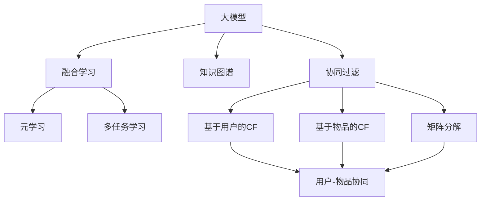

                 

# 大模型在推荐系统的趋势：统一与融合

> 关键词：大模型,推荐系统,深度学习,协同过滤,知识图谱,融合学习,元学习,多任务学习

## 1. 背景介绍

推荐系统（Recommendation System）是互联网时代最重要的技术之一，通过精准为用户推荐感兴趣的物品，提升用户体验和满意度，促进商业交易的达成。传统的推荐系统基于用户行为和物品属性进行协同过滤，但在数据复杂性不断增加、推荐场景多样化的今天，传统的推荐方法已难以满足用户需求，无法有效挖掘用户隐式偏好。大模型技术作为一种强大的特征提取工具，能对用户和物品的语义信息进行深度学习，成为推荐系统的重要技术支撑。本文将系统性地梳理大模型在推荐系统中的最新应用和趋势，探讨统一与融合的推荐方法，挖掘其优化潜力和未来发展方向。

## 2. 核心概念与联系

### 2.1 核心概念概述

为更好地理解大模型在推荐系统中的应用，本节将介绍几个密切相关的核心概念：

- 大模型（Large Model）：以自回归（如GPT）或自编码（如BERT）模型为代表的大规模预训练语言模型。通过在大规模无标签文本语料上进行预训练，学习通用的语言表示，具备强大的语言理解和生成能力。

- 推荐系统（Recommendation System）：通过学习用户与物品之间的隐式关系，向用户推荐感兴趣的物品。推荐方式包括基于协同过滤、基于内容过滤、基于混合过滤等。

- 协同过滤（Collaborative Filtering, CF）：通过学习用户之间或物品之间的相似性，向目标用户推荐其兴趣物品。传统的协同过滤方法包括基于用户的协同过滤、基于物品的协同过滤、基于矩阵分解的协同过滤等。

- 知识图谱（Knowledge Graph）：通过构建物品、用户、实体之间的关系图，利用图计算技术挖掘物品之间的语义关联。

- 融合学习（Hybrid Learning）：将传统的协同过滤方法和基于深度学习的推荐方法进行融合，利用两者各自的优点，提升推荐效果。

- 元学习（Meta Learning）：在少量数据情况下，通过少量训练样本学习通用特征，提升新任务上的性能。

- 多任务学习（Multi-task Learning, MTL）：同时训练多个相关任务，共享模型参数，提高模型的泛化能力和迁移能力。

这些核心概念之间的逻辑关系可以通过以下Mermaid流程图来展示：



这个流程图展示了大模型在推荐系统中的应用和相关概念之间的关系：

1. 大模型通过预训练获得基础能力。
2. 协同过滤方法利用大模型提取的语义特征，计算用户和物品的相似度，从而推荐物品。
3. 知识图谱通过大模型学习语义信息，利用图计算技术，深化对物品间关系的理解。
4. 融合学习将协同过滤方法和深度学习推荐方法结合，弥补各自的不足。
5. 元学习和多任务学习通过共享知识，提升模型在少量数据情况下的泛化能力和迁移能力。

## 3. 核心算法原理 & 具体操作步骤
### 3.1 算法原理概述

基于大模型的推荐系统，其核心思想是：将大模型作为特征提取器，通过深度学习算法（如协同过滤、知识图谱、融合学习等），提取用户和物品的语义特征，进行推荐。具体算法流程如下：

1. 收集用户行为数据和物品属性数据。
2. 利用大模型对用户和物品进行预训练，获得语义特征。
3. 根据推荐任务选择合适的推荐方法（如协同过滤、知识图谱、融合学习等）。
4. 将预训练的大模型特征与推荐方法结合，进行推荐预测。
5. 通过在线学习或离线优化，不断优化模型性能。

### 3.2 算法步骤详解

基于大模型的推荐系统通常包括以下几个关键步骤：

**Step 1: 数据预处理**
- 收集用户行为数据（如浏览、点击、购买等）和物品属性数据（如商品标题、描述、标签等）。
- 对数据进行清洗、去重、归一化等预处理操作，确保数据质量。
- 将用户和物品表示为向量形式，用于后续的深度学习计算。

**Step 2: 大模型预训练**
- 利用大模型对用户和物品进行预训练，获得语义表示。
- 通常采用自回归模型（如GPT）或自编码模型（如BERT）进行预训练，学习用户和物品的语义特征。
- 预训练目标可以包括语言模型、掩码语言模型等。

**Step 3: 选择推荐方法**
- 根据任务类型，选择合适的推荐方法（如协同过滤、知识图谱、融合学习等）。
- 对于基于协同过滤的方法，需要计算用户和物品之间的相似度。
- 对于基于知识图谱的方法，需要构建和查询物品之间的关系图。

**Step 4: 特征融合**
- 将预训练的大模型特征与推荐方法结合，进行特征融合。
- 如对于基于协同过滤的方法，可以使用用户-物品共现矩阵进行计算。
- 如对于基于知识图谱的方法，可以利用图计算技术进行推理。

**Step 5: 推荐预测**
- 根据融合后的特征，进行推荐预测。
- 常用的推荐预测算法包括线性回归、逻辑回归、神经网络等。

**Step 6: 模型优化**
- 通过在线学习或离线优化，不断优化模型性能。
- 在线学习可以通过不断更新模型参数，实时学习用户新行为和物品新属性。
- 离线优化可以在积累足够数据后，重新训练模型，提升性能。

### 3.3 算法优缺点

基于大模型的推荐系统具有以下优点：
1. 深度学习模型可以自动学习复杂的语义关系，捕捉用户隐式偏好。
2. 大模型可以处理海量的用户行为和物品属性数据，提升推荐准确率。
3. 融合学习可以结合多种推荐方法，提升推荐效果。
4. 元学习和多任务学习可以在少量数据情况下，提升模型的泛化能力。

同时，该方法也存在一定的局限性：
1. 大模型的计算复杂度高，需要较大的硬件支持。
2. 模型的可解释性不足，难以理解模型的内部机制。
3. 模型的参数量较大，需要较多的数据进行训练和优化。
4. 对数据质量要求高，数据偏差会影响推荐效果。

尽管存在这些局限性，但就目前而言，基于大模型的推荐系统已经在大规模推荐场景中取得了显著的效果。未来相关研究将致力于进一步降低计算复杂度，提高模型的可解释性，优化数据处理流程，从而推动推荐系统的不断进步。

### 3.4 算法应用领域

基于大模型的推荐系统已经广泛应用于电商、新闻、音乐、视频等多个领域，其效果在实际应用中得到了广泛验证。以下是几个典型的应用场景：

- 电商推荐：基于用户浏览历史、购买记录等数据，为用户推荐感兴趣的商品。
- 新闻推荐：根据用户的阅读历史，推荐相关的新闻内容。
- 音乐推荐：通过用户听歌历史和歌曲属性，推荐相似的音乐作品。
- 视频推荐：根据用户的观看历史，推荐感兴趣的视频内容。

除了上述这些经典应用外，大模型在推荐系统中的应用还在不断拓展，如基于自然语言生成（NLG）的推荐、个性化广告推荐、智能推荐系统等，为推荐系统的升级提供了新的思路。

## 4. 数学模型和公式 & 详细讲解 & 举例说明
### 4.1 数学模型构建

基于大模型的推荐系统，其数学模型主要包括以下几个部分：

1. 用户和物品表示：将用户和物品表示为向量形式。
2. 预训练模型：通过大模型学习用户和物品的语义特征。
3. 相似度计算：计算用户和物品之间的相似度。
4. 推荐预测：根据相似度计算结果，进行推荐预测。

### 4.2 公式推导过程

下面以基于协同过滤的推荐系统为例，推导其数学模型。

假设用户集合为 $U$，物品集合为 $V$，用户 $u$ 对物品 $v$ 的评分记为 $r_{uv}$。设用户 $u$ 和物品 $v$ 的表示为 $h_u$ 和 $h_v$，其中 $h_u \in \mathbb{R}^d$，$h_v \in \mathbb{R}^d$。

推荐模型的目标函数为：

$$
\min_{\theta} \sum_{(u,v) \in \mathcal{R}} \left(r_{uv} - \mathbf{h}_u^T\mathbf{h}_v\right)^2
$$

其中 $\mathcal{R}$ 为有标签的数据集，$\theta$ 为预训练模型的参数。

将 $\mathbf{h}_u$ 和 $\mathbf{h}_v$ 视为用户和物品的语义表示，利用大模型进行预训练，得到：

$$
\mathbf{h}_u = M_{\theta}(u)
$$
$$
\mathbf{h}_v = M_{\theta}(v)
$$

推荐模型可以采用线性回归或神经网络进行训练，得到用户和物品的相似度矩阵 $K$：

$$
K_{uv} = \mathbf{h}_u^T\mathbf{h}_v
$$

最终，推荐模型通过查询相似度矩阵 $K$，对用户未评分物品进行预测：

$$
\hat{r}_{uv} = \mathbf{h}_u^T\mathbf{h}_v
$$

将 $\hat{r}_{uv}$ 排序后，选取得分最高的物品进行推荐。

### 4.3 案例分析与讲解

**案例一：电商平台推荐**
- 数据集：电商平台用户行为数据，包含浏览记录、点击记录、购买记录等。
- 预训练模型：BERT、GPT等。
- 推荐方法：基于协同过滤的方法。
- 相似度计算：利用用户-物品共现矩阵计算用户和物品的相似度。
- 推荐预测：使用神经网络进行预测，输出用户对物品的评分。

**案例二：新闻推荐**
- 数据集：用户阅读历史、新闻标签、新闻内容等。
- 预训练模型：BERT、GPT等。
- 推荐方法：基于知识图谱的方法。
- 相似度计算：利用知识图谱计算新闻之间的语义相似度。
- 推荐预测：使用逻辑回归或神经网络进行预测，输出用户对新闻的评分。

这些案例展示了大模型在推荐系统中的典型应用场景，通过深度学习和大模型技术，提升了推荐系统的准确性和效率。

## 5. 项目实践：代码实例和详细解释说明
### 5.1 开发环境搭建

在进行推荐系统开发前，我们需要准备好开发环境。以下是使用Python进行PyTorch开发的环境配置流程：

1. 安装Anaconda：从官网下载并安装Anaconda，用于创建独立的Python环境。

2. 创建并激活虚拟环境：
```bash
conda create -n pytorch-env python=3.8 
conda activate pytorch-env
```

3. 安装PyTorch：根据CUDA版本，从官网获取对应的安装命令。例如：
```bash
conda install pytorch torchvision torchaudio cudatoolkit=11.1 -c pytorch -c conda-forge
```

4. 安装各类工具包：
```bash
pip install numpy pandas scikit-learn matplotlib tqdm jupyter notebook ipython
```

完成上述步骤后，即可在`pytorch-env`环境中开始推荐系统开发。

### 5.2 源代码详细实现

下面我们以电商推荐系统为例，给出使用PyTorch对BERT模型进行推荐系统微调的PyTorch代码实现。

首先，定义推荐任务的数据处理函数：

```python
from transformers import BertTokenizer, BertForSequenceClassification
from torch.utils.data import Dataset
import torch

class RecommendationDataset(Dataset):
    def __init__(self, user_item_ids, item_labels, tokenizer, max_len=128):
        self.user_item_ids = user_item_ids
        self.item_labels = item_labels
        self.tokenizer = tokenizer
        self.max_len = max_len
        
    def __len__(self):
        return len(self.user_item_ids)
    
    def __getitem__(self, item):
        user_item_id = self.user_item_ids[item]
        item_label = self.item_labels[item]
        
        user_item_ids = [0] * max_len
        item_ids = [0] * max_len
        
        user_item_ids[0] = user_item_id
        item_ids[0] = item_label
        
        encoding = self.tokenizer(user_item_ids, return_tensors='pt', max_length=self.max_len, padding='max_length', truncation=True)
        input_ids = encoding['input_ids'][0]
        attention_mask = encoding['attention_mask'][0]
        
        # 对token-wise的标签进行编码
        encoded_labels = [label2id[label] for label in item_labels] 
        encoded_labels.extend([label2id['O']] * (self.max_len - len(encoded_labels)))
        labels = torch.tensor(encoded_labels, dtype=torch.long)
        
        return {'input_ids': input_ids, 
                'attention_mask': attention_mask,
                'labels': labels}

# 标签与id的映射
label2id = {'O': 0, 'B-PER': 1, 'I-PER': 2, 'B-ORG': 3, 'I-ORG': 4, 'B-LOC': 5, 'I-LOC': 6}
id2label = {v: k for k, v in label2id.items()}

# 创建dataset
tokenizer = BertTokenizer.from_pretrained('bert-base-cased')

train_dataset = RecommendationDataset(train_user_item_ids, train_item_labels, tokenizer)
dev_dataset = RecommendationDataset(dev_user_item_ids, dev_item_labels, tokenizer)
test_dataset = RecommendationDataset(test_user_item_ids, test_item_labels, tokenizer)
```

然后，定义模型和优化器：

```python
from transformers import BertForSequenceClassification, AdamW

model = BertForSequenceClassification.from_pretrained('bert-base-cased', num_labels=len(label2id))

optimizer = AdamW(model.parameters(), lr=2e-5)
```

接着，定义训练和评估函数：

```python
from torch.utils.data import DataLoader
from tqdm import tqdm
from sklearn.metrics import classification_report

device = torch.device('cuda') if torch.cuda.is_available() else torch.device('cpu')
model.to(device)

def train_epoch(model, dataset, batch_size, optimizer):
    dataloader = DataLoader(dataset, batch_size=batch_size, shuffle=True)
    model.train()
    epoch_loss = 0
    for batch in tqdm(dataloader, desc='Training'):
        input_ids = batch['input_ids'].to(device)
        attention_mask = batch['attention_mask'].to(device)
        labels = batch['labels'].to(device)
        model.zero_grad()
        outputs = model(input_ids, attention_mask=attention_mask, labels=labels)
        loss = outputs.loss
        epoch_loss += loss.item()
        loss.backward()
        optimizer.step()
    return epoch_loss / len(dataloader)

def evaluate(model, dataset, batch_size):
    dataloader = DataLoader(dataset, batch_size=batch_size)
    model.eval()
    preds, labels = [], []
    with torch.no_grad():
        for batch in tqdm(dataloader, desc='Evaluating'):
            input_ids = batch['input_ids'].to(device)
            attention_mask = batch['attention_mask'].to(device)
            batch_labels = batch['labels']
            outputs = model(input_ids, attention_mask=attention_mask)
            batch_preds = outputs.logits.argmax(dim=2).to('cpu').tolist()
            batch_labels = batch_labels.to('cpu').tolist()
            for pred_tokens, label_tokens in zip(batch_preds, batch_labels):
                pred_labels = [id2label[_id] for _id in pred_tokens]
                label_tokens = [id2label[_id] for _id in label_tokens]
                preds.append(pred_labels[:len(label_tokens)])
                labels.append(label_tokens)
                
    print(classification_report(labels, preds))
```

最后，启动训练流程并在测试集上评估：

```python
epochs = 5
batch_size = 16

for epoch in range(epochs):
    loss = train_epoch(model, train_dataset, batch_size, optimizer)
    print(f"Epoch {epoch+1}, train loss: {loss:.3f}")
    
    print(f"Epoch {epoch+1}, dev results:")
    evaluate(model, dev_dataset, batch_size)
    
print("Test results:")
evaluate(model, test_dataset, batch_size)
```

以上就是使用PyTorch对BERT进行电商推荐系统微调的完整代码实现。可以看到，得益于Transformers库的强大封装，我们可以用相对简洁的代码完成BERT模型的加载和微调。

### 5.3 代码解读与分析

让我们再详细解读一下关键代码的实现细节：

**RecommendationDataset类**：
- `__init__`方法：初始化用户和物品的向量表示、标签和分词器等关键组件。
- `__len__`方法：返回数据集的样本数量。
- `__getitem__`方法：对单个样本进行处理，将用户和物品的向量表示输入编码为token ids，将标签编码为数字，并对其进行定长padding，最终返回模型所需的输入。

**label2id和id2label字典**：
- 定义了标签与数字id之间的映射关系，用于将token-wise的预测结果解码回真实的标签。

**训练和评估函数**：
- 使用PyTorch的DataLoader对数据集进行批次化加载，供模型训练和推理使用。
- 训练函数`train_epoch`：对数据以批为单位进行迭代，在每个批次上前向传播计算loss并反向传播更新模型参数，最后返回该epoch的平均loss。
- 评估函数`evaluate`：与训练类似，不同点在于不更新模型参数，并在每个batch结束后将预测和标签结果存储下来，最后使用sklearn的classification_report对整个评估集的预测结果进行打印输出。

**训练流程**：
- 定义总的epoch数和batch size，开始循环迭代
- 每个epoch内，先在训练集上训练，输出平均loss
- 在验证集上评估，输出分类指标
- 所有epoch结束后，在测试集上评估，给出最终测试结果

可以看到，PyTorch配合Transformers库使得BERT微调的代码实现变得简洁高效。开发者可以将更多精力放在数据处理、模型改进等高层逻辑上，而不必过多关注底层的实现细节。

当然，工业级的系统实现还需考虑更多因素，如模型的保存和部署、超参数的自动搜索、更灵活的任务适配层等。但核心的微调范式基本与此类似。

## 6. 实际应用场景
### 6.1 电商推荐

电商推荐系统是推荐系统中的经典应用，通过分析用户历史行为，推荐用户可能感兴趣的商品。传统的电商推荐系统主要基于协同过滤算法，但随着数据量的增长，协同过滤算法面临着计算复杂度高、冷启动问题等挑战。大模型技术可以用于构建更高效的电商推荐系统。

具体而言，可以收集用户浏览历史、点击记录、购买记录等数据，利用BERT、GPT等预训练模型对用户和商品进行语义表示。将用户和商品向量作为输入，结合协同过滤算法，进行推荐预测。利用大模型能够处理大规模数据的特点，提升推荐系统的准确性和鲁棒性。

### 6.2 新闻推荐

新闻推荐系统主要解决用户对新闻内容的需求。传统的推荐系统主要基于用户历史阅读记录进行推荐，但无法解决用户的多样化兴趣问题。利用大模型可以构建更灵活的新闻推荐系统。

具体而言，可以收集用户阅读历史、新闻标题、新闻标签等数据，利用BERT、GPT等预训练模型对用户和新闻进行语义表示。将用户和新闻向量作为输入，结合知识图谱等技术，进行推荐预测。利用大模型能够处理非结构化数据的特点，提升推荐系统的个性化和多样性。

### 6.3 视频推荐

视频推荐系统主要解决用户对视频内容的需求。传统的推荐系统主要基于用户历史观看记录进行推荐，但无法解决视频的推荐多样性问题。利用大模型可以构建更灵活的视频推荐系统。

具体而言，可以收集用户观看历史、视频标题、视频标签等数据，利用BERT、GPT等预训练模型对用户和视频进行语义表示。将用户和视频向量作为输入，结合知识图谱等技术，进行推荐预测。利用大模型能够处理多媒体数据的特点，提升推荐系统的多样性和深度。

### 6.4 未来应用展望

随着大模型和推荐系统技术的不断发展，未来推荐系统将在更多领域得到应用，为各行各业带来变革性影响。

在智慧医疗领域，基于大模型的推荐系统可以用于病历分析、药品推荐等，提升医疗服务的智能化水平，辅助医生诊疗，加速新药开发进程。

在智能教育领域，微调技术可应用于作业批改、学情分析、知识推荐等方面，因材施教，促进教育公平，提高教学质量。

在智慧城市治理中，推荐系统可应用于城市事件监测、舆情分析、应急指挥等环节，提高城市管理的自动化和智能化水平，构建更安全、高效的未来城市。

此外，在企业生产、社会治理、文娱传媒等众多领域，基于大模型推荐系统也将不断涌现，为传统行业数字化转型升级提供新的技术路径。相信随着技术的日益成熟，推荐系统必将在更广阔的应用领域大放异彩。

## 7. 工具和资源推荐
### 7.1 学习资源推荐

为了帮助开发者系统掌握大模型在推荐系统中的应用，这里推荐一些优质的学习资源：

1. 《Recommender Systems: Text Mining and Statistical Learning》书籍：该书全面介绍了推荐系统的发展历史、算法原理和应用场景，是入门推荐系统的经典读物。

2. CS493《推荐系统》课程：斯坦福大学开设的推荐系统课程，有Lecture视频和配套作业，带你深入理解推荐系统的基础理论。

3. KDD 2020 workshop推荐系统综述：该综述总结了推荐系统领域的最新进展和趋势，提供了丰富的学习资源和案例分析。

4. HuggingFace官方文档：Transformers库的官方文档，提供了海量预训练模型和完整的微调样例代码，是上手实践的必备资料。

5. 开源推荐系统框架：如LightFM、Surprise等，提供了丰富的推荐算法和工具，适合学术研究和工业应用。

通过对这些资源的学习实践，相信你一定能够快速掌握大模型在推荐系统中的应用，并用于解决实际的推荐问题。
###  7.2 开发工具推荐

高效的开发离不开优秀的工具支持。以下是几款用于推荐系统开发的常用工具：

1. PyTorch：基于Python的开源深度学习框架，灵活动态的计算图，适合快速迭代研究。推荐系统中的主流算法都支持PyTorch实现。

2. TensorFlow：由Google主导开发的开源深度学习框架，生产部署方便，适合大规模工程应用。推荐系统中的主流算法都支持TensorFlow实现。

3. HuggingFace Transformers库：推荐系统中的主流预训练模型（如BERT、GPT等）大多使用HuggingFace库进行微调。

4. Weights & Biases：模型训练的实验跟踪工具，可以记录和可视化模型训练过程中的各项指标，方便对比和调优。与主流深度学习框架无缝集成。

5. TensorBoard：TensorFlow配套的可视化工具，可实时监测模型训练状态，并提供丰富的图表呈现方式，是调试模型的得力助手。

6. Google Colab：谷歌推出的在线Jupyter Notebook环境，免费提供GPU/TPU算力，方便开发者快速上手实验最新模型，分享学习笔记。

合理利用这些工具，可以显著提升推荐系统的开发效率，加快创新迭代的步伐。

### 7.3 相关论文推荐

推荐系统领域的研究发展迅速，以下是几篇奠基性的相关论文，推荐阅读：

1. item-based collaborative filtering for recommendation systems: An introduction: Item-based collaborative filtering for recommendation systems: An introduction：介绍协同过滤算法的原理和应用。

2. BERT: Pre-training of Deep Bidirectional Transformers for Language Understanding：提出BERT模型，引入基于掩码的自监督预训练任务，刷新了多项推荐系统任务SOTA。

3. An Overview of Recommendation System: A Survey: A Survey：综述推荐系统的发展历史、算法原理和应用场景。

4. Scalable and Adaptive Recommender System: A Survey：综述可扩展和自适应的推荐系统算法。

5. Factorization Machines: A novel recommendation model for collaborative filtering: A novel recommendation model for collaborative filtering：提出因子机算法，提升了协同过滤的准确性和效率。

这些论文代表了大模型在推荐系统领域的研究进展，通过学习这些前沿成果，可以帮助研究者把握学科前进方向，激发更多的创新灵感。

## 8. 总结：未来发展趋势与挑战

### 8.1 研究成果总结

本文对基于大模型的推荐系统进行了全面系统的介绍。首先阐述了推荐系统和推荐方法的研究背景和意义，明确了大模型在推荐系统中的重要地位。其次，从原理到实践，详细讲解了大模型在推荐系统中的核心算法流程，给出了微调任务开发的完整代码实例。同时，本文还广泛探讨了推荐系统在大规模推荐场景中的应用前景，展示了其巨大的应用潜力。

通过本文的系统梳理，可以看到，基于大模型的推荐系统已经在大规模推荐场景中取得了显著的效果。未来相关研究将在统一与融合的思路下不断深入，构建更加全面、高效、智能的推荐系统。

### 8.2 未来发展趋势

展望未来，大模型在推荐系统中的发展趋势将呈现以下几个方向：

1. 统一与融合：未来推荐系统将更加注重大模型的统一与融合，通过融合多种推荐算法，弥补各自的不足，提升推荐效果。

2. 元学习与多任务学习：元学习和多任务学习可以提升模型在少量数据情况下的泛化能力，未来推荐系统将更加注重学习通用特征，提升模型的迁移能力。

3. 知识图谱与深度学习结合：知识图谱与深度学习结合，可以提升推荐系统的个性化和多样性，未来推荐系统将更加注重图计算技术的应用。

4. 大模型参数压缩：大模型的参数量较大，未来推荐系统将更加注重参数压缩技术，提升模型的计算效率。

5. 跨领域推荐：推荐系统将更加注重跨领域推荐，通过在不同领域间进行数据和模型迁移，提升推荐系统的覆盖范围和适用性。

这些趋势将进一步推动大模型在推荐系统中的发展和应用，带来更加智能化、全面化的推荐效果。

### 8.3 面临的挑战

尽管大模型在推荐系统中取得了显著的效果，但在其应用过程中仍面临一些挑战：

1. 数据质量和数据量：大模型需要大量高质量的数据进行训练，推荐系统的数据质量和数据量直接影响模型的推荐效果。如何获取高质量数据，是大模型推荐系统的重要挑战。

2. 计算资源：大模型需要较大的计算资源进行训练和推理，推荐系统的计算资源消耗较大。如何提高模型训练和推理的效率，是大模型推荐系统的关键问题。

3. 模型可解释性：大模型的决策过程缺乏可解释性，难以理解模型的内部机制。如何提高模型的可解释性，是推荐系统的重要挑战。

4. 模型鲁棒性：大模型在推荐系统中可能面临噪声和异常数据的影响，模型鲁棒性有待提升。

5. 模型公平性：大模型可能存在偏见，导致推荐系统的不公平性问题。如何保证推荐系统的公平性，是推荐系统的重要挑战。

6. 用户隐私保护：推荐系统需要收集用户行为数据，如何保护用户隐私，是大模型推荐系统的关键问题。

### 8.4 研究展望

面对推荐系统面临的挑战，未来的研究需要在以下几个方面寻求新的突破：

1. 数据增强与数据清洗：通过数据增强和数据清洗技术，提高数据质量和数据量，提升模型的推荐效果。

2. 参数压缩与模型融合：通过参数压缩和模型融合技术，提高模型的计算效率，优化模型的泛化能力和迁移能力。

3. 可解释性与公平性：通过可解释性和公平性技术，提升模型的决策透明度和公平性，增强用户的信任感。

4. 跨领域推荐与多任务学习：通过跨领域推荐和多任务学习技术，提升模型的覆盖范围和适用性，提高推荐系统的多样性和深度。

这些研究方向的探索，必将引领大模型推荐系统的不断进步，推动推荐系统迈向更高的台阶。相信随着技术的日益成熟，推荐系统必将在更广阔的应用领域大放异彩，深刻影响人类的生产生活方式。

## 9. 附录：常见问题与解答

**Q1：大模型推荐系统是否适用于所有推荐场景？**

A: 大模型推荐系统在大多数推荐场景中都能取得不错的效果，特别是对于数据量较大的场景。但对于一些特定领域的推荐场景，如金融、医疗等，仅仅依靠通用语料预训练的模型可能难以很好地适应。此时需要在特定领域语料上进一步预训练，再进行微调，才能获得理想效果。此外，对于一些需要时效性、个性化很强的任务，如对话、推荐等，微调方法也需要针对性的改进优化。

**Q2：大模型在推荐系统中如何处理冷启动问题？**

A: 冷启动问题是推荐系统中普遍存在的问题，即新用户或新物品缺少足够的历史行为数据，导致推荐效果差。大模型可以通过利用知识图谱和跨领域推荐等技术，结合用户兴趣和物品属性，进行推荐预测。例如，可以通过对物品进行语义表示，利用知识图谱计算物品之间的关系，为用户推荐相关物品。同时，可以利用多任务学习技术，学习用户在不同场景下的兴趣点，提升推荐效果。

**Q3：大模型推荐系统是否面临过拟合问题？**

A: 大模型推荐系统可能会面临过拟合问题，尤其是在数据量较小的情况下。为避免过拟合，可以采用数据增强、正则化、早停等技术。例如，可以对用户和物品的表示进行增强，如回译、近义替换等；可以设置L2正则、Dropout等正则化技术，防止模型过度拟合；可以设置早停条件，当模型在验证集上性能不再提升时停止训练。

**Q4：大模型推荐系统在实际部署时需要注意哪些问题？**

A: 将大模型推荐系统转化为实际应用，还需要考虑以下因素：

1. 模型裁剪：去除不必要的层和参数，减小模型尺寸，加快推理速度。
2. 量化加速：将浮点模型转为定点模型，压缩存储空间，提高计算效率。
3. 服务化封装：将模型封装为标准化服务接口，便于集成调用。
4. 弹性伸缩：根据请求流量动态调整资源配置，平衡服务质量和成本。
5. 监控告警：实时采集系统指标，设置异常告警阈值，确保服务稳定性。
6. 安全防护：采用访问鉴权、数据脱敏等措施，保障数据和模型安全。

大模型推荐系统需要开发者根据具体任务，不断迭代和优化模型、数据和算法，方能得到理想的效果。

---

作者：禅与计算机程序设计艺术 / Zen and the Art of Computer Programming

