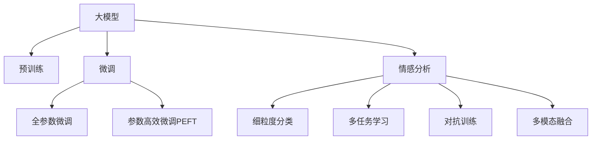

                 

# 大模型在用户评论情感分析中的细粒度应用

> 关键词：用户评论,情感分析,细粒度模型,Transformer,BERT,预训练,微调,深度学习

## 1. 背景介绍

### 1.1 问题由来
随着互联网的普及，越来越多的用户会在电商、社交媒体等平台上发表评论，分享购物体验、产品评价、生活感受等。这些评论数据不仅是用户真实反馈的来源，也是企业了解用户需求、改进产品的重要依据。然而，海量评论数据的海量且零散，难以直接进行分析。

情感分析作为自然语言处理(NLP)的一个重要分支，旨在自动识别和提取文本中的情感信息。其应用广泛，包括社交媒体舆情监测、电商评论分析、品牌口碑管理等。传统的情感分析方法依赖手工标签，难以在大规模数据上高效应用。近年来，深度学习技术，尤其是大语言模型，通过在大规模无标签数据上进行预训练，可以自动学习文本的情感表达，显著提升了情感分析的性能。

### 1.2 问题核心关键点
大模型在情感分析中的应用主要通过以下关键点实现：

1. **预训练和微调**：在大规模无标签数据上进行预训练，然后在具体情感分析任务上进行微调，提取任务特定的情感表示。
2. **细粒度建模**：通过细粒度的分类标签，如正面、负面、中性，进一步将情感分为不同的维度，提升情感识别的准确性和细粒度。
3. **多任务联合学习**：同时训练多个相关任务，如文本分类、命名实体识别、关键词提取等，使得模型能够同时学习多方面信息，提升综合性能。
4. **对抗训练**：引入对抗样本，增强模型对抗噪声和攻击的能力，提高鲁棒性。
5. **多模态融合**：结合文本、图像、音频等多模态数据，提升模型对复杂情感场景的理解能力。

## 2. 核心概念与联系

### 2.1 核心概念概述

为更好地理解大模型在用户评论情感分析中的应用，本节将介绍几个密切相关的核心概念：

- **大模型(Large Language Model, LLM)**：以自回归(如GPT)或自编码(如BERT)模型为代表的大规模预训练语言模型。通过在大规模无标签文本语料上进行预训练，学习通用的语言表示，具备强大的语言理解和生成能力。

- **预训练(Pre-training)**：指在大规模无标签文本语料上，通过自监督学习任务训练通用语言模型的过程。常见的预训练任务包括言语建模、遮挡语言模型等。预训练使得模型学习到语言的通用表示。

- **微调(Fine-tuning)**：指在预训练模型的基础上，使用下游任务的少量标注数据，通过有监督地训练来优化模型在该任务上的性能。通常只需要调整顶层分类器或解码器，并以较小的学习率更新全部或部分的模型参数。

- **情感分析(Sentiment Analysis)**：旨在自动识别和提取文本中的情感信息，如正面、负面、中性等。广泛应用于社交媒体舆情监测、电商评论分析等领域。

- **细粒度分类(Fine-grained Classification)**：指将分类标签进一步细化，如将情感分为更细粒度的维度，如快乐、悲伤、愤怒、平静等，以提高情感识别的准确性。

- **多任务学习(Multi-task Learning)**：同时训练多个相关任务，如文本分类、命名实体识别、关键词提取等，使得模型能够同时学习多方面信息，提升综合性能。

- **对抗训练(Adversarial Training)**：通过引入对抗样本，增强模型对抗噪声和攻击的能力，提高鲁棒性。

- **多模态融合(Multi-modal Fusion)**：结合文本、图像、音频等多模态数据，提升模型对复杂情感场景的理解能力。

这些核心概念之间的逻辑关系可以通过以下Mermaid流程图来展示：



这个流程图展示了大模型在情感分析中的应用框架，包括预训练、微调、细粒度分类、多任务学习、对抗训练和多模态融合等关键步骤，通过这些步骤，模型能够更好地理解用户评论中的情感信息。

## 3. 核心算法原理 & 具体操作步骤
### 3.1 算法原理概述

大模型在用户评论情感分析中的应用，本质上是一个有监督的细粒度迁移学习过程。其核心思想是：将预训练的大模型视作一个强大的"特征提取器"，通过在具体情感分析任务的标注数据上进行有监督的微调，使得模型输出能够匹配任务标签，从而获得针对特定情感分析任务优化的模型。

形式化地，假设预训练模型为 $M_{\theta}$，其中 $\theta$ 为预训练得到的模型参数。给定情感分析任务的标注数据集 $D=\{(x_i, y_i)\}_{i=1}^N$，微调的目标是找到新的模型参数 $\hat{\theta}$，使得：

$$
\hat{\theta}=\mathop{\arg\min}_{\theta} \mathcal{L}(M_{\theta},D)
$$

其中 $\mathcal{L}$ 为针对任务 $T$ 设计的损失函数，用于衡量模型预测输出与真实标签之间的差异。常见的损失函数包括交叉熵损失、均方误差损失等。

通过梯度下降等优化算法，微调过程不断更新模型参数 $\theta$，最小化损失函数 $\mathcal{L}$，使得模型输出逼近真实标签。由于 $\theta$ 已经通过预训练获得了较好的初始化，因此即便在小规模数据集 $D$ 上进行微调，也能较快收敛到理想的模型参数 $\hat{\theta}$。

### 3.2 算法步骤详解

基于监督学习的大模型在用户评论情感分析中的应用一般包括以下几个关键步骤：

**Step 1: 准备预训练模型和数据集**
- 选择合适的预训练语言模型 $M_{\theta}$ 作为初始化参数，如 BERT、GPT等。
- 准备情感分析任务的标注数据集 $D$，划分为训练集、验证集和测试集。一般要求标注数据与预训练数据的分布不要差异过大。

**Step 2: 添加任务适配层**
- 根据任务类型，在预训练模型顶层设计合适的输出层和损失函数。
- 对于情感分类任务，通常在顶层添加线性分类器和交叉熵损失函数。
- 对于情感程度评分任务，通常使用平滑的回归损失函数，如均方误差损失。

**Step 3: 设置微调超参数**
- 选择合适的优化算法及其参数，如 AdamW、SGD 等，设置学习率、批大小、迭代轮数等。
- 设置正则化技术及强度，包括权重衰减、Dropout、Early Stopping等。
- 确定冻结预训练参数的策略，如仅微调顶层，或全部参数都参与微调。

**Step 4: 执行梯度训练**
- 将训练集数据分批次输入模型，前向传播计算损失函数。
- 反向传播计算参数梯度，根据设定的优化算法和学习率更新模型参数。
- 周期性在验证集上评估模型性能，根据性能指标决定是否触发 Early Stopping。
- 重复上述步骤直到满足预设的迭代轮数或 Early Stopping 条件。

**Step 5: 测试和部署**
- 在测试集上评估微调后模型 $M_{\hat{\theta}}$ 的性能，对比微调前后的精度提升。
- 使用微调后的模型对新样本进行推理预测，集成到实际的应用系统中。
- 持续收集新的数据，定期重新微调模型，以适应数据分布的变化。

以上是基于监督学习微调大模型在情感分析任务上的通用流程。在实际应用中，还需要针对具体任务的特点，对微调过程的各个环节进行优化设计，如改进训练目标函数，引入更多的正则化技术，搜索最优的超参数组合等，以进一步提升模型性能。

### 3.3 算法优缺点

基于监督学习的大模型在用户评论情感分析中的应用，具有以下优点：

1. **简单高效**。只需准备少量标注数据，即可对预训练模型进行快速适配，获得较大的性能提升。
2. **通用适用**。适用于各种情感分析任务，如情感分类、情感评分、情感极性分析等，设计简单的任务适配层即可实现微调。
3. **参数高效**。利用参数高效微调技术，在固定大部分预训练权重不变的情况下，仍可取得不错的提升。
4. **效果显著**。在学术界和工业界的诸多任务上，基于微调的方法已经刷新了多项情感分析任务的SOTA。

同时，该方法也存在一定的局限性：

1. **依赖标注数据**。微调的效果很大程度上取决于标注数据的质量和数量，获取高质量标注数据的成本较高。
2. **迁移能力有限**。当目标任务与预训练数据的分布差异较大时，微调的性能提升有限。
3. **可解释性不足**。微调模型的决策过程通常缺乏可解释性，难以对其推理逻辑进行分析和调试。

尽管存在这些局限性，但就目前而言，基于监督学习的微调方法仍是大模型在情感分析应用中的主流范式。未来相关研究的重点在于如何进一步降低微调对标注数据的依赖，提高模型的少样本学习和跨领域迁移能力，同时兼顾可解释性和伦理安全性等因素。

### 3.4 算法应用领域

基于大模型在用户评论情感分析中的应用，在电商、社交媒体、金融、医疗等众多领域中得到了广泛的应用，具体如下：

- **电商评论分析**：分析用户对产品的评论，提取情感信息，辅助企业改进产品质量和客户满意度。
- **社交媒体舆情监测**：分析用户对社会事件的评论，提取情感信息，监控公众情绪和舆论走向。
- **金融市场情绪分析**：分析用户对金融产品的评论，提取情感信息，预测市场情绪和股票价格波动。
- **医疗健康情感分析**：分析用户在健康平台上的评论，提取情感信息，辅助医生诊断和治疗。
- **情感聊天机器人**：基于用户评论，生成个性化的情感对话，提供情感支持和治疗建议。

除了这些常见应用外，大模型在情感分析中的应用还包括情感趋势预测、情感生成、情感数据增强等，为NLP技术带来了全新的突破。随着预训练模型和微调方法的不断进步，相信NLP技术将在更多领域得到应用，进一步提升人类生活的智能化水平。

## 4. 数学模型和公式 & 详细讲解  
### 4.1 数学模型构建

本节将使用数学语言对基于监督学习的大模型在用户评论情感分析中的应用进行更加严格的刻画。

记预训练语言模型为 $M_{\theta}$，其中 $\theta$ 为预训练得到的模型参数。假设情感分析任务的训练集为 $D=\{(x_i,y_i)\}_{i=1}^N, x_i \in \mathcal{X}, y_i \in \mathcal{Y}$。

定义模型 $M_{\theta}$ 在输入 $x$ 上的输出为 $\hat{y}=M_{\theta}(x)$，表示模型对情感的预测。情感分类任务中的 $\hat{y}$ 可以是二分类标签（正面、负面），情感评分任务中的 $\hat{y}$ 可以是连续的情感评分。

假设情感分类任务的标注数据集为 $D=\{(x_i,y_i)\}_{i=1}^N, x_i \in \mathcal{X}, y_i \in \{0,1\}$，其中 $0$ 表示负面情感，$1$ 表示正面情感。定义模型在数据样本 $(x,y)$ 上的损失函数为 $\ell(M_{\theta}(x),y)$，则在数据集 $D$ 上的经验风险为：

$$
\mathcal{L}(\theta) = \frac{1}{N} \sum_{i=1}^N \ell(M_{\theta}(x_i),y_i)
$$

微调的优化目标是最小化经验风险，即找到最优参数：

$$
\theta^* = \mathop{\arg\min}_{\theta} \mathcal{L}(\theta)
$$

在实践中，我们通常使用基于梯度的优化算法（如SGD、Adam等）来近似求解上述最优化问题。设 $\eta$ 为学习率，$\lambda$ 为正则化系数，则参数的更新公式为：

$$
\theta \leftarrow \theta - \eta \nabla_{\theta}\mathcal{L}(\theta) - \eta\lambda\theta
$$

其中 $\nabla_{\theta}\mathcal{L}(\theta)$ 为损失函数对参数 $\theta$ 的梯度，可通过反向传播算法高效计算。

### 4.2 公式推导过程

以下我们以情感分类任务为例，推导交叉熵损失函数及其梯度的计算公式。

假设模型 $M_{\theta}$ 在输入 $x$ 上的输出为 $\hat{y}=M_{\theta}(x) \in [0,1]$，表示样本属于正面的概率。真实标签 $y \in \{0,1\}$。则二分类交叉熵损失函数定义为：

$$
\ell(M_{\theta}(x),y) = -[y\log \hat{y} + (1-y)\log (1-\hat{y})]
$$

将其代入经验风险公式，得：

$$
\mathcal{L}(\theta) = -\frac{1}{N}\sum_{i=1}^N [y_i\log M_{\theta}(x_i)+(1-y_i)\log(1-M_{\theta}(x_i))]
$$

根据链式法则，损失函数对参数 $\theta_k$ 的梯度为：

$$
\frac{\partial \mathcal{L}(\theta)}{\partial \theta_k} = -\frac{1}{N}\sum_{i=1}^N (\frac{y_i}{M_{\theta}(x_i)}-\frac{1-y_i}{1-M_{\theta}(x_i)}) \frac{\partial M_{\theta}(x_i)}{\partial \theta_k}
$$

其中 $\frac{\partial M_{\theta}(x_i)}{\partial \theta_k}$ 可进一步递归展开，利用自动微分技术完成计算。

在得到损失函数的梯度后，即可带入参数更新公式，完成模型的迭代优化。重复上述过程直至收敛，最终得到适应情感分析任务的最优模型参数 $\theta^*$。

## 5. 项目实践：代码实例和详细解释说明
### 5.1 开发环境搭建

在进行情感分析实践前，我们需要准备好开发环境。以下是使用Python进行PyTorch开发的环境配置流程：

1. 安装Anaconda：从官网下载并安装Anaconda，用于创建独立的Python环境。

2. 创建并激活虚拟环境：
```bash
conda create -n pytorch-env python=3.8 
conda activate pytorch-env
```

3. 安装PyTorch：根据CUDA版本，从官网获取对应的安装命令。例如：
```bash
conda install pytorch torchvision torchaudio cudatoolkit=11.1 -c pytorch -c conda-forge
```

4. 安装Transformers库：
```bash
pip install transformers
```

5. 安装各类工具包：
```bash
pip install numpy pandas scikit-learn matplotlib tqdm jupyter notebook ipython
```

完成上述步骤后，即可在`pytorch-env`环境中开始情感分析实践。

### 5.2 源代码详细实现

这里我们以情感分类任务为例，给出使用Transformers库对BERT模型进行情感分类的PyTorch代码实现。

首先，定义情感分类任务的数据处理函数：

```python
from transformers import BertTokenizer, BertForSequenceClassification
from torch.utils.data import Dataset
import torch

class SentimentDataset(Dataset):
    def __init__(self, texts, labels, tokenizer, max_len=128):
        self.texts = texts
        self.labels = labels
        self.tokenizer = tokenizer
        self.max_len = max_len
        
    def __len__(self):
        return len(self.texts)
    
    def __getitem__(self, item):
        text = self.texts[item]
        label = self.labels[item]
        
        encoding = self.tokenizer(text, return_tensors='pt', max_length=self.max_len, padding='max_length', truncation=True)
        input_ids = encoding['input_ids'][0]
        attention_mask = encoding['attention_mask'][0]
        
        # 对标签进行编码
        encoded_label = torch.tensor(label, dtype=torch.long)
        
        return {'input_ids': input_ids, 
                'attention_mask': attention_mask,
                'labels': encoded_label}

# 标签编码
label2id = {'negative': 0, 'positive': 1}
id2label = {v: k for k, v in label2id.items()}

# 创建dataset
tokenizer = BertTokenizer.from_pretrained('bert-base-cased')

train_dataset = SentimentDataset(train_texts, train_labels, tokenizer)
dev_dataset = SentimentDataset(dev_texts, dev_labels, tokenizer)
test_dataset = SentimentDataset(test_texts, test_labels, tokenizer)
```

然后，定义模型和优化器：

```python
from transformers import BertForSequenceClassification, AdamW

model = BertForSequenceClassification.from_pretrained('bert-base-cased', num_labels=2)

optimizer = AdamW(model.parameters(), lr=2e-5)
```

接着，定义训练和评估函数：

```python
from torch.utils.data import DataLoader
from tqdm import tqdm
from sklearn.metrics import classification_report

device = torch.device('cuda') if torch.cuda.is_available() else torch.device('cpu')
model.to(device)

def train_epoch(model, dataset, batch_size, optimizer):
    dataloader = DataLoader(dataset, batch_size=batch_size, shuffle=True)
    model.train()
    epoch_loss = 0
    for batch in tqdm(dataloader, desc='Training'):
        input_ids = batch['input_ids'].to(device)
        attention_mask = batch['attention_mask'].to(device)
        labels = batch['labels'].to(device)
        model.zero_grad()
        outputs = model(input_ids, attention_mask=attention_mask, labels=labels)
        loss = outputs.loss
        epoch_loss += loss.item()
        loss.backward()
        optimizer.step()
    return epoch_loss / len(dataloader)

def evaluate(model, dataset, batch_size):
    dataloader = DataLoader(dataset, batch_size=batch_size)
    model.eval()
    preds, labels = [], []
    with torch.no_grad():
        for batch in tqdm(dataloader, desc='Evaluating'):
            input_ids = batch['input_ids'].to(device)
            attention_mask = batch['attention_mask'].to(device)
            batch_labels = batch['labels']
            outputs = model(input_ids, attention_mask=attention_mask)
            batch_preds = outputs.logits.argmax(dim=1).to('cpu').tolist()
            batch_labels = batch_labels.to('cpu').tolist()
            for pred, label in zip(batch_preds, batch_labels):
                preds.append(pred)
                labels.append(label)
                
    print(classification_report(labels, preds))
```

最后，启动训练流程并在测试集上评估：

```python
epochs = 5
batch_size = 16

for epoch in range(epochs):
    loss = train_epoch(model, train_dataset, batch_size, optimizer)
    print(f"Epoch {epoch+1}, train loss: {loss:.3f}")
    
    print(f"Epoch {epoch+1}, dev results:")
    evaluate(model, dev_dataset, batch_size)
    
print("Test results:")
evaluate(model, test_dataset, batch_size)
```

以上就是使用PyTorch对BERT进行情感分类的完整代码实现。可以看到，得益于Transformers库的强大封装，我们可以用相对简洁的代码完成BERT模型的加载和情感分类的微调。

### 5.3 代码解读与分析

让我们再详细解读一下关键代码的实现细节：

**SentimentDataset类**：
- `__init__`方法：初始化文本、标签、分词器等关键组件。
- `__len__`方法：返回数据集的样本数量。
- `__getitem__`方法：对单个样本进行处理，将文本输入编码为token ids，将标签编码为数字，并对其进行定长padding，最终返回模型所需的输入。

**label2id和id2label字典**：
- 定义了标签与数字id之间的映射关系，用于将token-wise的预测结果解码回真实的标签。

**训练和评估函数**：
- 使用PyTorch的DataLoader对数据集进行批次化加载，供模型训练和推理使用。
- 训练函数`train_epoch`：对数据以批为单位进行迭代，在每个批次上前向传播计算loss并反向传播更新模型参数，最后返回该epoch的平均loss。
- 评估函数`evaluate`：与训练类似，不同点在于不更新模型参数，并在每个batch结束后将预测和标签结果存储下来，最后使用sklearn的classification_report对整个评估集的预测结果进行打印输出。

**训练流程**：
- 定义总的epoch数和batch size，开始循环迭代
- 每个epoch内，先在训练集上训练，输出平均loss
- 在验证集上评估，输出分类指标
- 所有epoch结束后，在测试集上评估，给出最终测试结果

可以看到，PyTorch配合Transformers库使得BERT情感分类的代码实现变得简洁高效。开发者可以将更多精力放在数据处理、模型改进等高层逻辑上，而不必过多关注底层的实现细节。

当然，工业级的系统实现还需考虑更多因素，如模型的保存和部署、超参数的自动搜索、更灵活的任务适配层等。但核心的微调范式基本与此类似。

## 6. 实际应用场景
### 6.1 电商评论分析

在电商领域，情感分析应用广泛，用于分析用户对商品、服务的评价，提取用户情感信息，辅助企业进行产品改进和市场分析。情感分析能够帮助企业及时了解客户反馈，优化产品和服务，提升客户满意度，从而提升企业竞争力。

具体而言，电商平台可以收集用户的评论文本数据，将情感信息标注为正面或负面，利用微调的BERT模型进行分析。微调后的模型能够自动识别用户的情感倾向，对于负面情绪，系统可以及时响应，进行解释和处理，以避免负面影响扩散。对于正面情感，系统可以进一步分析，提取具体原因和改进建议，辅助企业改进产品和提升服务。

### 6.2 社交媒体舆情监测

社交媒体是用户表达情感的重要平台。通过情感分析，能够及时了解公众情绪和舆论走向，帮助企业、政府及时应对舆情危机，维护公共利益。

社交媒体平台可以收集用户发布的评论、帖子等文本数据，标注情感信息，利用微调的BERT模型进行分析。微调后的模型能够自动识别用户的情感倾向，对于负面情绪，系统可以及时进行干预，避免负面信息的传播。对于正面情感，系统可以进一步分析，提取热点话题和趋势，辅助企业制定宣传策略，提高社会影响力。

### 6.3 金融市场情绪分析

金融市场是情感分析的重要应用领域，通过分析用户对金融产品的评论，能够预测市场情绪和股票价格波动，帮助投资者做出更明智的投资决策。

金融平台可以收集用户对金融产品的评论数据，将情感信息标注为正面或负面，利用微调的BERT模型进行分析。微调后的模型能够自动识别用户的情感倾向，对于负面情绪，系统可以及时预警，避免市场恐慌。对于正面情感，系统可以进一步分析，提取具体原因和市场趋势，辅助投资者进行投资决策，提高投资收益。

### 6.4 医疗健康情感分析

医疗健康领域对用户的情感信息也有很高的需求。通过情感分析，能够及时了解用户的情感状态，辅助医生进行诊断和治疗。

医疗机构可以收集用户的健康评论数据，将情感信息标注为正面或负面，利用微调的BERT模型进行分析。微调后的模型能够自动识别用户的情感倾向，对于负面情绪，系统可以及时进行干预，提供心理支持和情感关怀。对于正面情感，系统可以进一步分析，提取具体的健康需求和建议，辅助医生进行诊断和治疗，提高治疗效果。

### 6.5 情感聊天机器人

情感聊天机器人能够通过与用户的互动，了解用户的情感状态，提供情感支持和治疗建议。通过情感分析，能够提高机器人的理解能力和互动质量。

情感聊天机器人可以收集用户的对话数据，标注情感信息，利用微调的BERT模型进行分析。微调后的模型能够自动识别用户的情感倾向，根据不同情感状态，提供相应的情感支持和治疗建议，如鼓励、安慰、建议等。情感聊天机器人可以应用于心理健康、教育辅导、客户服务等多个领域，为用户提供更加个性化的情感支持。

## 7. 工具和资源推荐
### 7.1 学习资源推荐

为了帮助开发者系统掌握大模型在情感分析中的应用，这里推荐一些优质的学习资源：

1. 《Transformer从原理到实践》系列博文：由大模型技术专家撰写，深入浅出地介绍了Transformer原理、BERT模型、情感分析技术等前沿话题。

2. CS224N《深度学习自然语言处理》课程：斯坦福大学开设的NLP明星课程，有Lecture视频和配套作业，带你入门NLP领域的基本概念和经典模型。

3. 《Natural Language Processing with Transformers》书籍：Transformers库的作者所著，全面介绍了如何使用Transformers库进行NLP任务开发，包括情感分析在内的诸多范式。

4. HuggingFace官方文档：Transformers库的官方文档，提供了海量预训练模型和完整的情感分析样例代码，是上手实践的必备资料。

5. CLUE开源项目：中文语言理解测评基准，涵盖大量不同类型的中文情感分析数据集，并提供了基于微调的baseline模型，助力中文情感分析技术发展。

通过对这些资源的学习实践，相信你一定能够快速掌握大模型在情感分析中的应用精髓，并用于解决实际的NLP问题。
###  7.2 开发工具推荐

高效的开发离不开优秀的工具支持。以下是几款用于大模型在情感分析中的应用开发的常用工具：

1. PyTorch：基于Python的开源深度学习框架，灵活动态的计算图，适合快速迭代研究。大部分预训练语言模型都有PyTorch版本的实现。

2. TensorFlow：由Google主导开发的开源深度学习框架，生产部署方便，适合大规模工程应用。同样有丰富的预训练语言模型资源。

3. Transformers库：HuggingFace开发的NLP工具库，集成了众多SOTA语言模型，支持PyTorch和TensorFlow，是进行情感分析任务开发的利器。

4. Weights & Biases：模型训练的实验跟踪工具，可以记录和可视化模型训练过程中的各项指标，方便对比和调优。与主流深度学习框架无缝集成。

5. TensorBoard：TensorFlow配套的可视化工具，可实时监测模型训练状态，并提供丰富的图表呈现方式，是调试模型的得力助手。

6. Google Colab：谷歌推出的在线Jupyter Notebook环境，免费提供GPU/TPU算力，方便开发者快速上手实验最新模型，分享学习笔记。

合理利用这些工具，可以显著提升大模型在情感分析任务中的应用开发效率，加快创新迭代的步伐。

### 7.3 相关论文推荐

大模型在情感分析中的应用源于学界的持续研究。以下是几篇奠基性的相关论文，推荐阅读：

1. Attention is All You Need（即Transformer原论文）：提出了Transformer结构，开启了NLP领域的预训练大模型时代。

2. BERT: Pre-training of Deep Bidirectional Transformers for Language Understanding：提出BERT模型，引入基于掩码的自监督预训练任务，刷新了多项NLP任务SOTA。

3. Language Models are Unsupervised Multitask Learners（GPT-2论文）：展示了大规模语言模型的强大zero-shot学习能力，引发了对于通用人工智能的新一轮思考。

4. Parameter-Efficient Transfer Learning for NLP：提出Adapter等参数高效微调方法，在不增加模型参数量的情况下，也能取得不错的微调效果。

5. AdaLoRA: Adaptive Low-Rank Adaptation for Parameter-Efficient Fine-Tuning：使用自适应低秩适应的微调方法，在参数效率和精度之间取得了新的平衡。

6. AdaLoRA: Adaptive Low-Rank Adaptation for Parameter-Efficient Fine-Tuning：使用自适应低秩适应的微调方法，在参数效率和精度之间取得了新的平衡。

这些论文代表了大模型在情感分析领域的发展脉络。通过学习这些前沿成果，可以帮助研究者把握学科前进方向，激发更多的创新灵感。

## 8. 总结：未来发展趋势与挑战

### 8.1 总结

本文对基于监督学习的大模型在情感分析中的应用进行了全面系统的介绍。首先阐述了情感分析的应用背景和问题核心关键点，明确了情感分析在电商、社交媒体、金融、医疗等领域的广泛应用。其次，从原理到实践，详细讲解了情感分析的数学原理和关键步骤，给出了情感分析任务开发的完整代码实例。同时，本文还广泛探讨了情感分析在实际应用场景中的具体应用，展示了情感分析范式的巨大潜力。最后，本文精选了情感分析技术的各类学习资源，力求为读者提供全方位的技术指引。

通过本文的系统梳理，可以看到，大模型在情感分析中的应用已经成为NLP领域的重要范式，极大地拓展了预训练语言模型的应用边界，催生了更多的落地场景。受益于大规模语料的预训练，情感分析模型能够从大量的文本数据中学习到丰富的情感表达，提升情感识别的准确性和细粒度。未来，伴随预训练语言模型和微调方法的持续演进，相信NLP技术将在更多领域得到应用，进一步提升人类生活的智能化水平。

### 8.2 未来发展趋势

展望未来，大模型在情感分析领域的应用将呈现以下几个发展趋势：

1. **模型规模持续增大**：随着算力成本的下降和数据规模的扩张，预训练语言模型的参数量还将持续增长。超大规模语言模型蕴含的丰富情感表达，有望支撑更加复杂多变的情感分析任务。

2. **情感细粒度提升**：传统的情感分类往往只考虑正面、负面、中性三种情感，未来将进一步细化情感维度，如快乐、悲伤、愤怒、平静等，以提升情感识别的准确性。

3. **多任务联合学习**：同时训练多个相关任务，如文本分类、命名实体识别、关键词提取等，使得模型能够同时学习多方面信息，提升综合性能。

4. **对抗训练普及**：通过引入对抗样本，增强模型对抗噪声和攻击的能力，提高鲁棒性。对抗训练技术在大模型中的应用将逐渐普及，使得模型能够更好地应对实际应用中的各种挑战。

5. **多模态融合**：结合文本、图像、音频等多模态数据，提升模型对复杂情感场景的理解能力。多模态融合技术将得到更广泛的应用，使得模型能够更全面地理解用户的情感信息。

6. **少样本学习研究**：利用大模型的预训练知识，通过提示学习等方法，实现少样本学习，在有限的标注数据下仍能取得优异的情感分析效果。

7. **联邦学习**：在分布式环境下，通过联邦学习技术，在保证数据隐私和安全的前提下，共同训练大模型，提升情感分析性能。

以上趋势凸显了大模型在情感分析应用的广阔前景。这些方向的探索发展，必将进一步提升情感分析系统的性能和应用范围，为人类情感信息的理解和处理带来深远影响。

### 8.3 面临的挑战

尽管大模型在情感分析中的应用已经取得了显著成就，但在迈向更加智能化、普适化应用的过程中，它仍面临着诸多挑战：

1. **标注成本瓶颈**：情感分析任务通常需要大量标注数据，标注成本较高。如何降低对标注样本的依赖，是未来研究的重要方向。

2. **模型鲁棒性不足**：当前情感分析模型面对域外数据时，泛化性能往往大打折扣。如何提高模型的鲁棒性，避免灾难性遗忘，还需要更多理论和实践的积累。

3. **推理效率有待提高**：大规模语言模型虽然精度高，但在实际部署时往往面临推理速度慢、内存占用大等效率问题。如何在保证性能的同时，简化模型结构，提升推理速度，优化资源占用，将是重要的优化方向。

4. **可解释性亟需加强**：情感分析模型的决策过程通常缺乏可解释性，难以对其推理逻辑进行分析和调试。如何赋予情感分析模型更强的可解释性，将是亟待攻克的难题。

5. **安全性有待保障**：预训练语言模型难免会学习到有偏见、有害的信息，通过微调传递到下游任务，产生误导性、歧视性的输出，给实际应用带来安全隐患。如何从数据和算法层面消除模型偏见，避免恶意用途，确保输出的安全性，也将是重要的研究课题。

6. **知识整合能力不足**：现有的情感分析模型往往局限于文本数据，难以灵活吸收和运用更广泛的先验知识。如何让情感分析过程更好地与外部知识库、规则库等专家知识结合，形成更加全面、准确的信息整合能力，还有很大的想象空间。

正视情感分析面临的这些挑战，积极应对并寻求突破，将是大模型在情感分析领域走向成熟的必由之路。相信随着学界和产业界的共同努力，这些挑战终将一一被克服，情感分析技术必将在构建智能社会的情感理解体系中扮演越来越重要的角色。

### 8.4 研究展望

面对情感分析面临的种种挑战，未来的研究需要在以下几个方面寻求新的突破：

1. **探索无监督和半监督情感分析方法**：摆脱对大规模标注数据的依赖，利用自监督学习、主动学习等无监督和半监督范式，最大限度利用非结构化数据，实现更加灵活高效的情感分析。

2. **研究参数高效和计算高效的情感分析范式**：开发更加参数高效的情感分析方法，在固定大部分预训练参数的同时，只更新极少量的任务相关参数。同时优化情感分析模型的计算图，减少前向传播和反向传播的资源消耗，实现更加轻量级、实时性的部署。

3. **引入因果和对比学习范式**：通过引入因果推断和对比学习思想，增强情感分析模型建立稳定因果关系的能力，学习更加普适、鲁棒的语言表征，从而提升模型泛化性和抗干扰能力。

4. **融合多模态数据**：结合文本、图像、音频等多模态数据，提升情感分析模型对复杂情感场景的理解能力。多模态数据的融合将使得情感分析模型更加全面、准确。

5. **结合因果分析和博弈论工具**：将因果分析方法引入情感分析模型，识别出模型决策的关键特征，增强输出解释的因果性和逻辑性。借助博弈论工具刻画人机交互过程，主动探索并规避模型的脆弱点，提高系统稳定性。

6. **纳入伦理道德约束**：在模型训练目标中引入伦理导向的评估指标，过滤和惩罚有偏见、有害的输出倾向。同时加强人工干预和审核，建立模型行为的监管机制，确保输出符合人类价值观和伦理道德。

这些研究方向的探索，必将引领情感分析技术迈向更高的台阶，为构建安全、可靠、可解释、可控的智能系统铺平道路。面向未来，大模型在情感分析领域的应用还需要与其他人工智能技术进行更深入的融合，如知识表示、因果推理、强化学习等，多路径协同发力，共同推动自然语言理解和智能交互系统的进步。只有勇于创新、敢于突破，才能不断拓展情感分析模型的边界，让智能技术更好地服务于人类社会的情感理解和处理。

## 9. 附录：常见问题与解答

**Q1：情感分析模型是否可以应用于非文本数据？**

A: 情感分析模型的应用主要针对文本数据，但对于图像、音频等多模态数据，也可以通过预处理和融合技术，提取其中的情感信息。例如，通过计算机视觉技术提取图片中的情感表情，通过语音识别技术提取音频中的情感表达，再结合文本数据进行综合分析，可以进一步提升情感分析的准确性。

**Q2：情感分析模型是否会受到预训练数据的影响？**

A: 情感分析模型在预训练和微调过程中，会学习到预训练数据中的情感表达和知识。因此，预训练数据的分布和质量对情感分析模型的性能有着重要影响。为了避免预训练数据中的偏差，应该选择高质量、多样化的预训练数据，并进行适当的数据清洗和预处理。

**Q3：情感分析模型是否需要重新训练以适应新的情感分类标签？**

A: 如果新的情感分类标签与原分类标签差异较大，可能需要重新训练情感分析模型。通常可以通过在标注数据集中添加新的情感分类标签，重新微调情感分析模型，使其能够适应新的分类任务。如果新的分类标签与原分类标签有重叠部分，则可以通过微调现有模型，使其能够同时识别新的情感分类。

**Q4：情感分析模型在实际应用中是否可以处理非标准文本？**

A: 情感分析模型在实际应用中，可能面临非标准文本的挑战，如拼写错误、语法错误、缩写等。可以通过文本清洗和预处理技术，如去除标点符号、纠正拼写错误、替换缩写等，提高情感分析模型的鲁棒性和准确性。此外，还可以通过上下文分析和语义理解技术，帮助模型理解非标准文本的情感表达。

**Q5：情感分析模型在多语言环境中的应用效果如何？**

A: 情感分析模型在多语言环境中的应用效果取决于语言的语义复杂性和预训练数据的质量。通常情况下，多语言情感分析模型需要针对不同的语言进行单独的预训练和微调，以学习各语言的情感表达和知识。同时，还需要考虑不同语言间的语义差异和文化背景，进行适当的语言转换和归一化处理。

通过这些问题和解答的梳理，可以看出情感分析模型在实际应用中仍然面临许多挑战，但通过技术创新和优化，这些挑战是可以通过不断探索和实践来解决的。相信随着大模型和情感分析技术的不断进步，情感分析系统将在更多领域得到广泛应用，为人类情感信息的理解和处理带来深远影响。

