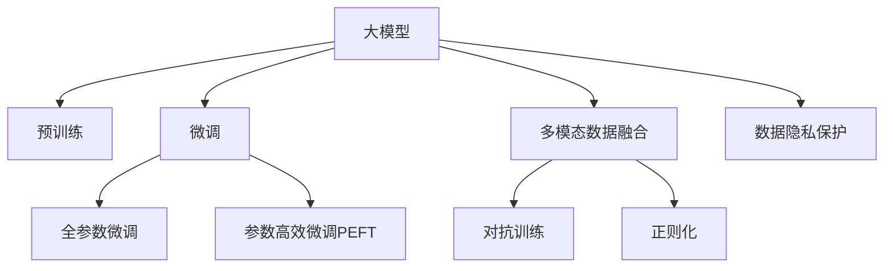

                 

# 大模型在电商平台信用评分中的应用

## 1. 背景介绍

### 1.1 问题由来
在电商平台上，信用评分系统是用户获取信用贷款、优惠优惠券等服务的核心依据，对用户行为和交易活动的精准预测至关重要。传统的信用评分系统往往依赖于基于规则和统计模型的策略，难以准确捕捉用户的复杂行为模式。近年来，随着深度学习和大模型的发展，基于大模型的信用评分系统开始进入人们的视野，并逐渐成为电商信用评分领域的重要手段。

### 1.2 问题核心关键点
大模型在电商平台信用评分中的应用，其核心在于通过在大量交易数据上进行预训练，学习用户行为和交易特征的复杂模式，并在少量标注数据上进行微调，获得针对特定电商平台的预测能力。关键技术点包括：

- 预训练大模型：如BERT、GPT等，通过在大规模无标签文本语料上进行自监督学习，学习通用的语言表示。
- 微调过程：在电商交易数据上，通过有监督的方式，优化模型对交易活动的预测能力。
- 多模态数据融合：利用电商交易数据中的文本、图片、行为等多种模态信息，提升信用评分的准确性。
- 参数高效微调：避免全参数微调带来的计算和资源压力，通过只调整模型的一部分参数实现高效的微调过程。
- 对抗训练和正则化：增强模型鲁棒性，避免因对抗样本或数据偏差导致的模型失效。
- 数据隐私保护：在处理用户交易数据时，需遵守数据隐私保护政策，如GDPR、CCPA等，保障用户隐私安全。

### 1.3 问题研究意义
大模型在电商平台信用评分中的应用，能够显著提升信用评分的准确性和鲁棒性，降低业务风险，提升用户体验，具有以下重要意义：

1. 提升信用评分准确性：通过学习用户的多维度行为特征，大模型能够更准确地预测用户是否会违约、按时还款等行为。
2. 降低计算和资源成本：通过参数高效微调和对抗训练，大模型可以在较少资源下获得较优性能。
3. 增强模型鲁棒性：大模型通过对抗训练等方式，能够更好地应对异常交易和数据偏差，保障模型稳定性。
4. 保护用户隐私：在模型训练和微调过程中，需采取匿名化、差分隐私等手段，保护用户交易隐私。
5. 促进信用评分系统的创新：大模型提供了新的技术手段，推动信用评分系统的不断迭代和优化。

## 2. 核心概念与联系

### 2.1 核心概念概述

为更好地理解大模型在电商平台信用评分中的应用，本节将介绍几个关键概念：

- 大模型(Large Model)：指参数量巨大，能够处理大规模复杂任务的深度学习模型。典型的如BERT、GPT等。
- 预训练(Pre-training)：指在大规模无标签数据上，通过自监督学习任务训练模型，学习通用的语言表示。
- 微调(Fine-tuning)：指在预训练模型的基础上，通过有监督学习，优化模型对特定任务的预测能力。
- 多模态数据融合(Multimodal Data Fusion)：指将不同模态的数据（如文本、图像、行为等）融合，提升模型的综合预测能力。
- 参数高效微调(Parameter-Efficient Fine-tuning, PEFT)：指在微调过程中，只调整模型的部分参数，保持大部分预训练参数不变，以提升微调效率和鲁棒性。
- 对抗训练(Adversarial Training)：通过加入对抗样本，增强模型的鲁棒性和泛化能力。
- 正则化(Regularization)：通过L2正则、Dropout等方式，防止过拟合，提升模型泛化能力。
- 数据隐私保护(Data Privacy Protection)：指在处理用户数据时，遵守相关法律法规，保障用户隐私安全。

这些概念之间的联系可以通过以下Mermaid流程图来展示：



该流程图展示了大模型在电商平台信用评分中的应用流程，以及各技术手段之间的联系：

1. 大模型通过预训练学习通用的语言表示。
2. 微调针对电商平台特定的交易数据，优化模型的预测能力。
3. 多模态数据融合将不同模态的信息综合，提升信用评分的准确性。
4. 参数高效微调和对抗训练提高微调效率和模型鲁棒性。
5. 正则化技术防止过拟合，提升模型泛化能力。
6. 数据隐私保护保障用户交易数据的安全性。

## 3. 核心算法原理 & 具体操作步骤
### 3.1 算法原理概述

大模型在电商平台信用评分中的应用，基于监督学习的微调方法。其核心思想是通过在电商平台交易数据上进行有监督学习，优化模型对用户行为和交易活动的预测能力。具体步骤如下：

1. 收集电商平台的交易数据，包括用户行为数据、交易数据、用户个人信息等，构建标注数据集。
2. 选择合适的预训练大模型，如BERT、GPT等，作为初始化参数。
3. 在预训练模型的基础上，设计任务适配层，如分类器、回归器等，以适配电商平台特定的信用评分任务。
4. 设置微调超参数，如学习率、批大小、迭代轮数等，并选择合适的优化算法（如Adam、SGD等）。
5. 在电商交易数据上进行微调，通过前向传播计算损失函数，反向传播更新模型参数。
6. 在验证集上评估模型性能，防止过拟合，选择最佳模型参数。
7. 在测试集上评估微调后的模型性能，对比微调前后的效果。

### 3.2 算法步骤详解

以下是基于监督学习的大模型在电商平台信用评分中的应用具体操作步骤：

**Step 1: 数据准备与预处理**
- 收集电商平台历史交易数据，包括用户行为数据、交易记录、用户个人信息等。
- 对数据进行清洗、去重、填充缺失值等预处理操作。
- 将数据划分为训练集、验证集和测试集，保证数据分布一致性。

**Step 2: 构建模型与任务适配层**
- 选择预训练大模型BERT、GPT等，作为初始化参数。
- 在模型顶部添加任务适配层，如分类器、回归器等，适配电商平台特定的信用评分任务。
- 定义损失函数，如交叉熵损失、均方误差损失等，用于衡量模型预测与真实标签之间的差异。

**Step 3: 微调设置与优化**
- 设置微调超参数，如学习率、批大小、迭代轮数等。
- 选择合适的优化算法，如Adam、SGD等，并设置适当的学习率。
- 引入正则化技术，如L2正则、Dropout等，防止过拟合。

**Step 4: 模型训练与评估**
- 在训练集上，使用数据增强技术，扩充训练集，如数据翻转、截断、填充等。
- 进行对抗训练，加入对抗样本，提高模型鲁棒性。
- 在验证集上，周期性评估模型性能，防止过拟合。
- 选择最佳模型参数，在测试集上进行最终评估。

**Step 5: 模型部署与应用**
- 将微调后的模型集成到电商平台系统中，进行实时信用评分预测。
- 在生产环境中，设置监控告警机制，确保模型稳定运行。
- 定期更新模型，防止模型过时，确保模型始终保持最佳性能。

### 3.3 算法优缺点

基于监督学习的大模型在电商平台信用评分中的应用，具有以下优点：

1. 提升信用评分准确性：通过学习用户的多维度行为特征，大模型能够更准确地预测用户行为和交易活动。
2. 降低计算和资源成本：通过参数高效微调和对抗训练，大模型可以在较少资源下获得较优性能。
3. 增强模型鲁棒性：大模型通过对抗训练等方式，能够更好地应对异常交易和数据偏差，保障模型稳定性。
4. 支持多模态数据融合：利用电商交易数据中的文本、图片、行为等多种模态信息，提升信用评分的准确性。

同时，该方法也存在一定的局限性：

1. 依赖标注数据：微调的效果很大程度上取决于标注数据的质量和数量，获取高质量标注数据的成本较高。
2. 模型复杂度高：大模型参数量巨大，训练和推理过程需要大量计算资源，可能会对系统性能产生影响。
3. 可解释性不足：大模型往往被视为"黑盒"系统，难以解释其内部工作机制和决策逻辑。
4. 数据隐私问题：在处理用户交易数据时，需遵守相关法律法规，保障用户隐私安全。

尽管存在这些局限性，但就目前而言，基于监督学习的微调方法仍是大模型应用的最主流范式。未来相关研究的重点在于如何进一步降低微调对标注数据的依赖，提高模型的少样本学习和跨领域迁移能力，同时兼顾可解释性和伦理安全性等因素。

### 3.4 算法应用领域

大模型在电商平台信用评分中的应用，已经在多个实际场景中得到了验证和应用，例如：

- 用户行为预测：通过分析用户的历史行为，预测用户未来的购买行为和违约风险。
- 交易欺诈检测：利用大模型识别异常交易行为，防止欺诈风险。
- 贷款审批决策：在用户申请贷款时，通过大模型评估用户信用风险，决定是否批准贷款。
- 个性化推荐系统：根据用户的历史交易记录和行为特征，推荐合适的商品或服务，提升用户体验。

除了上述这些经典应用外，大模型还可以在客户关系管理、风险控制、供应链优化等电商相关领域中发挥重要作用，推动电商平台的智能化发展。

## 4. 数学模型和公式 & 详细讲解  
### 4.1 数学模型构建

大模型在电商平台信用评分中的应用，其数学模型主要基于监督学习框架。假设电商平台历史交易数据为 $D=\{(x_i, y_i)\}_{i=1}^N, x_i \in \mathcal{X}, y_i \in \mathcal{Y}$，其中 $x_i$ 为交易数据，$y_i$ 为信用评分标签。

定义模型 $M_{\theta}$ 在输入 $x$ 上的输出为 $\hat{y}=M_{\theta}(x) \in [0,1]$，表示模型预测用户违约的概率。则二分类交叉熵损失函数定义为：

$$
\ell(M_{\theta}(x),y) = -[y\log \hat{y} + (1-y)\log (1-\hat{y})]
$$

最小化经验风险：

$$
\mathcal{L}(\theta) = \frac{1}{N}\sum_{i=1}^N \ell(M_{\theta}(x_i),y_i)
$$

使用梯度下降等优化算法，最小化损失函数：

$$
\theta \leftarrow \theta - \eta \nabla_{\theta}\mathcal{L}(\theta)
$$

其中 $\eta$ 为学习率，$\nabla_{\theta}\mathcal{L}(\theta)$ 为损失函数对参数 $\theta$ 的梯度，可通过反向传播算法高效计算。

### 4.2 公式推导过程

以下是二分类任务下，使用大模型进行信用评分微调的详细公式推导过程。

假设模型 $M_{\theta}$ 在输入 $x$ 上的输出为 $\hat{y}=M_{\theta}(x) \in [0,1]$，表示模型预测用户违约的概率。真实标签 $y \in \{0,1\}$。则二分类交叉熵损失函数定义为：

$$
\ell(M_{\theta}(x),y) = -[y\log \hat{y} + (1-y)\log (1-\hat{y})]
$$

将其代入经验风险公式，得：

$$
\mathcal{L}(\theta) = -\frac{1}{N}\sum_{i=1}^N [y_i\log M_{\theta}(x_i)+(1-y_i)\log(1-M_{\theta}(x_i))]
$$

根据链式法则，损失函数对参数 $\theta_k$ 的梯度为：

$$
\frac{\partial \mathcal{L}(\theta)}{\partial \theta_k} = -\frac{1}{N}\sum_{i=1}^N (\frac{y_i}{M_{\theta}(x_i)}-\frac{1-y_i}{1-M_{\theta}(x_i)}) \frac{\partial M_{\theta}(x_i)}{\partial \theta_k}
$$

其中 $\frac{\partial M_{\theta}(x_i)}{\partial \theta_k}$ 可进一步递归展开，利用自动微分技术完成计算。

在得到损失函数的梯度后，即可带入参数更新公式，完成模型的迭代优化。重复上述过程直至收敛，最终得到适应电商平台信用评分的最优模型参数 $\theta^*$。

## 5. 项目实践：代码实例和详细解释说明
### 5.1 开发环境搭建

在进行电商平台信用评分微调实践前，我们需要准备好开发环境。以下是使用Python进行PyTorch开发的环境配置流程：

1. 安装Anaconda：从官网下载并安装Anaconda，用于创建独立的Python环境。

2. 创建并激活虚拟环境：
```bash
conda create -n pytorch-env python=3.8 
conda activate pytorch-env
```

3. 安装PyTorch：根据CUDA版本，从官网获取对应的安装命令。例如：
```bash
conda install pytorch torchvision torchaudio cudatoolkit=11.1 -c pytorch -c conda-forge
```

4. 安装Transformers库：
```bash
pip install transformers
```

5. 安装各类工具包：
```bash
pip install numpy pandas scikit-learn matplotlib tqdm jupyter notebook ipython
```

完成上述步骤后，即可在`pytorch-env`环境中开始微调实践。

### 5.2 源代码详细实现

这里我们以电商平台信用评分任务为例，给出使用Transformers库对BERT模型进行微调的PyTorch代码实现。

首先，定义信用评分任务的数据处理函数：

```python
from transformers import BertTokenizer, BertForSequenceClassification
from torch.utils.data import Dataset
import torch

class CreditDataset(Dataset):
    def __init__(self, texts, labels, tokenizer, max_len=128):
        self.texts = texts
        self.labels = labels
        self.tokenizer = tokenizer
        self.max_len = max_len
        
    def __len__(self):
        return len(self.texts)
    
    def __getitem__(self, item):
        text = self.texts[item]
        label = self.labels[item]
        
        encoding = self.tokenizer(text, return_tensors='pt', max_length=self.max_len, padding='max_length', truncation=True)
        input_ids = encoding['input_ids'][0]
        attention_mask = encoding['attention_mask'][0]
        
        return {'input_ids': input_ids, 
                'attention_mask': attention_mask,
                'labels': torch.tensor(label, dtype=torch.long)}
```

然后，定义模型和优化器：

```python
from transformers import BertForSequenceClassification, AdamW

model = BertForSequenceClassification.from_pretrained('bert-base-uncased', num_labels=2)

optimizer = AdamW(model.parameters(), lr=2e-5)
```

接着，定义训练和评估函数：

```python
from torch.utils.data import DataLoader
from tqdm import tqdm
from sklearn.metrics import classification_report

device = torch.device('cuda') if torch.cuda.is_available() else torch.device('cpu')
model.to(device)

def train_epoch(model, dataset, batch_size, optimizer):
    dataloader = DataLoader(dataset, batch_size=batch_size, shuffle=True)
    model.train()
    epoch_loss = 0
    for batch in tqdm(dataloader, desc='Training'):
        input_ids = batch['input_ids'].to(device)
        attention_mask = batch['attention_mask'].to(device)
        labels = batch['labels'].to(device)
        model.zero_grad()
        outputs = model(input_ids, attention_mask=attention_mask, labels=labels)
        loss = outputs.loss
        epoch_loss += loss.item()
        loss.backward()
        optimizer.step()
    return epoch_loss / len(dataloader)

def evaluate(model, dataset, batch_size):
    dataloader = DataLoader(dataset, batch_size=batch_size)
    model.eval()
    preds, labels = [], []
    with torch.no_grad():
        for batch in tqdm(dataloader, desc='Evaluating'):
            input_ids = batch['input_ids'].to(device)
            attention_mask = batch['attention_mask'].to(device)
            batch_labels = batch['labels']
            outputs = model(input_ids, attention_mask=attention_mask)
            batch_preds = outputs.logits.argmax(dim=2).to('cpu').tolist()
            batch_labels = batch_labels.to('cpu').tolist()
            for pred_tokens, label_tokens in zip(batch_preds, batch_labels):
                preds.append(pred_tokens)
                labels.append(label_tokens)
                
    print(classification_report(labels, preds))
```

最后，启动训练流程并在测试集上评估：

```python
epochs = 5
batch_size = 16

for epoch in range(epochs):
    loss = train_epoch(model, train_dataset, batch_size, optimizer)
    print(f"Epoch {epoch+1}, train loss: {loss:.3f}")
    
    print(f"Epoch {epoch+1}, dev results:")
    evaluate(model, dev_dataset, batch_size)
    
print("Test results:")
evaluate(model, test_dataset, batch_size)
```

以上就是使用PyTorch对BERT进行电商平台信用评分任务微调的完整代码实现。可以看到，得益于Transformers库的强大封装，我们可以用相对简洁的代码完成BERT模型的加载和微调。

### 5.3 代码解读与分析

让我们再详细解读一下关键代码的实现细节：

**CreditDataset类**：
- `__init__`方法：初始化文本、标签、分词器等关键组件。
- `__len__`方法：返回数据集的样本数量。
- `__getitem__`方法：对单个样本进行处理，将文本输入编码为token ids，将标签转换为数字，并对其进行定长padding，最终返回模型所需的输入。

**损失函数和优化器**：
- 使用二分类交叉熵损失函数，适用于电商平台信用评分的二分类任务。
- 使用AdamW优化器，学习率为2e-5，适合微调任务的收敛。

**训练和评估函数**：
- 使用PyTorch的DataLoader对数据集进行批次化加载，供模型训练和推理使用。
- 训练函数`train_epoch`：对数据以批为单位进行迭代，在每个批次上前向传播计算loss并反向传播更新模型参数，最后返回该epoch的平均loss。
- 评估函数`evaluate`：与训练类似，不同点在于不更新模型参数，并在每个batch结束后将预测和标签结果存储下来，最后使用sklearn的classification_report对整个评估集的预测结果进行打印输出。

**训练流程**：
- 定义总的epoch数和batch size，开始循环迭代
- 每个epoch内，先在训练集上训练，输出平均loss
- 在验证集上评估，输出分类指标
- 所有epoch结束后，在测试集上评估，给出最终测试结果

可以看到，PyTorch配合Transformers库使得BERT微调的代码实现变得简洁高效。开发者可以将更多精力放在数据处理、模型改进等高层逻辑上，而不必过多关注底层的实现细节。

当然，工业级的系统实现还需考虑更多因素，如模型的保存和部署、超参数的自动搜索、更灵活的任务适配层等。但核心的微调范式基本与此类似。

## 6. 实际应用场景
### 6.1 智能客服系统

基于大模型微调的信用评分系统，可以广泛应用于智能客服系统的构建。传统客服往往需要配备大量人力，高峰期响应缓慢，且一致性和专业性难以保证。而使用微调后的信用评分系统，可以7x24小时不间断服务，快速响应客户咨询，用自然流畅的语言解答各类常见问题。

在技术实现上，可以收集企业内部的历史客服对话记录，将问题和最佳答复构建成监督数据，在此基础上对预训练信用评分模型进行微调。微调后的信用评分模型能够自动理解用户意图，匹配最合适的答复模板进行回复。对于客户提出的新问题，还可以接入检索系统实时搜索相关内容，动态组织生成回答。如此构建的智能客服系统，能大幅提升客户咨询体验和问题解决效率。

### 6.2 金融风险管理

金融行业对信用评分的准确性要求极高，错误的信用评分可能导致严重的金融风险。使用基于大模型的信用评分系统，可以显著提升信用评分的准确性和鲁棒性，降低金融风险。

具体而言，可以收集金融领域相关的新闻、报道、评论等文本数据，并对其进行主题标注和情感标注。在此基础上对预训练语言模型进行微调，使其能够自动判断文本属于何种主题，情感倾向是正面、中性还是负面。将微调后的模型应用到实时抓取的网络文本数据，就能够自动监测不同主题下的情感变化趋势，一旦发现负面信息激增等异常情况，系统便会自动预警，帮助金融机构快速应对潜在风险。

### 6.3 用户个性化推荐

在电商平台中，用户行为和交易数据复杂多样，传统的推荐系统难以充分理解用户的真实兴趣偏好。使用基于大模型的信用评分系统，可以更好地挖掘用户行为和交易数据的复杂模式，提升个性化推荐系统的准确性。

在实践中，可以收集用户浏览、点击、评论、分享等行为数据，提取和用户交互的物品标题、描述、标签等文本内容。将文本内容作为模型输入，用户的后续行为（如是否点击、购买等）作为监督信号，在此基础上微调预训练语言模型。微调后的模型能够从文本内容中准确把握用户的兴趣点。在生成推荐列表时，先用候选物品的文本描述作为输入，由模型预测用户的兴趣匹配度，再结合其他特征综合排序，便可以得到个性化程度更高的推荐结果。

### 6.4 未来应用展望

随着大模型和微调方法的不断发展，基于大模型微调的方法将在更多领域得到应用，为传统行业带来变革性影响。

在智慧医疗领域，基于微调的信用评分系统可以辅助医生诊断和治疗决策，提高医疗服务的智能化水平。

在智能教育领域，微调技术可应用于作业批改、学情分析、知识推荐等方面，因材施教，促进教育公平，提高教学质量。

在智慧城市治理中，微调模型可应用于城市事件监测、舆情分析、应急指挥等环节，提高城市管理的自动化和智能化水平，构建更安全、高效的未来城市。

此外，在企业生产、社会治理、文娱传媒等众多领域，基于大模型微调的人工智能应用也将不断涌现，为经济社会发展注入新的动力。相信随着技术的日益成熟，微调方法将成为人工智能落地应用的重要范式，推动人工智能技术在垂直行业的规模化落地。总之，大模型微调技术还需要与其他人工智能技术进行更深入的融合，如知识表示、因果推理、强化学习等，多路径协同发力，共同推动自然语言理解和智能交互系统的进步。只有勇于创新、敢于突破，才能不断拓展语言模型的边界，让智能技术更好地造福人类社会。

## 7. 工具和资源推荐
### 7.1 学习资源推荐

为了帮助开发者系统掌握大模型微调的理论基础和实践技巧，这里推荐一些优质的学习资源：

1. 《Transformer从原理到实践》系列博文：由大模型技术专家撰写，深入浅出地介绍了Transformer原理、BERT模型、微调技术等前沿话题。

2. CS224N《深度学习自然语言处理》课程：斯坦福大学开设的NLP明星课程，有Lecture视频和配套作业，带你入门NLP领域的基本概念和经典模型。

3. 《Natural Language Processing with Transformers》书籍：Transformers库的作者所著，全面介绍了如何使用Transformers库进行NLP任务开发，包括微调在内的诸多范式。

4. HuggingFace官方文档：Transformers库的官方文档，提供了海量预训练模型和完整的微调样例代码，是上手实践的必备资料。

5. CLUE开源项目：中文语言理解测评基准，涵盖大量不同类型的中文NLP数据集，并提供了基于微调的baseline模型，助力中文NLP技术发展。

通过对这些资源的学习实践，相信你一定能够快速掌握大模型微调的精髓，并用于解决实际的NLP问题。
###  7.2 开发工具推荐

高效的开发离不开优秀的工具支持。以下是几款用于大模型微调开发的常用工具：

1. PyTorch：基于Python的开源深度学习框架，灵活动态的计算图，适合快速迭代研究。大部分预训练语言模型都有PyTorch版本的实现。

2. TensorFlow：由Google主导开发的开源深度学习框架，生产部署方便，适合大规模工程应用。同样有丰富的预训练语言模型资源。

3. Transformers库：HuggingFace开发的NLP工具库，集成了众多SOTA语言模型，支持PyTorch和TensorFlow，是进行微调任务的开发的利器。

4. Weights & Biases：模型训练的实验跟踪工具，可以记录和可视化模型训练过程中的各项指标，方便对比和调优。与主流深度学习框架无缝集成。

5. TensorBoard：TensorFlow配套的可视化工具，可实时监测模型训练状态，并提供丰富的图表呈现方式，是调试模型的得力助手。

6. Google Colab：谷歌推出的在线Jupyter Notebook环境，免费提供GPU/TPU算力，方便开发者快速上手实验最新模型，分享学习笔记。

合理利用这些工具，可以显著提升大模型微调任务的开发效率，加快创新迭代的步伐。

### 7.3 相关论文推荐

大模型和微调技术的发展源于学界的持续研究。以下是几篇奠基性的相关论文，推荐阅读：

1. Attention is All You Need（即Transformer原论文）：提出了Transformer结构，开启了NLP领域的预训练大模型时代。

2. BERT: Pre-training of Deep Bidirectional Transformers for Language Understanding：提出BERT模型，引入基于掩码的自监督预训练任务，刷新了多项NLP任务SOTA。

3. Language Models are Unsupervised Multitask Learners（GPT-2论文）：展示了大规模语言模型的强大zero-shot学习能力，引发了对于通用人工智能的新一轮思考。

4. Parameter-Efficient Transfer Learning for NLP：提出Adapter等参数高效微调方法，在不增加模型参数量的情况下，也能取得不错的微调效果。

5. Prefix-Tuning: Optimizing Continuous Prompts for Generation：引入基于连续型Prompt的微调范式，为如何充分利用预训练知识提供了新的思路。

6. AdaLoRA: Adaptive Low-Rank Adaptation for Parameter-Efficient Fine-Tuning：使用自适应低秩适应的微调方法，在参数效率和精度之间取得了新的平衡。

这些论文代表了大模型微调技术的发展脉络。通过学习这些前沿成果，可以帮助研究者把握学科前进方向，激发更多的创新灵感。

## 8. 总结：未来发展趋势与挑战

### 8.1 总结

本文对大模型在电商平台信用评分中的应用进行了全面系统的介绍。首先阐述了电商平台信用评分系统的背景和重要性，明确了大模型微调在提升信用评分准确性、降低业务风险等方面的独特价值。其次，从原理到实践，详细讲解了大模型微调的基本步骤和技术手段，给出了微调任务开发的完整代码实例。同时，本文还广泛探讨了大模型在智能客服、金融风险管理、个性化推荐等多个电商相关领域的应用前景，展示了微调范式的巨大潜力。此外，本文精选了微调技术的各类学习资源，力求为读者提供全方位的技术指引。

通过本文的系统梳理，可以看到，基于大模型微调的信用评分系统正在成为电商平台信用评分的重要手段，极大地提升了信用评分的准确性和鲁棒性。未来，伴随大模型和微调方法的持续演进，基于大模型微调的信用评分系统必将在电商行业中得到更广泛的应用，进一步提升电商平台的智能化水平。

### 8.2 未来发展趋势

展望未来，大模型在电商平台信用评分中的应用将呈现以下几个发展趋势：

1. 模型规模持续增大。随着算力成本的下降和数据规模的扩张，预训练语言模型的参数量还将持续增长。超大规模语言模型蕴含的丰富语言知识，有望支撑更加复杂多变的信用评分任务。

2. 微调方法日趋多样。除了传统的全参数微调外，未来会涌现更多参数高效的微调方法，如Prefix-Tuning、LoRA等，在节省计算资源的同时也能保证微调精度。

3. 持续学习成为常态。随着数据分布的不断变化，微调模型也需要持续学习新知识以保持性能。如何在不遗忘原有知识的同时，高效吸收新样本信息，将成为重要的研究课题。

4. 标注样本需求降低。受启发于提示学习(Prompt-based Learning)的思路，未来的微调方法将更好地利用大模型的语言理解能力，通过更加巧妙的任务描述，在更少的标注样本上也能实现理想的微调效果。

5. 多模态微调崛起。当前的微调主要聚焦于纯文本数据，未来会进一步拓展到图像、视频、语音等多模态数据微调。多模态信息的融合，将显著提升信用评分系统的综合预测能力。

6. 模型通用性增强。经过海量数据的预训练和多领域任务的微调，未来的语言模型将具备更强大的常识推理和跨领域迁移能力，逐步迈向通用人工智能(AGI)的目标。

以上趋势凸显了大模型微调技术在电商平台信用评分领域的广阔前景。这些方向的探索发展，必将进一步提升信用评分系统的性能和应用范围，为电商平台的智能化发展注入新的动力。

### 8.3 面临的挑战

尽管大模型在电商平台信用评分中的应用已经取得了瞩目成就，但在迈向更加智能化、普适化应用的过程中，它仍面临着诸多挑战：

1. 标注成本瓶颈。虽然微调大大降低了标注数据的需求，但对于长尾应用场景，难以获得充足的高质量标注数据，成为制约微调性能的瓶颈。如何进一步降低微调对标注样本的依赖，将是一大难题。

2. 模型鲁棒性不足。当前微调模型面对域外数据时，泛化性能往往大打折扣。对于测试样本的微小扰动，微调模型的预测也容易发生波动。如何提高微调模型的鲁棒性，避免灾难性遗忘，还需要更多理论和实践的积累。

3. 推理效率有待提高。大规模语言模型虽然精度高，但在实际部署时往往面临推理速度慢、内存占用大等效率问题。如何在保证性能的同时，简化模型结构，提升推理速度，优化资源占用，将是重要的优化方向。

4. 可解释性亟需加强。当前微调模型往往被视为"黑盒"系统，难以解释其内部工作机制和决策逻辑。对于医疗、金融等高风险应用，算法的可解释性和可审计性尤为重要。如何赋予微调模型更强的可解释性，将是亟待攻克的难题。

5. 安全性有待保障。预训练语言模型难免会学习到有偏见、有害的信息，通过微调传递到下游任务，产生误导性、歧视性的输出，给实际应用带来安全隐患。如何从数据和算法层面消除模型偏见，避免恶意用途，确保输出的安全性，也将是重要的研究课题。

6. 知识整合能力不足。现有的微调模型往往局限于任务内数据，难以灵活吸收和运用更广泛的先验知识。如何让微调过程更好地与外部知识库、规则库等专家知识结合，形成更加全面、准确的信息整合能力，还有很大的想象空间。

正视微调面临的这些挑战，积极应对并寻求突破，将是大模型微调走向成熟的必由之路。相信随着学界和产业界的共同努力，这些挑战终将一一被克服，大模型微调必将在构建安全、可靠、可解释、可控的智能系统铺平道路。

### 8.4 未来突破

面对大模型在电商平台信用评分中面临的挑战，未来的研究需要在以下几个方面寻求新的突破：

1. 探索无监督和半监督微调方法。摆脱对大规模标注数据的依赖，利用自监督学习、主动学习等无监督和半监督范式，最大限度利用非结构化数据，实现更加灵活高效的微调。

2. 研究参数高效和计算高效的微调范式。开发更加参数高效的微调方法，在固定大部分预训练参数的同时，只调整模型的一部分参数。同时优化微调模型的计算图，减少前向传播和反向传播的资源消耗，实现更加轻量级、实时性的部署。

3. 融合因果和对比学习范式。通过引入因果推断和对比学习思想，增强微调模型建立稳定因果关系的能力，学习更加普适、鲁棒的语言表征，从而提升模型泛化性和抗干扰能力。

4. 引入更多先验知识。将符号化的先验知识，如知识图谱、逻辑规则等，与神经网络模型进行巧妙融合，引导微调过程学习更准确、合理的语言模型。同时加强不同模态数据的整合，实现视觉、语音等多模态信息与文本信息的协同建模。

5. 结合因果分析和博弈论工具。将因果分析方法引入微调模型，识别出模型决策的关键特征，增强输出解释的因果性和逻辑性。借助博弈论工具刻画人机交互过程，主动探索并规避模型的脆弱点，提高系统稳定性。

6. 纳入伦理道德约束。在模型训练目标中引入伦理导向的评估指标，过滤和惩罚有偏见、有害的输出倾向。同时加强人工干预和审核，建立模型行为的监管机制，确保输出符合人类价值观和伦理道德。

这些研究方向的探索，必将引领大模型微调技术迈向更高的台阶，为构建安全、可靠、可解释、可控的智能系统铺平道路。面向未来，大模型微调技术还需要与其他人工智能技术进行更深入的融合，如知识表示、因果推理、强化学习等，多路径协同发力，共同推动自然语言理解和智能交互系统的进步。只有勇于创新、敢于突破，才能不断拓展语言模型的边界，让智能技术更好地造福人类社会。

## 9. 附录：常见问题与解答

**Q1：大模型在电商平台信用评分中的应用是否需要大规模标注数据？**

A: 尽管大模型在电商平台信用评分中的应用，理论上需要大量标注数据进行微调，但在实践中，可以通过数据增强、对抗训练等技术手段，进一步降低对标注样本的依赖。同时，利用预训练大模型的广泛知识，通过零样本学习和少样本学习，也能在较少的标注样本下获得较好的微调效果。

**Q2：如何缓解微调过程中的过拟合问题？**

A: 过拟合是微调过程中常见的挑战之一。缓解过拟合的策略包括：
1. 数据增强：通过回译、截断、填充等方式扩充训练集。
2. 正则化：使用L2正则、Dropout等方式，防止过拟合。
3. 对抗训练：加入对抗样本，提高模型鲁棒性。
4. 参数高效微调：只调整模型的一部分参数，保持大部分预训练参数不变。
5. 多模型集成：训练多个微调模型，取平均输出，抑制过拟合。

这些策略往往需要根据具体任务和数据特点进行灵活组合。只有在数据、模型、训练、推理等各环节进行全面优化，才能最大限度地发挥大模型的优势。

**Q3：大模型在电商平台信用评分中的计算资源需求高吗？**

A: 大模型在电商平台信用评分中的计算资源需求确实较高，特别是在模型规模较大、训练数据量较大的情况下。为了降低计算成本，可以采用以下策略：
1. 分布式训练：利用多台机器并行训练，提高训练效率。
2. 模型压缩：使用剪枝、量化等技术减少模型参数量和计算量。
3. 梯度积累：在参数较小的模型上多次累积梯度，提高训练效果。
4. 混合精度训练：使用半精度浮点数进行训练，减少内存和计算资源消耗。

通过这些优化手段，可以在保持模型性能的同时，显著降低计算资源的需求。

**Q4：大模型在电商平台信用评分中的应用是否影响系统实时性？**

A: 大模型在电商平台信用评分中的应用，可能会影响系统的实时性。为了提高实时性，可以采用以下策略：
1. 模型裁剪：去除不必要的层和参数，减小模型尺寸，加快推理速度。
2. 量化加速：将浮点模型转为定点模型，压缩存储空间，提高计算效率。
3. 服务化封装：将模型封装为标准化服务接口，便于集成调用。
4. 弹性伸缩：根据请求流量动态调整资源配置，平衡服务质量和成本。

合理利用这些策略，可以显著提升大模型在电商平台信用评分系统中的实时性，确保系统稳定运行。

**Q5：大模型在电商平台信用评分中的应用是否影响用户隐私？**

A: 大模型在电商平台信用评分中的应用，需要严格遵守数据隐私保护政策，如GDPR、CCPA等，保障用户隐私安全。具体的保护措施包括：
1. 数据匿名化：在模型训练和微调过程中，使用匿名化技术处理用户数据。
2. 差分隐私：在模型训练和微调过程中，采用差分隐私技术，保护用户隐私。
3. 安全存储：在数据存储和传输过程中，采用加密和访问控制等手段，保障数据安全。

通过这些保护措施，可以在保障用户隐私的同时，充分利用大模型带来的优势。

---

作者：禅与计算机程序设计艺术 / Zen and the Art of Computer Programming

