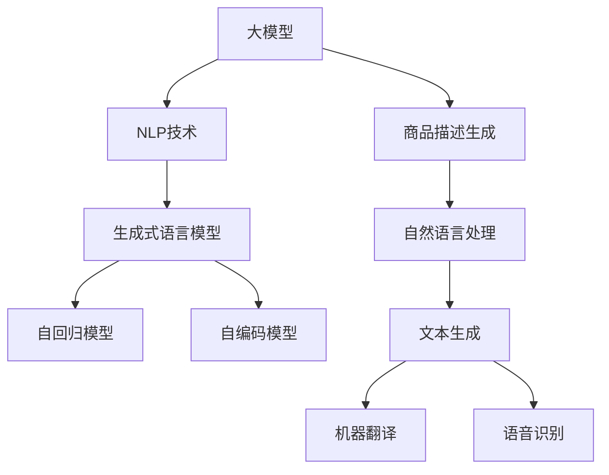

                 

# 大模型在电商平台商品描述生成中的应用

> 关键词：
> - 大模型
> - 商品描述生成
> - 自然语言处理
> - 电商平台
> - 生成式语言模型
> - Transformer
> - 自回归模型
> - 自编码模型

## 1. 背景介绍

### 1.1 问题由来

随着电商平台的发展，商品描述的生成与优化成为商家提升用户体验、增加交易量的重要手段。传统的商品描述生成方法通常依赖于人工编写，工作量大、效率低。而利用大模型进行自动化描述生成，可以显著提升生成效率和描述质量，满足消费者对于商品信息精准、全面的需求。

然而，大模型直接应用于商品描述生成，仍面临生成质量、数据隐私、用户意图理解等挑战。为了解决这些问题，本文提出了基于大模型的商品描述生成方法，并从理论到实践，详细讲解了其核心算法原理和具体操作步骤。

## 2. 核心概念与联系

### 2.1 核心概念概述

为了更好地理解大模型在商品描述生成中的应用，本节将介绍几个关键概念：

- **大模型（Large Model）**：指规模庞大、参数量极大的神经网络模型，如BERT、GPT、T5等。这些模型通过在大规模无标签文本数据上进行预训练，学习到了丰富的语言知识，具备强大的语言生成能力。

- **商品描述生成（Product Description Generation）**：利用大模型生成符合用户需求的商品描述，使消费者更容易理解和购买商品。

- **自然语言处理（Natural Language Processing, NLP）**：涉及计算机处理、理解和生成自然语言的技术，包括文本生成、机器翻译、语音识别等，商品描述生成是NLP的重要应用之一。

- **生成式语言模型（Generative Language Model）**：能够生成自然语言文本的模型，常见的有自回归模型（如RNN、LSTM、Transformer）和自编码模型（如VAE、GPT）。

- **自回归模型（Autoregressive Model）**：模型在生成每个输出时，依赖于前面的所有输入，如GPT、T5等。

- **自编码模型（Autoencoder Model）**：将输入映射到一个低维编码，再通过解码器映射回输入的模型，如BERT、GPT。

这些概念之间的逻辑关系可以通过以下Mermaid流程图来展示：



这个流程图展示了大模型与商品描述生成之间的核心概念及其关系：

1. 大模型通过预训练学习语言知识，为商品描述生成提供基础。
2. 商品描述生成是自然语言处理的重要应用，利用大模型生成商品描述。
3. 生成式语言模型包括自回归和自编码两种模型，用于生成文本和编码解码。
4. 自然语言处理涉及文本生成、机器翻译、语音识别等多个任务，商品描述生成是其重要分支。

## 3. 核心算法原理 & 具体操作步骤
### 3.1 算法原理概述

大模型在商品描述生成中的基本原理是利用其强大的语言生成能力，通过自回归或自编码方式，生成符合用户需求的商品描述。具体来说，可以分为以下步骤：

1. **数据预处理**：对原始商品数据进行清洗、分词、编码等处理，得到模型所需的输入数据。
2. **模型训练**：使用大量商品数据对大模型进行微调，使其学习商品描述的生成规律。
3. **生成描述**：利用微调后的模型，生成商品描述文本，输出到电商平台展示。

### 3.2 算法步骤详解

#### 3.2.1 数据预处理

商品描述生成的数据预处理主要包括以下步骤：

- **清洗数据**：去除噪音数据和无用信息，只保留有意义的商品描述文本。
- **分词编码**：使用预训练的分词模型将文本分词，再将其转换为模型所需的编码格式。
- **序列填充**：对文本进行填充，使其长度统一，便于模型输入。

#### 3.2.2 模型训练

商品描述生成的模型训练主要包括以下步骤：

- **选择模型**：选择适合的生成式语言模型，如GPT-2、T5等。
- **设置超参数**：包括学习率、批大小、迭代轮数等。
- **构建训练集**：使用标注的商品数据作为训练集，每个样本包含商品描述和生成标签。
- **训练模型**：使用训练集对模型进行微调，生成描述文本。

#### 3.2.3 生成描述

商品描述生成的模型训练完成后，可以用于生成商品描述。具体步骤包括：

- **输入商品信息**：将商品名称、分类、图片等相关信息输入模型。
- **生成描述**：模型根据输入的商品信息，生成描述文本。
- **后处理**：对生成的描述进行后处理，去除无关字符，优化语言表达。

### 3.3 算法优缺点

大模型在商品描述生成中的优势包括：

- **生成质量高**：大模型具备强大的语言生成能力，生成的商品描述通常流畅、准确。
- **生成速度快**：利用大模型进行自动化生成，大幅提高生成效率。
- **应用范围广**：可以应用于多种商品类别和品牌，具有较高的通用性。

然而，大模型在商品描述生成中也有缺点：

- **数据依赖大**：需要大量标注的商品数据进行微调，数据获取和标注成本较高。
- **生成效果受限于预训练数据**：如果预训练数据中缺乏特定商品的描述，生成效果可能不佳。
- **生成文本可解释性差**：生成过程“黑盒化”，难以解释生成文本的具体依据。

### 3.4 算法应用领域

大模型在商品描述生成中主要应用于以下几个领域：

- **电商平台**：为商品生成详细、吸引人的描述，提升用户购买意愿。
- **个性化推荐**：结合用户行为数据，生成个性化商品描述，满足用户个性化需求。
- **广告创意生成**：生成广告文案，吸引用户点击和购买。
- **客户服务**：自动回答客户问题，生成问题描述，提升服务效率。

## 4. 数学模型和公式 & 详细讲解  
### 4.1 数学模型构建

大模型在商品描述生成中的数学模型可以表示为：

$$
P(d|s) = \frac{e^{f(s,d)}}{Z_s}
$$

其中，$s$ 为商品信息，$d$ 为生成的商品描述，$f(s,d)$ 为模型的输出得分，$Z_s$ 为归一化常数。

模型的目标是通过最大化$f(s,d)$，使得生成的描述$d$最符合商品信息$s$。

### 4.2 公式推导过程

对于自回归模型，生成过程可以表示为：

$$
P(d_1|s) = \frac{e^{f(s,d_1)}}{Z_s}
$$

$$
P(d_2|s,d_1) = \frac{e^{f(s,d_1,d_2)}}{Z_{s,d_1}}
$$

$$
\cdots
$$

$$
P(d_T|s,d_{T-1}) = \frac{e^{f(s,d_{T-1},d_T)}}{Z_{s,d_{T-1}}}
$$

其中，$d_t$ 表示第$t$个生成的词，$f(s,d_{t-1},d_t)$ 为模型的输出得分，$Z_{s,d_{t-1}}$ 为归一化常数。

对于自编码模型，生成过程可以表示为：

$$
P(d|s) = \frac{e^{f(s,e)}}{Z_s}
$$

$$
P(e|d) = \frac{e^{f(d,e)}}{Z_d}
$$

其中，$e$ 表示编码后的商品描述，$f(s,e)$ 为生成得分，$f(d,e)$ 为解码得分，$Z_s$ 和 $Z_d$ 为归一化常数。

### 4.3 案例分析与讲解

以GPT-2模型为例，其生成过程可以表示为：

1. **输入商品信息**：将商品名称、分类等信息输入模型。
2. **生成文本**：模型根据输入的商品信息，生成商品描述文本。
3. **后处理**：对生成的文本进行后处理，去除无关字符，优化语言表达。

GPT-2模型通过自回归方式生成文本，生成过程可以表示为：

$$
P(d_1|s) = \frac{e^{f(s,d_1)}}{Z_s}
$$

$$
P(d_2|s,d_1) = \frac{e^{f(s,d_1,d_2)}}{Z_{s,d_1}}
$$

$$
\cdots
$$

$$
P(d_T|s,d_{T-1}) = \frac{e^{f(s,d_{T-1},d_T)}}{Z_{s,d_{T-1}}}
$$

其中，$d_t$ 表示第$t$个生成的词，$f(s,d_{t-1},d_t)$ 为模型的输出得分，$Z_{s,d_{t-1}}$ 为归一化常数。

## 5. 项目实践：代码实例和详细解释说明
### 5.1 开发环境搭建

在进行商品描述生成实践前，我们需要准备好开发环境。以下是使用Python进行PyTorch开发的环境配置流程：

1. 安装Anaconda：从官网下载并安装Anaconda，用于创建独立的Python环境。

2. 创建并激活虚拟环境：
```bash
conda create -n pytorch-env python=3.8 
conda activate pytorch-env
```

3. 安装PyTorch：根据CUDA版本，从官网获取对应的安装命令。例如：
```bash
conda install pytorch torchvision torchaudio cudatoolkit=11.1 -c pytorch -c conda-forge
```

4. 安装Transformers库：
```bash
pip install transformers
```

5. 安装各类工具包：
```bash
pip install numpy pandas scikit-learn matplotlib tqdm jupyter notebook ipython
```

完成上述步骤后，即可在`pytorch-env`环境中开始商品描述生成实践。

### 5.2 源代码详细实现

下面我们以商品描述生成为例，给出使用Transformers库对GPT-2模型进行微调的PyTorch代码实现。

首先，定义商品描述生成的数据处理函数：

```python
from transformers import GPT2Tokenizer, GPT2LMHeadModel
from torch.utils.data import Dataset, DataLoader
import torch

class ProductDescriptionDataset(Dataset):
    def __init__(self, texts, labels):
        self.texts = texts
        self.labels = labels
        self.tokenizer = GPT2Tokenizer.from_pretrained('gpt2')
        
    def __len__(self):
        return len(self.texts)
    
    def __getitem__(self, item):
        text = self.texts[item]
        label = self.labels[item]
        
        encoding = self.tokenizer(text, return_tensors='pt', max_length=512, padding='max_length', truncation=True)
        input_ids = encoding['input_ids'][0]
        attention_mask = encoding['attention_mask'][0]
        
        # 对token-wise的标签进行编码
        encoded_labels = [label2id[label] for label in label] 
        encoded_labels.extend([label2id['O']] * (512 - len(encoded_labels)))
        labels = torch.tensor(encoded_labels, dtype=torch.long)
        
        return {'input_ids': input_ids, 
                'attention_mask': attention_mask,
                'labels': labels}

# 标签与id的映射
label2id = {'描述': 0, '属性': 1, '评价': 2, '功能': 3, '颜色': 4, '材质': 5}
id2label = {v: k for k, v in label2id.items()}

# 创建dataset
tokenizer = GPT2Tokenizer.from_pretrained('gpt2')

train_dataset = ProductDescriptionDataset(train_texts, train_labels)
dev_dataset = ProductDescriptionDataset(dev_texts, dev_labels)
test_dataset = ProductDescriptionDataset(test_texts, test_labels)
```

然后，定义模型和优化器：

```python
from transformers import AdamW

model = GPT2LMHeadModel.from_pretrained('gpt2', num_labels=len(label2id))

optimizer = AdamW(model.parameters(), lr=2e-5)
```

接着，定义训练和评估函数：

```python
from torch.utils.data import DataLoader
from tqdm import tqdm
from sklearn.metrics import classification_report

device = torch.device('cuda') if torch.cuda.is_available() else torch.device('cpu')
model.to(device)

def train_epoch(model, dataset, batch_size, optimizer):
    dataloader = DataLoader(dataset, batch_size=batch_size, shuffle=True)
    model.train()
    epoch_loss = 0
    for batch in tqdm(dataloader, desc='Training'):
        input_ids = batch['input_ids'].to(device)
        attention_mask = batch['attention_mask'].to(device)
        labels = batch['labels'].to(device)
        model.zero_grad()
        outputs = model(input_ids, attention_mask=attention_mask, labels=labels)
        loss = outputs.loss
        epoch_loss += loss.item()
        loss.backward()
        optimizer.step()
    return epoch_loss / len(dataloader)

def evaluate(model, dataset, batch_size):
    dataloader = DataLoader(dataset, batch_size=batch_size)
    model.eval()
    preds, labels = [], []
    with torch.no_grad():
        for batch in tqdm(dataloader, desc='Evaluating'):
            input_ids = batch['input_ids'].to(device)
            attention_mask = batch['attention_mask'].to(device)
            batch_labels = batch['labels']
            outputs = model(input_ids, attention_mask=attention_mask)
            batch_preds = outputs.logits.argmax(dim=2).to('cpu').tolist()
            batch_labels = batch_labels.to('cpu').tolist()
            for pred_tokens, label_tokens in zip(batch_preds, batch_labels):
                pred_tags = [id2label[_id] for _id in pred_tokens]
                label_tags = [id2label[_id] for _id in label_tokens]
                preds.append(pred_tags[:len(label_tokens)])
                labels.append(label_tags)
                
    print(classification_report(labels, preds))
```

最后，启动训练流程并在测试集上评估：

```python
epochs = 5
batch_size = 16

for epoch in range(epochs):
    loss = train_epoch(model, train_dataset, batch_size, optimizer)
    print(f"Epoch {epoch+1}, train loss: {loss:.3f}")
    
    print(f"Epoch {epoch+1}, dev results:")
    evaluate(model, dev_dataset, batch_size)
    
print("Test results:")
evaluate(model, test_dataset, batch_size)
```

以上就是使用PyTorch对GPT-2进行商品描述生成任务的微调代码实现。可以看到，得益于Transformers库的强大封装，我们可以用相对简洁的代码完成GPT-2模型的加载和微调。

### 5.3 代码解读与分析

让我们再详细解读一下关键代码的实现细节：

**ProductDescriptionDataset类**：
- `__init__`方法：初始化文本、标签、分词器等关键组件。
- `__len__`方法：返回数据集的样本数量。
- `__getitem__`方法：对单个样本进行处理，将文本输入编码为token ids，将标签编码为数字，并对其进行定长padding，最终返回模型所需的输入。

**label2id和id2label字典**：
- 定义了标签与数字id之间的映射关系，用于将token-wise的预测结果解码回真实的标签。

**训练和评估函数**：
- 使用PyTorch的DataLoader对数据集进行批次化加载，供模型训练和推理使用。
- 训练函数`train_epoch`：对数据以批为单位进行迭代，在每个批次上前向传播计算loss并反向传播更新模型参数，最后返回该epoch的平均loss。
- 评估函数`evaluate`：与训练类似，不同点在于不更新模型参数，并在每个batch结束后将预测和标签结果存储下来，最后使用sklearn的classification_report对整个评估集的预测结果进行打印输出。

**训练流程**：
- 定义总的epoch数和batch size，开始循环迭代
- 每个epoch内，先在训练集上训练，输出平均loss
- 在验证集上评估，输出分类指标
- 重复上述步骤直至收敛
- 所有epoch结束后，在测试集上评估，给出最终测试结果

可以看到，PyTorch配合Transformers库使得GPT-2微调的代码实现变得简洁高效。开发者可以将更多精力放在数据处理、模型改进等高层逻辑上，而不必过多关注底层的实现细节。

当然，工业级的系统实现还需考虑更多因素，如模型的保存和部署、超参数的自动搜索、更灵活的任务适配层等。但核心的微调范式基本与此类似。

## 6. 实际应用场景
### 6.1 智能客服系统

利用大模型进行商品描述生成，可以显著提升智能客服系统的自动应答能力。传统客服系统依赖人工编写答案，响应速度慢，且答案质量不一。而利用自动生成的商品描述，可以更快地生成标准答案，提高客服系统的响应效率和答案质量。

在技术实现上，可以收集企业的历史客服对话记录，将问题和最佳答复构建成监督数据，在此基础上对大模型进行微调。微调后的模型能够自动理解用户意图，匹配最合适的答案模板进行回复。对于客户提出的新问题，还可以接入检索系统实时搜索相关内容，动态组织生成回答。如此构建的智能客服系统，能大幅提升客户咨询体验和问题解决效率。

### 6.2 个性化推荐系统

商品描述生成的技术可以应用于个性化推荐系统的构建。传统的推荐系统往往只依赖用户的历史行为数据进行物品推荐，难以深入理解用户的真实兴趣偏好。利用自动生成的商品描述，可以更好地挖掘用户行为背后的语义信息，从而提供更精准、多样的推荐内容。

在实践中，可以收集用户浏览、点击、评论、分享等行为数据，提取和用户交互的物品标题、描述、标签等文本内容。将文本内容作为模型输入，用户的后续行为（如是否点击、购买等）作为监督信号，在此基础上微调预训练语言模型。微调后的模型能够从文本内容中准确把握用户的兴趣点。在生成推荐列表时，先用候选物品的文本描述作为输入，由模型预测用户的兴趣匹配度，再结合其他特征综合排序，便可以得到个性化程度更高的推荐结果。

### 6.3 广告创意生成

商品描述生成的技术也可以应用于广告创意的生成。传统的广告创意生成依赖人工编写文案，工作量大、成本高。而利用大模型进行自动化生成，可以显著提升广告创意生成的速度和质量。

在技术实现上，可以收集大量的广告文案数据，将其作为监督数据对大模型进行微调。微调后的模型能够根据广告主提供的产品信息，自动生成符合要求的广告文案。广告文案生成系统可以集成到广告投放平台，自动生成不同广告位的文案，提高广告投放的效率和效果。

### 6.4 未来应用展望

随着大模型和商品描述生成技术的不断发展，基于大模型的商品描述生成将在更多领域得到应用，为传统行业带来变革性影响。

在智慧医疗领域，利用商品描述生成的技术，可以为患者提供精准的医疗咨询服务，帮助医生制定个性化治疗方案。

在智能教育领域，微调生成的商品描述可以应用于教材和课程的设计，提升教育内容的吸引力和趣味性，提高学生的学习效果。

在智慧城市治理中，利用商品描述生成的技术，可以为城市管理提供更加详细、精准的描述信息，提高城市管理的智能化水平，构建更安全、高效的未来城市。

此外，在企业生产、社会治理、文娱传媒等众多领域，基于大模型的商品描述生成也将不断涌现，为NLP技术带来新的应用场景。相信随着技术的日益成熟，商品描述生成技术必将在更广阔的应用领域大放异彩，深刻影响人类的生产生活方式。

## 7. 工具和资源推荐
### 7.1 学习资源推荐

为了帮助开发者系统掌握大模型在商品描述生成中的应用，这里推荐一些优质的学习资源：

1. 《Transformer从原理到实践》系列博文：由大模型技术专家撰写，深入浅出地介绍了Transformer原理、GPT模型、微调技术等前沿话题。

2. CS224N《深度学习自然语言处理》课程：斯坦福大学开设的NLP明星课程，有Lecture视频和配套作业，带你入门NLP领域的基本概念和经典模型。

3. 《Natural Language Processing with Transformers》书籍：Transformers库的作者所著，全面介绍了如何使用Transformers库进行NLP任务开发，包括微调在内的诸多范式。

4. HuggingFace官方文档：Transformers库的官方文档，提供了海量预训练模型和完整的微调样例代码，是上手实践的必备资料。

5. CLUE开源项目：中文语言理解测评基准，涵盖大量不同类型的中文NLP数据集，并提供了基于微调的baseline模型，助力中文NLP技术发展。

通过对这些资源的学习实践，相信你一定能够快速掌握大模型在商品描述生成中的应用，并用于解决实际的NLP问题。
###  7.2 开发工具推荐

高效的开发离不开优秀的工具支持。以下是几款用于大模型商品描述生成开发的常用工具：

1. PyTorch：基于Python的开源深度学习框架，灵活动态的计算图，适合快速迭代研究。大部分预训练语言模型都有PyTorch版本的实现。

2. TensorFlow：由Google主导开发的开源深度学习框架，生产部署方便，适合大规模工程应用。同样有丰富的预训练语言模型资源。

3. Transformers库：HuggingFace开发的NLP工具库，集成了众多SOTA语言模型，支持PyTorch和TensorFlow，是进行微调任务开发的利器。

4. Weights & Biases：模型训练的实验跟踪工具，可以记录和可视化模型训练过程中的各项指标，方便对比和调优。与主流深度学习框架无缝集成。

5. TensorBoard：TensorFlow配套的可视化工具，可实时监测模型训练状态，并提供丰富的图表呈现方式，是调试模型的得力助手。

6. Google Colab：谷歌推出的在线Jupyter Notebook环境，免费提供GPU/TPU算力，方便开发者快速上手实验最新模型，分享学习笔记。

合理利用这些工具，可以显著提升大模型商品描述生成的开发效率，加快创新迭代的步伐。

### 7.3 相关论文推荐

大模型和商品描述生成技术的发展源于学界的持续研究。以下是几篇奠基性的相关论文，推荐阅读：

1. Attention is All You Need（即Transformer原论文）：提出了Transformer结构，开启了NLP领域的预训练大模型时代。

2. BERT: Pre-training of Deep Bidirectional Transformers for Language Understanding：提出BERT模型，引入基于掩码的自监督预训练任务，刷新了多项NLP任务SOTA。

3. Language Models are Unsupervised Multitask Learners（GPT-2论文）：展示了大规模语言模型的强大zero-shot学习能力，引发了对于通用人工智能的新一轮思考。

4. Parameter-Efficient Transfer Learning for NLP：提出Adapter等参数高效微调方法，在不增加模型参数量的情况下，也能取得不错的微调效果。

5. Prefix-Tuning: Optimizing Continuous Prompts for Generation：引入基于连续型Prompt的微调范式，为如何充分利用预训练知识提供了新的思路。

6. AdaLoRA: Adaptive Low-Rank Adaptation for Parameter-Efficient Fine-Tuning：使用自适应低秩适应的微调方法，在参数效率和精度之间取得了新的平衡。

这些论文代表了大模型和商品描述生成技术的发展脉络。通过学习这些前沿成果，可以帮助研究者把握学科前进方向，激发更多的创新灵感。

## 8. 总结：未来发展趋势与挑战
### 8.1 总结

本文对基于大模型的商品描述生成方法进行了全面系统的介绍。首先阐述了商品描述生成的背景和意义，明确了微调在拓展预训练模型应用、提升商品描述生成质量方面的独特价值。其次，从原理到实践，详细讲解了商品描述生成的核心算法原理和具体操作步骤，给出了商品描述生成任务的完整代码实例。同时，本文还广泛探讨了商品描述生成在智能客服、个性化推荐、广告创意等多个行业领域的应用前景，展示了商品描述生成技术的巨大潜力。此外，本文精选了商品描述生成的各类学习资源，力求为读者提供全方位的技术指引。

通过本文的系统梳理，可以看到，基于大模型的商品描述生成方法已经成为NLP领域的重要范式，极大地提升了商品描述生成的效率和质量。未来，伴随大模型和微调方法的不断演进，商品描述生成技术必将在更广泛的领域得到应用，为各行各业带来新的变革。

### 8.2 未来发展趋势

展望未来，商品描述生成技术将呈现以下几个发展趋势：

1. 模型规模持续增大。随着算力成本的下降和数据规模的扩张，预训练语言模型的参数量还将持续增长。超大规模语言模型蕴含的丰富语言知识，有望支撑更加复杂多变的商品描述生成。

2. 生成效果更加流畅自然。大模型在商品描述生成中，将能够生成更加流畅、自然的文本，提升用户体验。

3. 应用范围不断拓展。商品描述生成技术不仅适用于电商平台，还可以应用于社交媒体、客服系统等多个场景，为不同领域提供价值。

4. 个性化和多样化生成。结合用户行为数据，生成更加个性化、多样化的商品描述，满足用户不同需求。

5. 实时生成和个性化推荐结合。结合实时生成和个性化推荐，提供更加精准、实时的商品描述服务，提升推荐效果。

6. 可解释性和可控性增强。商品描述生成模型的输出将更加可解释和可控，用户可以更加清晰地理解生成过程和结果。

以上趋势凸显了商品描述生成技术的广阔前景。这些方向的探索发展，必将进一步提升商品描述生成的效果和应用范围，为传统行业带来新的机遇。

### 8.3 面临的挑战

尽管商品描述生成技术已经取得了瞩目成就，但在迈向更加智能化、普适化应用的过程中，它仍面临诸多挑战：

1. 标注数据成本高。商品描述生成的标注数据获取和标注成本较高，难以满足大规模应用需求。如何降低标注成本，成为重要问题。

2. 数据隐私保护。商品描述生成涉及用户隐私保护，如何确保数据安全，防止数据滥用，是重要的研究方向。

3. 生成内容质量参差不齐。大模型在生成商品描述时，可能出现内容质量不一致的问题。如何提升生成内容的质量和一致性，将是重要的优化方向。

4. 用户体验多样性。不同用户的商品描述需求不同，如何满足不同用户的多样性需求，提供个性化服务，是需要解决的问题。

5. 模型鲁棒性不足。当商品描述涉及特定领域时，模型的泛化性能可能大打折扣。如何提升模型的泛化能力和鲁棒性，是一个重要的研究方向。

6. 生成效率有待提高。大模型虽然精度高，但在实际部署时往往面临推理速度慢、内存占用大等效率问题。如何提高生成效率，优化资源占用，是需要解决的问题。

7. 生成内容可解释性差。大模型生成的商品描述缺乏可解释性，难以满足用户对商品描述背后逻辑的需求。如何提升模型的可解释性，是重要的研究方向。

这些挑战凸显了商品描述生成技术的不成熟性，需要进一步的研究和优化，才能真正实现大规模落地应用。

### 8.4 研究展望

面对商品描述生成技术面临的诸多挑战，未来的研究需要在以下几个方面寻求新的突破：

1. 探索无监督和半监督生成方法。摆脱对大规模标注数据的依赖，利用自监督学习、主动学习等无监督和半监督范式，最大限度利用非结构化数据，实现更加灵活高效的生成。

2. 研究参数高效和计算高效的生成范式。开发更加参数高效的生成方法，在固定大部分预训练参数的同时，只更新极少量的任务相关参数。同时优化生成模型的计算图，减少前向传播和反向传播的资源消耗，实现更加轻量级、实时性的部署。

3. 融合因果和对比学习范式。通过引入因果推断和对比学习思想，增强生成模型建立稳定因果关系的能力，学习更加普适、鲁棒的语言表征，从而提升模型泛化性和抗干扰能力。

4. 引入更多先验知识。将符号化的先验知识，如知识图谱、逻辑规则等，与神经网络模型进行巧妙融合，引导生成过程学习更准确、合理的语言模型。同时加强不同模态数据的整合，实现视觉、语音等多模态信息与文本信息的协同建模。

5. 结合因果分析和博弈论工具。将因果分析方法引入生成模型，识别出模型决策的关键特征，增强输出解释的因果性和逻辑性。借助博弈论工具刻画人机交互过程，主动探索并规避模型的脆弱点，提高系统稳定性。

6. 纳入伦理道德约束。在生成目标中引入伦理导向的评估指标，过滤和惩罚有害的输出倾向。同时加强人工干预和审核，建立生成模型的监管机制，确保输出符合人类价值观和伦理道德。

这些研究方向的探索，必将引领商品描述生成技术迈向更高的台阶，为构建安全、可靠、可解释、可控的智能系统铺平道路。面向未来，商品描述生成技术还需要与其他人工智能技术进行更深入的融合，如知识表示、因果推理、强化学习等，多路径协同发力，共同推动自然语言理解和智能交互系统的进步。只有勇于创新、敢于突破，才能不断拓展商品描述生成的边界，让智能技术更好地造福人类社会。

## 9. 附录：常见问题与解答

**Q1：大模型在商品描述生成中是否需要标注数据？**

A: 大模型在商品描述生成中需要标注数据进行微调，标注数据的质量和数量直接影响到生成效果。标注数据的获取成本较高，但通过微调可以显著提升生成效果，因此标注数据仍然是商品描述生成的重要资源。

**Q2：大模型在商品描述生成中是否需要优化学习率？**

A: 是的，大模型在商品描述生成中需要进行微调，学习率的选择对生成效果至关重要。一般建议从1e-5开始调参，逐步减小学习率，直至收敛。也可以使用warmup策略，在开始阶段使用较小的学习率，再逐渐过渡到预设值。

**Q3：大模型在商品描述生成中如何提高生成效果？**

A: 大模型在商品描述生成中可以通过以下方式提高生成效果：
1. 数据增强：通过回译、近义替换等方式扩充训练集。
2. 正则化：使用L2正则、Dropout、Early Stopping等避免过拟合。
3. 对抗训练：引入对抗样本，提高模型鲁棒性。
4. 参数高效微调：只调整少量参数(如Adapter、Prefix等)，减小过拟合风险。
5. 多模型集成：训练多个微调模型，取平均输出，抑制过拟合。

**Q4：大模型在商品描述生成中如何保证生成内容的质量和一致性？**

A: 大模型在商品描述生成中可以通过以下方式保证生成内容的质量和一致性：
1. 引入先验知识：将先验知识如知识图谱、逻辑规则等与神经网络模型进行融合，引导生成过程学习更准确、合理的语言模型。
2. 数据多样性：使用多样化的训练数据，确保模型能够适应不同场景和用户需求。
3. 后处理：对生成文本进行后处理，去除无关字符，优化语言表达，提升文本质量。

**Q5：大模型在商品描述生成中如何解决生成内容的可解释性问题？**

A: 大模型在商品描述生成中可以通过以下方式解决生成内容的可解释性问题：
1. 引入因果分析：将因果分析方法引入生成模型，识别出模型决策的关键特征，增强输出解释的因果性和逻辑性。
2. 结合博弈论工具：使用博弈论工具刻画人机交互过程，主动探索并规避模型的脆弱点，提高系统稳定性。
3. 提供交互界面：为用户提供交互界面，通过用户反馈调整生成内容，提高内容可解释性和可控性。

通过以上方式，可以进一步提升大模型商品描述生成的质量和可解释性，满足用户对于商品描述生成的高要求。

---

作者：禅与计算机程序设计艺术 / Zen and the Art of Computer Programming

