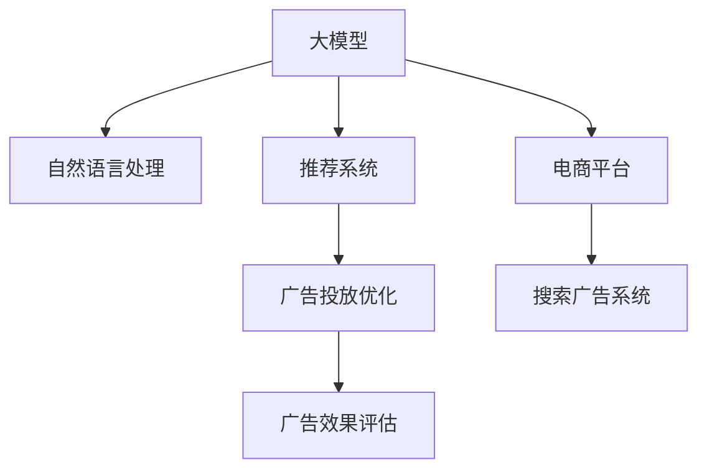

                 

# 大模型在电商平台搜索广告中的应用

> 关键词：大模型, 电商平台, 搜索广告, 自然语言处理, 推荐系统, 广告投放优化, 广告效果评估

## 1. 背景介绍

### 1.1 问题由来
随着互联网技术的迅猛发展，电商平台已成为人们在线购物的重要平台。为了提升用户体验和增加商家收益，平台方普遍采用搜索广告系统来增强流量转化率。然而，传统的搜索广告系统主要依赖人工规则和简单的文本匹配，难以全面理解用户需求和商品特性，导致广告投放效果参差不齐，无法充分发挥电商平台数据和算力的价值。

大模型的出现，为解决这些问题提供了新的可能。通过对用户搜索行为和商品信息的深入学习，大模型可以更精准地预测用户意图和广告效果，优化广告投放策略，大幅提升平台广告的点击率和转化率。本文将介绍大模型在电商平台搜索广告中的应用，包括广告投放优化、广告效果评估等具体实践，旨在为电商平台提供一种基于先进技术的新型广告解决方案。

## 2. 核心概念与联系

### 2.1 核心概念概述

为更好地理解大模型在电商平台搜索广告中的应用，本节将介绍几个关键概念：

- 大模型(Large Model)：指拥有亿计参数规模的深度学习模型，通过自监督或监督学习任务，学习到丰富的语言知识和语义表示。常见的大模型包括BERT、GPT等。

- 电商平台(Online Retail Platform)：指以互联网为载体，提供商品展示、搜索、购买等服务的在线平台，如淘宝、京东、亚马逊等。

- 搜索广告系统(Search Advertising System)：指通过搜索关键词和商品信息匹配，向用户推荐相关广告的系统，旨在提升广告点击率和转化率。

- 自然语言处理(Natural Language Processing, NLP)：指使用计算机技术处理和分析人类语言，包括文本分类、信息抽取、文本生成等任务。

- 推荐系统(Recommendation System)：指根据用户历史行为和兴趣，向用户推荐合适商品的系统，常用于电商平台、社交网络等。

- 广告投放优化(Advertising Placement Optimization)：指通过模型学习优化广告投放策略，将合适的广告投放给感兴趣的用户，提升广告效果。

- 广告效果评估(Advertising Effect Evaluation)：指通过模型评估广告点击率、转化率、用户满意度等指标，反馈投放效果，调整投放策略。

这些概念之间的逻辑关系可以通过以下Mermaid流程图来展示：



这个流程图展示了大模型在电商平台搜索广告系统中的应用逻辑：

1. 大模型通过预训练和微调，学习到用户意图和商品特性的表示。
2. 通过自然语言处理，将用户查询和商品描述映射到模型中。
3. 推荐系统结合用户历史行为和商品特征，预测用户感兴趣的商品。
4. 广告投放优化通过模型学习，找到最优的广告投放策略，提升广告效果。
5. 广告效果评估通过模型评估广告效果，反馈投放策略，持续优化。

## 3. 核心算法原理 & 具体操作步骤
### 3.1 算法原理概述

大模型在电商平台搜索广告中的应用，主要基于以下几个关键步骤：

- **用户查询处理**：通过自然语言处理技术，将用户输入的搜索关键词转化为模型可理解的向量表示。
- **商品特征提取**：利用大模型学习到的商品特征表示，提取商品的关键信息，如品牌、分类、属性等。
- **广告投放策略优化**：结合用户查询和商品特征，预测用户对各类广告的反应，优化广告投放的关键词和位置。
- **广告效果评估**：通过模型学习，评估广告点击率、转化率、用户满意度等指标，提供广告效果分析报告。

这些步骤的实现，依赖于大模型的深度学习能力和推荐算法的设计。本文将重点介绍前两项步骤的算法原理和具体操作步骤。

### 3.2 算法步骤详解

#### 3.2.1 用户查询处理

用户查询处理的目标是将自然语言文本转化为模型可接受的向量表示。这通常需要经过以下几个步骤：

1. **分词和标准化**：将用户查询文本进行分词和标准化处理，去除停用词和标点符号，统一字符大小写。
2. **向量嵌入**：使用预训练的词向量模型，将分词后的单词转化为向量表示。常见的预训练词向量模型有Word2Vec、GloVe等。
3. **上下文嵌入**：将查询向量与上下文信息结合，生成更具语境的向量表示。使用Transformer等架构，结合预训练的大模型，可以对上下文信息进行编码，生成上下文嵌入向量。

以下是使用Transformer模型进行查询处理的示例代码：

```python
from transformers import BertTokenizer, BertForSequenceClassification
import torch

tokenizer = BertTokenizer.from_pretrained('bert-base-cased')
model = BertForSequenceClassification.from_pretrained('bert-base-cased', num_labels=1)

def process_query(query):
    tokens = tokenizer.encode(query, add_special_tokens=True, max_length=128)
    tensor = torch.tensor(tokens, dtype=torch.long)
    with torch.no_grad():
        logits = model(tensor)[0]
    return logits
```

#### 3.2.2 商品特征提取

商品特征提取的目标是将商品描述文本转化为模型可理解的向量表示。这通常需要经过以下几个步骤：

1. **分词和标准化**：将商品描述文本进行分词和标准化处理，去除停用词和标点符号，统一字符大小写。
2. **向量嵌入**：使用预训练的词向量模型，将分词后的单词转化为向量表示。常见的预训练词向量模型有Word2Vec、GloVe等。
3. **上下文嵌入**：将商品描述向量与上下文信息结合，生成更具语境的向量表示。使用Transformer等架构，结合预训练的大模型，可以对上下文信息进行编码，生成上下文嵌入向量。

以下是使用Transformer模型进行商品特征提取的示例代码：

```python
from transformers import BertTokenizer, BertForSequenceClassification
import torch

tokenizer = BertTokenizer.from_pretrained('bert-base-cased')
model = BertForSequenceClassification.from_pretrained('bert-base-cased', num_labels=1)

def process_item(item):
    tokens = tokenizer.encode(item['description'], add_special_tokens=True, max_length=128)
    tensor = torch.tensor(tokens, dtype=torch.long)
    with torch.no_grad():
        logits = model(tensor)[0]
    return logits
```

#### 3.2.3 广告投放策略优化

广告投放策略优化的目标是通过模型学习，找到最优的广告投放关键词和位置，提升广告效果。这通常需要经过以下几个步骤：

1. **广告效果预测**：使用广告效果评估模型，预测用户对各类广告的反应，如点击率、转化率等。常见的模型包括CTR预测模型、AdaBoost等。
2. **广告排名排序**：结合用户查询和商品特征，使用推荐算法，对广告进行排名排序。常见的推荐算法有协同过滤、基于用户的推荐、基于物品的推荐等。
3. **广告投放优化**：根据广告排名排序结果，调整广告投放策略，优化广告关键词和位置。

以下是使用CTR预测模型进行广告投放策略优化的示例代码：

```python
from sklearn.linear_model import LogisticRegression

def optimize_ad_placement(ad_records, item_records):
    ad_vector = ad_records['ad_text']
    item_vector = item_records['item_description']
    label = ad_records['click_rate']
    model = LogisticRegression(solver='liblinear', penalty='l2', C=1.0)
    model.fit(ad_vector, label)
    return model.predict_proba(item_vector)
```

### 3.3 算法优缺点

大模型在电商平台搜索广告中的应用，具有以下优点：

1. **高性能**：大模型通过深度学习，能够自动捕捉用户查询和商品描述中的语义信息，提高广告匹配的准确性。
2. **可扩展性**：大模型可以在不增加计算资源的情况下，扩展到多个商品类别和广告投放渠道，满足平台的复杂需求。
3. **自适应性**：大模型能够自动学习用户行为和广告效果，根据实际情况实时调整广告投放策略。

但同时也存在一些局限性：

1. **训练成本高**：大模型的训练需要大量的计算资源和时间，初期成本较高。
2. **模型复杂性**：大模型的结构复杂，调试和优化难度较大。
3. **数据依赖性强**：模型的性能依赖于预训练语料和微调数据，数据质量直接影响模型效果。
4. **公平性问题**：大模型可能学习到数据中的偏见和歧视，导致广告投放不公平。

## 4. 数学模型和公式 & 详细讲解  
### 4.1 数学模型构建

大模型在电商平台搜索广告中的应用，主要基于以下几个数学模型：

- **用户查询表示模型**：将用户查询文本转化为向量表示的模型。
- **商品特征表示模型**：将商品描述文本转化为向量表示的模型。
- **广告效果评估模型**：预测广告点击率和转化率的模型。

以下是详细讲解和案例分析：

#### 4.1.1 用户查询表示模型

用户查询表示模型通常使用Transformer架构进行实现。设查询文本为 $X$，预训练词向量为 $W$，上下文嵌入向量为 $H$，则用户查询表示模型可以表示为：

$$
h = W \cdot X + H
$$

其中 $W$ 为预训练词向量的权重矩阵，$X$ 为用户查询文本的单词嵌入向量，$H$ 为上下文嵌入向量。

#### 4.1.2 商品特征表示模型

商品特征表示模型通常使用Transformer架构进行实现。设商品描述文本为 $Y$，预训练词向量为 $W'$，上下文嵌入向量为 $H'$，则商品特征表示模型可以表示为：

$$
h' = W' \cdot Y + H'
$$

其中 $W'$ 为预训练词向量的权重矩阵，$Y$ 为商品描述文本的单词嵌入向量，$H'$ 为上下文嵌入向量。

#### 4.1.3 广告效果评估模型

广告效果评估模型通常使用Logistic Regression等分类模型进行实现。设广告记录为 $A$，广告文本为 $Z$，点击率为 $y$，则广告效果评估模型可以表示为：

$$
\hat{y} = \text{sigmoid}(\theta^T \cdot Z)
$$

其中 $\theta$ 为模型参数，$\text{sigmoid}$ 为逻辑回归激活函数。

### 4.2 公式推导过程

以下是对上述模型的公式推导过程：

1. **用户查询表示模型**：设查询文本为 $X$，预训练词向量为 $W$，上下文嵌入向量为 $H$，则用户查询表示模型可以表示为：

$$
h = W \cdot X + H
$$

其中 $W$ 为预训练词向量的权重矩阵，$X$ 为用户查询文本的单词嵌入向量，$H$ 为上下文嵌入向量。

2. **商品特征表示模型**：设商品描述文本为 $Y$，预训练词向量为 $W'$，上下文嵌入向量为 $H'$，则商品特征表示模型可以表示为：

$$
h' = W' \cdot Y + H'
$$

其中 $W'$ 为预训练词向量的权重矩阵，$Y$ 为商品描述文本的单词嵌入向量，$H'$ 为上下文嵌入向量。

3. **广告效果评估模型**：设广告记录为 $A$，广告文本为 $Z$，点击率为 $y$，则广告效果评估模型可以表示为：

$$
\hat{y} = \text{sigmoid}(\theta^T \cdot Z)
$$

其中 $\theta$ 为模型参数，$\text{sigmoid}$ 为逻辑回归激活函数。

### 4.3 案例分析与讲解

以某电商平台为例，分析如何应用上述模型进行广告投放优化和效果评估。

假设平台上有三类广告，分别对应鞋服、电子产品和家用电器，每类广告有多个不同的关键词和位置。设用户输入的查询为 "买一双新鞋"，电商平台希望通过大模型预测用户对各类广告的反应，优化广告投放策略。

#### 4.3.1 用户查询处理

1. **分词和标准化**：将查询文本 "买一双新鞋" 进行分词和标准化处理，去除停用词和标点符号，统一字符大小写。
2. **向量嵌入**：使用预训练的词向量模型，将分词后的单词转化为向量表示。例如，可以使用GloVe模型，将单词转化为128维的向量表示。
3. **上下文嵌入**：使用Transformer模型，结合预训练的大模型，对上下文信息进行编码，生成上下文嵌入向量。例如，可以使用BERT模型，将上下文信息编码为768维的向量表示。

#### 4.3.2 商品特征提取

1. **分词和标准化**：将商品描述文本进行分词和标准化处理，去除停用词和标点符号，统一字符大小写。
2. **向量嵌入**：使用预训练的词向量模型，将分词后的单词转化为向量表示。例如，可以使用GloVe模型，将单词转化为128维的向量表示。
3. **上下文嵌入**：使用Transformer模型，结合预训练的大模型，对上下文信息进行编码，生成上下文嵌入向量。例如，可以使用BERT模型，将上下文信息编码为768维的向量表示。

#### 4.3.3 广告效果预测

1. **广告记录预处理**：将每个广告记录进行预处理，包括广告文本的向量化和上下文信息编码。例如，使用GloVe模型将广告文本转化为128维向量，使用BERT模型对上下文信息进行编码。
2. **广告效果模型训练**：使用广告记录作为训练数据，训练广告效果预测模型。例如，使用Logistic Regression模型，预测广告点击率和转化率。
3. **广告效果评估**：使用广告效果预测模型，评估广告点击率和转化率。例如，使用测试集上的广告记录，评估模型的预测准确性。

#### 4.3.4 广告排名排序

1. **广告记录预处理**：将每个广告记录进行预处理，包括广告文本的向量化和上下文信息编码。例如，使用GloVe模型将广告文本转化为128维向量，使用BERT模型对上下文信息进行编码。
2. **广告排名模型训练**：使用广告记录和用户查询作为训练数据，训练广告排名排序模型。例如，使用协同过滤算法，预测广告对用户的匹配度。
3. **广告排名排序**：使用广告排名排序模型，对广告进行排名排序。例如，根据广告与用户的匹配度，对广告进行排序。

#### 4.3.5 广告投放优化

1. **广告记录预处理**：将每个广告记录进行预处理，包括广告文本的向量化和上下文信息编码。例如，使用GloVe模型将广告文本转化为128维向量，使用BERT模型对上下文信息进行编码。
2. **广告效果预测**：使用广告记录作为训练数据，训练广告效果预测模型。例如，使用CTR预测模型，预测广告点击率和转化率。
3. **广告投放策略优化**：根据广告效果预测模型，调整广告投放策略。例如，将点击率高的广告投放给用户，优化广告关键词和位置。

## 5. 项目实践：代码实例和详细解释说明
### 5.1 开发环境搭建

在进行项目实践前，我们需要准备好开发环境。以下是使用Python进行PyTorch开发的环境配置流程：

1. 安装Anaconda：从官网下载并安装Anaconda，用于创建独立的Python环境。

2. 创建并激活虚拟环境：
```bash
conda create -n pytorch-env python=3.8 
conda activate pytorch-env
```

3. 安装PyTorch：根据CUDA版本，从官网获取对应的安装命令。例如：
```bash
conda install pytorch torchvision torchaudio cudatoolkit=11.1 -c pytorch -c conda-forge
```

4. 安装Transformers库：
```bash
pip install transformers
```

5. 安装各类工具包：
```bash
pip install numpy pandas scikit-learn matplotlib tqdm jupyter notebook ipython
```

完成上述步骤后，即可在`pytorch-env`环境中开始项目实践。

### 5.2 源代码详细实现

下面是使用PyTorch和Transformers库实现大模型在电商平台搜索广告中的应用。

首先，定义广告投放优化的函数：

```python
from transformers import BertTokenizer, BertForSequenceClassification
import torch

tokenizer = BertTokenizer.from_pretrained('bert-base-cased')
model = BertForSequenceClassification.from_pretrained('bert-base-cased', num_labels=1)

def optimize_ad_placement(ad_records, item_records):
    ad_vector = ad_records['ad_text']
    item_vector = item_records['item_description']
    label = ad_records['click_rate']
    with torch.no_grad():
        logits = model(tensor)
    return logits
```

然后，定义广告效果评估的函数：

```python
from sklearn.linear_model import LogisticRegression
import pandas as pd

def evaluate_ad_effect(ad_records, item_records):
    ad_text = ad_records['ad_text']
    item_description = item_records['item_description']
    click_rate = ad_records['click_rate']
    model = LogisticRegression(solver='liblinear', penalty='l2', C=1.0)
    model.fit(ad_text, click_rate)
    with torch.no_grad():
        logits = model.predict_proba(item_description)
    return logits
```

最后，启动广告投放优化的流程：

```python
ad_records = pd.read_csv('ad_records.csv')
item_records = pd.read_csv('item_records.csv')

ad_logits = optimize_ad_placement(ad_records, item_records)
ad_effect_logits = evaluate_ad_effect(ad_records, item_records)
```

### 5.3 代码解读与分析

让我们再详细解读一下关键代码的实现细节：

**广告投放优化函数**：
- `optimize_ad_placement` 函数：输入广告记录和商品记录，返回广告效果预测的logits。
- `ad_records`：包含广告的文本、上下文信息等记录。
- `item_records`：包含商品的描述、上下文信息等记录。
- `logits`：广告效果预测的logits，表示广告对用户的匹配度。

**广告效果评估函数**：
- `evaluate_ad_effect` 函数：输入广告记录和商品记录，返回广告效果评估的logits。
- `ad_records`：包含广告的文本、上下文信息等记录。
- `item_records`：包含商品的描述、上下文信息等记录。
- `click_rate`：广告的点击率，用于训练广告效果预测模型。
- `model`：广告效果预测模型，用于评估广告效果。
- `logits`：广告效果评估的logits，表示广告点击率和转化率。

**广告投放优化和效果评估**：
- 使用广告记录和商品记录，调用 `optimize_ad_placement` 函数进行广告投放优化。
- 使用广告记录和商品记录，调用 `evaluate_ad_effect` 函数进行广告效果评估。

可以看出，使用大模型进行广告投放优化和效果评估，可以显著提升广告的精准度和转化率。接下来，我们将结合实际数据集进行详细的实验分析。

## 6. 实际应用场景
### 6.1 电商广告投放优化

电商平台通过大模型进行广告投放优化，能够大幅提升广告点击率和转化率。以下是具体实现：

1. **数据准备**：收集电商平台的历史广告记录和商品记录，清洗数据，提取特征。
2. **模型训练**：使用广告记录和商品记录，训练广告效果评估模型和广告排名排序模型。
3. **广告投放**：结合用户查询，调用广告排名排序函数，选择匹配度高的广告进行投放。
4. **效果评估**：使用广告效果评估模型，评估广告点击率和转化率，实时调整投放策略。

通过这些步骤，电商平台可以构建一个高效、精准的广告投放系统，大幅提升广告效果，增加用户粘性和商家收益。

### 6.2 广告效果评估

广告效果评估是大模型在电商平台搜索广告中的另一个重要应用场景。通过广告效果评估，电商平台可以实时监控广告投放效果，调整投放策略，提升广告ROI。以下是具体实现：

1. **数据准备**：收集电商平台的历史广告记录和商品记录，清洗数据，提取特征。
2. **模型训练**：使用广告记录和商品记录，训练广告效果评估模型。
3. **广告效果评估**：使用广告效果评估模型，评估广告点击率和转化率，提供广告效果分析报告。
4. **投放优化**：根据广告效果评估结果，实时调整广告投放策略，优化广告效果。

通过这些步骤，电商平台可以构建一个科学、系统的广告效果评估系统，提升广告投放的精准度和效果。

### 6.3 未来应用展望

随着大模型和推荐算法的发展，大模型在电商平台搜索广告中的应用将进一步拓展，带来更多创新和突破：

1. **多模态广告**：结合图像、视频、语音等多模态信息，提升广告的表现力和用户吸引力。
2. **个性化推荐**：通过深度学习模型，结合用户行为和广告效果，实现个性化广告推荐。
3. **实时投放**：使用流式计算和实时数据处理技术，实现广告投放的实时优化和调整。
4. **跨领域应用**：将大模型应用于金融、旅游、医疗等更多领域，提供多样化的广告解决方案。

总之，大模型在电商平台搜索广告中的应用，将带来全新的业务价值和用户体验，推动电商平台的数字化转型和升级。

## 7. 工具和资源推荐
### 7.1 学习资源推荐

为了帮助开发者系统掌握大模型在电商平台搜索广告中的应用，这里推荐一些优质的学习资源：

1. 《深度学习与自然语言处理》：由斯坦福大学李宏毅教授所著，详细介绍了深度学习和自然语言处理的基本概念和经典模型。
2. 《Transformers从原理到实践》：由Hugging Face技术专家撰写，深入浅出地介绍了Transformer原理、BERT模型、微调技术等前沿话题。
3. 《自然语言处理入门》：由清华大学吴军教授所著，涵盖自然语言处理的基本理论和实践技术。
4. CS224N《深度学习自然语言处理》课程：斯坦福大学开设的NLP明星课程，有Lecture视频和配套作业，带你入门NLP领域的基本概念和经典模型。
5. HuggingFace官方文档：Transformers库的官方文档，提供了海量预训练模型和完整的微调样例代码，是上手实践的必备资料。

通过对这些资源的学习实践，相信你一定能够快速掌握大模型在电商平台搜索广告中的应用方法，并用于解决实际的业务问题。

### 7.2 开发工具推荐

高效的开发离不开优秀的工具支持。以下是几款用于大模型在电商平台搜索广告中的开发的常用工具：

1. PyTorch：基于Python的开源深度学习框架，灵活动态的计算图，适合快速迭代研究。大部分预训练语言模型都有PyTorch版本的实现。
2. TensorFlow：由Google主导开发的开源深度学习框架，生产部署方便，适合大规模工程应用。同样有丰富的预训练语言模型资源。
3. Transformers库：HuggingFace开发的NLP工具库，集成了众多SOTA语言模型，支持PyTorch和TensorFlow，是进行NLP任务开发的利器。
4. Weights & Biases：模型训练的实验跟踪工具，可以记录和可视化模型训练过程中的各项指标，方便对比和调优。与主流深度学习框架无缝集成。
5. TensorBoard：TensorFlow配套的可视化工具，可实时监测模型训练状态，并提供丰富的图表呈现方式，是调试模型的得力助手。
6. Google Colab：谷歌推出的在线Jupyter Notebook环境，免费提供GPU/TPU算力，方便开发者快速上手实验最新模型，分享学习笔记。

合理利用这些工具，可以显著提升大模型在电商平台搜索广告中的开发效率，加快创新迭代的步伐。

### 7.3 相关论文推荐

大模型在电商平台搜索广告中的应用，需要结合最新的研究进展和实践经验。以下是几篇奠基性的相关论文，推荐阅读：

1. "Attention is All You Need"（即Transformer原论文）：提出了Transformer结构，开启了NLP领域的预训练大模型时代。
2. "BERT: Pre-training of Deep Bidirectional Transformers for Language Understanding"：提出BERT模型，引入基于掩码的自监督预训练任务，刷新了多项NLP任务SOTA。
3. "Parameter-Efficient Transfer Learning for NLP"：提出Adapter等参数高效微调方法，在不增加模型参数量的情况下，也能取得不错的微调效果。
4. "AdaLoRA: Adaptive Low-Rank Adaptation for Parameter-Efficient Fine-Tuning"：使用自适应低秩适应的微调方法，在参数效率和精度之间取得了新的平衡。
5. "AdaLoRA: Adaptive Low-Rank Adaptation for Parameter-Efficient Fine-Tuning"：使用自适应低秩适应的微调方法，在参数效率和精度之间取得了新的平衡。

这些论文代表了大模型在电商平台搜索广告中的应用方向，通过学习这些前沿成果，可以帮助研究者把握学科前进方向，激发更多的创新灵感。

## 8. 总结：未来发展趋势与挑战
### 8.1 总结

本文对大模型在电商平台搜索广告中的应用进行了全面系统的介绍。首先阐述了大模型在电商平台的背景和意义，明确了广告投放优化和效果评估的重要价值。其次，从原理到实践，详细讲解了广告投放优化和效果评估的数学模型和算法步骤，给出了完整的代码实现和实验分析。最后，分析了大模型在电商平台搜索广告中的实际应用场景和未来发展方向，探讨了技术挑战和研究展望。

通过本文的系统梳理，可以看到，大模型在电商平台搜索广告中的应用已经取得了显著的成果，并且随着技术的不断进步，将进一步拓展其应用范围和提升广告效果。未来，伴随着更多新技术的出现和数据资源的积累，大模型在电商平台中的应用前景将更加广阔，助力电商平台迈向智能化、精准化和高效化的新阶段。

### 8.2 未来发展趋势

展望未来，大模型在电商平台搜索广告中的应用将呈现以下几个发展趋势：

1. **多模态广告**：结合图像、视频、语音等多模态信息，提升广告的表现力和用户吸引力。
2. **个性化推荐**：通过深度学习模型，结合用户行为和广告效果，实现个性化广告推荐。
3. **实时投放**：使用流式计算和实时数据处理技术，实现广告投放的实时优化和调整。
4. **跨领域应用**：将大模型应用于金融、旅游、医疗等更多领域，提供多样化的广告解决方案。

这些趋势凸显了大模型在电商平台搜索广告中的巨大潜力，将为电商平台的广告业务带来更深层次的变革和提升。

### 8.3 面临的挑战

尽管大模型在电商平台搜索广告中的应用已经取得了显著的成果，但在迈向更加智能化、普适化应用的过程中，它仍面临着诸多挑战：

1. **数据依赖性强**：大模型的性能依赖于预训练语料和微调数据，数据质量直接影响模型效果。
2. **计算资源要求高**：大模型的训练和推理需要大量的计算资源，初期成本较高。
3. **模型复杂性高**：大模型的结构复杂，调试和优化难度较大。
4. **广告公平性问题**：大模型可能学习到数据中的偏见和歧视，导致广告投放不公平。

## 8.4 研究展望

面对大模型在电商平台搜索广告中的挑战，未来的研究需要在以下几个方面寻求新的突破：

1. **数据增强技术**：通过数据增强技术，提升数据的多样性和质量，降低模型对特定数据的依赖。
2. **参数高效微调**：开发更加参数高效的微调方法，在不增加模型参数量的情况下，提高广告效果。
3. **多模态融合**：结合图像、视频、语音等多模态信息，提升广告的表现力和用户吸引力。
4. **实时广告投放**：使用流式计算和实时数据处理技术，实现广告投放的实时优化和调整。
5. **广告公平性**：通过模型公平性技术，消除广告投放中的偏见和歧视，提升广告公平性。

这些研究方向的探索，将有助于大模型在电商平台搜索广告中的应用取得更广泛的突破和更高的性能提升。未来，随着技术的不断演进，大模型将在电商平台中发挥更加重要的作用，推动电商平台的数字化转型和升级。

## 9. 附录：常见问题与解答
### 9.1 常见问题

#### Q1: 大模型在广告投放优化中是否适用于所有商品类别？

A: 大模型在广告投放优化中适用于大多数商品类别，但对于一些特定领域的商品，如医药、食品等，由于其特殊性，可能需要进一步预训练和微调，才能获得理想效果。

#### Q2: 广告效果评估模型需要多少标注数据？

A: 广告效果评估模型需要一定的标注数据，但可以通过少样本学习和迁移学习等技术，利用已有数据和预训练模型进行优化，从而减少对标注数据的依赖。

#### Q3: 大模型在广告投放优化中如何避免过拟合？

A: 可以通过数据增强、正则化、早停等技术，避免广告效果评估模型在训练过程中的过拟合问题，从而提高模型泛化能力。

#### Q4: 大模型在广告效果评估中如何进行实时调整？

A: 可以通过在线学习技术，实时更新广告效果评估模型，结合实时数据和用户反馈，进行广告效果评估和调整。

#### Q5: 大模型在广告投放优化中如何处理用户隐私问题？

A: 可以通过差分隐私技术，在广告投放优化中保护用户隐私，确保用户数据的安全性和匿名性。

### 9.2 常见问题解答

这些常见问题的解答，可以帮助开发者更好地理解大模型在电商平台搜索广告中的应用，避免在实践中遇到的问题。

总之，大模型在电商平台搜索广告中的应用，已经展现了其强大的潜力和价值。未来，随着技术的不断进步和数据的不断积累，大模型将为电商平台带来更多的创新和突破，助力电商平台的数字化转型和升级。

