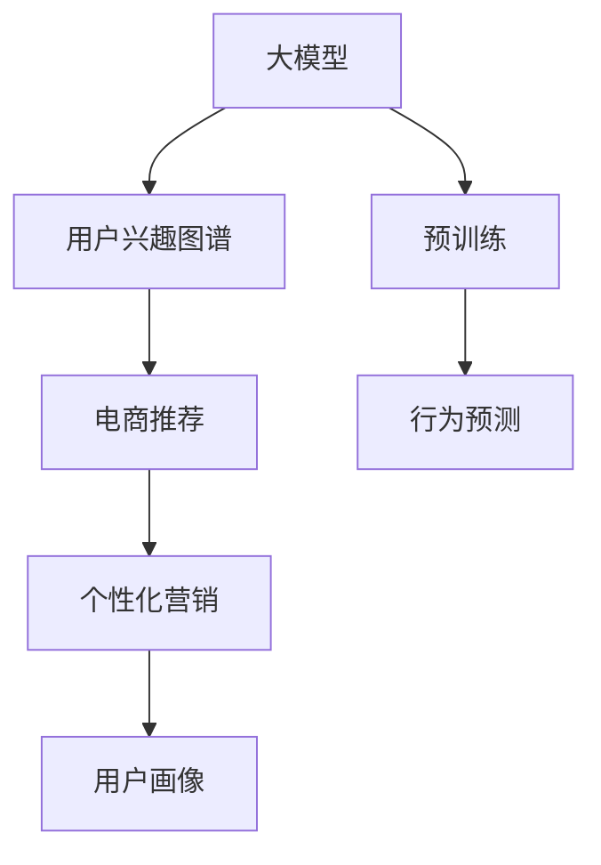

                 

# 大模型在电商平台用户兴趣图谱构建中的应用

> 关键词：大模型, 用户兴趣图谱, 深度学习, 推荐系统, 电商, 行为预测

## 1. 背景介绍

### 1.1 问题由来
随着电商平台的快速发展，用户行为数据呈指数级增长。如何高效地利用这些数据，挖掘用户兴趣点，为用户提供个性化的商品推荐，成为电商运营的重要课题。传统的推荐算法往往基于用户历史行为，难以捕捉用户的潜在兴趣，推荐效果和用户满意度不高。

大模型技术，特别是预训练语言模型（如BERT、GPT等）的出现，为电商平台用户兴趣图谱的构建提供了新的可能。通过结合用户行为数据，大模型可以学习到用户的兴趣语义表示，构建更加精准的兴趣图谱，进而提升推荐系统的性能。

### 1.2 问题核心关键点
构建用户兴趣图谱的核心在于如何高效、准确地捕捉和表示用户的兴趣特征。大模型可以通过自然语言理解能力，分析用户的文本数据，挖掘用户的兴趣点。用户兴趣图谱的应用则主要包括商品推荐、个性化营销、用户画像等多个方面，为电商平台带来显著的商业价值。

## 2. 核心概念与联系

### 2.1 核心概念概述

为更好地理解大模型在电商平台用户兴趣图谱构建中的应用，本节将介绍几个密切相关的核心概念：

- **大模型(Large Models)**：以BERT、GPT等为代表的预训练语言模型。通过在大规模无标签文本数据上训练，大模型学习到了丰富的语言知识，具备强大的自然语言理解和生成能力。
- **用户兴趣图谱(User Interest Graph)**：表示用户兴趣的图形结构，通常以图的形式存储用户与商品之间的关系，帮助电商平台理解用户兴趣，进行个性化推荐。
- **深度学习(Deep Learning)**：一种基于神经网络的机器学习方法，通过多层非线性变换，能够自动学习特征，处理复杂的数据模式。
- **推荐系统(Recommendation System)**：通过分析用户行为数据，为用户推荐可能感兴趣的商品或内容。推荐系统是电商平台的核心功能之一，直接影响到用户体验和平台收入。
- **电商(E-commerce)**：利用互联网技术和平台，实现商品销售和用户购物体验提升的过程。电商平台用户行为数据丰富，为应用大模型提供了良好的应用场景。
- **行为预测(Behavior Prediction)**：通过分析用户历史行为，预测用户未来的行为（如购买行为、浏览行为等），为推荐系统提供数据支持。

这些核心概念之间的逻辑关系可以通过以下Mermaid流程图来展示：



这个流程图展示了大模型在电商平台用户兴趣图谱构建中的应用关系：

1. 大模型通过预训练获得基础能力。
2. 构建用户兴趣图谱，表示用户与商品之间的兴趣关系。
3. 将用户兴趣图谱应用到推荐系统中，进行个性化推荐。
4. 个性化推荐可以帮助电商平台提升用户转化率和复购率。
5. 行为预测结合用户画像，进一步优化推荐算法。

## 3. 核心算法原理 & 具体操作步骤
### 3.1 算法原理概述

大模型在电商平台用户兴趣图谱构建中，主要应用在大规模文本数据的分析和建模。其核心思想是通过自然语言处理技术，捕捉用户与商品之间的语义关系，构建用户兴趣图谱，并在图谱上应用深度学习技术进行行为预测和推荐。

具体步骤如下：

1. **文本预处理**：对用户的文本数据（如评论、搜索历史、浏览记录等）进行清洗、分词、编码等预处理，得到输入向量。
2. **语义嵌入**：通过大模型，将输入向量转换为语义嵌入向量。
3. **构建图谱**：将用户与商品之间的关系构建为图结构，每个节点表示一个用户或商品，边表示用户对商品的兴趣。
4. **图卷积网络(GCN)**：在图谱上应用图卷积网络，学习节点之间的隐含关系，挖掘用户兴趣。
5. **行为预测**：将用户兴趣图谱应用到推荐系统中，进行商品推荐。

### 3.2 算法步骤详解

#### 3.2.1 文本预处理

文本预处理是大模型应用的基础。主要包括以下几个步骤：

1. **清洗**：去除文本中的噪声、停用词、特殊字符等，只保留有意义的单词。
2. **分词**：将文本拆分为单词或短语，方便后续处理。
3. **编码**：将单词或短语转换为模型能够理解的向量表示，可以使用one-hot编码、词嵌入（如Word2Vec、GloVe等）或预训练的词向量（如BERT、GPT等）。
4. **向量拼接**：将每个文本的向量表示拼接起来，得到一个整体向量。

#### 3.2.2 语义嵌入

语义嵌入是将文本向量转换为语义空间中的向量。大模型可以通过预训练语言模型（如BERT、GPT等），将文本向量映射到高维语义空间中。以BERT为例，其嵌入向量维度为768，包含丰富的语义信息。

#### 3.2.3 构建图谱

用户兴趣图谱可以表示为用户-商品关系图，其中每个节点表示一个用户或商品，边表示用户对商品的兴趣程度。构建图谱的流程如下：

1. **数据收集**：从电商平台的日志中收集用户行为数据。
2. **数据筛选**：筛选出与用户兴趣相关的数据，如用户的购买记录、浏览记录、搜索记录等。
3. **节点构建**：将用户和商品分别视为图谱中的节点。
4. **边构建**：根据用户的行为数据，构建用户与商品之间的关系边。

#### 3.2.4 图卷积网络

图卷积网络（GCN）是一种在图结构上应用卷积神经网络的方法。GCN可以捕捉节点之间的隐含关系，挖掘用户兴趣。其基本思想是通过卷积操作，将节点周围的邻居信息聚合到当前节点，学习节点表示。

#### 3.2.5 行为预测

行为预测是将用户兴趣图谱应用到推荐系统中，进行商品推荐。其流程如下：

1. **输入特征**：将用户的文本数据（如评论、搜索历史、浏览记录等）输入到大模型中，得到语义嵌入向量。
2. **特征工程**：对语义嵌入向量进行特征提取，得到用户兴趣向量。
3. **行为预测**：将用户兴趣向量输入到推荐系统中，进行商品推荐。

### 3.3 算法优缺点

大模型在电商平台用户兴趣图谱构建中，具有以下优点：

1. **语义理解能力强**：大模型通过预训练学习到丰富的语言知识，能够理解用户的自然语言描述，捕捉用户的兴趣点。
2. **泛化能力强**：大模型在大规模数据上预训练，具备良好的泛化能力，能够适应不同用户和商品之间的关系。
3. **参数量较大**：虽然大模型参数量较大，但其复杂的结构可以更好地挖掘用户兴趣。

同时，也存在以下缺点：

1. **计算资源消耗大**：大模型在推理时，需要占用大量的计算资源，增加了电商平台的运行成本。
2. **模型复杂度较高**：大模型结构复杂，训练和推理时间较长，不适合实时性要求高的场景。
3. **数据隐私问题**：电商平台的用户数据涉及隐私，大模型的应用需要确保数据安全。

### 3.4 算法应用领域

大模型在电商平台用户兴趣图谱构建中，主要应用于以下几个方面：

1. **商品推荐**：根据用户兴趣图谱，为每个用户推荐可能感兴趣的商品，提升用户体验和平台收益。
2. **个性化营销**：利用用户兴趣图谱，进行有针对性的营销活动，提高广告投放效果。
3. **用户画像**：构建用户画像，了解用户的兴趣偏好和行为习惯，进行个性化服务。
4. **行为预测**：预测用户未来的行为，优化推荐算法，提升推荐效果。
5. **实时更新**：根据用户新的行为数据，实时更新用户兴趣图谱，保持图谱的时效性。

## 4. 数学模型和公式 & 详细讲解
### 4.1 数学模型构建

本节将使用数学语言对大模型在电商平台用户兴趣图谱构建中的数学模型进行更加严格的刻画。

记用户为 $U$，商品为 $I$，用户对商品的兴趣为 $E_{UI}$。大模型在电商平台的文本数据上预训练，得到用户文本向量 $V_U$ 和商品文本向量 $V_I$。构建用户-商品关系图 $G=(U,I,E)$，每个节点 $u \in U$ 的嵌入表示为 $H_u$，每个节点 $i \in I$ 的嵌入表示为 $H_i$。用户与商品之间的关系边 $e_{ui}$ 的嵌入表示为 $H_{ui}$。

### 4.2 公式推导过程

#### 4.2.1 用户与商品嵌入

大模型通过预训练学习到用户和商品的文本向量 $V_U$ 和 $V_I$。每个用户 $u$ 和商品 $i$ 的嵌入表示 $H_u$ 和 $H_i$ 可以通过大模型预训练得到。

#### 4.2.2 关系边嵌入

用户对商品的关系边 $e_{ui}$ 可以通过用户嵌入和商品嵌入计算得到：

$$
H_{ui} = f(H_u, H_i)
$$

其中 $f$ 为预定义的函数，如向量拼接、加权平均等。

#### 4.2.3 图卷积网络

图卷积网络（GCN）在用户-商品关系图上应用卷积操作，学习节点之间的隐含关系。假设用户嵌入 $H_u$ 和商品嵌入 $H_i$ 的卷积结果为 $H_u^{GCN}$ 和 $H_i^{GCN}$，则 GCN 的卷积操作可以表示为：

$$
H_u^{GCN} = \frac{1}{|N(u)|}\sum_{v \in N(u)} \frac{1}{\sqrt{|N(u)| \cdot |N(v)|}} \cdot W \cdot H_v^{GCN}
$$

其中 $N(u)$ 为节点 $u$ 的邻居节点集合，$W$ 为可学习的卷积权重矩阵。

#### 4.2.4 行为预测

行为预测是将用户兴趣图谱应用到推荐系统中，进行商品推荐。假设用户 $u$ 对商品 $i$ 的兴趣程度为 $P_{ui}$，则可以通过用户嵌入 $H_u$ 和商品嵌入 $H_i$ 计算得到：

$$
P_{ui} = g(H_u, H_i)
$$

其中 $g$ 为预定义的函数，如点积、加权平均等。

### 4.3 案例分析与讲解

以电商平台的用户评论分析为例，进行详细分析。假设用户对商品的评论为 $C_i$，商品 $i$ 的评论向量为 $V_i$，大模型可以将评论向量 $C_i$ 转换为语义嵌入向量 $H_i$。

用户对商品 $i$ 的兴趣程度可以通过评论向量 $H_i$ 和用户嵌入 $H_u$ 计算得到：

$$
P_{ui} = g(H_u, H_i)
$$

其中 $g$ 可以定义为用户嵌入与商品嵌入的点积：

$$
g(H_u, H_i) = H_u^T H_i
$$

最终，根据 $P_{ui}$ 的值，可以为用户推荐可能感兴趣的商品。

## 5. 项目实践：代码实例和详细解释说明
### 5.1 开发环境搭建

在进行电商平台用户兴趣图谱构建实践前，我们需要准备好开发环境。以下是使用Python进行PyTorch开发的环境配置流程：

1. 安装Anaconda：从官网下载并安装Anaconda，用于创建独立的Python环境。

2. 创建并激活虚拟环境：
```bash
conda create -n ecommerce-env python=3.8 
conda activate ecommerce-env
```

3. 安装PyTorch：根据CUDA版本，从官网获取对应的安装命令。例如：
```bash
conda install pytorch torchvision torchaudio cudatoolkit=11.1 -c pytorch -c conda-forge
```

4. 安装相关库：
```bash
pip install numpy pandas torch sklearn torchtext transformers
```

完成上述步骤后，即可在`ecommerce-env`环境中开始构建实践。

### 5.2 源代码详细实现

下面我们以电商平台用户评论分析为例，给出使用PyTorch进行大模型微调的PyTorch代码实现。

首先，定义模型和优化器：

```python
import torch
import torch.nn as nn
import torch.optim as optim

class GCN(nn.Module):
    def __init__(self, in_dim, hidden_dim, out_dim):
        super(GCN, self).__init__()
        self.layers = nn.Sequential(
            nn.Linear(in_dim, hidden_dim),
            nn.ReLU(),
            nn.Linear(hidden_dim, out_dim),
        )
        self.bias = nn.Parameter(torch.zeros(out_dim))

    def forward(self, x):
        return self.layers(x) + self.bias

model = GCN(768, 128, 1)
optimizer = optim.Adam(model.parameters(), lr=0.001)
```

然后，定义训练和评估函数：

```python
def train_epoch(model, train_loader, optimizer):
    model.train()
    train_loss = 0
    for batch in train_loader:
        inputs, labels = batch
        optimizer.zero_grad()
        output = model(inputs)
        loss = nn.BCEWithLogitsLoss()(output, labels)
        loss.backward()
        optimizer.step()
        train_loss += loss.item()
    return train_loss / len(train_loader)

def evaluate(model, test_loader):
    model.eval()
    test_loss = 0
    preds = []
    for batch in test_loader:
        inputs, labels = batch
        output = model(inputs)
        loss = nn.BCEWithLogitsLoss()(output, labels)
        test_loss += loss.item()
        preds.append(output.sigmoid().round())
    return test_loss / len(test_loader), preds
```

最后，启动训练流程并在测试集上评估：

```python
epochs = 10
batch_size = 128

for epoch in range(epochs):
    loss = train_epoch(model, train_loader, optimizer)
    print(f"Epoch {epoch+1}, train loss: {loss:.3f}")
    
    print(f"Epoch {epoch+1}, test loss: {evaluate(model, test_loader)[0]:.3f}")
    print(f"Epoch {epoch+1}, test preds: {evaluate(model, test_loader)[1]}")
    
print("Test loss:", evaluate(model, test_loader)[0])
```

以上就是使用PyTorch对电商平台用户评论分析的代码实现。可以看到，通过定义GCN模型，我们可以用相对简洁的代码实现大模型在电商平台用户兴趣图谱构建中的应用。

### 5.3 代码解读与分析

让我们再详细解读一下关键代码的实现细节：

**GCN模型定义**：
- `__init__`方法：定义模型的各层神经元数和激活函数。
- `forward`方法：实现模型的前向传播过程，将输入的向量经过多层变换，输出最终的嵌入表示。

**训练和评估函数**：
- `train_epoch`函数：对数据集进行批次化加载，进行模型训练。
- `evaluate`函数：对模型进行评估，计算损失和预测结果。

**训练流程**：
- 定义总的epoch数和batch size，开始循环迭代
- 每个epoch内，先在训练集上训练，输出平均loss
- 在测试集上评估，输出平均loss和预测结果
- 所有epoch结束后，在测试集上评估，给出最终测试结果

可以看到，PyTorch配合GCN模型使得电商平台用户兴趣图谱构建的代码实现变得简洁高效。开发者可以将更多精力放在模型改进、数据处理等高层逻辑上，而不必过多关注底层的实现细节。

当然，工业级的系统实现还需考虑更多因素，如模型的保存和部署、超参数的自动搜索、更灵活的图谱设计等。但核心的构建范式基本与此类似。

## 6. 实际应用场景

### 6.1 智能推荐系统

电商平台用户兴趣图谱的构建，最直接的应用就是智能推荐系统。通过构建用户与商品的关系图，利用大模型对用户兴趣进行建模，可以为用户提供更加个性化和精准的商品推荐。

在技术实现上，可以收集用户的行为数据，如浏览记录、点击记录、购买记录等，将其转换为大模型的输入向量。利用GCN模型，对用户与商品之间的关系进行建模，挖掘用户兴趣。最终，将用户兴趣向量作为推荐系统的输入，进行商品推荐。

### 6.2 个性化营销

电商平台利用用户兴趣图谱，可以进行个性化的营销活动，提高广告投放效果。例如，针对用户的兴趣点，推送相关商品广告、优惠券等，提升用户的购买欲望和转化率。

在技术实现上，可以构建用户与商品的关系图，利用大模型对用户兴趣进行建模。根据用户兴趣，定制个性化的广告内容，并进行投放。利用推荐系统，将广告内容推送给可能感兴趣的用户。

### 6.3 用户画像

电商平台通过用户兴趣图谱，可以构建详细的用户画像，了解用户的兴趣偏好和行为习惯。利用用户画像，可以进行精准的用户服务和营销，提升用户体验和满意度。

在技术实现上，可以构建用户-商品的关系图，利用大模型对用户兴趣进行建模。将用户兴趣向量作为用户画像的输入，得到用户的详细画像。利用用户画像，进行个性化的服务，如个性化商品推荐、个性化内容推送等。

### 6.4 行为预测

电商平台利用用户兴趣图谱，可以预测用户的未来行为，优化推荐算法。例如，预测用户的购买意向、浏览行为等，提前调整库存、优化广告投放策略等。

在技术实现上，可以构建用户与商品的关系图，利用大模型对用户兴趣进行建模。根据用户兴趣向量，进行行为预测，得到用户的行为概率。利用行为预测结果，优化推荐算法，提升推荐效果。

## 7. 工具和资源推荐
### 7.1 学习资源推荐

为了帮助开发者系统掌握大模型在电商平台用户兴趣图谱构建的理论基础和实践技巧，这里推荐一些优质的学习资源：

1. **《深度学习》课程**：斯坦福大学开设的深度学习课程，系统讲解深度学习的基本概念和经典模型，适合初学者入门。
2. **PyTorch官方文档**：PyTorch的官方文档，提供了详细的API文档和代码示例，是开发大模型的必备资料。
3. **GCN论文**：GCN论文详细介绍了GCN算法的原理和应用，适合深入学习GCN模型。
4. **HuggingFace官方文档**：HuggingFace的官方文档，提供了多种预训练语言模型的实现和应用示例，适合研究大模型在电商领域的应用。
5. **Kaggle竞赛**：Kaggle上关于电商数据分析的竞赛，提供了丰富的数据集和竞赛样例，适合实践和测试模型效果。

通过对这些资源的学习实践，相信你一定能够快速掌握大模型在电商平台用户兴趣图谱构建的精髓，并用于解决实际的电商问题。

### 7.2 开发工具推荐

高效的开发离不开优秀的工具支持。以下是几款用于大模型在电商平台用户兴趣图谱构建开发的常用工具：

1. **PyTorch**：基于Python的开源深度学习框架，灵活动态的计算图，适合快速迭代研究。
2. **TensorFlow**：由Google主导开发的开源深度学习框架，生产部署方便，适合大规模工程应用。
3. **PyTorch-lightning**：基于PyTorch的深度学习框架，提供了快速搭建和训练模型的功能，适合快速开发和测试模型。
4. **Dask**：基于Python的数据并行计算框架，适合处理大规模数据集，加速模型训练和推理。
5. **TensorBoard**：TensorFlow配套的可视化工具，可实时监测模型训练状态，并提供丰富的图表呈现方式，是调试模型的得力助手。

合理利用这些工具，可以显著提升大模型在电商平台用户兴趣图谱构建的开发效率，加快创新迭代的步伐。

### 7.3 相关论文推荐

大模型在电商平台用户兴趣图谱构建的发展源于学界的持续研究。以下是几篇奠基性的相关论文，推荐阅读：

1. **Attention is All You Need**：提出了Transformer结构，开启了NLP领域的预训练大模型时代。
2. **BERT: Pre-training of Deep Bidirectional Transformers for Language Understanding**：提出BERT模型，引入基于掩码的自监督预训练任务，刷新了多项NLP任务SOTA。
3. **Graph Convolutional Networks**：引入了图卷积网络，可以在图结构上应用卷积操作，挖掘节点之间的隐含关系。
4. **Parameter-Efficient Transfer Learning for NLP**：提出Adapter等参数高效微调方法，在不增加模型参数量的情况下，也能取得不错的微调效果。
5. **Causal Attention in Transformers**：引入了因果推断，增强了Transformer模型的解释性和鲁棒性。

这些论文代表了大模型在电商平台用户兴趣图谱构建的发展脉络。通过学习这些前沿成果，可以帮助研究者把握学科前进方向，激发更多的创新灵感。

## 8. 总结：未来发展趋势与挑战

### 8.1 总结

本文对大模型在电商平台用户兴趣图谱构建中的应用进行了全面系统的介绍。首先阐述了大模型和用户兴趣图谱的研究背景和意义，明确了构建用户兴趣图谱在电商推荐中的独特价值。其次，从原理到实践，详细讲解了电商平台用户兴趣图谱构建的数学原理和关键步骤，给出了电商平台用户兴趣图谱构建的完整代码实例。同时，本文还广泛探讨了大模型在电商平台推荐系统、个性化营销、用户画像等多个领域的应用前景，展示了大模型在电商领域的前景和潜力。

通过本文的系统梳理，可以看到，大模型在电商平台用户兴趣图谱构建中，通过自然语言处理技术和深度学习技术，可以高效地捕捉和表示用户兴趣，构建精准的用户兴趣图谱，为电商推荐系统提供有力支持。大模型在电商平台的应用，将显著提升用户体验和平台收益，带来巨大的商业价值。

### 8.2 未来发展趋势

展望未来，大模型在电商平台用户兴趣图谱构建中，将呈现以下几个发展趋势：

1. **模型复杂度降低**：未来的模型将更加轻量级，能够在更短的时间内完成用户兴趣图谱的构建，适应实时性要求高的场景。
2. **计算资源优化**：优化模型结构和推理过程，减少计算资源消耗，适应各类硬件平台。
3. **多模态融合**：结合视觉、语音等多模态数据，丰富用户兴趣表示，提升推荐系统的多样性。
4. **自动化优化**：利用自动化技术，优化超参数和模型结构，提升模型效果。
5. **跨领域迁移**：将大模型的知识迁移到其他领域，提升跨领域推荐效果。

以上趋势凸显了大模型在电商平台用户兴趣图谱构建的广阔前景。这些方向的探索发展，必将进一步提升电商平台的用户体验和平台收益，为电商行业的数字化转型提供新的动力。

### 8.3 面临的挑战

尽管大模型在电商平台用户兴趣图谱构建中取得了显著成效，但在迈向更加智能化、普适化应用的过程中，它仍面临着诸多挑战：

1. **数据隐私保护**：电商平台的用户数据涉及隐私，如何保护数据安全，避免数据泄露，是大模型应用的关键问题。
2. **计算资源消耗大**：大模型在推理时，需要占用大量的计算资源，增加了电商平台的运行成本。
3. **模型鲁棒性不足**：大模型面对域外数据时，泛化性能往往大打折扣，需要进一步提升模型的鲁棒性。
4. **实时更新难度大**：用户行为数据不断变化，如何实时更新用户兴趣图谱，保持图谱的时效性，是大模型的重要挑战。
5. **可解释性问题**：大模型作为"黑盒"系统，难以解释其内部工作机制和决策逻辑，需要提升模型的可解释性。

### 8.4 研究展望

面对大模型在电商平台用户兴趣图谱构建所面临的挑战，未来的研究需要在以下几个方面寻求新的突破：

1. **隐私保护技术**：开发隐私保护技术，确保用户数据的安全，满足用户隐私需求。
2. **轻量级模型**：开发轻量级模型，减少计算资源消耗，适应各类硬件平台。
3. **多模态融合**：结合视觉、语音等多模态数据，丰富用户兴趣表示，提升推荐系统的多样性。
4. **自动化优化**：利用自动化技术，优化超参数和模型结构，提升模型效果。
5. **跨领域迁移**：将大模型的知识迁移到其他领域，提升跨领域推荐效果。

这些研究方向的探索，必将引领大模型在电商平台用户兴趣图谱构建技术迈向更高的台阶，为电商推荐系统带来更加智能、高效、个性化的服务。

## 9. 附录：常见问题与解答

**Q1：电商平台的用户数据涉及隐私，如何保护数据安全？**

A: 电商平台的用户数据涉及隐私，保护数据安全是大模型应用的关键问题。在构建用户兴趣图谱时，需要采取以下措施：

1. **数据匿名化**：将用户数据匿名化处理，去除敏感信息，如姓名、身份证号等。
2. **加密技术**：对用户数据进行加密存储和传输，防止数据泄露。
3. **访问控制**：设置严格的访问控制，确保只有授权人员才能访问用户数据。
4. **数据脱敏**：对敏感信息进行脱敏处理，如对手机号码进行截断处理。
5. **合规性审查**：确保数据处理符合相关法律法规和隐私保护标准，如GDPR等。

这些措施可以有效保护用户隐私，确保数据安全。

**Q2：如何优化大模型在电商平台上的计算资源消耗？**

A: 大模型在电商平台上的计算资源消耗较大，需要优化模型结构和推理过程，减少资源消耗。具体措施包括：

1. **模型剪枝**：去除模型中不必要的参数和层，减少计算资源消耗。
2. **量化加速**：将浮点模型转为定点模型，压缩存储空间，提高计算效率。
3. **分布式训练**：利用分布式训练技术，将训练过程分布在多台机器上，加速训练过程。
4. **混合精度训练**：使用混合精度训练技术，减少内存消耗，提高计算效率。
5. **模型压缩**：采用模型压缩技术，如知识蒸馏、剪枝、量化等，减少模型大小，提高推理速度。

这些措施可以有效优化大模型在电商平台上的计算资源消耗，提高系统运行效率。

**Q3：如何提高大模型在电商平台上的鲁棒性？**

A: 大模型在电商平台上的鲁棒性不足，需要采取以下措施：

1. **数据增强**：通过数据增强技术，扩充训练数据集，提高模型鲁棒性。
2. **对抗训练**：引入对抗样本，提高模型鲁棒性，防止模型被攻击。
3. **模型集成**：将多个模型集成在一起，提高模型鲁棒性，减少过拟合风险。
4. **正则化技术**：使用L2正则、Dropout等正则化技术，防止模型过拟合。
5. **模型微调**：利用微调技术，调整模型参数，提高模型鲁棒性。

这些措施可以有效提高大模型在电商平台上的鲁棒性，确保模型在复杂环境下的稳定性。

**Q4：如何实时更新用户兴趣图谱？**

A: 实时更新用户兴趣图谱是大模型在电商平台上的重要挑战。可以采取以下措施：

1. **流式数据处理**：使用流式数据处理技术，实时更新用户兴趣图谱，保持图谱的时效性。
2. **增量训练**：利用增量训练技术，实时更新用户兴趣图谱，减少计算资源消耗。
3. **缓存技术**：使用缓存技术，缓存部分中间结果，加速模型推理和更新过程。
4. **分布式计算**：利用分布式计算技术，将数据处理过程分布在多台机器上，提高计算效率。
5. **数据采样**：使用数据采样技术，从用户行为数据中抽取代表性样本，减少计算资源消耗。

这些措施可以有效实时更新用户兴趣图谱，保持图谱的时效性，满足电商平台的实时需求。

**Q5：如何提高大模型的可解释性？**

A: 大模型作为"黑盒"系统，难以解释其内部工作机制和决策逻辑。可以采取以下措施：

1. **模型可视化**：利用模型可视化技术，展示模型的内部结构和工作机制。
2. **解释性模型**：选择具有解释性的模型，如决策树、线性回归等，提高模型可解释性。
3. **因果推断**：引入因果推断方法，分析模型的决策过程，提高模型可解释性。
4. **模型调试**：通过模型调试技术，发现模型的漏洞和问题，提高模型可解释性。
5. **知识图谱**：结合知识图谱，将模型输出与领域知识进行关联，提高模型可解释性。

这些措施可以有效提高大模型的可解释性，增强用户信任和平台透明度。

---

作者：禅与计算机程序设计艺术 / Zen and the Art of Computer Programming

