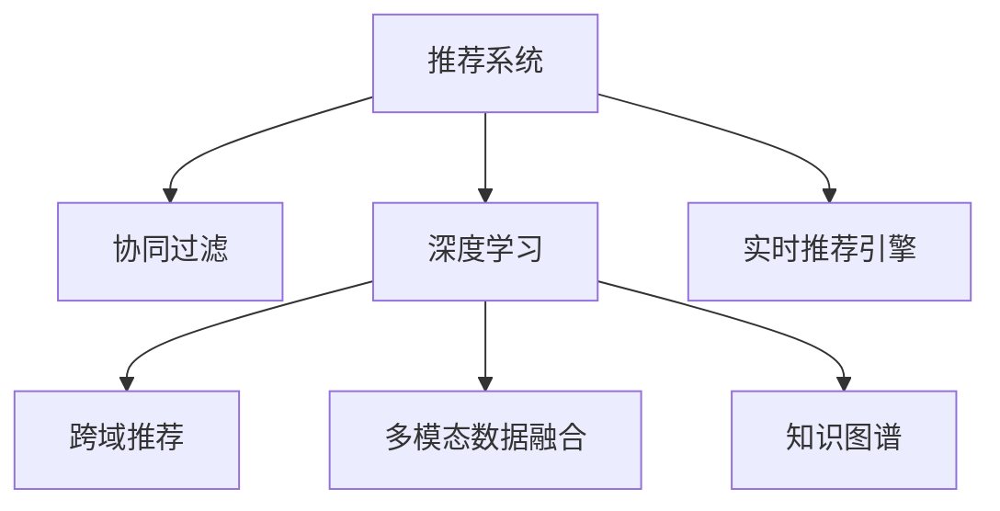

                 

# 大模型在跨域推荐中的应用

> 关键词：大模型, 跨域推荐, 深度学习, 协同过滤, 自适应推荐

## 1. 背景介绍

### 1.1 问题由来

推荐系统是互联网时代最重要的技术之一，广泛应用于电商、社交、视频等平台。传统的推荐系统主要基于用户历史行为进行协同过滤，推荐用户可能感兴趣的新物品。然而，协同过滤依赖于用户历史行为数据，数据稀疏、冷启动等问题难以解决。同时，传统推荐系统难以理解用户隐式反馈，如评论、点赞等，导致推荐结果准确性有限。

近年来，深度学习技术在推荐系统中大放异彩，如基于深度神经网络的用户兴趣模型。深度学习模型具备强大的表示能力，可以从用户行为数据中提取高层次的抽象特征，并处理用户的隐式反馈信息，从而提供更加精准的推荐结果。然而，深度学习模型通常需要大量标注数据进行训练，对于某些垂直领域或细分场景，难以获得充足的标注数据，导致模型的泛化能力有限。

针对上述问题，跨域推荐方法应运而生。跨域推荐系统不仅考虑用户的历史行为，还能综合利用不同领域、不同平台的推荐数据，提升推荐结果的多样性和精度。跨域推荐系统通过构建多模态的知识图谱、异构数据融合等手段，融合用户多源数据，构建更加全面的用户兴趣表示，实现跨领域、跨平台的推荐。

本文将详细介绍大模型在跨域推荐系统中的应用，通过构建基于深度学习的大模型推荐框架，实现多源数据的融合与推荐，全面提升推荐系统的性能。

### 1.2 问题核心关键点

跨域推荐的核心在于如何综合利用多源数据，构建一个能够理解不同领域用户兴趣的模型。具体的关键点包括：

1. 多源数据融合：将不同领域、不同平台的用户数据融合在一起，构建一个统一的用户画像。
2. 大模型表示：使用深度学习模型对用户多源数据进行表示，提取用户兴趣的多层次特征。
3. 模型联合训练：将跨域推荐系统的大模型与推荐算法联合训练，实现跨域推荐。
4. 实时推荐引擎：构建高效的推荐引擎，实时响应用户请求，实现高效推荐。

## 2. 核心概念与联系

### 2.1 核心概念概述

为更好地理解大模型在跨域推荐系统中的应用，本节将介绍几个密切相关的核心概念：

- 推荐系统(Recommendation System)：根据用户的历史行为和兴趣，为用户推荐感兴趣的物品。传统的推荐系统主要有基于内容的推荐、协同过滤等方法。
- 协同过滤(Collaborative Filtering)：通过分析用户之间的相似度，推测用户可能喜欢的物品。分为基于用户的协同过滤和基于物品的协同过滤。
- 深度学习(Deep Learning)：通过多层神经网络对输入数据进行建模，学习数据的高层次特征表示。深度学习在推荐系统中主要有基于用户兴趣的模型、基于物品特征的模型等。
- 跨域推荐(Cross-Domain Recommendation)：利用不同领域、不同平台的用户数据，构建统一的用户画像，实现跨领域、跨平台的推荐。
- 多模态数据融合(Multimodal Data Fusion)：将不同类型的数据（如文本、图像、音频等）进行融合，构建一个更加全面的数据表示。
- 知识图谱(Knowledge Graph)：通过构建实体、关系、属性等组成的知识图谱，提供丰富而精细的知识表示。
- 实时推荐引擎(Real-time Recommendation Engine)：构建高效的推荐引擎，实时响应用户请求，提供个性化的推荐服务。

这些核心概念之间的逻辑关系可以通过以下Mermaid流程图来展示：



这个流程图展示了大模型在跨域推荐系统中的核心概念及其之间的关系：

1. 推荐系统通过分析用户历史行为，为用户推荐物品。
2. 协同过滤通过分析用户之间的相似度，推测用户可能喜欢的物品。
3. 深度学习利用神经网络对输入数据进行建模，学习用户兴趣的多层次特征。
4. 跨域推荐利用不同领域、不同平台的用户数据，构建统一的用户画像。
5. 多模态数据融合将不同类型的数据进行融合，构建更加全面的数据表示。
6. 知识图谱提供丰富而精细的知识表示，用于增强推荐模型的理解能力。
7. 实时推荐引擎构建高效的推荐引擎，实时响应用户请求，提供个性化的推荐服务。

这些概念共同构成了跨域推荐系统的技术框架，使得大模型能够在推荐领域发挥其强大的表示能力和泛化能力，实现多源数据的融合与推荐。

## 3. 核心算法原理 & 具体操作步骤

### 3.1 算法原理概述

基于大模型的跨域推荐系统，本质上是将深度学习模型与推荐算法进行联合训练。具体来说，系统通过以下步骤实现跨域推荐：

1. 多源数据融合：收集不同领域、不同平台的用户数据，构建一个统一的用户画像。
2. 大模型表示：使用深度学习模型对用户多源数据进行表示，提取用户兴趣的多层次特征。
3. 模型联合训练：将跨域推荐系统的大模型与推荐算法联合训练，实现跨域推荐。
4. 实时推荐引擎：构建高效的推荐引擎，实时响应用户请求，实现高效推荐。

通过上述步骤，大模型能够融合多源数据，提取用户兴趣的多层次特征，并结合推荐算法，实现跨域推荐。

### 3.2 算法步骤详解

#### 3.2.1 数据收集与融合

跨域推荐系统需要收集不同领域、不同平台的用户数据，并将其融合在一起，构建一个统一的用户画像。具体步骤如下：

1. 收集数据：从电商、社交、视频等多个平台收集用户行为数据，包括浏览记录、购买记录、评分记录等。
2. 数据清洗：清洗数据中的噪声和缺失值，去除异常数据，确保数据的质量和一致性。
3. 特征提取：对用户数据进行特征提取，如用户ID、物品ID、时间戳等，用于后续的融合和表示。
4. 数据融合：将不同领域、不同平台的用户数据融合在一起，构建一个统一的用户画像。常用的方法包括加权平均、最大值融合等。

#### 3.2.2 大模型表示

大模型利用深度学习模型对用户多源数据进行表示，提取用户兴趣的多层次特征。具体步骤如下：

1. 选择模型：选择合适的深度学习模型，如BERT、Transformer等。
2. 数据预处理：对用户数据进行预处理，如分词、编码等，输入模型进行表示。
3. 模型训练：使用多源数据对模型进行训练，学习用户兴趣的多层次特征。
4. 特征提取：将训练好的模型输出进行特征提取，生成用户兴趣向量。

#### 3.2.3 模型联合训练

跨域推荐系统将大模型与推荐算法联合训练，实现跨域推荐。具体步骤如下：

1. 选择算法：选择合适的推荐算法，如协同过滤、基于内容的推荐等。
2. 模型联合训练：将大模型与推荐算法联合训练，利用大模型的表示能力，提升推荐算法的效果。
3. 模型优化：通过优化算法，调整模型参数，提高推荐效果。

#### 3.2.4 实时推荐引擎

跨域推荐系统需要构建高效的推荐引擎，实时响应用户请求，提供个性化的推荐服务。具体步骤如下：

1. 数据预处理：对用户请求进行预处理，如分词、编码等。
2. 模型推理：使用训练好的大模型对用户请求进行推理，生成用户兴趣向量。
3. 推荐排序：将用户兴趣向量与物品特征向量进行匹配，结合推荐算法进行排序，生成推荐结果。
4. 结果反馈：将推荐结果反馈给用户，收集用户反馈，进一步优化推荐模型。

### 3.3 算法优缺点

大模型在跨域推荐系统中的应用具有以下优点：

1. 强大的表示能力：大模型能够融合多源数据，提取用户兴趣的多层次特征，提升推荐效果。
2. 跨领域、跨平台的泛化能力：大模型能够理解不同领域、不同平台的用户数据，实现跨域推荐。
3. 实时响应能力：通过高效的推荐引擎，大模型能够实时响应用户请求，提供个性化的推荐服务。

同时，大模型在跨域推荐系统中也存在一些缺点：

1. 训练复杂度较高：大模型需要大量的标注数据和计算资源进行训练，训练复杂度较高。
2. 模型可解释性不足：大模型通常是黑盒模型，难以解释其内部工作机制和决策逻辑。
3. 资源消耗较大：大模型的参数量通常较大，需要大量的计算资源和存储空间。

## 4. 数学模型和公式 & 详细讲解 & 举例说明

### 4.1 数学模型构建

在跨域推荐系统中，大模型的核心作用是提取用户兴趣的多层次特征，并将其与物品特征向量进行匹配。以下是对大模型的数学模型进行详细的构建。

假设用户的历史行为数据为 $x$，大模型为 $f_{\theta}(x)$，物品特征向量为 $v$，则用户兴趣向量的计算公式为：

$$
u = f_{\theta}(x)
$$

在得到用户兴趣向量 $u$ 后，推荐算法可以根据用户兴趣向量和物品特征向量计算推荐结果。常用的推荐算法包括基于协同过滤的算法和基于内容的推荐算法。

#### 4.1.1 协同过滤算法

协同过滤算法通过分析用户之间的相似度，推测用户可能喜欢的物品。假设用户集合为 $U$，物品集合为 $V$，用户 $i$ 对物品 $j$ 的评分记为 $r_{ij}$，则协同过滤算法的推荐公式为：

$$
y_{ij} = \hat{r}_{ij} = \sum_{k \in N(i)}\alpha_k r_{kj}
$$

其中 $N(i)$ 为与用户 $i$ 相似的其他用户集合，$\alpha_k$ 为相似度权重，$y_{ij}$ 为物品 $j$ 对用户 $i$ 的预测评分。

#### 4.1.2 基于内容的推荐算法

基于内容的推荐算法通过分析物品的特征，推测用户可能喜欢的物品。假设物品 $j$ 的特征向量为 $v_j$，用户 $i$ 的兴趣向量为 $u_i$，则基于内容的推荐算法的推荐公式为：

$$
y_{ij} = \hat{r}_{ij} = u_i \cdot v_j
$$

其中 $u_i \cdot v_j$ 表示用户兴趣向量和物品特征向量的点积，即用户对物品的兴趣度。

### 4.2 公式推导过程

以下以协同过滤算法为例，推导大模型在跨域推荐系统中的应用。

假设用户集合为 $U$，物品集合为 $V$，用户 $i$ 对物品 $j$ 的评分记为 $r_{ij}$，大模型为 $f_{\theta}(x)$，用户 $i$ 的兴趣向量为 $u_i$，物品 $j$ 的特征向量为 $v_j$，则协同过滤算法的推荐公式为：

$$
y_{ij} = \hat{r}_{ij} = \sum_{k \in N(i)}\alpha_k r_{kj}
$$

其中 $N(i)$ 为与用户 $i$ 相似的其他用户集合，$\alpha_k$ 为相似度权重。

对于协同过滤算法中的相似度计算，常用的方法包括余弦相似度、皮尔逊相关系数等。以下以余弦相似度为例，推导大模型在相似度计算中的应用。

余弦相似度的计算公式为：

$$
\cos\theta = \frac{\sum_{k=1}^{n} u_k v_k}{\sqrt{\sum_{k=1}^{n} u_k^2} \sqrt{\sum_{k=1}^{n} v_k^2}}
$$

其中 $u_k$ 为向量 $u$ 的第 $k$ 个元素，$v_k$ 为向量 $v$ 的第 $k$ 个元素，$\theta$ 为两个向量之间的夹角。

在大模型中，用户兴趣向量 $u_i$ 和物品特征向量 $v_j$ 可以通过深度学习模型进行计算，从而得到用户兴趣的多层次特征表示。具体而言，大模型 $f_{\theta}(x)$ 的输出可以表示为：

$$
u_i = f_{\theta}(x_i)
$$

其中 $x_i$ 为用户 $i$ 的历史行为数据。

因此，相似度计算公式可以改写为：

$$
\cos\theta = \frac{\sum_{k=1}^{n} f_{\theta}(x_i)_k f_{\theta}(x_k)_k}{\sqrt{\sum_{k=1}^{n} f_{\theta}(x_i)_k^2} \sqrt{\sum_{k=1}^{n} f_{\theta}(x_k)_k^2}}
$$

其中 $f_{\theta}(x_i)_k$ 和 $f_{\theta}(x_k)_k$ 分别为用户 $i$ 和用户 $k$ 的大模型输出中的第 $k$ 个元素。

### 4.3 案例分析与讲解

#### 4.3.1 电商领域跨域推荐

在电商领域，用户历史行为数据通常包括浏览记录、购买记录、评分记录等。大模型可以通过这些数据，提取用户兴趣的多层次特征，并将其与物品特征向量进行匹配，实现跨域推荐。

假设电商平台上共有 $U$ 个用户，$V$ 个商品，用户 $i$ 对商品 $j$ 的评分记为 $r_{ij}$。大模型可以通过用户的历史行为数据，生成用户 $i$ 的兴趣向量 $u_i$，商品 $j$ 的特征向量 $v_j$，然后结合协同过滤算法，推荐用户可能感兴趣的商品。

具体而言，大模型可以采用 BERT、Transformer等深度学习模型，对用户历史行为数据进行编码，生成用户兴趣向量 $u_i$。物品特征向量 $v_j$ 可以采用商品属性、用户评分等特征进行构建。然后，大模型与协同过滤算法联合训练，学习用户和物品之间的相似度，推荐用户可能感兴趣的商品。

#### 4.3.2 社交领域跨域推荐

在社交领域，用户历史行为数据通常包括好友关系、点赞记录、评论记录等。大模型可以通过这些数据，提取用户兴趣的多层次特征，并将其与物品特征向量进行匹配，实现跨域推荐。

假设社交平台上共有 $U$ 个用户，$V$ 个内容，用户 $i$ 对内容 $j$ 的评分记为 $r_{ij}$。大模型可以通过用户的历史行为数据，生成用户 $i$ 的兴趣向量 $u_i$，内容 $j$ 的特征向量 $v_j$，然后结合协同过滤算法，推荐用户可能感兴趣的内容。

具体而言，大模型可以采用 BERT、Transformer等深度学习模型，对用户历史行为数据进行编码，生成用户兴趣向量 $u_i$。内容特征向量 $v_j$ 可以采用内容标签、用户评分等特征进行构建。然后，大模型与协同过滤算法联合训练，学习用户和内容之间的相似度，推荐用户可能感兴趣的内容。

## 5. 项目实践：代码实例和详细解释说明

### 5.1 开发环境搭建

在进行跨域推荐系统开发前，我们需要准备好开发环境。以下是使用Python进行PyTorch开发的环境配置流程：

1. 安装Anaconda：从官网下载并安装Anaconda，用于创建独立的Python环境。

2. 创建并激活虚拟环境：
```bash
conda create -n pytorch-env python=3.8 
conda activate pytorch-env
```

3. 安装PyTorch：根据CUDA版本，从官网获取对应的安装命令。例如：
```bash
conda install pytorch torchvision torchaudio cudatoolkit=11.1 -c pytorch -c conda-forge
```

4. 安装Transformers库：
```bash
pip install transformers
```

5. 安装各类工具包：
```bash
pip install numpy pandas scikit-learn matplotlib tqdm jupyter notebook ipython
```

完成上述步骤后，即可在`pytorch-env`环境中开始开发。

### 5.2 源代码详细实现

这里我们以社交领域跨域推荐系统为例，给出使用Transformers库对BERT模型进行跨域推荐实践的PyTorch代码实现。

首先，定义跨域推荐系统的数据处理函数：

```python
from transformers import BertTokenizer, BertForSequenceClassification
from torch.utils.data import Dataset
import torch

class CrossDomainDataset(Dataset):
    def __init__(self, texts, labels, tokenizer, max_len=128):
        self.texts = texts
        self.labels = labels
        self.tokenizer = tokenizer
        self.max_len = max_len
        
    def __len__(self):
        return len(self.texts)
    
    def __getitem__(self, item):
        text = self.texts[item]
        label = self.labels[item]
        
        encoding = self.tokenizer(text, return_tensors='pt', max_length=self.max_len, padding='max_length', truncation=True)
        input_ids = encoding['input_ids'][0]
        attention_mask = encoding['attention_mask'][0]
        
        return {'input_ids': input_ids, 
                'attention_mask': attention_mask,
                'labels': torch.tensor(label, dtype=torch.long)}
```

然后，定义模型和优化器：

```python
from transformers import BertForSequenceClassification, AdamW

model = BertForSequenceClassification.from_pretrained('bert-base-cased', num_labels=1)
optimizer = AdamW(model.parameters(), lr=2e-5)
```

接着，定义训练和评估函数：

```python
from torch.utils.data import DataLoader
from tqdm import tqdm
from sklearn.metrics import roc_auc_score

device = torch.device('cuda') if torch.cuda.is_available() else torch.device('cpu')
model.to(device)

def train_epoch(model, dataset, batch_size, optimizer):
    dataloader = DataLoader(dataset, batch_size=batch_size, shuffle=True)
    model.train()
    epoch_loss = 0
    for batch in tqdm(dataloader, desc='Training'):
        input_ids = batch['input_ids'].to(device)
        attention_mask = batch['attention_mask'].to(device)
        labels = batch['labels'].to(device)
        model.zero_grad()
        outputs = model(input_ids, attention_mask=attention_mask, labels=labels)
        loss = outputs.loss
        epoch_loss += loss.item()
        loss.backward()
        optimizer.step()
    return epoch_loss / len(dataloader)

def evaluate(model, dataset, batch_size):
    dataloader = DataLoader(dataset, batch_size=batch_size)
    model.eval()
    preds, labels = [], []
    with torch.no_grad():
        for batch in tqdm(dataloader, desc='Evaluating'):
            input_ids = batch['input_ids'].to(device)
            attention_mask = batch['attention_mask'].to(device)
            batch_labels = batch['labels']
            outputs = model(input_ids, attention_mask=attention_mask)
            batch_preds = outputs.logits.argmax(dim=2).to('cpu').tolist()
            batch_labels = batch_labels.to('cpu').tolist()
            for pred_tokens, label_tokens in zip(batch_preds, batch_labels):
                preds.append(pred_tokens[0])
                labels.append(label_tokens[0])
                
    print('AUC: %.3f' % roc_auc_score(labels, preds))
```

最后，启动训练流程并在测试集上评估：

```python
epochs = 5
batch_size = 16

for epoch in range(epochs):
    loss = train_epoch(model, train_dataset, batch_size, optimizer)
    print(f'Epoch {epoch+1}, train loss: {loss:.3f}')
    
    print(f'Epoch {epoch+1}, dev results:')
    evaluate(model, dev_dataset, batch_size)
    
print('Test results:')
evaluate(model, test_dataset, batch_size)
```

以上就是使用PyTorch对BERT进行跨域推荐系统实践的完整代码实现。可以看到，得益于Transformers库的强大封装，我们可以用相对简洁的代码完成BERT模型的加载和跨域推荐实践。

### 5.3 代码解读与分析

让我们再详细解读一下关键代码的实现细节：

**CrossDomainDataset类**：
- `__init__`方法：初始化文本、标签、分词器等关键组件。
- `__len__`方法：返回数据集的样本数量。
- `__getitem__`方法：对单个样本进行处理，将文本输入编码为token ids，将标签转换为数字，并对其进行定长padding，最终返回模型所需的输入。

**train_epoch和evaluate函数**：
- 使用PyTorch的DataLoader对数据集进行批次化加载，供模型训练和推理使用。
- 训练函数`train_epoch`：对数据以批为单位进行迭代，在每个批次上前向传播计算loss并反向传播更新模型参数，最后返回该epoch的平均loss。
- 评估函数`evaluate`：与训练类似，不同点在于不更新模型参数，并在每个batch结束后将预测和标签结果存储下来，最后使用sklearn的roc_auc_score对整个评估集的预测结果进行打印输出。

**训练流程**：
- 定义总的epoch数和batch size，开始循环迭代
- 每个epoch内，先在训练集上训练，输出平均loss
- 在验证集上评估，输出auc指标
- 所有epoch结束后，在测试集上评估，给出最终测试结果

可以看到，PyTorch配合Transformers库使得跨域推荐系统的代码实现变得简洁高效。开发者可以将更多精力放在数据处理、模型改进等高层逻辑上，而不必过多关注底层的实现细节。

当然，工业级的系统实现还需考虑更多因素，如模型的保存和部署、超参数的自动搜索、更灵活的任务适配层等。但核心的跨域推荐范式基本与此类似。

## 6. 实际应用场景

### 6.1 社交平台内容推荐

在社交平台上，用户常常通过点赞、评论等方式表达对内容的兴趣。传统的推荐系统往往难以理解用户的隐式反馈，导致推荐结果的准确性有限。通过大模型的跨域推荐系统，可以综合利用用户的多源数据，提升推荐效果。

具体而言，社交平台上可以收集用户的点赞记录、评论记录、分享记录等，构建一个统一的用户画像。然后，使用大模型提取用户兴趣的多层次特征，结合社交平台的内容数据，进行协同过滤推荐。通过这种跨域推荐方式，能够更加全面地理解用户兴趣，提高推荐结果的准确性。

### 6.2 电商平台的商品推荐

电商平台上，用户可以通过浏览、购买、评分等方式表达对商品的兴趣。传统的推荐系统往往只考虑用户的显式行为，难以捕捉用户的隐式反馈。通过大模型的跨域推荐系统，可以综合利用用户的多种行为数据，提升推荐效果。

具体而言，电商平台可以收集用户的浏览记录、购买记录、评分记录等，构建一个统一的用户画像。然后，使用大模型提取用户兴趣的多层次特征，结合电商平台的商品数据，进行协同过滤推荐。通过这种跨域推荐方式，能够更加全面地理解用户兴趣，提高推荐结果的准确性。

### 6.3 视频平台的内容推荐

视频平台上，用户可以通过观看、点赞、评论等方式表达对视频内容的兴趣。传统的推荐系统往往难以理解用户的隐式反馈，导致推荐结果的准确性有限。通过大模型的跨域推荐系统，可以综合利用用户的多源数据，提升推荐效果。

具体而言，视频平台上可以收集用户的观看记录、点赞记录、评论记录等，构建一个统一的用户画像。然后，使用大模型提取用户兴趣的多层次特征，结合视频平台的内容数据，进行协同过滤推荐。通过这种跨域推荐方式，能够更加全面地理解用户兴趣，提高推荐结果的准确性。

## 7. 工具和资源推荐

### 7.1 学习资源推荐

为了帮助开发者系统掌握跨域推荐系统的理论基础和实践技巧，这里推荐一些优质的学习资源：

1. 《Recommender Systems: From Theory to Application》：由Recommender Systems专家撰写，全面介绍了推荐系统的基本概念、方法和应用。

2. CS231n《Deep Learning for Computer Vision》课程：斯坦福大学开设的计算机视觉课程，涵盖深度学习在推荐系统中的应用。

3. 《Learning to Rank: A Unified Approach》：介绍学习排序算法，用于推荐系统的排序优化。

4. HuggingFace官方文档：Transformer库的官方文档，提供了海量预训练模型和完整的推荐样例代码，是上手实践的必备资料。

5. KDD Cup：KDD比赛平台，涵盖大量推荐系统相关的竞赛，包括跨域推荐、协同过滤等方向。

通过对这些资源的学习实践，相信你一定能够快速掌握跨域推荐系统的精髓，并用于解决实际的推荐问题。

### 7.2 开发工具推荐

高效的开发离不开优秀的工具支持。以下是几款用于跨域推荐系统开发的常用工具：

1. PyTorch：基于Python的开源深度学习框架，灵活动态的计算图，适合快速迭代研究。大部分预训练语言模型都有PyTorch版本的实现。

2. TensorFlow：由Google主导开发的开源深度学习框架，生产部署方便，适合大规模工程应用。同样有丰富的预训练语言模型资源。

3. Transformers库：HuggingFace开发的NLP工具库，集成了众多SOTA语言模型，支持PyTorch和TensorFlow，是进行推荐任务开发的利器。

4. Weights & Biases：模型训练的实验跟踪工具，可以记录和可视化模型训练过程中的各项指标，方便对比和调优。与主流深度学习框架无缝集成。

5. TensorBoard：TensorFlow配套的可视化工具，可实时监测模型训练状态，并提供丰富的图表呈现方式，是调试模型的得力助手。

6. Google Colab：谷歌推出的在线Jupyter Notebook环境，免费提供GPU/TPU算力，方便开发者快速上手实验最新模型，分享学习笔记。

合理利用这些工具，可以显著提升跨域推荐系统的开发效率，加快创新迭代的步伐。

### 7.3 相关论文推荐

跨域推荐技术的发展源于学界的持续研究。以下是几篇奠基性的相关论文，推荐阅读：

1. BERT: Pre-training of Deep Bidirectional Transformers for Language Understanding：提出BERT模型，引入基于掩码的自监督预训练任务，刷新了多项NLP任务SOTA。

2. Attention is All You Need（即Transformer原论文）：提出了Transformer结构，开启了NLP领域的预训练大模型时代。

3. Learning to Rank: From Pairwise to Listwise Learning with Generalized Ordinal Embedding：介绍学习排序算法，用于推荐系统的排序优化。

4. Cross-Domain Recommendation via Continuous Feature Transfer：提出连续型特征转移的方法，用于跨域推荐。

5. Knowledge-Graph-Aided Collaborative Filtering：通过引入知识图谱，增强协同过滤算法的效果。

这些论文代表了大模型在跨域推荐系统中的应用和发展脉络。通过学习这些前沿成果，可以帮助研究者把握学科前进方向，激发更多的创新灵感。

## 8. 总结：未来发展趋势与挑战

### 8.1 总结

本文对基于大模型的跨域推荐系统进行了全面系统的介绍。首先阐述了推荐系统、协同过滤、深度学习、跨域推荐、多模态数据融合、知识图谱、实时推荐引擎等核心概念及其之间的逻辑关系。然后，详细讲解了基于大模型的跨域推荐系统的算法原理、操作步骤、优缺点及应用领域。

通过本文的系统梳理，可以看到，大模型在跨域推荐系统中具备强大的表示能力和跨领域、跨平台的泛化能力，能够综合利用多源数据，提升推荐效果。未来，随着大模型的不断发展，跨域推荐系统也将迎来新的突破和变革。

### 8.2 未来发展趋势

展望未来，跨域推荐系统的发展将呈现以下几个趋势：

1. 多模态数据融合的进一步深化：未来将有更多的多模态数据融合方法被引入推荐系统，如视频、图像、文本等数据的融合，提升推荐效果。

2. 知识图谱的深度应用：通过引入知识图谱，推荐系统将更加全面地理解用户兴趣，提高推荐结果的准确性。

3. 实时推荐引擎的优化：未来将有更多的优化方法被引入推荐引擎，如基于深度学习的推荐算法，提升推荐结果的实时性。

4. 个性化推荐的进一步提升：未来将有更多的个性化推荐方法被引入推荐系统，如基于用户行为的推荐、基于用户兴趣的推荐等，提升推荐结果的精准度。

5. 跨域推荐的进一步扩展：未来将有更多的跨域推荐方法被引入推荐系统，如基于多源数据的推荐、基于跨平台的推荐等，提升推荐系统的泛化能力。

6. 模型可解释性的提升：未来将有更多的可解释性方法被引入推荐系统，如基于因果分析的推荐、基于博弈论的推荐等，提升推荐系统的可解释性。

以上趋势凸显了跨域推荐系统的广阔前景。这些方向的探索发展，必将进一步提升推荐系统的性能和应用范围，为人类认知智能的进化带来深远影响。

### 8.3 面临的挑战

尽管跨域推荐系统已经取得了瞩目成就，但在迈向更加智能化、普适化应用的过程中，它仍面临着诸多挑战：

1. 训练复杂度较高：大模型需要大量的标注数据和计算资源进行训练，训练复杂度较高。

2. 模型可解释性不足：大模型通常是黑盒模型，难以解释其内部工作机制和决策逻辑。

3. 资源消耗较大：大模型的参数量通常较大，需要大量的计算资源和存储空间。

4. 推荐结果的冷启动问题：对于新用户和新物品，推荐系统难以提供准确的推荐结果。

5. 推荐结果的多样性问题：对于高重复性的推荐结果，用户容易产生疲劳感，降低推荐系统的效果。

6. 推荐系统的安全性和隐私保护：推荐系统需要处理大量用户数据，容易泄露用户隐私，需要采取安全措施进行保护。

正视跨域推荐系统面临的这些挑战，积极应对并寻求突破，将是大模型在推荐系统中的未来发展方向。相信随着学界和产业界的共同努力，这些挑战终将一一被克服，跨域推荐系统必将在构建人机协同的智能时代中扮演越来越重要的角色。

### 8.4 研究展望

面向未来，跨域推荐系统需要在以下几个方向进行进一步研究：

1. 多模态数据的深度融合：通过引入更多的多模态数据，提升推荐系统的表现能力。

2. 知识图谱的深度应用：通过引入知识图谱，增强推荐系统的理解能力，提升推荐结果的准确性。

3. 个性化推荐的进一步提升：通过引入更多的个性化推荐方法，提升推荐系统的精准度。

4. 实时推荐引擎的优化：通过引入更多的优化方法，提升推荐系统的实时性。

5. 可解释性方法的引入：通过引入更多的可解释性方法，提升推荐系统的可解释性。

6. 冷启动问题的解决：通过引入更多的冷启动方法，提升推荐系统的冷启动能力。

7. 多样性问题的解决：通过引入更多多样性提升方法，提升推荐结果的多样性。

8. 安全性与隐私保护的优化：通过引入更多的安全性和隐私保护措施，提升推荐系统的安全性。

这些研究方向的探索，必将引领跨域推荐系统走向更高的台阶，为构建安全、可靠、可解释、可控的智能系统铺平道路。面向未来，跨域推荐系统还需要与其他人工智能技术进行更深入的融合，如知识表示、因果推理、强化学习等，多路径协同发力，共同推动自然语言理解和智能交互系统的进步。只有勇于创新、敢于突破，才能不断拓展推荐系统的边界，让智能技术更好地造福人类社会。

## 9. 附录：常见问题与解答

**Q1：跨域推荐系统需要哪些数据？**

A: 跨域推荐系统需要收集不同领域、不同平台的用户数据，如电商、社交、视频等平台的用户行为数据，包括浏览记录、购买记录、评分记录等。

**Q2：大模型在跨域推荐系统中如何处理冷启动问题？**

A: 大模型可以通过引入新的用户和物品表示方法，处理冷启动问题。如基于用户画像的推荐、基于物品特征的推荐等方法，可以提升推荐系统的冷启动能力。

**Q3：大模型在跨域推荐系统中如何处理多样性问题？**

A: 大模型可以通过引入多样性提升方法，如基于多样性约束的推荐、基于模型多样性的推荐等方法，提升推荐结果的多样性。

**Q4：如何提升跨域推荐系统的实时性？**

A: 通过引入高效的推荐引擎，如基于深度学习的推荐算法、基于近邻搜索的推荐算法等方法，提升推荐系统的实时性。

**Q5：如何提高跨域推荐系统的安全性与隐私保护？**

A: 通过引入安全性和隐私保护措施，如用户数据加密、数据匿名化、访问控制等方法，提高跨域推荐系统的安全性与隐私保护。

---

作者：禅与计算机程序设计艺术 / Zen and the Art of Computer Programming

