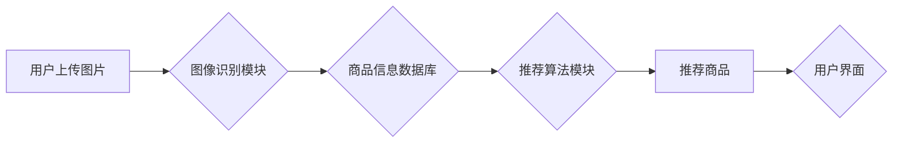

> 视觉推荐、图像识别、深度学习、推荐系统、计算机视觉、商品推荐、AI技术

## 1. 背景介绍

随着移动互联网和电商的快速发展，用户对商品的获取方式也发生了巨大变化。传统的文本搜索方式越来越难以满足用户个性化需求，而视觉搜索则成为一种新兴的商品发现方式。视觉推荐是指通过分析用户上传的图片，识别其中的商品信息，并推荐与之相关的商品。

视觉推荐技术融合了计算机视觉、深度学习和推荐系统等多个领域，具有以下优势：

* **更直观、更便捷:** 用户只需上传图片，即可快速找到心仪商品，无需输入复杂的关键词。
* **更精准、更个性化:** 视觉推荐可以识别图片中的商品属性，例如颜色、款式、品牌等，并根据用户的历史浏览和购买记录，推荐更精准、更个性化的商品。
* **更丰富的体验:** 视觉推荐可以为用户提供更丰富的商品信息，例如商品详情页、用户评价等，提升用户购物体验。

## 2. 核心概念与联系

视觉推荐系统主要包含以下几个核心模块：

* **图像识别模块:** 负责识别图片中的商品信息，例如商品类别、品牌、颜色、款式等。
* **商品信息数据库:** 存储商品的详细信息，例如商品名称、价格、库存等。
* **推荐算法模块:** 根据用户画像和商品信息，推荐与用户兴趣相符的商品。
* **用户界面:** 提供用户上传图片、查看推荐商品、购买商品等功能。

**核心概念与联系流程图:**



## 3. 核心算法原理 & 具体操作步骤

### 3.1  算法原理概述

视觉推荐系统中常用的推荐算法包括协同过滤、内容过滤和基于知识的推荐。

* **协同过滤:** 基于用户的历史行为数据，推荐与用户兴趣相似的其他用户喜欢的商品。
* **内容过滤:** 基于商品的属性信息，推荐与用户兴趣相符的商品。
* **基于知识的推荐:** 基于商品之间的关系和用户偏好，推荐商品。

### 3.2  算法步骤详解

以协同过滤算法为例，其具体操作步骤如下：

1. **数据收集:** 收集用户历史行为数据，例如用户浏览过的商品、购买过的商品、评分过的商品等。
2. **用户相似度计算:** 计算用户之间的相似度，例如使用余弦相似度或皮尔逊相关系数。
3. **推荐商品:** 根据用户与其他用户的相似度，推荐其他用户喜欢的商品。

### 3.3  算法优缺点

**协同过滤算法:**

* **优点:** 可以推荐用户可能没有接触过的商品，发现新的兴趣。
* **缺点:** 数据稀疏性问题，当用户行为数据不足时，算法效果会下降。

**内容过滤算法:**

* **优点:** 可以根据用户兴趣推荐精准的商品。
* **缺点:** 容易陷入“信息茧房”问题，推荐的商品过于单一。

**基于知识的推荐:**

* **优点:** 可以推荐更符合用户需求的商品。
* **缺点:** 需要构建复杂的知识图谱，数据维护成本较高。

### 3.4  算法应用领域

视觉推荐算法广泛应用于以下领域：

* **电商平台:** 推荐商品、个性化商品展示。
* **社交媒体:** 推荐商品、兴趣小组。
* **搜索引擎:** 图像搜索、视觉问答。
* **医疗保健:** 诊断辅助、药物推荐。

## 4. 数学模型和公式 & 详细讲解 & 举例说明

### 4.1  数学模型构建

协同过滤算法的数学模型可以表示为用户-商品评分矩阵，其中每个元素表示用户对商品的评分。

**用户-商品评分矩阵:**

```
| 用户1 | 商品1 | 商品2 | 商品3 |
|---|---|---|---|
| 5 | 4 | 3 | 2 |
| 3 | 2 | 5 | 4 |
| 4 | 5 | 2 | 3 |
```

### 4.2  公式推导过程

用户相似度可以使用余弦相似度公式计算：

$$
\text{相似度} = \frac{\mathbf{u} \cdot \mathbf{v}}{\|\mathbf{u}\| \|\mathbf{v}\|},
$$

其中：

* $\mathbf{u}$ 和 $\mathbf{v}$ 是两个用户的评分向量。
* $\cdot$ 表示向量点积。
* $\|\mathbf{u}\|$ 和 $\|\mathbf{v}\|$ 表示向量的模长。

### 4.3  案例分析与讲解

假设有两个用户，用户1的评分向量为 [5, 4, 3, 2]，用户2的评分向量为 [3, 2, 5, 4]。

使用余弦相似度公式计算用户1和用户2的相似度：

$$
\text{相似度} = \frac{(5 \times 3) + (4 \times 2) + (3 \times 5) + (2 \times 4)}{( \sqrt{5^2 + 4^2 + 3^2 + 2^2}) \times (\sqrt{3^2 + 2^2 + 5^2 + 4^2})} = 0.8.
$$

因此，用户1和用户2的相似度为0.8，说明这两个用户具有较高的相似度。

## 5. 项目实践：代码实例和详细解释说明

### 5.1  开发环境搭建

* **操作系统:** Ubuntu 18.04
* **编程语言:** Python 3.6
* **深度学习框架:** TensorFlow 2.0
* **图像处理库:** OpenCV

### 5.2  源代码详细实现

```python
# 导入必要的库
import tensorflow as tf
from tensorflow.keras.models import Sequential
from tensorflow.keras.layers import Conv2D, MaxPooling2D, Flatten, Dense

# 定义图像识别模型
model = Sequential()
model.add(Conv2D(32, (3, 3), activation='relu', input_shape=(224, 224, 3)))
model.add(MaxPooling2D((2, 2)))
model.add(Conv2D(64, (3, 3), activation='relu'))
model.add(MaxPooling2D((2, 2)))
model.add(Flatten())
model.add(Dense(10, activation='softmax'))

# 编译模型
model.compile(optimizer='adam', loss='categorical_crossentropy', metrics=['accuracy'])

# 训练模型
model.fit(train_images, train_labels, epochs=10)

# 预测商品类别
predictions = model.predict(test_images)
```

### 5.3  代码解读与分析

* **图像识别模型:** 使用卷积神经网络 (CNN) 作为图像识别模型，提取图像特征。
* **模型结构:** 模型包含多个卷积层和池化层，用于提取图像特征，以及全连接层，用于分类。
* **模型训练:** 使用训练数据训练模型，并使用测试数据评估模型性能。

### 5.4  运行结果展示

训练完成后，可以使用测试数据评估模型性能，例如计算准确率、召回率等指标。

## 6. 实际应用场景

视觉推荐技术在电商平台、社交媒体、搜索引擎等领域都有广泛的应用场景。

### 6.1  电商平台

* **商品推荐:** 根据用户上传的图片，推荐与之相关的商品。
* **个性化商品展示:** 根据用户画像，推荐个性化的商品。
* **视觉搜索:** 用户可以通过上传图片搜索商品。

### 6.2  社交媒体

* **兴趣小组推荐:** 根据用户上传的图片，推荐与之相关的兴趣小组。
* **商品分享:** 用户可以通过上传图片分享商品。

### 6.3  搜索引擎

* **图像搜索:** 用户可以通过上传图片搜索相关图片。
* **视觉问答:** 用户可以通过上传图片提问，搜索引擎根据图片内容提供答案。

### 6.4  未来应用展望

随着人工智能技术的不断发展，视觉推荐技术将有更广泛的应用场景，例如：

* **医疗保健:** 辅助医生诊断疾病、推荐药物。
* **教育:** 辅助学生学习、推荐学习资源。
* **旅游:** 辅助用户规划旅行路线、推荐旅游景点。

## 7. 工具和资源推荐

### 7.1  学习资源推荐

* **书籍:**
    * 深度学习
    * 计算机视觉
    * 推荐系统
* **在线课程:**
    * Coursera
    * edX
    * Udacity

### 7.2  开发工具推荐

* **深度学习框架:** TensorFlow, PyTorch
* **图像处理库:** OpenCV, Pillow
* **云平台:** AWS, Azure, Google Cloud

### 7.3  相关论文推荐

* **视觉推荐系统综述:**
    * [A Survey on Visual Recommendation Systems](https://arxiv.org/abs/2006.09474)
* **基于深度学习的视觉推荐:**
    * [Deep Visual Recommendation: A Survey](https://arxiv.org/abs/2103.04937)

## 8. 总结：未来发展趋势与挑战

### 8.1  研究成果总结

视觉推荐技术取得了显著的进展，例如：

* **图像识别精度不断提高:** 深度学习算法的不断发展，使得图像识别精度不断提高。
* **推荐算法更加精准:** 基于用户画像和商品信息的推荐算法，能够更加精准地推荐用户感兴趣的商品。
* **应用场景更加广泛:** 视觉推荐技术已应用于电商平台、社交媒体、搜索引擎等多个领域。

### 8.2  未来发展趋势

* **多模态视觉推荐:** 将文本、音频、视频等多模态信息融合到视觉推荐系统中，提升推荐效果。
* **个性化视觉推荐:** 基于用户行为、偏好、上下文等信息，提供更加个性化的视觉推荐。
* **跨平台视觉推荐:** 实现跨平台的视觉推荐，例如将电商平台的视觉推荐与社交媒体平台相结合。

### 8.3  面临的挑战

* **数据稀疏性问题:** 视觉推荐数据往往稀疏，需要开发新的算法和方法来解决这个问题。
* **隐私保护问题:** 视觉推荐系统需要处理用户画像和行为数据，需要加强隐私保护措施。
* **算法解释性问题:** 深度学习算法的决策过程难以解释，需要开发更可解释的算法。

### 8.4  研究展望

未来，视觉推荐技术将继续发展，并应用于更多领域。研究者需要关注以下几个方面：

* 开发更有效的算法和方法，解决数据稀疏性、隐私保护和算法解释性等问题。
* 探索多模态视觉推荐、个性化视觉推荐和跨平台视觉推荐等新方向。
* 将视觉推荐技术应用于更多领域，例如医疗保健、教育和旅游。

## 9. 附录：常见问题与解答

### 9.1  常见问题

* **视觉推荐技术与传统文本搜索有何区别？**

视觉推荐技术利用图像识别技术，识别用户上传的图片中的商品信息，并推荐相关商品。而传统文本搜索则需要用户输入关键词，根据关键词在数据库中搜索相关商品。

* **视觉推荐技术有哪些应用场景？**

视觉推荐技术广泛应用于电商平台、社交媒体、搜索引擎等领域，例如商品推荐、个性化商品展示、视觉搜索等。

* **视觉推荐技术有哪些挑战？**

视觉推荐技术面临着数据稀疏性、隐私保护和算法解释性等挑战。

### 9.2  解答

* **视觉推荐技术与传统文本搜索的区别:** 视觉推荐技术更直观、更便捷，可以识别图片中的商品信息，而传统文本搜索需要用户输入关键词。

* **视觉推荐技术的应用场景:** 视觉推荐技术应用场景广泛，例如电商平台的商品推荐、社交媒体的兴趣小组推荐、