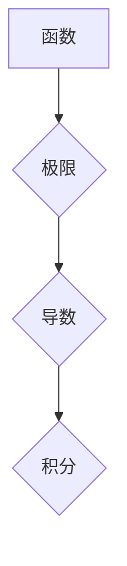

> 微积分，导数，积分，函数，极限，数学基础，计算

## 1. 背景介绍

微积分，作为数学的两个分支之一，与微分和积分密切相关，是现代数学和科学研究的基础。它为我们提供了描述变化和积累的强大工具，在物理学、工程学、经济学、生物学等各个领域都有广泛的应用。

微积分的诞生并非一蹴而就，而是历经数个世纪的探索和发展。早在古希腊时期，人们就对无限的概念和变化的规律进行了初步的思考。然而，直到17世纪，牛顿和莱布尼茨分别独立地创立了微积分学，才为我们打开了理解和描述复杂现象的新大门。

## 2. 核心概念与联系

微积分的核心概念包括：

* **函数**: 函数是将一个集合映射到另一个集合的规则。在微积分中，函数通常表示一个变量的变化趋势。
* **极限**: 极限描述的是一个函数在某一点附近的值趋向于某个特定值的趋势。
* **导数**: 导数描述的是一个函数在某一点处的瞬时变化率。它可以用来描述速度、加速度等物理量。
* **积分**: 积分描述的是一个函数在某区间内的面积。它可以用来计算累积量、平均值等。

这些概念之间相互联系，构成微积分的完整体系。

**Mermaid 流程图**



## 3. 核心算法原理 & 具体操作步骤

### 3.1  算法原理概述

微积分的核心算法包括求导和求积分。

* **求导**: 求导算法利用极限的概念，计算函数在某一点处的瞬时变化率。
* **求积分**: 求积分算法利用导数的概念，计算函数在某区间内的面积。

### 3.2  算法步骤详解

**求导算法步骤**:

1. 将函数表达式写成一个关于自变量的表达式。
2. 利用极限的定义，计算函数在某一点处的导数。
3. 将导数表达式简化，得到函数在该点的导数值。

**求积分算法步骤**:

1. 将函数表达式写成一个关于自变量的表达式。
2. 利用积分的定义，计算函数在某区间内的积分。
3. 将积分表达式简化，得到函数在该区间内的积分值。

### 3.3  算法优缺点

**优点**:

* 微积分算法能够精确地描述函数的变化趋势和累积量。
* 微积分算法在数学、物理、工程等各个领域都有广泛的应用。

**缺点**:

* 微积分算法的求解过程相对复杂，需要一定的数学基础。
* 对于一些复杂的函数，求导和求积分可能需要使用更高级的数学工具。

### 3.4  算法应用领域

微积分算法广泛应用于以下领域：

* **物理学**: 描述运动、力、能量等物理量的变化。
* **工程学**: 设计桥梁、飞机、汽车等结构，分析电路、信号等系统。
* **经济学**: 建立经济模型，预测市场趋势。
* **生物学**: 研究生物体的生长、繁殖、进化等过程。

## 4. 数学模型和公式 & 详细讲解 & 举例说明

### 4.1  数学模型构建

微积分的核心数学模型是函数、极限、导数和积分。

* **函数**: 函数可以表示一个变量的变化趋势，例如，速度函数可以表示物体的速度随时间变化的规律。
* **极限**: 极限描述的是一个函数在某一点附近的值趋向于某个特定值的趋势。例如，当时间趋近于无穷大时，物体的速度趋近于一个常数值。
* **导数**: 导数描述的是一个函数在某一点处的瞬时变化率。例如，速度函数的导数就是加速度函数。
* **积分**: 积分描述的是一个函数在某区间内的面积。例如，速度函数的积分就是位移函数。

### 4.2  公式推导过程

**导数公式**:

$$
f'(x) = \lim_{h \to 0} \frac{f(x + h) - f(x)}{h}
$$

**积分公式**:

$$
\int_a^b f(x) dx = \lim_{n \to \infty} \sum_{i=1}^n f(x_i^*) \Delta x
$$

### 4.3  案例分析与讲解

**案例**:

假设一个物体沿直线运动，其速度函数为 $v(t) = 2t$，其中 $t$ 表示时间，$v(t)$ 表示速度。

* **求物体在时间 $t=0$ 到 $t=2$ 内的位移**:

我们可以利用积分公式计算位移：

$$
\int_0^2 2t dt = [t^2]_0^2 = 4 - 0 = 4
$$

因此，物体在时间 $t=0$ 到 $t=2$ 内的位移为 4。

* **求物体在时间 $t=1$ 时的加速度**:

我们可以利用导数公式计算加速度：

$$
v'(t) = 2
$$

因此，物体在时间 $t=1$ 时的加速度为 2。

## 5. 项目实践：代码实例和详细解释说明

### 5.1  开发环境搭建

本项目使用 Python 语言进行开发，需要安装 Python 3.x 及相关库。

### 5.2  源代码详细实现

```python
import numpy as np

def f(x):
  return x**2

# 求导
def derivative(f, x, h=1e-6):
  return (f(x + h) - f(x)) / h

# 求积分
def integral(f, a, b, n=1000):
  h = (b - a) / n
  sum = 0
  for i in range(n):
    x = a + i * h
    sum += f(x)
  return sum * h

# 测试
x = 2
dx = derivative(f, x)
print(f"函数 f(x) = {f(x)} 在 x = {x} 处的导数为: {dx}")

a = 0
b = 2
integral_result = integral(f, a, b)
print(f"函数 f(x) = {f(x)} 在区间 [0, 2] 的积分值为: {integral_result}")
```

### 5.3  代码解读与分析

* `f(x)` 函数定义了需要求导和积分的函数。
* `derivative(f, x, h)` 函数计算函数在给定点 $x$ 处的导数，使用有限差分法近似计算。
* `integral(f, a, b, n)` 函数计算函数在区间 $[a, b]$ 的积分，使用梯形公式近似计算。
* 测试部分调用上述函数，计算函数在给定点处的导数和区间内的积分值。

### 5.4  运行结果展示

运行代码后，将输出函数在给定点处的导数和区间内的积分值。

## 6. 实际应用场景

微积分在各个领域都有广泛的应用，例如：

* **物理学**: 描述运动、力、能量等物理量的变化。例如，牛顿第二定律 $F = ma$ 描述了力、质量和加速度之间的关系，其中加速度是速度对时间的导数。
* **工程学**: 设计桥梁、飞机、汽车等结构，分析电路、信号等系统。例如，在设计桥梁时，需要考虑桥梁的载荷和应力，可以使用微积分计算桥梁的变形和强度。
* **经济学**: 建立经济模型，预测市场趋势。例如，可以使用微积分计算企业利润的导数，预测利润的变化趋势。
* **生物学**: 研究生物体的生长、繁殖、进化等过程。例如，可以使用微积分描述人口增长模型，预测人口的变化趋势。

### 6.4  未来应用展望

随着人工智能和机器学习的发展，微积分在未来将有更广泛的应用。例如，可以利用微积分优化机器学习算法，提高算法的效率和准确性。

## 7. 工具和资源推荐

### 7.1  学习资源推荐

* **书籍**:
    * 《微积分》(Calculus) by James Stewart
    * 《微积分导论》(Introduction to Calculus) by Richard Courant and Herbert Robbins
* **在线课程**:
    * MIT OpenCourseWare: Calculus
    * Khan Academy: Calculus

### 7.2  开发工具推荐

* **Python**: Python 是一个流行的编程语言，广泛用于科学计算和数据分析。
* **NumPy**: NumPy 是 Python 的科学计算库，提供高效的数组操作和数学函数。
* **SciPy**: SciPy 是 Python 的科学计算库，提供更高级的数学和科学计算功能。

### 7.3  相关论文推荐

* **微积分的起源和发展**:
    * The History of Calculus by Carl B. Boyer
* **微积分在人工智能中的应用**:
    * Calculus for Machine Learning by Michael Nielsen

## 8. 总结：未来发展趋势与挑战

### 8.1  研究成果总结

微积分作为数学的基础，为我们提供了描述变化和积累的强大工具，在各个领域都有广泛的应用。

### 8.2  未来发展趋势

随着人工智能和机器学习的发展，微积分在未来将有更广泛的应用。例如，可以利用微积分优化机器学习算法，提高算法的效率和准确性。

### 8.3  面临的挑战

微积分的学习和应用需要一定的数学基础，对于一些人来说可能存在一定的难度。此外，对于一些复杂的函数，求导和求积分可能需要使用更高级的数学工具。

### 8.4  研究展望

未来，微积分的研究将继续深入，探索更复杂的数学模型和应用场景。


## 9. 附录：常见问题与解答

**常见问题**:

* **微积分和微分有什么区别？**

微积分是数学的一个分支，包括微分和积分两个部分。微分描述的是函数在某一点处的瞬时变化率，而积分描述的是函数在某区间内的面积。

* **如何学习微积分？**

学习微积分需要一定的数学基础，建议从基础的代数和三角函数开始学习，然后逐步深入学习微积分的理论和应用。

* **微积分在哪些领域有应用？**

微积分在各个领域都有广泛的应用，例如物理学、工程学、经济学、生物学等。

**解答**:

* **微积分和微分有什么区别？**

微积分是数学的一个分支，包括微分和积分两个部分。微分描述的是函数在某一点处的瞬时变化率，而积分描述的是函数在某区间内的面积。

* **如何学习微积分？**

学习微积分需要一定的数学基础，建议从基础的代数和三角函数开始学习，然后逐步深入学习微积分的理论和应用。

* **微积分在哪些领域有应用？**

微积分在各个领域都有广泛的应用，例如物理学、工程学、经济学、生物学等。


作者：禅与计算机程序设计艺术 / Zen and the Art of Computer Programming 
<end_of_turn>