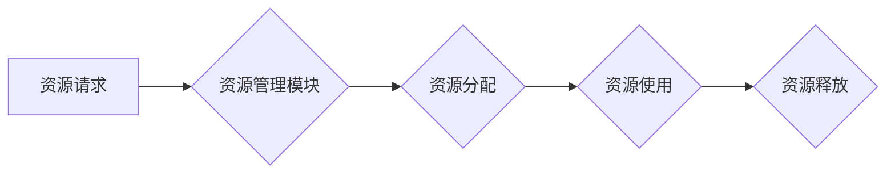

> 资源管理, 算法, 数据结构, 优先级队列, 进程调度, 内存管理, 文件系统, 性能优化, 代码实例

## 1. 背景介绍

在现代计算机系统中，资源管理是至关重要的环节，它涉及到系统中各种资源的分配、调度和回收，例如CPU时间、内存空间、I/O设备等。高效的资源管理可以最大限度地提高系统性能，并确保系统稳定运行。

随着计算机系统规模和复杂度的不断增加，资源管理面临着越来越大的挑战。传统的资源管理方法已经难以满足现代系统对资源管理的需求。因此，研究和开发新的资源管理技术和算法，以提高资源利用率、降低系统开销，并增强系统可靠性，成为计算机科学领域的重要研究方向。

## 2. 核心概念与联系

资源管理的核心概念包括：

* **资源:** 指计算机系统中可供利用的各种要素，例如CPU时间、内存空间、I/O设备等。
* **资源分配:** 将资源分配给不同的进程或任务，以满足其需求。
* **资源调度:** 决定在给定时间内，哪个进程或任务能够使用哪些资源。
* **资源回收:** 当进程或任务不再需要资源时，回收这些资源，以便供其他进程或任务使用。

资源管理系统通常采用以下架构：



## 3. 核心算法原理 & 具体操作步骤

### 3.1  算法原理概述

资源管理算法的目的是为了高效地分配和调度系统资源，以满足用户需求并最大化资源利用率。常见的资源管理算法包括：

* **先到先服务 (First-Come, First-Served, FCFS):** 按照进程到达时间顺序分配资源。
* **最短作业优先 (Shortest Job First, SJF):** 按照进程执行时间最短的顺序分配资源。
* **优先级调度 (Priority Scheduling):** 根据进程优先级分配资源，优先级高的进程优先获得资源。
* **轮转调度 (Round Robin Scheduling):** 将所有进程分配固定时间片，轮流使用资源。

### 3.2  算法步骤详解

以先到先服务算法为例，其具体操作步骤如下：

1. 进程到达系统时，加入到等待队列中。
2. 当CPU空闲时，调度器从等待队列中取出第一个进程，并将其分配CPU时间片。
3. 进程执行完毕后，释放CPU资源，并加入到完成队列中。
4. 重复步骤2和3，直到所有进程完成执行。

### 3.3  算法优缺点

不同的资源管理算法具有不同的优缺点，需要根据实际情况选择合适的算法。

* **FCFS:** 简单易实现，但可能导致长进程阻塞短进程，降低系统吞吐量。
* **SJF:** 可以提高系统吞吐量，但需要提前知道进程执行时间，难以实现。
* **优先级调度:** 可以满足不同进程的优先级需求，但需要合理设置优先级，否则可能导致公平性问题。
* **轮转调度:** 可以保证所有进程得到公平的资源分配，但可能导致上下文切换开销增加。

### 3.4  算法应用领域

资源管理算法广泛应用于各种计算机系统中，例如：

* **操作系统:** 用于管理CPU时间、内存空间、I/O设备等系统资源。
* **云计算平台:** 用于管理虚拟机、存储空间、网络带宽等资源。
* **数据库系统:** 用于管理数据库连接、查询资源、数据存储空间等资源。

## 4. 数学模型和公式 & 详细讲解 & 举例说明

### 4.1  数学模型构建

资源管理问题可以抽象为一个数学模型，其中：

* **资源:** 表示系统中可供利用的各种要素，例如CPU时间、内存空间、I/O设备等。
* **需求:** 表示每个进程或任务对资源的需求量。
* **分配:** 表示每个进程或任务分配到的资源量。
* **目标函数:** 表示资源管理的目标，例如最大化资源利用率、最小化系统开销等。

### 4.2  公式推导过程

资源管理算法的性能可以评估为：

* **资源利用率:** 指系统资源被实际使用的比例。
* **吞吐量:** 指系统在单位时间内完成的任务数量。
* **响应时间:** 指进程从提交到完成的总时间。

这些指标可以通过数学公式进行计算和分析。例如，资源利用率可以表示为：

$$
资源利用率 = \frac{实际使用资源量}{总资源量}
$$

### 4.3  案例分析与讲解

以CPU调度为例，假设系统有3个CPU核心，每个核心可以执行一个进程。进程A需要10个时间片，进程B需要5个时间片，进程C需要8个时间片。

如果采用先到先服务算法，则进程执行顺序为A、B、C，总执行时间为23个时间片。

如果采用轮转调度算法，每个进程分配2个时间片，则进程执行顺序为A、B、C、A、B、C...，总执行时间为16个时间片。

通过比较两种算法的执行时间，可以看出轮转调度算法可以提高系统吞吐量。

## 5. 项目实践：代码实例和详细解释说明

### 5.1  开发环境搭建

本项目使用Python语言进行开发，需要安装Python3和必要的库，例如`queue`、`threading`等。

### 5.2  源代码详细实现

```python
import queue
import threading
import time

class Process:
    def __init__(self, name, time_slice):
        self.name = name
        self.time_slice = time_slice
        self.remaining_time = time_slice

    def run(self):
        print(f"进程{self.name}开始执行")
        while self.remaining_time > 0:
            print(f"进程{self.name}正在执行，剩余时间{self.remaining_time}")
            time.sleep(1)
            self.remaining_time -= 1
        print(f"进程{self.name}执行完毕")

class Scheduler:
    def __init__(self):
        self.process_queue = queue.Queue()
        self.current_process = None

    def add_process(self, process):
        self.process_queue.put(process)

    def schedule(self):
        if self.current_process is None:
            self.current_process = self.process_queue.get()
            self.current_process.run()
        else:
            self.current_process = None

# 创建进程
process1 = Process("P1", 10)
process2 = Process("P2", 5)
process3 = Process("P3", 8)

# 创建调度器
scheduler = Scheduler()

# 添加进程到调度器
scheduler.add_process(process1)
scheduler.add_process(process2)
scheduler.add_process(process3)

# 调度进程
while not scheduler.process_queue.empty():
    scheduler.schedule()

```

### 5.3  代码解读与分析

代码实现了一个简单的进程调度器，使用优先级队列来管理进程，并采用轮转调度算法。

* `Process`类定义了进程的基本属性，包括进程名称、时间片和剩余时间。
* `Scheduler`类负责管理进程队列和调度进程。
* `add_process()`方法将进程添加到队列中。
* `schedule()`方法调度进程，如果当前没有正在执行的进程，则从队列中取出一个进程并执行；否则，则将当前进程置空。

### 5.4  运行结果展示

运行代码后，会输出进程的执行日志，例如：

```
进程P1开始执行
进程P1正在执行，剩余时间10
进程P1正在执行，剩余时间9
...
进程P1执行完毕
进程P2开始执行
进程P2正在执行，剩余时间5
...
进程P2执行完毕
进程P3开始执行
进程P3正在执行，剩余时间8
...
进程P3执行完毕
```

## 6. 实际应用场景

资源管理技术广泛应用于各种实际场景，例如：

* **云计算平台:** 云计算平台需要高效地管理虚拟机、存储空间、网络带宽等资源，以满足用户需求并提高资源利用率。
* **数据库系统:** 数据库系统需要管理数据库连接、查询资源、数据存储空间等资源，以确保数据库的稳定运行和高性能。
* **网络路由:** 网络路由器需要管理网络流量，并根据路由表将数据包转发到目的地，以确保网络的可靠性和效率。

### 6.4  未来应用展望

随着人工智能、物联网等技术的快速发展，资源管理技术面临着新的挑战和机遇。未来，资源管理技术将更加智能化、自动化，并与其他技术融合，例如：

* **机器学习:** 利用机器学习算法预测资源需求，并动态调整资源分配策略。
* **容器技术:** 利用容器技术将应用程序打包成独立的单元，方便资源管理和部署。
* **边缘计算:** 将计算资源部署到边缘节点，降低数据传输延迟，并提高资源利用率。

## 7. 工具和资源推荐

### 7.1  学习资源推荐

* **书籍:**
    * 《Operating System Concepts》
    * 《Computer Organization and Design》
    * 《Algorithms》
* **在线课程:**
    * Coursera: Operating Systems
    * edX: Computer Science Fundamentals
    * Udacity: Artificial Intelligence

### 7.2  开发工具推荐

* **操作系统:** Linux, Windows
* **编程语言:** Python, C++, Java
* **虚拟机:** VirtualBox, VMware

### 7.3  相关论文推荐

* **论文:**
    * "A Survey of Resource Management Techniques in Cloud Computing"
    * "Dynamic Resource Allocation in Virtualized Environments"
    * "Machine Learning for Resource Management in Data Centers"

## 8. 总结：未来发展趋势与挑战

### 8.1  研究成果总结

资源管理技术已经取得了显著的成果，例如：

* **提高了资源利用率:** 通过优化资源分配策略，可以提高系统资源的利用率。
* **降低了系统开销:** 通过减少上下文切换和资源争用，可以降低系统开销。
* **增强了系统可靠性:** 通过冗余资源和故障恢复机制，可以增强系统的可靠性。

### 8.2  未来发展趋势

未来资源管理技术的发展趋势包括：

* **智能化:** 利用机器学习和人工智能技术，实现资源管理的自动化和智能化。
* **自动化:** 通过自动化工具和平台，简化资源管理流程，提高效率。
* **融合化:** 将资源管理技术与其他技术融合，例如容器技术、边缘计算等。

### 8.3  面临的挑战

资源管理技术也面临着一些挑战，例如：

* **数据安全:** 资源管理系统需要保护用户数据安全。
* **隐私保护:** 资源管理系统需要保护用户隐私信息。
* **可解释性:** 智能化资源管理系统需要具备可解释性，以便用户理解其决策过程。

### 8.4  研究展望

未来，资源管理技术的研究方向包括：

* **开发更智能的资源管理算法:** 利用机器学习和人工智能技术，开发更智能的资源管理算法，能够更好地预测资源需求和动态调整资源分配策略。
* **研究资源管理的安全性:** 开发安全可靠的资源管理系统，能够保护用户数据安全和隐私信息。
* **提高资源管理的可解释性:** 研究如何使智能化资源管理系统更加透明和可解释，以便用户能够理解其决策过程。

## 9. 附录：常见问题与解答

### 9.1  常见问题

* **什么是资源管理？**
* **常见的资源管理算法有哪些？**
* **资源管理技术在哪些领域应用？**
* **未来资源管理技术的发展趋势是什么？**

### 9.2  解答

* **什么是资源管理？** 资源管理是指在计算机系统中，对各种资源