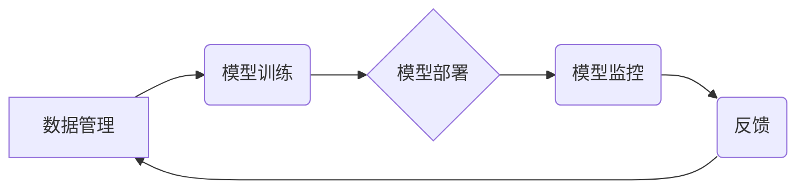

> AI 2.0, 基础设施, 标准化, 规范化, 模型训练, 数据管理, 联邦学习, 隐私保护, 可解释性

## 1. 背景介绍

人工智能（AI）技术近年来发展迅速，从语音识别、图像识别到自然语言处理等领域取得了突破性进展。随着AI应用的不断扩展，对AI基础设施的需求也日益增长。传统的AI基础设施主要集中在模型训练和部署，而AI 2.0时代，基础设施建设需要更加全面、标准化和规范化，以支持更复杂、更安全、更可解释的AI应用。

AI 2.0时代，人工智能不再局限于单一领域，而是朝着更广泛、更深入的方向发展。例如，联邦学习、隐私保护、可解释性等新兴技术将成为AI应用的关键要素。这些新技术对AI基础设施提出了更高的要求，需要更加灵活、可扩展、安全可靠的基础设施来支撑。

## 2. 核心概念与联系

**2.1 标准化**

标准化是指在特定领域或行业内，制定和实施一组共同认可的规则、规范和技术标准。在AI基础设施建设中，标准化可以帮助解决以下问题：

* **互操作性:** 不同平台、不同厂商的AI工具和服务之间能够互操作，实现数据和模型的无缝交换。
* **可移植性:** AI模型和应用能够在不同的硬件平台和软件环境中运行，提高了应用的灵活性和可扩展性。
* **安全性:** 标准化的安全协议和认证机制可以保障AI系统的安全性和可靠性。

**2.2 规范化**

规范化是指在特定领域或行业内，制定和实施一组最佳实践、流程和指南。在AI基础设施建设中，规范化可以帮助解决以下问题：

* **一致性:** 不同团队、不同项目在使用AI工具和服务时，能够遵循统一的流程和规范，提高工作效率和质量。
* **可维护性:** 规范化的AI系统更容易维护和更新，降低了系统运行的成本和风险。
* **可复用性:** 规范化的AI组件和模块可以被多个项目和应用复用，提高了资源利用率和开发效率。

**2.3 核心架构**



## 3. 核心算法原理 & 具体操作步骤

**3.1 算法原理概述**

在AI 2.0基础设施建设中，许多核心算法发挥着关键作用，例如：

* **联邦学习:** 允许在不共享原始数据的情况下，多个参与方共同训练一个全局模型。
* **隐私保护:** 通过加密、差分隐私等技术，保护用户数据隐私。
* **可解释性:** 通过可视化、规则提取等技术，提高AI模型的透明度和可解释性。

**3.2 算法步骤详解**

以联邦学习为例，其基本步骤如下：

1. **数据分发:** 将原始数据分散到各个参与方本地。
2. **模型训练:** 每个参与方使用本地数据训练模型，并上传模型参数到中央服务器。
3. **参数聚合:** 中央服务器将所有参与方的模型参数进行聚合，得到全局模型参数。
4. **模型更新:** 全局模型参数被广播回各个参与方，用于更新本地模型。
5. **迭代训练:** 重复上述步骤，直到模型达到预设精度。

**3.3 算法优缺点**

* **联邦学习:**
    * **优点:** 保护用户数据隐私，提高模型鲁棒性。
    * **缺点:** 训练速度较慢，模型精度可能低于集中式训练。
* **隐私保护:**
    * **优点:** 增强用户数据隐私保护。
    * **缺点:** 可能降低模型精度，增加计算复杂度。
* **可解释性:**
    * **优点:** 提高模型透明度，帮助用户理解模型决策。
    * **缺点:** 可解释性算法复杂度高，可能降低模型效率。

**3.4 算法应用领域**

* **联邦学习:** 医疗保健、金融、物联网等领域，用于训练隐私敏感数据的模型。
* **隐私保护:** 医疗保健、金融、电商等领域，用于保护用户个人信息。
* **可解释性:** 医疗诊断、金融风险评估等领域，用于提高模型决策的可信度和透明度。

## 4. 数学模型和公式 & 详细讲解 & 举例说明

**4.1 数学模型构建**

在AI 2.0基础设施建设中，数学模型是描述算法行为和性能的关键工具。例如，联邦学习中的模型聚合可以使用加权平均算法，公式如下：

$$
\theta_{global} = \frac{1}{N} \sum_{i=1}^{N} w_i \theta_i
$$

其中：

* $\theta_{global}$ 是全局模型参数。
* $N$ 是参与方的数量。
* $w_i$ 是第 $i$ 个参与方的权重。
* $\theta_i$ 是第 $i$ 个参与方的模型参数。

**4.2 公式推导过程**

加权平均算法的推导过程如下：

1. 每个参与方训练得到模型参数 $\theta_i$。
2. 每个参与方根据自身数据质量、模型性能等因素，分配权重 $w_i$。
3. 将所有参与方的模型参数与权重相乘，并求和，得到全局模型参数 $\theta_{global}$。

**4.3 案例分析与讲解**

假设有三个参与方，他们的权重分别为 0.4、0.3、0.3，他们的模型参数分别为 $\theta_1$、$\theta_2$、$\theta_3$。则全局模型参数为：

$$
\theta_{global} = \frac{1}{3} (0.4 \theta_1 + 0.3 \theta_2 + 0.3 \theta_3)
$$

这个公式表明，全局模型参数是所有参与方模型参数的加权平均，权重反映了每个参与方的贡献度。

## 5. 项目实践：代码实例和详细解释说明

**5.1 开发环境搭建**

* 操作系统：Ubuntu 20.04
* Python 版本：3.8
* 必要的库：TensorFlow、PyTorch、scikit-learn等

**5.2 源代码详细实现**

以下是一个简单的联邦学习代码示例，使用TensorFlow框架实现：

```python
import tensorflow as tf

# 定义模型
model = tf.keras.models.Sequential([
    tf.keras.layers.Dense(10, activation='relu'),
    tf.keras.layers.Dense(1)
])

# 定义联邦学习训练函数
def federated_train(clients, epochs, learning_rate):
    for epoch in range(epochs):
        # 每个客户端训练模型
        for client in clients:
            client.train(model, learning_rate)
        # 聚合模型参数
        model.set_weights(aggregate_weights(clients))
    return model

# 聚合模型参数函数
def aggregate_weights(clients):
    # ...

# ...
```

**5.3 代码解读与分析**

* 代码首先定义了一个简单的模型，然后定义了一个联邦学习训练函数。
* 联邦学习训练函数迭代训练模型，每个迭代周期内，每个客户端使用本地数据训练模型，然后将模型参数上传到中央服务器进行聚合。
* 聚合模型参数函数将所有客户端的模型参数进行加权平均，得到全局模型参数。

**5.4 运行结果展示**

运行上述代码后，可以观察到全局模型的精度随着训练迭代次数的增加而提高。

## 6. 实际应用场景

**6.1 医疗保健**

* **疾病诊断:** 利用联邦学习训练模型，在不共享患者隐私数据的情况下，提高疾病诊断的准确性。
* **药物研发:** 利用联邦学习训练模型，加速药物研发过程，降低研发成本。

**6.2 金融**

* **欺诈检测:** 利用联邦学习训练模型，识别金融交易中的欺诈行为，保护用户资金安全。
* **风险评估:** 利用联邦学习训练模型，评估客户的信用风险，提高贷款审批效率。

**6.3 物联网**

* **设备故障预测:** 利用联邦学习训练模型，预测设备故障，降低设备维护成本。
* **智能家居:** 利用联邦学习训练模型，实现智能家居设备的个性化控制。

**6.4 未来应用展望**

AI 2.0基础设施将应用于更多领域，例如自动驾驶、机器人、教育等。随着技术的不断发展，AI基础设施将更加智能、高效、安全可靠。

## 7. 工具和资源推荐

**7.1 学习资源推荐**

* **书籍:**
    * 《深度学习》
    * 《机器学习》
    * 《AI 2.0》
* **在线课程:**
    * Coursera
    * edX
    * Udacity

**7.2 开发工具推荐**

* **TensorFlow:** 开源深度学习框架
* **PyTorch:** 开源深度学习框架
* **Keras:** 高级深度学习API

**7.3 相关论文推荐**

* 《联邦学习:一种隐私保护的机器学习方法》
* 《可解释性人工智能:方法、挑战和机遇》
* 《AI 2.0:人工智能的下一个阶段》

## 8. 总结：未来发展趋势与挑战

**8.1 研究成果总结**

AI 2.0基础设施建设取得了显著进展，标准化和规范化成为关键方向。联邦学习、隐私保护、可解释性等新技术为AI应用提供了新的可能性。

**8.2 未来发展趋势**

* **更智能的AI基础设施:** 基于人工智能技术的自动化管理和优化，提高基础设施的效率和可靠性。
* **更安全的AI基础设施:** 加强安全防护机制，保障用户数据安全和系统稳定性。
* **更可解释的AI基础设施:** 提供更透明、更易理解的AI模型和算法，增强用户信任。

**8.3 面临的挑战**

* **标准化和规范化:** 缺乏统一的标准和规范，导致不同平台和厂商之间互操作性差。
* **数据安全和隐私保护:** 如何保障用户数据安全和隐私，是AI基础设施建设面临的重大挑战。
* **可解释性:** 如何提高AI模型的可解释性，帮助用户理解模型决策，是AI发展的重要方向。

**8.4 研究展望**

未来，AI基础设施建设将继续朝着更智能、更安全、更可解释的方向发展。研究者需要不断探索新的技术和方法，解决AI基础设施建设面临的挑战，推动AI技术向更广泛的领域应用。

## 9. 附录：常见问题与解答

**9.1 如何选择合适的AI基础设施平台？**

选择AI基础设施平台需要考虑以下因素：

* **应用场景:** 不同的应用场景对AI基础设施的需求不同。
* **数据规模:** 数据规模大小会影响平台的选择。
* **预算:** 不同的平台价格差异较大。
* **技术支持:** 选择技术支持完善的平台。

**9.2 如何保障用户数据安全和隐私？**

* 使用加密技术保护用户数据。
* 使用差分隐私等技术保护用户隐私。
* 遵守相关数据安全和隐私保护法规。

**9.3 如何提高AI模型的可解释性？**

* 使用可解释性算法训练模型。
* 使用可视化技术展示模型决策过程。
* 提供模型解释报告，帮助用户理解模型决策。


作者：禅与计算机程序设计艺术 / Zen and the Art of Computer Programming 
<end_of_turn>