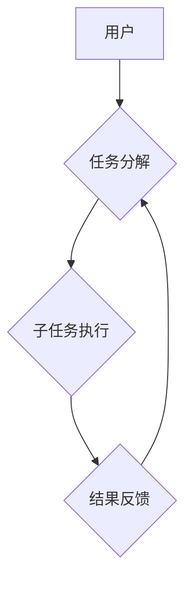

> AI Agent, BabyAGI, 自动化任务管理, 循环任务执行,  AI 驱动的效率提升,  人工智能应用

## 1. 背景介绍

在人工智能领域蓬勃发展的今天，我们看到了许多令人惊叹的突破，从自然语言处理到计算机视觉，AI 正在改变着我们生活的方方面面。然而，一个关键的问题仍然存在：如何让 AI 更智能地执行复杂的任务，并能够自主地学习和适应不断变化的环境？

传统的 AI 系统通常需要明确的指令和预先定义的规则，而现实世界中的任务往往是复杂、动态且具有不确定性的。为了解决这个问题，**AI Agent** 应运而生。AI Agent 是一种能够感知环境、做出决策并执行行动的智能体，它具有自主学习、规划和执行任务的能力。

BabyAGI 是一个基于 AI Agent 的开源项目，它旨在通过循环任务执行和结果反馈机制，实现自动化任务管理，并帮助用户更高效地完成工作。

## 2. 核心概念与联系

BabyAGI 的核心概念是将任务分解成一系列子任务，并通过循环执行和结果反馈机制，不断优化任务执行流程。

**核心概念：**

* **任务分解:** 将复杂的任务分解成一系列更小的、可管理的子任务。
* **循环执行:**  根据任务结果，自动创建、排序和执行新的子任务。
* **结果反馈:**  收集子任务执行结果，并将其反馈到任务分解和排序过程中，不断优化任务执行流程。

**架构图:**

## 3. 核心算法原理 & 具体操作步骤

### 3.1  算法原理概述

BabyAGI 的核心算法原理是基于 **循环任务执行和结果反馈** 的机制。

1. **任务分解:** 用户首先将一个复杂的任务分解成一系列子任务。
2. **子任务排序:** 根据子任务的优先级和依赖关系，对子任务进行排序。
3. **子任务执行:**  AI Agent 执行排序后的子任务，并收集子任务执行结果。
4. **结果反馈:**  AI Agent 将子任务执行结果反馈到任务分解和排序过程中，并根据结果调整子任务的优先级和依赖关系。
5. **循环执行:**  重复步骤 2-4，直到所有子任务完成。

### 3.2  算法步骤详解

1. **任务输入:** 用户将一个复杂的任务输入到 BabyAGI 系统中。
2. **任务分解:** BabyAGI 系统使用自然语言处理技术，将任务分解成一系列更小的、可管理的子任务。
3. **子任务优先级排序:** BabyAGI 系统根据子任务的优先级和依赖关系，对子任务进行排序。
4. **子任务执行:** BabyAGI 系统使用预先定义的工具和 API，执行排序后的子任务。
5. **结果收集:** BabyAGI 系统收集子任务执行结果，并将其存储在数据库中。
6. **结果分析:** BabyAGI 系统使用机器学习算法，分析子任务执行结果，并根据结果调整子任务的优先级和依赖关系。
7. **循环执行:** BabyAGI 系统重复步骤 3-6，直到所有子任务完成。

### 3.3  算法优缺点

**优点:**

* **自动化任务管理:** BabyAGI 可以自动创建、排序和执行任务，帮助用户更高效地完成工作。
* **自主学习和适应:** BabyAGI 可以根据任务结果不断优化任务执行流程，并适应不断变化的环境。
* **提高工作效率:** BabyAGI 可以帮助用户解放时间，专注于更重要的工作。

**缺点:**

* **依赖于数据质量:** BabyAGI 的性能取决于数据质量，如果数据质量不高，则可能会导致任务执行错误。
* **需要明确的任务分解:** BabyAGI 需要用户明确地将任务分解成子任务，否则可能会导致任务执行不完整。
* **技术门槛较高:** BabyAGI 的开发和使用需要一定的技术门槛。

### 3.4  算法应用领域

BabyAGI 的应用领域非常广泛，包括：

* **个人效率提升:**  帮助个人管理日常任务，提高工作效率。
* **企业自动化:**  自动化企业内部的流程和任务，提高工作效率和降低成本。
* **科研研究:**  帮助科研人员自动执行实验和数据分析，加速科研进度。
* **教育教学:**  帮助教师自动批改作业和生成学习内容，提高教学效率。

## 4. 数学模型和公式 & 详细讲解 & 举例说明

### 4.1  数学模型构建

BabyAGI 的核心算法可以抽象为一个循环任务执行模型，其数学模型可以表示为：

$$
T(n) = f(T(n-1), R(n-1))
$$

其中：

* $T(n)$ 表示第 n 轮任务执行的结果。
* $T(n-1)$ 表示第 n-1 轮任务执行的结果。
* $R(n-1)$ 表示第 n-1 轮任务执行的结果反馈。
* $f$ 表示任务分解、排序和执行的函数。

### 4.2  公式推导过程

通过循环执行上述模型，BabyAGI 可以不断优化任务执行流程。

* **任务分解:** $f$ 函数可以根据任务结果 $T(n-1)$ 和结果反馈 $R(n-1)$，将任务分解成更小的子任务。
* **子任务排序:** $f$ 函数可以根据子任务的优先级和依赖关系，对子任务进行排序。
* **子任务执行:** $f$ 函数可以根据排序后的子任务，执行相应的操作。

### 4.3  案例分析与讲解

例如，假设用户想要完成一个“写博客文章”的任务。

* **初始状态:** $T(0) = \{“写博客文章”\}$
* **第一轮执行:** BabyAGI 将“写博客文章”分解成子任务：
    * 确定主题
    * 搜集资料
    * 写作草稿
    * 修改润色
    * 发布文章
* **结果反馈:**  BabyAGI 执行完子任务后，收集到相应的执行结果反馈，例如“确定主题”子任务执行成功，但“搜集资料”子任务遇到困难。
* **第二轮执行:**  根据结果反馈，BabyAGI 将调整子任务的优先级和依赖关系，例如将“搜集资料”子任务的优先级提高，并根据需要调整其他子任务的执行顺序。

## 5. 项目实践：代码实例和详细解释说明

### 5.1  开发环境搭建

BabyAGI 的开发环境搭建相对简单，主要需要以下软件：

* Python 3.x
* Git
* Docker

### 5.2  源代码详细实现

BabyAGI 的源代码主要包含以下几个部分：

* **任务分解模块:**  负责将用户输入的任务分解成子任务。
* **子任务排序模块:**  负责根据子任务的优先级和依赖关系，对子任务进行排序。
* **子任务执行模块:**  负责执行排序后的子任务。
* **结果反馈模块:**  负责收集子任务执行结果，并将其反馈到任务分解和排序模块。

### 5.3  代码解读与分析

BabyAGI 的代码实现主要使用 Python 语言，并结合了各种开源库，例如：

* **自然语言处理库:**  例如 NLTK、spaCy 等，用于任务分解模块。
* **机器学习库:**  例如 scikit-learn 等，用于结果分析模块。
* **API 调用库:**  例如 requests 等，用于子任务执行模块。

### 5.4  运行结果展示

BabyAGI 的运行结果可以以文本、图形或其他形式展示，例如：

* **任务执行进度:**  显示任务执行的进度条。
* **子任务执行结果:**  显示每个子任务的执行结果。
* **任务完成时间:**  显示任务完成的时间。

## 6. 实际应用场景

### 6.1  个人效率提升

BabyAGI 可以帮助个人管理日常任务，例如：

* **日程安排:**  自动安排会议、约会和待办事项。
* **邮件管理:**  自动筛选邮件、回复邮件和安排邮件提醒。
* **学习计划:**  自动生成学习计划、安排学习时间和跟踪学习进度。

### 6.2  企业自动化

BabyAGI 可以帮助企业自动化内部流程和任务，例如：

* **客户服务:**  自动回复客户咨询、处理客户投诉和安排客户服务人员。
* **销售管理:**  自动生成销售报告、跟踪客户线索和安排销售会议。
* **财务管理:**  自动生成财务报表、处理账单和安排付款。

### 6.3  科研研究

BabyAGI 可以帮助科研人员自动执行实验和数据分析，例如：

* **实验数据采集:**  自动采集实验数据、处理实验数据和生成实验报告。
* **数据分析:**  自动分析实验数据、发现数据规律和生成数据可视化图表。
* **文献检索:**  自动检索相关文献、提取文献信息和生成文献综述。

### 6.4  未来应用展望

BabyAGI 的应用场景还在不断扩展，未来可能会应用于更多领域，例如：

* **医疗保健:**  自动诊断疾病、安排医疗预约和提供个性化医疗建议。
* **教育教学:**  自动批改作业、生成学习内容和提供个性化学习辅导。
* **智能家居:**  自动控制家居设备、安排家居清洁和提供家居安全保障。

## 7. 工具和资源推荐

### 7.1  学习资源推荐

* **BabyAGI 官方文档:** https://github.com/yoheinakajima/babyagi
* **AI Agent 相关书籍:**
    * 《Reinforcement Learning: An Introduction》 by Richard S. Sutton and Andrew G. Barto
    * 《Artificial Intelligence: A Modern Approach》 by Stuart Russell and Peter Norvig

### 7.2  开发工具推荐

* **Python:** https://www.python.org/
* **Git:** https://git-scm.com/
* **Docker:** https://www.docker.com/

### 7.3  相关论文推荐

* **"BabyAGI: An AI Agent That Automates Your Tasks"** by Yohei Nakajima
* **"Hierarchical Reinforcement Learning for Task Planning"** by Pieter Abbeel et al.

## 8. 总结：未来发展趋势与挑战

### 8.1  研究成果总结

BabyAGI 是一个具有巨大潜力的 AI Agent 项目，它为自动化任务管理和智能化工作流程提供了新的思路。通过循环任务执行和结果反馈机制，BabyAGI 可以不断优化任务执行流程，提高工作效率和降低成本。

### 8.2  未来发展趋势

未来，BabyAGI 的发展趋势包括：

* **更强大的任务分解能力:**  利用更先进的自然语言处理技术，实现更精细的任务分解。
* **更智能的子任务排序:**  利用机器学习算法，根据任务优先级、依赖关系和时间限制，更智能地排序子任务。
* **更广泛的应用场景:**  将 BabyAGI 应用于更多领域，例如医疗保健、教育教学和智能家居。

### 8.3  面临的挑战

BabyAGI 还面临一些挑战，例如：

* **数据质量问题:**  BabyAGI 的性能取决于数据质量，如果数据质量不高，则可能会导致任务执行错误。
* **安全性和隐私性问题:**  BabyAGI 需要访问用户的个人数据，因此需要确保数据的安全性和隐私性。
* **伦理问题:**  BabyAGI 的应用可能会带来一些伦理问题，例如工作岗位的替代和算法的偏见。

### 8.4  研究展望

未来，我们将继续研究 BabyAGI 的算法和应用，并致力于解决其面临的挑战，使其成为更强大、更智能、更安全、更可持续的 AI Agent。

## 9. 附录：常见问题与解答

**Q1: BabyAGI 是否需要编程知识才能使用？**

A1:  BabyAGI 的使用并不需要