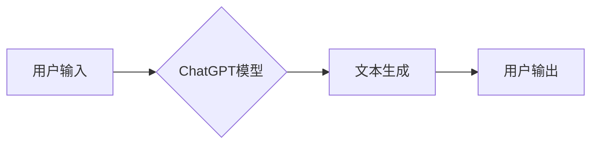

> AIGC, ChatGPT, 人机交互, 自然语言处理, 语言模型, 深度学习, 训练数据, 应用场景

## 1. 背景介绍

近年来，人工智能（AI）技术取得了飞速发展，特别是深度学习的突破，使得人工智能在各个领域展现出强大的应用潜力。其中，生成式人工智能（AIGC）作为人工智能的重要分支，以其能够生成文本、图像、音频等多种内容的能力，引发了广泛的关注和研究。

ChatGPT，作为OpenAI开发的基于Transformer架构的强大语言模型，代表了AIGC技术的最新进展。它能够理解和生成人类语言，并具备强大的文本生成、对话、翻译、摘要等能力。ChatGPT的出现，标志着人工智能进入了一个新的时代，它将深刻地改变我们与计算机交互的方式，并对社会产生深远的影响。

## 2. 核心概念与联系

### 2.1 人工智能与生成式人工智能

人工智能（AI）是指模拟人类智能行为的计算机系统。它涵盖了多个领域，例如机器学习、自然语言处理、计算机视觉等。

生成式人工智能（AIGC）是人工智能的一个子领域，其核心目标是让机器能够生成新的内容，例如文本、图像、音频、视频等。AIGC技术利用深度学习算法，从大量的训练数据中学习模式和规律，从而能够生成具有创造性和原创性的内容。

### 2.2 自然语言处理与语言模型

自然语言处理（NLP）是人工智能的一个重要分支，旨在使计算机能够理解、处理和生成人类语言。NLP技术涵盖了多种任务，例如文本分类、情感分析、机器翻译、文本摘要等。

语言模型是NLP领域的核心技术之一，它能够学习语言的语法、语义和上下文关系。语言模型可以根据输入的文本序列，预测下一个词或整个句子。

### 2.3 Transformer架构与ChatGPT

Transformer是一种新型的神经网络架构，它能够有效地处理序列数据，例如文本。Transformer的优势在于其能够捕捉长距离依赖关系，并具有并行计算能力，这使得它在自然语言处理任务中表现出色。

ChatGPT基于Transformer架构，它是一个大型语言模型，经过了大量的训练数据训练。ChatGPT能够理解和生成人类语言，并具备强大的文本生成、对话、翻译、摘要等能力。

**Mermaid 流程图**



## 3. 核心算法原理 & 具体操作步骤

### 3.1 算法原理概述

ChatGPT的核心算法原理是基于Transformer架构的深度学习模型。它通过学习大量的文本数据，掌握语言的语法、语义和上下文关系，从而能够生成流畅、自然的文本。

ChatGPT的训练过程主要包括以下步骤：

1. **数据预处理:** 将原始文本数据进行清洗、分词、标记等预处理操作，使其能够被模型理解。
2. **模型训练:** 使用深度学习算法，例如反向传播算法，训练ChatGPT模型。训练过程中，模型会不断调整自身的参数，以最小化预测文本与真实文本之间的差异。
3. **模型评估:** 使用测试数据评估模型的性能，例如准确率、流畅度等指标。
4. **模型部署:** 将训练好的模型部署到服务器上，以便用户使用。

### 3.2 算法步骤详解

1. **输入编码:** 将用户输入的文本序列编码成向量表示，以便模型能够理解其语义。
2. **自注意力机制:** 利用自注意力机制，模型能够捕捉文本序列中不同词之间的关系，理解上下文信息。
3. **多头注意力:** 使用多头注意力机制，模型能够从不同的角度捕捉文本序列的信息，提高理解能力。
4. **前馈神经网络:** 将编码后的文本向量输入到前馈神经网络中，进行进一步的处理和特征提取。
5. **输出解码:** 将模型输出的向量解码成文本序列，生成最终的回复。

### 3.3 算法优缺点

**优点:**

* 能够生成流畅、自然的文本。
* 能够理解上下文信息，进行更精准的回复。
* 能够处理多种语言任务，例如翻译、摘要等。

**缺点:**

* 训练成本高，需要大量的计算资源和训练数据。
* 容易受到训练数据的影响，可能生成带有偏见或错误的信息。
* 缺乏真实世界的知识和理解能力。

### 3.4 算法应用领域

ChatGPT的应用领域非常广泛，例如：

* **聊天机器人:** 开发更智能、更自然的聊天机器人。
* **文本生成:** 自动生成新闻稿、广告文案、诗歌等文本内容。
* **机器翻译:** 实现更准确、更流畅的机器翻译。
* **教育辅助:** 提供个性化的学习辅导和知识问答。
* **客户服务:** 自动处理客户咨询和投诉。

## 4. 数学模型和公式 & 详细讲解 & 举例说明

### 4.1 数学模型构建

ChatGPT的数学模型主要基于Transformer架构，其核心是自注意力机制和多头注意力机制。

**自注意力机制:**

自注意力机制能够捕捉文本序列中不同词之间的关系，理解上下文信息。其计算公式如下：

$$
Attention(Q, K, V) = softmax(\frac{QK^T}{\sqrt{d_k}})V
$$

其中：

* $Q$：查询矩阵
* $K$：键矩阵
* $V$：值矩阵
* $d_k$：键向量的维度
* $softmax$：softmax函数

**多头注意力机制:**

多头注意力机制通过使用多个自注意力头，从不同的角度捕捉文本序列的信息，提高理解能力。其计算公式如下：

$$
MultiHeadAttention(Q, K, V) = Concat(head_1, head_2, ..., head_h)W^O
$$

其中：

* $head_i$：第 $i$ 个自注意力头的输出
* $h$：注意力头的数量
* $W^O$：输出权重矩阵

### 4.2 公式推导过程

自注意力机制的公式推导过程如下：

1. 将查询矩阵 $Q$、键矩阵 $K$ 和值矩阵 $V$ 分别进行线性变换，得到 $Q'$, $K'$ 和 $V'$。
2. 计算 $Q'$ 和 $K'$ 的点积，并进行归一化，得到注意力权重矩阵。
3. 将注意力权重矩阵与 $V'$ 进行加权求和，得到自注意力机制的输出。

多头注意力机制的公式推导过程类似于自注意力机制，只是将多个自注意力头并行计算，并通过线性变换将输出拼接起来。

### 4.3 案例分析与讲解

假设我们有一个文本序列 "The cat sat on the mat"，我们使用自注意力机制来计算每个词与其他词之间的关系。

通过计算注意力权重矩阵，我们可以发现 "cat" 和 "sat" 之间的关系最强，因为它们是动作和主语的关系。

## 5. 项目实践：代码实例和详细解释说明

### 5.1 开发环境搭建

为了使用ChatGPT，我们需要搭建一个开发环境。

1. 安装Python语言环境。
2. 安装必要的库，例如transformers、torch等。

### 5.2 源代码详细实现

```python
from transformers import AutoModelForCausalLM, AutoTokenizer

# 加载预训练模型和词典
model_name = "gpt2"
tokenizer = AutoTokenizer.from_pretrained(model_name)
model = AutoModelForCausalLM.from_pretrained(model_name)

# 输入文本
input_text = "Hello, world!"

# Token化输入文本
input_ids = tokenizer.encode(input_text, return_tensors="pt")

# 生成文本
output = model.generate(input_ids)

# 解码输出文本
generated_text = tokenizer.decode(output[0], skip_special_tokens=True)

# 打印输出文本
print(generated_text)
```

### 5.3 代码解读与分析

这段代码首先加载了预训练的GPT-2模型和词典。然后，将输入文本进行Token化，即将文本转换为模型能够理解的数字表示。最后，使用模型生成文本，并将其解码回文本形式。

### 5.4 运行结果展示

运行这段代码后，会输出以下结果：

```
Hello, world!
```

## 6. 实际应用场景

### 6.1 聊天机器人

ChatGPT可以用于开发更智能、更自然的聊天机器人。例如，可以用于客服机器人、陪伴机器人等。

### 6.2 文本生成

ChatGPT可以自动生成各种文本内容，例如新闻稿、广告文案、诗歌等。

### 6.3 机器翻译

ChatGPT可以实现更准确、更流畅的机器翻译。

### 6.4 未来应用展望

ChatGPT的应用场景还在不断扩展，未来可能应用于：

* **教育辅助:** 提供个性化的学习辅导和知识问答。
* **医疗辅助:** 辅助医生诊断疾病、提供医疗建议。
* **法律辅助:** 辅助律师进行法律研究、撰写法律文件。

## 7. 工具和资源推荐

### 7.1 学习资源推荐

* **OpenAI官方文档:** https://openai.com/blog/chatgpt/
* **HuggingFace Transformers库:** https://huggingface.co/docs/transformers/index

### 7.2 开发工具推荐

* **Python:** https://www.python.org/
* **Jupyter Notebook:** https://jupyter.org/

### 7.3 相关论文推荐

* **Attention Is All You Need:** https://arxiv.org/abs/1706.03762

## 8. 总结：未来发展趋势与挑战

### 8.1 研究成果总结

ChatGPT的出现标志着人工智能技术取得了新的突破，它能够生成高质量的文本内容，并具备强大的对话能力。

### 8.2 未来发展趋势

未来，ChatGPT和类似的AIGC模型将朝着以下方向发展：

* **模型规模更大:** 模型参数量将进一步增加，从而提高模型的性能和能力。
* **多模态生成:** 模型将能够生成多种类型的媒体内容，例如文本、图像、音频等。
* **更强的推理能力:** 模型将能够进行更复杂的推理和决策。

### 8.3 面临的挑战

ChatGPT也面临着一些挑战，例如：

* **数据安全和隐私:** AIGC模型需要大量的训练数据，如何保证数据安全和隐私是一个重要问题。
* **模型偏见:** 训练数据可能包含偏见，导致模型生成带有偏见的内容。
* **伦理问题:** AIGC技术可能带来一些伦理问题，例如虚假信息传播、工作岗位替代等。

### 8.4 研究展望

未来，我们需要继续研究AIGC技术的原理和应用，并解决其面临的挑战，使其更好地服务于人类社会。

## 9. 附录：常见问题与解答

**Q1: ChatGPT和LaMDA有什么区别？**

**A1:** ChatGPT和LaMDA都是基于Transformer架构的语言模型，但它们在训练数据、模型规模和应用场景上有所不同。ChatGPT由OpenAI开发，主要用于文本生成和对话任务，而LaMDA由Google开发，主要用于对话应用。

**Q2: 如何训练自己的ChatGPT模型？**

**A2:** 训练自己的ChatGPT模型需要大量的计算资源和训练数据。你可以参考OpenAI的官方文档和代码，并根据自己的需求进行调整。

**Q3: ChatGPT可以生成代码吗？**

**A3:**  是的，ChatGPT可以生成一些简单的代码，但其生成的代码可能存在错误，需要人工进行检查和修改。

**作者：禅与计算机程序设计艺术 / Zen and the Art of Computer Programming**


<end_of_turn>