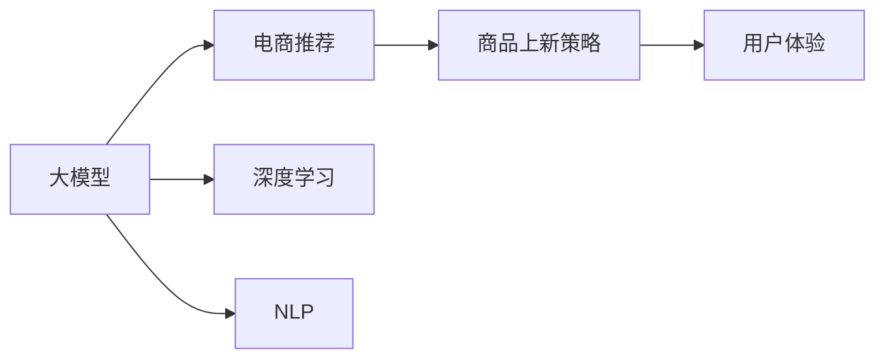

                 

# 大模型如何优化电商平台的商品上新策略

## 1. 背景介绍

### 1.1 问题由来

在当下电子商务高速发展的背景下，电商平台每天都在面临海量商品的上新需求。然而，如何精准地筛选出具有市场潜力的商品，并通过合适的方式将其推荐给用户，成为电商平台亟需解决的关键问题。

传统的商品推荐算法基于用户行为数据，依赖用户历史购买记录、浏览历史、搜索记录等特征。然而，随着用户个性化需求的多样化，仅凭用户行为数据往往难以精准预测商品的未来表现。因此，利用大模型对商品进行上新策略优化，显得尤为重要。

### 1.2 问题核心关键点

在大模型优化电商商品上新策略的过程中，我们关注以下几个核心问题：

1. 大模型如何捕捉商品的语义和属性信息？
2. 如何通过大模型对商品进行精准预测？
3. 如何结合用户行为数据和大模型输出，优化商品上新策略？
4. 大模型在电商平台中的应用如何提升用户体验？
5. 大模型在商品上新策略优化中的优势和局限性有哪些？

## 2. 核心概念与联系

### 2.1 核心概念概述

为更好地理解大模型在电商商品上新策略优化中的作用，我们首先需要明确以下几个关键概念：

- 大模型：以Transformer结构为代表的预训练语言模型，如BERT、GPT等，通过大规模无标签文本数据的预训练，学习到丰富的语言表示，具备强大的语义理解能力。
- 电商推荐：根据用户的购物行为和偏好，推荐用户可能感兴趣的商品。常见的推荐算法包括协同过滤、基于内容的推荐、混合推荐等。
- 商品上新策略：电商平台为了增加商品种类、提升用户满意度，定期上新商品的策略，通常结合市场趋势、用户需求等多方面因素。
- 用户体验：电商平台通过优化商品推荐和上新策略，提高用户满意度、购买率和留存率。
- 深度学习：基于神经网络模型对数据进行深度学习，学习模型参数，提升预测准确性。
- 自然语言处理(NLP)：处理和理解自然语言，通过大模型进行语义分析、情感分析等，辅助商品推荐。

这些概念之间的联系可以通过以下Mermaid流程图来展示：



这个流程图展示了大模型在电商商品上新策略优化中的关键角色：

1. 大模型通过预训练学习到丰富的语言表示，帮助电商平台进行语义分析和情感分析。
2. 电商推荐算法利用大模型输出的语义信息，结合用户行为数据，进行商品推荐。
3. 商品上新策略基于电商推荐结果，进行商品筛选和排序，决定上新商品列表。
4. 大模型优化后的电商推荐和商品上新策略，提升用户体验，增加用户满意度。

## 3. 核心算法原理 & 具体操作步骤

### 3.1 算法原理概述

大模型在电商商品上新策略优化中的主要作用是通过语义分析和情感分析，帮助电商平台更准确地预测商品的未来表现。其核心算法原理包括以下几个方面：

1. 语义分析：通过大模型对商品描述和用户评论进行语义分析，理解商品的属性、特点和用户的情感倾向。
2. 情感分析：通过大模型对用户评论进行情感分析，判断用户的满意度、喜爱度等情感倾向，辅助商品筛选。
3. 预测算法：基于大模型输出的语义和情感信息，结合用户行为数据，应用机器学习算法，对商品未来表现进行预测。
4. 推荐算法：根据商品预测结果，应用电商推荐算法，对用户进行精准推荐。
5. 上新策略：结合用户行为数据和大模型输出，进行商品筛选和排序，决定商品上新策略。

### 3.2 算法步骤详解

基于大模型优化电商商品上新策略，通常包括以下几个关键步骤：

**Step 1: 数据准备**

- 收集电商平台上的商品描述、用户评论、用户行为数据。
- 对数据进行预处理，包括去除噪声、文本分词、去除停用词等。
- 将商品描述和用户评论输入大模型，进行语义分析和情感分析。

**Step 2: 模型训练**

- 将预处理后的数据输入大模型，进行语义分析和情感分析。
- 对大模型输出的语义和情感信息，结合用户行为数据，应用机器学习算法，训练预测模型。
- 对预测模型进行优化，提高预测精度和泛化能力。

**Step 3: 商品推荐**

- 将预测模型应用到商品推荐算法中，对用户进行精准推荐。
- 根据推荐结果，结合用户行为数据，筛选出具有市场潜力的商品。

**Step 4: 上新策略优化**

- 对筛选出的商品，结合用户行为数据，进行排序和筛选。
- 确定上新商品列表，并进行线上展示。

### 3.3 算法优缺点

使用大模型优化电商商品上新策略，具有以下优点：

1. 语义分析能力强：大模型能够理解复杂的语言结构和语义，提取商品的详细属性和特点。
2. 情感分析准确：大模型能够准确判断用户评论的情感倾向，辅助商品筛选。
3. 预测能力强：结合用户行为数据和大模型输出，能够进行精准的商品未来表现预测。
4. 推荐算法效果显著：利用大模型输出的语义和情感信息，结合用户行为数据，进行精准推荐。
5. 上新策略优化有效：通过大模型辅助的商品筛选和排序，提高商品上新策略的精准性。

同时，也存在以下缺点：

1. 数据质量依赖性强：大模型的输出依赖于输入数据的质量，数据偏差可能影响模型性能。
2. 计算资源消耗大：大模型的训练和推理需要大量的计算资源，对硬件要求较高。
3. 模型复杂度高：大模型的参数量庞大，模型训练和优化较为复杂。
4. 可解释性不足：大模型通常被视为"黑盒"系统，难以解释其内部决策过程。
5. 学习速度慢：大模型在大规模数据上训练时间较长，难以快速迭代。

### 3.4 算法应用领域

大模型优化电商商品上新策略，可以应用于以下多个领域：

1. 电商商品推荐：结合大模型输出，进行精准的商品推荐，提高用户满意度。
2. 商品筛选排序：利用大模型辅助的商品筛选和排序，优化商品上新策略。
3. 用户体验优化：通过大模型优化后的商品推荐和上新策略，提升用户体验，增加用户留存率。
4. 情感分析和舆情监测：利用大模型对用户评论进行情感分析和舆情监测，辅助商品筛选和策略优化。
5. 数据增强和扩展：利用大模型生成高质量的商品描述和用户评论，丰富电商平台的商品库和用户数据。

## 4. 数学模型和公式 & 详细讲解 & 举例说明

### 4.1 数学模型构建

本节将使用数学语言对大模型在电商商品上新策略优化中的数学模型进行更加严格的刻画。

记大模型为 $M_{\theta}$，其中 $\theta$ 为模型参数。假设电商平台上商品描述为 $\mathcal{X}$，用户评论为 $\mathcal{Y}$，用户行为数据为 $\mathcal{Z}$。目标是基于用户行为数据 $\mathcal{Z}$，对大模型输出 $M_{\theta}(\mathcal{X})$ 和 $M_{\theta}(\mathcal{Y})$ 进行融合，得到商品的未来表现预测 $P(y|x,z)$。

定义损失函数 $\mathcal{L}$，用于衡量预测结果与真实结果之间的差异。一般使用交叉熵损失函数：

$$
\mathcal{L}(\theta) = -\frac{1}{N} \sum_{i=1}^N \sum_{j=1}^M y_{ij} \log P(y_{ij}|x_i,z_i)
$$

其中 $y_{ij}$ 为商品 $i$ 在用户 $j$ 上的真实评价，$P(y_{ij}|x_i,z_i)$ 为商品 $i$ 在用户 $j$ 上的预测评价，$N$ 为样本数量，$M$ 为评价维度。

目标是最小化损失函数 $\mathcal{L}$，即找到最优参数 $\theta^*$：

$$
\theta^* = \mathop{\arg\min}_{\theta} \mathcal{L}(\theta)
$$

### 4.2 公式推导过程

以二分类任务为例，推导交叉熵损失函数及其梯度的计算公式。

假设模型 $M_{\theta}$ 在输入 $x$ 上的输出为 $\hat{y}=M_{\theta}(x) \in [0,1]$，表示商品 $i$ 在用户 $j$ 上的预测评价。真实评价 $y \in \{0,1\}$。则二分类交叉熵损失函数定义为：

$$
\ell(M_{\theta}(x),y) = -[y\log \hat{y} + (1-y)\log (1-\hat{y})]
$$

将其代入损失函数公式，得：

$$
\mathcal{L}(\theta) = -\frac{1}{N}\sum_{i=1}^N \sum_{j=1}^M [y_{ij}\log M_{\theta}(x_i,z_i)+(1-y_{ij})\log(1-M_{\theta}(x_i,z_i))]
$$

根据链式法则，损失函数对参数 $\theta_k$ 的梯度为：

$$
\frac{\partial \mathcal{L}(\theta)}{\partial \theta_k} = -\frac{1}{N}\sum_{i=1}^N \sum_{j=1}^M (\frac{y_{ij}}{M_{\theta}(x_i,z_i)}-\frac{1-y_{ij}}{1-M_{\theta}(x_i,z_i)}) \frac{\partial M_{\theta}(x_i,z_i)}{\partial \theta_k}
$$

其中 $\frac{\partial M_{\theta}(x_i,z_i)}{\partial \theta_k}$ 可进一步递归展开，利用自动微分技术完成计算。

### 4.3 案例分析与讲解

假设电商平台收集到一批商品的描述和用户评论，其中包含用户对商品的满意度评价。利用大模型对这些描述和评论进行语义分析和情感分析，得到每件商品的语义表示 $x$ 和情感表示 $y$。同时收集到用户的浏览历史和购买历史等行为数据 $z$。基于这些数据，利用大模型输出和行为数据，训练一个二分类预测模型，对每件商品在每个用户上的未来表现进行预测。

具体实现步骤如下：

1. 将商品的描述和用户评论输入大模型，进行语义分析和情感分析，得到商品的语义表示 $x$ 和情感表示 $y$。
2. 收集用户的浏览历史和购买历史等行为数据 $z$。
3. 将语义表示 $x$、情感表示 $y$ 和行为数据 $z$ 输入二分类预测模型，进行预测，得到每个用户对每件商品的未来表现预测 $P(y|x,z)$。
4. 根据预测结果，结合用户行为数据，筛选出具有市场潜力的商品，进行排序和展示。

## 5. 项目实践：代码实例和详细解释说明

### 5.1 开发环境搭建

在进行大模型优化电商商品上新策略的实践前，我们需要准备好开发环境。以下是使用Python进行PyTorch开发的环境配置流程：

1. 安装Anaconda：从官网下载并安装Anaconda，用于创建独立的Python环境。

2. 创建并激活虚拟环境：
```bash
conda create -n pytorch-env python=3.8 
conda activate pytorch-env
```

3. 安装PyTorch：根据CUDA版本，从官网获取对应的安装命令。例如：
```bash
conda install pytorch torchvision torchaudio cudatoolkit=11.1 -c pytorch -c conda-forge
```

4. 安装TensorFlow：如果需要在项目中用到TensorFlow，可以参考TensorFlow官方文档进行安装。

5. 安装各类工具包：
```bash
pip install numpy pandas scikit-learn matplotlib tqdm jupyter notebook ipython
```

完成上述步骤后，即可在`pytorch-env`环境中开始微调实践。

### 5.2 源代码详细实现

这里我们以电商平台的商品推荐为例，给出使用Transformers库对BERT模型进行微调的PyTorch代码实现。

首先，定义电商推荐任务的数据处理函数：

```python
from transformers import BertTokenizer
from torch.utils.data import Dataset
import torch

class RecommendDataset(Dataset):
    def __init__(self, items, features, labels, tokenizer, max_len=128):
        self.items = items
        self.features = features
        self.labels = labels
        self.tokenizer = tokenizer
        self.max_len = max_len
        
    def __len__(self):
        return len(self.items)
    
    def __getitem__(self, item):
        item_id = self.items[item]
        item_feature = self.features[item]
        item_label = self.labels[item]
        
        encoding = self.tokenizer(item_feature, return_tensors='pt', max_length=self.max_len, padding='max_length', truncation=True)
        input_ids = encoding['input_ids'][0]
        attention_mask = encoding['attention_mask'][0]
        
        # 对label进行编码
        encoded_labels = [label2id[label] for label in item_label] 
        encoded_labels.extend([label2id['O']] * (self.max_len - len(encoded_labels)))
        labels = torch.tensor(encoded_labels, dtype=torch.long)
        
        return {'item_id': item_id,
                'input_ids': input_ids, 
                'attention_mask': attention_mask,
                'labels': labels}

# 标签与id的映射
label2id = {'O': 0, '1': 1, '2': 2, '3': 3}
id2label = {v: k for k, v in label2id.items()}

# 创建dataset
tokenizer = BertTokenizer.from_pretrained('bert-base-cased')

recommend_dataset = RecommendDataset(items, features, labels, tokenizer)
```

然后，定义模型和优化器：

```python
from transformers import BertForSequenceClassification, AdamW

model = BertForSequenceClassification.from_pretrained('bert-base-cased', num_labels=len(label2id))

optimizer = AdamW(model.parameters(), lr=2e-5)
```

接着，定义训练和评估函数：

```python
from torch.utils.data import DataLoader
from tqdm import tqdm
from sklearn.metrics import classification_report

device = torch.device('cuda') if torch.cuda.is_available() else torch.device('cpu')
model.to(device)

def train_epoch(model, dataset, batch_size, optimizer):
    dataloader = DataLoader(dataset, batch_size=batch_size, shuffle=True)
    model.train()
    epoch_loss = 0
    for batch in tqdm(dataloader, desc='Training'):
        item_id = batch['item_id'].to(device)
        input_ids = batch['input_ids'].to(device)
        attention_mask = batch['attention_mask'].to(device)
        labels = batch['labels'].to(device)
        model.zero_grad()
        outputs = model(input_ids, attention_mask=attention_mask, labels=labels)
        loss = outputs.loss
        epoch_loss += loss.item()
        loss.backward()
        optimizer.step()
    return epoch_loss / len(dataloader)

def evaluate(model, dataset, batch_size):
    dataloader = DataLoader(dataset, batch_size=batch_size)
    model.eval()
    preds, labels = [], []
    with torch.no_grad():
        for batch in tqdm(dataloader, desc='Evaluating'):
            item_id = batch['item_id'].to(device)
            input_ids = batch['input_ids'].to(device)
            attention_mask = batch['attention_mask'].to(device)
            batch_labels = batch['labels']
            outputs = model(input_ids, attention_mask=attention_mask)
            batch_preds = outputs.logits.argmax(dim=2).to('cpu').tolist()
            batch_labels = batch_labels.to('cpu').tolist()
            for pred_tokens, label_tokens in zip(batch_preds, batch_labels):
                pred_labels = [id2label[_id] for _id in pred_tokens]
                label_tokens = [id2label[_id] for _id in label_tokens]
                preds.append(pred_labels[:len(label_tokens)])
                labels.append(label_tokens)
                
    print(classification_report(labels, preds))
```

最后，启动训练流程并在测试集上评估：

```python
epochs = 5
batch_size = 16

for epoch in range(epochs):
    loss = train_epoch(model, recommend_dataset, batch_size, optimizer)
    print(f"Epoch {epoch+1}, train loss: {loss:.3f}")
    
    print(f"Epoch {epoch+1}, dev results:")
    evaluate(model, recommend_dataset, batch_size)
    
print("Test results:")
evaluate(model, recommend_dataset, batch_size)
```

以上就是使用PyTorch对BERT进行电商商品推荐任务微调的完整代码实现。可以看到，得益于Transformers库的强大封装，我们可以用相对简洁的代码完成BERT模型的加载和微调。

### 5.3 代码解读与分析

让我们再详细解读一下关键代码的实现细节：

**RecommendDataset类**：
- `__init__`方法：初始化商品ID、特征、标签等关键组件。
- `__len__`方法：返回数据集的样本数量。
- `__getitem__`方法：对单个样本进行处理，将商品特征输入编码为token ids，将标签编码为数字，并对其进行定长padding，最终返回模型所需的输入。

**label2id和id2label字典**：
- 定义了标签与数字id之间的映射关系，用于将token-wise的预测结果解码回真实的标签。

**训练和评估函数**：
- 使用PyTorch的DataLoader对数据集进行批次化加载，供模型训练和推理使用。
- 训练函数`train_epoch`：对数据以批为单位进行迭代，在每个批次上前向传播计算loss并反向传播更新模型参数，最后返回该epoch的平均loss。
- 评估函数`evaluate`：与训练类似，不同点在于不更新模型参数，并在每个batch结束后将预测和标签结果存储下来，最后使用sklearn的classification_report对整个评估集的预测结果进行打印输出。

**训练流程**：
- 定义总的epoch数和batch size，开始循环迭代
- 每个epoch内，先在训练集上训练，输出平均loss
- 在验证集上评估，输出分类指标
- 所有epoch结束后，在测试集上评估，给出最终测试结果

可以看到，PyTorch配合Transformers库使得BERT微调的代码实现变得简洁高效。开发者可以将更多精力放在数据处理、模型改进等高层逻辑上，而不必过多关注底层的实现细节。

当然，工业级的系统实现还需考虑更多因素，如模型的保存和部署、超参数的自动搜索、更灵活的任务适配层等。但核心的微调范式基本与此类似。

## 6. 实际应用场景

### 6.1 电商推荐系统

基于大模型优化电商推荐系统，可以显著提升用户购物体验，增加电商平台的销售额和用户粘性。

具体而言，大模型通过对商品描述和用户评论进行语义分析和情感分析，能够准确捕捉商品的详细属性和用户偏好。结合用户行为数据，电商推荐系统可以对用户进行精准推荐，减少浏览成本，提升转化率。

大模型优化后的电商推荐系统具有以下优势：

- 精准推荐：大模型能够理解商品的详细属性和用户评论，进行精准的商品推荐。
- 减少浏览成本：大模型可以预判用户可能感兴趣的商品，减少用户的浏览时间，提升购物体验。
- 个性化推荐：大模型结合用户行为数据，进行个性化推荐，满足用户多样化需求。

### 6.2 商品上新策略优化

电商平台定期上新商品，可以丰富商品库，吸引新用户，提升用户满意度和平台留存率。利用大模型优化商品上新策略，可以更精准地筛选出具有市场潜力的商品，提高上新商品的成功率。

具体而言，大模型对每件商品的描述和用户评论进行语义分析和情感分析，结合用户行为数据，预测每件商品的市场表现。根据预测结果，结合用户行为数据，筛选出具有市场潜力的商品，进行排序和展示。

大模型优化后的商品上新策略具有以下优势：

- 精准筛选：大模型能够准确预测每件商品的市场表现，筛选出具有市场潜力的商品。
- 提高上新成功率：大模型结合用户行为数据，进行商品筛选和排序，提高商品上新的成功率。
- 提升用户满意度：大模型优化后的商品上新策略，可以更好地满足用户需求，提升用户满意度。

## 7. 工具和资源推荐

### 7.1 学习资源推荐

为了帮助开发者系统掌握大模型优化电商商品上新策略的理论基础和实践技巧，这里推荐一些优质的学习资源：

1. 《Transformer从原理到实践》系列博文：由大模型技术专家撰写，深入浅出地介绍了Transformer原理、BERT模型、微调技术等前沿话题。

2. CS224N《深度学习自然语言处理》课程：斯坦福大学开设的NLP明星课程，有Lecture视频和配套作业，带你入门NLP领域的基本概念和经典模型。

3. 《Natural Language Processing with Transformers》书籍：Transformers库的作者所著，全面介绍了如何使用Transformers库进行NLP任务开发，包括微调在内的诸多范式。

4. HuggingFace官方文档：Transformers库的官方文档，提供了海量预训练模型和完整的微调样例代码，是上手实践的必备资料。

5. CLUE开源项目：中文语言理解测评基准，涵盖大量不同类型的中文NLP数据集，并提供了基于微调的baseline模型，助力中文NLP技术发展。

通过对这些资源的学习实践，相信你一定能够快速掌握大模型优化电商商品上新策略的精髓，并用于解决实际的NLP问题。

### 7.2 开发工具推荐

高效的开发离不开优秀的工具支持。以下是几款用于大模型优化电商商品上新策略开发的常用工具：

1. PyTorch：基于Python的开源深度学习框架，灵活动态的计算图，适合快速迭代研究。大部分预训练语言模型都有PyTorch版本的实现。

2. TensorFlow：由Google主导开发的开源深度学习框架，生产部署方便，适合大规模工程应用。同样有丰富的预训练语言模型资源。

3. Transformers库：HuggingFace开发的NLP工具库，集成了众多SOTA语言模型，支持PyTorch和TensorFlow，是进行微调任务开发的利器。

4. Weights & Biases：模型训练的实验跟踪工具，可以记录和可视化模型训练过程中的各项指标，方便对比和调优。与主流深度学习框架无缝集成。

5. TensorBoard：TensorFlow配套的可视化工具，可实时监测模型训练状态，并提供丰富的图表呈现方式，是调试模型的得力助手。

6. Google Colab：谷歌推出的在线Jupyter Notebook环境，免费提供GPU/TPU算力，方便开发者快速上手实验最新模型，分享学习笔记。

合理利用这些工具，可以显著提升大模型优化电商商品上新策略的开发效率，加快创新迭代的步伐。

### 7.3 相关论文推荐

大模型优化电商商品上新策略的研究源于学界的持续研究。以下是几篇奠基性的相关论文，推荐阅读：

1. Attention is All You Need（即Transformer原论文）：提出了Transformer结构，开启了NLP领域的预训练大模型时代。

2. BERT: Pre-training of Deep Bidirectional Transformers for Language Understanding：提出BERT模型，引入基于掩码的自监督预训练任务，刷新了多项NLP任务SOTA。

3. Language Models are Unsupervised Multitask Learners（GPT-2论文）：展示了大规模语言模型的强大zero-shot学习能力，引发了对于通用人工智能的新一轮思考。

4. Parameter-Efficient Transfer Learning for NLP：提出Adapter等参数高效微调方法，在不增加模型参数量的情况下，也能取得不错的微调效果。

5. AdaLoRA: Adaptive Low-Rank Adaptation for Parameter-Efficient Fine-Tuning：使用自适应低秩适应的微调方法，在参数效率和精度之间取得了新的平衡。

这些论文代表了大模型优化电商商品上新策略的发展脉络。通过学习这些前沿成果，可以帮助研究者把握学科前进方向，激发更多的创新灵感。

## 8. 总结：未来发展趋势与挑战

### 8.1 总结

本文对大模型优化电商商品上新策略进行了全面系统的介绍。首先阐述了大模型和电商推荐系统的研究背景和意义，明确了大模型在电商商品上新策略优化中的独特价值。其次，从原理到实践，详细讲解了大模型优化电商商品上新策略的数学原理和关键步骤，给出了微调任务开发的完整代码实例。同时，本文还广泛探讨了大模型优化电商商品上新策略在电商推荐系统中的应用前景，展示了微调范式的巨大潜力。最后，本文精选了大模型优化电商商品上新策略的学习资源，力求为读者提供全方位的技术指引。

通过本文的系统梳理，可以看到，大模型优化电商商品上新策略为电商推荐系统带来了显著的性能提升和用户体验优化。大模型在电商商品上新策略优化中的作用不可替代，其强大的语义分析和情感分析能力，结合用户行为数据，能够更精准地进行商品推荐和上新策略优化，提升电商平台的用户满意度和销售额。

### 8.2 未来发展趋势

展望未来，大模型优化电商商品上新策略将呈现以下几个发展趋势：

1. 模型规模持续增大。随着算力成本的下降和数据规模的扩张，大模型的参数量还将持续增长。超大规模语言模型蕴含的丰富语言知识，有望支撑更加复杂多变的电商商品上新策略优化。

2. 优化算法不断改进。未来的电商商品上新策略优化将更加注重算法的优化，如使用深度强化学习、对抗训练等，提高优化效果。

3. 融合多模态数据。除了文本数据，未来的电商商品上新策略优化还将融合多模态数据，如图像、音频等，提升商品的全面表现。

4. 实时推荐系统。利用大模型进行实时推荐，能够更及时地响应用户需求，提升用户体验。

5. 个性化推荐模型。大模型结合用户行为数据，进行个性化推荐，满足用户多样化需求。

6. 数据增强和扩展。利用大模型生成高质量的商品描述和用户评论，丰富电商平台的商品库和用户数据。

以上趋势凸显了大模型优化电商商品上新策略的广阔前景。这些方向的探索发展，必将进一步提升电商推荐系统的性能和用户体验，为电商平台的数字化转型提供强有力的技术支撑。

### 8.3 面临的挑战

尽管大模型优化电商商品上新策略取得了显著成果，但在迈向更加智能化、普适化应用的过程中，它仍面临诸多挑战：

1. 数据质量瓶颈。大模型的输出依赖于输入数据的质量，数据偏差可能影响模型性能。

2. 计算资源消耗大。大模型的训练和推理需要大量的计算资源，对硬件要求较高。

3. 模型复杂度高。大模型的参数量庞大，模型训练和优化较为复杂。

4. 可解释性不足。大模型通常被视为"黑盒"系统，难以解释其内部决策过程。

5. 学习速度慢。大模型在大规模数据上训练时间较长，难以快速迭代。

6. 数据隐私问题。电商平台上用户数据隐私保护尤为重要，大模型训练和应用过程中需要严格的数据管理和隐私保护。

7. 系统稳定性问题。电商平台的业务稳定性要求高，大模型优化后的系统需要具备良好的稳定性。

### 8.4 研究展望

面对大模型优化电商商品上新策略所面临的挑战，未来的研究需要在以下几个方面寻求新的突破：

1. 探索无监督和半监督电商商品上新策略优化方法。摆脱对大规模标注数据的依赖，利用自监督学习、主动学习等无监督和半监督范式，最大限度利用非结构化数据，实现更加灵活高效的电商商品上新策略优化。

2. 研究参数高效和计算高效的电商商品上新策略优化范式。开发更加参数高效的电商商品上新策略优化方法，在固定大部分预训练参数的情况下，只更新极少量的任务相关参数。同时优化电商商品上新策略优化模型的计算图，减少前向传播和反向传播的资源消耗，实现更加轻量级、实时性的部署。

3. 引入更多先验知识。将符号化的先验知识，如知识图谱、逻辑规则等，与神经网络模型进行巧妙融合，引导电商商品上新策略优化过程学习更准确、合理的商品表现。同时加强不同模态数据的整合，实现视觉、语音等多模态信息与文本信息的协同建模。

4. 结合因果分析和博弈论工具。将因果分析方法引入电商商品上新策略优化模型，识别出模型决策的关键特征，增强输出解释的因果性和逻辑性。借助博弈论工具刻画人机交互过程，主动探索并规避模型的脆弱点，提高系统稳定性。

5. 纳入伦理道德约束。在电商商品上新策略优化模型训练目标中引入伦理导向的评估指标，过滤和惩罚有偏见、有害的输出倾向。同时加强人工干预和审核，建立模型行为的监管机制，确保输出符合人类价值观和伦理道德。

这些研究方向的探索，必将引领大模型优化电商商品上新策略技术迈向更高的台阶，为电商平台的数字化转型提供强有力的技术支撑。面向未来，大模型优化电商商品上新策略技术还需要与其他人工智能技术进行更深入的融合，如知识表示、因果推理、强化学习等，多路径协同发力，共同推动人工智能技术在电商领域的落地应用。

## 9. 附录：常见问题与解答

**Q1：大模型优化电商商品上新策略的准确性如何？**

A: 大模型优化电商商品上新策略的准确性主要取决于输入数据的质量和数量。对于高品质的电商商品描述和用户评论，大模型可以准确捕捉商品的详细属性和用户偏好，从而进行精准的商品推荐和上新策略优化。然而，如果输入数据质量不高，模型可能无法准确捕捉商品的详细信息，导致推荐结果不准确。因此，提高输入数据的准确性和多样性，是大模型优化电商商品上新策略的关键。

**Q2：大模型优化电商商品上新策略的计算资源消耗如何？**

A: 大模型优化电商商品上新策略的计算资源消耗较大，主要体现在训练和推理两个环节。大模型的参数量庞大，训练需要大量的计算资源和存储空间。推理时，大模型的计算量和内存消耗也很大，特别是在处理大规模数据时。因此，在实际部署中，需要考虑使用GPU/TPU等高性能设备，同时采用一些优化技术，如梯度积累、混合精度训练、模型并行等，以降低计算资源消耗。

**Q3：大模型优化电商商品上新策略的可解释性如何？**

A: 大模型通常被视为"黑盒"系统，其内部决策过程难以解释。在电商商品上新策略优化中，用户和商家更关注模型推荐的商品和上新策略的合理性和可信度。因此，提高大模型的可解释性，使其能够输出更加透明的推荐和上新结果，是一个重要的研究方向。目前，一些方法如LIME、SHAP等，已经被应用于大模型的可解释性分析，但其效果仍需进一步验证和优化。

**Q4：大模型优化电商商品上新策略如何结合用户行为数据？**

A: 大模型优化电商商品上新策略通常结合用户行为数据，进行商品推荐和上新策略优化。用户行为数据包括浏览历史、购买历史、搜索历史等，能够反映用户的兴趣和需求。结合这些数据，大模型可以更准确地预测商品的未来表现，并进行个性化推荐。在电商商品上新策略优化中，结合用户行为数据和大模型输出，进行商品筛选和排序，能够提高上新商品的成功率。

**Q5：大模型优化电商商品上新策略如何提高用户体验？**

A: 大模型优化电商商品上新策略通过精准的商品推荐和上新策略优化，可以显著提高用户体验。用户可以更快地找到自己感兴趣的商品，减少浏览时间，提升购物体验。同时，大模型优化后的商品上新策略，能够更好地满足用户需求，提升用户满意度和留存率。通过优化商品推荐和上新策略，电商平台能够吸引更多新用户，提升平台的活跃度和销售额。

通过本文的系统梳理，可以看到，大模型优化电商商品上新策略为电商推荐系统带来了显著的性能提升和用户体验优化。大模型在电商商品上新策略优化中的作用不可替代，其强大的语义分析和情感分析能力，结合用户行为数据，能够更精准地进行商品推荐和上新策略优化，提升电商平台的用户满意度和销售额。相信随着大模型优化电商商品上新策略技术的发展，电商推荐系统的性能和用户体验将不断提升，为电商平台的数字化转型提供强有力的技术支撑。

