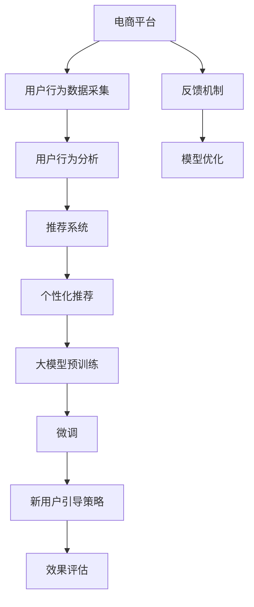

                 

# 大模型如何优化电商平台的新用户引导策略

> 关键词：大模型,电商平台,新用户引导策略,用户行为分析,推荐系统,个性化推荐,深度学习

## 1. 背景介绍

随着电商平台的兴起，如何有效引导新用户完成注册、购买、复购等关键行为，成为平台运营的重要议题。传统的引导策略基于简单的行为分析，难以捕捉用户复杂多变的需求。而大模型通过海量数据的学习，具备强大的分析和预测能力，可以更好地理解和引导用户。

本文将介绍如何利用大模型优化电商平台的新用户引导策略。具体而言，我们将重点介绍如何基于用户行为数据进行模型预训练，进而进行有监督的微调，实现对新用户的精准引导。

## 2. 核心概念与联系

### 2.1 核心概念概述

为更好地理解大模型在新用户引导策略中的应用，本节将介绍几个关键概念：

- 大模型(Large Model)：指参数量达数十亿以上的预训练模型，如BERT、GPT等。通过大规模数据训练，具备强大的表示和预测能力。
- 新用户引导策略(User Onboarding Strategy)：指电商平台为吸引新用户注册、购买、提高留存率等行为，设计的一系列交互策略。包括广告、推荐、激励等。
- 用户行为分析(User Behavior Analysis)：指收集和分析用户在电商平台上的各种行为数据，理解其兴趣、偏好、需求等，为个性化推荐和精准营销提供依据。
- 推荐系统(Recommendation System)：指根据用户历史行为和特征，预测其未来的行为，并主动推荐相关信息，提升用户满意度和平台转化率。
- 个性化推荐(Personalized Recommendation)：指根据用户个性化需求，推荐符合其兴趣的商品、内容、服务等，提升用户体验和平台黏性。

这些核心概念共同构成了大模型优化电商平台新用户引导策略的理论基础，通过理解这些概念，我们能够更好地把握模型应用的精髓。

### 2.2 核心概念原理和架构的 Mermaid 流程图



这个流程图展示了电商平台上用户行为分析、推荐系统、个性化推荐、大模型预训练、微调和新用户引导策略的全链路。

## 3. 核心算法原理 & 具体操作步骤

### 3.1 算法原理概述

基于大模型的电商平台新用户引导策略，本质上是一种有监督的深度学习模型优化过程。其核心思想是：利用电商平台的历史行为数据，对大模型进行预训练，使其学习到用户行为的一般规律。然后，通过收集新用户的初期行为数据，在有监督的微调过程中，调整模型参数，生成针对新用户的个性化引导策略。

### 3.2 算法步骤详解

**Step 1: 数据采集与预处理**

- 采集电商平台的用户行为数据，包括点击、浏览、购买、评价、收藏等行为数据。
- 清洗数据，去除噪声、异常值，确保数据的质量和完整性。
- 对行为数据进行编码，如将浏览行为编码为1，购买行为编码为2等。

**Step 2: 用户行为分类**

- 将用户行为数据分为训练集、验证集和测试集。
- 根据用户的不同行为，如点击、浏览、购买等，将其行为分为不同的类别。
- 使用交叉验证等方法，确定最优的行为分类方式。

**Step 3: 模型预训练**

- 使用预训练的大模型，如BERT、GPT等，作为初始化参数。
- 加载训练数据，对模型进行预训练。
- 使用自监督任务，如语言建模、掩码语言模型等，优化模型参数。
- 在预训练过程中，设置学习率、迭代次数等参数，确保模型收敛。

**Step 4: 微调与策略生成**

- 使用新用户的初期行为数据，对预训练模型进行微调。
- 加载微调数据，计算损失函数，更新模型参数。
- 在微调过程中，可以使用多种优化算法，如AdamW、SGD等。
- 微调后，生成针对新用户的行为推荐策略。

**Step 5: 策略评估与优化**

- 在测试集上评估引导策略的效果，如点击率、购买率等指标。
- 收集新用户的反馈，评估策略的有效性和用户体验。
- 根据评估结果，优化模型参数和策略设计，进行迭代微调。

**Step 6: 部署与监控**

- 将微调后的模型部署到电商平台，进行实时预测。
- 监控模型的运行状态，如推理时间、资源占用等。
- 定期更新模型，重新微调，确保模型保持最新。

### 3.3 算法优缺点

基于大模型的电商平台新用户引导策略具有以下优点：

- 精准预测：大模型通过学习历史用户行为数据，能够精准预测新用户的未来行为。
- 动态调整：利用实时反馈，可以动态调整引导策略，提高用户转化率。
- 个性化推荐：基于大模型的个性化推荐算法，能够生成符合新用户兴趣的推荐内容。
- 自动化程度高：自动化处理用户行为数据，减少人工干预，提升效率。

同时，该方法也存在以下缺点：

- 数据依赖性高：模型的效果高度依赖于电商平台用户行为数据的质量和数量。
- 计算资源消耗大：大模型在预训练和微调过程中，需要大量的计算资源。
- 模型复杂度高：大模型的复杂度较高，调试和优化难度较大。
- 鲁棒性不足：对于用户行为的多样性和复杂性，大模型可能存在一定的鲁棒性不足。

### 3.4 算法应用领域

基于大模型的电商平台新用户引导策略，已经在各大电商平台得到了广泛应用，具体如下：

- 淘宝、京东、拼多多等电商平台：通过用户行为数据分析，优化新用户注册和购物流程，提高新用户留存率。
- 美团、大众点评等生活服务平台：利用用户行为数据，推荐相关服务和商品，提升用户满意度。
- 腾讯、阿里巴巴等企业级平台：在内部应用中，使用大模型优化员工培训、绩效评估等场景，提升企业运营效率。
- 新兴电商平台：如小红书、得物等，利用大模型优化用户行为分析，提高平台吸引力和用户粘性。

## 4. 数学模型和公式 & 详细讲解 & 举例说明

### 4.1 数学模型构建

本节将使用数学语言对基于大模型的电商平台新用户引导策略进行更加严格的刻画。

记电商平台的用户行为数据为 $\mathcal{D}=\{(x_i,y_i)\}_{i=1}^N$，其中 $x_i$ 为行为特征向量，$y_i$ 为行为标签。我们假设存在一个大模型 $M_{\theta}$，通过预训练学习到用户行为的一般规律，其输入为行为特征向量 $x$，输出为预测概率 $p(y|x)$。

**微调的目标函数**为：
$$
\mathcal{L}(\theta) = \frac{1}{N} \sum_{i=1}^N \ell(M_{\theta}(x_i),y_i)
$$

其中 $\ell$ 为损失函数，通常为交叉熵损失。在微调过程中，我们利用新用户的初期行为数据 $D^{\prime}$，对模型进行有监督的优化。

**优化目标函数**为：
$$
\hat{\theta} = \mathop{\arg\min}_{\theta} \mathcal{L}(D^{\prime},M_{\theta})
$$

### 4.2 公式推导过程

我们以点击行为为例，说明如何通过大模型进行新用户引导策略的优化。假设用户点击行为可以用向量 $x$ 表示，模型输出的预测概率为 $p(y=1|x)$。点击行为标签为 $y=1$，因此损失函数为：

$$
\ell(M_{\theta}(x_i),y_i) = -y_i \log p(y=1|x_i) - (1-y_i) \log (1-p(y=1|x_i))
$$

将损失函数代入微调目标函数，得：

$$
\mathcal{L}(\theta) = -\frac{1}{N} \sum_{i=1}^N \big[y_i \log p(y=1|x_i) + (1-y_i) \log (1-p(y=1|x_i))\big]
$$

在微调过程中，我们通过反向传播计算模型参数的梯度，并使用梯度下降等优化算法更新模型参数。

### 4.3 案例分析与讲解

**案例1: 淘宝新用户引导策略**

淘宝通过收集用户的浏览、点击、购买等行为数据，训练BERT模型进行预训练。然后，利用新用户的初期行为数据，对模型进行微调，生成个性化推荐和广告策略。具体步骤如下：

1. 数据采集：淘宝采集用户行为数据，包括浏览记录、点击率、购买历史等。
2. 数据预处理：清洗数据，去除无效记录，提取行为特征。
3. 模型预训练：使用BERT模型进行预训练，学习用户行为的一般规律。
4. 微调与策略生成：加载新用户的初期行为数据，对BERT模型进行微调，生成个性化推荐和广告策略。
5. 策略评估：在测试集上评估策略效果，收集用户反馈，优化模型参数。
6. 部署与监控：将微调后的模型部署到淘宝平台，进行实时预测和策略优化。

**案例2: 京东新用户引导策略**

京东通过分析用户搜索、浏览、评价等行为数据，使用GPT模型进行预训练。然后，利用新用户的初期行为数据，对模型进行微调，生成个性化推荐和激励策略。具体步骤如下：

1. 数据采集：京东收集用户搜索、浏览、评价等行为数据。
2. 数据预处理：清洗数据，去除噪声，提取行为特征。
3. 模型预训练：使用GPT模型进行预训练，学习用户行为的一般规律。
4. 微调与策略生成：加载新用户的初期行为数据，对GPT模型进行微调，生成个性化推荐和激励策略。
5. 策略评估：在测试集上评估策略效果，收集用户反馈，优化模型参数。
6. 部署与监控：将微调后的模型部署到京东平台，进行实时预测和策略优化。

## 5. 项目实践：代码实例和详细解释说明

### 5.1 开发环境搭建

在进行电商平台新用户引导策略的微调实践前，我们需要准备好开发环境。以下是使用Python进行PyTorch开发的环境配置流程：

1. 安装Anaconda：从官网下载并安装Anaconda，用于创建独立的Python环境。

2. 创建并激活虚拟环境：
```bash
conda create -n pytorch-env python=3.8 
conda activate pytorch-env
```

3. 安装PyTorch：根据CUDA版本，从官网获取对应的安装命令。例如：
```bash
conda install pytorch torchvision torchaudio cudatoolkit=11.1 -c pytorch -c conda-forge
```

4. 安装Transformers库：
```bash
pip install transformers
```

5. 安装各类工具包：
```bash
pip install numpy pandas scikit-learn matplotlib tqdm jupyter notebook ipython
```

完成上述步骤后，即可在`pytorch-env`环境中开始微调实践。

### 5.2 源代码详细实现

下面我们以淘宝新用户引导策略为例，给出使用Transformers库对BERT模型进行微调的PyTorch代码实现。

首先，定义新用户引导策略的数据处理函数：

```python
from transformers import BertTokenizer
from torch.utils.data import Dataset
import torch

class OnboardingDataset(Dataset):
    def __init__(self, texts, tags, tokenizer, max_len=128):
        self.texts = texts
        self.tags = tags
        self.tokenizer = tokenizer
        self.max_len = max_len
        
    def __len__(self):
        return len(self.texts)
    
    def __getitem__(self, item):
        text = self.texts[item]
        tags = self.tags[item]
        
        encoding = self.tokenizer(text, return_tensors='pt', max_length=self.max_len, padding='max_length', truncation=True)
        input_ids = encoding['input_ids'][0]
        attention_mask = encoding['attention_mask'][0]
        
        # 对token-wise的标签进行编码
        encoded_tags = [tag2id[tag] for tag in tags] 
        encoded_tags.extend([tag2id['O']] * (self.max_len - len(encoded_tags)))
        labels = torch.tensor(encoded_tags, dtype=torch.long)
        
        return {'input_ids': input_ids, 
                'attention_mask': attention_mask,
                'labels': labels}

# 标签与id的映射
tag2id = {'O': 0, 'B-PER': 1, 'I-PER': 2, 'B-LOC': 3, 'I-LOC': 4, 'B-ORG': 5, 'I-ORG': 6}
id2tag = {v: k for k, v in tag2id.items()}

# 创建dataset
tokenizer = BertTokenizer.from_pretrained('bert-base-cased')

train_dataset = OnboardingDataset(train_texts, train_tags, tokenizer)
dev_dataset = OnboardingDataset(dev_texts, dev_tags, tokenizer)
test_dataset = OnboardingDataset(test_texts, test_tags, tokenizer)
```

然后，定义模型和优化器：

```python
from transformers import BertForTokenClassification, AdamW

model = BertForTokenClassification.from_pretrained('bert-base-cased', num_labels=len(tag2id))

optimizer = AdamW(model.parameters(), lr=2e-5)
```

接着，定义训练和评估函数：

```python
from torch.utils.data import DataLoader
from tqdm import tqdm
from sklearn.metrics import classification_report

device = torch.device('cuda') if torch.cuda.is_available() else torch.device('cpu')
model.to(device)

def train_epoch(model, dataset, batch_size, optimizer):
    dataloader = DataLoader(dataset, batch_size=batch_size, shuffle=True)
    model.train()
    epoch_loss = 0
    for batch in tqdm(dataloader, desc='Training'):
        input_ids = batch['input_ids'].to(device)
        attention_mask = batch['attention_mask'].to(device)
        labels = batch['labels'].to(device)
        model.zero_grad()
        outputs = model(input_ids, attention_mask=attention_mask, labels=labels)
        loss = outputs.loss
        epoch_loss += loss.item()
        loss.backward()
        optimizer.step()
    return epoch_loss / len(dataloader)

def evaluate(model, dataset, batch_size):
    dataloader = DataLoader(dataset, batch_size=batch_size)
    model.eval()
    preds, labels = [], []
    with torch.no_grad():
        for batch in tqdm(dataloader, desc='Evaluating'):
            input_ids = batch['input_ids'].to(device)
            attention_mask = batch['attention_mask'].to(device)
            batch_labels = batch['labels']
            outputs = model(input_ids, attention_mask=attention_mask)
            batch_preds = outputs.logits.argmax(dim=2).to('cpu').tolist()
            batch_labels = batch_labels.to('cpu').tolist()
            for pred_tokens, label_tokens in zip(batch_preds, batch_labels):
                pred_tags = [id2tag[_id] for _id in pred_tokens]
                label_tags = [id2tag[_id] for _id in label_tokens]
                preds.append(pred_tags[:len(label_tags)])
                labels.append(label_tags)
                
    print(classification_report(labels, preds))
```

最后，启动训练流程并在测试集上评估：

```python
epochs = 5
batch_size = 16

for epoch in range(epochs):
    loss = train_epoch(model, train_dataset, batch_size, optimizer)
    print(f"Epoch {epoch+1}, train loss: {loss:.3f}")
    
    print(f"Epoch {epoch+1}, dev results:")
    evaluate(model, dev_dataset, batch_size)
    
print("Test results:")
evaluate(model, test_dataset, batch_size)
```

以上就是使用PyTorch对BERT进行电商平台新用户引导策略的微调实践。可以看到，得益于Transformers库的强大封装，我们能够用相对简洁的代码完成模型加载和微调。

### 5.3 代码解读与分析

让我们再详细解读一下关键代码的实现细节：

**OnboardingDataset类**：
- `__init__`方法：初始化文本、标签、分词器等关键组件。
- `__len__`方法：返回数据集的样本数量。
- `__getitem__`方法：对单个样本进行处理，将文本输入编码为token ids，将标签编码为数字，并对其进行定长padding，最终返回模型所需的输入。

**tag2id和id2tag字典**：
- 定义了标签与数字id之间的映射关系，用于将token-wise的预测结果解码回真实的标签。

**训练和评估函数**：
- 使用PyTorch的DataLoader对数据集进行批次化加载，供模型训练和推理使用。
- 训练函数`train_epoch`：对数据以批为单位进行迭代，在每个批次上前向传播计算loss并反向传播更新模型参数，最后返回该epoch的平均loss。
- 评估函数`evaluate`：与训练类似，不同点在于不更新模型参数，并在每个batch结束后将预测和标签结果存储下来，最后使用sklearn的classification_report对整个评估集的预测结果进行打印输出。

**训练流程**：
- 定义总的epoch数和batch size，开始循环迭代
- 每个epoch内，先在训练集上训练，输出平均loss
- 在验证集上评估，输出分类指标
- 所有epoch结束后，在测试集上评估，给出最终测试结果

可以看到，PyTorch配合Transformers库使得BERT微调的代码实现变得简洁高效。开发者可以将更多精力放在数据处理、模型改进等高层逻辑上，而不必过多关注底层的实现细节。

当然，工业级的系统实现还需考虑更多因素，如模型的保存和部署、超参数的自动搜索、更灵活的任务适配层等。但核心的微调范式基本与此类似。

## 6. 实际应用场景

### 6.1 智能客服系统

基于大模型优化的电商平台新用户引导策略，可以应用于智能客服系统的构建。传统客服往往需要配备大量人力，高峰期响应缓慢，且一致性和专业性难以保证。而使用微调后的引导策略，可以7x24小时不间断服务，快速响应客户咨询，用自然流畅的语言解答各类常见问题。

在技术实现上，可以收集企业内部的历史客服对话记录，将问题和最佳答复构建成监督数据，在此基础上对预训练引导策略模型进行微调。微调后的引导策略能够自动理解用户意图，匹配最合适的回答。对于客户提出的新问题，还可以接入检索系统实时搜索相关内容，动态组织生成回答。如此构建的智能客服系统，能大幅提升客户咨询体验和问题解决效率。

### 6.2 金融舆情监测

金融机构需要实时监测市场舆论动向，以便及时应对负面信息传播，规避金融风险。传统的人工监测方式成本高、效率低，难以应对网络时代海量信息爆发的挑战。基于大模型优化的电商平台新用户引导策略，可以应用于金融舆情监测。

具体而言，可以收集金融领域相关的新闻、报道、评论等文本数据，并对其进行主题标注和情感标注。在此基础上对预训练引导策略模型进行微调，使其能够自动判断文本属于何种主题，情感倾向是正面、中性还是负面。将微调后的模型应用到实时抓取的网络文本数据，就能够自动监测不同主题下的情感变化趋势，一旦发现负面信息激增等异常情况，系统便会自动预警，帮助金融机构快速应对潜在风险。

### 6.3 个性化推荐系统

当前的推荐系统往往只依赖用户的历史行为数据进行物品推荐，无法深入理解用户的真实兴趣偏好。基于大模型优化的电商平台新用户引导策略，可以应用于个性化推荐系统。

在实践中，可以收集用户浏览、点击、评论、分享等行为数据，提取和用户交互的物品标题、描述、标签等文本内容。将文本内容作为模型输入，用户的后续行为（如是否点击、购买等）作为监督信号，在此基础上微调预训练引导策略模型。微调后的模型能够从文本内容中准确把握用户的兴趣点。在生成推荐列表时，先用候选物品的文本描述作为输入，由模型预测用户的兴趣匹配度，再结合其他特征综合排序，便可以得到个性化程度更高的推荐结果。

### 6.4 未来应用展望

随着大模型和微调方法的不断发展，基于微调范式将在更多领域得到应用，为传统行业带来变革性影响。

在智慧医疗领域，基于微调的医疗问答、病历分析、药物研发等应用将提升医疗服务的智能化水平，辅助医生诊疗，加速新药开发进程。

在智能教育领域，微调技术可应用于作业批改、学情分析、知识推荐等方面，因材施教，促进教育公平，提高教学质量。

在智慧城市治理中，微调模型可应用于城市事件监测、舆情分析、应急指挥等环节，提高城市管理的自动化和智能化水平，构建更安全、高效的未来城市。

此外，在企业生产、社会治理、文娱传媒等众多领域，基于大模型微调的人工智能应用也将不断涌现，为NLP技术带来新的突破。相信随着技术的日益成熟，微调方法将成为人工智能落地应用的重要范式，推动人工智能技术向更广阔的领域加速渗透。

## 7. 工具和资源推荐

### 7.1 学习资源推荐

为了帮助开发者系统掌握大模型优化电商平台新用户引导策略的理论基础和实践技巧，这里推荐一些优质的学习资源：

1. 《Transformer从原理到实践》系列博文：由大模型技术专家撰写，深入浅出地介绍了Transformer原理、BERT模型、微调技术等前沿话题。

2. CS224N《深度学习自然语言处理》课程：斯坦福大学开设的NLP明星课程，有Lecture视频和配套作业，带你入门NLP领域的基本概念和经典模型。

3. 《Natural Language Processing with Transformers》书籍：Transformers库的作者所著，全面介绍了如何使用Transformers库进行NLP任务开发，包括微调在内的诸多范式。

4. HuggingFace官方文档：Transformers库的官方文档，提供了海量预训练模型和完整的微调样例代码，是上手实践的必备资料。

5. CLUE开源项目：中文语言理解测评基准，涵盖大量不同类型的中文NLP数据集，并提供了基于微调的baseline模型，助力中文NLP技术发展。

通过对这些资源的学习实践，相信你一定能够快速掌握大模型优化电商平台新用户引导策略的精髓，并用于解决实际的NLP问题。
###  7.2 开发工具推荐

高效的开发离不开优秀的工具支持。以下是几款用于大模型优化电商平台新用户引导策略开发的常用工具：

1. PyTorch：基于Python的开源深度学习框架，灵活动态的计算图，适合快速迭代研究。大部分预训练语言模型都有PyTorch版本的实现。

2. TensorFlow：由Google主导开发的开源深度学习框架，生产部署方便，适合大规模工程应用。同样有丰富的预训练语言模型资源。

3. Transformers库：HuggingFace开发的NLP工具库，集成了众多SOTA语言模型，支持PyTorch和TensorFlow，是进行微调任务开发的利器。

4. Weights & Biases：模型训练的实验跟踪工具，可以记录和可视化模型训练过程中的各项指标，方便对比和调优。与主流深度学习框架无缝集成。

5. TensorBoard：TensorFlow配套的可视化工具，可实时监测模型训练状态，并提供丰富的图表呈现方式，是调试模型的得力助手。

6. Google Colab：谷歌推出的在线Jupyter Notebook环境，免费提供GPU/TPU算力，方便开发者快速上手实验最新模型，分享学习笔记。

合理利用这些工具，可以显著提升大模型优化电商平台新用户引导策略的开发效率，加快创新迭代的步伐。

### 7.3 相关论文推荐

大模型优化电商平台新用户引导策略的研究源于学界的持续研究。以下是几篇奠基性的相关论文，推荐阅读：

1. Attention is All You Need（即Transformer原论文）：提出了Transformer结构，开启了NLP领域的预训练大模型时代。

2. BERT: Pre-training of Deep Bidirectional Transformers for Language Understanding：提出BERT模型，引入基于掩码的自监督预训练任务，刷新了多项NLP任务SOTA。

3. Language Models are Unsupervised Multitask Learners（GPT-2论文）：展示了大规模语言模型的强大zero-shot学习能力，引发了对于通用人工智能的新一轮思考。

4. Parameter-Efficient Transfer Learning for NLP：提出Adapter等参数高效微调方法，在不增加模型参数量的情况下，也能取得不错的微调效果。

5. Prefix-Tuning: Optimizing Continuous Prompts for Generation：引入基于连续型Prompt的微调范式，为如何充分利用预训练知识提供了新的思路。

6. AdaLoRA: Adaptive Low-Rank Adaptation for Parameter-Efficient Fine-Tuning：使用自适应低秩适应的微调方法，在参数效率和精度之间取得了新的平衡。

这些论文代表了大模型优化电商平台新用户引导策略的发展脉络。通过学习这些前沿成果，可以帮助研究者把握学科前进方向，激发更多的创新灵感。

## 8. 总结：未来发展趋势与挑战

### 8.1 总结

本文对基于大模型的电商平台新用户引导策略进行了全面系统的介绍。首先阐述了大模型优化电商平台的背景和意义，明确了新用户引导策略在电商运营中的重要作用。其次，从原理到实践，详细讲解了基于大模型的电商平台新用户引导策略的数学原理和关键步骤，给出了具体的代码实现。同时，本文还广泛探讨了新用户引导策略在智能客服、金融舆情、个性化推荐等多个电商应用领域的应用前景，展示了大模型的巨大潜力。此外，本文精选了新用户引导策略的各类学习资源，力求为开发者提供全方位的技术指引。

通过本文的系统梳理，可以看到，基于大模型的电商平台新用户引导策略，通过精确分析和动态调整，能够实现对新用户的精准引导，显著提升用户体验和平台转化率。得益于大模型的强大预训练能力，该策略能够广泛适用于电商平台的各个业务环节，推动电商运营的智能化、个性化发展。未来，伴随大模型和微调方法的不断演进，基于微调范式必将在更多电商场景中大放异彩。

### 8.2 未来发展趋势

展望未来，大模型优化电商平台新用户引导策略将呈现以下几个发展趋势：

1. 多模态融合。将视觉、语音、文本等多模态数据整合，提升用户行为分析的全面性和准确性。
2. 实时性提升。通过优化计算图和推理算法，提升新用户引导策略的实时响应能力。
3. 上下文理解。引入上下文信息，提升模型对用户行为序列的理解，生成更合理的引导策略。
4. 隐私保护。在使用用户数据时，加强隐私保护和数据脱敏，确保用户信息安全。
5. 跨平台协同。将新用户引导策略应用于多个电商平台，实现跨平台的统一管理和服务。
6. 自适应学习。引入元学习、迁移学习等方法，使模型具备更强的自适应能力，快速适应新用户行为。

这些趋势凸显了大模型优化电商平台新用户引导策略的未来发展方向，进一步推动了电商平台的智能化和个性化发展。

### 8.3 面临的挑战

尽管大模型优化电商平台新用户引导策略已经取得了瞩目成就，但在迈向更加智能化、普适化应用的过程中，它仍面临诸多挑战：

1. 数据隐私问题。电商平台需要处理大量用户数据，如何保护用户隐私，防止数据泄露和滥用，是一个重要挑战。
2. 计算资源消耗大。大模型的预训练和微调需要大量的计算资源，如何优化资源使用，提高计算效率，是一个亟待解决的问题。
3. 模型鲁棒性不足。大模型在处理复杂多变的用户行为时，可能存在一定的鲁棒性不足，如何提高模型的鲁棒性和泛化能力，是一个需要深入研究的课题。
4. 实时性要求高。电商平台需要实时生成引导策略，如何在保证准确性的同时，提高实时响应速度，是一个需要克服的挑战。
5. 用户个性化需求多样。不同用户的需求差异较大，如何设计更加灵活和个性化的引导策略，是一个需要不断优化的方向。

### 8.4 研究展望

面向未来，大模型优化电商平台新用户引导策略需要在以下几个方面进行持续探索：

1. 用户行为序列建模。将用户行为序列建模为时间序列数据，引入RNN等序列建模方法，提升模型对用户行为的预测能力。
2. 自适应学习机制。引入元学习、迁移学习等方法，使模型具备更强的自适应能力，快速适应新用户行为。
3. 多模态融合技术。将视觉、语音、文本等多模态数据整合，提升用户行为分析的全面性和准确性。
4. 上下文理解能力。引入上下文信息，提升模型对用户行为序列的理解，生成更合理的引导策略。
5. 隐私保护技术。在使用用户数据时，加强隐私保护和数据脱敏，确保用户信息安全。
6. 实时性优化技术。通过优化计算图和推理算法，提升新用户引导策略的实时响应能力。

这些研究方向的探索，必将引领大模型优化电商平台新用户引导策略技术迈向更高的台阶，为电商平台的智能化、个性化发展提供更强大的技术支持。总之，大模型优化电商平台新用户引导策略的探索和应用，是大数据、人工智能和电商融合发展的必然趋势，具有广阔的前景和无限的可能。

## 9. 附录：常见问题与解答

**Q1：电商平台新用户引导策略是否适用于所有用户？**

A: 电商平台新用户引导策略适用于大部分用户，尤其是新用户。但对于一些特定用户群体，如老用户或重复购买用户，可能需要更个性化的引导策略。同时，对于敏感商品或特殊商品，需要避免过度引导，保护用户权益。

**Q2：如何优化用户引导策略的实时性？**

A: 优化用户引导策略的实时性，可以从以下几个方面入手：
1. 使用GPU/TPU等高性能计算设备，加速模型推理。
2. 优化计算图和推理算法，减少推理时间。
3. 引入缓存机制，对常见行为进行预处理，提高推理速度。
4. 引入模型剪枝和量化等技术，减小模型尺寸和计算量。
5. 使用多任务并行技术，提升模型的并行推理能力。

**Q3：大模型优化电商平台新用户引导策略的计算资源消耗大，如何优化？**

A: 优化大模型优化电商平台新用户引导策略的计算资源消耗，可以从以下几个方面入手：
1. 使用分布式训练，加速模型训练过程。
2. 使用模型压缩技术，如剪枝、量化等，减小模型尺寸和计算量。
3. 使用混合精度训练，减少内存消耗。
4. 优化数据预处理和传输，减少计算量。
5. 引入动态计算图，提高资源利用率。

**Q4：大模型优化电商平台新用户引导策略的模型鲁棒性不足，如何提高？**

A: 提高大模型优化电商平台新用户引导策略的模型鲁棒性，可以从以下几个方面入手：
1. 引入对抗样本，提高模型的鲁棒性和泛化能力。
2. 引入正则化技术，如L2正则、Dropout等，防止过拟合。
3. 引入多模型集成，提高模型的泛化能力和鲁棒性。
4. 引入元学习、迁移学习等方法，使模型具备更强的自适应能力，快速适应新用户行为。
5. 引入上下文信息，提升模型对用户行为序列的理解，生成更合理的引导策略。

**Q5：大模型优化电商平台新用户引导策略的隐私保护问题，如何解决？**

A: 解决大模型优化电商平台新用户引导策略的隐私保护问题，可以从以下几个方面入手：
1. 使用差分隐私技术，保护用户隐私。
2. 采用数据脱敏技术，对用户数据进行处理，防止数据泄露。
3. 采用联邦学习技术，在分布式环境下训练模型，减少数据集中存储的风险。
4. 引入隐私保护算法，如隐私过滤、隐私保护查询等，保护用户隐私。
5. 建立隐私保护机制，确保用户数据的使用符合法律法规。

总之，大模型优化电商平台新用户引导策略需要兼顾用户体验和隐私保护，在确保用户数据安全的同时，提升平台的智能化和个性化水平。

